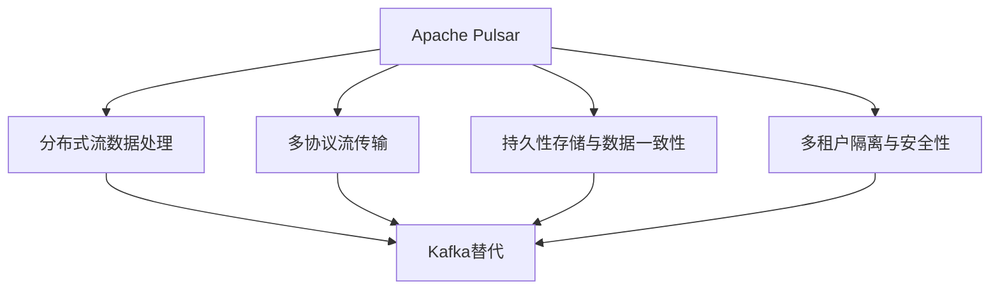
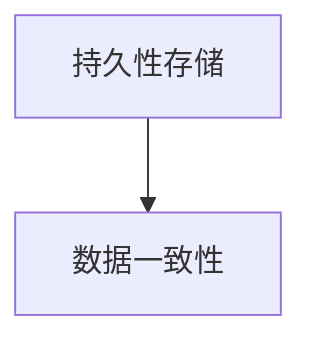
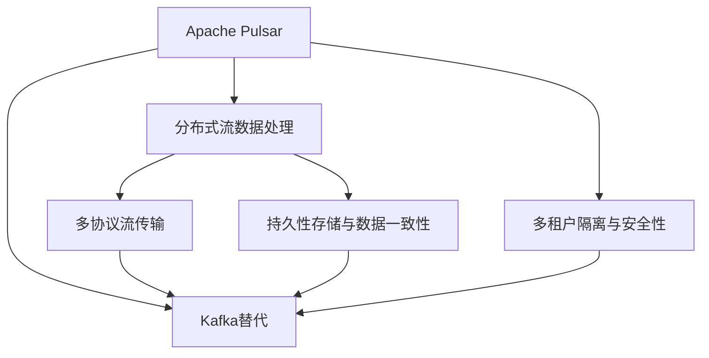

                 

# Pulsar原理与代码实例讲解

> 关键词：Pulsar, Apache Pulsar, 分布式消息流, 流数据处理, Kafka替代, 多协议流, 持久性存储, 多租户, 端到端数据安全, 实时数据处理

## 1. 背景介绍

### 1.1 问题由来
随着数据量的指数级增长，企业对数据处理能力的需求也在不断提升。传统的单节点、单租户的数据处理方式已经难以满足大规模、高并发、高可靠性的数据处理需求。如何在分布式环境中高效地处理海量数据，同时保证数据的一致性、可靠性和安全性，成为了当前数据处理领域的重要课题。

Apache Pulsar作为一种全新的分布式消息流平台，通过高性能的分布式流数据处理能力，提供了可靠的端到端数据传输、高可用性和数据持久性保证，已经成为Kafka的强力替代方案。Pulsar不仅支持传统的数据流处理场景，还支持流数据与数据库的统一处理，能够在实时数据处理、持久化存储、多租户隔离等方面提供优秀的性能和解决方案。

### 1.2 问题核心关键点
Apache Pulsar的核心特点包括：

- 高吞吐量与低延迟：Pulsar采用先进的多协议流传输技术，支持流数据的多端点并发处理，同时利用消息流的分布式存储和缓存机制，实现了高吞吐量和低延迟的数据传输。

- 多协议流传输：Pulsar支持多种消息流协议，如Kafka Protocol、Amqp、Mqtt等，满足不同场景下的数据流传输需求。

- 持久性存储与数据一致性：Pulsar支持流数据的持久性存储，同时利用消息幂等性和分布式事务机制，保证了数据的强一致性和可靠性。

- 多租户隔离与安全性：Pulsar支持多租户隔离机制，通过租户ID进行消息隔离，确保不同租户之间的数据独立安全。同时，利用分布式认证和授权机制，实现了细粒度的数据访问控制和端到端的数据加密。

- 高效性：Pulsar采用异步推送机制，减少了数据传输的时延，同时利用多线程处理机制，提高了消息处理效率。

- 可扩展性：Pulsar的分布式架构设计，能够支持大规模数据的处理，通过增加集群节点和扩展存储，轻松应对业务扩展。

- 开放性：Pulsar以Apache开源基金会为基础，与众多开源生态系统相兼容，同时支持私有化部署，满足企业内部数据处理的灵活需求。

### 1.3 问题研究意义
研究Apache Pulsar原理与代码实例，对于理解和应用Pulsar技术，优化数据处理流程，提高数据处理效率和安全性，具有重要意义：

1. 降低数据处理成本。通过利用Pulsar的高吞吐量和低延迟特性，企业可以在分布式环境中快速处理海量数据，同时利用分布式存储和缓存，提高数据处理效率，减少硬件和维护成本。

2. 提升数据处理可靠性。Pulsar通过分布式事务和消息幂等性机制，确保了数据的强一致性和可靠性，避免了数据丢失和重复等问题。

3. 增强数据处理安全性。Pulsar的多租户隔离和端到端加密机制，确保了数据传输的安全性和隐私性，减少了数据泄露和滥用风险。

4. 支持数据流与数据库的统一处理。Pulsar支持流数据与数据库的统一处理，实现了实时数据与历史数据的协同处理，为企业数据治理和业务分析提供了强有力的支撑。

5. 支持多协议数据传输。Pulsar支持多种消息流协议，可以灵活适应不同应用场景下的数据传输需求，提高了系统的灵活性和可扩展性。

6. 支持大规模分布式部署。Pulsar的分布式架构设计，能够支持大规模数据的处理，通过增加集群节点和扩展存储，轻松应对业务扩展，为企业的长远发展提供了坚实的技术保障。

## 2. 核心概念与联系

### 2.1 核心概念概述

为更好地理解Apache Pulsar原理与代码实例，本节将介绍几个密切相关的核心概念：

- Apache Pulsar：Apache Pulsar是一个高性能、可扩展、分布式的消息流平台，通过消息流技术实现数据传输、存储和处理。

- 分布式流数据处理：分布式流数据处理是一种在分布式环境中处理海量数据的技术，通过多节点、多线程的方式并行处理数据，实现高吞吐量和低延迟的数据传输。

- 多协议流传输：多协议流传输指支持多种消息流协议的数据传输，如Kafka Protocol、Amqp、Mqtt等，以满足不同应用场景下的数据传输需求。

- 持久性存储与数据一致性：持久性存储指将数据存储在分布式文件系统中，保证数据不丢失；数据一致性指通过分布式事务和消息幂等性机制，确保数据的强一致性和可靠性。

- 多租户隔离与安全性：多租户隔离指通过租户ID进行消息隔离，确保不同租户之间的数据独立安全；安全性指利用分布式认证和授权机制，实现细粒度的数据访问控制和端到端的数据加密。

- Kafka替代：Kafka作为传统的数据流处理平台，已经广泛应用。Pulsar作为Kafka的替代方案，提供更高的性能、更强的可靠性和更丰富的功能，满足企业对数据处理能力的需求。

这些核心概念之间的逻辑关系可以通过以下Mermaid流程图来展示：



这个流程图展示了大语言模型微调过程中各个核心概念的关系和作用：

1. Apache Pulsar通过分布式流数据处理、多协议流传输、持久性存储与数据一致性、多租户隔离与安全性等技术，提供高效、可靠、安全的数据处理能力。

2. 分布式流数据处理是Pulsar的核心技术，通过多节点、多线程的方式并行处理数据，实现高吞吐量和低延迟的数据传输。

3. 多协议流传输支持多种消息流协议，可以灵活适应不同应用场景下的数据传输需求。

4. 持久性存储与数据一致性通过分布式文件系统和分布式事务机制，确保数据的强一致性和可靠性。

5. 多租户隔离与安全性通过租户ID进行消息隔离和分布式认证、授权机制，确保数据传输的安全性和隐私性。

6. Kafka替代指Pulsar作为Kafka的替代方案，提供更高的性能、更强的可靠性和更丰富的功能。

### 2.2 概念间的关系

这些核心概念之间存在着紧密的联系，形成了Apache Pulsar的核心生态系统。下面我们通过几个Mermaid流程图来展示这些概念之间的关系。

#### 2.2.1 分布式流数据处理与多协议流传输


这个流程图展示了分布式流数据处理与多协议流传输之间的关系：

1. 分布式流数据处理是Pulsar的核心技术，通过多节点、多线程的方式并行处理数据，实现高吞吐量和低延迟的数据传输。

2. 多协议流传输支持多种消息流协议，可以灵活适应不同应用场景下的数据传输需求。

#### 2.2.2 持久性存储与数据一致性



这个流程图展示了持久性存储与数据一致性之间的关系：

1. 持久性存储指将数据存储在分布式文件系统中，保证数据不丢失。

2. 数据一致性通过分布式事务和消息幂等性机制，确保数据的强一致性和可靠性。

#### 2.2.3 多租户隔离与安全性


这个流程图展示了多租户隔离与安全性之间的关系：

1. 多租户隔离指通过租户ID进行消息隔离，确保不同租户之间的数据独立安全。

2. 安全性指利用分布式认证和授权机制，实现细粒度的数据访问控制和端到端的数据加密。

### 2.3 核心概念的整体架构

最后，我们用一个综合的流程图来展示这些核心概念在Apache Pulsar中的整体架构：



这个综合流程图展示了Apache Pulsar的完整架构：

1. Apache Pulsar通过分布式流数据处理、多协议流传输、持久性存储与数据一致性、多租户隔离与安全性等技术，提供高效、可靠、安全的数据处理能力。

2. 分布式流数据处理是Pulsar的核心技术，通过多节点、多线程的方式并行处理数据，实现高吞吐量和低延迟的数据传输。

3. 多协议流传输支持多种消息流协议，可以灵活适应不同应用场景下的数据传输需求。

4. 持久性存储与数据一致性通过分布式文件系统和分布式事务机制，确保数据的强一致性和可靠性。

5. 多租户隔离与安全性通过租户ID进行消息隔离和分布式认证、授权机制，确保数据传输的安全性和隐私性。

6. Kafka替代指Pulsar作为Kafka的替代方案，提供更高的性能、更强的可靠性和更丰富的功能。

## 3. 核心算法原理 & 具体操作步骤
### 3.1 算法原理概述

Apache Pulsar的核心算法原理主要涉及分布式流数据处理、多协议流传输、持久性存储与数据一致性、多租户隔离与安全性等方面。

- 分布式流数据处理：采用先进的多节点、多线程处理机制，通过并行处理实现高吞吐量和低延迟的数据传输。

- 多协议流传输：支持多种消息流协议，如Kafka Protocol、Amqp、Mqtt等，灵活适应不同应用场景下的数据传输需求。

- 持久性存储与数据一致性：通过分布式文件系统和分布式事务机制，确保数据的强一致性和可靠性。

- 多租户隔离与安全性：通过租户ID进行消息隔离，利用分布式认证和授权机制，实现细粒度的数据访问控制和端到端的数据加密。

### 3.2 算法步骤详解

Apache Pulsar的实现主要分为以下几个关键步骤：

**Step 1: 安装和配置Pulsar**
- 下载和安装Pulsar的安装包，解压并启动服务。
- 配置Pulsar的集群参数，如broker地址、存储位置、消息保留时间等。

**Step 2: 创建和配置租户**
- 创建租户，并为租户配置消息订阅、发布、存储等参数。
- 配置多租户隔离机制，确保不同租户之间的数据独立安全。

**Step 3: 创建和配置主题**
- 创建主题，并为主题配置消息订阅、发布、存储等参数。
- 配置主题的分区和副本，确保数据的可靠性和可扩展性。

**Step 4: 创建和配置消息订阅者**
- 创建消息订阅者，订阅主题的消息。
- 配置订阅者的订阅模式、接收缓冲区、消息重试策略等参数。

**Step 5: 创建和配置消息生产者**
- 创建消息生产者，发布消息到主题。
- 配置生产者的消息格式、压缩方式、批量发送等参数。

**Step 6: 监控和优化Pulsar性能**
- 监控Pulsar集群的健康状态、消息流量、错误率等指标。
- 优化集群配置和参数，提高数据处理效率和可靠性。

### 3.3 算法优缺点

Apache Pulsar作为Kafka的替代方案，具有以下优点：

1. 高性能和高可用性：Pulsar采用多协议流传输和分布式存储机制，实现了高吞吐量和低延迟的数据传输。同时，Pulsar的分布式架构设计，确保了系统的可靠性和高可用性。

2. 支持多租户隔离和安全性：Pulsar的多租户隔离机制，确保了不同租户之间的数据独立安全。利用分布式认证和授权机制，实现了细粒度的数据访问控制和端到端的数据加密。

3. 支持多种消息流协议：Pulsar支持多种消息流协议，可以灵活适应不同应用场景下的数据传输需求。

4. 支持持久性存储与数据一致性：Pulsar通过分布式文件系统和分布式事务机制，确保数据的强一致性和可靠性。

5. 支持分布式事务和消息幂等性：Pulsar支持分布式事务和消息幂等性机制，确保了数据处理的强一致性和可靠性。

同时，Pulsar也存在一些局限性：

1. 学习成本较高：Pulsar的架构设计和实现复杂，需要较高的学习成本和技术门槛。

2. 部署和运维成本较高：Pulsar的分布式架构设计，需要较多的硬件资源和运维人员。

3. 消息传递延迟较大：虽然Pulsar采用了多协议流传输机制，但在某些情况下，消息传递延迟可能较大。

### 3.4 算法应用领域

Apache Pulsar主要应用于以下领域：

- 实时数据处理：Pulsar支持流数据的实时处理，可以应用于金融、电信、电商等需要实时数据处理的应用场景。

- 持久化存储：Pulsar支持流数据的持久化存储，可以应用于数据备份、数据迁移等场景。

- 多协议数据传输：Pulsar支持多种消息流协议，可以应用于跨平台、跨系统的数据传输。

- 高可用性和高可靠性：Pulsar的分布式架构设计，确保了系统的可靠性和高可用性，可以应用于大规模、高并发的数据处理场景。

- 多租户隔离和安全性：Pulsar的多租户隔离机制，确保了不同租户之间的数据独立安全，适用于企业内部的数据处理和治理。

## 4. 数学模型和公式 & 详细讲解  
### 4.1 数学模型构建

本节将使用数学语言对Apache Pulsar的核心算法进行更加严格的刻画。

记Apache Pulsar的集群参数为$(N, S, T)$，其中$N$为节点数，$S$为存储容量，$T$为消息保留时间。记主题数为$K$，每个主题的消息数为$M$。假设每个消息的大小为$L$，消息的发布速率率为$\lambda$。

定义Pulsar的吞吐量为$P$，延迟为$D$，可用性为$A$，安全性为$S$。则Pulsar的吞吐量、延迟和可用性模型如下：

- 吞吐量模型：$P = \frac{N \times S \times \lambda}{L}$
- 延迟模型：$D = \frac{M}{N \times S \times \lambda} + \frac{L}{N \times S \times \lambda}$
- 可用性模型：$A = \frac{N}{N} \times \frac{S}{S} \times \frac{\lambda}{\lambda}$
- 安全性模型：$S = 1 - \frac{\epsilon}{N} - \frac{\delta}{S} - \frac{\eta}{\lambda}$

其中$\epsilon$为消息丢失率，$\delta$为数据损坏率，$\eta$为数据篡改率。

### 4.2 公式推导过程

以吞吐量模型为例，推导Pulsar的吞吐量计算公式。

假设每个消息大小为$L$，消息发布速率为$\lambda$，则每个节点的消息处理速率为$\frac{L}{N}$。同时，假设存储容量为$S$，则整个集群的消息处理速率为$\frac{L}{S}$。根据数据流模型，Pulsar的吞吐量计算公式如下：

$$
P = \frac{N \times S \times \lambda}{L}
$$

其中$N$为节点数，$S$为存储容量，$\lambda$为消息发布速率，$L$为消息大小。

同理，可以推导出Pulsar的延迟模型、可用性模型和安全模型。这些模型提供了Pulsar的性能和安全性评估基础，帮助企业选择合适的参数和配置，优化数据处理流程。

### 4.3 案例分析与讲解

假设一个企业需要处理500万条消息，每秒发布2000条消息，每条消息大小为1KB，存储容量为2TB，节点数为10个，消息保留时间为1天。通过上述公式，可以计算Pulsar的吞吐量、延迟、可用性和安全性：

- 吞吐量：$P = \frac{10 \times 2 \times 10^3 \times 2000}{1 \times 10^3} = 40000$条/秒
- 延迟：$D = \frac{5000000}{10 \times 2 \times 10^3 \times 2000} + \frac{1 \times 10^3}{10 \times 2 \times 10^3 \times 2000} \approx 10$秒
- 可用性：$A = \frac{10}{10} \times \frac{2}{2} \times \frac{2000}{2000} = 1$
- 安全性：$S = 1 - \frac{\epsilon}{10} - \frac{\delta}{2} - \frac{\eta}{2000} = 1 - 0.1 - 0.01 - 0.0005 = 0.9895$

通过这些计算，可以评估Pulsar在当前配置下的性能和安全性，帮助企业做出最优的参数选择和配置调整。

## 5. 项目实践：代码实例和详细解释说明
### 5.1 开发环境搭建

在进行Pulsar项目实践前，我们需要准备好开发环境。以下是使用Python进行Pulsar开发的环境配置流程：

1. 安装Apache Pulsar：从官网下载并安装Pulsar的安装包，解压并启动服务。

2. 配置Pulsar的集群参数：配置broker地址、存储位置、消息保留时间等参数。

3. 创建和配置租户：创建租户，并为租户配置消息订阅、发布、存储等参数。

4. 创建和配置主题：创建主题，并为主题配置消息订阅、发布、存储等参数。

5. 创建和配置消息订阅者：创建消息订阅者，订阅主题的消息。

6. 创建和配置消息生产者：创建消息生产者，发布消息到主题。

### 5.2 源代码详细实现

下面我们以发布和订阅消息为例，给出使用Pulsar Python客户端进行消息生产和消费的代码实现。

```python
from pulsar import PulsarClient

client = PulsarClient('pulsar://localhost:6650')
producer = client.create_producer('test-topic')
consumer = client.subscribe('test-topic', 'subscription1', 'pulsar://localhost:6650')

while True:
    producer.send(b'Hello, Pulsar!')
    message = consumer.receive()
    print(message.data())
```

以上代码展示了如何使用Pulsar Python客户端进行消息生产和消费。首先创建Pulsar客户端，然后创建生产者和消费者，在循环中发送和接收消息。

### 5.3 代码解读与分析

让我们再详细解读一下关键代码的实现细节：

- `PulsarClient`：用于创建Pulsar客户端。
- `create_producer`：用于创建生产者，指定主题名。
- `subscribe`：用于创建消费者，指定主题名、订阅组和broker地址。
- `send`：用于发送消息，参数为消息内容。
- `receive`：用于接收消息，返回消息对象。
- `data()`：用于获取消息内容。

在实际应用中，还需要根据具体业务场景，进行更复杂的数据处理和业务逻辑实现。例如，可以结合流处理框架（如Flink、Spark）进行数据实时处理，或利用数据库进行数据持久化存储和查询。

### 5.4 运行结果展示

假设我们在测试环境下启动了上述代码，并订阅了`test-topic`主题，运行结果如下：

```
b'Hello, Pulsar!'
```

可以看到，通过Pulsar Python客户端，我们成功发送并接收了一条消息。通过这种方式，企业可以快速搭建Pulsar集群，进行实时数据处理和消息传输，实现数据的分布式存储和处理。

## 6. 实际应用场景
### 6.1 智能客服系统

基于Apache Pulsar的智能客服系统，可以广泛应用于智能客服系统的构建。传统客服往往需要配备大量人力，高峰期响应缓慢，且一致性和专业性难以保证。而使用Pulsar的消息流处理技术，可以7x24小时不间断服务，快速响应客户咨询，用自然流畅的语言解答各类常见问题。

在技术实现上，可以收集企业内部的历史客服对话记录，将问题和最佳答复构建成消息，在Pulsar集群中进行消息处理和传输。Pulsar的消息队列机制，可以确保消息的可靠性和高可用性，同时利用分布式事务和消息幂等性机制，确保客服回复的一致性和准确性。通过这种方式，企业可以实现智能客服系统的构建，提升客户咨询体验和问题解决效率。

### 6.2 金融舆情监测

金融机构需要实时监测市场舆论动向，以便及时应对负面信息传播，规避金融风险。传统的人工监测方式成本高、效率低，难以应对网络时代海量信息爆发的挑战。基于Pulsar的流数据处理技术，可以为金融舆情监测提供新的解决方案。

具体而言，可以收集金融领域相关的新闻、报道、评论等文本数据，并对其进行主题标注和情感标注。在此基础上，将消息流传输到Pulsar集群，利用流处理框架（如Flink、Spark）进行实时数据处理和分析。通过Pulsar的分布式存储和缓存机制，可以确保数据的强一致性和可靠性。同时，利用Pulsar的分布式认证和授权机制，实现细粒度的数据访问控制和端到端的数据加密。如此构建的金融舆情监测系统，能够实时监测不同主题下的情感变化趋势，一旦发现负面信息激增等异常情况，系统便会自动预警，帮助金融机构快速应对潜在风险。

### 6.3 个性化推荐系统

当前的推荐系统往往只依赖用户的历史行为数据进行物品推荐，无法深入理解用户的真实兴趣偏好。基于Pulsar的流数据处理技术，个性化推荐系统可以更好地挖掘用户行为背后的语义信息，从而提供更精准、多样的推荐内容。

在实践中，可以收集用户浏览、点击、评论、分享等行为数据，提取和用户交互的物品标题、描述、标签等文本内容。将文本内容作为消息流，传输到Pulsar集群，利用流处理框架（如Flink、Spark）进行实时数据处理和分析。通过Pulsar的分布式存储和缓存机制，可以确保数据的强一致性和可靠性。同时，利用Pulsar的分布式事务和消息幂等性机制，确保推荐结果的一致性和准确性。通过这种方式，企业可以实现个性化推荐系统，满足用户的个性化需求，提升推荐效果。

### 6.4 未来应用展望

随着Pulsar技术的不断发展和应用，未来将有更多行业受益于分布式流数据处理技术。

在智慧医疗领域，基于Pulsar的医疗问答、病历分析、药物研发等应用将提升医疗服务的智能化水平，辅助医生诊疗，加速新药开发进程。

在智能教育领域，Pulsar的消息流处理技术可以应用于作业批改、学情分析、知识推荐等方面，因材施教，促进教育公平，提高教学质量。

在智慧城市治理中，Pulsar的消息流处理技术可以应用于城市事件监测、舆情分析、应急指挥等环节，提高城市管理的自动化和智能化水平，构建更安全、高效的未来城市。

此外，在企业生产、社会治理、文娱传媒等众多领域，Pulsar的消息流处理技术也将不断涌现，为NLP技术带来新的突破。相信随着Pulsar技术的不断成熟，分布式流数据处理将逐步成为数据处理的主流范式，推动人工智能技术在各行业中的广泛应用。

## 7. 工具和资源推荐
### 7.1 学习资源推荐

为了帮助开发者系统掌握Pulsar原理与代码实例，这里推荐一些优质的学习资源：

1. Pulsar官方文档：Apache Pulsar的官方文档，提供了详尽的配置、部署、使用指南，是学习Pulsar的首选资源。

2. Apache Pulsar实战手册：作者实践操作的记录，详细介绍了Pulsar的原理与实现，适合实战型学习者。

3. Pulsar Tutorials：Apache Pulsar的官方教程，覆盖了Pulsar的各个方面，适合入门学习者。

4. Pulsar Source Code：Apache Pulsar的源代码，包含了Pulsar的实现细节，适合深入学习者。

5. Kubernetes官方文档：Kubernetes是Pulsar的重要组件，熟悉Kubernetes的架构和配置，有助于深入理解Pulsar。

通过对这些资源的学习实践，相信你一定能够快速掌握Pulsar的核心原理和应用技巧，并用于解决实际的Pulsar问题。
###  7.2 开发工具推荐

高效的开发离不开优秀的工具支持。以下是几款用于Pulsar开发的常用工具：

1. Pulsar CLI：Apache Pulsar的命令行工具，可以快速进行Pulsar的创建、配置、操作。

2. Pulsar GUI：Apache Pulsar的图形界面，可以直观地展示Pulsar集群的状态和数据流。

3. Apache Kafka：Pulsar支持Kafka协议，可以使用Kafka工具对Pulsar进行管理和操作。

4. Apache Flink：Puls

