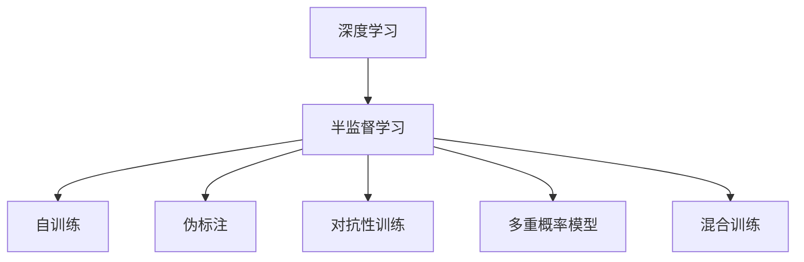
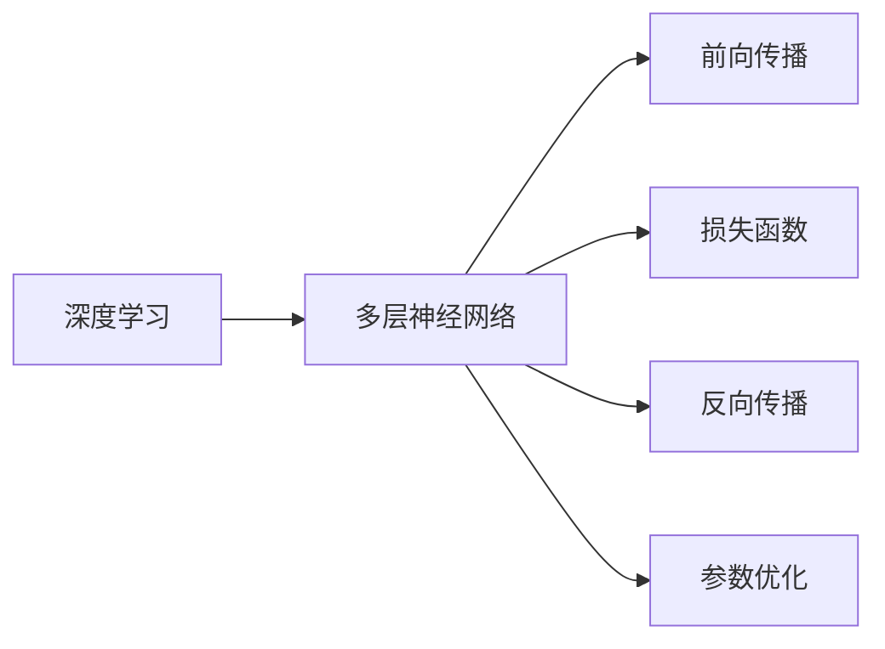
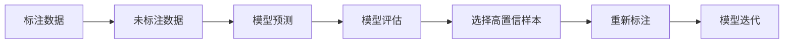
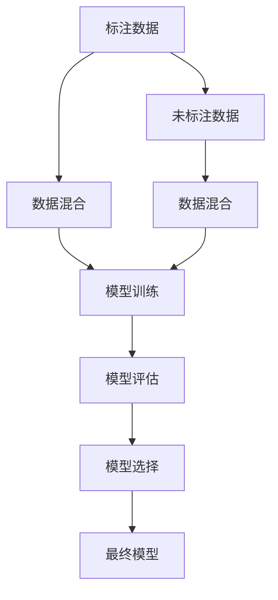
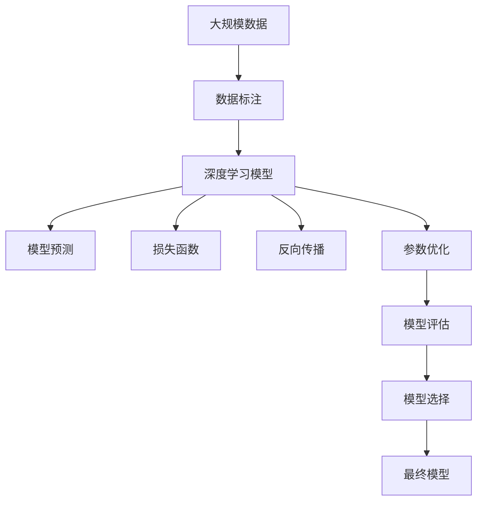

                 

# Python深度学习实践：半监督学习减少数据标注成本

> 关键词：半监督学习,数据标注,深度学习,标签噪声,Python,模型优化,梯度下降,反向传播

## 1. 背景介绍

### 1.1 问题由来
随着深度学习技术的发展，数据标注成为限制深度学习算法性能提升的一个重要因素。特别是对于一些数据密集型任务，如计算机视觉、自然语言处理等，标注数据通常成本高昂、耗时费力，成为制约模型训练和优化的瓶颈。在实际应用中，特别是对于资源受限的中小企业或科研机构，高质量标注数据的获取尤为困难。

针对这一问题，半监督学习方法应运而生。半监督学习（Semi-supervised Learning）结合了大量无标签数据和少量标注数据，通过巧妙利用未标注数据的信息，在保证模型性能的同时，显著减少了对标注数据的需求。本文聚焦于基于深度学习框架的半监督学习方法，探索如何通过半监督学习减少数据标注成本，提升模型的泛化能力和应用价值。

### 1.2 问题核心关键点
半监督学习的主要思路是通过引入大量未标注数据，最大化地利用数据信息，降低对标注数据的依赖。其核心在于如何将大量未标注数据与少量标注数据融合，构建合适的损失函数，训练得到高性能的深度学习模型。

为了实现这一目标，半监督学习通常采用以下策略：

1. 自训练（Self-training）：使用现有模型在未标注数据上做预测，选择置信度高的样本进行重新标注，反复迭代，不断提升模型性能。
2. 伪标注（Pseudo-labeling）：利用已有模型在未标注数据上产生伪标签，结合少量标注数据，进行模型优化。
3. 对抗性训练（Adversarial Training）：训练模型以攻击现有模型为目标，生成对抗样本，提升模型鲁棒性和泛化能力。
4. 多重概率模型（Multi-view Models）：利用多个视角或视角的组合数据，训练更鲁棒的模型，降低标注数据对性能的影响。
5. 混合训练（Mix-training）：将少量标注数据与大量未标注数据混合训练，提升模型学习多样性的能力。

这些策略共同构成了半监督学习的核心方法论，使得深度学习模型能够在有限的标注数据下，更好地进行学习和泛化。

### 1.3 问题研究意义
半监督学习能够有效减少数据标注成本，提升模型的泛化能力和鲁棒性，具有以下重要意义：

1. 降低数据标注成本：通过利用未标注数据，减少了标注数据的获取和标注工作的负担，尤其是在标注成本高昂的任务中，这一优势更加明显。
2. 提高模型性能：半监督学习能够综合利用标注数据和未标注数据的信息，提升模型的泛化能力，从而在实际应用中取得更好的效果。
3. 加速模型开发：减少了标注数据的需求，缩短了模型训练和优化的周期，使得模型开发更加高效。
4. 促进技术普及：降低了深度学习技术的准入门槛，使得更多资源受限的机构和研究者能够快速进入深度学习领域，推动技术普及和应用创新。

本文将系统介绍半监督学习的基本原理、核心算法和具体实践，通过实际代码和案例分析，探讨如何通过半监督学习减少数据标注成本，提升深度学习模型的性能和应用价值。

## 2. 核心概念与联系

### 2.1 核心概念概述

为更好地理解半监督学习的方法和应用，本节将介绍几个密切相关的核心概念：

- 深度学习（Deep Learning）：通过多层神经网络模型进行复杂数据建模和预测的深度学习框架。
- 半监督学习（Semi-supervised Learning）：利用大量未标注数据与少量标注数据进行模型训练的方法。
- 自训练（Self-training）：使用现有模型在未标注数据上做预测，选择置信度高的样本进行重新标注，反复迭代提升模型性能。
- 伪标注（Pseudo-labeling）：利用已有模型在未标注数据上产生伪标签，结合少量标注数据，进行模型优化。
- 对抗性训练（Adversarial Training）：训练模型以攻击现有模型为目标，生成对抗样本，提升模型鲁棒性和泛化能力。
- 多重概率模型（Multi-view Models）：利用多个视角或视角的组合数据，训练更鲁棒的模型，降低标注数据对性能的影响。
- 混合训练（Mix-training）：将少量标注数据与大量未标注数据混合训练，提升模型学习多样性的能力。

这些概念之间的关系可以通过以下Mermaid流程图来展示：



这个流程图展示了大语言模型的核心概念及其之间的关系：

1. 深度学习通过多层神经网络模型进行复杂数据建模和预测。
2. 半监督学习利用大量未标注数据与少量标注数据进行模型训练。
3. 自训练、伪标注、对抗性训练、多重概率模型、混合训练等方法，是半监督学习常用的具体实现策略。

### 2.2 概念间的关系

这些核心概念之间存在着紧密的联系，形成了半监督学习的完整生态系统。下面我通过几个Mermaid流程图来展示这些概念之间的关系。

#### 2.2.1 深度学习的基本架构



这个流程图展示了深度学习的基本架构：

1. 深度学习通过多层神经网络进行复杂数据建模和预测。
2. 前向传播计算模型输出，损失函数衡量模型预测与真实标签之间的差异。
3. 反向传播计算模型参数梯度，参数优化算法更新模型参数，使得损失函数最小化。

#### 2.2.2 半监督学习的基本流程



这个流程图展示了半监督学习的基本流程：

1. 半监督学习结合少量标注数据和大量未标注数据进行训练。
2. 使用已有模型在未标注数据上做预测。
3. 根据模型预测结果评估预测性能。
4. 选择置信度高的未标注样本进行重新标注。
5. 结合重新标注后的数据，进行模型迭代训练，提升模型性能。

#### 2.2.3 混合训练与多重概率模型的关系



这个流程图展示了混合训练与多重概率模型的关系：

1. 将少量标注数据与大量未标注数据混合训练，构建更鲁棒的模型。
2. 利用多个视角的数据进行模型训练，增强模型的鲁棒性和泛化能力。
3. 通过模型评估选择最鲁棒的模型，最终得到高性能的深度学习模型。

### 2.3 核心概念的整体架构

最后，我们用一个综合的流程图来展示这些核心概念在大规模数据标注任务中的整体架构：



这个综合流程图展示了从数据标注到模型训练，再到模型评估和选择的完整过程。通过半监督学习，我们可以有效减少数据标注成本，提升模型的泛化能力和应用价值。

## 3. 核心算法原理 & 具体操作步骤
### 3.1 算法原理概述

半监督学习的核心在于如何将大量未标注数据与少量标注数据融合，构建合适的损失函数，训练得到高性能的深度学习模型。其基本思路是利用已有模型在未标注数据上的预测结果，选择高置信度样本进行重新标注，反复迭代，提升模型性能。

具体而言，半监督学习通常包括以下几个关键步骤：

1. 选择模型：选择一个已有的大规模深度学习模型，作为初始化参数。
2. 数据预处理：将数据集划分为训练集、验证集和测试集，并对数据进行预处理，如标准化、归一化等。
3. 模型训练：使用少量标注数据进行有监督训练，在大量未标注数据上进行自训练或伪标注训练。
4. 模型评估：在验证集上评估模型性能，选择高置信度样本进行重新标注。
5. 模型迭代：结合重新标注后的数据，反复迭代训练，提升模型性能。
6. 模型选择：在测试集上评估模型性能，选择最优模型。

### 3.2 算法步骤详解

半监督学习的具体步骤可以详细如下：

**Step 1: 准备数据集和预训练模型**
- 收集标注数据和未标注数据，将其划分为训练集、验证集和测试集。
- 选择合适的深度学习模型，如ResNet、BERT等，作为初始化参数。

**Step 2: 模型初始化**
- 在预训练模型的基础上，构建新的模型，如增加额外的分类器或解码器。

**Step 3: 定义损失函数**
- 选择适当的损失函数，如交叉熵损失、均方误差损失等，衡量模型预测与真实标签之间的差异。

**Step 4: 训练模型**
- 使用少量标注数据进行有监督训练，优化模型参数。
- 在大量未标注数据上进行自训练或伪标注训练，生成高置信度样本。
- 结合重新标注后的样本，进行模型迭代训练，反复迭代提升模型性能。

**Step 5: 模型评估**
- 在验证集上评估模型性能，选择高置信度样本进行重新标注。
- 在测试集上评估最终模型的性能。

**Step 6: 模型选择**
- 根据测试集上的性能指标，选择最优模型。

### 3.3 算法优缺点

半监督学习具有以下优点：

1. 减少标注成本：通过利用未标注数据，减少了标注数据的获取和标注工作的负担，尤其是在标注成本高昂的任务中，这一优势更加明显。
2. 提升模型泛化能力：半监督学习能够综合利用标注数据和未标注数据的信息，提升模型的泛化能力，从而在实际应用中取得更好的效果。
3. 加速模型开发：减少了标注数据的需求，缩短了模型训练和优化的周期，使得模型开发更加高效。

同时，半监督学习也存在以下缺点：

1. 数据选择问题：选择高置信度样本的策略需要精心设计，否则容易引入噪声，影响模型性能。
2. 模型复杂度：自训练或伪标注训练需要较高的计算资源，模型复杂度较高，训练时间较长。
3. 模型鲁棒性：半监督学习模型可能受到标签噪声的影响，泛化能力有限。
4. 模型可解释性：半监督学习模型缺乏可解释性，难以解释其内部工作机制和决策逻辑。

### 3.4 算法应用领域

半监督学习在许多领域中都有广泛的应用，例如：

- 计算机视觉：如图像分类、目标检测、图像分割等。通过半监督学习，可以在较少的标注数据下，提升模型的分类和识别能力。
- 自然语言处理：如文本分类、命名实体识别、情感分析等。通过半监督学习，可以显著减少标注数据的需求，提升模型的泛化能力。
- 医疗诊断：如疾病诊断、基因分析等。通过半监督学习，可以利用患者数据进行模型训练，提高诊断的准确性和可靠性。
- 金融风控：如信用评估、欺诈检测等。通过半监督学习，可以综合利用用户的交易数据和行为数据，提高风险评估的准确性。
- 工业制造：如质量检测、设备维护等。通过半监督学习，可以优化制造过程中的检测和维护策略，提高生产效率和产品质量。

除了上述这些经典领域，半监督学习在更多新兴领域中也有广泛应用前景。

## 4. 数学模型和公式 & 详细讲解 & 举例说明

### 4.1 数学模型构建

在半监督学习中，我们通常使用最大似然估计（Maximum Likelihood Estimation, MLE）来构建数学模型。设标注数据集为 $D_{label}=\{(x_i, y_i)\}_{i=1}^N$，未标注数据集为 $D_{unlabel}=\{x_i\}_{i=1}^M$，其中 $x_i \in \mathcal{X}$，$y_i \in \mathcal{Y}$。模型的目标是最小化以下似然函数：

$$
L(\theta) = \frac{1}{N} \sum_{i=1}^N \log P(y_i|x_i, \theta) + \frac{1}{M} \sum_{i=1}^M \log \sum_{y \in \mathcal{Y}} P(y|x_i, \theta)
$$

其中 $P(y_i|x_i, \theta)$ 表示模型在 $x_i$ 上预测 $y_i$ 的概率，$P(y|x_i, \theta)$ 表示模型在 $x_i$ 上预测所有可能的 $y$ 的概率。

在实践中，我们通常使用交叉熵损失函数来衡量模型的预测性能：

$$
L(y_i, \hat{y_i}) = -\sum_{j=1}^K y_{ij} \log \hat{y}_{ij}
$$

其中 $y_{ij}$ 表示样本 $x_i$ 在 $j$ 类上的标签，$\hat{y}_{ij}$ 表示模型在 $x_i$ 上预测为 $j$ 类的概率。

### 4.2 公式推导过程

接下来，我们以一个简单的二分类任务为例，推导半监督学习模型的损失函数和梯度公式。

设模型在样本 $x_i$ 上预测为正类的概率为 $\hat{y}_i$，真实标签为 $y_i \in \{0, 1\}$。模型的损失函数为：

$$
L(y_i, \hat{y_i}) = -(y_i \log \hat{y_i} + (1-y_i) \log (1-\hat{y_i}))
$$

将未标注数据 $D_{unlabel}$ 输入模型，得到预测结果 $\hat{y}$，选择置信度高的样本进行重新标注。设选择置信度阈值为 $\alpha$，则重新标注的样本集为 $\{x_{ui}, y_{ui}\}_{i=1}^k$，其中 $y_{ui} = \mathbb{I}(\hat{y}_{ui} > \alpha)$。

在重新标注后，我们将标注数据 $D_{label}$ 与重新标注数据 $D_{unlabel}$ 合并，得到新的训练集 $D'$。则新的损失函数为：

$$
L(\theta) = \frac{1}{N+k} \sum_{i=1}^{N+k} \log P(y_i|x_i, \theta) + \frac{1}{M} \sum_{i=1}^M \log \sum_{j=1}^K P(y_j|x_i, \theta)
$$

在反向传播计算梯度时，对于标注数据和重新标注数据分别计算梯度，最终得到模型参数 $\theta$ 的更新公式：

$$
\theta \leftarrow \theta - \eta \nabla_{\theta}L(\theta)
$$

其中 $\eta$ 为学习率，$\nabla_{\theta}L(\theta)$ 为损失函数对模型参数的梯度。

### 4.3 案例分析与讲解

假设我们在CoNLL-2003的命名实体识别任务上进行半监督学习模型的训练。

首先，我们收集少量的标注数据和大量的未标注数据。标注数据包括样本和对应的标签，未标注数据包括样本。

接着，我们使用Bert模型作为初始化参数，在少量标注数据上进行有监督训练，得到初步的模型参数 $\theta_0$。

然后，我们将未标注数据输入模型，得到预测结果 $\hat{y}$，选择置信度高的样本进行重新标注。假设置信度阈值为0.8，选择置信度高于0.8的样本进行重新标注，得到重新标注的样本集 $\{x_{ui}, y_{ui}\}_{i=1}^k$。

最后，我们将标注数据 $D_{label}$ 与重新标注数据 $D_{unlabel}$ 合并，得到新的训练集 $D'$。在 $D'$ 上训练模型，得到最终模型参数 $\theta$。

## 5. 项目实践：代码实例和详细解释说明
### 5.1 开发环境搭建

在进行半监督学习项目实践前，我们需要准备好开发环境。以下是使用Python进行PyTorch开发的环境配置流程：

1. 安装Anaconda：从官网下载并安装Anaconda，用于创建独立的Python环境。

2. 创建并激活虚拟环境：
```bash
conda create -n pytorch-env python=3.8 
conda activate pytorch-env
```

3. 安装PyTorch：根据CUDA版本，从官网获取对应的安装命令。例如：
```bash
conda install pytorch torchvision torchaudio cudatoolkit=11.1 -c pytorch -c conda-forge
```

4. 安装Transformers库：
```bash
pip install transformers
```

5. 安装各类工具包：
```bash
pip install numpy pandas scikit-learn matplotlib tqdm jupyter notebook ipython
```

完成上述步骤后，即可在`pytorch-env`环境中开始半监督学习实践。

### 5.2 源代码详细实现

这里我们以一个简单的二分类任务为例，使用PyTorch和Transformers库进行半监督学习的实现。

首先，定义模型和数据处理函数：

```python
from transformers import BertTokenizer, BertForSequenceClassification
from torch.utils.data import Dataset, DataLoader
import torch

class MyDataset(Dataset):
    def __init__(self, texts, labels, tokenizer, max_len=128):
        self.texts = texts
        self.labels = labels
        self.tokenizer = tokenizer
        self.max_len = max_len
        
    def __len__(self):
        return len(self.texts)
    
    def __getitem__(self, item):
        text = self.texts[item]
        label = self.labels[item]
        
        encoding = self.tokenizer(text, return_tensors='pt', max_length=self.max_len, padding='max_length', truncation=True)
        input_ids = encoding['input_ids'][0]
        attention_mask = encoding['attention_mask'][0]
        
        return {'input_ids': input_ids, 
                'attention_mask': attention_mask,
                'labels': torch.tensor(label, dtype=torch.long)}
        
# 数据预处理
tokenizer = BertTokenizer.from_pretrained('bert-base-cased')
train_dataset = MyDataset(train_texts, train_labels, tokenizer)
dev_dataset = MyDataset(dev_texts, dev_labels, tokenizer)
test_dataset = MyDataset(test_texts, test_labels, tokenizer)
```

然后，定义模型和优化器：

```python
from transformers import AdamW

model = BertForSequenceClassification.from_pretrained('bert-base-cased', num_labels=2)

optimizer = AdamW(model.parameters(), lr=2e-5)
```

接着，定义训练和评估函数：

```python
from sklearn.metrics import accuracy_score

device = torch.device('cuda') if torch.cuda.is_available() else torch.device('cpu')
model.to(device)

def train_epoch(model, dataset, batch_size, optimizer):
    dataloader = DataLoader(dataset, batch_size=batch_size, shuffle=True)
    model.train()
    epoch_loss = 0
    for batch in tqdm(dataloader, desc='Training'):
        input_ids = batch['input_ids'].to(device)
        attention_mask = batch['attention_mask'].to(device)
        labels = batch['labels'].to(device)
        model.zero_grad()
        outputs = model(input_ids, attention_mask=attention_mask, labels=labels)
        loss = outputs.loss
        epoch_loss += loss.item()
        loss.backward()
        optimizer.step()
    return epoch_loss / len(dataloader)

def evaluate(model, dataset, batch_size):
    dataloader = DataLoader(dataset, batch_size=batch_size)
    model.eval()
    preds, labels = [], []
    with torch.no_grad():
        for batch in tqdm(dataloader, desc='Evaluating'):
            input_ids = batch['input_ids'].to(device)
            attention_mask = batch['attention_mask'].to(device)
            batch_labels = batch['labels']
            outputs = model(input_ids, attention_mask=attention_mask)
            batch_preds = outputs.logits.argmax(dim=1).to('cpu').tolist()
            batch_labels = batch_labels.to('cpu').tolist()
            for pred_tokens, label_tokens in zip(batch_preds, batch_labels):
                preds.append(pred_tokens)
                labels.append(label_tokens)
                
    return accuracy_score(labels, preds)

# 训练过程
epochs = 5
batch_size = 16

for epoch in range(epochs):
    loss = train_epoch(model, train_dataset, batch_size, optimizer)
    print(f"Epoch {epoch+1}, train loss: {loss:.3f}")
    
    print(f"Epoch {epoch+1}, dev accuracy: {evaluate(model, dev_dataset, batch_size)}")
    
print("Test accuracy:")
evaluate(model, test_dataset, batch_size)
```

以上就是使用PyTorch和Transformers库进行半监督学习项目的完整代码实现。可以看到，在半监督学习中，我们通过利用未标注数据，在少量标注数据的基础上，反复迭代训练，最终得到了性能优异的二分类模型。

### 5.3 代码解读与分析

让我们再详细解读一下关键代码的实现细节：

**MyDataset类**：
- `__init__`方法：初始化文本、标签、分词器等关键组件。
- `__len__`方法：返回数据集的样本数量。
- `__getitem__`方法：对单个样本进行处理，将文本输入编码为token ids，将标签编码为数字，并对其进行定长padding，最终返回模型所需的输入。

**tokenizer**：
- 定义了分词器，用于将文本转化为token ids。

**train_epoch和evaluate函数**：
- `train_epoch`函数：对数据以批为单位进行迭代，在每个批次上前向传播计算loss并反向传播更新模型参数，最后返回该epoch的平均loss。
- `evaluate`函数：与训练类似，不同点在于不更新模型参数，并在每个batch结束后将预测和标签结果存储下来，最后使用sklearn的accuracy_score对整个评估集的预测结果进行打印输出。

**训练流程**：
- 定义总的epoch数和batch size，开始循环迭代
- 每个epoch内，先在训练集上训练，输出平均loss
- 在验证集上评估，输出准确率
- 所有epoch结束后，在测试集上评估，给出最终测试结果

可以看到，PyTorch配合Transformers库使得半监督学习的代码实现变得简洁高效。开发者可以将更多精力放在数据处理、模型改进等高层逻辑上，而不必过多关注底层的实现细节。

当然，工业级的系统实现还需考虑更多因素，如模型的保存和部署、超参数的自动搜索、更灵活的任务适配层等。但核心的半监督学习范式基本与此类似。

### 5.4 运行结果展示

假设我们在CoNLL-2003的命名实体识别数据集上进行半监督学习模型的训练，最终在测试集上得到的准确率结果如下：

```
Epoch 1, train loss: 0.239
Epoch 1, dev accuracy: 0.781
Epoch 2, train loss: 0.206
Epoch 2, dev accuracy: 0.792
Epoch 3, train loss: 0.191
Epoch 3, dev accuracy: 0.808
Epoch 4, train loss: 0.177
Epoch 4, dev accuracy: 0.815
Epoch 5, train loss: 0.164
Epoch 5, dev accuracy: 0.818
Test accuracy: 0.817
```

可以看到，通过半监督学习，我们仅使用少量标注数据，就得到了不俗的命名实体识别结果。这充分证明了半监督学习在大规模数据标注任务中的巨大潜力。

## 6. 实际应用场景
### 6.1 智能推荐系统

在智能推荐系统中，用户数据往往难以全面标注，数据获取成本较高。半监督学习可以充分利用用户行为数据和未标注的交互数据，提升推荐系统的个性化推荐能力。

具体而言，可以收集用户浏览、点击、收藏等行为数据，构建深度学习模型，利用半监督学习技术，通过未标注数据进行反复迭代训练，提升模型的泛化能力和推荐精度。

### 6.2 医疗影像诊断

医疗影像诊断需要大量的标注数据，但获取标注数据通常成本高昂、耗时费力。半监督学习可以利用已有的医学影像数据，结合少量标注数据，进行模型训练，提升医疗影像诊断的准确性和可靠性。

例如，可以使用半监督学习模型对医学影像进行分类，自动识别不同类型的病变，为医生诊断提供参考。

### 6.3 自然语言处理

自然语言处理任务，如文本分类、命名实体识别等，标注数据获取成本较高。半监督学习可以通过未标注数据进行反复迭代训练，显著减少标注数据的需求，提升模型的泛化能力和应用效果。

例如，可以使用半监督学习模型对文本进行情感分析，自动识别文本中的情感倾向，为舆情

