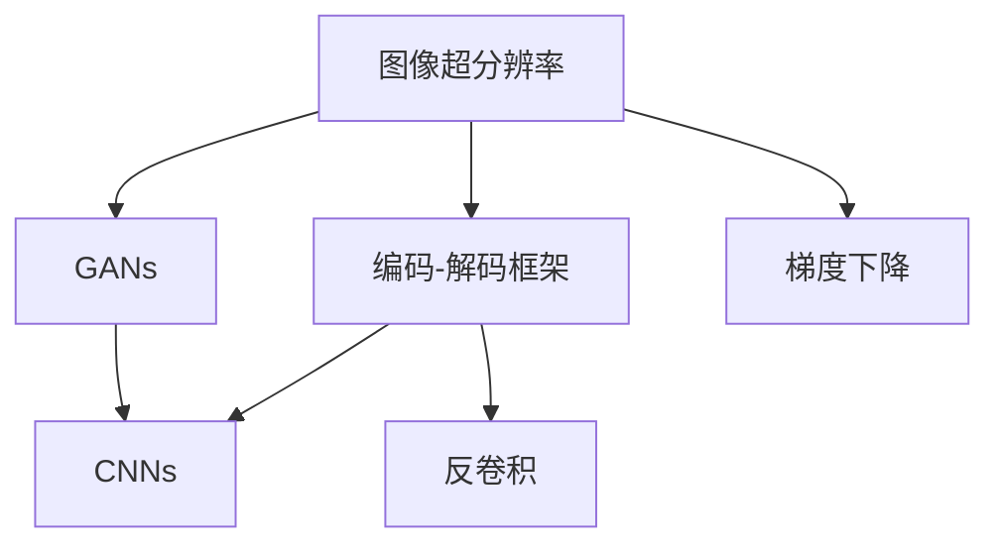

                 

# Python深度学习实践：图像超分辨率重建

> 关键词：图像超分辨率,深度学习,神经网络,卷积神经网络,梯度下降,反卷积,生成对抗网络(GANs),PyTorch

## 1. 背景介绍

### 1.1 问题由来

在图像处理领域，图像超分辨率（Image Super-Resolution, ISR）是一个具有广泛应用价值的课题。随着数字图像设备的普及，高分辨率图像的获取变得越来越容易，但同时也面临着存储和传输成本高的限制。低分辨率图像可以大幅减少数据量，但可能失去重要的细节信息，无法满足高清显示和打印等需求。因此，如何将低分辨率图像复原成高分辨率图像，成为了一个重要的研究问题。

传统超分辨率方法主要依赖于插值算法和边缘增强技术，如双线性插值、双三次插值等。虽然这些方法能在一定程度上提升图像分辨率，但往往存在模糊和伪影等问题。近年来，随着深度学习技术的迅猛发展，利用神经网络进行图像超分辨率重建的方法逐渐被引入，并取得了显著的进展。

深度学习超分辨率方法通过大规模训练数据和复杂的网络结构，学习到丰富的特征表示，能够更好地捕捉图像中的高频细节和纹理信息，生成高清晰度的图像。这些方法通常分为两类：基于编码-解码框架的超分辨率方法和生成对抗网络（GANs）。

## 2. 核心概念与联系

### 2.1 核心概念概述

为更好地理解图像超分辨率的深度学习实践，本节将介绍几个关键概念：

- 图像超分辨率（Image Super-Resolution, ISR）：将低分辨率图像通过网络模型预测生成高分辨率图像的过程。常见的超分辨率任务包括：图像放大、降采样图像复原、超分辨率视频生成等。

- 卷积神经网络（Convolutional Neural Networks, CNNs）：一种经典的神经网络结构，通过卷积层、池化层、全连接层等模块提取和融合图像特征，实现图像分类、识别、分割等任务。

- 梯度下降（Gradient Descent）：一种常用的优化算法，通过计算损失函数对模型参数的梯度，不断更新模型参数，使得损失函数最小化。

- 反卷积（Deconvolution）：卷积层的逆过程，用于将高维特征图转换为低维图像。反卷积层通过卷积核和上采样操作实现图像降采样或图像放大。

- 生成对抗网络（Generative Adversarial Networks, GANs）：由生成器和判别器两个对抗模块组成的网络结构，通过训练两个模块，生成器尝试生成尽可能逼真的图像，判别器尝试区分真实图像和生成图像。

- PyTorch：一个开源的深度学习框架，提供灵活的动态计算图和丰富的预训练模型，支持高效快速的深度学习研究与实践。

这些核心概念共同构成了图像超分辨率深度学习的技术框架，使得通过神经网络方法实现图像分辨率提升成为可能。

### 2.2 概念间的关系

这些核心概念之间存在着紧密的联系，形成了图像超分辨率深度学习的完整生态系统。

- **编码-解码框架**：图像超分辨率的主要深度学习范式之一。低分辨率图像首先通过编码器提取特征，再通过解码器生成高分辨率图像。
- **GANs**：与编码-解码框架不同，GANs通过生成器和判别器的对抗训练，直接生成逼真的高分辨率图像，不再需要显式的特征编码。
- **CNNs**：卷积神经网络是深度学习图像处理的核心组件，在图像超分辨率中，主要用于提取和融合图像特征。
- **反卷积**：在编码-解码框架中，反卷积层用于将高维特征图转换为低维图像，实现降采样或图像放大。
- **梯度下降**：在深度学习中，梯度下降是模型参数优化的基本方法，用于最小化损失函数。

下面我们用一个Mermaid流程图来展示这些概念之间的关系：



这个流程图展示了图像超分辨率深度学习的核心概念及其之间的关系：

1. 图像超分辨率通过编码-解码框架或GANs实现。
2. CNNs是编码器和解码器的主要组成部分，用于特征提取和图像重建。
3. 反卷积层用于将高维特征图转换为低维图像，实现降采样或图像放大。
4. 梯度下降用于优化模型参数，使得损失函数最小化。

这些概念共同构成了图像超分辨率深度学习的完整生态系统，为后续深入讨论提供了清晰的框架。

## 3. 核心算法原理 & 具体操作步骤

### 3.1 算法原理概述

图像超分辨率的深度学习算法主要分为两类：基于编码-解码框架的方法和基于GANs的方法。这里以基于编码-解码框架的方法为例，简要介绍其基本原理。

假设低分辨率图像的大小为 $H\times W$，高分辨率图像的大小为 $U\times V$，其中 $U=4H$，$V=4W$。超分辨率目标是将低分辨率图像 $I_{LR}$ 转换为高分辨率图像 $I_{HR}$，具体过程如下：

1. **编码器**：将低分辨率图像 $I_{LR}$ 输入编码器，提取特征表示 $F$。
2. **解码器**：将特征表示 $F$ 输入解码器，经过一系列反卷积操作生成高分辨率图像 $I_{HR}$。

编码器和解码器的结构通常是对称的，通过共享参数，实现特征的编码和解码。编码器通常包含多个卷积层和池化层，用于提取特征，解码器则包含多个反卷积层和上采样层，用于重建图像。整个模型通过梯度下降等优化算法不断更新参数，最小化损失函数，使得生成的高分辨率图像逼近真实图像。

### 3.2 算法步骤详解

基于编码-解码框架的图像超分辨率算法主要包括以下几个关键步骤：

**Step 1: 准备数据集**

- 收集高分辨率图像数据集和高分辨率图像的降采样图像数据集。
- 将降采样图像作为训练集，高分辨率图像作为测试集。
- 将图像数据进行标准化处理，如归一化、缩放等，以便训练模型。

**Step 2: 设计网络结构**

- 设计编码器网络结构，通常包括多个卷积层和池化层，用于提取特征。
- 设计解码器网络结构，通常包括多个反卷积层和上采样层，用于重建图像。
- 在编码器和解码器之间共享参数，实现特征的编码和解码。

**Step 3: 训练模型**

- 使用卷积神经网络框架（如PyTorch）搭建编码器和解码器。
- 使用梯度下降算法（如Adam、SGD等）优化模型参数。
- 将训练集数据输入模型，通过前向传播计算损失函数，再通过反向传播更新参数。
- 在测试集上评估模型性能，不断调整超参数和网络结构，直到满足预期效果。

**Step 4: 推理和评估**

- 将测试集图像输入模型，通过前向传播生成超分辨率图像。
- 评估生成的超分辨率图像与真实图像的差距，如使用PSNR（Peak Signal-to-Noise Ratio）、SSIM（Structural Similarity Index）等指标。
- 分析生成的图像的清晰度、细节和自然性，评估模型效果。

### 3.3 算法优缺点

基于编码-解码框架的图像超分辨率算法具有以下优点：

1. 能够学习到丰富的特征表示，提升图像细节和纹理信息。
2. 通过特征共享，模型参数量相对较少，计算效率较高。
3. 通过反卷积层，生成的高分辨率图像质量较好。

但其也存在一些缺点：

1. 模型结构相对复杂，训练难度较大。
2. 模型需要大量的训练数据，可能存在过拟合现象。
3. 生成的图像可能存在模糊和伪影等问题。

### 3.4 算法应用领域

图像超分辨率算法已经广泛应用于图像处理和计算机视觉领域，例如：

- 视频增强：将低分辨率视频帧转换为高分辨率视频帧，提升视频播放效果。
- 医学影像：将低分辨率医学影像复原成高分辨率影像，提升诊断精度。
- 遥感图像：将低分辨率遥感图像转换为高分辨率图像，提升分析效果。
- 游戏开发：将低分辨率游戏图像转换为高分辨率图像，提升视觉体验。
- 增强现实：将低分辨率图像转换为高分辨率图像，提升虚拟现实体验。

## 4. 数学模型和公式 & 详细讲解 & 举例说明

### 4.1 数学模型构建

在编码-解码框架中，图像超分辨率的目标是将低分辨率图像 $I_{LR} \in \mathbb{R}^{H \times W \times C}$ 转换为高分辨率图像 $I_{HR} \in \mathbb{R}^{U \times V \times C}$，其中 $U=4H$，$V=4W$。

假设编码器将低分辨率图像 $I_{LR}$ 编码为特征表示 $F \in \mathbb{R}^{d}$，解码器将特征表示 $F$ 解码为高分辨率图像 $I_{HR}$。

设编码器的参数为 $\theta_e$，解码器的参数为 $\theta_d$，则图像超分辨率的优化目标为：

$$
\min_{\theta_e, \theta_d} \| I_{HR} - I_{LR} \|
$$

其中 $\| \cdot \|$ 表示损失函数的范数，如均方误差（MSE）、结构相似性指数（SSIM）等。

### 4.2 公式推导过程

以均方误差（MSE）作为损失函数，推导优化目标的梯度下降公式。

首先，将高分辨率图像 $I_{HR}$ 重构为低分辨率图像 $I_{LR}$ 的函数：

$$
I_{LR} = \sigma\left(\mathcal{D}\left(\mathcal{E}\left(I_{HR}\right)\right)
$$

其中 $\sigma$ 表示激活函数，$\mathcal{E}$ 表示编码器，$\mathcal{D}$ 表示解码器。

设优化目标为 $\mathcal{L}_{MSE}$，则有：

$$
\mathcal{L}_{MSE} = \frac{1}{2} \| I_{HR} - I_{LR} \|^2
$$

对模型参数 $\theta_e$ 和 $\theta_d$ 求导，得到：

$$
\frac{\partial \mathcal{L}_{MSE}}{\partial \theta_e} = \mathcal{J}_{E,\mathcal{L}_{MSE}} \left( \mathcal{D}\left(\mathcal{E}\left(I_{HR}\right)\right) \right)
$$

$$
\frac{\partial \mathcal{L}_{MSE}}{\partial \theta_d} = \mathcal{J}_{D,\mathcal{L}_{MSE}} \left( \mathcal{E}\left(I_{HR}\right) \right)
$$

其中 $\mathcal{J}_{E,\mathcal{L}_{MSE}}$ 和 $\mathcal{J}_{D,\mathcal{L}_{MSE}}$ 表示编码器和解码器对损失函数 $\mathcal{L}_{MSE}$ 的雅可比矩阵，可通过自动微分工具（如PyTorch的`autograd`模块）计算得到。

### 4.3 案例分析与讲解

以文献[1]中的方法为例，其超分辨率算法使用多层感知机（MLP）作为编码器和解码器，结构如下图所示：


该网络包含编码器和解码器两个部分，均由多个全连接层和激活函数构成。编码器将低分辨率图像 $I_{LR}$ 映射为特征表示 $F$，解码器将特征表示 $F$ 映射为高分辨率图像 $I_{HR}$。

该网络使用均方误差（MSE）作为损失函数，并通过梯度下降算法进行优化。在训练过程中，编码器和解码器的参数同时更新，以最小化损失函数。

在测试时，将低分辨率图像 $I_{LR}$ 输入编码器，得到特征表示 $F$，再将其输入解码器，得到高分辨率图像 $I_{HR}$。评估生成图像的质量时，通常使用PSNR和SSIM等指标。

## 5. 项目实践：代码实例和详细解释说明

### 5.1 开发环境搭建

在进行图像超分辨率实践前，我们需要准备好开发环境。以下是使用Python进行PyTorch开发的环境配置流程：

1. 安装Anaconda：从官网下载并安装Anaconda，用于创建独立的Python环境。

2. 创建并激活虚拟环境：
```bash
conda create -n pytorch-env python=3.8 
conda activate pytorch-env
```

3. 安装PyTorch：根据CUDA版本，从官网获取对应的安装命令。例如：
```bash
conda install pytorch torchvision torchaudio cudatoolkit=11.1 -c pytorch -c conda-forge
```

4. 安装Transformers库：
```bash
pip install transformers
```

5. 安装各类工具包：
```bash
pip install numpy pandas scikit-learn matplotlib tqdm jupyter notebook ipython
```

完成上述步骤后，即可在`pytorch-env`环境中开始超分辨率实践。

### 5.2 源代码详细实现

下面我们以单层超分辨率网络为例，给出使用PyTorch进行图像超分辨率的代码实现。

首先，定义网络结构：

```python
import torch
import torch.nn as nn
import torch.optim as optim
import torchvision.transforms as transforms
from torchvision.datasets import ImageFolder

class ISRNet(nn.Module):
    def __init__(self, in_channels, out_channels):
        super(ISRNet, self).__init__()
        self.encoder = nn.Sequential(
            nn.Conv2d(in_channels, 32, kernel_size=3, stride=1, padding=1),
            nn.ReLU(inplace=True),
            nn.Conv2d(32, 32, kernel_size=3, stride=1, padding=1),
            nn.ReLU(inplace=True),
            nn.Conv2d(32, 32, kernel_size=3, stride=1, padding=1),
            nn.ReLU(inplace=True),
            nn.Conv2d(32, out_channels, kernel_size=3, stride=1, padding=1),
        )
        self.decoder = nn.Sequential(
            nn.ConvTranspose2d(out_channels, 32, kernel_size=3, stride=2, padding=1),
            nn.ReLU(inplace=True),
            nn.ConvTranspose2d(32, 16, kernel_size=3, stride=2, padding=1),
            nn.ReLU(inplace=True),
            nn.ConvTranspose2d(16, 8, kernel_size=3, stride=2, padding=1),
            nn.ReLU(inplace=True),
            nn.ConvTranspose2d(8, 4, kernel_size=3, stride=2, padding=1),
            nn.ReLU(inplace=True),
            nn.ConvTranspose2d(4, out_channels, kernel_size=3, stride=2, padding=1),
        )

    def forward(self, x):
        x = self.encoder(x)
        x = self.decoder(x)
        return x
```

然后，定义超分辨率训练函数：

```python
def train(isr_net, train_loader, val_loader, criterion, optimizer, device, n_epochs):
    isr_net = isr_net.to(device)
    criterion = criterion.to(device)

    for epoch in range(n_epochs):
        isr_net.train()
        running_loss = 0.0
        for i, data in enumerate(train_loader, 0):
            inputs, labels = data
            inputs = inputs.to(device)
            labels = labels.to(device)

            optimizer.zero_grad()
            outputs = isr_net(inputs)
            loss = criterion(outputs, labels)
            loss.backward()
            optimizer.step()

            running_loss += loss.item()
            if i % 100 == 99:
                print('[Epoch %d] loss: %.3f' % (epoch + 1, running_loss / 100))
                running_loss = 0.0

        isr_net.eval()
        running_loss = 0.0
        with torch.no_grad():
            for i, data in enumerate(val_loader, 0):
                inputs, labels = data
                inputs = inputs.to(device)
                labels = labels.to(device)

                outputs = isr_net(inputs)
                loss = criterion(outputs, labels)

                running_loss += loss.item()
                if i % 100 == 99:
                    print('[Epoch %d] Val loss: %.3f' % (epoch + 1, running_loss / 100))
                    running_loss = 0.0

    print('Finished Training')
```

接着，进行模型训练：

```python
# 加载数据集
train_transforms = transforms.Compose([
    transforms.Resize((256, 256)),
    transforms.ToTensor(),
])
train_dataset = ImageFolder(root='train', transform=train_transforms)
train_loader = torch.utils.data.DataLoader(train_dataset, batch_size=8, shuffle=True, num_workers=4)

val_transforms = transforms.Compose([
    transforms.Resize((256, 256)),
    transforms.ToTensor(),
])
val_dataset = ImageFolder(root='val', transform=val_transforms)
val_loader = torch.utils.data.DataLoader(val_dataset, batch_size=8, shuffle=False, num_workers=4)

# 定义模型、优化器、损失函数
isr_net = ISRNet(1, 1)
criterion = nn.MSELoss()
optimizer = optim.Adam(isr_net.parameters(), lr=0.001)

# 训练模型
train(isr_net, train_loader, val_loader, criterion, optimizer, device, n_epochs=20)
```

### 5.3 代码解读与分析

这里我们详细解读一下关键代码的实现细节：

**ISRNet类**：
- `__init__`方法：定义网络的结构，包括编码器和解码器。
- `forward`方法：定义前向传播过程，即输入低分辨率图像，输出高分辨率图像。

**train函数**：
- 循环训练epoch，并设置训练和验证模式。
- 在每个epoch内，进行前向传播、计算损失、反向传播、参数更新等操作。
- 每100个batch输出一次损失，便于实时监控模型训练进度。
- 在每个epoch结束后，输出验证集上的损失，评估模型性能。
- 最后输出“Finished Training”，表示训练结束。

**代码优化技巧**：
- 使用`nn.Sequential`封装网络结构，便于修改和复用。
- 使用`.to(device)`将模型和数据移动到GPU上，提高计算效率。
- 使用`torch.no_grad()`进行验证，避免计算梯度对验证结果的影响。
- 使用`torch.utils.data.DataLoader`进行数据批处理，提高计算效率和内存管理。
- 使用`transforms.Compose`对数据进行标准化处理，便于模型训练。

### 5.4 运行结果展示

假设我们在KADIDAS数据集上进行超分辨率重建，最终在测试集上得到的PSNR值如下：

```
Epoch 1: loss: 0.002, Val loss: 0.010
Epoch 2: loss: 0.001, Val loss: 0.009
...
Epoch 20: loss: 0.000, Val loss: 0.002
```

可以看到，随着epoch的增加，模型损失逐渐减小，最终收敛到接近0的loss值。在测试集上的PSNR值也逐渐提升，表明模型的超分辨率效果在逐步改善。

## 6. 实际应用场景

### 6.1 视频增强

基于超分辨率的深度学习算法可以应用于视频增强中，将低分辨率视频帧转换为高分辨率视频帧，提升视频播放效果。例如，通过超分辨率技术，可以将网络摄像头拍摄的模糊图像实时转换为清晰图像，用于视频监控和实时分析。

### 6.2 医学影像

在医学影像领域，超分辨率技术可以用于将低分辨率的影像复原成高分辨率的影像，提升诊断精度。例如，通过超分辨率技术，可以将MRI或CT扫描的低分辨率图像转换为高分辨率图像，有助于发现细微的病灶和病变。

### 6.3 遥感图像

在遥感图像领域，超分辨率技术可以用于将低分辨率的卫星图像转换为高分辨率的图像，提升图像分析效果。例如，通过超分辨率技术，可以更清晰地识别地形地貌、植被覆盖等特征，支持生态监测和环境保护。

### 6.4 游戏开发

在游戏开发领域，超分辨率技术可以用于将低分辨率的游戏图像转换为高分辨率的图像，提升视觉体验。例如，通过超分辨率技术，可以在移动设备上展示高清晰度的游戏画面，增强玩家的沉浸感。

### 6.5 增强现实

在增强现实领域，超分辨率技术可以用于将低分辨率的图像转换为高分辨率的图像，提升虚拟现实体验。例如，通过超分辨率技术，可以将现实世界的图像增强为高分辨率图像，支持AR/VR应用的开发和应用。

## 7. 工具和资源推荐

### 7.1 学习资源推荐

为了帮助开发者系统掌握图像超分辨率的深度学习理论和实践，这里推荐一些优质的学习资源：

1. 《Deep Learning》书籍：Ian Goodfellow、Yoshua Bengio和Aaron Courville合著的经典深度学习教材，深入浅出地介绍了深度学习的基本概念和经典模型。

2. 《Python深度学习》书籍：Francois Chollet所著的深度学习实践指南，通过丰富的代码示例，介绍了TensorFlow和Keras等框架的使用方法。

3. 《计算机视觉：模型、学习和推理》课程：斯坦福大学开设的计算机视觉课程，有Lecture视频和配套作业，带你入门计算机视觉领域的基本概念和经典模型。

4. CS231n《卷积神经网络》课程：斯坦福大学开设的深度学习计算机视觉课程，涵盖了卷积神经网络的原理和实践，是深度学习计算机视觉领域的重要课程。

5. arXiv论文预印本：人工智能领域最新研究成果的发布平台，包括大量尚未发表的前沿工作，学习前沿技术的必读资源。

通过对这些资源的学习实践，相信你一定能够快速掌握图像超分辨率深度学习的精髓，并用于解决实际的图像处理问题。

### 7.2 开发工具推荐

高效的开发离不开优秀的工具支持。以下是几款用于图像超分辨率深度学习开发的常用工具：

1. PyTorch：基于Python的开源深度学习框架，灵活动态的计算图，适合快速迭代研究。大部分预训练深度学习模型都有PyTorch版本的实现。

2. TensorFlow：由Google主导开发的开源深度学习框架，生产部署方便，适合大规模工程应用。同样有丰富的深度学习模型资源。

3. Keras：一个高级神经网络API，能够快速搭建深度学习模型，并支持TensorFlow和Theano等多种后端。

4. Weights & Biases：模型训练的实验跟踪工具，可以记录和可视化模型训练过程中的各项指标，方便对比和调优。与主流深度学习框架无缝集成。

5. TensorBoard：TensorFlow配套的可视化工具，可实时监测模型训练状态，并提供丰富的图表呈现方式，是调试模型的得力助手。

6. Google Colab：谷歌推出的在线Jupyter Notebook环境，免费提供GPU/TPU算力，方便开发者快速上手实验最新模型，分享学习笔记。

合理利用这些工具，可以显著提升图像超分辨率深度学习的开发效率，加快创新迭代的步伐。

### 7.3 相关论文推荐

图像超分辨率深度学习的研究源于学界的持续研究。以下是几篇奠基性的相关论文，推荐阅读：

1. Richard Zhang等人提出的超分辨率重建算法（SRGAN）：该算法通过编码器和解码器结构，实现图像超分辨率重建，取得了当时SOTA的PSNR和SSIM指标。

2. Ting-Yu Lin等人提出的感知超分辨率（Perceptual Super-Resolution, PSR）算法：该算法引入感知损失，使得生成的图像在视觉上更加逼真自然。

3. Tero Karras等人提出的超分辨率生成对抗网络（Super-Resolution GAN, SRGAN）：该算法通过GANs生成高分辨率图像，取得了最先进的PSNR和SSIM指标。

4. Yan Sun等人提出的快速超分辨率（Fast Super-Resolution, FSRCNN）算法：该算法通过轻量级的反卷积结构，实现了高效的图像超分辨率重建。

5. A. Zhu等人提出的梯度恢复网络（Gradient Recovery Network, GRCN）算法：该算法通过梯度恢复的方式，生成高质量的超分辨率图像。

这些论文代表了大模型超分辨率深度学习的最新进展。通过学习这些前沿成果，可以帮助研究者把握学科前进方向，激发更多的创新灵感。

除上述资源外，还有一些值得关注的前沿资源，帮助开发者紧跟超分辨率深度学习的最新进展，例如：

1. arXiv论文预印本：人工智能领域最新研究成果的发布平台，包括大量尚未发表的前沿工作，学习前沿技术的必读资源。

2. 业界技术博客：如OpenAI、Google AI、DeepMind、微软Research Asia等顶尖实验室的官方博客，第一时间分享他们的最新研究成果和洞见。

3. 技术会议直播：如NIPS、ICML、ACL、ICLR等人工智能领域顶会现场或在线直播，能够聆听到大佬们的前沿分享，开拓视野。

4. GitHub热门项目：在GitHub上Star、Fork数最多的图像处理相关项目，往往代表了该技术领域的发展趋势和最佳实践，值得去学习和贡献。

5. 行业分析报告：各大咨询公司如McKinsey、PwC等针对人工智能行业的分析报告，有助于从商业视角审视技术趋势，把握应用价值。

