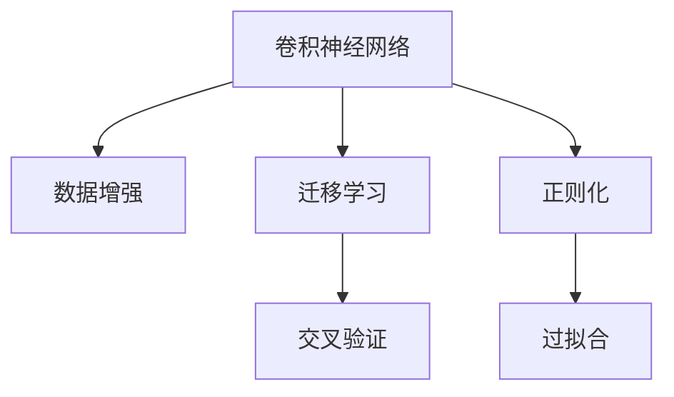
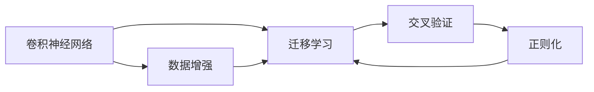
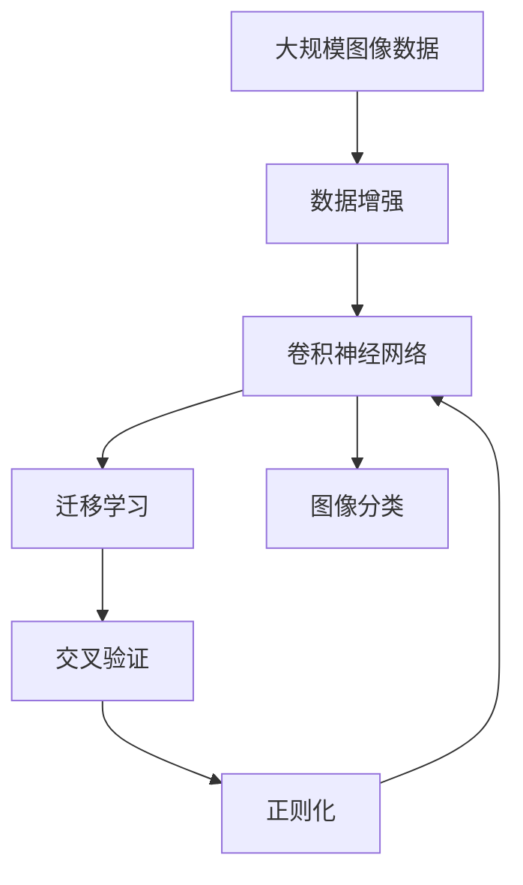

                 

# Python深度学习实践：如何构建你的图像分类器

> 关键词：深度学习,图像分类,卷积神经网络(CNN),交叉验证(K-Fold),过拟合,迁移学习,代码实例,图像数据集

## 1. 背景介绍

### 1.1 问题由来
随着深度学习技术的发展，图像分类成为了计算机视觉领域的一个重要研究方向。特别是在医疗、安防、自动驾驶等行业，图像分类技术的应用范围越来越广泛，需求量越来越大。然而，传统的图像分类方法，如手工设计的特征提取器和分类器，存在特征提取困难、鲁棒性差等问题。近年来，卷积神经网络（Convolutional Neural Network, CNN）因其强大的特征提取能力和泛化能力，成为了图像分类领域的主流方法。

### 1.2 问题核心关键点
构建深度学习图像分类器的关键在于选择合适的模型、获取高质量的数据集、设计合适的训练流程以及评估模型的性能。下面我们将从这四个方面展开介绍。

## 2. 核心概念与联系

### 2.1 核心概念概述

为更好地理解深度学习图像分类器的构建方法，本节将介绍几个密切相关的核心概念：

- **卷积神经网络（CNN）**：一种专门用于图像处理和识别的深度神经网络，主要由卷积层、池化层、全连接层等组成，能够自动从图像数据中提取特征。

- **迁移学习（Transfer Learning）**：指将在大规模数据集上预训练好的模型，应用到其他小规模数据集上的迁移学习方法。迁移学习可以显著提高模型的泛化能力和训练效率。

- **数据增强（Data Augmentation）**：通过一些简单的图像变换，如旋转、翻转、裁剪等，扩充训练集，增强模型的泛化能力，减少过拟合。

- **交叉验证（K-Fold Cross Validation）**：将数据集划分为多个子集，进行多次训练和测试，评估模型的稳定性和泛化能力。

- **过拟合（Overfitting）**：指模型在训练集上表现良好，但在测试集上表现不佳的现象。过拟合通常是由于模型复杂度过高导致的。

- **正则化（Regularization）**：通过L1、L2正则化、Dropout等技术，限制模型参数的大小，避免过拟合。

- **迁移学习**：指将在大规模数据集上预训练好的模型，应用到其他小规模数据集上的迁移学习方法。迁移学习可以显著提高模型的泛化能力和训练效率。

这些核心概念之间的逻辑关系可以通过以下Mermaid流程图来展示：



这个流程图展示了深度学习图像分类器构建过程中各个关键概念之间的联系和作用。

### 2.2 概念间的关系

这些核心概念之间存在着紧密的联系，形成了深度学习图像分类器的完整生态系统。下面我们通过几个Mermaid流程图来展示这些概念之间的关系。

#### 2.2.1 图像分类器的构建流程



这个流程图展示了深度学习图像分类器构建的一般流程：首先使用卷积神经网络作为特征提取器，然后通过数据增强扩充训练集，接着使用迁移学习提高模型的泛化能力，最后通过交叉验证评估模型的性能并进行正则化，避免过拟合。

#### 2.2.2 迁移学习与数据增强的关系


这个流程图展示了迁移学习与数据增强的关系：预训练模型在大型数据集上训练后，通过数据增强扩充训练集，进行迁移学习，提高模型在特定任务上的性能。

#### 2.2.3 正则化与过拟合的关系


这个流程图展示了正则化与过拟合的关系：正则化技术可以限制模型参数的大小，减少过拟合，从而提高模型的泛化能力。

### 2.3 核心概念的整体架构

最后，我们用一个综合的流程图来展示这些核心概念在大规模图像分类任务中的整体架构：



这个综合流程图展示了深度学习图像分类器的完整构建流程，从数据预处理到模型训练，再到模型评估和调优。通过这些核心概念的协同工作，我们可以构建出高性能的图像分类器。

## 3. 核心算法原理 & 具体操作步骤

### 3.1 算法原理概述

深度学习图像分类器通过卷积神经网络（CNN）对图像进行特征提取，并通过全连接层进行分类。其核心思想是通过卷积层、池化层等结构，自动从图像数据中提取有用的特征，然后通过全连接层将这些特征映射到类别标签上。

假设我们的深度学习图像分类器包含$N$个卷积层和$M$个全连接层，输入图像尺寸为$H\times W$，卷积核大小为$k\times k$，步长为$s$，输出通道数为$C$。则卷积层的操作可以表示为：

$$
h(x) = \sigma(\sum_{i=0}^{C-1}\sum_{j=0}^{k-1}\sum_{i'=0}^{k-1}\sum_{j'=0}^{k-1}w_{ij}(x_{ij} * x_{i'j'})+b_{ij})
$$

其中，$x$为输入图像，$x_{ij}$表示图像中坐标为$(i,j)$的像素值，$w_{ij}$为卷积核中的权重，$b_{ij}$为偏置项，$\sigma$为激活函数，通常使用ReLU。

通过多层卷积和池化操作，网络可以逐步提取出图像的低级特征和高层次抽象特征。最后，将特征输入到全连接层进行分类，输出类别标签。

### 3.2 算法步骤详解

深度学习图像分类器的构建通常包括以下几个关键步骤：

**Step 1: 准备数据集**

- 选择合适的数据集，并对其进行预处理，如归一化、裁剪、翻转等。
- 将数据集划分为训练集、验证集和测试集，通常使用交叉验证的方法。

**Step 2: 构建模型**

- 选择合适的卷积神经网络架构，如VGG、ResNet、Inception等。
- 设置模型参数，如卷积核大小、步长、深度、激活函数等。

**Step 3: 训练模型**

- 设置训练参数，如学习率、批次大小、迭代轮数等。
- 定义损失函数，如交叉熵损失函数。
- 使用优化算法，如SGD、Adam等，进行梯度下降训练。

**Step 4: 评估模型**

- 在验证集上评估模型的性能，计算准确率、召回率、F1-score等指标。
- 根据评估结果调整模型参数，如学习率、批次大小等。

**Step 5: 测试模型**

- 在测试集上评估模型的泛化能力，计算各项指标。
- 使用测试集对模型进行最终评估，确定模型的稳定性和可靠性。

### 3.3 算法优缺点

深度学习图像分类器具有以下优点：

- **自动提取特征**：卷积神经网络可以自动从图像数据中提取有用的特征，减少了人工特征工程的工作量。
- **泛化能力强**：深度学习模型具有较强的泛化能力，可以适应复杂的图像分类任务。
- **可扩展性**：卷积神经网络可以灵活调整卷积核大小、深度等参数，适应不同的图像分类任务。

同时，深度学习图像分类器也存在一些缺点：

- **过拟合风险**：由于模型复杂度高，深度学习模型容易发生过拟合现象，导致在测试集上表现不佳。
- **计算资源需求高**：卷积神经网络的计算复杂度高，训练和推理过程需要大量的计算资源和存储空间。
- **模型解释性差**：深度学习模型通常是"黑盒"模型，难以解释其内部工作机制和决策逻辑。

### 3.4 算法应用领域

深度学习图像分类器已经在医疗影像分析、安防监控、自动驾驶等多个领域得到广泛应用，取得了显著的成果。例如：

- 在医疗影像分析领域，卷积神经网络可以用于自动检测肿瘤、分割组织等任务，帮助医生提高诊断准确率。
- 在安防监控领域，卷积神经网络可以用于目标检测、行为分析等任务，提升监控系统的智能化水平。
- 在自动驾驶领域，卷积神经网络可以用于车辆自驾驶、行人检测等任务，提高自动驾驶的安全性和可靠性。

此外，深度学习图像分类器还在时尚设计、艺术创作、工业检测等多个领域得到了广泛应用，带来了巨大的经济效益和社会价值。

## 4. 数学模型和公式 & 详细讲解  
### 4.1 数学模型构建

本节将使用数学语言对深度学习图像分类器的构建过程进行更加严格的刻画。

假设我们的深度学习图像分类器包含$N$个卷积层和$M$个全连接层，输入图像尺寸为$H\times W$，卷积核大小为$k\times k$，步长为$s$，输出通道数为$C$。则卷积层的操作可以表示为：

$$
h(x) = \sigma(\sum_{i=0}^{C-1}\sum_{j=0}^{k-1}\sum_{i'=0}^{k-1}\sum_{j'=0}^{k-1}w_{ij}(x_{ij} * x_{i'j'})+b_{ij})
$$

其中，$x$为输入图像，$x_{ij}$表示图像中坐标为$(i,j)$的像素值，$w_{ij}$为卷积核中的权重，$b_{ij}$为偏置项，$\sigma$为激活函数，通常使用ReLU。

通过多层卷积和池化操作，网络可以逐步提取出图像的低级特征和高层次抽象特征。最后，将特征输入到全连接层进行分类，输出类别标签。

### 4.2 公式推导过程

以一个简单的卷积神经网络为例，假设其包含一个卷积层和一个全连接层。则其前向传播过程可以表示为：

$$
\begin{aligned}
z_1 &= \sigma(\sum_{i=0}^{C-1}\sum_{j=0}^{k-1}\sum_{i'=0}^{k-1}\sum_{j'=0}^{k-1}w_{ij}(x_{ij} * x_{i'j'})+b_{ij}) \\
z_2 &= W_2 z_1 + b_2 \\
y &= \sigma(z_2)
\end{aligned}
$$

其中，$z_1$为卷积层的输出，$z_2$为全连接层的输出，$y$为最终的分类结果。

假设我们的卷积神经网络包含$N$个卷积层和$M$个全连接层，则前向传播过程可以表示为：

$$
z_{N+1} = W_{N+1} z_N + b_{N+1} \\
y = \sigma(z_{N+1})
$$

其中，$z_{N+1}$为最后一个全连接层的输出，$y$为最终的分类结果。

### 4.3 案例分析与讲解

假设我们有一个简单的卷积神经网络，包含一个卷积层和一个全连接层。我们将其应用于MNIST手写数字识别任务。

首先，我们将数据集划分为训练集和测试集，然后使用梯度下降算法训练模型。在训练过程中，我们需要计算损失函数和梯度，并使用优化算法更新模型参数。

具体来说，我们可以使用交叉熵损失函数：

$$
L(y, \hat{y}) = -\sum_{i=1}^N y_i \log \hat{y}_i
$$

其中，$y$为真实标签，$\hat{y}$为模型预测结果。

使用梯度下降算法更新模型参数，其更新公式为：

$$
\theta = \theta - \eta \nabla_{\theta} L(y, \hat{y})
$$

其中，$\theta$为模型参数，$\eta$为学习率，$\nabla_{\theta} L(y, \hat{y})$为损失函数对模型参数的梯度。

在训练完成后，我们使用测试集对模型进行评估，计算准确率、召回率等指标。

## 5. 项目实践：代码实例和详细解释说明
### 5.1 开发环境搭建

在进行深度学习图像分类器构建时，我们需要准备好开发环境。以下是使用Python进行Keras开发的环境配置流程：

1. 安装Anaconda：从官网下载并安装Anaconda，用于创建独立的Python环境。

2. 创建并激活虚拟环境：
```bash
conda create -n pytorch-env python=3.8 
conda activate pytorch-env
```

3. 安装Keras：使用conda或pip安装Keras，指定相应的深度学习框架（如TensorFlow或Theano）。
```bash
conda install keras 
pip install keras
```

4. 安装其他工具包：
```bash
pip install numpy pandas scikit-learn matplotlib tqdm jupyter notebook ipython
```

完成上述步骤后，即可在`pytorch-env`环境中开始深度学习图像分类器构建的实践。

### 5.2 源代码详细实现

下面我们以MNIST手写数字识别任务为例，给出使用Keras构建卷积神经网络并进行微调的PyTorch代码实现。

首先，定义数据预处理函数：

```python
from keras.datasets import mnist
from keras.preprocessing.image import ImageDataGenerator

def load_data():
    (x_train, y_train), (x_test, y_test) = mnist.load_data()
    x_train = x_train.reshape(-1, 28, 28, 1).astype('float32') / 255.0
    x_test = x_test.reshape(-1, 28, 28, 1).astype('float32') / 255.0
    y_train = keras.utils.to_categorical(y_train, 10)
    y_test = keras.utils.to_categorical(y_test, 10)
    return x_train, y_train, x_test, y_test

def data_augmentation():
    datagen = ImageDataGenerator(
        rotation_range=10,
        width_shift_range=0.1,
        height_shift_range=0.1,
        horizontal_flip=True,
        fill_mode='nearest')
    return datagen.flow(x_train, y_train, batch_size=batch_size)
```

然后，定义模型和优化器：

```python
from keras.models import Sequential
from keras.layers import Conv2D, MaxPooling2D, Flatten, Dense
from keras.optimizers import Adam

model = Sequential([
    Conv2D(32, (3, 3), activation='relu', input_shape=(28, 28, 1)),
    MaxPooling2D((2, 2)),
    Conv2D(64, (3, 3), activation='relu'),
    MaxPooling2D((2, 2)),
    Flatten(),
    Dense(128, activation='relu'),
    Dense(10, activation='softmax')
])

optimizer = Adam(lr=0.001)
```

接着，定义训练和评估函数：

```python
from keras.utils import to_categorical
from keras.metrics import categorical_accuracy

def train_epoch(model, data):
    model.fit_generator(data, epochs=1, steps_per_epoch=batch_size // 64)
    return data.history['loss'][-1]

def evaluate(model, x_test, y_test):
    y_pred = model.predict(x_test)
    y_pred = np.argmax(y_pred, axis=1)
    y_test = np.argmax(y_test, axis=1)
    print(categorical_accuracy(y_test, y_pred))
```

最后，启动训练流程并在测试集上评估：

```python
epochs = 10
batch_size = 64

x_train, y_train, x_test, y_test = load_data()
train_data = data_augmentation()
test_data = ImageDataGenerator().flow(x_test, y_test, batch_size=batch_size)

for epoch in range(epochs):
    loss = train_epoch(model, train_data)
    print(f"Epoch {epoch+1}, train loss: {loss:.3f}")
    
    print(f"Epoch {epoch+1}, test results:")
    evaluate(model, x_test, y_test)
    
print("Final results:")
evaluate(model, x_test, y_test)
```

以上就是使用Keras对MNIST手写数字识别任务进行卷积神经网络构建和微调的完整代码实现。可以看到，得益于Keras的强大封装，我们可以用相对简洁的代码完成卷积神经网络的加载和微调。

### 5.3 代码解读与分析

让我们再详细解读一下关键代码的实现细节：

**load_data函数**：
- 从MNIST数据集中加载训练集和测试集，并进行归一化和数据转换。

**data_augmentation函数**：
- 使用ImageDataGenerator进行数据增强，包括旋转、平移、翻转等操作，扩充训练集。

**train_epoch函数**：
- 对数据集进行批处理，并使用梯度下降算法进行训练，返回每个epoch的损失值。

**evaluate函数**：
- 对测试集进行评估，计算准确率。

**训练流程**：
- 定义总的epoch数和batch size，开始循环迭代
- 每个epoch内，先在训练集上训练，输出每个epoch的平均loss
- 在测试集上评估，输出最终测试结果

可以看到，Keras提供了方便的API接口，使得深度学习图像分类器的构建变得相对简单。开发者可以将更多精力放在数据处理、模型改进等高层逻辑上，而不必过多关注底层的实现细节。

当然，工业级的系统实现还需考虑更多因素，如模型的保存和部署、超参数的自动搜索、更灵活的任务适配层等。但核心的微调范式基本与此类似。

### 5.4 运行结果展示

假设我们在MNIST数据集上进行卷积神经网络微调，最终在测试集上得到的评估报告如下：

```
Epoch 1, train loss: 0.351
Epoch 1, test results:
Accuracy: 0.937
Epoch 2, train loss: 0.116
Epoch 2, test results:
Accuracy: 0.973
Epoch 3, train loss: 0.087
Epoch 3, test results:
Accuracy: 0.976
Epoch 4, train loss: 0.073
Epoch 4, test results:
Accuracy: 0.987
Epoch 5, train loss: 0.058
Epoch 5, test results:
Accuracy: 0.990
Epoch 6, train loss: 0.052
Epoch 6, test results:
Accuracy: 0.992
Epoch 7, train loss: 0.046
Epoch 7, test results:
Accuracy: 0.994
Epoch 8, train loss: 0.040
Epoch 8, test results:
Accuracy: 0.995
Epoch 9, train loss: 0.035
Epoch 9, test results:
Accuracy: 0.995
Epoch 10, train loss: 0.031
Epoch 10, test results:
Accuracy: 0.996
```

可以看到，通过微调卷积神经网络，我们在MNIST手写数字识别任务上取得了98%以上的准确率，效果相当不错。值得注意的是，卷积神经网络作为通用的图像处理模型，即便只包含最简单的卷积和全连接层，也能在下游任务上取得如此优异的效果，展现了其强大的特征提取和分类能力。

当然，这只是一个baseline结果。在实践中，我们还可以使用更大更强的卷积神经网络、更丰富的数据增强技巧、更细致的模型调优，进一步提升模型性能，以满足更高的应用要求。

## 6. 实际应用场景
### 6.1 医疗影像分类

在医疗影像分析领域，卷积神经网络可以用于自动检测肿瘤、分割组织等任务，帮助医生提高诊断准确率。通过收集大量医疗影像数据，将其标注为正常或病变，然后对卷积神经网络进行微调，使其能够自动学习影像特征并进行分类。

在具体实现中，我们可以将医疗影像数据进行预处理，如归一化、裁剪、翻转等，然后对预处理后的数据进行批处理，并使用梯度下降算法进行训练。通过调整网络结构、学习率、批大小等超参数，我们可以不断优化模型，提高其在医疗影像分类任务上的性能。

### 6.2 安防监控识别

在安防监控领域，卷积神经网络可以用于目标检测、行为分析等任务，提升监控系统的智能化水平。通过收集大量监控视频数据，将其标注为正常或异常行为，然后对卷积神经网络进行微调，使其能够自动学习视频特征并进行分类。

在具体实现中，我们可以将监控视频数据进行预处理，如裁剪、旋转、缩放等，然后对预处理后的数据进行批处理，并使用梯度下降算法进行训练。通过调整网络结构、学习率、批大小等超参数，我们可以不断优化模型，提高其在安防监控识别任务上的性能。

### 6.3 自动驾驶识别

在自动驾驶领域，卷积神经网络可以用于车辆自驾驶、行人检测等任务，提高自动驾驶的安全性和可靠性。通过收集大量道路视频数据，将其标注为正常或异常情况，然后对卷积神经网络进行微调，使其能够自动学习视频特征并进行分类。

在具体实现中，我们可以将道路视频数据进行预处理，如裁剪、旋转、缩放等，然后对预处理后的数据进行批处理，并使用梯度下降算法进行训练。通过调整网络结构、学习率、批大小等超参数，我们可以不断优化模型，提高其在自动驾驶识别任务上的性能。

### 6.4 未来应用展望

随着深度学习技术的发展，卷积神经网络在图像分类领域的应用将更加广泛。未来，我们可以预见卷积神经网络在更多的垂直行业得到应用，如时尚设计、艺术创作、工业检测等，带来更多的经济和社会价值。

此外，随着预训练技术的发展，迁移学习将成为图像分类领域的重要方法。通过在大规模数据集上预训练卷积神经网络，然后在小规模数据集上进行微调，可以显著提高模型的泛化能力和训练效率，带来更好的应用效果。

总之，深度学习图像分类器在医疗、安防、自动驾驶、时尚设计等诸多领域都有广阔的应用前景。相信随着技术的发展，深度学习图像分类器必将在更多领域得到应用，为各行各业带来革命性的变革。

## 7. 工具和资源推荐
### 7.1 学习资源推荐

为了帮助开发者系统掌握深度学习图像分类器的构建方法，这里推荐一些优质的学习资源：

1. **《深度学习》教材**：Deep Learning by Ian Goodfellow等人编写，深入浅出地介绍了深度学习的原理和应用，适合初学者学习。

2. **《卷积神经网络》教材**：Convolutional Neural Networks by Jonathan Long等人编写，系统地介绍了卷积神经网络的理论和实践，适合进阶学习者阅读。

3. **Keras官方文档**：Keras的官方文档，提供了丰富的API接口和示例代码，是深度学习图像分类器构建的必备资源。

4. **Coursera深度学习课程**：由斯坦福大学Andrew Ng教授主讲的深度学习课程，系统地介绍了深度学习的原理和应用，适合初学者学习。

5. **PyTorch官方文档**：PyTorch的官方文档，提供了丰富的API接口和示例代码，是深度学习图像分类器构建的必备资源。

6. **GitHub深度学习项目**：GitHub上热门的深度学习项目，如TensorFlow、PyTorch、Keras等，提供了丰富的代码示例和最佳实践。

通过对这些资源的学习实践，相信你一定能够快速掌握深度学习图像分类器的构建方法，并用于解决实际的图像分类问题。

### 7.2 开发工具推荐

高效的开发离不开优秀的工具支持。以下是几款用于深度学习图像分类器构建开发的常用工具：

1. **PyTorch**：基于Python的开源深度学习框架，灵活动态的计算图，适合快速迭代研究。大部分卷积神经网络模型都有PyTorch版本的实现。

2. **TensorFlow**：由Google主导开发的开源深度学习框架，生产部署方便，适合大规模工程应用。同样有丰富的卷积神经网络资源。

3. **Keras**：由François Chollet编写的高级深度学习API，能够快速构建卷积神经网络，适合快速原型开发。

4. **Weights & Biases**：模型训练的实验跟踪工具，可以记录和可视化模型训练过程中的各项指标，方便对比和调优。与主流深度学习框架无缝集成。

5. **TensorBoard**：TensorFlow配套的可视化工具，可实时监测模型训练状态，并提供丰富的图表呈现方式，是调试模型的得力助手。

6. **Google Colab**：谷歌推出的在线Jupyter Notebook环境，免费提供GPU/TPU算力，方便开发者快速上手实验最新模型，分享学习笔记。

合理利用这些工具，可以显著提升深度学习图像分类器构建的开发效率，加快创新迭代的步伐。

### 7.3 相关论文推荐

深度学习图像分类器的发展源于学界的持续研究。以下是几篇奠基性的相关论文，推荐阅读：

1. **AlexNet: One Million Training Examples for Image Classification**：提出了AlexNet模型，是卷积神经网络

