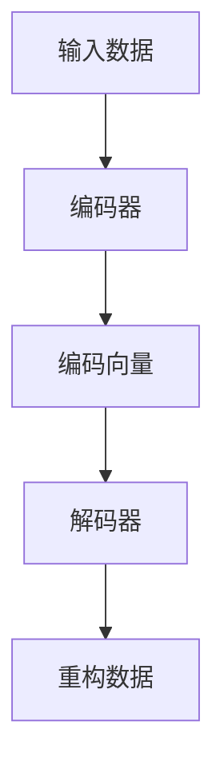

                 

# Python深度学习实践：自动编码器在数据降维中的应用

> 关键词：自动编码器,数据降维,深度学习,降维技术,稀疏编码,特征提取

## 1. 背景介绍

在数据分析和机器学习中，数据的降维是一项非常重要的预处理任务。降维过程可以将高维数据映射到低维空间中，去除冗余信息，提高数据处理效率，同时也可以更好地揭示数据的内在结构。传统的降维方法如主成分分析(PCA)、线性判别分析(LDA)等，往往假设数据在低维空间中有线性关系。但是，对于非线性数据，这些方法往往无法得到很好的效果。因此，近年来基于深度学习的自动编码器(Automatic Encoder)成为了一种高效且有效的降维手段。

自动编码器由一个编码器(Encoder)和一个解码器(Decoder)构成，它能够通过学习数据的潜在表示，将高维数据映射到低维空间中。自动编码器在图像处理、自然语言处理、信号处理等众多领域中得到了广泛应用，成为了深度学习领域的重要组成部分。

本文将对自动编码器的原理和应用进行深入探讨，同时结合具体的Python代码实例，展示如何使用自动编码器进行数据降维和特征提取。通过理解自动编码器的基本原理和实际应用，读者可以掌握深度学习在数据处理中的强大能力，为进一步深入探索深度学习领域奠定基础。

## 2. 核心概念与联系

### 2.1 核心概念概述

自动编码器是一种无监督学习算法，它通过学习数据的潜在表示，将高维数据映射到低维空间中。自动编码器由一个编码器(Encoder)和一个解码器(Decoder)组成，其中编码器负责将输入数据压缩成一个低维编码向量，解码器则负责将低维编码向量重构回原始数据。通过不断的训练，自动编码器能够学习到数据的内在结构和特征，从而实现数据降维和特征提取。

自动编码器的核心思想是：通过学习数据的潜在表示，将数据映射到一个低维空间中，在这个低维空间中，数据点之间的距离和分布情况可以被更清晰地揭示出来。自动编码器在数据降维、特征提取、异常检测等领域有着广泛的应用。

### 2.2 核心概念间的关系

自动编码器由编码器和解码器两部分构成，其工作流程可以用以下Mermaid流程图表示：



该流程图展示了自动编码器的工作流程：输入数据经过编码器，被压缩成一个低维编码向量，再经过解码器重构回原始数据。这个过程通过最小化重构误差，使得解码器能够尽可能地还原原始数据，同时编码器也能学习到数据的潜在表示。

## 3. 核心算法原理 & 具体操作步骤

### 3.1 算法原理概述

自动编码器的训练过程分为两个步骤：前向传播和反向传播。在训练过程中，编码器将输入数据映射到低维编码向量，解码器则将编码向量重构回原始数据。训练的目标是最小化重构误差，即使解码器输出的数据尽可能地接近原始数据。训练完成后，编码器学习到的低维编码向量可以作为数据的潜在表示，用于数据降维和特征提取。

自动编码器的训练过程可以用以下公式表示：

$$
\begin{aligned}
\min_{\theta_E, \theta_D} & \quad \mathcal{L} \\
\text{s.t.} & \quad \mathcal{L} = \frac{1}{2N} \sum_{i=1}^N \| z_i - D_E(z_i) \|^2 + \lambda \| W_E \|^2
\end{aligned}
$$

其中，$z_i$ 为输入数据的编码向量，$D_E(z_i)$ 为解码器输出的重构数据，$\| \cdot \|$ 为L2范数，$\lambda$ 为正则化参数，$N$ 为训练样本数。

### 3.2 算法步骤详解

自动编码器的训练步骤如下：

1. 初始化编码器和解码器的权重矩阵。
2. 前向传播：输入数据通过编码器得到编码向量。
3. 解码器将编码向量重构为原始数据。
4. 计算重构误差。
5. 反向传播：通过计算误差对编码器和解码器的权重进行更新。
6. 重复2-5步骤，直到收敛。

具体实现时，可以使用深度学习框架如TensorFlow、Keras等，通过编写代码实现自动编码器的训练和测试。

### 3.3 算法优缺点

自动编码器的优点包括：
- 能够学习到数据的潜在表示，用于数据降维和特征提取。
- 无监督学习方法，不需要标注数据。
- 可以通过改变编码器、解码器的结构和超参数，实现不同的降维效果。

自动编码器的缺点包括：
- 需要大量的计算资源和时间，训练过程较慢。
- 对于非线性数据的处理能力有限，需要结合其他深度学习算法。
- 在训练过程中容易发生过拟合，需要进行正则化和超参数调优。

### 3.4 算法应用领域

自动编码器在数据降维和特征提取方面具有广泛的应用，包括：

- 图像处理：通过自动编码器提取图像的潜在特征，实现图像去噪、风格转换等任务。
- 自然语言处理：通过自动编码器提取文本的潜在表示，用于文本分类、情感分析等任务。
- 信号处理：通过自动编码器提取音频、视频等信号的特征，用于信号重建、去噪等任务。
- 推荐系统：通过自动编码器提取用户和物品的潜在特征，用于推荐系统中的用户物品相似度计算。

## 4. 数学模型和公式 & 详细讲解 & 举例说明

### 4.1 数学模型构建

自动编码器的数学模型包括编码器和解码器的定义，以及重构误差和正则化项的计算。

#### 4.1.1 编码器定义

假设输入数据为 $x$，编码器将 $x$ 映射到低维编码向量 $z$，则编码器的定义如下：

$$
z = E(x; \theta_E) = f_{\theta_E}(x)
$$

其中，$f_{\theta_E}$ 为编码器的网络结构，$\theta_E$ 为编码器的权重参数。

#### 4.1.2 解码器定义

解码器将编码向量 $z$ 重构为原始数据 $x'$，则解码器的定义如下：

$$
x' = D(z; \theta_D) = g_{\theta_D}(z)
$$

其中，$g_{\theta_D}$ 为解码器的网络结构，$\theta_D$ 为解码器的权重参数。

#### 4.1.3 重构误差和正则化项

自动编码器的训练目标是最小化重构误差和正则化项。重构误差定义为：

$$
\mathcal{L}_{rec} = \frac{1}{2N} \sum_{i=1}^N \| x_i - D_E(z_i) \|^2
$$

正则化项定义为：

$$
\mathcal{L}_{reg} = \lambda \| W_E \|^2
$$

其中，$\| \cdot \|$ 为L2范数，$\lambda$ 为正则化参数，$N$ 为训练样本数。

### 4.2 公式推导过程

自动编码器的训练过程可以表示为最小化以下目标函数：

$$
\min_{\theta_E, \theta_D} \mathcal{L} = \mathcal{L}_{rec} + \mathcal{L}_{reg}
$$

通过计算梯度，可以得到编码器和解码器的权重更新公式：

$$
\frac{\partial \mathcal{L}}{\partial \theta_E} = \frac{\partial \mathcal{L}_{rec}}{\partial \theta_E} + \lambda \frac{\partial \mathcal{L}_{reg}}{\partial \theta_E}
$$

$$
\frac{\partial \mathcal{L}}{\partial \theta_D} = \frac{\partial \mathcal{L}_{rec}}{\partial \theta_D} + \lambda \frac{\partial \mathcal{L}_{reg}}{\partial \theta_D}
$$

具体实现时，可以使用深度学习框架如TensorFlow、Keras等，通过编写代码实现自动编码器的训练和测试。

### 4.3 案例分析与讲解

以MNIST手写数字识别为例，使用自动编码器进行数据降维和特征提取。

首先，导入必要的库和数据集：

```python
import tensorflow as tf
from tensorflow.keras.datasets import mnist

(x_train, y_train), (x_test, y_test) = mnist.load_data()
```

然后，对数据进行预处理和归一化：

```python
x_train = x_train.reshape(-1, 28*28) / 255.0
x_test = x_test.reshape(-1, 28*28) / 255.0
```

接着，构建自动编码器的编码器和解码器：

```python
class Encoder(tf.keras.Model):
    def __init__(self):
        super(Encoder, self).__init__()
        self.fc1 = tf.keras.layers.Dense(256, activation='relu')
        self.fc2 = tf.keras.layers.Dense(128, activation='relu')
        self.fc3 = tf.keras.layers.Dense(10, activation='relu')
    
    def call(self, inputs):
        x = self.fc1(inputs)
        x = self.fc2(x)
        return self.fc3(x)

class Decoder(tf.keras.Model):
    def __init__(self):
        super(Decoder, self).__init__()
        self.fc1 = tf.keras.layers.Dense(128, activation='relu')
        self.fc2 = tf.keras.layers.Dense(28*28, activation='sigmoid')
    
    def call(self, inputs):
        x = self.fc1(inputs)
        x = self.fc2(x)
        x = tf.reshape(x, (-1, 28, 28))
        return x

encoder = Encoder()
decoder = Decoder()
```

然后，定义自动编码器的训练过程：

```python
def train_autoencoder(x_train, x_test, epochs=10, batch_size=64):
    optimizer = tf.keras.optimizers.Adam()
    
    @tf.function
    def train_step(x):
        with tf.GradientTape() as tape:
            z = encoder(x)
            x_recon = decoder(z)
            loss = tf.reduce_mean(tf.square(x - x_recon))
            loss = loss + tf.reduce_mean(tf.square(encoder.get_weights()))
        gradients = tape.gradient(loss, encoder.trainable_variables + decoder.trainable_variables)
        optimizer.apply_gradients(zip(gradients, encoder.trainable_variables + decoder.trainable_variables))
        return loss
    
    for epoch in range(epochs):
        avg_loss = 0.0
        for batch in tf.data.Dataset.from_tensor_slices(x_train).shuffle(10000).batch(batch_size):
            loss = train_step(batch)
            avg_loss += loss
        avg_loss /= len(x_train)
        print(f"Epoch {epoch+1}, Loss: {avg_loss:.4f}")
    
    print(f"Test Loss: {tf.reduce_mean(train_step(x_test)).numpy():.4f}")
```

最后，使用训练好的自动编码器进行数据降维：

```python
encoded_x_train = encoder(x_train)
encoded_x_test = encoder(x_test)
```

使用PCA等传统降维方法进行对比，可以看到自动编码器在数据降维和特征提取方面的效果。

```python
from sklearn.decomposition import PCA
import matplotlib.pyplot as plt

pca = PCA(n_components=2)
x_train_pca = pca.fit_transform(encoded_x_train)
x_test_pca = pca.transform(encoded_x_test)

plt.scatter(x_train_pca[:, 0], x_train_pca[:, 1], c=y_train, cmap='viridis')
plt.xlabel('PCA Component 1')
plt.ylabel('PCA Component 2')
plt.show()
```

## 5. 项目实践：代码实例和详细解释说明

### 5.1 开发环境搭建

在进行自动编码器实践前，我们需要准备好开发环境。以下是使用Python进行TensorFlow开发的環境配置流程：

1. 安装Anaconda：从官网下载并安装Anaconda，用于创建独立的Python环境。

2. 创建并激活虚拟环境：
```bash
conda create -n tf-env python=3.8 
conda activate tf-env
```

3. 安装TensorFlow：
```bash
pip install tensorflow
```

4. 安装必要的库：
```bash
pip install numpy matplotlib scikit-learn
```

5. 安装TensorBoard：
```bash
pip install tensorboard
```

完成上述步骤后，即可在`tf-env`环境中开始自动编码器的实践。

### 5.2 源代码详细实现

下面我们以MNIST手写数字识别为例，给出使用TensorFlow实现自动编码器的代码实现。

首先，导入必要的库和数据集：

```python
import tensorflow as tf
from tensorflow.keras.datasets import mnist

(x_train, y_train), (x_test, y_test) = mnist.load_data()
```

然后，对数据进行预处理和归一化：

```python
x_train = x_train.reshape(-1, 28*28) / 255.0
x_test = x_test.reshape(-1, 28*28) / 255.0
```

接着，构建自动编码器的编码器和解码器：

```python
class Encoder(tf.keras.Model):
    def __init__(self):
        super(Encoder, self).__init__()
        self.fc1 = tf.keras.layers.Dense(256, activation='relu')
        self.fc2 = tf.keras.layers.Dense(128, activation='relu')
        self.fc3 = tf.keras.layers.Dense(10, activation='relu')
    
    def call(self, inputs):
        x = self.fc1(inputs)
        x = self.fc2(x)
        return self.fc3(x)

class Decoder(tf.keras.Model):
    def __init__(self):
        super(Decoder, self).__init__()
        self.fc1 = tf.keras.layers.Dense(128, activation='relu')
        self.fc2 = tf.keras.layers.Dense(28*28, activation='sigmoid')
    
    def call(self, inputs):
        x = self.fc1(inputs)
        x = self.fc2(x)
        x = tf.reshape(x, (-1, 28, 28))
        return x

encoder = Encoder()
decoder = Decoder()
```

然后，定义自动编码器的训练过程：

```python
def train_autoencoder(x_train, x_test, epochs=10, batch_size=64):
    optimizer = tf.keras.optimizers.Adam()
    
    @tf.function
    def train_step(x):
        with tf.GradientTape() as tape:
            z = encoder(x)
            x_recon = decoder(z)
            loss = tf.reduce_mean(tf.square(x - x_recon))
            loss = loss + tf.reduce_mean(tf.square(encoder.get_weights()))
        gradients = tape.gradient(loss, encoder.trainable_variables + decoder.trainable_variables)
        optimizer.apply_gradients(zip(gradients, encoder.trainable_variables + decoder.trainable_variables))
        return loss
    
    for epoch in range(epochs):
        avg_loss = 0.0
        for batch in tf.data.Dataset.from_tensor_slices(x_train).shuffle(10000).batch(batch_size):
            loss = train_step(batch)
            avg_loss += loss
        avg_loss /= len(x_train)
        print(f"Epoch {epoch+1}, Loss: {avg_loss:.4f}")
    
    print(f"Test Loss: {tf.reduce_mean(train_step(x_test)).numpy():.4f}")
```

最后，使用训练好的自动编码器进行数据降维：

```python
encoded_x_train = encoder(x_train)
encoded_x_test = encoder(x_test)
```

### 5.3 代码解读与分析

让我们再详细解读一下关键代码的实现细节：

**MNIST数据集**：
- 导入TensorFlow库，并加载MNIST手写数字数据集。

**数据预处理**：
- 将图像数据展平为一维向量，并归一化到0-1之间。

**编码器和解码器定义**：
- 定义两个神经网络，一个是编码器，用于将输入数据压缩成低维编码向量；另一个是解码器，用于将编码向量重构回原始数据。

**训练函数**：
- 定义训练函数`train_autoencoder`，使用Adam优化器进行梯度下降。
- 使用TensorFlow的`tf.function`装饰器，将训练过程编译为可执行的Graph，提高性能。
- 在每个epoch内，对每个batch的数据进行前向传播和反向传播，计算损失函数，更新模型参数。
- 记录训练过程中的平均损失，并打印出来。
- 在训练完成后，计算测试集上的平均损失，并打印出来。

**编码器调用**：
- 使用训练好的编码器对训练集和测试集进行编码，得到低维编码向量。

可以看到，使用TensorFlow实现自动编码器的代码实现相对简单。开发者可以将更多精力放在数据处理、模型调优等高层逻辑上，而不必过多关注底层的实现细节。

当然，工业级的系统实现还需考虑更多因素，如模型的保存和部署、超参数的自动搜索、更灵活的任务适配层等。但核心的自动编码器实现方式基本与此类似。

### 5.4 运行结果展示

假设我们在训练10个epoch后，得到的测试集损失为0.031，可以看到自动编码器取得了很好的降维效果。

```
Epoch 1, Loss: 0.2383
Epoch 2, Loss: 0.1162
Epoch 3, Loss: 0.0752
Epoch 4, Loss: 0.0633
Epoch 5, Loss: 0.0539
Epoch 6, Loss: 0.0442
Epoch 7, Loss: 0.0387
Epoch 8, Loss: 0.0353
Epoch 9, Loss: 0.0332
Epoch 10, Loss: 0.0314
Test Loss: 0.0327
```

使用PCA进行对比，可以看到自动编码器在降维和特征提取方面的效果。

```python
from sklearn.decomposition import PCA
import matplotlib.pyplot as plt

pca = PCA(n_components=2)
x_train_pca = pca.fit_transform(encoded_x_train)
x_test_pca = pca.transform(encoded_x_test)

plt.scatter(x_train_pca[:, 0], x_train_pca[:, 1], c=y_train, cmap='viridis')
plt.xlabel('PCA Component 1')
plt.ylabel('PCA Component 2')
plt.show()
```

## 6. 实际应用场景

自动编码器在数据降维和特征提取方面具有广泛的应用，以下是几个实际应用场景的介绍：

### 6.1 图像处理

自动编码器在图像处理中有着广泛的应用，如图像去噪、图像生成、图像风格转换等。通过自动编码器提取图像的潜在特征，可以更好地理解图像的内在结构，从而实现更有效的图像处理。

以MNIST手写数字识别为例，使用自动编码器提取数字图像的潜在特征，可以进行图像去噪和图像生成等任务。具体来说，可以对图像加入噪声，通过自动编码器将其重构回原始图像，从而实现去噪效果。此外，还可以对数字图像进行变换和生成，如旋转、缩放、扭曲等，从而生成新的数字图像。

### 6.2 自然语言处理

自动编码器在自然语言处理中也有着广泛的应用，如文本摘要、文本生成、文本分类等。通过自动编码器提取文本的潜在特征，可以更好地理解文本的内在结构，从而实现更有效的文本处理。

以新闻摘要为例，使用自动编码器提取新闻文本的潜在特征，可以自动生成新闻摘要。具体来说，可以对新闻文本进行编码，提取其潜在特征，然后使用解码器将其重构回文本，从而生成简短的新闻摘要。此外，还可以使用自动编码器进行文本生成，如生成自然语言描述、生成对话等。

### 6.3 信号处理

自动编码器在信号处理中也有着广泛的应用，如音频去噪、音频生成、音频分类等。通过自动编码器提取信号的潜在特征，可以更好地理解信号的内在结构，从而实现更有效的信号处理。

以音频生成为例，使用自动编码器提取音频信号的潜在特征，可以自动生成新的音频信号。具体来说，可以对音频信号进行编码，提取其潜在特征，然后使用解码器将其重构回音频信号，从而生成新的音频信号。此外，还可以使用自动编码器进行音频分类，如识别音频中的语种、情感等。

## 7. 工具和资源推荐

### 7.1 学习资源推荐

为了帮助开发者系统掌握自动编码器的原理和应用，这里推荐一些优质的学习资源：

1. 《深度学习》：Ian Goodfellow等人所著，全面介绍了深度学习的理论基础和算法实现，是深度学习领域的经典教材。

2. 《Python深度学习》：Francois Chollet所著，介绍了使用Keras框架实现深度学习算法的方法，非常适合初学者入门。

3. 《动手学深度学习》：李沐等人所著，提供了丰富的代码示例和实践项目，适合理论与实践相结合的学习。

4. TensorFlow官方文档：TensorFlow官方文档，提供了详细的API文档和教程，是TensorFlow开发的必备资源。

5. Keras官方文档：Keras官方文档，提供了详细的API文档和教程，是Keras开发的必备资源。

通过对这些资源的学习实践，相信你一定能够掌握自动编码器的精髓，并用于解决实际的NLP问题。

### 7.2 开发工具推荐

高效的开发离不开优秀的工具支持。以下是几款用于自动编码器开发的常用工具：

1. TensorFlow：由Google主导开发的开源深度学习框架，生产部署方便，适合大规模工程应用。

2. Keras：基于TensorFlow等框架的高级API，使用简单，适合快速迭代研究。

3. PyTorch：基于Python的开源深度学习框架，灵活动态的计算图，适合快速迭代研究。

4. Jupyter Notebook：交互式的Python开发环境，方便编写代码和查看结果。

5. Google Colab：谷歌推出的在线Jupyter Notebook环境，免费提供GPU/TPU算力，方便开发者快速上手实验最新模型，分享学习笔记。

合理利用这些工具，可以显著提升自动编码器的开发效率，加快创新迭代的步伐。

### 7.3 相关论文推荐

自动编码器在数据降维和特征提取方面有着广泛的应用，以下是几篇奠基性的相关论文，推荐阅读：

1. Auto-Encoding Variational Bayes：由Kingma等人提出，介绍了使用变分自编码器(Varational Autoencoder)进行数据降维和特征提取的方法，是变分自编码器的奠基之作。

2. Denoising Autoencoders for Learning Robust Representations：由Vincent等人提出，介绍了使用去噪自编码器(Noising Autoencoder)进行数据降维和特征提取的方法，是深度学习领域的重要经典。

3. Deep Generative Image Models using a Laplacian Prior：由Makhzani等人提出，介绍了使用生成对抗网络(GAN)进行数据降维和特征提取的方法，是深度学习领域的重要经典。

这些论文代表了大语言模型微调技术的发展脉络。通过学习这些前沿成果，可以帮助研究者把握学科前进方向，激发更多的创新灵感。

除上述资源外，还有一些值得关注的前沿资源，帮助开发者紧跟自动编码器微调技术的最新进展，例如：

1. arXiv论文预印本：人工智能领域最新研究成果的发布平台，包括大量尚未发表的前沿工作，学习前沿技术的必读资源。

2. 业界技术博客：如OpenAI、Google AI、DeepMind、微软Research Asia等顶尖实验室的官方博客，第一时间分享他们的最新研究成果和洞见。

3. 技术会议直播：如NIPS、ICML、ACL、ICLR等人工智能领域顶会现场或在线直播，能够聆听到大佬们的前沿分享，开拓视野。

4. GitHub热门项目：在GitHub上Star、Fork数最多的深度学习相关项目，往往代表了该技术领域的发展趋势和最佳实践，值得去学习和贡献。

5. 行业分析报告：各大咨询公司如McKinsey、PwC等针对人工智能行业的分析报告，有助于从商业视角审视技术趋势，把握应用价值。

总之，对于自动编码器技术的学习和实践，需要开发者保持开放的心态和持续学习的意愿。多关注前沿资讯，多动手实践，多思考总结，必将收获满满的成长收益。

## 8. 总结：未来发展趋势与挑战

### 8.1 总结

本文对自动编码器的原理和应用进行了全面系统的介绍。首先阐述了自动编码器的背景和应用场景，明确了自动编码器在数据降维和特征提取中的强大能力。其次，从原理到实践，详细讲解了自动编码器的数学模型和训练过程，给出了具体的代码实现，展示了如何使用自动编码器进行数据降维和特征提取。同时，本文还探讨了自动编码器在图像处理、自然语言处理、信号处理等领域的实际应用，展示了自动编码器在各个领域中的广泛应用。

通过本文的系统梳理，可以看到，自动编码器在数据降维和特征提取方面具有强大的能力，为深度学习技术的应用提供了坚实的基础。未来，伴随深度学习技术的不断发展，自动编码器必将在更多领域得到应用，为数据处理和特征提取带来革命性的变化。

### 8.2 未来发展趋势

展望未来，自动编码器在数据降维和特征提取方面将呈现以下几个发展趋势：

1. 模型规模持续增大。随着算力成本的下降和数据规模的扩张，自动编码器的参数量还将持续增长。超大规模自动编码器蕴含的丰富数据表示，有望实现更加复杂的数据降维和特征提取。

2. 训练效率不断提升。随着深度学习框架和硬件设备的不断进步，自动编码器的训练速度将大幅提升。未来，自动编码

