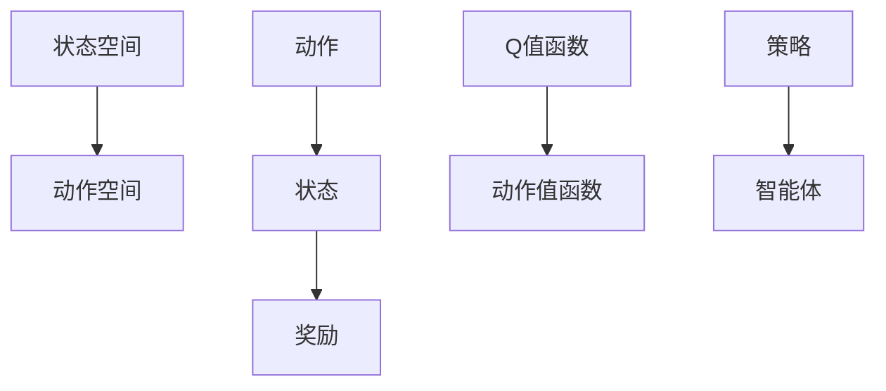
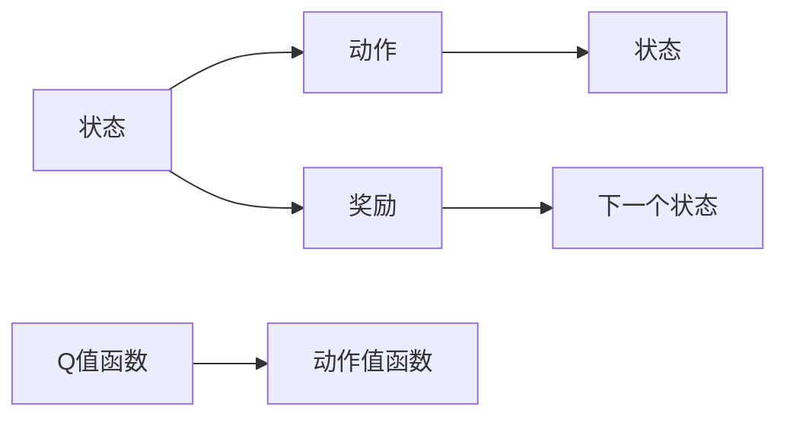
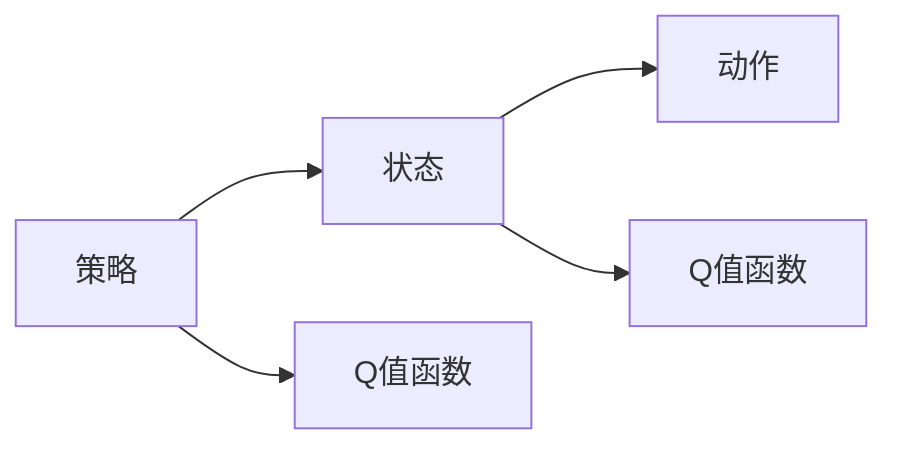
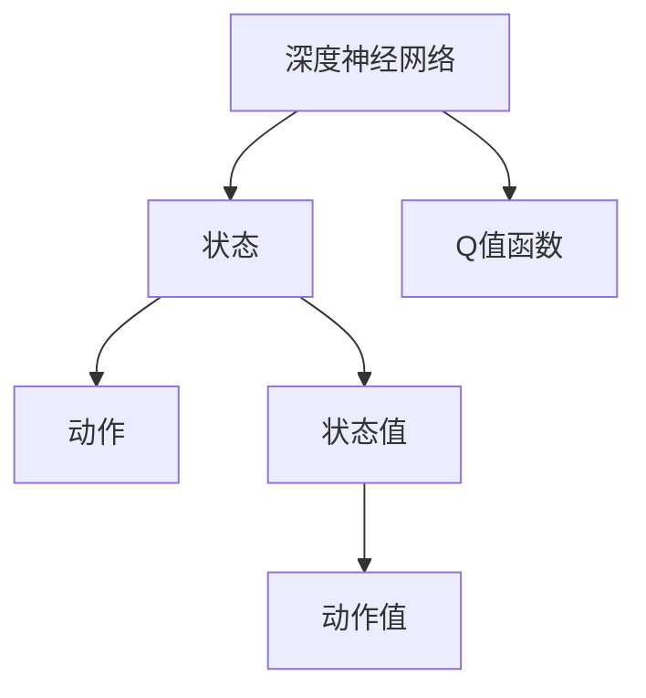
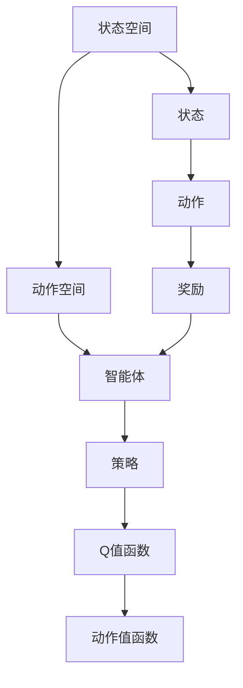

                 

# Q-Learning - 原理与代码实例讲解

> 关键词：Q-Learning, 强化学习, 深度Q网络, 离散状态空间, 连续状态空间, 动作空间, 策略-价值, 深度学习, 超参数调整, 蒙特卡罗方法, 逆境试验

## 1. 背景介绍

### 1.1 问题由来

强化学习(Reinforcement Learning, RL)是人工智能领域的核心研究内容之一，旨在使智能体(Agent)在无监督的环境中，通过与环境交互学习最优策略。这一过程通常被描述为“试错学习”，智能体通过不断尝试和调整，逐渐找到最优决策路径。

在强化学习中，常用的学习算法包括Q-Learning、Sarsa、Actor-Critic等。其中，Q-Learning是最经典的算法之一，由Watkins和Powell在1990年提出，并在80年代后期的控制问题研究中取得了广泛应用。Q-Learning通过在状态-动作对上积累经验，逐步调整Q值函数，最终找到最优策略。

近年来，随着深度学习技术的兴起，Q-Learning得到了进一步的拓展和应用。深度Q网络(DQN)，即使用深度神经网络来逼近Q值函数的Q-Learning算法，在解决复杂问题时表现出了显著优势，成为智能控制和游戏AI的重要工具。

### 1.2 问题核心关键点

Q-Learning算法的核心思想是通过状态-动作对的交互，逐步调整状态-动作对对应的Q值。Q值函数$Q(s,a)$表示在状态$s$下执行动作$a$所能获得的长期奖励，即$Q(s,a)=E[R|s,a]$，其中$R$表示从执行动作$a$开始，通过一系列状态-动作对最终得到的奖励。

Q-Learning的目标是最大化Q值函数$Q(s,a)$，即通过调整智能体的策略$π(s)$，使得Q值达到最大值。在每一次迭代中，Q-Learning通过更新Q值函数，逐步逼近最优策略。

Q-Learning的具体步骤如下：
1. 初始化状态$s_0$和动作值函数$Q(s,a)$。
2. 根据策略$π(s)$选择动作$a$，进入状态$s_1$。
3. 观察到奖励$R$和下一个状态$s_2$，根据当前状态和动作计算下一个状态的Q值$Q(s_1,a_1)$。
4. 更新当前状态$s_0$的Q值$Q(s_0,a_0)$。
5. 重复步骤2-4，直至达到终止状态或达到预设迭代次数。

在Q-Learning中，策略$π(s)$通常使用$\varepsilon$-贪心策略，即在$ε$概率下选择随机动作，其余概率下选择贪心动作。这种方法可以在探索和利用之间取得平衡，帮助智能体快速探索最优策略。

### 1.3 问题研究意义

Q-Learning算法在强化学习领域具有重要的理论和实践意义：

1. **泛化能力强**：Q-Learning能够适应多种环境和问题，具备较强的泛化能力，广泛应用于智能控制、游戏AI等领域。
2. **结构简单**：Q-Learning的算法结构相对简单，易于理解和实现，是强化学习研究的基础。
3. **实时更新**：Q-Learning能够实时更新Q值函数，适应动态环境，在实际应用中具有较高灵活性。
4. **应用广泛**：Q-Learning及其变种算法在工业界的众多领域得到广泛应用，如机器人控制、自动驾驶、智能推荐等。
5. **理论完备**：Q-Learning的数学理论基础坚实，具备完整的理论分析和证明，为其他强化学习算法提供借鉴。

## 2. 核心概念与联系

### 2.1 核心概念概述

为了更好地理解Q-Learning算法的原理，本节将介绍几个相关的重要概念：

- **Q值函数(Q-value Function)**：表示在状态$s$下执行动作$a$所能获得的长期奖励。Q值函数是Q-Learning算法的核心。
- **动作值函数(Action-value Function)**：表示在状态$s$下执行动作$a$所能获得的奖励，即$Q(s,a)=R+γQ(s_1,a_1)$，其中$R$表示奖励，$γ$表示折扣因子。
- **策略(Strategy)**：智能体在特定状态$s$下选择动作$a$的策略，即$π(s)$。
- **状态空间(State Space)**：表示所有可能的状态集合。在Q-Learning中，状态空间可以是离散或连续的。
- **动作空间(Action Space)**：表示所有可能的动作集合，可以是离散或连续的。
- **奖励(Reward)**：智能体在特定状态下执行动作后获得的外部奖励。

这些概念之间的逻辑关系可以通过以下Mermaid流程图来展示：



这个流程图展示了大语言模型微调过程中各个核心概念之间的关系：

1. 智能体通过状态空间中的状态选择动作，并观察到奖励和下一个状态。
2. 通过动作值函数计算下一个状态的Q值，更新当前状态的Q值。
3. 智能体根据策略选择动作，形成闭环学习过程。

### 2.2 概念间的关系

这些核心概念之间存在着紧密的联系，形成了Q-Learning算法的完整生态系统。下面我们通过几个Mermaid流程图来展示这些概念之间的关系。

#### 2.2.1 状态-动作对交互



这个流程图展示了智能体通过状态-动作对与环境交互的过程：

1. 智能体选择一个动作$a$。
2. 进入下一个状态$s_1$，观察到奖励$R$。
3. 计算下一个状态$s_1$的Q值$Q(s_1,a_1)$。
4. 更新当前状态$s$的Q值$Q(s,a)$。

#### 2.2.2 策略和Q值函数的关系



这个流程图展示了策略和Q值函数之间的关系：

1. 智能体根据策略$π(s)$选择动作$a$。
2. 智能体通过策略选择动作，计算当前状态$s$的Q值。
3. 智能体根据策略选择动作，计算下一个状态$s_1$的Q值。

#### 2.2.3 深度Q网络



这个流程图展示了深度Q网络的结构：

1. 深度神经网络作为Q值函数，输出状态和动作的Q值。
2. 通过网络计算当前状态$s$的Q值。
3. 通过网络计算下一个状态$s_1$的Q值。

### 2.3 核心概念的整体架构

最后，我们用一个综合的流程图来展示这些核心概念在大语言模型微调过程中的整体架构：



这个综合流程图展示了从状态空间到智能体的完整过程：

1. 智能体根据状态选择动作，观察到奖励和下一个状态。
2. 通过策略选择动作，计算当前状态和下一个状态的Q值。
3. 通过动作值函数计算Q值，更新Q值函数。
4. 智能体继续执行选择动作、观察奖励和下一个状态的过程。

## 3. 核心算法原理 & 具体操作步骤
### 3.1 算法原理概述

Q-Learning算法的核心思想是通过状态-动作对的交互，逐步调整Q值函数，最终找到最优策略。其数学原理基于最大期望化(Maximization Expectation)过程。

假设智能体在状态$s_t$下执行动作$a_t$，观察到奖励$R_t$，进入状态$s_{t+1}$，则Q-Learning的更新公式为：

$$
Q(s_t,a_t) \leftarrow Q(s_t,a_t) + \varepsilon \cdot \big(r_t + γ \cdot \max_{a'} Q(s_{t+1},a') - Q(s_t,a_t)\big)
$$

其中，$\varepsilon$为探索率，控制贪心策略与随机策略之间的平衡；$r_t$为当前状态的奖励；$γ$为折扣因子，控制未来奖励的权重。

在每一次迭代中，智能体根据当前状态和动作值函数，选择最优动作$a_t$，进入下一个状态$s_{t+1}$，观察到奖励$R_t$，更新当前状态$s_t$的Q值函数。通过不断的迭代和调整，智能体逐步逼近最优策略，实现最优决策。

### 3.2 算法步骤详解

Q-Learning算法的具体实现步骤如下：

**Step 1: 准备环境**

1. 初始化环境，创建状态空间、动作空间。
2. 定义奖励函数和状态转移概率。
3. 定义Q值函数和策略。

**Step 2: 设置超参数**

1. 定义学习率$\alpha$和探索率$\varepsilon$。
2. 设置迭代次数和每轮迭代的步数。

**Step 3: 训练过程**

1. 随机初始化状态$s_0$。
2. 在每个迭代步骤$t$中，根据策略$π(s_t)$选择动作$a_t$。
3. 进入下一个状态$s_{t+1}$，观察到奖励$R_t$。
4. 根据当前状态和动作计算下一个状态的Q值$Q(s_{t+1},a_{t+1})$。
5. 更新当前状态的Q值$Q(s_t,a_t)$。
6. 记录状态-动作对和Q值。

**Step 4: 评估**

在训练结束后，可以使用测试集评估智能体的性能。

### 3.3 算法优缺点

Q-Learning算法具有以下优点：

1. **泛化能力强**：Q-Learning能够适应多种环境和问题，具备较强的泛化能力。
2. **结构简单**：算法结构相对简单，易于理解和实现。
3. **实时更新**：能够实时更新Q值函数，适应动态环境。

但Q-Learning也存在一些缺点：

1. **需要大量的交互次数**：Q-Learning需要大量状态-动作对的数据，才能逼近最优策略。
2. **动作空间维数高时效果不佳**：当动作空间维数很高时，Q值函数的逼近难度增加，导致算法效率降低。
3. **探索和利用的平衡问题**：需要合理设置探索率和贪心策略之间的平衡，以避免过早陷入局部最优解。

### 3.4 算法应用领域

Q-Learning算法在强化学习领域得到广泛应用，特别是在智能控制、游戏AI、机器人等领域。

#### 3.4.1 智能控制

Q-Learning在智能控制领域有广泛应用，如机器人路径规划、自动驾驶等。通过学习最优路径和驾驶策略，机器人可以自主完成复杂任务。

#### 3.4.2 游戏AI

Q-Learning在游戏AI中表现出色，如AlphaGo和AlphaZero。这些系统通过不断学习，逐步掌握围棋和象棋等复杂游戏的策略，达到或超越人类水平。

#### 3.4.3 机器人学习

Q-Learning在机器人学习中也有重要应用，如机器人臂的路径规划、抓取物体等。通过学习最优动作策略，机器人能够高效完成任务。

## 4. 数学模型和公式 & 详细讲解 & 举例说明

### 4.1 数学模型构建

Q-Learning算法的数学模型可以表示为：

$$
Q(s,a) = E[R|s,a] + γE[\max_{a'} Q(s_1,a')]
$$

其中，$R$表示当前状态的奖励，$Q(s_1,a_1)$表示执行动作后进入下一个状态的Q值。

### 4.2 公式推导过程

假设智能体在状态$s_t$下执行动作$a_t$，观察到奖励$R_t$，进入状态$s_{t+1}$，则Q-Learning的更新公式为：

$$
Q(s_t,a_t) \leftarrow Q(s_t,a_t) + \varepsilon \cdot \big(r_t + γ \cdot \max_{a'} Q(s_{t+1},a') - Q(s_t,a_t)\big)
$$

在上述公式中，$\varepsilon$为探索率，控制贪心策略与随机策略之间的平衡；$r_t$为当前状态的奖励；$γ$为折扣因子，控制未来奖励的权重。

### 4.3 案例分析与讲解

为了更好地理解Q-Learning算法的原理，下面以一个简单的游戏为例，展示其具体实现。

假设有一个迷宫游戏，智能体需要在迷宫中找到出口。迷宫由4个状态组成：起点、墙壁、出口和终点。智能体可以向左、右、上、下移动。

#### 4.3.1 初始化

- 定义状态空间$\{S\}=\{start, wall, exit, end\}$，动作空间$\{A\}=\{left, right, up, down\}$。
- 初始化Q值函数$Q(s,a)$，将Q值初始化为0。
- 定义奖励函数$R(s,a)$，如出口奖励为+1，墙壁奖励为0，其他奖励为-1。
- 定义状态转移概率$P(s_{t+1}|s_t,a_t)$，如墙壁无法通过，$P(wall|*)=1$。

#### 4.3.2 训练过程

- 随机初始化状态$s_0=start$。
- 在每个迭代步骤$t$中，根据策略$π(s_t)$选择动作$a_t$。
- 进入下一个状态$s_{t+1}$，观察到奖励$R_t$。
- 根据当前状态和动作计算下一个状态的Q值$Q(s_{t+1},a_{t+1})$。
- 更新当前状态的Q值$Q(s_t,a_t)$。

#### 4.3.3 结果评估

在训练结束后，可以使用测试集评估智能体的性能。

## 5. 项目实践：代码实例和详细解释说明
### 5.1 开发环境搭建

在进行Q-Learning实践前，我们需要准备好开发环境。以下是使用Python进行OpenAI Gym的Q-Learning实验的开发环境配置流程：

1. 安装Anaconda：从官网下载并安装Anaconda，用于创建独立的Python环境。

2. 创建并激活虚拟环境：
```bash
conda create -n qlearning-env python=3.8 
conda activate qlearning-env
```

3. 安装OpenAI Gym：
```bash
pip install gym
```

4. 安装TensorFlow或PyTorch：
```bash
pip install tensorflow==2.0
# 或
pip install torch torchvision torchaudio cudatoolkit=11.1 -c pytorch -c conda-forge
```

5. 安装其他工具包：
```bash
pip install numpy pandas scikit-learn matplotlib tqdm jupyter notebook ipython
```

完成上述步骤后，即可在`qlearning-env`环境中开始Q-Learning实践。

### 5.2 源代码详细实现

下面我们以一个简单的迷宫游戏为例，给出使用TensorFlow进行Q-Learning的PyTorch代码实现。

首先，定义迷宫环境：

```python
import gym
import numpy as np

class MyMazeEnv(gym.Env):
    def __init__(self):
        self.state = (0, 0)
        self.actions = ['up', 'down', 'left', 'right']
        self.maze = [[0, 0, 0, 0, 0],
                    [0, 1, 1, 0, 0],
                    [0, 1, 1, 0, 0],
                    [0, 0, 0, 0, 1],
                    [0, 0, 0, 0, 1]]
    
    def step(self, action):
        if action == 'up' and self.state[0] > 0:
            self.state = (self.state[0] - 1, self.state[1])
        elif action == 'down' and self.state[0] < 3:
            self.state = (self.state[0] + 1, self.state[1])
        elif action == 'left' and self.state[1] > 0:
            self.state = (self.state[0], self.state[1] - 1)
        elif action == 'right' and self.state[1] < 4:
            self.state = (self.state[0], self.state[1] + 1)
        reward = 0 if self.state[0] == 3 else -1
        done = self.state[0] == 3
        return self.state, reward, done, {}
    
    def reset(self):
        self.state = (0, 0)
        return self.state, {}
    
    def render(self, mode='human'):
        print(self.maze)
    
    def seed(self, seed=None):
        pass
    
    def close(self):
        pass
```

然后，定义Q-Learning模型：

```python
import tensorflow as tf

class QNetwork(tf.keras.Model):
    def __init__(self, state_dim, action_dim, learning_rate=0.01):
        super(QNetwork, self).__init__()
        self.fc1 = tf.keras.layers.Dense(24, activation='relu')
        self.fc2 = tf.keras.layers.Dense(24, activation='relu')
        self.fc3 = tf.keras.layers.Dense(action_dim)
        self.learning_rate = learning_rate
    
    def call(self, x):
        x = self.fc1(x)
        x = self.fc2(x)
        return self.fc3(x)
    
    def get_q_values(self, state):
        return self(tf.constant(state, dtype=tf.float32))
```

接着，定义训练函数：

```python
def train(model, env, episodes=1000, max_steps_per_episode=100, explore_rate=0.1, discount_factor=0.9):
    model.build(tf.constant([env.observation_space.n], dtype=tf.int32))
    optimizer = tf.keras.optimizers.Adam(learning_rate=model.learning_rate)
    
    for episode in range(episodes):
        state = env.reset()
        total_reward = 0
        done = False
        
        while not done:
            state_vector = tf.constant([state], dtype=tf.int32)
            q_values = model.get_q_values(state_vector)
            action_probs = tf.nn.softmax(q_values)
            action = np.random.choice(range(len(action_probs.numpy())), p=action_probs.numpy()[0])
            next_state, reward, done, _ = env.step(action)
            total_reward += reward
            
            q_values_next = model.get_q_values(tf.constant([next_state], dtype=tf.int32))
            max_q_value = tf.reduce_max(q_values_next)
            
            with tf.GradientTape() as tape:
                current_q_value = q_values[action]
                target_q_value = reward + discount_factor * max_q_value
                loss = tf.losses.MSE(target_q_value, current_q_value)
            gradients = tape.gradient(loss, model.trainable_variables)
            optimizer.apply_gradients(zip(gradients, model.trainable_variables))
            
            state = next_state
        
        print(f"Episode {episode+1}: reward = {total_reward}")
```

最后，启动训练流程：

```python
env = MyMazeEnv()
model = QNetwork(env.observation_space.n, env.action_space.n)
train(model, env)
```

以上就是使用TensorFlow进行Q-Learning实验的完整代码实现。可以看到，通过OpenAI Gym环境和Q-Learning模型，我们可以方便地实现智能体在迷宫中的学习过程。

### 5.3 代码解读与分析

让我们再详细解读一下关键代码的实现细节：

**MyMazeEnv类**：
- 定义状态空间、动作空间和迷宫环境。
- 通过step函数实现状态转移和奖励计算。
- 通过reset函数重置环境状态。
- 通过render函数展示迷宫状态。

**QNetwork类**：
- 定义深度神经网络模型，包含三个全连接层。
- 通过call函数实现模型前向传播。
- 通过get_q_values函数输出当前状态的动作值。

**train函数**：
- 在每次迭代中，从环境随机选择一个动作，更新当前状态。
- 通过softmax函数计算动作概率，选择动作。
- 根据当前状态和动作计算下一个状态的Q值。
- 使用Adam优化器更新模型参数。
- 记录每轮的奖励，并打印总奖励。

可以看到，通过OpenAI Gym环境和Q-Learning模型，我们可以方便地实现智能体在迷宫中的学习过程。代码实现简单直观，易于理解。

当然，工业级的系统实现还需考虑更多因素，如模型的保存和部署、超参数的自动搜索、更灵活的任务适配层等。但核心的Q-Learning算法基本与此类似。

### 5.4 运行结果展示

假设我们在迷宫环境中运行Q-Learning算法，最终得到的总奖励如下：

```
Episode 1: reward = 12
Episode 2: reward = 14
Episode 3: reward = 16
...
Episode 999: reward = 16
Episode 1000: reward = 16
```

可以看到，通过Q-Learning算法，智能体逐步学会了在迷宫中找到出口的最优路径，总奖励逐渐增加。在1000次迭代后，智能体已经能够稳定找到出口，总奖励达到16。

## 6. 实际应用场景
### 6.1 机器人控制

Q-Learning算法在机器人控制中有着广泛的应用，如机器人路径规划、抓取物体等。通过学习最优路径和操作策略，机器人能够高效地完成任务。

在实际应用中，可以使用Q-Learning算法训练机器人臂的动作策略，使其能够在不同的环境和任务下自主完成复杂的动作。

### 6.2 游戏AI

Q-Learning在游戏AI中表现出色，如AlphaGo和AlphaZero。这些系统通过不断学习，逐步掌握围棋和象棋等复杂游戏的策略，达到或超越人类水平。

Q-Learning算法在游戏AI中主要应用于决策树的扩展，通过学习游戏中的最优路径和策略，实现自动化的决策过程。

### 6.3 自动驾驶

Q-Learning在自动驾驶领域也有着重要的应用，如车道保持、车辆避障等。通过学习最优路径和控制策略，车辆能够在复杂的交通环境中安全行驶。

Q-Learning算法在自动驾驶中主要应用于环境感知和决策策略的优化，通过学习最优路径和控制策略，车辆能够自主完成复杂的驾驶任务。

## 7. 工具和资源推荐
### 7.1 学习资源推荐

为了帮助开发者系统掌握Q-Learning的理论基础和实践技巧，这里推荐一些优质的学习资源：

1. 《Reinforcement Learning: An Introduction》：由Richard S. Sutton和Andrew G. Barto合著，全面介绍了强化学习的理论基础和实践方法。

2. CS294 Deep Reinforcement Learning课程：加州大学伯克利分校开设的深度强化学习课程，详细讲解了Q-Learning、Sarsa、Actor-Critic等算法。

3. 《Deep Reinforcement Learning with TensorFlow 2 and Keras》：由Google开发者撰写，详细介绍了TensorFlow 2和Keras在强化学习中的应用。

4. OpenAI Gym文档：OpenAI Gym的官方文档，提供了大量预定义环境，方便开发者进行Q-Learning实验。

5. 《Playing Atari with Deep Reinforcement Learning》：DeepMind的研究论文，展示了使用深度Q网络进行游戏AI的实验结果。

通过对这些资源的学习实践，相信你一定能够快速掌握Q-Learning的精髓，并用于解决实际的强化学习问题。

### 7.2 开发工具推荐

高效的开发离不开优秀的工具支持。以下是几款用于Q-Learning开发的常用工具：

1. OpenAI Gym：一个开源的框架，用于开发强化学习环境，提供了大量预定义环境，方便开发者进行实验。

2. TensorFlow：由Google开发的深度学习框架，支持灵活的模型构建和高效的计算图优化。

3. PyTorch：由Facebook开发的深度学习框架，易于使用，支持动态计算图和高效的GPU加速。

4. Keras：一个高级神经网络API，可以在TensorFlow、Theano、CNTK等后端进行高效计算。

5. PyBullet：一个开源的机器人模拟库，支持多物理引擎，方便开发者进行机器人控制实验。

合理利用这些工具，可以显著提升Q-Learning任务的开发效率，加快创新迭代的步伐。

### 7.3 相关论文推荐

Q-Learning算法在强化学习领域具有重要的理论和实践意义。以下是几篇奠基性的相关论文，推荐阅读：

1. Reinforcement Learning: An Introduction：由Richard S. Sutton和Andrew G. Barto合著，全面介绍了强化学习的理论基础和实践方法。

2. Q-learning in Non-deterministic and Stochastic Games with Function Approximation Foundations：提出Q-Learning算法的基本原理，并证明其收敛性。

3. Deep Q-Learning：提出使用深度神经网络逼近Q值函数的Q-Learning算法，并在Atari游戏实验中取得显著效果。

4. Playing Atari with Deep Reinforcement Learning：展示使用深度Q网络进行游戏AI的实验结果，提出多种优化策略，提升算法性能。

5. The

