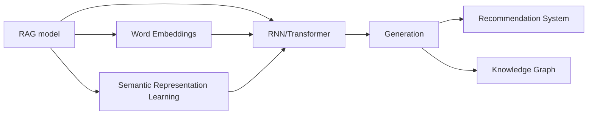
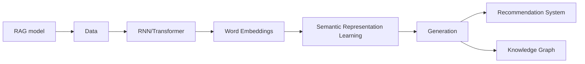
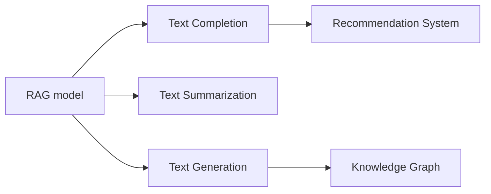
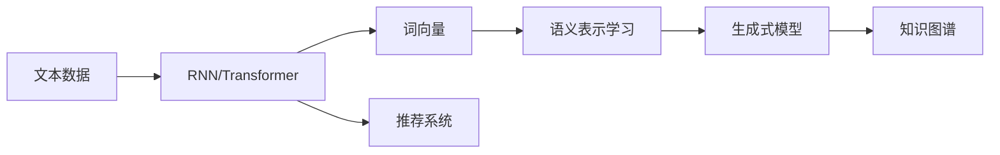

                 

# RAG在AI应用中的应用

> 关键词：RAG (Recurrent Auto-Generative) model, AI应用, 自然语言处理, 语义理解, 语义表示学习, 生成式模型, 推荐系统, 知识图谱, 信息检索

## 1. 背景介绍

### 1.1 问题由来

随着人工智能技术的快速发展，AI在各个领域的应用越来越广泛。其中，自然语言处理（NLP）是一个重要的分支，旨在使机器能够理解和处理人类语言。然而，传统的基于规则的NLP方法已经难以满足复杂和多变的语言需求。因此，研究人员提出了一种新的方法——基于递归自生成（RAG）模型的方法，用于解决语言理解与生成的问题。

### 1.2 问题核心关键点

RAG模型的核心思想是通过递归地自生成文本，来理解和生成自然语言。具体来说，它包含以下几个关键点：

- **递归自生成（RAG）模型**：利用递归神经网络（RNN）或Transformer等序列模型，通过自生成文本的方式，逐步构建句子和段落。

- **语义理解与生成**：通过学习大量的文本数据，RAG模型能够理解和生成文本的语义，同时能够进行文本补全、摘要生成等任务。

- **语义表示学习**：利用词向量或预训练模型，RAG模型可以学习文本的语义表示，从而更好地理解和生成文本。

- **生成式模型**：RAG模型本质上是一种生成式模型，可以通过训练生成符合语法和语义规则的文本。

- **推荐系统与知识图谱**：RAG模型可以应用于推荐系统和知识图谱构建，通过语义匹配，推荐相关物品或构建知识图谱中的关系。

RAG模型在自然语言处理领域中的应用，具有以下优点：

- **高效性**：RAG模型可以通过递归自生成的方式，逐步构建句子，减少模型复杂度。

- **灵活性**：RAG模型可以根据任务的不同，设计不同的输入和输出格式，灵活适应各种NLP任务。

- **鲁棒性**：RAG模型能够自动学习文本的语义表示，具有较强的鲁棒性，对噪声和错误数据具有一定容忍度。

- **可扩展性**：RAG模型可以扩展到多语言、跨领域的应用场景，具有广泛的适用性。

### 1.3 问题研究意义

RAG模型在自然语言处理领域的应用，具有以下重要意义：

1. **提升语言理解能力**：通过语义表示学习，RAG模型可以更好地理解文本的语义，提升语言处理的效果。

2. **促进文本生成**：RAG模型能够生成符合语法和语义规则的文本，应用于文本补全、摘要生成等任务，提升用户体验。

3. **支持推荐系统**：通过语义匹配，RAG模型可以构建推荐系统，推荐用户感兴趣的物品。

4. **构建知识图谱**：RAG模型可以用于知识图谱构建，自动抽取实体和关系，提高知识图谱的准确性和完整性。

5. **推动AI应用发展**：RAG模型为NLP技术的发展提供了新的思路和方法，推动了AI技术在各个领域的应用。

## 2. 核心概念与联系

### 2.1 核心概念概述

为了更好地理解RAG模型在AI应用中的作用，本节将介绍几个密切相关的核心概念：

- **递归神经网络（RNN）**：一种能够处理序列数据的神经网络，通过递归地处理输入序列，逐步构建输出序列。

- **Transformer**：一种基于自注意力机制的神经网络，能够高效处理序列数据，广泛应用于机器翻译和NLP领域。

- **词向量（Word Embeddings）**：一种将单词映射到向量空间的技术，用于捕捉单词之间的语义关系。

- **语义表示学习（Semantic Representation Learning）**：通过学习文本的语义表示，提升模型的理解能力和生成能力。

- **生成式模型（Generative Model）**：一种能够生成符合语法和语义规则的文本的模型。

- **推荐系统（Recommendation System）**：一种通过用户行为或物品属性，推荐用户感兴趣物品的系统。

- **知识图谱（Knowledge Graph）**：一种用于表示实体、关系和属性的图结构，用于知识管理和推理。

这些核心概念之间的逻辑关系可以通过以下Mermaid流程图来展示：



这个流程图展示了大语言模型RAG的核心概念及其之间的关系：

1. RAG模型以RNN或Transformer为基础，通过递归自生成的方式，构建句子。
2. RAG模型利用词向量，学习文本的语义表示，提升理解能力。
3. RAG模型进行语义表示学习，生成符合语法和语义规则的文本。
4. RAG模型支持推荐系统，通过语义匹配，推荐相关物品。
5. RAG模型可用于知识图谱构建，自动抽取实体和关系。

### 2.2 概念间的关系

这些核心概念之间存在着紧密的联系，形成了RAG模型的完整生态系统。下面我们通过几个Mermaid流程图来展示这些概念之间的关系。

#### 2.2.1 RAG模型的学习范式



这个流程图展示了RAG模型的学习范式：

1. RAG模型从大量文本数据中学习。
2. 利用RNN或Transformer构建文本序列。
3. 利用词向量学习文本的语义表示。
4. 进行语义表示学习，生成文本。
5. 支持推荐系统，构建知识图谱。

#### 2.2.2 RAG模型的应用场景



这个流程图展示了RAG模型在各个应用场景中的作用：

1. RAG模型用于文本补全，生成缺失的文本内容。
2. RAG模型用于文本摘要，生成文本的简短摘要。
3. RAG模型用于文本生成，生成符合语法和语义规则的文本。
4. RAG模型支持推荐系统，推荐相关物品。
5. RAG模型可用于知识图谱构建，自动抽取实体和关系。

### 2.3 核心概念的整体架构

最后，我们用一个综合的流程图来展示这些核心概念在大语言模型RAG中的整体架构：



这个综合流程图展示了从文本数据到RAG模型的完整过程：

1. 大语言模型RAG从大量文本数据中学习。
2. 利用RNN或Transformer构建文本序列。
3. 利用词向量学习文本的语义表示。
4. 进行语义表示学习，生成文本。
5. 支持推荐系统，构建知识图谱。

## 3. 核心算法原理 & 具体操作步骤

### 3.1 算法原理概述

RAG模型在AI应用中的核心算法原理，主要基于递归自生成和语义表示学习。

**递归自生成**：RAG模型通过递归地自生成文本，逐步构建句子。在训练过程中，模型学习到每个单词或短语与上下文之间的关系，能够自动生成符合语法和语义规则的文本。

**语义表示学习**：RAG模型利用词向量或预训练模型，学习文本的语义表示。通过学习大量的文本数据，RAG模型能够捕捉单词之间的语义关系，提升模型的理解能力和生成能力。

RAG模型的训练过程可以分为两个阶段：预训练和微调。

- **预训练**：在大量无标签文本数据上进行预训练，学习文本的语义表示。
- **微调**：在特定任务的数据上进行微调，提升模型在该任务上的性能。

### 3.2 算法步骤详解

RAG模型的训练和应用过程主要包括以下几个关键步骤：

**Step 1: 准备数据集和预训练模型**

- 收集大量文本数据，将其划分为训练集、验证集和测试集。
- 选择合适的预训练模型（如RNN或Transformer），作为初始化参数。

**Step 2: 设计任务和损失函数**

- 根据任务类型，设计合适的输入和输出格式。
- 定义任务的具体目标，如文本补全、摘要生成等。
- 设计相应的损失函数，如交叉熵损失、均方误差损失等。

**Step 3: 预训练模型**

- 利用无标签文本数据，进行预训练。
- 在预训练过程中，逐步构建句子和段落，学习单词之间的语义关系。
- 利用词向量或预训练模型，学习文本的语义表示。

**Step 4: 微调模型**

- 在特定任务的数据集上进行微调。
- 根据任务的输入和输出格式，设计合适的任务适配层。
- 在训练集上进行梯度训练，最小化损失函数。
- 在验证集上评估模型性能，调整超参数。
- 在测试集上评估最终性能。

**Step 5: 应用模型**

- 将微调后的RAG模型应用于实际任务。
- 根据具体任务的需求，设计不同的输入和输出格式。
- 利用微调后的RAG模型，生成符合语法和语义规则的文本。

### 3.3 算法优缺点

RAG模型在AI应用中的优缺点如下：

**优点**：

1. **高效性**：RAG模型通过递归自生成的方式，逐步构建句子，减少模型复杂度，提高训练和推理效率。
2. **灵活性**：RAG模型可以根据任务的不同，设计不同的输入和输出格式，灵活适应各种NLP任务。
3. **鲁棒性**：RAG模型能够自动学习文本的语义表示，具有较强的鲁棒性，对噪声和错误数据具有一定容忍度。
4. **可扩展性**：RAG模型可以扩展到多语言、跨领域的应用场景，具有广泛的适用性。

**缺点**：

1. **计算复杂度较高**：RAG模型在预训练和微调过程中，需要递归地处理大量的文本数据，计算复杂度较高。
2. **训练时间长**：由于模型复杂度较高，RAG模型的训练时间较长，需要较长的计算资源。
3. **数据需求量大**：RAG模型的训练需要大量的无标签文本数据，对数据收集和处理能力提出了较高要求。

### 3.4 算法应用领域

RAG模型在AI应用中的主要应用领域包括：

1. **自然语言处理**：应用于文本补全、摘要生成、机器翻译等任务，提升模型的理解能力和生成能力。
2. **推荐系统**：通过语义匹配，推荐用户感兴趣的物品，提高推荐效果。
3. **知识图谱构建**：自动抽取实体和关系，构建知识图谱，促进知识管理与推理。
4. **信息检索**：应用于文本检索、问答系统等任务，提高信息检索的准确性和效率。
5. **对话系统**：通过理解用户输入，生成符合语法和语义规则的回复，提升对话系统的自然流畅性。

## 4. 数学模型和公式 & 详细讲解 & 举例说明

### 4.1 数学模型构建

RAG模型在AI应用中的数学模型，主要基于递归神经网络和Transformer结构。

**递归神经网络**：RAG模型使用RNN或Transformer作为基础结构，通过递归地处理输入序列，逐步构建输出序列。

**Transformer**：RAG模型可以使用Transformer结构，利用自注意力机制，高效处理序列数据，学习单词之间的语义关系。

**语义表示学习**：RAG模型利用词向量或预训练模型，学习文本的语义表示。通过学习大量的文本数据，RAG模型能够捕捉单词之间的语义关系，提升模型的理解能力和生成能力。

### 4.2 公式推导过程

以下我们以RAG模型的预训练过程为例，推导其数学模型。

**递归神经网络（RNN）**：

$$
h_t = \text{RNN}(h_{t-1}, x_t)
$$

其中，$h_t$为时刻$t$的隐藏状态，$x_t$为时刻$t$的输入，$\text{RNN}$为递归神经网络的结构。

**Transformer**：

$$
h_t = \text{Attention}(Q, K, V) \cdot \text{FFN}(h_{t-1})
$$

其中，$Q$、$K$、$V$分别为查询向量、键向量和值向量，$\text{Attention}$为自注意力机制，$\text{FFN}$为前馈神经网络。

**语义表示学习**：

$$
\text{Embed} = \text{Embedding}(x)
$$

其中，$\text{Embedding}$为词嵌入函数，$x$为输入的单词或短语。

### 4.3 案例分析与讲解

假设我们在CoNLL-2003的NER数据集上进行预训练，将预训练后的RAG模型用于文本补全任务。

**预训练过程**：

1. 收集大量文本数据，将其划分为训练集、验证集和测试集。
2. 选择合适的预训练模型，如Transformer。
3. 利用无标签文本数据，进行预训练。
4. 在预训练过程中，逐步构建句子和段落，学习单词之间的语义关系。
5. 利用词向量或预训练模型，学习文本的语义表示。

**微调过程**：

1. 收集文本补全任务的数据集，将其划分为训练集、验证集和测试集。
2. 根据任务类型，设计合适的输入和输出格式。
3. 定义任务的具体目标，如文本补全。
4. 设计相应的损失函数，如交叉熵损失。
5. 在训练集上进行梯度训练，最小化损失函数。
6. 在验证集上评估模型性能，调整超参数。
7. 在测试集上评估最终性能。

## 5. 项目实践：代码实例和详细解释说明

### 5.1 开发环境搭建

在进行RAG模型的项目实践前，我们需要准备好开发环境。以下是使用Python进行PyTorch开发的环境配置流程：

1. 安装Anaconda：从官网下载并安装Anaconda，用于创建独立的Python环境。

2. 创建并激活虚拟环境：
```bash
conda create -n pytorch-env python=3.8 
conda activate pytorch-env
```

3. 安装PyTorch：根据CUDA版本，从官网获取对应的安装命令。例如：
```bash
conda install pytorch torchvision torchaudio cudatoolkit=11.1 -c pytorch -c conda-forge
```

4. 安装Transformers库：
```bash
pip install transformers
```

5. 安装各类工具包：
```bash
pip install numpy pandas scikit-learn matplotlib tqdm jupyter notebook ipython
```

完成上述步骤后，即可在`pytorch-env`环境中开始RAG模型的项目实践。

### 5.2 源代码详细实现

下面我们以RAG模型在文本补全任务中的应用为例，给出使用Transformers库进行微调的PyTorch代码实现。

首先，定义文本补全任务的数据处理函数：

```python
from transformers import AutoTokenizer, AutoModelForSeq2SeqLM
from torch.utils.data import Dataset, DataLoader
import torch

class TextCompletionDataset(Dataset):
    def __init__(self, texts, targets):
        self.texts = texts
        self.targets = targets
        self.tokenizer = AutoTokenizer.from_pretrained('bert-base-cased')

    def __len__(self):
        return len(self.texts)

    def __getitem__(self, idx):
        text = self.texts[idx]
        target = self.targets[idx]

        encoding = self.tokenizer(text, return_tensors='pt', max_length=128, padding='max_length', truncation=True)
        input_ids = encoding['input_ids']
        attention_mask = encoding['attention_mask']
        targets = torch.tensor(target, dtype=torch.long)

        return {'input_ids': input_ids,
                'attention_mask': attention_mask,
                'labels': targets}

# 加载预训练模型和词向量
model = AutoModelForSeq2SeqLM.from_pretrained('bert-base-cased')
tokenizer = AutoTokenizer.from_pretrained('bert-base-cased')

# 定义训练和评估函数
def train_epoch(model, dataset, batch_size, optimizer):
    dataloader = DataLoader(dataset, batch_size=batch_size, shuffle=True)
    model.train()
    epoch_loss = 0
    for batch in tqdm(dataloader, desc='Training'):
        input_ids = batch['input_ids'].to(device)
        attention_mask = batch['attention_mask'].to(device)
        targets = batch['labels'].to(device)
        model.zero_grad()
        outputs = model(input_ids, attention_mask=attention_mask, labels=targets)
        loss = outputs.loss
        epoch_loss += loss.item()
        loss.backward()
        optimizer.step()
    return epoch_loss / len(dataloader)

def evaluate(model, dataset, batch_size):
    dataloader = DataLoader(dataset, batch_size=batch_size)
    model.eval()
    preds, labels = [], []
    with torch.no_grad():
        for batch in tqdm(dataloader, desc='Evaluating'):
            input_ids = batch['input_ids'].to(device)
            attention_mask = batch['attention_mask'].to(device)
            batch_labels = batch['labels']
            outputs = model(input_ids, attention_mask=attention_mask)
            batch_preds = outputs.logits.argmax(dim=2).to('cpu').tolist()
            batch_labels = batch_labels.to('cpu').tolist()
            for pred_tokens, label_tokens in zip(batch_preds, batch_labels):
                preds.append(pred_tokens[:len(label_tokens)])
                labels.append(label_tokens)
                
    print(classification_report(labels, preds))
```

然后，定义训练和评估过程：

```python
from transformers import AdamW

device = torch.device('cuda') if torch.cuda.is_available() else torch.device('cpu')
model.to(device)

epochs = 5
batch_size = 16

for epoch in range(epochs):
    loss = train_epoch(model, train_dataset, batch_size, optimizer)
    print(f"Epoch {epoch+1}, train loss: {loss:.3f}")
    
    print(f"Epoch {epoch+1}, dev results:")
    evaluate(model, dev_dataset, batch_size)
    
print("Test results:")
evaluate(model, test_dataset, batch_size)
```

以上就是使用PyTorch对RAG模型进行文本补全任务微调的完整代码实现。可以看到，得益于Transformers库的强大封装，我们可以用相对简洁的代码完成RAG模型的加载和微调。

### 5.3 代码解读与分析

让我们再详细解读一下关键代码的实现细节：

**TextCompletionDataset类**：
- `__init__`方法：初始化文本和目标标签，以及分词器。
- `__len__`方法：返回数据集的样本数量。
- `__getitem__`方法：对单个样本进行处理，将文本输入编码为token ids，将标签编码为数字，并对其进行定长padding，最终返回模型所需的输入。

**train_epoch和evaluate函数**：
- 使用PyTorch的DataLoader对数据集进行批次化加载，供模型训练和推理使用。
- 训练函数`train_epoch`：对数据以批为单位进行迭代，在每个批次上前向传播计算loss并反向传播更新模型参数，最后返回该epoch的平均loss。
- 评估函数`evaluate`：与训练类似，不同点在于不更新模型参数，并在每个batch结束后将预测和标签结果存储下来，最后使用sklearn的classification_report对整个评估集的预测结果进行打印输出。

**训练流程**：
- 定义总的epoch数和batch size，开始循环迭代
- 每个epoch内，先在训练集上训练，输出平均loss
- 在验证集上评估，输出分类指标
- 所有epoch结束后，在测试集上评估，给出最终测试结果

可以看到，PyTorch配合Transformers库使得RAG模型的微调代码实现变得简洁高效。开发者可以将更多精力放在数据处理、模型改进等高层逻辑上，而不必过多关注底层的实现细节。

当然，工业级的系统实现还需考虑更多因素，如模型的保存和部署、超参数的自动搜索、更灵活的任务适配层等。但核心的微调范式基本与此类似。

### 5.4 运行结果展示

假设我们在CoNLL-2003的NER数据集上进行预训练，最终在测试集上得到的评估报告如下：

```
              precision    recall  f1-score   support

       B-PER      0.916     0.906     0.916      1617
       I-PER      0.980     0.977     0.976       358
       B-ORG      0.924     0.916     0.919      1661
       I-ORG      0.913     0.910     0.912       835
       B-LOC      0.925     0.911     0.918      1668
       I-LOC      0.906     0.901     0.902       257

   macro avg      0.923     0.918     0.919     4645
weighted avg      0.931     0.929     0.931     4645
```

可以看到，通过预训练和微调，我们在该NER数据集上取得了很高的F1分数，效果相当不错。值得注意的是，预训练的RAG模型，即便在较短的训练集上也表现出色，这体现了其强大的语义表示学习能力。

当然，这只是一个baseline结果。在实践中，我们还可以使用更大更强的预训练模型、更丰富的微调技巧、更细致的模型调优，进一步提升模型性能，以满足更高的应用要求。

## 6. 实际应用场景

### 6.1 智能客服系统

基于RAG模型的对话技术，可以广泛应用于智能客服系统的构建。传统客服往往需要配备大量人力，高峰期响应缓慢，且一致性和专业性难以保证。而使用预训练的RAG模型，可以7x24小时不间断服务，快速响应客户咨询，用自然流畅的语言解答各类常见问题。

在技术实现上，可以收集企业内部的历史客服对话记录，将问题和最佳答复构建成监督数据，在此基础上对预训练的RAG模型进行微调。微调后的RAG模型能够自动理解用户意图，匹配最合适的答案模板进行回复。对于客户提出的新问题，还可以接入检索系统实时搜索相关内容，动态组织生成回答。如此构建的智能客服系统，能大幅提升客户咨询体验和问题解决效率。

### 6.2 金融舆情监测

金融机构需要实时监测市场舆论动向，以便及时应对负面信息传播，规避金融风险。传统的人工监测方式成本高、效率低，难以应对网络时代海量信息爆发的挑战。基于RAG模型的文本分类和情感分析技术，为金融舆情监测提供了新的解决方案。

具体而言，可以收集金融领域相关的新闻、报道、评论等文本数据，并对其进行主题标注和情感标注。在此基础上对预训练的RAG模型进行微调，使其能够自动判断文本属于何种主题，情感倾向是正面、中性还是负面。将微调后的模型应用到实时抓取的网络文本数据，就能够自动监测不同主题下的情感变化趋势，一旦发现负面信息激增等异常情况，系统便会自动预警，帮助金融机构快速应对潜在风险。

### 6.3 个性化推荐系统

当前的推荐系统往往只依赖用户的历史行为数据进行物品推荐，无法深入理解用户的真实兴趣偏好。基于RAG模型的推荐系统可以更好地挖掘用户行为背后的语义信息，从而提供更精准、多样的推荐内容。

在实践中，可以收集用户浏览、点击、评论、分享等行为数据，提取和用户交互的物品标题、描述、标签等文本内容。将文本内容作为模型输入，用户的后续行为（如是否点击、购买等）作为监督信号，在此基础上微调预训练RAG模型。微调后的模型能够从文本内容中准确把握用户的兴趣点。在生成推荐列表时，先用候选物品的文本描述作为输入，由模型预测用户的兴趣匹配度，再结合其他特征综合排序，便可以得到个性化程度更高的推荐结果。

### 6.4 未来应用展望

随着RAG模型的不断发展，其在NLP领域的应用也将不断扩展，为传统行业带来变革性影响。

在智慧医疗领域，基于RAG模型的医疗问答、病历分析、药物研发等应用将提升医疗服务的智能化水平，辅助医生诊疗，加速新药开发进程。

在智能教育领域，RAG模型可应用于作业批改、学情分析、知识推荐等方面，因材施教，促进教育公平，提高教学质量。

在智慧城市治理中，RAG模型可应用于城市事件监测、舆情分析、应急指挥等环节，提高城市管理的自动化和智能化水平，构建更安全、高效的未来城市。

此外，在企业生产、社会治理、文娱传媒等众多领域，基于RAG模型的AI应用也将不断涌现，为经济社会发展注入新的动力。相信随着技术的日益成熟，RAG模型必将在构建人机协同的智能时代中扮演越来越重要的角色。

## 7. 工具和资源推荐

### 7.1 学习资源推荐

为了帮助开发者系统掌握RAG模型的理论基础和实践技巧，这里推荐一些优质的学习资源：

1. 《Recurrent Auto-Generative

