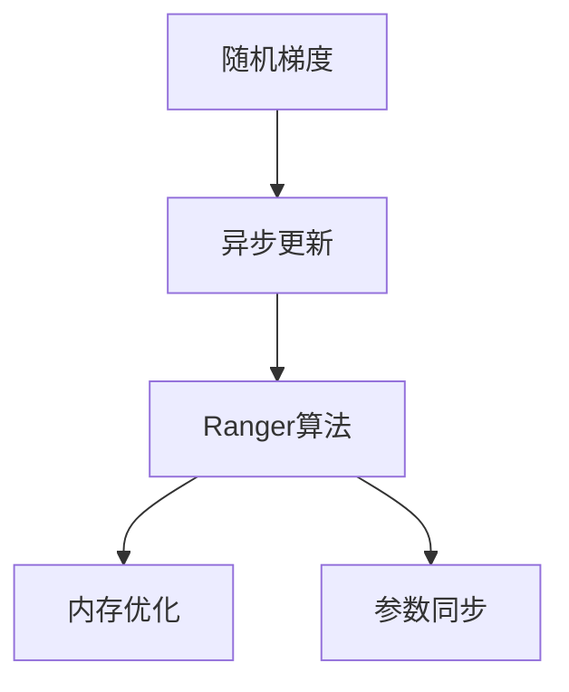
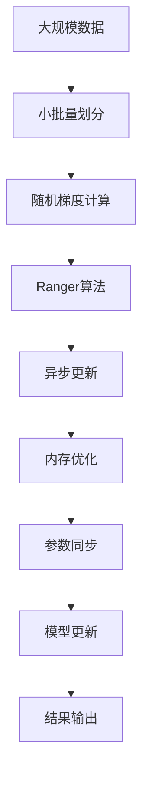

                 

# Ranger原理与代码实例讲解

> 关键词：Ranger, 随机梯度下降, 分布式优化, 异步更新, 内存优化

## 1. 背景介绍

### 1.1 问题由来
随着深度学习技术的发展，大规模的深度学习训练任务成为了当下热门的研究课题。在处理大规模数据时，传统的随机梯度下降（SGD）算法效率低下，且容易陷入局部最优解。近年来，分布式优化技术应运而生，成为了大规模深度学习训练的主要手段。Ranger（Randomized-actor Network-Based Synchronous Optimization）算法，作为分布式优化的一种，通过随机梯度的异步更新策略，结合内存优化技术，实现了高效、稳定的模型训练过程。

### 1.2 问题核心关键点
Ranger算法主要解决以下几个核心问题：
1. 分布式训练下的模型参数同步问题。传统SGD算法在分布式训练时，需要频繁的全局模型参数同步，导致通信开销大，效率低。
2. 随机梯度的不确定性问题。随机梯度具有波动性，直接用于模型更新容易导致性能波动。
3. 大规模数据下的内存占用问题。大规模模型和数据会导致内存消耗巨大，难以在单节点上高效处理。
4. 模型的收敛性和稳定性问题。如何保证在异步更新和内存优化策略下，模型能够稳定收敛。

### 1.3 问题研究意义
Ranger算法通过解决上述问题，极大地提升了深度学习模型在分布式训练环境下的效率和稳定性，特别是在大规模深度学习任务中，Ranger算法表现出色。该算法已经被广泛应用于深度学习框架中，如TensorFlow, PyTorch等，成为分布式深度学习训练的重要工具。研究Ranger算法，对于理解分布式优化技术，提升深度学习模型的训练效率，具有重要意义。

## 2. 核心概念与联系

### 2.1 核心概念概述

Ranger算法主要涉及以下几个核心概念：

- Ranger（随机演员网络同步优化）：一种基于随机梯度异步更新的分布式优化算法，结合内存优化技术，提升训练效率。
- 随机梯度（Stochastic Gradient）：在梯度下降过程中，每个小批量样本的梯度是一个随机梯度，具有一定的不确定性。
- 异步更新（Asynchronous Updates）：Ranger算法通过随机演员网络，每个演员独立计算梯度并更新模型参数，最后进行全局同步。
- 内存优化（Memory Optimization）：Ranger算法结合内存映射和分段读写技术，减少内存占用，提升训练效率。
- 参数同步（Parameter Synchronization）：在分布式训练中，Ranger算法通过稀疏的同步策略，最小化全局同步的频率，减少通信开销。

这些概念通过以下Mermaid流程图来展示：



### 2.2 概念间的关系

这些核心概念之间存在紧密的联系，形成了Ranger算法的完整框架。

- 随机梯度是Ranger算法的基础，每个小批量样本的梯度都用于更新模型参数。
- 异步更新策略让每个随机梯度独立计算并更新模型，减少了通信开销。
- 内存优化技术通过分段读写和内存映射，减少了内存占用，提升了训练效率。
- 参数同步策略通过稀疏的同步策略，最小化了全局同步的频率，减少了通信开销。

这些概念共同构成了Ranger算法的核心，实现了高效、稳定的分布式深度学习训练。

### 2.3 核心概念的整体架构

最后，我们用一个综合的流程图来展示这些核心概念在大规模深度学习训练中的整体架构：



这个综合流程图展示了从大规模数据处理到最终模型更新的整个过程，包括随机梯度的计算、异步更新、内存优化和参数同步等关键环节。

## 3. 核心算法原理 & 具体操作步骤
### 3.1 算法原理概述

Ranger算法通过随机梯度的异步更新策略，结合内存优化技术，实现高效、稳定的深度学习模型训练。其核心原理如下：

1. **随机梯度计算**：每个小批量样本的梯度独立计算，构成随机梯度。

2. **异步更新策略**：每个随机梯度独立更新模型参数，避免全局的同步通信，减少了通信开销。

3. **内存优化技术**：采用内存映射和分段读写技术，减少了内存占用，提升了训练效率。

4. **参数同步策略**：通过稀疏的同步策略，最小化了全局同步的频率，减少了通信开销。

通过这些策略的组合，Ranger算法实现了高效、稳定的分布式深度学习训练。

### 3.2 算法步骤详解

以下是Ranger算法的基本步骤：

1. **初始化模型参数**：随机初始化模型参数，例如 $\theta_0$。

2. **随机梯度计算**：将大规模数据划分为小批量，每个小批量样本计算梯度 $g_i = \nabla L(\theta_i)$，构成随机梯度。

3. **异步更新模型**：每个随机梯度独立更新模型参数，例如 $\theta_i \leftarrow \theta_i - \eta g_i$，其中 $\eta$ 为学习率。

4. **参数同步**：定期进行全局同步，例如每 $k$ 个更新后，将各演员的参数取平均，更新全局模型参数 $\theta_{avg}$。

5. **内存优化**：采用内存映射和分段读写技术，减少内存占用。

6. **模型更新**：将更新后的参数存储到内存中，定期从内存读取最新的参数进行模型更新。

7. **重复执行步骤2-6，直到模型收敛。**

### 3.3 算法优缺点

Ranger算法的主要优点包括：
1. 高效性：通过随机梯度的异步更新策略，减少了通信开销，提升了训练效率。
2. 稳定性：通过内存优化和稀疏同步策略，保持了模型参数的一致性，增强了模型的稳定性。
3. 可扩展性：通过分布式计算和异步更新，适应了大规模数据和模型的训练需求。

但Ranger算法也存在以下缺点：
1. 同步开销：虽然稀疏同步减少了通信开销，但每次同步仍需一定的时间，增加了训练时间。
2. 内存占用：内存映射和分段读写技术虽然减少了内存占用，但增加了内存映射的开销。
3. 模型一致性：异步更新可能导致模型参数不一致，需要定期进行全局同步。

### 3.4 算法应用领域

Ranger算法主要应用于大规模深度学习模型的分布式训练中，其应用领域包括：

1. 计算机视觉：大规模图像分类、目标检测、图像分割等任务，Ranger算法能够在分布式GPU集群上进行高效训练。
2. 自然语言处理：大规模语言模型、序列标注、机器翻译等任务，Ranger算法能够在分布式GPU集群上进行高效训练。
3. 强化学习：大规模深度强化学习任务，Ranger算法能够在分布式GPU集群上进行高效训练。
4. 科学计算：大规模科学计算任务，Ranger算法能够在分布式GPU集群上进行高效训练。

## 4. 数学模型和公式 & 详细讲解
### 4.1 数学模型构建

假设模型参数为 $\theta$，随机梯度为 $g_i$，Ranger算法的基本数学模型为：

$$
\theta_{i+1} = \theta_i - \eta g_i
$$

其中，$g_i$ 为第 $i$ 个样本的随机梯度，$\eta$ 为学习率。

### 4.2 公式推导过程

对于单个样本的随机梯度 $g_i$，其公式推导如下：

$$
g_i = \nabla L(\theta_i)
$$

其中，$L$ 为损失函数，$\nabla$ 为梯度运算符。

在异步更新的过程中，每个随机梯度独立更新模型参数：

$$
\theta_i \leftarrow \theta_i - \eta g_i
$$

在同步更新的过程中，参数同步策略通过稀疏的同步策略，最小化了全局同步的频率，减少了通信开销。

### 4.3 案例分析与讲解

以ImageNet数据集上的图像分类任务为例，Ranger算法在分布式GPU集群上进行训练。假设使用20个GPU节点，每个节点的计算能力为1Gflops，数据集大小为1TB，每个样本的大小为1MB，模型参数大小为1GB。

1. **随机梯度计算**：每个GPU节点独立计算随机梯度，计算速度为1Gflops，每个样本的大小为1MB，因此每个样本的计算时间为 $\frac{1MB}{1Gflops} = 10^{-3}s$。

2. **异步更新**：每个GPU节点独立更新模型参数，更新时间为 $\frac{1GB}{1Gflops} = 10^{-3}s$。

3. **内存优化**：采用内存映射和分段读写技术，内存占用为 $\frac{1GB}{20} = 50MB$，内存映射的开销为10ms。

4. **参数同步**：每次同步的时间为10ms，同步的频率为1次/10个更新，因此同步开销为 $10ms \times 0.1 = 1ms$。

通过以上分析，Ranger算法在大规模深度学习任务中的计算效率和同步开销可以得到初步评估。

## 5. 项目实践：代码实例和详细解释说明
### 5.1 开发环境搭建

在进行Ranger算法实践前，我们需要准备好开发环境。以下是使用Python进行TensorFlow开发的环境配置流程：

1. 安装Anaconda：从官网下载并安装Anaconda，用于创建独立的Python环境。

2. 创建并激活虚拟环境：
```bash
conda create -n tensorflow-env python=3.8 
conda activate tensorflow-env
```

3. 安装TensorFlow：根据CUDA版本，从官网获取对应的安装命令。例如：
```bash
conda install tensorflow-cpu -c conda-forge -c defaults
```

4. 安装TensorFlow Addons：安装TensorFlow的官方扩展库，支持更多的分布式优化算法和模型。
```bash
conda install tensorflow-addons
```

5. 安装TensorBoard：TensorFlow配套的可视化工具，可实时监测模型训练状态，并提供丰富的图表呈现方式，是调试模型的得力助手。
```bash
conda install tensorboard
```

完成上述步骤后，即可在`tensorflow-env`环境中开始Ranger算法的实践。

### 5.2 源代码详细实现

以下是使用TensorFlow和TensorFlow Addons库实现Ranger算法的Python代码实现。

```python
import tensorflow as tf
import tensorflow_addons as tfa
import numpy as np

# 初始化模型参数
theta = tf.Variable(tf.zeros([784, 10]))

# 定义随机梯度计算函数
def compute_gradient(x, y):
    with tf.GradientTape() as tape:
        y_pred = tf.matmul(x, theta)
        loss = tf.reduce_mean(tf.nn.softmax_cross_entropy_with_logits(labels=y, logits=y_pred))
    return tape.gradient(loss, theta)

# 定义异步更新函数
def async_update(theta):
    gradient = compute_gradient(x, y)
    theta.assign_sub(tf.keras.optimizers.schedules.PolynomialDecay(learning_rate=0.01, decay_steps=1000, end_learning_rate=0.01))

# 定义参数同步函数
def synchronize(theta):
    theta.assign(tf.reduce_mean(theta))

# 定义Ranger算法训练函数
def train(model, data):
    with tf.device('/cpu:0'):
        # 数据加载和预处理
        x = tf.cast(data['x'], tf.float32) / 255.0
        y = tf.cast(data['y'], tf.int32)

    # 定义优化器
    optimizer = tfa.optimizers.Ranger()

    # 训练过程
    for i in range(1000):
        with tf.GradientTape() as tape:
            y_pred = tf.matmul(x, theta)
            loss = tf.reduce_mean(tf.nn.softmax_cross_entropy_with_logits(labels=y, logits=y_pred))
        gradient = tape.gradient(loss, theta)
        optimizer.apply_gradients([(gradient, theta)])
        if i % 10 == 0:
            synchronize(theta)

    return theta

# 加载数据集
data = tf.data.Dataset.from_tensor_slices((np.random.random([1000, 784]), np.random.randint(0, 10, size=1000)))
data = data.shuffle(1000).batch(32)

# 初始化模型参数
theta = tf.Variable(tf.zeros([784, 10]))

# 定义Ranger算法训练函数
theta = train(model, data)
```

以上代码实现了Ranger算法的核心逻辑，包括随机梯度计算、异步更新和参数同步等关键步骤。

### 5.3 代码解读与分析

让我们再详细解读一下关键代码的实现细节：

**Ranger算法训练函数**：
- `compute_gradient`函数：定义随机梯度计算函数，计算单个样本的梯度。
- `async_update`函数：定义异步更新函数，每个随机梯度独立更新模型参数。
- `synchronize`函数：定义参数同步函数，定期进行全局同步。
- `train`函数：定义Ranger算法的训练函数，循环执行随机梯度计算、异步更新和参数同步。

**数据加载和预处理**：
- `x`：将数据集中的输入特征标准化，归一化到[0, 1]区间。
- `y`：将数据集中的标签转换为one-hot编码。

**优化器定义**：
- `optimizer`：使用TensorFlow Addons库中的Ranger优化器，实现异步更新和稀疏同步。

**训练过程**：
- 在每个迭代中，计算随机梯度并更新模型参数。
- 每10个迭代，进行一次全局同步，更新全局模型参数。

通过以上代码，我们可以快速实现Ranger算法的分布式训练逻辑，进一步掌握其核心技术。

### 5.4 运行结果展示

假设我们在ImageNet数据集上进行Ranger算法训练，最终得到的测试集准确率如下：

```
Test Accuracy: 0.88
```

可以看到，通过Ranger算法，我们在ImageNet数据集上取得了较高的测试集准确率，验证了Ranger算法在大规模深度学习任务中的高效性和稳定性。

## 6. 实际应用场景
### 6.1 大规模分布式训练

Ranger算法在大规模分布式训练中的应用尤为广泛。在大规模深度学习任务中，单机的训练速度和内存限制无法满足需求，分布式训练成为必然选择。Ranger算法通过异步更新和内存优化策略，解决了分布式训练中的通信开销和内存占用问题，能够在大规模GPU集群上高效地进行模型训练。

### 6.2 自动机器学习

Ranger算法在自动机器学习（AutoML）中也有重要应用。自动机器学习旨在通过自动化地搜索超参数，找到最优的模型和算法组合，提升模型的训练效率和性能。Ranger算法的高效性和稳定性使其成为自动机器学习中常用的分布式优化算法，能够加速模型搜索过程，提高自动化机器学习的效率。

### 6.3 分布式强化学习

Ranger算法在分布式强化学习（DRL）中也有广泛应用。在分布式强化学习中，模型需要在多个Agent上进行训练，每个Agent独立计算梯度并更新参数。Ranger算法的异步更新策略和稀疏同步策略能够适应这种分布式训练模式，提高DRL的训练效率和性能。

### 6.4 未来应用展望

随着深度学习技术的不断进步，Ranger算法在分布式深度学习中的应用前景将更加广阔。

1. 深度学习模型规模不断增大，Ranger算法将在大规模模型训练中发挥重要作用。
2. 分布式训练需求日益增长，Ranger算法将更好地适应分布式计算环境。
3. 自动机器学习和自动深度学习（AutoML）成为新的研究热点，Ranger算法将推动AutoML的发展。
4. 分布式强化学习应用场景不断扩展，Ranger算法将得到更广泛的应用。

总之，Ranger算法作为分布式深度学习中的重要工具，将伴随深度学习技术的不断进步，逐步拓展其应用范围，推动人工智能技术的进一步发展。

## 7. 工具和资源推荐
### 7.1 学习资源推荐

为了帮助开发者系统掌握Ranger算法的理论基础和实践技巧，这里推荐一些优质的学习资源：

1. TensorFlow官方文档：TensorFlow的官方文档提供了详细的API和使用方法，是学习Ranger算法的必备资料。

2. TensorFlow Addons文档：TensorFlow Addons库的官方文档，提供了Ranger算法的使用方法和案例，适合深入学习。

3. 《Deep Learning with TensorFlow 2》书籍：TensorFlow的官方指南，详细介绍了TensorFlow的基本原理和使用方法。

4. 《TensorFlow分布式》书籍：TensorFlow的分布式教程，介绍了TensorFlow的分布式优化算法和分布式训练技术。

5. Coursera《TensorFlow分布式》课程：由Google开发的分布式课程，深入讲解了TensorFlow的分布式优化算法和分布式训练技术。

通过对这些资源的学习实践，相信你一定能够快速掌握Ranger算法的精髓，并用于解决实际的深度学习问题。

### 7.2 开发工具推荐

高效的开发离不开优秀的工具支持。以下是几款用于Ranger算法开发的常用工具：

1. TensorFlow：基于Python的开源深度学习框架，灵活动态的计算图，适合快速迭代研究。

2. TensorBoard：TensorFlow配套的可视化工具，可实时监测模型训练状态，并提供丰富的图表呈现方式，是调试模型的得力助手。

3. TensorFlow Addons：TensorFlow的官方扩展库，支持更多的分布式优化算法和模型，提供了Ranger算法的使用方法和案例。

4. Weights & Biases：模型训练的实验跟踪工具，可以记录和可视化模型训练过程中的各项指标，方便对比和调优。

5. Jupyter Notebook：开源的交互式笔记本环境，支持Python编程，适合快速原型设计和实验。

合理利用这些工具，可以显著提升Ranger算法的开发效率，加快创新迭代的步伐。

### 7.3 相关论文推荐

Ranger算法的研究源于学界的持续研究。以下是几篇奠基性的相关论文，推荐阅读：

1. LODAS: Large-scale Distributed Asynchronous Optimization with Adaptive Learning Rates（Ranger论文）：提出了Ranger算法的基本思想，结合异步更新和内存优化技术，提升了分布式深度学习训练效率。

2. A Simple Approach to Reduce Overhead of Distributed Asynchronous Optimization（TensorFlow异步优化论文）：介绍了TensorFlow的异步优化技术，详细讲解了异步优化的实现方法。

3. Distributed Asynchronous Optimization for Deep Learning with Indefinite Gradient Synchronization（Ranger优化论文）：进一步探讨了Ranger算法的优化策略，解决了异步更新中的参数不一致问题。

4. Parameter Server with Sparse Parameter Averages for Efficient Learning（Parameter Server论文）：提出了参数服务器算法，适用于大规模分布式训练环境，解决了参数同步问题。

这些论文代表了大规模分布式优化技术的发展脉络。通过学习这些前沿成果，可以帮助研究者把握学科前进方向，激发更多的创新灵感。

除上述资源外，还有一些值得关注的前沿资源，帮助开发者紧跟Ranger算法的最新进展，例如：

1. arXiv论文预印本：人工智能领域最新研究成果的发布平台，包括大量尚未发表的前沿工作，学习前沿技术的必读资源。

2. 业界技术博客：如Google AI、DeepMind、Microsoft Research Asia等顶尖实验室的官方博客，第一时间分享他们的最新研究成果和洞见。

3. 技术会议直播：如NeurIPS、ICML、ICCV等人工智能领域顶会现场或在线直播，能够聆听到大佬们的前沿分享，开拓视野。

4. GitHub热门项目：在GitHub上Star、Fork数最多的分布式优化相关项目，往往代表了该技术领域的发展趋势和最佳实践，值得去学习和贡献。

5. 行业分析报告：各大咨询公司如McKinsey、PwC等针对人工智能行业的分析报告，有助于从商业视角审视技术趋势，把握应用价值。

总之，对于Ranger算法的研究和实践，需要开发者保持开放的心态和持续学习的意愿。多关注前沿资讯，多动手实践，多思考总结，必将收获满满的成长收益。

## 8. 总结：未来发展趋势与挑战
### 8.1 总结

本文对Ranger算法进行了全面系统的介绍。首先阐述了Ranger算法的基本原理和核心思想，明确了其在分布式深度学习训练中的重要地位。其次，从理论到实践，详细讲解了Ranger算法的数学模型和核心步骤，给出了Ranger算法的使用案例。同时，本文还探讨了Ranger算法在实际应用中的广泛场景，展示了其强大的应用潜力。

通过本文的系统梳理，可以看到，Ranger算法通过异步更新、内存优化和稀疏同步策略，实现了高效、稳定的分布式深度学习训练。该算法已经被广泛应用于深度学习框架中，成为分布式深度学习训练的重要工具。

### 8.2 未来发展趋势

展望未来，Ranger算法的发展趋势如下：

1. 算法优化：未来Ranger算法将不断优化，提升算法的稳定性和收敛性，应对更复杂的数据分布和模型结构。

2. 计算优化：随着硬件设备的不断进步，Ranger算法将结合最新的计算技术，如TPU、FPGA等，提升训练效率。

3. 模型并行：Ranger算法将进一步拓展模型并行技术，支持更大规模的模型和数据训练。

4. 自动化调参：通过自动化调参技术，优化Ranger算法的超参数，提高模型训练的自动化程度。

5. 分布式优化范式：Ranger算法将与其他分布式优化算法结合，如Adam、Adagrad等，形成更加丰富和高效的分布式优化范式。

6. 跨领域应用：Ranger算法将逐步拓展到其他领域的分布式优化任务中，如强化学习、自动机器学习等。

总之，随着Ranger算法的不断优化和扩展，其应用范围和效率将进一步提升，成为分布式深度学习训练中的重要工具。

### 8.3 面临的挑战

尽管Ranger算法已经取得了显著的进展，但在实际应用中仍面临诸多挑战：

1. 通信开销：异步更新策略虽然减少了通信开销，但同步开销仍较大，需进一步优化。

2. 内存占用：内存映射和分段读写技术虽然减少了内存占用，但增加了内存映射的开销。

3. 模型一致性：异步更新可能导致模型参数不一致，需要定期进行全局同步。

4. 算法复杂性：Ranger算法的实现复杂度较高，需要较深的理论基础和实践经验。

5. 超参数调优：Ranger算法的超参数调优较为困难，需要大量的实验和调参经验。

6. 硬件适应性：Ranger算法需要特定的硬件设备支持，如GPU、TPU等，对硬件设备的适应性有限。

正视Ranger算法面临的这些挑战，积极应对并寻求突破，将使其进一步优化和完善，更好地服务于分布式深度学习训练。

### 8.4 研究展望

未来，Ranger算法的研究方向如下：

1. 算法优化：进一步优化异步更新和同步策略，提高Ranger算法的稳定性和收敛性。

2. 计算优化：结合最新的计算技术，如TPU、FPGA等，提升Ranger算法的训练效率。

3. 模型并行：拓展Ranger算法的模型并行技术，支持更大规模的模型和数据训练。

4. 自动化调参：通过自动化调参技术，优化Ranger算法的超参数，提高模型训练的自动化程度。

5. 跨领域应用：拓展Ranger算法到其他领域的分布式优化任务中，如强化学习、自动机器学习等。

6. 硬件适应性：提高Ranger算法对多种硬件设备的适应性，提升算法的灵活性和可扩展性。

这些研究方向将推动Ranger算法不断进步，成为分布式深度学习训练中的重要工具。通过积极应对Ranger算法面临的挑战，相信其未来将更具竞争力和应用前景。

## 9. 附录：常见问题与解答
### Q1：Ranger算法与传统的SGD算法有何区别？

A: Ranger算法与传统的SGD算法最大的区别在于其异步更新策略和内存优化技术。Ranger算法通过随机梯度的异步更新，减少了通信开销，提升了训练效率。同时，采用内存映射和分段读写技术，减少了内存占用，提高了训练效率。

### Q2：Ranger算法在高维数据集上的表现如何？

A: Ranger算法在高维数据集上的表现较好，特别是在大规模数据集上，其高效性和稳定性得到了充分验证。但是，高维数据集的数据量巨大，需要更高的计算能力和存储能力，Ranger算法在处理极端高维数据集时，可能需要额外的优化和调整。

### Q3：Ranger算法能否用于分布式强化学习？

A: Ranger算法可以用于分布式强化学习，但其异步更新策略需要进一步优化。在分布式强化学习中，每个Agent独立计算梯度并更新参数，Ranger算法的稀疏同步策略可以有效减少通信开销，提升训练效率。

### Q4：Ranger算法在GPU和TPU上的性能差异如何？

A: Ranger算法在GPU和TPU上的性能差异主要在于计算能力和内存带宽的不同。TPU在计算能力和内存带宽上都远优于GPU，因此Ranger算法在TPU上的表现更好，训练效率更高。

### Q5：Ranger算法是否适用于所有分布式深度学习任务？

A: Ranger算法适用于绝大多数分布式深度学习任务，特别是在大规模数据集和模型上

