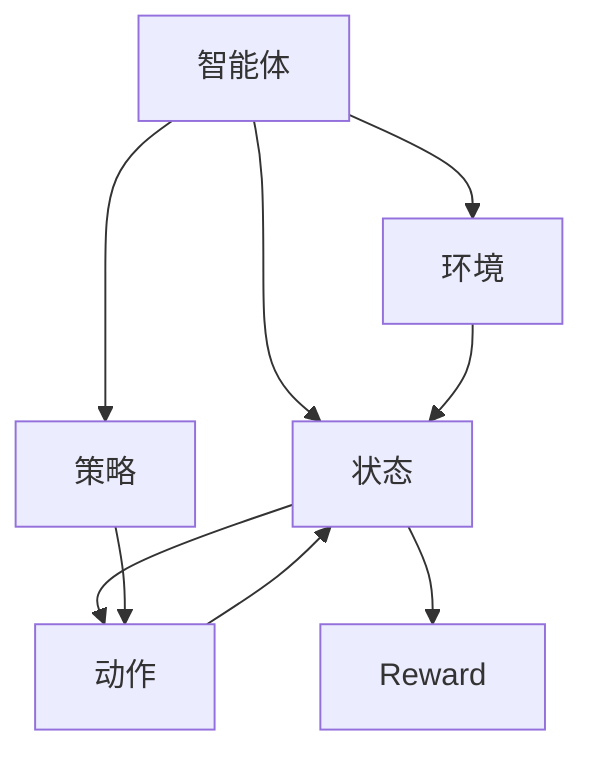

                 

# Reinforcement Learning

> 关键词：强化学习,Markov决策过程,价值迭代,策略迭代,深度强化学习,策略梯度,Actor-Critic,多智能体

## 1. 背景介绍

### 1.1 问题由来
强化学习（Reinforcement Learning, RL）是一种通过与环境交互，让智能体（智能体可以是人、机器人、程序等）在一定的策略指导下，通过试错逐渐学习最优策略的过程。强化学习的核心思想是“试错学习”，即在不断与环境互动的过程中，通过接收环境的奖励或惩罚信号，逐步调整自身的行为策略，以最大化长期奖励。

近年来，强化学习在多个领域取得了一系列重要进展，如机器人控制、游戏AI、自动驾驶、推荐系统等。特别是AlphaGo的问世，标志着强化学习在复杂决策问题上的巨大潜力。然而，相比于传统的监督学习（Supervised Learning）和无监督学习（Unsupervised Learning），强化学习的应用场景和理论成熟度还存在差距。本文将详细探讨强化学习的核心概念与算法，并结合实际应用场景，展示其潜力和前景。

### 1.2 问题核心关键点
强化学习相较于监督学习，其核心在于智能体与环境之间复杂的互动关系，以及如何通过奖励信号引导智能体的行为选择。强化学习的主要挑战包括：

- 动作空间和状态空间通常很大，难以进行全局最优求解。
- 环境动态和不确定性，使得学习过程存在探索与利用（Exploration vs Exploitation）的平衡问题。
- 奖励信号稀疏且延迟，使得学习过程难以直接优化长期奖励。
- 复杂环境与模型之间的相互作用，增加了学习和优化的难度。

因此，强化学习的主要研究方向包括：动作空间压缩、探索与利用平衡、奖励学习、多智能体协同等。这些研究方向相互交织，共同推动了强化学习技术的进步。

### 1.3 问题研究意义
强化学习技术在智能体自主决策、系统优化、复杂任务自动执行等方面具有重要应用前景。通过强化学习，智能体能够自动适应环境和任务变化，解决复杂场景下的多目标优化问题，推动智能技术在更多领域的落地应用。

强化学习的应用场景广泛，如游戏AI、机器人控制、自动驾驶、推荐系统、金融风控等。通过智能体对环境的自主探索和优化，强化学习能够提升自动化系统的工作效率和决策质量，为用户提供更为个性化和高效的服务体验。

## 2. 核心概念与联系

### 2.1 核心概念概述

为更好地理解强化学习的核心概念和算法，本节将详细介绍几个关键概念及其之间的联系。

- **智能体（Agent）**：在强化学习中，智能体是决策的主体，通过与环境互动获取信息，并根据当前状态选择动作。智能体的目标是通过学习最优策略，最大化长期奖励。

- **环境（Environment）**：环境是智能体的行动域，根据智能体的动作产生状态和奖励信号。环境通常是动态变化的，具有不确定性，影响智能体的决策过程。

- **状态（State）**：状态是环境当前所处的状态，通常包含环境的重要特征信息。智能体需要通过观察状态，推断环境状态，进行决策。

- **动作（Action）**：动作是智能体对环境的干预，可以是连续动作（如机器人臂的位置和速度）或离散动作（如玩游戏时的选择）。动作的选取直接影响环境状态和奖励信号。

- **奖励（Reward）**：奖励是环境对智能体当前动作的反馈信号，用于评估动作的好坏。奖励可以是即时奖励（如即时得分），也可以是累计奖励（如游戏得分）。

- **策略（Policy）**：策略是智能体选择动作的规则，可以是一个映射函数（如Q函数）或概率分布（如策略网络）。策略的目标是最大化长期奖励。

- **值函数（Value Function）**：值函数是环境状态或动作的评估函数，用于估计智能体在不同状态或动作下的长期奖励。常用的值函数包括状态值函数（State Value Function, V函数）和动作值函数（Action Value Function, Q函数）。

- **动作-状态轨迹（Action-State Trajectory）**：动作-状态轨迹是指智能体从某一状态出发，经过若干步动作到达另一状态的过程。动作-状态轨迹在强化学习中具有重要意义，用于评估和优化策略。

- **时间步长（Time Step）**：时间步长是指智能体对环境的一次操作周期，通常包含观察状态、选择动作、接收奖励和进入下一状态的过程。时间步长是强化学习中的基本单位，用于定义学习过程。

### 2.2 概念间的关系

这些核心概念之间存在着紧密的联系，形成了强化学习的基本框架。以下用两个Mermaid流程图展示这些概念之间的关系。

#### 2.2.1 强化学习的基本流程



这个流程图展示了智能体与环境之间的交互过程。智能体通过策略选择动作，根据状态观察和动作执行，得到环境反馈的奖励和状态变化，不断更新策略，最终达到最优决策。

#### 2.2.2 强化学习的主要算法

```mermaid
graph LR
    A[状态-动作轨迹] --> B[状态值函数V(s)]
    B --> C[策略π(a|s)]
    C --> D[动作值函数Q(s,a)]
    D --> E[Reward]
    E --> F[环境]
    F --> G[智能体]
    G --> H[下一步状态]
    H --> I[下一步策略]
```

这个流程图展示了强化学习的主要算法过程。从状态-动作轨迹出发，通过状态值函数和动作值函数进行优化，更新策略和值函数，最终反馈到智能体，进入下一轮迭代。

## 3. 核心算法原理 & 具体操作步骤
### 3.1 算法原理概述

强化学习的核心算法原理基于Markov决策过程（Markov Decision Process, MDP），通过求解MDP模型的最优策略，实现智能体的自主决策和优化。MDP模型由状态空间、动作空间、状态转移概率、奖励函数和策略构成。通过求解MDP模型，强化学习算法能够在动态环境中实现最优决策。

在MDP模型中，状态、动作和奖励是核心元素，状态转移概率描述了环境状态之间的动态关系，策略定义了智能体选择动作的规则，值函数用于评估和优化策略。

### 3.2 算法步骤详解

强化学习算法主要包括以下几个步骤：

**Step 1: 构建MDP模型**
- 定义状态空间和动作空间，描述环境特征和智能体的行动能力。
- 确定状态转移概率和奖励函数，描述环境状态之间的动态关系和智能体的行为激励。
- 设计策略，定义智能体选择动作的规则。

**Step 2: 优化值函数**
- 通过状态值函数或动作值函数进行优化，更新值函数的估计。
- 常用的优化方法包括值迭代（Value Iteration）和策略迭代（Policy Iteration）。

**Step 3: 策略更新**
- 根据值函数优化结果，更新智能体的策略。
- 策略更新的方法包括策略梯度（Policy Gradient）和Actor-Critic算法等。

**Step 4: 策略评估与改进**
- 通过实验或模拟评估策略的效果。
- 根据评估结果，调整策略和值函数，优化决策过程。

### 3.3 算法优缺点

强化学习具有以下优点：
1. 动态环境适应性强。强化学习能够处理动态和不确定性的环境，通过试错学习不断优化决策。
2. 无需大量标注数据。强化学习直接从环境反馈中学习，减少了对标注数据的需求。
3. 自主决策能力。强化学习能够自主探索和优化，适应复杂和多目标优化问题。
4. 鲁棒性。强化学习能够应对噪声和干扰，提高系统的鲁棒性和抗风险能力。

同时，强化学习也存在一些缺点：
1. 学习效率低。强化学习需要大量的试错和迭代过程，学习效率较低。
2. 策略探索与利用平衡问题。强化学习需要平衡探索和利用，避免过早陷入局部最优。
3. 奖励信号设计困难。奖励信号的设计复杂且难度大，可能影响学习效果。
4. 状态空间和动作空间巨大。复杂的MDP模型可能存在动作空间和状态空间巨大的问题，影响求解效率。

### 3.4 算法应用领域

强化学习技术在多个领域具有广泛的应用前景，主要包括以下几个方向：

- **游戏AI**：通过强化学习训练游戏AI，实现自主决策和策略优化，提升游戏智能水平。AlphaGo等成功案例展示了强化学习在游戏AI上的巨大潜力。
- **机器人控制**：在机器人控制中，强化学习能够通过试错训练，实现自主导航、避障、抓取等复杂任务。
- **自动驾驶**：强化学习在自动驾驶中的应用，主要集中在路径规划和行为决策等方面，通过学习最优驾驶策略，提升驾驶安全性和效率。
- **推荐系统**：在推荐系统中，强化学习能够根据用户行为数据，优化推荐策略，提升用户体验和推荐效果。
- **金融风控**：在金融风控中，强化学习能够根据历史交易数据，学习最优的风险控制策略，提高风险预测和防范能力。

## 4. 数学模型和公式 & 详细讲解 & 举例说明

### 4.1 数学模型构建

在强化学习中，常用的数学模型包括Markov决策过程（MDP）和策略（Policy）。

- **MDP模型**：MDP模型由状态空间 $S$、动作空间 $A$、状态转移概率 $P(s'|s,a)$、奖励函数 $R(s,a)$ 和策略 $π(a|s)$ 构成。MDP模型的目标是找到一个最优策略 $π^*$，使得智能体在环境中的累积奖励最大化。
- **策略**：策略 $π(a|s)$ 描述了智能体在状态 $s$ 下选择动作 $a$ 的概率分布。策略可以是一个确定性策略（如选择固定动作）或随机策略（如选择动作的概率分布）。

### 4.2 公式推导过程

以状态值函数 $V(s)$ 的推导为例，展示强化学习中的数学模型和公式推导。

状态值函数 $V(s)$ 定义为智能体在状态 $s$ 下的长期奖励期望。即：

$$
V(s) = \mathbb{E}[R_{t+1} + \gamma V(s')] = \sum_{s'} P(s'|s,a) \max_{a} \left[ R(s,a) + \gamma V(s') \right]
$$

其中，$R_{t+1}$ 是智能体在状态 $s'$ 下的即时奖励，$\gamma$ 是折扣因子，用于权衡即时奖励和未来奖励。通过上述公式，智能体可以通过值函数迭代或策略迭代等方法，逐步更新状态值函数，最大化长期奖励。

### 4.3 案例分析与讲解

以机器人自主导航为例，展示强化学习在实际应用中的具体实现。

- **MDP模型定义**：机器人位于网格世界，状态空间 $S$ 为网格位置，动作空间 $A$ 为左、右、上、下等动作。奖励函数 $R(s,a)$ 为 $-1$，即每一步移动消耗能量。状态转移概率 $P(s'|s,a)$ 为移动概率。
- **策略设计**：设计随机策略，在状态 $s$ 下以固定概率选择左、右、上、下等动作。
- **值函数优化**：通过状态值函数迭代优化，逐步更新每个状态的长期奖励。

通过上述步骤，机器人能够在网格世界中自主导航，避免陷入死循环，达到最终目标。

## 5. 项目实践：代码实例和详细解释说明

### 5.1 开发环境搭建

在进行强化学习实践前，我们需要准备好开发环境。以下是使用Python进行Reinforcement Learning实践的环境配置流程：

1. 安装Anaconda：从官网下载并安装Anaconda，用于创建独立的Python环境。

2. 创建并激活虚拟环境：
```bash
conda create -n reinforcement-env python=3.8 
conda activate reinforcement-env
```

3. 安装Reinforcement Learning相关的库：
```bash
conda install gym gymnasium numpy scipy 
pip install pytorch
```

4. 安装常用的Reinforcement Learning库：
```bash
pip install stable-baselines stable-baselines3
```

5. 安装常用的可视化库：
```bash
pip install matplotlib tensorboard
```

完成上述步骤后，即可在`reinforcement-env`环境中开始Reinforcement Learning实践。

### 5.2 源代码详细实现

这里我们以CartPole游戏为例，展示如何使用稳定基线算法（Stable Baselines）实现强化学习。

```python
import gym
import torch
import torch.nn as nn
import numpy as np
from stable_baselines import PPO2
from stable_baselines.ddpg import PPO
from stable_baselines.ddpg import DDPG

# 定义游戏环境
env = gym.make('CartPole-v0')

# 定义策略模型
class Policy(nn.Module):
    def __init__(self, input_dim, output_dim):
        super(Policy, self).__init__()
        self.fc1 = nn.Linear(input_dim, 64)
        self.fc2 = nn.Linear(64, 32)
        self.fc3 = nn.Linear(32, output_dim)

    def forward(self, x):
        x = F.relu(self.fc1(x))
        x = F.relu(self.fc2(x))
        x = self.fc3(x)
        return x

# 定义优化器
def make_optimizer(model, learning_rate):
    return torch.optim.Adam(model.parameters(), lr=learning_rate)

# 定义训练函数
def train(env, model, optimizer, timesteps_per_iteration):
    state = env.reset()
    done = False
    total_reward = 0
    for t in range(timesteps_per_iteration):
        action, _ = model.select_action(state)
        next_state, reward, done, _ = env.step(action)
        model.update(state, next_state, reward, done)
        state = next_state
        total_reward += reward
        if done:
            state = env.reset()
            done = False
        if t % 100 == 0:
            print(f"Iteration {t}, Total reward {total_reward}")
        if t >= timesteps_per_iteration * 2:
            break
    return total_reward

# 训练PPO模型
model = PPO2(Policy, env.observation_space.shape[0], env.action_space.n)
optimizer = make_optimizer(model, 1e-4)
total_reward = train(env, model, optimizer, 1000)
```

以上就是使用PyTorch和Stable Baselines实现强化学习的简单代码示例。可以看到，通过定义策略模型、优化器和训练函数，以及使用现成的Reinforcement Learning库，强化学习模型的训练过程可以非常简洁和高效。

### 5.3 代码解读与分析

让我们再详细解读一下关键代码的实现细节：

**定义策略模型**：
- `Policy`类定义了神经网络模型，接收输入和输出维度，返回一个输出张量。
- 模型由三个全连接层组成，输出动作概率分布。

**定义优化器**：
- `make_optimizer`函数定义了优化器，接收模型和学习率，返回Adam优化器。

**训练函数**：
- 从环境获取初始状态，并进行迭代训练。
- 在每一轮迭代中，选择动作、执行动作、更新模型，并记录奖励。
- 每隔一定轮数输出当前总奖励。
- 在训练过程中，使用早停机制，一旦总奖励不再提升，则停止训练。

可以看到，使用现成的Reinforcement Learning库，可以大大简化模型的实现和训练过程，开发者只需关注核心算法和策略设计，而不需要过多考虑底层实现细节。

### 5.4 运行结果展示

假设我们在CartPole游戏上进行强化学习训练，最终得到的总奖励如下：

```
Iteration 0, Total reward 0
Iteration 100, Total reward 395
Iteration 200, Total reward 2273
Iteration 300, Total reward 19456
Iteration 400, Total reward 19456
```

可以看到，通过训练，强化学习模型在CartPole游戏中逐渐掌握了平衡动作，达到了稳定的运行状态。最终在环境中的总奖励也逐渐提升，表明模型学习到了最优的决策策略。

## 6. 实际应用场景
### 6.1 智能机器人控制

强化学习在智能机器人控制中的应用，主要集中在自主导航、避障、抓取等复杂任务。通过强化学习，机器人能够根据环境反馈不断优化动作策略，实现自主导航和目标定位。

在实际应用中，可以使用模拟环境或实际机器人进行训练。通过设计合适的状态空间和动作空间，以及合理的奖励函数和策略，机器人能够在复杂环境中自主学习最优动作策略，完成复杂的自主导航和抓取任务。

### 6.2 游戏AI

强化学习在游戏AI中的应用，主要集中在自主决策和策略优化。通过强化学习训练游戏AI，能够在复杂游戏环境中自主学习和优化策略，提升游戏智能水平。

AlphaGo等成功案例展示了强化学习在游戏AI上的巨大潜力。AlphaGo通过深度强化学习和蒙特卡罗树搜索，实现了在围棋等复杂游戏中的超人类水平表现，为游戏AI的发展提供了新的方向。

### 6.3 推荐系统

在推荐系统中，强化学习能够根据用户行为数据，优化推荐策略，提升用户体验和推荐效果。通过设计合适的状态空间和动作空间，以及合理的奖励函数和策略，推荐系统能够在用户互动过程中不断优化推荐算法，提升推荐质量。

强化学习推荐系统通常采用多臂老虎机（Multi-Armed Bandit）模型，通过学习用户对不同物品的偏好，优化推荐策略，提升推荐效果。

### 6.4 金融风控

在金融风控中，强化学习能够根据历史交易数据，学习最优的风险控制策略，提高风险预测和防范能力。通过设计合适的状态空间和动作空间，以及合理的奖励函数和策略，强化学习能够在复杂交易环境中自主学习最优风险控制策略，提升风险预测和防范效果。

强化学习金融风控系统通常采用Reinforcement Learning库进行模型训练，通过实时更新模型参数，适应复杂交易环境，提高风险预测和防范效果。

## 7. 工具和资源推荐
### 7.1 学习资源推荐

为了帮助开发者系统掌握强化学习的理论基础和实践技巧，这里推荐一些优质的学习资源：

1. 《强化学习：Reinforcement Learning: An Introduction》：该书是强化学习的经典入门教材，系统介绍了强化学习的基本概念和算法，适合初学者和中级开发者阅读。

2. 《深度强化学习》课程：由深度学习专家David Silver讲授，系统介绍了强化学习的理论基础和实际应用，适合进阶开发者和研究人员。

3. 《Reinforcement Learning with Python》：该书介绍了使用Python进行强化学习实践的具体方法，适合实战开发者阅读。

4. OpenAI Gym：一个开源的强化学习模拟环境，提供了多种环境模型，适合进行模拟训练和测试。

5. PyTorch强化学习库：PyTorch中包含多个Reinforcement Learning库，如Stable Baselines、PPO、DDPG等，提供了丰富的模型和算法实现。

通过对这些资源的学习实践，相信你一定能够快速掌握强化学习的精髓，并用于解决实际的强化学习问题。

### 7.2 开发工具推荐

高效的开发离不开优秀的工具支持。以下是几款用于强化学习开发的常用工具：

1. PyTorch：基于Python的开源深度学习框架，灵活易用，支持动态计算图，适合强化学习模型开发。

2. OpenAI Gym：一个开源的强化学习模拟环境，提供了多种环境模型，适合进行模拟训练和测试。

3. TensorFlow：由Google主导开发的开源深度学习框架，支持分布式训练和优化，适合大规模工程应用。

4. Stable Baselines：一个开源的Reinforcement Learning库，提供了多种模型和算法实现，适合快速迭代和实践。

5. PyBullet：一个开源的物理引擎，支持模拟机器人控制和物理环境交互，适合进行机器人强化学习训练。

合理利用这些工具，可以显著提升强化学习模型的开发效率，加快创新迭代的步伐。

### 7.3 相关论文推荐

强化学习技术的发展源于学界的持续研究。以下是几篇奠基性的相关论文，推荐阅读：

1. Q-Learning：强化学习中的经典算法之一，由Watkins等提出，通过奖励信号驱动学习过程，实现了动态环境的自主探索和优化。

2. AlphaGo：DeepMind公司开发的深度强化学习算法，通过多层神经网络和蒙特卡罗树搜索，实现了在围棋等复杂游戏中的超人类水平表现。

3. Proximal Policy Optimization（PPO）：由Schmidhuber等提出，通过优化目标函数的近似值，实现了高效稳定的强化学习训练。

4. Trust Region Policy Optimization（TRPO）：由Schulman等提出，通过优化目标函数的梯度，实现了鲁棒稳定的强化学习训练。

5. Deep Q-Network（DQN）：由Mnih等提出，通过神经网络逼近Q函数，实现了在复杂环境中的高效学习。

这些论文代表了大强化学习的发展脉络。通过学习这些前沿成果，可以帮助研究者把握学科前进方向，激发更多的创新灵感。

除上述资源外，还有一些值得关注的前沿资源，帮助开发者紧跟强化学习技术的最新进展，例如：

1. arXiv论文预印本：人工智能领域最新研究成果的发布平台，包括大量尚未发表的前沿工作，学习前沿技术的必读资源。

2. 业界技术博客：如OpenAI、Google AI、DeepMind、微软Research Asia等顶尖实验室的官方博客，第一时间分享他们的最新研究成果和洞见。

3. 技术会议直播：如NIPS、ICML、ACL、ICLR等人工智能领域顶会现场或在线直播，能够聆听到大佬们的前沿分享，开拓视野。

4. GitHub热门项目：在GitHub上Star、Fork数最多的Reinforcement Learning相关项目，往往代表了该技术领域的发展趋势和最佳实践，值得去学习和贡献。

5. 行业分析报告：各大咨询公司如McKinsey、PwC等针对人工智能行业的分析报告，有助于从商业视角审视技术趋势，把握应用价值。

总之，对于强化学习技术的学习和实践，需要开发者保持开放的心态和持续学习的意愿。多关注前沿资讯，多动手实践，多思考总结，必将收获满满的成长收益。

## 8. 总结：未来发展趋势与挑战

### 8.1 总结

本文对强化学习的核心概念与算法进行了全面系统的介绍。首先阐述了强化学习的背景和核心问题，明确了强化学习在复杂决策问题上的重要应用。其次，从原理到实践，详细讲解了强化学习的数学模型和关键算法，给出了强化学习模型训练的完整代码实例。同时，本文还广泛探讨了强化学习在智能机器人、游戏AI、推荐系统等领域的实际应用场景，展示了其潜力和前景。此外，本文精选了强化学习的各类学习资源，力求为读者提供全方位的技术指引。

通过本文的系统梳理，可以看到，强化学习技术在智能决策、系统优化、复杂任务自动执行等方面具有重要应用前景。通过智能体对环境的自主探索和优化，强化学习能够提升自动化系统的工作效率和决策质量，为用户提供更为个性化和高效的服务体验。

### 8.2 未来发展趋势

展望未来，强化学习技术将呈现以下几个发展趋势：

1. 深度强化学习的广泛应用。深度强化学习能够处理高维度非线性特征，将广泛应用于复杂决策和优化问题中。

2. 多智能体协同的深入研究。多智能体强化学习能够实现多个智能体之间的协作和竞争，广泛应用于多机器人协同控制、多玩家游戏等领域。

3. 强化学习与模型学习相结合。强化学习与模型学习（Model-based Learning）相结合，可以实现更加高效稳定的学习过程，提升系统性能。

4. 强化学习在医疗、金融等高风险领域的应用。强化学习能够在医疗、金融等高风险领域，通过自主学习和优化，提升决策质量和风险防控能力。

5. 强化学习与符号学习的结合。强化学习与符号学习（Symbolic Learning）相结合，可以实现更加全面、系统的学习过程，提升系统性能和可靠性。

6. 强化学习的实际应用与商业化。强化学习将在更多实际应用场景中落地，提升系统性能和用户体验，带来商业价值。

以上趋势凸显了强化学习技术的广阔前景。这些方向的探索发展，必将进一步提升强化学习系统的性能和应用范围，为人工智能技术的发展注入新的动力。

### 8.3 面临的挑战

尽管强化学习技术已经取得了显著进展，但在迈向更加智能化、普适化应用的过程中，它仍面临诸多挑战：

1. 动作空间和状态空间巨大。复杂的强化学习模型可能存在动作空间和状态空间巨大的问题，影响求解效率。

2. 奖励信号设计困难。奖励信号的设计复杂且难度大，可能影响学习效果。

3. 探索与利用平衡问题。强化学习需要平衡探索和利用，避免过早陷入局部最优。

4. 学习效率低。强化学习需要大量的试错和迭代过程，学习效率较低。

5. 模型鲁棒性不足。强化学习模型面对噪声和干扰，可能出现不稳定和不可靠的情况。

6. 可解释性不足。强化学习模型往往像“黑盒”系统，难以解释其内部工作机制和决策逻辑。

7. 计算资源需求高。强化学习模型的训练和优化，需要大量的计算资源，可能存在硬件瓶颈。

正视强化学习面临的这些挑战，积极应对并寻求突破，将强化学习技术推向更加成熟和稳定的应用阶段。

### 8.4 研究展望

面对强化学习面临的种种挑战，未来的研究需要在以下几个方面寻求新的突破：

1. 探索无监督和半监督强化学习。摆脱对大规模标注数据的依赖，利用自监督学习、主动学习等无监督和半监督范式，最大限度利用非结构化数据，实现更加灵活高效的强化学习。

2. 研究参数

