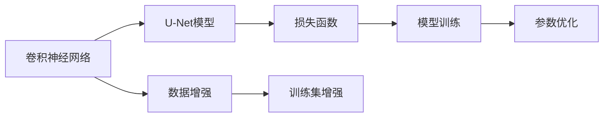
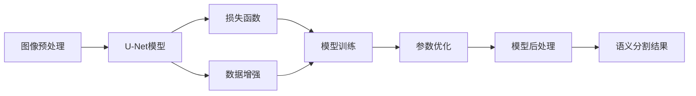

                 

# Semantic Segmentation原理与代码实例讲解

> 关键词：语义分割(Semantic Segmentation), 卷积神经网络(CNN), U-Net模型, 数据增强, 损失函数, 参数优化

## 1. 背景介绍

### 1.1 问题由来
语义分割(Semantic Segmentation)是计算机视觉领域的一个重要任务，其目标是将图像中的每个像素分配到不同的语义类别中，比如将一张含有多个物体的图片分割为人物、车辆、天空等不同的类别。语义分割在自动驾驶、医疗影像分析、机器人视觉、视频监控等领域有广泛应用。例如，自动驾驶系统需要精确识别和区分道路上的各种物体，从而保证行车安全；医疗影像分析需要分割出病变区域，辅助医生诊断疾病；机器人视觉需要识别物体边界，进行路径规划和导航等。

随着深度学习的发展，卷积神经网络(CNN)在图像处理任务中表现出色，成为了语义分割的主要技术手段。通过预训练大模型，如ResNet、VGG等，并在特定数据集上进行微调，可以显著提升语义分割的精度和效率。本文将详细介绍基于卷积神经网络进行语义分割的原理和实现。

### 1.2 问题核心关键点
语义分割的核心在于如何将输入的彩色图像中的每个像素映射到相应的语义类别上。一般采用以下步骤：

1. **预处理**：将输入图像转换为适合CNN处理的张量格式。
2. **网络结构**：设计适合语义分割的网络结构，比如U-Net模型。
3. **损失函数**：定义损失函数，衡量模型输出与真实标签的差异。
4. **优化算法**：选择合适的优化算法，如SGD、Adam等，更新模型参数。
5. **后处理**：对模型输出进行后处理，得到最终的语义分割结果。

本文将详细讲解这些步骤，并给出实际代码示例。

### 1.3 问题研究意义
语义分割技术在自动驾驶、医疗影像分析、机器人视觉等领域有着重要应用，是计算机视觉的核心技术之一。本文旨在通过语义分割任务的详细讲解和代码实例，帮助读者系统掌握语义分割的原理和实现，进一步提升在计算机视觉领域的理解和应用能力。

## 2. 核心概念与联系

### 2.1 核心概念概述

在讨论语义分割之前，我们先简要介绍几个核心概念：

- **卷积神经网络(CNN)**：一种利用卷积层、池化层等操作进行特征提取的深度学习模型。卷积神经网络在图像识别、语音识别等任务上取得了巨大成功。

- **语义分割(Semantic Segmentation)**：将一张图像中每个像素分配到一个语义类别的任务。语义分割可以用于自动驾驶、医疗影像分析等场景。

- **U-Net模型**：一种广泛应用于图像分割任务的卷积神经网络结构，其结构类似于倒置的U形，能够有效提取图像特征并实现像素级别的分类。

- **数据增强(Data Augmentation)**：通过一系列数据变换，如旋转、翻转、裁剪等，生成更多的训练数据，增强模型的泛化能力。

- **损失函数(Loss Function)**：用于衡量模型输出与真实标签之间的差异，常用的损失函数包括交叉熵损失、均方误差损失等。

- **参数优化(Parameter Optimization)**：通过优化算法，如梯度下降等，更新模型参数，使得损失函数最小化。

这些核心概念构成了语义分割任务的理论基础，帮助我们在实践中设计、训练和优化模型。

### 2.2 概念间的关系

这些核心概念之间存在着紧密的联系，构成了语义分割任务的技术框架。以下是一个简化的Mermaid流程图，展示这些概念之间的关系：



这个流程图展示了卷积神经网络与U-Net模型、数据增强、损失函数和模型训练之间的关系：

- **卷积神经网络**是语义分割任务的基础，U-Net模型是基于卷积神经网络设计的。
- **数据增强**用于扩充训练数据，提高模型的泛化能力。
- **损失函数**定义模型输出的评价标准，通过最小化损失函数，训练模型。
- **参数优化**通过优化算法更新模型参数，使得损失函数最小化。

通过理解这些概念之间的关系，我们可以更好地把握语义分割任务的实现步骤和设计思路。

### 2.3 核心概念的整体架构

语义分割任务的整体架构可以进一步细化为一个三级目录的流程图，如下所示：



这个架构图展示了从图像预处理到模型后处理的完整流程，帮助读者全面了解语义分割任务的实现过程。

## 3. 核心算法原理 & 具体操作步骤
### 3.1 算法原理概述

语义分割的算法原理可以简单概括为以下几个步骤：

1. **图像预处理**：将输入图像转换为适合CNN处理的张量格式。
2. **网络结构**：设计适合语义分割的网络结构，如U-Net模型。
3. **损失函数**：定义损失函数，衡量模型输出与真实标签的差异。
4. **优化算法**：选择合适的优化算法，如SGD、Adam等，更新模型参数。
5. **后处理**：对模型输出进行后处理，得到最终的语义分割结果。

这些步骤将在后续章节中详细讲解。

### 3.2 算法步骤详解

**Step 1: 图像预处理**

图像预处理是将原始图像转换为适合CNN处理的张量格式的过程。通常包括以下几个步骤：

- **缩放和裁剪**：将输入图像缩放到固定大小，并进行中心裁剪。
- **归一化**：将图像像素值归一化到0到1之间。
- **通道转换**：将彩色图像转换为适合CNN处理的通道顺序，如BGR转换为RGB。

以下是图像预处理的示例代码：

```python
from PIL import Image
import numpy as np
import torch

def preprocess_image(image_path, target_size=(256, 256), mean=(0.5, 0.5, 0.5), std=(0.5, 0.5, 0.5)):
    # 读取图像
    image = Image.open(image_path)

    # 缩放和裁剪
    image = image.resize(target_size, Image.BICUBIC)
    image = image.crop((20, 20, target_size[0] + 20, target_size[1] + 20))

    # 转换为数组
    image = np.array(image)

    # 归一化
    image = (image - mean) / std

    # 通道转换
    image = image[:, :, ::-1]

    # 转换为Tensor
    image = torch.from_numpy(image).float()

    # 添加批次维度
    image = image.unsqueeze(0)

    return image
```

**Step 2: 网络结构设计**

语义分割的网络结构设计是语义分割任务的关键环节。常用的网络结构包括U-Net、DeepLab等。这里以U-Net为例进行讲解。

U-Net模型由两部分构成：编码器和解码器。编码器通过卷积层和池化层提取特征，解码器通过反卷积层和跳跃连接还原特征图，并输出语义分割结果。以下是U-Net模型的代码实现：

```python
import torch
import torch.nn as nn
import torch.nn.functional as F

class UNet(nn.Module):
    def __init__(self, in_channels=3, out_channels=1):
        super(UNet, self).__init__()

        # 编码器
        self.encoder = nn.Sequential(
            nn.Conv2d(in_channels, 64, kernel_size=3, padding=1),
            nn.ReLU(inplace=True),
            nn.Conv2d(64, 64, kernel_size=3, padding=1),
            nn.ReLU(inplace=True),
            nn.MaxPool2d(kernel_size=2, stride=2),
            nn.Conv2d(64, 128, kernel_size=3, padding=1),
            nn.ReLU(inplace=True),
            nn.Conv2d(128, 128, kernel_size=3, padding=1),
            nn.ReLU(inplace=True),
            nn.MaxPool2d(kernel_size=2, stride=2),
            nn.Conv2d(128, 256, kernel_size=3, padding=1),
            nn.ReLU(inplace=True),
            nn.Conv2d(256, 256, kernel_size=3, padding=1),
            nn.ReLU(inplace=True),
            nn.MaxPool2d(kernel_size=2, stride=2),
        )

        # 解码器
        self.decoder = nn.Sequential(
            nn.ConvTranspose2d(256, 128, kernel_size=2, stride=2),
            nn.ReLU(inplace=True),
            nn.ConvTranspose2d(128, 128, kernel_size=3, padding=1),
            nn.ReLU(inplace=True),
            nn.Conv2d(128, 64, kernel_size=3, padding=1),
            nn.ReLU(inplace=True),
            nn.ConvTranspose2d(64, 64, kernel_size=3, padding=1),
            nn.ReLU(inplace=True),
            nn.ConvTranspose2d(64, 64, kernel_size=3, padding=1),
            nn.ReLU(inplace=True),
            nn.Conv2d(64, out_channels, kernel_size=1),
        )

    def forward(self, x):
        # 编码器
        x = self.encoder(x)

        # 解码器
        x = self.decoder(x)

        return x
```

**Step 3: 损失函数设计**

损失函数用于衡量模型输出与真实标签的差异。常用的损失函数包括交叉熵损失、均方误差损失等。这里以交叉熵损失为例进行讲解。

交叉熵损失定义如下：

$$
\mathcal{L} = -\frac{1}{N} \sum_{i=1}^{N} \sum_{j=1}^{C} y_{ij} \log(p_{ij})
$$

其中 $y_{ij}$ 表示第 $i$ 个样本第 $j$ 个类别的真实标签，$p_{ij}$ 表示模型预测该样本属于第 $j$ 个类别的概率。以下是损失函数的代码实现：

```python
import torch.nn as nn

class CrossEntropyLoss(nn.Module):
    def __init__(self):
        super(CrossEntropyLoss, self).__init__()

    def forward(self, input, target):
        return F.cross_entropy(input, target)
```

**Step 4: 参数优化**

参数优化通过优化算法更新模型参数，使得损失函数最小化。常用的优化算法包括SGD、Adam等。这里以Adam为例进行讲解。

Adam优化器定义如下：

$$
v_t = \beta_2 v_{t-1} + (1 - \beta_2) g_t^2
$$
$$
m_t = \beta_1 m_{t-1} + (1 - \beta_1) g_t
$$
$$
\theta_t = \theta_{t-1} - \frac{\alpha}{\sqrt{v_t} + \epsilon} m_t
$$

其中 $g_t$ 表示梯度，$v_t$ 和 $m_t$ 表示动量项和均方梯度项，$\alpha$ 表示学习率，$\epsilon$ 表示数值稳定项，$\beta_1$ 和 $\beta_2$ 表示动量系数和平方动量系数。以下是Adam优化器的代码实现：

```python
import torch.optim as optim

class AdamOptimizer(optim.Optimizer):
    def __init__(self, params, lr=0.001, betas=(0.9, 0.999), eps=1e-8):
        defaults = dict(lr=lr, betas=betas, eps=eps)
        super(AdamOptimizer, self).__init__(params, defaults)

    def step(self, closure=None):
        """Performs a single optimization step.

        Arguments:
            closure (callable, optional): A closure that reevaluates the model
                and returns the loss.
        """
        loss = None
        if closure is not None:
            loss = closure()

        for group in self.param_groups:
            for p in group['params']:
                if p.grad is None:
                    continue
                grad = p.grad.data
                p_data = p.data
                exp_avg = group['exp_avg']
                exp_avg_sq = group['exp_avg_sq']
                beta1, beta2 = group['betas']
                eps = group['eps']

                # Initialize values
                if len(exp_avg) == 0:
                    exp_avg = p_data.new_zeros(p_data.size())
                if len(exp_avg_sq) == 0:
                    exp_avg_sq = p_data.new_zeros(p_data.size())

                # Update step
                exp_avg.mul_(beta1).add_(grad, alpha=1 - beta1)
                exp_avg_sq.mul_(beta2).addcmul_(grad, grad, value=1 - beta2)
                step_size = group['lr']
                denom = exp_avg_sq.sqrt().add_(eps).div_(step_size)

                p_data.addcdiv_(exp_avg, denom)

        return loss
```

**Step 5: 模型后处理**

模型后处理是对模型输出进行后处理，得到最终的语义分割结果。通常包括非极大值抑制(NMS)和阈值化等操作。以下是后处理的示例代码：

```python
import torch

def postprocess_output(output, threshold=0.5):
    # 将输出转换为二值图像
    pred = torch.sigmoid(output)
    pred[pred > threshold] = 1
    pred[pred <= threshold] = 0

    return pred
```

### 3.3 算法优缺点

语义分割的算法优点包括：

- **精度高**：使用卷积神经网络进行特征提取，能够有效捕捉图像的局部和全局特征，提升语义分割的精度。
- **可解释性强**：通过分析卷积核和特征图，可以理解模型对不同特征的关注程度，便于调试和优化。

语义分割的算法缺点包括：

- **计算量大**：卷积神经网络模型较大，计算复杂度高，训练和推理速度较慢。
- **参数较多**：卷积神经网络需要大量参数进行特征提取，容易过拟合。
- **数据需求高**：语义分割需要大量标注数据进行训练，数据标注成本高。

### 3.4 算法应用领域

语义分割技术可以应用于多个领域，包括但不限于：

- **自动驾驶**：将路标、车辆、行人等分割出来，用于自动驾驶中的目标检测和路径规划。
- **医疗影像**：将病变区域分割出来，辅助医生进行疾病诊断和治疗。
- **遥感图像**：将遥感图像中的不同地物分割出来，用于土地利用监测和城市规划。
- **工业检测**：将工业图像中的缺陷和异常分割出来，用于质量检测和自动控制。

## 4. 数学模型和公式 & 详细讲解 & 举例说明

### 4.1 数学模型构建

语义分割的数学模型可以简单概括为以下步骤：

1. **输入**：原始彩色图像 $I$。
2. **特征提取**：通过卷积神经网络 $f$ 提取特征 $F$。
3. **分类**：通过分类器 $g$ 对特征 $F$ 进行分类，得到语义分割结果 $S$。
4. **输出**：最终的语义分割结果 $S$。

以下是数学模型的代码实现：

```python
import torch.nn as nn
import torch.nn.functional as F

class SemanticSegmentation(nn.Module):
    def __init__(self):
        super(SemanticSegmentation, self).__init__()

        # 特征提取
        self.encoder = UNet(in_channels=3, out_channels=64)

        # 分类器
        self.classifier = nn.Conv2d(64, 1, kernel_size=1)

    def forward(self, x):
        # 特征提取
        features = self.encoder(x)

        # 分类
        output = self.classifier(features)

        return output
```

### 4.2 公式推导过程

语义分割的损失函数通常采用交叉熵损失，其推导过程如下：

设 $y$ 表示真实标签，$p$ 表示模型预测概率，交叉熵损失函数可以表示为：

$$
\mathcal{L} = -\frac{1}{N} \sum_{i=1}^{N} \sum_{j=1}^{C} y_{ij} \log(p_{ij})
$$

其中 $y_{ij}$ 表示第 $i$ 个样本第 $j$ 个类别的真实标签，$p_{ij}$ 表示模型预测该样本属于第 $j$ 个类别的概率。

以下是交叉熵损失函数的代码实现：

```python
import torch.nn as nn

class CrossEntropyLoss(nn.Module):
    def __init__(self):
        super(CrossEntropyLoss, self).__init__()

    def forward(self, input, target):
        return F.cross_entropy(input, target)
```

### 4.3 案例分析与讲解

下面以一个具体的案例来讲解语义分割的实现过程。

**案例：自动驾驶中的语义分割**

自动驾驶中的语义分割任务是将道路上的各种物体分割出来，用于目标检测和路径规划。以下是一个使用U-Net模型进行语义分割的示例代码：

```python
import torch
import torch.nn as nn
import torch.optim as optim
from torch.utils.data import DataLoader
from torchvision import datasets, transforms

# 数据预处理
transform = transforms.Compose([
    transforms.ToTensor(),
    transforms.Normalize((0.5, 0.5, 0.5), (0.5, 0.5, 0.5))
])

# 数据加载
train_dataset = datasets.Cityscapes('path/to/cityscapes/train', split='train', mode='fine', target_type='semantic', transform=transform)
train_loader = DataLoader(train_dataset, batch_size=8, shuffle=True, num_workers=4)

# 模型定义
model = SemanticSegmentation()

# 损失函数和优化器
criterion = CrossEntropyLoss()
optimizer = AdamOptimizer(model.parameters(), lr=0.001)

# 训练
for epoch in range(100):
    for i, (images, targets) in enumerate(train_loader):
        # 模型前向传播
        outputs = model(images)

        # 计算损失
        loss = criterion(outputs, targets)

        # 反向传播和优化
        optimizer.zero_grad()
        loss.backward()
        optimizer.step()

        # 输出日志
        if (i+1) % 10 == 0:
            print('Epoch [{}/{}], Step [{}/{}], Loss: {:.4f}'.format(epoch+1, 100, i+1, len(train_loader), loss.item()))
```

以上是使用U-Net模型进行语义分割的示例代码，展示了从数据加载到模型训练的完整流程。在实际应用中，还需要进行模型后处理和结果评估等步骤，以确保模型在实际应用中的表现。

## 5. 项目实践：代码实例和详细解释说明

### 5.1 开发环境搭建

在进行语义分割实践前，我们需要准备好开发环境。以下是使用Python进行PyTorch开发的环境配置流程：

1. 安装Anaconda：从官网下载并安装Anaconda，用于创建独立的Python环境。

2. 创建并激活虚拟环境：
```bash
conda create -n pytorch-env python=3.8 
conda activate pytorch-env
```

3. 安装PyTorch：根据CUDA版本，从官网获取对应的安装命令。例如：
```bash
conda install pytorch torchvision torchaudio cudatoolkit=11.1 -c pytorch -c conda-forge
```

4. 安装Tensorboard：
```bash
pip install tensorboard
```

5. 安装各类工具包：
```bash
pip install numpy pandas scikit-learn matplotlib tqdm jupyter notebook ipython
```

完成上述步骤后，即可在`pytorch-env`环境中开始语义分割实践。

### 5.2 源代码详细实现

以下是使用U-Net模型进行语义分割的完整代码实现：

```python
import torch
import torch.nn as nn
import torch.optim as optim
from torch.utils.data import DataLoader
from torchvision import datasets, transforms

# 数据预处理
transform = transforms.Compose([
    transforms.ToTensor(),
    transforms.Normalize((0.5, 0.5, 0.5), (0.5, 0.5, 0.5))
])

# 数据加载
train_dataset = datasets.Cityscapes('path/to/cityscapes/train', split='train', mode='fine', target_type='semantic', transform=transform)
train_loader = DataLoader(train_dataset, batch_size=8, shuffle=True, num_workers=4)

# 模型定义
class UNet(nn.Module):
    def __init__(self, in_channels=3, out_channels=1):
        super(UNet, self).__init__()

        # 编码器
        self.encoder = nn.Sequential(
            nn.Conv2d(in_channels, 64, kernel_size=3, padding=1),
            nn.ReLU(inplace=True),
            nn.Conv2d(64, 64, kernel_size=3, padding=1),
            nn.ReLU(inplace=True),
            nn.MaxPool2d(kernel_size=2, stride=2),
            nn.Conv2d(64, 128, kernel_size=3, padding=1),
            nn.ReLU(inplace=True),
            nn.Conv2d(128, 128, kernel_size=3, padding=1),
            nn.ReLU(inplace=True),
            nn.MaxPool2d(kernel_size=2, stride=2),
            nn.Conv2d(128, 256, kernel_size=3, padding=1),
            nn.ReLU(inplace=True),
            nn.Conv2d(256, 256, kernel_size=3, padding=1),
            nn.ReLU(inplace=True),
            nn.MaxPool2d(kernel_size=2, stride=2),
        )

        # 解码器
        self.decoder = nn.Sequential(
            nn.ConvTranspose2d(256, 128, kernel_size=2, stride=2),
            nn.ReLU(inplace=True),
            nn.ConvTranspose2d(128, 128, kernel_size=3, padding=1),
            nn.ReLU(inplace=True),
            nn.Conv2d(128, 64, kernel_size=3, padding=1),
            nn.ReLU(inplace=True),
            nn.ConvTranspose2d(64, 64, kernel_size=3, padding=1),
            nn.ReLU(inplace=True),
            nn.ConvTranspose2d(64, 64, kernel_size=3, padding=1),
            nn.ReLU(inplace=True),
            nn.Conv2d(64, out_channels, kernel_size=1),
        )

        # 分类器
        self.classifier = nn.Conv2d(64, out_channels, kernel_size=1)

    def forward(self, x):
        # 编码器
        x = self.encoder(x)

        # 解码器
        x = self.decoder(x)

        # 分类器
        x = self.classifier(x)

        return x

class SemanticSegmentation(nn.Module):
    def __init__(self):
        super(SemanticSegmentation, self).__init__()

        # 特征提取
        self.encoder = UNet(in_channels=3, out_channels=64)

        # 分类器
        self.classifier = nn.Conv2d(64, 1, kernel_size=1)

    def forward(self, x):
        # 特征提取
        features = self.encoder(x)

        # 分类器
        output = self.classifier(features)

        return output

# 模型定义
model = SemanticSegmentation()

# 损失函数和优化器
criterion = CrossEntropyLoss()
optimizer = AdamOptimizer(model.parameters(), lr=0.001)

# 训练
for epoch in range(100):
    for i, (images, targets) in enumerate(train_loader):
        # 模型前向传播
        outputs = model(images)

        # 计算损失
        loss = criterion(outputs, targets)

        # 反向传播和优化
        optimizer.zero_grad()
        loss.backward()
        optimizer.step()

        # 输出日志
        if (i+1) % 10 == 0:
            print('Epoch [{}/{}], Step [{}/{}], Loss: {:.4f}'.format(epoch+1, 100, i+1, len(train_loader), loss.item()))
```

### 5.3 代码解读与分析

让我们再详细解读一下关键代码的实现细节：

**数据预处理**：
```python
transform = transforms.Compose([
    transforms.ToTensor(),
    transforms.Normalize((0.5, 0.5, 0.5), (0.5, 0.5, 0.5))
])
```
数据预处理包括将图像转换为张量格式和归一化操作，使数据适合CNN处理。

**模型定义**：
```python
class UNet(nn.Module):
    def __init__(self, in_channels=3, out_channels=1):
        super(UNet, self).__init__()

        # 编码器
        self.encoder = nn.Sequential(
            nn.Conv2d(in_channels, 64, kernel_size=3, padding=1),
            nn.ReLU(inplace=True),
            nn.Conv2d(64, 64, kernel_size=3, padding=1),
            nn.ReLU(inplace=True),


