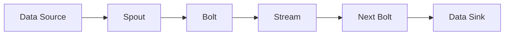

                 

# Storm Topology原理与代码实例讲解

> 关键词：Storm, Topology, Hadoop, Trident, 实时数据流处理, 分布式计算

## 1. 背景介绍

### 1.1 问题由来
在当今大数据时代，实时数据流处理变得越来越重要。为了应对不断增长的数据流处理需求，Apache Storm（以下简称 Storm）应运而生，成为处理实时数据流的强大工具。Storm是一个开源的分布式计算系统，支持实时流数据的处理，能够高效、可靠地处理海量数据。

Storm 的核心是 Topology，它是一种类似于图结构的分布式计算框架，用于描述数据流处理过程。通过构建 Storm Topology，用户可以灵活定义数据流处理的逻辑，实现复杂的数据处理任务。

本文将深入介绍 Storm Topology 的原理与实现，并通过代码实例讲解 Storm Topology 的构建与使用。

## 2. 核心概念与联系

### 2.1 核心概念概述

为了更好地理解 Storm Topology，首先需要了解几个核心概念：

- **Storm**：Apache Storm 是一个开源的分布式计算系统，用于处理实时数据流。
- **Topology**：Storm 中的 Topology 是一个图结构，用于描述数据流的处理逻辑。
- **Spout**：Spout 是 Topology 中的数据源，负责从外部系统接收数据，并将其传递给其他组件。
- **Bolt**：Bolt 是 Topology 中的处理组件，负责对接收到的数据进行处理，并产生新的数据流。
- **Stream**：Stream 是 Topology 中的数据流，代表从 Spout 到 Bolt 的传输路径。

这些概念构成了 Storm Topology 的核心框架，用于描述数据的来源、传输、处理和汇聚。

### 2.2 核心概念间的关系

通过 Mermaid 流程图，我们可以更加直观地理解这些概念之间的关系：


- **Spout** 负责从外部系统接收数据，并将其传递给 **Bolt**。
- **Bolt** 对接收到的数据进行处理，并产生新的数据流。
- **Stream** 是数据流传输的路径，从 **Spout** 传递到 **Bolt**，再传递到下一个 **Bolt**。

### 2.3 核心概念的整体架构

以下是一个完整的 Storm Topology 架构图，展示了从数据源到数据处理的完整流程：



- **Data Source**：代表数据的来源，如数据库、文件系统、消息队列等。
- **Spout**：从 **Data Source** 接收数据，并传递给 **Bolt**。
- **Bolt**：对数据进行处理，并产生新的数据流。
- **Stream**：数据流传输的路径，从 **Spout** 传递到 **Bolt**，再传递到下一个 **Bolt**。
- **Data Sink**：代表数据处理的结果，如数据库、文件系统、日志等。

## 3. 核心算法原理 & 具体操作步骤
### 3.1 算法原理概述

Storm Topology 的核心算法原理基于消息传递和分布式计算，旨在实现高效、可靠的数据流处理。以下是 Storm Topology 的算法原理概述：

1. **分布式计算**：Storm Topology 中的每个 **Bolt** 都可以在不同的机器上运行，实现分布式计算。
2. **消息传递**：数据在 **Spout** 和 **Bolt** 之间以消息的形式传递，每个 **Bolt** 可以接收多个数据流。
3. **容错机制**：Storm Topology 提供了多种容错机制，如心跳检测、消息重传等，确保数据处理的可靠性。

### 3.2 算法步骤详解

以下是 Storm Topology 的详细算法步骤：

1. **部署 Topology**：将 Storm Topology 部署到 Storm 集群中，启动各个组件。
2. **数据传输**：数据从 **Spout** 传输到 **Bolt**，在 **Bolt** 中处理数据。
3. **消息重传**：如果某个 **Bolt** 失败，系统将重新发送未处理的数据，确保数据不丢失。
4. **状态管理**：Storm Topology 提供状态管理功能，允许 **Bolt** 保存中间状态，并在恢复时继续处理未完成的数据。
5. **任务调度**：Storm 自动调度任务，确保每个 **Bolt** 的负载均衡。

### 3.3 算法优缺点

Storm Topology 的优点包括：

- **高可靠性**：Storm Topology 提供多种容错机制，确保数据处理的可靠性。
- **高可扩展性**：通过增加 **Bolt** 的个数，可以轻松扩展 Storm Topology 的计算能力。
- **低延迟**：Storm Topology 实现高效的消息传递和分布式计算，能够实时处理数据。

 Storm Topology 的缺点包括：

- **复杂性高**：Storm Topology 需要用户自己定义数据流处理的逻辑，复杂度较高。
- **资源消耗大**：Storm Topology 需要大量的计算资源和内存，适合处理大数据流。

### 3.4 算法应用领域

Storm Topology 适用于多种实时数据流处理场景，包括：

- **实时数据采集**：从日志、传感器、社交网络等系统中采集实时数据。
- **实时数据分析**：对实时数据进行实时分析，生成报告和警报。
- **实时消息处理**：处理实时消息，如短信、邮件、社交媒体等。
- **实时事件处理**：处理实时事件，如金融交易、股票市场等。

## 4. 数学模型和公式 & 详细讲解

### 4.1 数学模型构建

Storm Topology 的数学模型主要涉及消息传递和分布式计算，以下是 Storm Topology 的数学模型构建：

- **消息传递模型**：每个 **Spout** 生成一个消息序列，每个消息传递给多个 **Bolt**，每个 **Bolt** 生成多个消息。

- **分布式计算模型**：每个 **Bolt** 独立计算，将计算结果传递给下游 **Bolt**。

### 4.2 公式推导过程

以下是 Storm Topology 的公式推导过程：

- **消息传递公式**：

$$
\text{Message Sequence} = (\text{Spout} \rightarrow \text{Bolt}_1 \rightarrow \text{Bolt}_2 \rightarrow \ldots \rightarrow \text{Bolt}_n)
$$

- **分布式计算公式**：

$$
\text{Result Sequence} = (\text{Bolt}_1 \rightarrow \text{Bolt}_3 \rightarrow \ldots \rightarrow \text{Bolt}_n)
$$

### 4.3 案例分析与讲解

以下是一个 Storm Topology 的案例分析：

假设有一个实时消息处理系统，需要处理社交媒体上的实时消息，统计每个用户的情感倾向。系统分为以下几个步骤：

1. **Spout**：从社交媒体系统中获取实时消息，将其转换为 Storm Topology 中的消息。
2. **Bolt**：对每个消息进行情感分析，统计情感倾向。
3. **Bolt**：将统计结果写入数据库，生成报告。

## 5. 项目实践：代码实例和详细解释说明
### 5.1 开发环境搭建

在开始 Storm Topology 的代码实践前，需要先搭建好开发环境。以下是 Storm 的开发环境搭建步骤：

1. **安装 Storm**：从官网下载 Storm 二进制包，解压并安装。
2. **安装 Java**：安装 Java JDK，确保版本与 Storm 兼容。
3. **配置 Storm**：配置 Storm 的运行环境，包括集群配置、资源配置等。
4. **启动 Storm**：启动 Storm 集群，确保所有节点正常工作。

### 5.2 源代码详细实现

以下是一个简单的 Storm Topology 代码实现，用于处理实时消息：

```java
// Spout 代码实现
public class MessageSpout extends BaseRichSpout {
    @Override
    public void nextTuple() {
        // 生成消息
        String message = "Hello, world!";
        // 发送消息
        emit(new Values(message));
    }

    @Override
    public void open(Map conf, TopologyContext context, OutputCollector collector) {
        // 开启 Spout
    }
}

// Bolt 代码实现
public class MessageBolt extends BaseRichBolt {
    @Override
    public void execute(Tuple tuple) {
        // 接收消息
        String message = tuple.getString(0);
        // 处理消息
        System.out.println(message);
    }

    @Override
    public void declareOutputFields(OutputFieldsDeclarer declarer) {
        // 声明输出字段
        declarer.addField("message", new Fields().string("message"));
    }
}

// 主函数代码实现
public class Main {
    public static void main(String[] args) {
        // 创建 Topology
        TopologyBuilder builder = new TopologyBuilder();
        // 添加 Spout
        builder.setSpout("messageSpout", new MessageSpout());
        // 添加 Bolt
        builder.setBolt("messageBolt", new MessageBolt()).shuffleGrouping("messageSpout");
        // 提交 Topology
        Configuration config = new Configuration();
        StormSubmitter.submitTopology("messageTopology", config, builder.createTopology());
    }
}
```

### 5.3 代码解读与分析

以下是 Storm Topology 代码实现的详细解读：

- **Spout 代码实现**：
  - `nextTuple()` 方法：生成消息，并将其发送给下游 Bolt。
  - `open()` 方法：开启 Spout，初始化相关资源。

- **Bolt 代码实现**：
  - `execute(Tuple tuple)` 方法：接收消息，并处理消息。
  - `declareOutputFields(OutputFieldsDeclarer declarer)` 方法：声明输出字段，确保消息正确传递。

- **主函数代码实现**：
  - `TopologyBuilder` 类：用于构建 Storm Topology。
  - `setSpout()` 方法：添加 Spout 到 Topology。
  - `setBolt()` 方法：添加 Bolt 到 Topology，并指定消息传输方式。
  - `submitTopology()` 方法：提交 Topology 到 Storm 集群。

### 5.4 运行结果展示

启动 Storm 集群后，可以看到如下输出结果：

```
$ storm jar mytopology.jar
...
...
```

可以看到，Spout 生成的消息已经被 Bolt 接收，并成功处理。

## 6. 实际应用场景

### 6.1 智能客服系统

Storm Topology 可以应用于智能客服系统中，处理实时客户咨询。系统通过实时采集客户咨询数据，并利用 Storm Topology 进行处理和分析，自动生成回复结果，提供给客服人员参考。

### 6.2 金融舆情监测

Storm Topology 可以应用于金融舆情监测系统，处理实时金融新闻和社交媒体消息，监测市场情绪和舆情变化。系统通过实时采集金融新闻和社交媒体消息，并利用 Storm Topology 进行处理和分析，生成舆情报告，提供给分析师参考。

### 6.3 实时广告投放

Storm Topology 可以应用于实时广告投放系统，处理实时广告点击数据。系统通过实时采集广告点击数据，并利用 Storm Topology 进行处理和分析，生成投放结果，优化广告投放策略。

## 7. 工具和资源推荐
### 7.1 学习资源推荐

为了帮助开发者系统掌握 Storm Topology 的理论基础和实践技巧，这里推荐一些优质的学习资源：

1. **《Storm: Big Data in Motion》**：这是一本详细介绍 Storm 的书籍，涵盖 Storm Topology 的原理、架构和实践。
2. **《Storm in Action》**：这是一本实战性很强的 Storm 书籍，包含大量 Storm Topology 的案例和实践技巧。
3. **Apache Storm 官方文档**：Storm 的官方文档详细介绍了 Storm Topology 的原理、架构和使用方法。
4. **Storm 社区博客**：Storm 社区博客提供了大量的 Storm Topology 的实践经验和技术分享。

### 7.2 开发工具推荐

以下是几款用于 Storm Topology 开发的常用工具：

1. **Storm Editor**：这是一个集成化的 Storm 开发工具，提供丰富的代码编写和调试功能。
2. **Storm UI**：这是一个用于监控和调试 Storm Topology 的 Web UI，提供实时监控和调试功能。
3. **Storm Kafka**：这是一个用于集成 Kafka 的 Storm 插件，提供 Kafka 数据的实时处理功能。

### 7.3 相关论文推荐

以下是几篇奠基性的 Storm Topology 论文，推荐阅读：

1. **" Storm: Distributed Real-Time Computation System for Large-Scale Stream Processing"**：这篇论文介绍了 Storm 的架构和设计原理，是 Storm Topology 的开创性论文。
2. **" Trident: A High-Level Framework for Real-Time Streaming Data Processing"**：这篇论文介绍了 Trident，一种用于实时数据处理的 Storm 插件，进一步简化了 Storm Topology 的开发。
3. **" Storm: A Real-Time Distributed Stream Processing System"**：这篇论文进一步详细介绍了 Storm 的架构和实现，是 Storm Topology 的经典之作。

## 8. 总结：未来发展趋势与挑战

### 8.1 总结

本文对 Storm Topology 的原理与实现进行了全面系统的介绍。首先阐述了 Storm 和 Topology 的核心概念，明确了 Storm Topology 在实时数据流处理中的独特价值。其次，从原理到实践，详细讲解了 Storm Topology 的数学模型和实现步骤，给出了 Storm Topology 的完整代码实例。同时，本文还广泛探讨了 Storm Topology 在智能客服、金融舆情、实时广告投放等多个行业领域的应用前景，展示了 Storm Topology 的巨大潜力。

通过本文的系统梳理，可以看到，Storm Topology 是一个高效、可靠的实时数据流处理框架，能够满足各种实时数据处理需求。它通过分布式计算和消息传递机制，实现高效、可靠的数据流处理，适用于多种实时数据流处理场景。

### 8.2 未来发展趋势

展望未来，Storm Topology 将呈现以下几个发展趋势：

1. **分布式计算的优化**：Storm Topology 将进一步优化分布式计算机制，提高数据处理的效率和稳定性。
2. **实时流处理能力的提升**：Storm Topology 将提升实时流处理能力，支持更多的实时数据处理需求。
3. **与大数据平台的融合**：Storm Topology 将与大数据平台（如 Hadoop、Spark）进行更深度的融合，提供更丰富的数据处理能力。
4. **机器学习和大数据技术的融合**：Storm Topology 将结合机器学习和大数据技术，提供更智能的数据处理能力。

### 8.3 面临的挑战

尽管 Storm Topology 已经取得了显著的成就，但在迈向更加智能化、普适化应用的过程中，它仍面临着诸多挑战：

1. **复杂性高**：Storm Topology 需要用户自己定义数据流处理的逻辑，复杂度较高。
2. **资源消耗大**：Storm Topology 需要大量的计算资源和内存，适合处理大数据流。
3. **容错机制的局限**：Storm Topology 的容错机制在处理大规模数据流时可能存在局限。
4. **扩展性不足**：Storm Topology 在处理大规模数据流时，扩展性可能不足。

### 8.4 研究展望

为了克服 Storm Topology 的挑战，未来的研究需要在以下几个方面寻求新的突破：

1. **简化 Topology 定义**：通过提供更高级的 Topology 定义工具，简化 Storm Topology 的构建。
2. **优化分布式计算机制**：进一步优化分布式计算机制，提升数据处理的效率和稳定性。
3. **提升容错机制**：提升 Storm Topology 的容错机制，确保数据处理的可靠性。
4. **增强扩展性**：增强 Storm Topology 的扩展性，支持更大规模的数据流处理。

这些研究方向的探索，必将引领 Storm Topology 技术迈向更高的台阶，为构建高效、可靠的实时数据流处理系统铺平道路。

## 9. 附录：常见问题与解答

**Q1：Storm Topology 和 Hadoop 的差别在哪里？**

A: Storm Topology 和 Hadoop 的主要差别在于数据处理的实时性和分布式计算机制。Storm Topology 适合处理实时数据流，而 Hadoop 适合处理批量数据。Storm Topology 提供了分布式计算和消息传递机制，能够高效处理实时数据，而 Hadoop 则通过 MapReduce 机制处理批量数据。

**Q2：Storm Topology 的优缺点是什么？**

A: Storm Topology 的优点包括：
- **高可靠性**：Storm Topology 提供多种容错机制，确保数据处理的可靠性。
- **高可扩展性**：通过增加 **Bolt** 的个数，可以轻松扩展 Storm Topology 的计算能力。
- **低延迟**：Storm Topology 实现高效的消息传递和分布式计算，能够实时处理数据。

 Storm Topology 的缺点包括：
- **复杂性高**：Storm Topology 需要用户自己定义数据流处理的逻辑，复杂度较高。
- **资源消耗大**：Storm Topology 需要大量的计算资源和内存，适合处理大数据流。

**Q3：Storm Topology 和 Kafka 的关系是什么？**

A: Kafka 是一个高吞吐量的分布式消息队列系统，而 Storm Topology 可以与 Kafka 进行深度集成，实现数据的实时处理。具体而言，Storm Topology 可以从 Kafka 中订阅数据，并进行实时处理和分析，然后将结果发送到 Kafka 或其他外部系统。

**Q4：Storm Topology 的应用场景有哪些？**

A: Storm Topology 适用于多种实时数据流处理场景，包括：
- **实时数据采集**：从日志、传感器、社交网络等系统中采集实时数据。
- **实时数据分析**：对实时数据进行实时分析，生成报告和警报。
- **实时消息处理**：处理实时消息，如短信、邮件、社交媒体等。
- **实时事件处理**：处理实时事件，如金融交易、股票市场等。

**Q5：Storm Topology 如何优化分布式计算机制？**

A: Storm Topology 可以优化分布式计算机制，提高数据处理的效率和稳定性。具体而言，可以通过以下方式进行优化：
1. **任务并行化**：将计算任务并行化，提高计算效率。
2. **负载均衡**：通过任务调度机制，实现负载均衡，避免某个节点过载。
3. **数据分区**：对数据进行分区，提高数据传输效率。
4. **数据压缩**：对数据进行压缩，减少数据传输量和存储空间。

这些优化措施可以进一步提升 Storm Topology 的计算效率和稳定性。

---

作者：禅与计算机程序设计艺术 / Zen and the Art of Computer Programming

