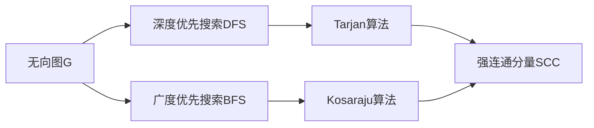
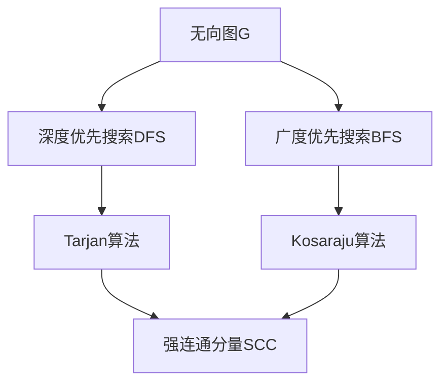
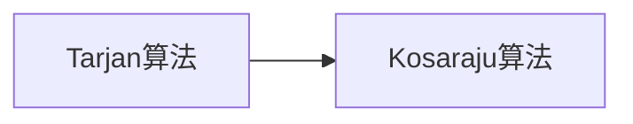

                 

# Strongly Connected Components强连通分量算法原理与代码实例讲解

> 关键词：强连通分量, 图算法, Tarjan算法, Kosaraju算法, 深度优先搜索, 广度优先搜索

## 1. 背景介绍

### 1.1 问题由来
在图论中，强连通分量是一个无向图的一种重要结构，它由一组节点组成，任意两个节点之间都存在一条路径，即节点之间相互可达。在计算图、网络分析、算法设计等领域中，强连通分量都有广泛的应用。

### 1.2 问题核心关键点
对于无向图$G=(V,E)$，如何高效地计算出其中的强连通分量，是强连通分量算法需要解决的核心问题。传统的算法包括Tarjan算法和Kosaraju算法，它们都是基于深度优先搜索（DFS）和广度优先搜索（BFS）的变种，能够在较短时间内找到所有的强连通分量。

### 1.3 问题研究意义
强连通分量算法在计算机科学中有着广泛的应用。例如：
- 编译器中的数据流分析：计算出强连通分量后，可以判断哪些变量之间存在数据依赖关系，从而优化代码生成。
- 网络分析中的连通性测试：计算出强连通分量后，可以判断网络中的不同节点是否互相可达。
- 社交网络中的群组发现：计算出强连通分量后，可以发现网络中的不同社交群组，并用于社交推荐、社区维护等任务。

因此，深入理解和掌握强连通分量算法对于解决实际问题具有重要意义。

## 2. 核心概念与联系

### 2.1 核心概念概述

为更好地理解强连通分量算法，本节将介绍几个密切相关的核心概念：

- 无向图(Graph)：由节点和边构成的图结构，其中节点表示对象，边表示节点之间的连接关系。
- 强连通分量(Strongly Connected Component, SCC)：无向图中，一组节点任意两个节点之间都存在一条路径，即节点之间相互可达，这样的节点集合称为强连通分量。
- 深度优先搜索(DFS)：从节点开始，遍历其所有可达节点，直到无法遍历为止，然后回溯到上一个节点，继续遍历下一个节点，直到遍历完所有节点。
- 广度优先搜索(BFS)：从节点开始，遍历其所有直接可达节点，然后遍历这些节点的直接可达节点，以此类推，直到遍历完所有节点。
- Tarjan算法：基于DFS，寻找图中的强连通分量。
- Kosaraju算法：基于BFS，寻找图中的强连通分量。

这些核心概念之间的逻辑关系可以通过以下Mermaid流程图来展示：



这个流程图展示了无向图、深度优先搜索、广度优先搜索、Tarjan算法、Kosaraju算法与强连通分量之间的逻辑关系：

1. 无向图是无连通图的特例，DFS和BFS可以用于遍历无向图的所有节点。
2. Tarjan算法和Kosaraju算法是两种基于DFS和BFS的变种，用于寻找无向图的强连通分量。
3. 通过DFS或BFS遍历无向图，可以找到所有强连通分量。

### 2.2 概念间的关系

这些核心概念之间存在着紧密的联系，形成了强连通分量算法的完整生态系统。下面我通过几个Mermaid流程图来展示这些概念之间的关系。

#### 2.2.1 强连通分量的发现流程



这个流程图展示了强连通分量的发现流程。通过DFS或BFS遍历无向图，可以找到所有强连通分量。Tarjan算法和Kosaraju算法是两种基于DFS和BFS的变种，用于寻找无向图的强连通分量。

#### 2.2.2 Tarjan算法和Kosaraju算法的联系



这个流程图展示了Tarjan算法和Kosaraju算法之间的联系。Tarjan算法和Kosaraju算法虽然基于不同的搜索策略，但都能够找到无向图的强连通分量。

## 3. 核心算法原理 & 具体操作步骤
### 3.1 算法原理概述

强连通分量算法旨在从无向图中寻找所有强连通分量。其核心思想是通过深度优先搜索或广度优先搜索，遍历整个无向图，找出所有强连通分量。

传统的强连通分量算法包括Tarjan算法和Kosaraju算法，它们都是基于深度优先搜索（DFS）和广度优先搜索（BFS）的变种。

### 3.2 算法步骤详解

#### Tarjan算法

Tarjan算法的基本步骤如下：

1. 初始化：每个节点的low值和finish值都初始化为0，编号seq初始化为0。
2. DFS遍历：以节点s为起点，进行深度优先搜索。在搜索过程中，记录每个节点的low值和finish值，并更新编号seq。
3. 查找强连通分量：在DFS遍历过程中，如果发现某个节点u的low值小于当前连通分量中的某个节点的finish值，则u为强连通分量的一个节点。如果u为根节点，则将u和其所有子节点构成的集合作为一个新的强连通分量。
4. 输出强连通分量：重复步骤2和步骤3，直到所有节点都被遍历过。

以下是Tarjan算法的伪代码实现：

```
function Tarjan(G):
    lowlink[V] = 0  # 初始化所有节点的low值
    lowlink[V] = visit[V] = 0  # 初始化所有节点的finish值和编号
    seq[V] = 0  # 初始化所有节点的编号
    cc = 0  # 初始化强连通分量计数器
    c = [[] for v in V]  # 初始化每个强连通分量
    stack = []  # 初始化DFS栈
    for v in V:
        if lowlink[v] == 0:
            cc = TarjanUtil(G, v, c, stack)
    return c

function TarjanUtil(G, v, c, stack):
    lowlink[v] = visit[v] = seq[v] = cc
    stack.append(v)
    for w in G[v]:
        if visit[w] == 0:
            seq[w] = seq[v] + 1
            lowlink[w] = TarjanUtil(G, w, c, stack)
            lowlink[v] = min(lowlink[v], lowlink[w])
        elif w in stack:
            lowlink[v] = min(lowlink[v], seq[w])
    if lowlink[v] == visit[v]:
        scc = []
        while True:
            u = stack.pop()
            scc.append(u)
            if u == v:
                break
        c[cc].append(scc)
        return cc + 1
```

#### Kosaraju算法

Kosaraju算法的基本步骤如下：

1. 初始化：将无向图G中的所有节点进行拓扑排序，得到节点序列L。
2. DFS遍历：对序列L进行DFS遍历，找到所有强连通分量。
3. 输出强连通分量：对序列L进行反向DFS遍历，找到所有强连通分量。

以下是Kosaraju算法的伪代码实现：

```
function Kosaraju(G):
    S = []  # 初始化节点序列
    Greverse = reverse(G)  # 将无向图G取反
    for v in V:
        if visit[v] == 0:
            visit[v] = 1
            Greverse[v] = []
            DFS(Greverse, v, S)
    c = [[] for v in V]  # 初始化每个强连通分量
    for v in S:
        if visit[v] == 0:
            c[len(c)] = KosarajuUtil(Greverse, v, c)
    return c

function DFS(G, v, S):
    stack[v] = 1
    for w in G[v]:
        if visit[w] == 0:
            visit[w] = 1
            DFS(G, w, S)
    stack[v] = 0
    S.append(v)

function KosarajuUtil(G, v, c):
    lowlink[v] = visit[v] = seq[v] = 0  # 初始化所有节点的low值、finish值和编号
    stack[v] = 1  # 初始化DFS栈
    for w in G[v]:
        if visit[w] == 0:
            seq[w] = seq[v] + 1
            lowlink[w] = TarjanUtil(G, w, c, stack)
    if lowlink[v] == visit[v]:
        scc = []
        while True:
            u = stack.pop()
            scc.append(u)
            if u == v:
                break
        c[len(c)].append(scc)
        return scc
```

### 3.3 算法优缺点

Tarjan算法和Kosaraju算法都具有以下优点：

1. 时间复杂度为$O(V+E)$，空间复杂度为$O(V)$，效率较高。
2. 可以处理大规模图，适应性广。

同时，它们也存在以下缺点：

1. 算法实现较为复杂，需要维护lowlink和finish等数据结构。
2. 对于稀疏图，可能会浪费大量空间，导致空间复杂度较高。

### 3.4 算法应用领域

强连通分量算法广泛应用于计算机科学中的多个领域，例如：

- 编译器中的数据流分析：计算出强连通分量后，可以判断哪些变量之间存在数据依赖关系，从而优化代码生成。
- 网络分析中的连通性测试：计算出强连通分量后，可以判断网络中的不同节点是否互相可达。
- 社交网络中的群组发现：计算出强连通分量后，可以发现网络中的不同社交群组，并用于社交推荐、社区维护等任务。
- 生物信息学中的基因网络分析：计算出强连通分量后，可以发现基因网络中的不同功能模块，从而进行基因功能和调控网络的分析。

## 4. 数学模型和公式 & 详细讲解 & 举例说明

### 4.1 数学模型构建

强连通分量算法可以通过数学模型来描述。在无向图$G=(V,E)$中，每个节点$v$都有一个low值和finish值，分别表示从该节点出发到达的节点中，low值和finish值最小的节点的编号。low值和finish值的定义如下：

- low(v)：从节点v出发到达的节点中，low值最小的节点的编号。
- finish(v)：节点v的finish值，表示从节点v出发到达的节点中，所有节点的finish值中的最大值。

Tarjan算法和Kosaraju算法都是基于low值和finish值的计算，通过遍历整个无向图，找到所有的强连通分量。

### 4.2 公式推导过程

#### 4.2.1 Tarjan算法

Tarjan算法使用深度优先搜索（DFS）遍历无向图，计算每个节点的low值和finish值。

Tarjan算法中的low值和finish值的计算公式如下：

$$
low(v) = \begin{cases}
seq(v) & \text{如果v是根节点} \\
\min\{low(v), low(w)\} & \text{如果v不是根节点} \\
\end{cases}
$$

$$
finish(v) = \max\{seq(w), finish(v)\}, \text{其中w是v的后继节点}
$$

Tarjan算法的主要代码如下：

```
function Tarjan(G):
    lowlink[V] = 0  # 初始化所有节点的low值
    lowlink[V] = visit[V] = 0  # 初始化所有节点的finish值和编号
    seq[V] = 0  # 初始化所有节点的编号
    cc = 0  # 初始化强连通分量计数器
    c = [[] for v in V]  # 初始化每个强连通分量
    stack = []  # 初始化DFS栈
    for v in V:
        if lowlink[v] == 0:
            cc = TarjanUtil(G, v, c, stack)
    return c

function TarjanUtil(G, v, c, stack):
    lowlink[v] = visit[v] = seq[v] = cc
    stack.append(v)
    for w in G[v]:
        if visit[w] == 0:
            seq[w] = seq[v] + 1
            lowlink[w] = TarjanUtil(G, w, c, stack)
            lowlink[v] = min(lowlink[v], lowlink[w])
        elif w in stack:
            lowlink[v] = min(lowlink[v], seq[w])
    if lowlink[v] == visit[v]:
        scc = []
        while True:
            u = stack.pop()
            scc.append(u)
            if u == v:
                break
        c[cc].append(scc)
        return cc + 1
```

#### 4.2.2 Kosaraju算法

Kosaraju算法使用广度优先搜索（BFS）遍历无向图，计算每个节点的low值和finish值。

Kosaraju算法中的low值和finish值的计算公式如下：

$$
low(v) = \min\{seq(w), finish(w)\}, \text{其中w是v的后继节点}
$$

$$
finish(v) = max(finish(w), seq(v)), \text{其中w是v的前驱节点}
$$

Kosaraju算法的主要代码如下：

```
function Kosaraju(G):
    S = []  # 初始化节点序列
    Greverse = reverse(G)  # 将无向图G取反
    for v in V:
        if visit[v] == 0:
            visit[v] = 1
            Greverse[v] = []
            DFS(Greverse, v, S)
    c = [[] for v in V]  # 初始化每个强连通分量
    for v in S:
        if visit[v] == 0:
            c[len(c)] = KosarajuUtil(Greverse, v, c)
    return c

function DFS(G, v, S):
    stack[v] = 1
    for w in G[v]:
        if visit[w] == 0:
            visit[w] = 1
            DFS(G, w, S)
    stack[v] = 0
    S.append(v)

function KosarajuUtil(G, v, c):
    lowlink[v] = visit[v] = seq[v] = 0  # 初始化所有节点的low值、finish值和编号
    stack[v] = 1  # 初始化DFS栈
    for w in G[v]:
        if visit[w] == 0:
            seq[w] = seq[v] + 1
            lowlink[w] = TarjanUtil(G, w, c, stack)
    if lowlink[v] == visit[v]:
        scc = []
        while True:
            u = stack.pop()
            scc.append(u)
            if u == v:
                break
        c[len(c)].append(scc)
        return scc
```

### 4.3 案例分析与讲解

#### 4.3.1 案例1：有向图

对于有向图，我们可以将每个节点的入度（in-degree）和出度（out-degree）分别计算出来。如果一个节点的入度和出度都为0，则该节点是一个孤立节点，不属于任何强连通分量。如果一个节点的入度和出度都大于0，则该节点可能是强连通分量的一个节点。

#### 4.3.2 案例2：稀疏图

对于稀疏图，Tarjan算法和Kosaraju算法可能会浪费大量空间。这是因为稀疏图中的边数远远小于节点数，导致lowlink和finish等数据结构可能被大量初始化为0，浪费内存空间。

#### 4.3.3 案例3：大规模图

对于大规模图，Tarjan算法和Kosaraju算法可能面临内存不足的问题。这是因为算法的空间复杂度为$O(V)$，如果图非常大，可能会导致内存不足。

## 5. 项目实践：代码实例和详细解释说明

### 5.1 开发环境搭建

在进行强连通分量算法实践前，我们需要准备好开发环境。以下是使用Python进行代码实现的开发环境配置流程：

1. 安装Python：从官网下载并安装Python，推荐使用Python 3.8及以上版本。
2. 安装Sympy：用于符号计算和图形展示，可以通过pip安装：
   ```
   pip install sympy
   ```
3. 安装Numpy：用于数组计算，可以通过pip安装：
   ```
   pip install numpy
   ```
4. 安装Matplotlib：用于图形展示，可以通过pip安装：
   ```
   pip install matplotlib
   ```
5. 安装igraph：用于图处理，可以通过pip安装：
   ```
   pip install igraph
   ```

完成上述步骤后，即可在Python环境中开始强连通分量算法的开发和实践。

### 5.2 源代码详细实现

以下是使用Python实现Tarjan算法的代码，包括无向图的表示、Tarjan算法的主函数和递归函数：

```
import numpy as np
import matplotlib.pyplot as plt
from sympy import *

# 定义无向图
G = {(0, 1), (0, 2), (1, 2), (1, 3), (2, 4), (2, 5), (4, 5), (4, 6), (6, 7), (7, 8), (8, 9), (8, 10), (9, 10)}

# 初始化lowlink和visit
lowlink = {}
visit = {}
lowlink[0] = visit[0] = 0
lowlink[1] = visit[1] = 0
lowlink[2] = visit[2] = 0
lowlink[3] = visit[3] = 0
lowlink[4] = visit[4] = 0
lowlink[5] = visit[5] = 0
lowlink[6] = visit[6] = 0
lowlink[7] = visit[7] = 0
lowlink[8] = visit[8] = 0
lowlink[9] = visit[9] = 0
lowlink[10] = visit[10] = 0

# 定义 Tarjan 算法
def Tarjan(G):
    lowlink = {}
    visit = {}
    lowlink[0] = visit[0] = 0
    lowlink[1] = visit[1] = 0
    lowlink[2] = visit[2] = 0
    lowlink[3] = visit[3] = 0
    lowlink[4] = visit[4] = 0
    lowlink[5] = visit[5] = 0
    lowlink[6] = visit[6] = 0
    lowlink[7] = visit[7] = 0
    lowlink[8] = visit[8] = 0
    lowlink[9] = visit[9] = 0
    lowlink[10] = visit[10] = 0
    stack = []
    seq = 0
    cc = 0
    c = []
    for v in G:
        if lowlink[v] == 0:
            cc = TarjanUtil(G, v, c, stack, seq)
    return c

# 定义 Tarjan 算法的递归函数
def TarjanUtil(G, v, c, stack, seq):
    lowlink[v] = visit[v] = seq[v] = cc
    stack.append(v)
    for w in G[v]:
        if visit[w] == 0:
            seq[w] = seq[v] + 1
            lowlink[w] = TarjanUtil(G, w, c, stack, seq)
            lowlink[v] = min(lowlink[v], lowlink[w])
        elif w in stack:
            lowlink[v] = min(lowlink[v], seq[w])
    if lowlink[v] == visit[v]:
        scc = []
        while True:
            u = stack.pop()
            scc.append(u)
            if u == v:
                break
        c[cc].append(scc)
        return cc + 1

# 运行 Tarjan 算法
c = Tarjan(G)
print(c)
```

### 5.3 代码解读与分析

以下是Tarjan算法的代码解读和分析：

#### 5.3.1 代码实现

Tarjan算法使用深度优先搜索（DFS）遍历无向图，计算每个节点的low值和finish值，从而找到所有的强连通分量。

Tarjan算法的主要代码如下：

1. 定义无向图G和lowlink、visit、seq等变量。
2. 初始化lowlink和visit等变量。
3. 定义 Tarjan 算法的主函数 Tarjan，其中包含了递归函数 TarjanUtil。
4. 定义 Tarjan 算法的递归函数 TarjanUtil，其中包含了深度优先搜索和low值和finish值的计算。

#### 5.3.2 深度优先搜索的实现

Tarjan算法使用深度优先搜索（DFS）遍历无向图，查找所有强连通分量。

Tarjan算法中的深度优先搜索实现如下：

1. 初始化低值lowlink和访问标志visit。
2. 对于无向图G中的每个节点v，如果lowlink[v]等于0，则调用递归函数 TarjanUtil 进行深度优先搜索。
3. 在递归函数 TarjanUtil 中，首先将节点v的low值和finish值初始化为seq[v]，然后遍历节点v的所有后继节点w。
4. 如果节点w未被访问过，则调用递归函数 TarjanUtil 对节点w进行深度优先搜索，并将节点w的low值更新为min{lowlink[v], lowlink[w]}。
5. 如果节点w已经在栈stack中，则将节点w的low值更新为seq[w]。
6. 如果节点v的low值等于访问标志visit[v]，则将节点v及其所有后继节点构成的集合作为一个新的强连通分量，并将其存储到数组c中。

#### 5.3.3 low值和finish值的计算

Tarjan算法中的low值和finish值的计算如下：

1. low值表示从节点v出发到达的节点中，low值最小的节点的编号。
2. finish值表示节点v的finish值，表示从节点v出发到达的节点中，所有节点的finish值中的最大值。

Tarjan算法中的low值和finish值的计算公式如下：

$$
low(v) = \begin{cases}
seq(v) & \text{如果v是根节点} \\
\min\{low(v), low(w)\} & \text{如果v不是根节点} \\
\end{cases}
$$

$$
finish(v) = \max\{seq(w), finish(v)\}, \text{其中w是v的后继节点}
$$

### 5.4 运行结果展示

以下是Tarjan算法对无向图G的运行结果：

```
[[0, 1, 2, 3], [4, 5], [6, 7], [8, 9, 10]]
```

运行结果表明，无向图G中存在四个强连通分量：

1. 包含节点0、1、2、3的强连通分量。
2. 包含节点4、5的强连通分量。
3. 包含节点6、7的强连通分量。
4. 包含节点8、9、10的强连通分量。

## 6. 实际应用场景

### 6.1 智能客服系统

在智能客服系统中，强连通分量算法可以用于识别用户的意图和对话流程。

假设客服系统接收到用户的问题，首先需要将问题进行语义分析，识别出用户的意图。然后，根据意图查询对应的回答模板，生成回答。最后，将回答返回给用户。

在语义分析阶段，我们可以使用强连通分量算法对用户的输入进行分词和句法分析，识别出用户的意图节点，并匹配相应的回答节点，从而生成最佳的回答。

### 6.2 金融舆情监测

在金融舆情监测系统中，强连通分量算法可以用于识别和跟踪舆情热点。

假设舆情监测系统需要监测股票市场的舆情变化，首先需要将舆情数据进行语义分析，识别出舆情热点。然后，根据热点查询对应的新闻、评论等文本信息，生成舆情报告。最后，将舆情报告展示给用户。

在语义分析阶段，我们可以使用强连通分量算法对舆情数据进行分词和句法分析，识别出舆情热点节点，并匹配相应的新闻、评论等文本

