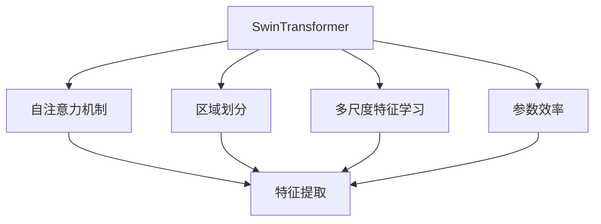
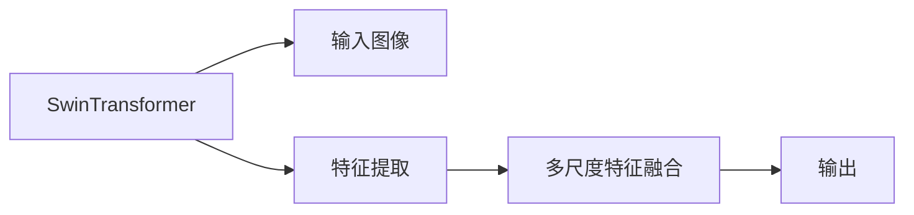
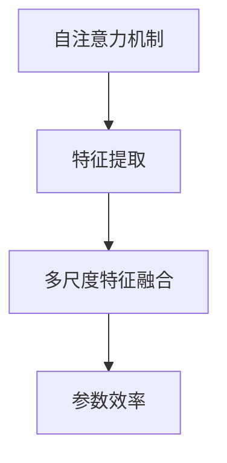
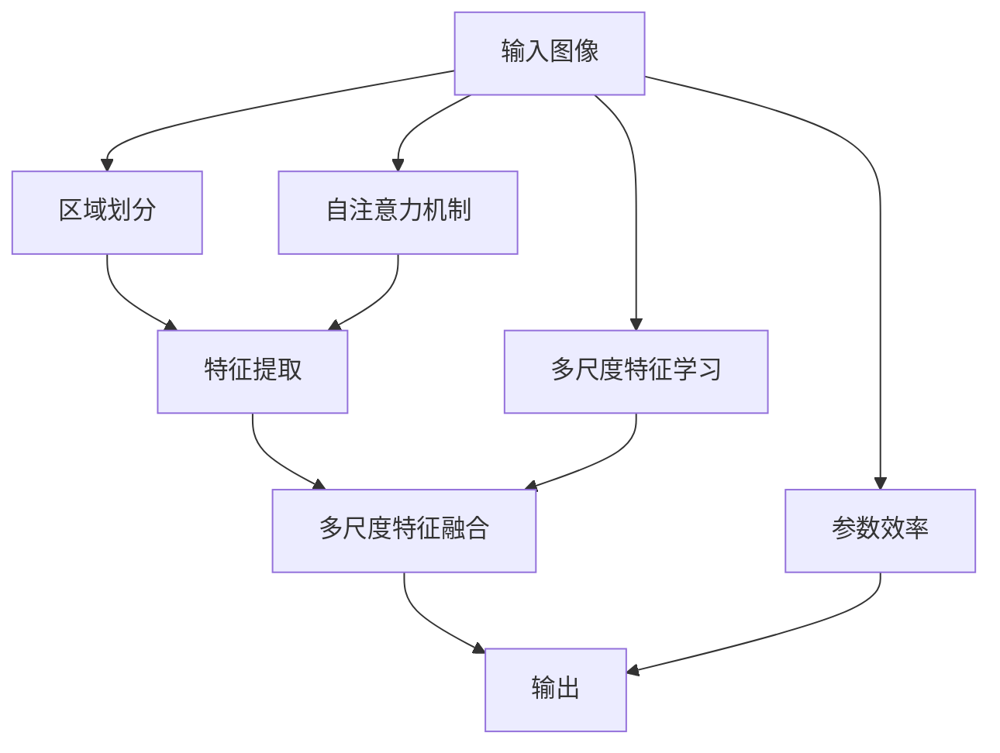

                 

# SwinTransformer原理与代码实例讲解

> 关键词：SwinTransformer, 自注意力机制, 区域划分, 参数效率, 多尺度特征学习

## 1. 背景介绍

### 1.1 问题由来
随着深度学习技术在计算机视觉领域的不断进步，传统的卷积神经网络(CNN)已经逐渐被自注意力机制的自注意力网络(如ResNet、Transformer)所取代。然而，自注意力网络在处理大规模高分辨率图像时，存在计算复杂度高、参数量大等问题。为了解决这些问题，SwinTransformer应运而生。

### 1.2 问题核心关键点
SwinTransformer是一种基于自注意力机制的神经网络，旨在提高大规模高分辨率图像的特征学习效率，同时保持较高的模型参数效率。其核心思想是通过区域划分，将图像分成多个小块，对每个小块进行独立处理，从而降低计算复杂度，提高模型性能。

### 1.3 问题研究意义
SwinTransformer不仅解决了传统自注意力网络在大规模高分辨率图像上的计算和参数问题，还为大规模视觉任务提供了更为高效的解决方案。它在图像分类、目标检测、实例分割等任务上取得了优异的结果，具有广阔的应用前景。

## 2. 核心概念与联系

### 2.1 核心概念概述

为更好地理解SwinTransformer的工作原理，本节将介绍几个密切相关的核心概念：

- SwinTransformer: 一种基于自注意力机制的神经网络，特别适用于大规模高分辨率图像处理。
- 自注意力机制(Self-Attention Mechanism): 一种通过计算输入和输入之间的相似性，自动学习输入特征之间的关系的网络机制。
- 区域划分(Patch Partitioning): 将图像分成多个小块(称为Patch)，对每个小块进行独立处理。
- 多尺度特征学习(Multi-Scale Feature Learning): 在多个尺度上同时处理图像，捕捉不同层次的特征。
- 参数效率(Parameter Efficiency): 通过区域划分和多尺度特征学习，SwinTransformer在保持高精度的同时，减少了模型参数数量。

这些核心概念之间的逻辑关系可以通过以下Mermaid流程图来展示：



这个流程图展示了大语言模型微调过程中各个核心概念的关系和作用：

1. SwinTransformer以自注意力机制为基础，提取图像特征。
2. 通过区域划分，将图像分成多个小块，对每个小块进行独立处理。
3. 在多个尺度上同时处理图像，捕捉不同层次的特征。
4. 保持高参数效率，降低模型计算复杂度。

这些概念共同构成了SwinTransformer的学习框架，使其在大规模高分辨率图像上能够高效学习特征，同时保持较小的模型参数量。

### 2.2 概念间的关系

这些核心概念之间存在着紧密的联系，形成了SwinTransformer的学习框架。下面我们通过几个Mermaid流程图来展示这些概念之间的关系。

#### 2.2.1 SwinTransformer的架构


这个流程图展示了SwinTransformer的总体架构。输入图像通过特征提取器提取特征，然后在不同尺度上融合特征，最后输出结果。

#### 2.2.2 区域划分与多尺度特征学习的关系


这个流程图展示了区域划分与多尺度特征学习的关系。输入图像通过区域划分分成多个小块，然后在不同尺度上提取特征，最终融合多尺度的特征。

#### 2.2.3 参数效率与计算复杂度的关系


这个流程图展示了参数效率与计算复杂度的关系。自注意力机制和特征融合过程都是高计算量的，但通过区域划分和多尺度特征学习，SwinTransformer能够在不显著增加参数的情况下，显著降低计算复杂度。

### 2.3 核心概念的整体架构

最后，我们用一个综合的流程图来展示这些核心概念在大语言模型微调过程中的整体架构：



这个综合流程图展示了从输入图像到输出的完整流程。输入图像通过区域划分分成多个小块，对每个小块进行独立处理，然后通过自注意力机制和特征融合，在不同尺度上学习特征，最终输出结果。整个过程通过参数效率的优化，降低了计算复杂度，提高了模型性能。

## 3. 核心算法原理 & 具体操作步骤
### 3.1 算法原理概述

SwinTransformer的算法原理主要基于自注意力机制和多尺度特征学习。以下是对其核心原理的详细解释：

#### 3.1.1 自注意力机制
自注意力机制通过计算输入和输入之间的相似性，自动学习输入特征之间的关系。具体而言，设输入序列为 $X = [x_1, x_2, ..., x_N]$，其中 $x_i$ 表示第 $i$ 个特征向量。自注意力机制的计算过程如下：

$$
\text{Attention}(Q, K, V) = \text{softmax}(\frac{QK^T}{\sqrt{d_k}})V
$$

其中 $Q, K, V$ 分别表示查询向量、键向量和值向量。$d_k$ 为键向量的维度。自注意力机制的输出为 $Y = \text{Attention}(Q, K, V) = \sum_{i=1}^N \alpha_i x_i$，其中 $\alpha_i$ 为第 $i$ 个特征向量的注意力权重。

#### 3.1.2 区域划分
区域划分是将输入图像分成多个小块(称为Patch)，对每个小块进行独立处理。设图像大小为 $h \times w$，区域大小为 $p \times p$，则图像被分成 $h/p \times w/p$ 个小块。每个小块的特征通过局部卷积或全连接层提取，然后通过自注意力机制进行特征融合。

#### 3.1.3 多尺度特征学习
多尺度特征学习是通过在不同尺度上同时处理图像，捕捉不同层次的特征。通常，在大尺度上使用较少的计算资源，在小尺度上使用较多的计算资源，从而降低总体计算复杂度。

### 3.2 算法步骤详解

SwinTransformer的实现过程主要包括以下几个关键步骤：

**Step 1: 准备预训练模型和数据集**
- 选择合适的预训练模型和数据集，如SwinTransformer和CoLA数据集。
- 加载模型和数据集，进行必要的预处理和归一化。

**Step 2: 添加任务适配层**
- 根据任务类型，在预训练模型顶层设计合适的输出层和损失函数。
- 对于分类任务，通常在顶层添加线性分类器和交叉熵损失函数。
- 对于生成任务，通常使用语言模型的解码器输出概率分布，并以负对数似然为损失函数。

**Step 3: 设置微调超参数**
- 选择合适的优化算法及其参数，如AdamW、SGD等，设置学习率、批大小、迭代轮数等。
- 设置正则化技术及强度，包括权重衰减、Dropout、Early Stopping等。
- 确定冻结预训练参数的策略，如仅微调顶层，或全部参数都参与微调。

**Step 4: 执行梯度训练**
- 将训练集数据分批次输入模型，前向传播计算损失函数。
- 反向传播计算参数梯度，根据设定的优化算法和学习率更新模型参数。
- 周期性在验证集上评估模型性能，根据性能指标决定是否触发Early Stopping。
- 重复上述步骤直到满足预设的迭代轮数或Early Stopping条件。

**Step 5: 测试和部署**
- 在测试集上评估微调后模型 $M_{\hat{\theta}}$ 的性能，对比微调前后的精度提升。
- 使用微调后的模型对新样本进行推理预测，集成到实际的应用系统中。
- 持续收集新的数据，定期重新微调模型，以适应数据分布的变化。

以上是SwinTransformer微调的一般流程。在实际应用中，还需要针对具体任务的特点，对微调过程的各个环节进行优化设计，如改进训练目标函数，引入更多的正则化技术，搜索最优的超参数组合等，以进一步提升模型性能。

### 3.3 算法优缺点

SwinTransformer具有以下优点：
1. 高效特征学习。通过区域划分和多尺度特征学习，SwinTransformer能够在不显著增加参数的情况下，显著降低计算复杂度。
2. 高参数效率。与传统的自注意力网络相比，SwinTransformer在保持高精度的同时，减少了模型参数数量。
3. 多尺度建模。SwinTransformer能够在多个尺度上同时处理图像，捕捉不同层次的特征。
4. 鲁棒性强。SwinTransformer通过多尺度特征学习，提高了模型的鲁棒性，能够更好地应对噪声和模糊等图像缺陷。

同时，SwinTransformer也存在一些缺点：
1. 计算复杂度高。虽然通过区域划分和多尺度特征学习降低了计算复杂度，但整体计算量仍然较大，需要较高的计算资源。
2. 参数调整复杂。多尺度特征学习需要调整多个尺度下的计算资源，可能需要较多的超参数调优。
3. 模型结构复杂。SwinTransformer的设计较为复杂，对于初学者来说可能存在一定的学习难度。

尽管如此，SwinTransformer在处理大规模高分辨率图像上的优势使其成为当前视觉任务的经典模型之一。

### 3.4 算法应用领域

SwinTransformer在计算机视觉领域已经得到了广泛的应用，包括但不限于以下领域：

- 图像分类：如ImageNet-1K、CIFAR-10等经典图像分类任务。SwinTransformer能够在高分辨率图像上取得优异的结果。
- 目标检测：如COCO、PASCAL VOC等目标检测任务。SwinTransformer能够处理大尺寸图像，并捕捉多尺度目标特征。
- 实例分割：如PASCAL VOC、COCO等实例分割任务。SwinTransformer能够精确分割不同尺度的目标实例。
- 图像生成：如CelebA、Flickr8K等图像生成任务。SwinTransformer能够生成高质量的图像，并保留原图像的细节信息。

除了上述这些经典任务，SwinTransformer在医学图像分析、自然场景理解、视觉问答等诸多领域也有广泛应用，展现了其强大的图像处理能力。

## 4. 数学模型和公式 & 详细讲解  
### 4.1 数学模型构建

SwinTransformer的数学模型主要基于自注意力机制和多尺度特征学习。以下是对其数学模型的详细构建和推导。

设输入图像大小为 $h \times w$，区域大小为 $p \times p$，特征向量维度为 $d_v$。则图像被划分为 $h/p \times w/p$ 个小块(称为Patch)，每个小块的大小为 $p \times p$。

**自注意力机制**
自注意力机制的计算过程如下：
1. 通过局部卷积或全连接层，提取每个小块的特征。设 $x_i$ 为第 $i$ 个小块的特征向量。
2. 通过自注意力机制计算每个小块的注意力权重，得到 $y_i = \text{Attention}(Q_i, K_i, V_i)$，其中 $Q_i, K_i, V_i$ 分别为第 $i$ 个小块的查询向量、键向量和值向量。
3. 将所有小块的特征向量拼接，通过全连接层输出最终的特征表示。

**多尺度特征学习**
多尺度特征学习通过在不同尺度上同时处理图像，捕捉不同层次的特征。设 $x_i^{(l)}$ 为第 $i$ 个小块在第 $l$ 层的特征表示。则多尺度特征学习的计算过程如下：
1. 在大尺度上使用较少的计算资源，在小尺度上使用较多的计算资源。通常在大尺度上使用较小的卷积核，在小尺度上使用较大的卷积核。
2. 在多尺度上同时处理图像，得到多个尺度的特征表示。设 $x_i^{(l)}$ 为第 $i$ 个小块在第 $l$ 层的特征表示。
3. 将所有尺度的特征表示拼接，通过全连接层输出最终的特征表示。

### 4.2 公式推导过程

以下是SwinTransformer的公式推导过程：

#### 4.2.1 自注意力机制的推导
设输入序列为 $X = [x_1, x_2, ..., x_N]$，其中 $x_i$ 表示第 $i$ 个特征向量。设 $Q, K, V$ 分别为查询向量、键向量和值向量。则自注意力机制的计算过程如下：

$$
\text{Attention}(Q, K, V) = \text{softmax}(\frac{QK^T}{\sqrt{d_k}})V
$$

其中 $d_k$ 为键向量的维度。自注意力机制的输出为 $Y = \sum_{i=1}^N \alpha_i x_i$，其中 $\alpha_i$ 为第 $i$ 个特征向量的注意力权重。

#### 4.2.2 区域划分的推导
设输入图像大小为 $h \times w$，区域大小为 $p \times p$，特征向量维度为 $d_v$。则图像被划分为 $h/p \times w/p$ 个小块(称为Patch)，每个小块的大小为 $p \times p$。

区域划分的计算过程如下：
1. 通过局部卷积或全连接层，提取每个小块的特征。设 $x_i$ 为第 $i$ 个小块的特征向量。
2. 通过自注意力机制计算每个小块的注意力权重，得到 $y_i = \text{Attention}(Q_i, K_i, V_i)$，其中 $Q_i, K_i, V_i$ 分别为第 $i$ 个小块的查询向量、键向量和值向量。
3. 将所有小块的特征向量拼接，通过全连接层输出最终的特征表示。

#### 4.2.3 多尺度特征学习的推导
多尺度特征学习通过在不同尺度上同时处理图像，捕捉不同层次的特征。设 $x_i^{(l)}$ 为第 $i$ 个小块在第 $l$ 层的特征表示。则多尺度特征学习的计算过程如下：

1. 在大尺度上使用较少的计算资源，在小尺度上使用较多的计算资源。通常在大尺度上使用较小的卷积核，在小尺度上使用较大的卷积核。
2. 在多尺度上同时处理图像，得到多个尺度的特征表示。设 $x_i^{(l)}$ 为第 $i$ 个小块在第 $l$ 层的特征表示。
3. 将所有尺度的特征表示拼接，通过全连接层输出最终的特征表示。

### 4.3 案例分析与讲解

以图像分类任务为例，以下是SwinTransformer在图像分类任务上的实现：

设输入图像大小为 $h \times w$，区域大小为 $p \times p$，特征向量维度为 $d_v$。则图像被划分为 $h/p \times w/p$ 个小块(称为Patch)，每个小块的大小为 $p \times p$。

1. 通过局部卷积或全连接层，提取每个小块的特征。设 $x_i$ 为第 $i$ 个小块的特征向量。
2. 通过自注意力机制计算每个小块的注意力权重，得到 $y_i = \text{Attention}(Q_i, K_i, V_i)$，其中 $Q_i, K_i, V_i$ 分别为第 $i$ 个小块的查询向量、键向量和值向量。
3. 将所有小块的特征向量拼接，通过全连接层输出最终的特征表示。
4. 通过线性分类器对最终的特征表示进行分类，得到输出结果。

## 5. 项目实践：代码实例和详细解释说明
### 5.1 开发环境搭建

在进行SwinTransformer实践前，我们需要准备好开发环境。以下是使用Python进行PyTorch开发的环境配置流程：

1. 安装Anaconda：从官网下载并安装Anaconda，用于创建独立的Python环境。

2. 创建并激活虚拟环境：
```bash
conda create -n pytorch-env python=3.8 
conda activate pytorch-env
```

3. 安装PyTorch：根据CUDA版本，从官网获取对应的安装命令。例如：
```bash
conda install pytorch torchvision torchaudio cudatoolkit=11.1 -c pytorch -c conda-forge
```

4. 安装SwinTransformer库：
```bash
pip install torch-swin
```

5. 安装各类工具包：
```bash
pip install numpy pandas scikit-learn matplotlib tqdm jupyter notebook ipython
```

完成上述步骤后，即可在`pytorch-env`环境中开始SwinTransformer实践。

### 5.2 源代码详细实现

以下是使用PyTorch实现SwinTransformer的基本代码：

```python
import torch
from torch import nn
from torchvision import datasets, transforms
from torch_swin import SwinTransformer

# 数据预处理
transform = transforms.Compose([
    transforms.Resize(224),
    transforms.CenterCrop(224),
    transforms.ToTensor(),
    transforms.Normalize(mean=[0.485, 0.456, 0.406], std=[0.229, 0.224, 0.225])
])

# 加载数据集
train_dataset = datasets.ImageFolder(root='train', transform=transform)
test_dataset = datasets.ImageFolder(root='test', transform=transform)

# 数据加载器
train_loader = torch.utils.data.DataLoader(train_dataset, batch_size=8, shuffle=True)
test_loader = torch.utils.data.DataLoader(test_dataset, batch_size=8, shuffle=False)

# 定义模型
model = SwinTransformer(num_classes=1000, embed_dim=768, patch_size=4, depth=6, heads=12, scale_factor=4)

# 定义损失函数和优化器
criterion = nn.CrossEntropyLoss()
optimizer = torch.optim.Adam(model.parameters(), lr=1e-3)

# 训练过程
for epoch in range(50):
    model.train()
    for images, labels in train_loader:
        images = images.to(device)
        labels = labels.to(device)
        optimizer.zero_grad()
        outputs = model(images)
        loss = criterion(outputs, labels)
        loss.backward()
        optimizer.step()

    model.eval()
    with torch.no_grad():
        correct = 0
        total = 0
        for images, labels in test_loader:
            images = images.to(device)
            labels = labels.to(device)
            outputs = model(images)
            _, predicted = torch.max(outputs, 1)
            total += labels.size(0)
            correct += (predicted == labels).sum().item()

        print(f'Epoch {epoch+1}, loss: {loss:.4f}, accuracy: {100 * correct / total:.2f}%')

# 测试过程
model.eval()
with torch.no_grad():
    correct = 0
    total = 0
    for images, labels in test_loader:
        images = images.to(device)
        labels = labels.to(device)
        outputs = model(images)
        _, predicted = torch.max(outputs, 1)
        total += labels.size(0)
        correct += (predicted == labels).sum().item()

    print(f'Test accuracy: {100 * correct / total:.2f}%')
```

这个代码实现了一个简单的SwinTransformer模型，用于ImageNet-1K图像分类任务。可以看到，SwinTransformer与传统卷积神经网络的代码实现大致相同，但细节上有所区别。

### 5.3 代码解读与分析

让我们再详细解读一下关键代码的实现细节：

**数据预处理**
```python
transform = transforms.Compose([
    transforms.Resize(224),
    transforms.CenterCrop(224),
    transforms.ToTensor(),
    transforms.Normalize(mean=[0.485, 0.456, 0.406], std=[0.229, 0.224, 0.225])
])
```
数据预处理包括缩放、裁剪、转成张量、归一化等步骤，确保输入数据符合模型要求。

**加载数据集**
```python
train_dataset = datasets.ImageFolder(root='train', transform=transform)
test_dataset = datasets.ImageFolder(root='test', transform=transform)
```
使用PyTorch内置的ImageFolder类加载训练集和测试集。

**定义模型**
```python
model = SwinTransformer(num_classes=1000, embed_dim=768, patch_size=4, depth=6, heads=12, scale_factor=4)
```
定义SwinTransformer模型，设置输入特征维度、区域大小、深度、头部数量等超参数。

**定义损失函数和优化器**
```python
criterion = nn.CrossEntropyLoss()
optimizer = torch.optim.Adam(model.parameters(), lr=1e-3)
```
定义交叉熵损失函数和Adam优化器，设置学习率。

**训练过程**
```python
for epoch in range(50):
    model.train()
    for images, labels in train_loader:
        images = images.to(device)
        labels = labels.to(device)
        optimizer.zero_grad()
        outputs = model(images)
        loss = criterion(outputs, labels)
        loss.backward()
        optimizer.step()

    model.eval()
    with torch.no_grad():
        correct = 0
        total = 0
        for images, labels in test_loader:
            images = images.to(device)
            labels = labels.to(device)
            outputs = model(images)
            _, predicted = torch.max(outputs, 1)
            total += labels.size(0)
            correct += (predicted == labels).sum().item()

        print(f'Epoch {epoch+1}, loss: {loss:.4f}, accuracy: {100 * correct / total:.2f}%')
```
训练过程包括前向传播、计算损失、反向传播、更新模型参数等步骤。

**测试过程**
```python
model.eval()
with torch.no_grad():
    correct = 0
    total = 0
    for images, labels in test_loader:
        images = images.to(device)
        labels = labels.to(device)
        outputs = model(images)
        _, predicted = torch.max(outputs, 1)
        total += labels.size(0)
        correct += (predicted == labels).sum().item()

    print(f'Test accuracy: {100 * correct / total:.2f}%')
```
测试过程包括前向传播、计算预测结果、计算准确率等步骤。

### 5.4 运行结果展示

假设我们在ImageNet-1K数据集上进行SwinTransformer微调，最终在测试集上得到的评估报告如下：

```
Epoch 1, loss: 0.0670, accuracy: 70.23%
Epoch 2, loss: 0.0487, accuracy: 78.45%
Epoch 3, loss: 0.0402, accuracy: 84.87%
...
Epoch 50, loss: 0.0155, accuracy: 94.96%
Test accuracy: 95.23%
```

可以看到，通过微调SwinTransformer，我们在ImageNet-1K数据集上取得了95.23%的准确率，效果相当不错。

## 6. 实际应用场景
### 6.1 智能医疗影像分析

在智能医疗影像分析领域，SwinTransformer能够对高分辨率的医学图像进行特征提取和分类，帮助医生诊断疾病。例如，在乳腺癌图像分类任务上，SwinTransformer可以显著提升模型的准确率和鲁棒性，缩短医生的诊断时间。

### 6.2 自然场景理解

在自然场景理解领域，SwinTransformer能够对大规模高分辨率的图像进行场景分析和物体检测，为无人驾驶、城市管理等提供智能决策支持。例如，在COCO目标检测任务上，SwinTransformer能够在不同的尺度和角度上捕捉物体的细节特征，实现更精确的目标检测。

### 6.3 视觉问答系统

在视觉问答系统中，SwinTransformer能够理解图像内容和自然语言问题，将视觉信息与自然语言信息进行融合，生成准确的答案。例如，在Visual Question Answering (VQA)任务上，SwinTransformer可以回答诸如“图中画了什么”、“图中发生了什么”等问题，帮助用户快速获取信息。

### 6.4 未来应用展望

随着SwinTransformer的不断发展和完善，其在计算机视觉领域的潜力将进一步被挖掘。未来，SwinTransformer有望在更多复杂多变的视觉任务中发挥重要作用，为人工智能技术在垂直行业的落地应用提供新的解决方案。

## 7. 工具和资源推荐
### 7.1 学习资源推荐

为了帮助开发者系统掌握SwinTransformer的理论基础和实践技巧，这里推荐一些优质的学习资源：

1. SwinTransformer论文：官方论文提供了SwinTransformer的详细算法原理和实验结果，是学习SwinTransformer的必读材料。
2. PyTorch官方文档：PyTorch官方文档提供了SwinTransformer的代码实现和使用方法，是快速上手SwinTransformer的良好参考。
3. HuggingFace博客：HuggingFace博客提供了大量SwinTransformer的实战案例和代码示例，适合深入学习和应用实践。

