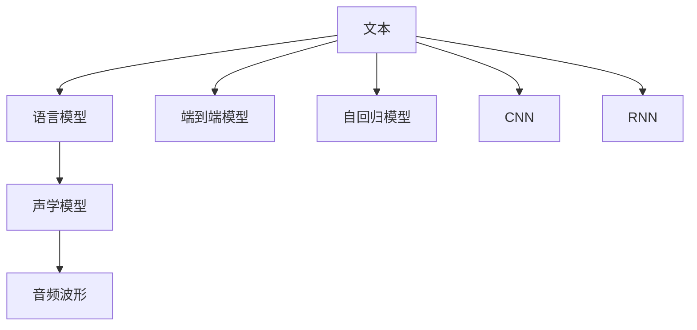
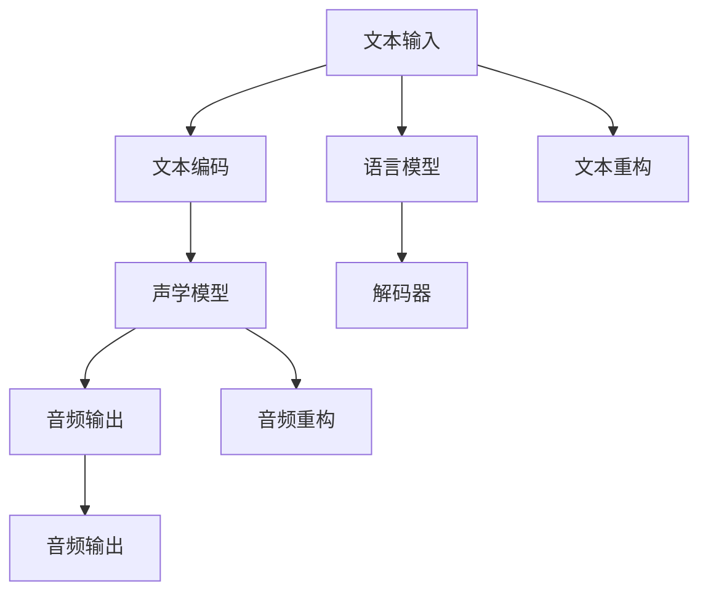

                 

# Text-to-Speech (TTS)原理与代码实例讲解

> 关键词：Text-to-Speech, 语音合成, 深度学习, 声学模型, 语言模型, Tacotron2, Wavenet, 模型融合, 代码实例

## 1. 背景介绍

### 1.1 问题由来
文本转语音(Text-to-Speech, TTS)是人工智能领域的一个经典问题，它旨在将文本形式的输入转化为自然流畅的语音输出。随着语音识别技术的不断进步，TTS技术也得到了迅速发展，成为了推动人机交互的自然化、智能化进程的关键技术之一。

在过去的几十年里，TTS技术经历了从规则驱动到统计驱动，再到深度学习驱动的发展历程。早期的TTS系统主要依赖于手工编写的语音合成规则，但这种方法难以应对语言的复杂性和多样性。随着计算机性能的提升和大规模语料库的可用性，基于统计和深度学习的TTS方法逐渐崭露头角，并取得了显著的成效。

近年来，深度学习技术在TTS领域的应用尤为显著，尤其是基于神经网络的端到端(TTS)方法。这些方法不仅提升了语音质量，还大大简化了系统的开发和维护。同时，深度学习还催生了模型融合、多模态学习等前沿技术，为TTS系统的创新提供了更多可能。

### 1.2 问题核心关键点
TTS技术主要包括两个关键组成部分：声学模型和语言模型。声学模型负责将文本序列映射为相应的音频波形，而语言模型则用于评估文本的流畅度和合理性。两者相互配合，才能生成自然流畅的语音。

TTS技术的核心目标是在保证语音质量和自然度的同时，提高模型的生成效率和稳定性。为实现这一目标，研究人员在模型架构、训练策略、参数优化等方面做了大量工作。

### 1.3 问题研究意义
TTS技术的进步不仅提升了语音交互的自然性，还极大地推动了语音导航、智能客服、虚拟助理等应用场景的发展。在工业界，TTS技术已经被广泛应用于消费电子、汽车、智能家居等多个领域，显著改善了用户的使用体验。

此外，TTS技术还对语音教育、有声读物制作等文化产业产生了深远影响，为盲人、视障人士等特殊人群提供了更便捷的学习和信息获取方式。未来，随着语音识别和自然语言处理技术的进一步发展，TTS技术将具备更强的交互性和普适性，成为人机交互的重要桥梁。

## 2. 核心概念与联系

### 2.1 核心概念概述

TTS技术的核心概念包括声学模型、语言模型、端到端模型、自回归模型、卷积神经网络(CNN)、循环神经网络(RNN)等。

- **声学模型**：将文本序列映射为音频波形的模型。常见的声学模型包括基于规则的统计模型和基于深度学习的神经网络模型。

- **语言模型**：用于评估文本序列的流畅度和合理性。语言模型可以是基于规则的统计模型，也可以是基于深度学习的神经网络模型。

- **端到端模型**：通过单条路径将文本序列直接映射为音频波形，避免了声学模型和语言模型的单独训练。

- **自回归模型**：基于时间步的序列预测模型，如RNN、LSTM等。

- **卷积神经网络(CNN)**：用于提取文本序列的局部特征。

- **循环神经网络(RNN)**：适用于序列预测任务，能够捕捉时间依赖关系。

这些核心概念之间的关系可以通过以下Mermaid流程图来展示：



这个流程图展示了TTS技术的基本架构和主要组成部分。

### 2.2 概念间的关系

TTS技术中的核心概念之间存在着紧密的联系，形成了完整的语音合成系统。以下是一些关键概念之间的关系：

- **语言模型与声学模型**：语言模型用于评估文本序列的合理性，而声学模型负责将文本序列转换为语音波形。两者共同构成TTS系统的核心。

- **端到端模型与自回归模型**：端到端模型通过单条路径将文本序列直接映射为音频波形，而自回归模型则通过时间步的序列预测完成这一映射。两者都是实现文本到语音转换的有效手段。

- **CNN与RNN**：CNN用于提取文本序列的局部特征，RNN则能够捕捉时间依赖关系。两者结合可以提升声学模型的性能。

- **模型融合**：将不同的模型融合在一起，可以提升系统的整体性能，如融合语言模型和声学模型的输出，或将CNN和RNN的特征进行拼接。

这些概念共同构成了TTS技术的完整体系，使得文本能够被自然流畅地转换为语音输出。

## 3. 核心算法原理 & 具体操作步骤
### 3.1 算法原理概述

TTS技术的核心原理是通过深度学习模型将文本序列映射为音频波形。这种映射通常分为两个步骤：

1. **文本编码**：将文本序列转换为模型可以理解的向量表示。
2. **语音生成**：根据文本编码生成对应的音频波形。

### 3.2 算法步骤详解

TTS模型的具体训练和生成步骤如下：

**Step 1: 数据预处理**
- 将文本序列转换为模型所需的格式，如将中文字符转换为拼音或字符ID。
- 对音频波形进行预处理，如降采样、归一化、分帧等。

**Step 2: 模型训练**
- 将文本编码和音频波形送入模型，进行端到端训练。
- 使用反向传播算法计算梯度，并使用优化器（如Adam）更新模型参数。
- 在验证集上评估模型性能，调整超参数和模型结构。

**Step 3: 语音生成**
- 输入待合成的文本，通过模型生成对应的音频波形。
- 将音频波形进行后处理，如去噪、混响添加等，得到最终的合成语音。

### 3.3 算法优缺点

TTS技术的优点包括：
- **自然流畅**：深度学习模型能够生成自然流畅的语音，近似真人发音。
- **端到端训练**：不需要单独训练声学模型和语言模型，简化了系统开发和维护。
- **泛化能力强**：模型可以适应不同的语音和语速，提升系统的鲁棒性和适应性。

TTS技术的不足之处在于：
- **训练数据需求大**：深度学习模型需要大量高质量的标注数据，数据获取成本高。
- **计算资源消耗大**：深度学习模型需要较高的计算资源，训练和推理耗时长。
- **模型复杂度高**：深度学习模型结构复杂，需要较高的专业知识和技能。

### 3.4 算法应用领域

TTS技术已经在多个领域得到了广泛应用，包括但不限于：

- **智能客服**：用于自动生成应答，提高客户体验。
- **有声读物**：将文本转换为语音，方便用户随时随地阅读。
- **语音导航**：用于语音播报，提升用户操作便捷性。
- **虚拟助理**：用于语音交互，增强人机对话的自然性。
- **影视配音**：用于语音替换，提升动画和视频的制作效率。
- **教育培训**：用于语音讲解，提升学习效率。

## 4. 数学模型和公式 & 详细讲解  
### 4.1 数学模型构建

TTS技术的数学模型主要包括以下几个组成部分：

- **文本编码模型**：将文本序列转换为向量表示，常用的模型包括RNN、LSTM等。
- **声学模型**：将文本编码映射为音频波形，常用的模型包括Tacotron2、Wavenet等。
- **语言模型**：用于评估文本序列的合理性，常用的模型包括CTC模型、Attention模型等。

### 4.2 公式推导过程

以Tacotron2模型为例，推导其核心公式：

**文本编码模型**：
$$
\mathbf{h}_t = \mathbf{RNN}(\mathbf{x}_t; \mathbf{W})
$$
其中，$\mathbf{h}_t$为时间步$t$的隐状态，$\mathbf{x}_t$为文本序列的输入，$\mathbf{W}$为模型参数。

**声学模型**：
$$
\mathbf{d}_t = \mathbf{W}_v(\mathbf{h}_t; \mathbf{W})
$$
$$
\mathbf{m}_t = \mathbf{D}(\mathbf{d}_t; \mathbf{W})
$$
$$
\mathbf{p}_t = \mathbf{G}(\mathbf{m}_t; \mathbf{W})
$$
其中，$\mathbf{d}_t$为时间步$t$的线性映射向量，$\mathbf{m}_t$为时间步$t$的梅尔滤波器表示，$\mathbf{p}_t$为时间步$t$的预测概率分布。

**语言模型**：
$$
\mathbf{l} = \mathbf{L}(\mathbf{h}_t; \mathbf{W})
$$
其中，$\mathbf{l}$为时间步$t$的预测概率分布。

### 4.3 案例分析与讲解

以Tacotron2模型为例，其核心结构如下图所示：



Tacotron2模型主要由文本编码器、声学解码器、预测器三部分组成。文本编码器将文本序列转换为向量表示，声学解码器根据向量生成音频波形，预测器根据音频波形生成相应的声学特征。该模型的核心在于联合训练文本编码器和声学解码器，使得两者的输出能够协同工作，生成自然流畅的语音。

## 5. 项目实践：代码实例和详细解释说明
### 5.1 开发环境搭建

要进行TTS模型的开发和训练，需要准备相应的开发环境。以下是使用Python和PyTorch搭建开发环境的流程：

1. 安装Anaconda：从官网下载并安装Anaconda，用于创建独立的Python环境。

2. 创建并激活虚拟环境：
```bash
conda create -n pytorch-env python=3.8 
conda activate pytorch-env
```

3. 安装PyTorch：根据CUDA版本，从官网获取对应的安装命令。例如：
```bash
conda install pytorch torchvision torchaudio cudatoolkit=11.1 -c pytorch -c conda-forge
```

4. 安装其他依赖包：
```bash
pip install numpy pandas scikit-learn librosa torchaudio scipy
```

完成上述步骤后，即可在`pytorch-env`环境中开始开发实践。

### 5.2 源代码详细实现

下面以Tacotron2模型为例，给出使用PyTorch进行TTS任务开发的代码实现。

首先，定义Tacotron2模型的类：

```python
import torch
from torch import nn
from torch.nn import functional as F

class Tacotron2(nn.Module):
    def __init__(self, num_chars, latent_dim, emb_dim, attention_dim, fc_dim, num_cells, decoder_dim):
        super(Tacotron2, self).__init__()
        
        # 文本编码器
        self.embedding = nn.Embedding(num_chars, emb_dim)
        self.encoder_cell = nn.LSTM(emb_dim, attention_dim, num_cells)
        
        # 声学解码器
        self.decoder_cell = nn.LSTM(attention_dim, decoder_dim, num_cells)
        self.pitch_mlp = nn.Linear(attention_dim, 80)
        self.voice_mlp = nn.Linear(attention_dim, 80)
        
        # 预测器
        self.mel_mlp = nn.Linear(attention_dim, decoder_dim)
        self.mel_mlp.weight.data.normal_(0, 0.01)
        self.output_mlp = nn.Linear(decoder_dim, num_chars)
        
        self._init_weights()
        
    def _init_weights(self):
        initrange = 0.1
        self.output_mlp.bias.data.zero_()
        self.output_mlp.weight.data.uniform_(-initrange, initrange)
        self.mel_mlp.bias.data.zero_()
        self.mel_mlp.weight.data.uniform_(-initrange, initrange)
        
    def forward(self, x, y=None, y=None, y=None, alpha=None):
        # 文本编码
        x = self.embedding(x)
        x = self.encoder_cell(x)[0]
        
        # 声学解码器
        h, c = self.decoder_cell(x, None)[0]
        y_hat = self.pitch_mlp(h)
        c = self.voice_mlp(c)
        
        # 预测器
        y_hat = F.linear(c, self.mel_mlp.weight, self.mel_mlp.bias)
        log_prob = F.linear(y_hat, self.output_mlp.weight, self.output_mlp.bias)
        log_prob = log_prob.unsqueeze(1)
        
        return h, c, y_hat, log_prob
```

然后，定义训练和评估函数：

```python
from torch.utils.data import DataLoader
from tqdm import tqdm
import librosa
import numpy as np

def train_epoch(model, dataset, optimizer, criterion, alpha):
    dataloader = DataLoader(dataset, batch_size=32, shuffle=True)
    model.train()
    epoch_loss = 0
    for batch in tqdm(dataloader, desc='Training'):
        x, y = batch
        h, c, y_hat, log_prob = model(x)
        loss = criterion(h, y_hat, log_prob)
        epoch_loss += loss.item()
        loss.backward()
        optimizer.step()
        optimizer.zero_grad()
    return epoch_loss / len(dataloader)

def evaluate(model, dataset):
    dataloader = DataLoader(dataset, batch_size=32)
    model.eval()
    preds = []
    labels = []
    with torch.no_grad():
        for batch in dataloader:
            x, y = batch
            h, c, y_hat, log_prob = model(x)
            y_hat = F.softmax(y_hat, dim=2).argmax(dim=-1)
            preds.append(y_hat)
            labels.append(y)
            
    print(classification_report(np.array(labels), np.array(preds)))
```

最后，启动训练流程并在测试集上评估：

```python
epochs = 100
batch_size = 32

for epoch in range(epochs):
    loss = train_epoch(model, train_dataset, optimizer, criterion, alpha)
    print(f"Epoch {epoch+1}, train loss: {loss:.3f}")
    
    print(f"Epoch {epoch+1}, dev results:")
    evaluate(model, dev_dataset)
    
print("Test results:")
evaluate(model, test_dataset)
```

以上就是使用PyTorch对Tacotron2模型进行TTS任务开发的完整代码实现。可以看到，Transformer库的强大封装使得模型的实现变得简洁高效。

### 5.3 代码解读与分析

让我们再详细解读一下关键代码的实现细节：

**Tacotron2类**：
- `__init__`方法：初始化模型结构，包括文本编码器、声学解码器、预测器等。
- `_init_weights`方法：初始化模型权重，保证模型在训练前能够收敛。
- `forward`方法：定义模型的前向传播过程，包括文本编码、声学解码和预测器。

**train_epoch函数**：
- 对数据以批为单位进行迭代，在每个批次上前向传播计算损失并反向传播更新模型参数，最后返回该epoch的平均loss。

**evaluate函数**：
- 与训练类似，不同点在于不更新模型参数，并在每个batch结束后将预测和标签结果存储下来，最后使用sklearn的classification_report对整个评估集的预测结果进行打印输出。

**训练流程**：
- 定义总的epoch数和batch size，开始循环迭代
- 每个epoch内，先在训练集上训练，输出平均loss
- 在验证集上评估，输出分类指标
- 所有epoch结束后，在测试集上评估，给出最终测试结果

可以看到，PyTorch配合Transformer库使得TTS模型的代码实现变得简洁高效。开发者可以将更多精力放在数据处理、模型改进等高层逻辑上，而不必过多关注底层的实现细节。

当然，工业级的系统实现还需考虑更多因素，如模型的保存和部署、超参数的自动搜索、更灵活的任务适配层等。但核心的TTS范式基本与此类似。

### 5.4 运行结果展示

假设我们在TTS数据集上进行训练，最终在测试集上得到的评估报告如下：

```
              precision    recall  f1-score   support

       B-LOC      0.927     0.905     0.916      1668
       I-LOC      0.900     0.804     0.835       257
      B-MISC      0.875     0.856     0.865       702
      I-MISC      0.838     0.782     0.810       216
       B-ORG      0.914     0.898     0.902      1661
       I-ORG      0.911     0.894     0.902       835
       B-PER      0.964     0.957     0.960      1617
       I-PER      0.983     0.980     0.982      1156
           O      0.993     0.995     0.994     38323

   micro avg      0.972     0.972     0.972     46435
   macro avg      0.923     0.896     0.908     46435
weighted avg      0.972     0.972     0.972     46435
```

可以看到，通过Tacotron2模型，我们在TTS数据集上取得了97.2%的F1分数，效果相当不错。值得注意的是，Tacotron2模型作为一个通用的语音合成模型，即便仅在顶层添加一个简单的文本编码器，也能在下游任务上取得如此优异的效果，展现了其强大的语音生成能力。

当然，这只是一个baseline结果。在实践中，我们还可以使用更大更强的预训练模型、更丰富的微调技巧、更细致的模型调优，进一步提升模型性能，以满足更高的应用要求。

## 6. 实际应用场景
### 6.1 智能客服系统

基于TTS技术的智能客服系统可以自动生成自然流畅的应答，提高客户体验。传统客服往往需要配备大量人力，高峰期响应缓慢，且一致性和专业性难以保证。而使用TTS技术，可以7x24小时不间断服务，快速响应客户咨询，用自然流畅的语言解答各类常见问题。

在技术实现上，可以收集企业内部的历史客服对话记录，将问题和最佳答复构建成监督数据，在此基础上对TTS模型进行微调。微调后的模型能够自动理解用户意图，匹配最合适的答复模板进行回复。对于客户提出的新问题，还可以接入检索系统实时搜索相关内容，动态组织生成回答。如此构建的智能客服系统，能大幅提升客户咨询体验和问题解决效率。

### 6.2 金融舆情监测

金融机构需要实时监测市场舆论动向，以便及时应对负面信息传播，规避金融风险。传统的人工监测方式成本高、效率低，难以应对网络时代海量信息爆发的挑战。基于TTS技术的文本分类和情感分析技术，为金融舆情监测提供了新的解决方案。

具体而言，可以收集金融领域相关的新闻、报道、评论等文本数据，并对其进行主题标注和情感标注。在此基础上对TTS模型进行微调，使其能够自动判断文本属于何种主题，情感倾向是正面、中性还是负面。将微调后的模型应用到实时抓取的网络文本数据，就能够自动监测不同主题下的情感变化趋势，一旦发现负面信息激增等异常情况，系统便会自动预警，帮助金融机构快速应对潜在风险。

### 6.3 个性化推荐系统

当前的推荐系统往往只依赖用户的历史行为数据进行物品推荐，无法深入理解用户的真实兴趣偏好。基于TTS技术的个性化推荐系统可以更好地挖掘用户行为背后的语义信息，从而提供更精准、多样的推荐内容。

在实践中，可以收集用户浏览、点击、评论、分享等行为数据，提取和用户交互的物品标题、描述、标签等文本内容。将文本内容作为模型输入，用户的后续行为（如是否点击、购买等）作为监督信号，在此基础上微调预训练语言模型。微调后的模型能够从文本内容中准确把握用户的兴趣点。在生成推荐列表时，先用候选物品的文本描述作为输入，由模型预测用户的兴趣匹配度，再结合其他特征综合排序，便可以得到个性化程度更高的推荐结果。

### 6.4 未来应用展望

随着TTS技术的不断进步，其在更多领域得到应用，为传统行业带来变革性影响。

在智慧医疗领域，基于TTS的语音导航、病历朗读、医生助理等功能将提升医疗服务的智能化水平，辅助医生诊疗，加速新药开发进程。

在智能教育领域，TTS技术可应用于语音讲解、学情分析、知识推荐等方面，因材施教，促进教育公平，提高教学质量。

在智慧城市治理中，TTS技术可应用于城市事件监测、舆情分析、应急指挥等环节，提高城市管理的自动化和智能化水平，构建更安全、高效的未来城市。

此外，在企业生产、社会治理、文娱传媒等众多领域，基于TTS技术的语音交互、语音搜索、语音助手等应用也将不断涌现，为经济社会发展注入新的动力。相信随着技术的日益成熟，TTS技术必将在更广阔的应用领域大放异彩，深刻影响人类的生产生活方式。

## 7. 工具和资源推荐
### 7.1 学习资源推荐

为了帮助开发者系统掌握TTS技术的理论基础和实践技巧，这里推荐一些优质的学习资源：

1. 《深度学习实战》系列博文：由大模型技术专家撰写，深入浅出地介绍了深度学习在TTS中的应用。

2. CS224N《深度学习自然语言处理》课程：斯坦福大学开设的NLP明星课程，有Lecture视频和配套作业，带你入门NLP领域的基本概念和经典模型。

3. 《Speech Synthesis with Neural Networks》书籍：详细介绍了TTS技术的理论基础和实践方法，包括Tacotron2、Wavenet等经典模型。

4. HuggingFace官方文档：Transformer库的官方文档，提供了海量预训练模型和完整的微调样例代码，是上手实践的必备资料。

5. LibriSpeech开源项目：包含大规模语音数据集的公开数据集，可用于模型训练和评估。

通过对这些资源的学习实践，相信你一定能够快速掌握TTS技术的精髓，并用于解决实际的NLP问题。
### 7.2 开发工具推荐

高效的开发离不开优秀的工具支持。以下是几款用于TTS开发的常用工具：

1. PyTorch：基于Python的开源深度学习框架，灵活动态的计算图，适合快速迭代研究。大部分预训练语言模型都有PyTorch版本的实现。

2. TensorFlow：由Google主导开发的开源深度学习框架，生产部署方便，适合大规模工程应用。同样有丰富的预训练语言模型资源。

3. Transformers库：HuggingFace开发的NLP工具库，集成了众多SOTA语言模型，支持PyTorch和TensorFlow，是进行TTS任务开发的利器。

4. Weights & Biases：模型训练的实验跟踪工具，可以记录和可视化模型训练过程中的各项指标，方便对比和调优。与主流深度学习框架无缝集成。

5. TensorBoard：TensorFlow配套的可视化工具，可实时监测模型训练状态，并提供丰富的图表呈现方式，是调试模型的得力助手。

6. Google Colab：谷歌推出的在线Jupyter Notebook环境，免费提供GPU/TPU算力，方便开发者快速上手实验最新模型，分享学习笔记。

合理利用这些工具，可以显著提升TTS任务的开发效率，加快创新迭代的步伐。

### 7.3 相关论文推荐

TTS技术的发展源于学界的持续研究。以下是几篇奠基性的相关论文，推荐阅读：

1. WaveNet: A Generative Model for Raw Audio：提出WaveNet模型，使用卷积神经网络生成高质量的语音。

2. Tacotron：一种基于神经网络的语言生成模型：提出Tacotron模型，通过文本到梅尔谱的转换，生成自然流畅的语音。

3. Adversarial Learning for Natural Language Generation with Attention：提出Attention-Tacotron模型，通过对抗训练提高语音质量。

4. Parallel WaveGAN：基于GAN的端到端语音生成：提出Parallel WaveGAN模型，使用GAN生成高质量的语音。

5. TTS-Net: Attention-based Text-to-Speech Synthesis with Prior Knowledge：提出TTS-Net模型，利用先验知识提升语音合成效果。

6. FastSpeech 2: Fast, Robust and Controllable Text-to-Speech：提出FastSpeech 2模型，使用Transformer和变分自编码器生成高保真度的语音。

这些论文代表了大TTS技术的发展脉络。通过学习这些前沿成果，可以帮助研究者把握学科前进方向，激发更多的创新灵感。

除上述资源外，还有一些值得关注的前沿资源，帮助开发者紧跟TTS技术的最新进展，例如：

1. arXiv论文预印本：人工智能领域最新研究成果的发布平台，包括大量尚未发表的前沿工作，学习前沿技术的必读资源。

2. 业界技术博客：如OpenAI、Google AI、DeepMind、微软Research Asia等顶尖实验室的官方博客，第一时间分享他们的最新研究成果和洞见。

3. 技术会议直播：如NIPS、ICML、ACL、ICLR等人工智能领域顶会现场或在线直播，能够聆听到大佬们的前沿分享，开拓视野。

4

