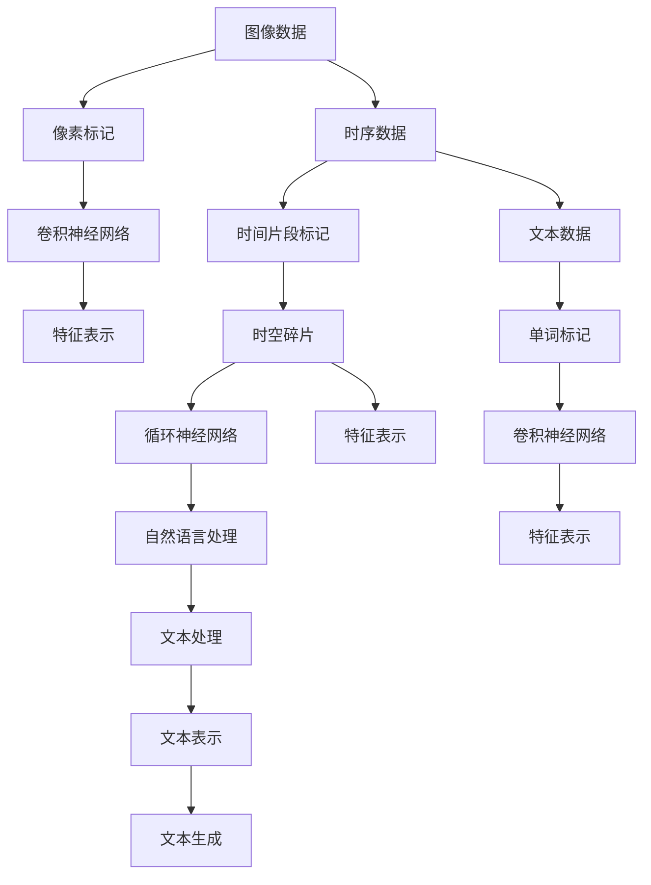
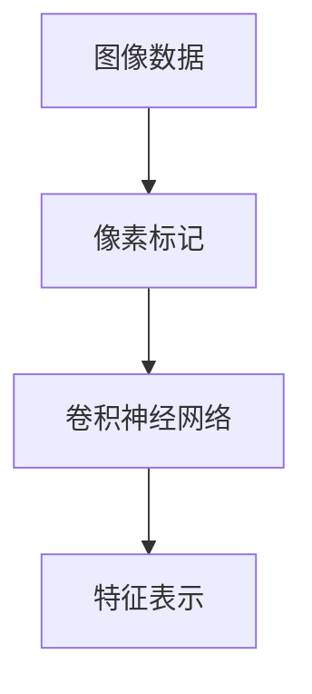
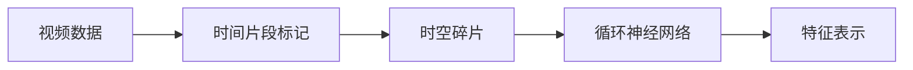
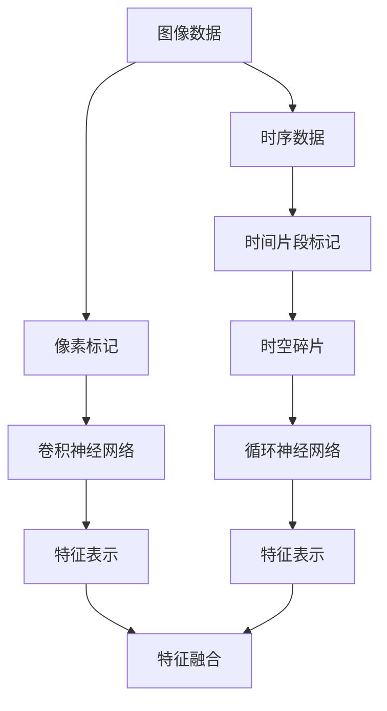
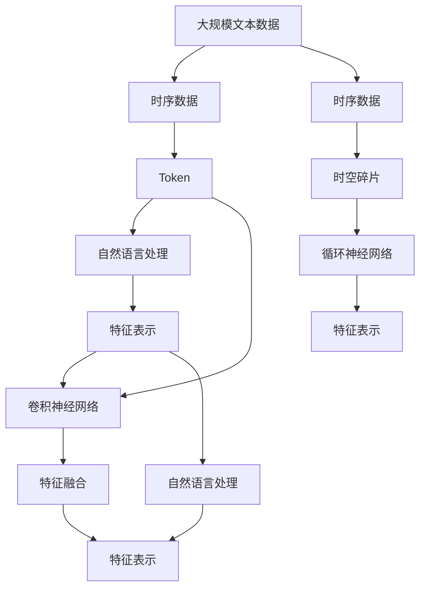

                 

## 1. 背景介绍

### 1.1 问题由来

随着计算机视觉与自然语言处理技术的快速发展，Token（标记）与时空碎片（Spatial and Temporal Fracture）逐渐成为处理数据的关键技术。Token技术主要用于文本与图像数据的表示和处理，而时空碎片技术则是面向时序数据的时间切片与特征提取。

在计算机视觉中，Token技术通过将图像转化为像素级标记，实现了像素级别的特征表示和处理。而时空碎片技术则将视频或音频数据切分为时间片段，提取各个时间片段的特征，并最终整合为整体的时序特征表示。

在自然语言处理中，Token技术通过将文本转化为单词或字符级的标记，实现了文本的分词、词性标注等预处理步骤。而时空碎片技术则将文本按照时间顺序切分为句子或段落，并提取各个时间片段的特征，实现文本的时间序列分析。

因此，Token与时空碎片技术虽然应用领域有所差异，但都在各自的领域中发挥着重要的作用。

### 1.2 问题核心关键点

Token与时空碎片技术的关键点在于如何高效地表示和处理数据。Token技术通过像素级别的标记表示数据，实现了像素级的特征提取与处理。时空碎片技术通过时间切片的标记表示数据，实现了时间级别的特征提取与处理。

Token技术主要用于图像处理与文本处理，而时空碎片技术则主要用于视频处理、音频处理与时序数据处理。两种技术在不同的应用场景中具有不同的优势，因此需要进行深入的技术对比。

## 2. 核心概念与联系

### 2.1 核心概念概述

为更好地理解Token与时空碎片技术的对比，本节将介绍几个密切相关的核心概念：

- Token（标记）：用于表示文本、图像、视频等数据的最小单位。在自然语言处理中，Token通常指单词或字符；在图像处理中，Token通常指像素或像素块；在视频处理中，Token通常指视频帧或时间片段。

- 时空碎片（Spatial and Temporal Fracture）：用于表示时序数据的标记。将时间序列数据切分为时间片段，每个片段表示一个时间点的数据，并提取各时间片段的特征，最终整合为整体的时序特征表示。

- 卷积神经网络（Convolutional Neural Network, CNN）：一种广泛应用于图像处理的神经网络结构，通过卷积操作提取图像的空间特征。

- 循环神经网络（Recurrent Neural Network, RNN）：一种广泛应用于时序数据处理的神经网络结构，通过循环操作提取时间序列的空间特征。

- 自然语言处理（Natural Language Processing, NLP）：研究如何使计算机能够理解、处理和生成人类语言的技术领域。

这些核心概念之间的逻辑关系可以通过以下Mermaid流程图来展示：



这个流程图展示了大语言模型微调过程中，Token与时空碎片技术的应用场景。Token用于图像与文本数据，时空碎片用于视频与音频数据。同时，这两种技术都可以与卷积神经网络和循环神经网络等神经网络结构结合，进行特征提取与表示。

### 2.2 概念间的关系

这些核心概念之间存在着紧密的联系，形成了Token与时空碎片技术的完整生态系统。下面我通过几个Mermaid流程图来展示这些概念之间的关系。

#### 2.2.1 Token在图像处理中的应用



这个流程图展示了Token在图像处理中的应用。将图像转化为像素级别的标记，使用卷积神经网络进行特征提取，得到图像的特征表示。

#### 2.2.2 时空碎片在视频处理中的应用



这个流程图展示了时空碎片在视频处理中的应用。将视频数据切分为时间片段，提取各时间片段的特征，使用循环神经网络进行特征整合，得到视频数据的特征表示。

#### 2.2.3 Token与时空碎片技术的结合



这个流程图展示了Token与时空碎片技术的结合。将图像数据和时序数据分别转化为Token与时空碎片标记，分别使用卷积神经网络和循环神经网络进行特征提取，最终将两种特征融合。

### 2.3 核心概念的整体架构

最后，我们用一个综合的流程图来展示这些核心概念在大语言模型微调过程中的整体架构：



这个综合流程图展示了Token与时空碎片技术在大语言模型微调过程中的整体架构。Token用于文本处理，时空碎片用于时序数据处理，两种技术都可以与卷积神经网络和循环神经网络等神经网络结构结合，进行特征提取与表示。

## 3. 核心算法原理 & 具体操作步骤
### 3.1 算法原理概述

Token与时空碎片技术的核心算法原理主要涉及特征提取与表示。Token技术通过像素级别的标记表示数据，实现了像素级的特征提取与处理；时空碎片技术通过时间切片的标记表示数据，实现了时间级别的特征提取与处理。

在图像处理中，Token技术通过卷积神经网络提取像素级的特征表示，从而实现图像分类、目标检测等任务。在文本处理中，Token技术通过卷积神经网络或循环神经网络提取单词或字符级的特征表示，从而实现文本分类、情感分析等任务。

时空碎片技术则通过循环神经网络或卷积神经网络提取时间级别的特征表示，从而实现视频分类、音频分类等任务。

### 3.2 算法步骤详解

Token与时空碎片技术的算法步骤大致如下：

#### Token技术算法步骤：

1. 数据预处理：将图像或文本数据转化为像素级别或单词级别的标记。
2. 特征提取：使用卷积神经网络或循环神经网络提取像素级或单词级的特征表示。
3. 特征融合：将不同尺度的特征表示进行融合，得到最终特征表示。
4. 模型训练：使用训练数据训练卷积神经网络或循环神经网络，得到特征表示模型。

#### 时空碎片技术算法步骤：

1. 数据预处理：将视频或音频数据切分为时间片段。
2. 特征提取：使用卷积神经网络或循环神经网络提取时间片段级的特征表示。
3. 特征融合：将不同时间片段的特征表示进行融合，得到最终特征表示。
4. 模型训练：使用训练数据训练卷积神经网络或循环神经网络，得到特征表示模型。

### 3.3 算法优缺点

Token技术与时空碎片技术各有优缺点。

Token技术的优点在于：

1. 像素级别的标记可以保留更多细节信息，适合图像处理与文本处理。
2. 可以使用大规模的卷积神经网络模型进行特征提取与表示。
3. 在NLP任务中，单词级别的标记可以更直接地反映文本的语义信息。

Token技术的缺点在于：

1. 像素级别的标记需要处理大量像素数据，计算量较大。
2. 需要大规模的标注数据进行训练，成本较高。

时空碎片技术的优点在于：

1. 时间级别的标记可以保留更多时间序列信息，适合视频处理与音频处理。
2. 可以使用大规模的循环神经网络模型进行特征提取与表示。
3. 在视频分类等任务中，时间片段级别的标记可以更直接地反映视频的动态信息。

时空碎片技术的缺点在于：

1. 时间切片的标记需要处理大量时间片段数据，计算量较大。
2. 需要大规模的标注数据进行训练，成本较高。

### 3.4 算法应用领域

Token技术与时空碎片技术在不同领域都有广泛的应用。

Token技术主要应用于：

1. 图像处理：如图像分类、目标检测等。
2. 文本处理：如文本分类、情感分析等。
3. 自然语言处理：如机器翻译、语言建模等。

时空碎片技术主要应用于：

1. 视频处理：如视频分类、动作识别等。
2. 音频处理：如音频分类、情感分析等。
3. 时序数据处理：如股票分析、天气预测等。

两种技术在不同的应用场景中具有不同的优势，因此需要进行深入的技术对比。

## 4. 数学模型和公式 & 详细讲解
### 4.1 数学模型构建

本节将使用数学语言对Token与时空碎片技术的核心算法原理进行更加严格的刻画。

记图像数据为 $I=\{I_1, I_2, ..., I_n\}$，其中 $I_i$ 为第 $i$ 幅图像的像素级标记。假设卷积神经网络（CNN）提取图像的特征表示为 $F=\{F_1, F_2, ..., F_n\}$，其中 $F_i$ 为第 $i$ 幅图像的特征表示。

记文本数据为 $T=\{T_1, T_2, ..., T_m\}$，其中 $T_i$ 为第 $i$ 个单词的单词级标记。假设循环神经网络（RNN）提取文本的特征表示为 $G=\{G_1, G_2, ..., G_m\}$，其中 $G_i$ 为第 $i$ 个单词的特征表示。

记视频数据为 $V=\{V_1, V_2, ..., V_n\}$，其中 $V_i$ 为第 $i$ 个时间片段的视频数据。假设时空碎片技术提取视频特征为 $H=\{H_1, H_2, ..., H_n\}$，其中 $H_i$ 为第 $i$ 个时间片段的特征表示。

### 4.2 公式推导过程

在Token技术中，假设卷积神经网络提取图像特征的公式为：

$$
F_i = CNN(I_i)
$$

其中 $CNN$ 为卷积神经网络模型。

在文本处理中，假设循环神经网络提取文本特征的公式为：

$$
G_i = RNN(T_i)
$$

其中 $RNN$ 为循环神经网络模型。

在时空碎片技术中，假设卷积神经网络或循环神经网络提取时间片段特征的公式为：

$$
H_i = CNN(V_i) \quad \text{或} \quad H_i = RNN(V_i)
$$

其中 $CNN$ 或 $RNN$ 为卷积神经网络或循环神经网络模型。

### 4.3 案例分析与讲解

假设我们在图像分类任务中，使用Token技术进行特征提取与表示。假设有 $n=3$ 幅图像，分别为 $I_1$、$I_2$、$I_3$。每幅图像的大小为 $H\times W=256\times 256$ 像素，共有 $C=3$ 个通道。

假设我们使用卷积神经网络提取图像特征，共有 $k=3$ 个卷积核，每个卷积核的尺寸为 $5\times 5$ 像素，步长为 $1$ 像素。卷积层后接最大池化层，池化尺寸为 $2\times 2$ 像素，步长为 $2$ 像素。卷积层和池化层的输出尺寸均为 $H'\times W'=128\times 128$ 像素。

卷积神经网络的模型架构为：

$$
F_i = CNN(I_i) = \{F_1, F_2, ..., F_n\}
$$

其中 $F_i = \{f_1^{(i)}, f_2^{(i)}, ..., f_{n'}^{(i)}\}$，$f_{j}^{(i)}$ 为卷积层和池化层的输出。

假设我们得到了 $n=3$ 幅图像的特征表示，分别为 $F_1$、$F_2$、$F_3$。接下来，我们将这些特征表示进行融合，得到最终的图像特征表示。

假设我们使用全连接层将 $F_1$、$F_2$、$F_3$ 融合为一个最终的特征表示 $F$，假设全连接层共有 $m=5$ 个节点。假设使用Softmax函数作为输出层，得到最终的分类结果。

最终的分类结果为：

$$
y = Softmax(F) = \frac{\exp(F)}{\sum_{j=1}^n \exp(f_j)}
$$

在时空碎片技术中，假设我们使用卷积神经网络提取时间片段特征。假设我们有 $n=3$ 个时间片段，分别为 $V_1$、$V_2$、$V_3$。每个时间片段的大小为 $H\times W=256\times 256$ 像素，共有 $C=3$ 个通道。

假设我们使用卷积神经网络提取时间片段特征，共有 $k=3$ 个卷积核，每个卷积核的尺寸为 $5\times 5$ 像素，步长为 $1$ 像素。卷积层后接最大池化层，池化尺寸为 $2\times 2$ 像素，步长为 $2$ 像素。卷积层和池化层的输出尺寸均为 $H'\times W'=128\times 128$ 像素。

卷积神经网络的模型架构为：

$$
H_i = CNN(V_i) = \{H_1, H_2, ..., H_n\}
$$

其中 $H_i = \{h_1^{(i)}, h_2^{(i)}, ..., h_{n'}^{(i)}\}$，$h_{j}^{(i)}$ 为卷积层和池化层的输出。

假设我们得到了 $n=3$ 个时间片段的特征表示，分别为 $H_1$、$H_2$、$H_3$。接下来，我们将这些特征表示进行融合，得到最终的时间片段特征表示。

假设我们使用全连接层将 $H_1$、$H_2$、$H_3$ 融合为一个最终的时间片段特征表示 $H$，假设全连接层共有 $m=5$ 个节点。假设使用Softmax函数作为输出层，得到最终的分类结果。

最终的分类结果为：

$$
y = Softmax(H) = \frac{\exp(H)}{\sum_{j=1}^n \exp(h_j)}
$$

通过以上案例分析，我们可以看到Token技术与时空碎片技术在特征提取与表示方面的基本原理和算法步骤。

## 5. 项目实践：代码实例和详细解释说明
### 5.1 开发环境搭建

在进行Token与时空碎片技术的应用开发前，我们需要准备好开发环境。以下是使用Python进行TensorFlow开发的环境配置流程：

1. 安装Anaconda：从官网下载并安装Anaconda，用于创建独立的Python环境。

2. 创建并激活虚拟环境：
```bash
conda create -n tf-env python=3.8 
conda activate tf-env
```

3. 安装TensorFlow：根据CUDA版本，从官网获取对应的安装命令。例如：
```bash
conda install tensorflow-gpu==2.5.0 -c pypi -c conda-forge
```

4. 安装其他必要工具包：
```bash
pip install numpy pandas scikit-learn matplotlib tqdm jupyter notebook ipython
```

完成上述步骤后，即可在`tf-env`环境中开始开发实践。

### 5.2 源代码详细实现

下面我以图像分类任务为例，给出使用TensorFlow进行Token技术特征提取的PyTorch代码实现。

首先，定义图像数据和标签：

```python
import tensorflow as tf
import numpy as np
import matplotlib.pyplot as plt

# 加载图像数据
image_data = np.load('image_data.npy')

# 加载标签
labels = np.load('labels.npy')
```

然后，定义图像数据预处理函数：

```python
def preprocess_image(image):
    # 归一化图像数据
    image = tf.image.resize(image, [224, 224])
    image = tf.image.convert_image_dtype(image, tf.float32) / 255.0
    return image
```

接着，定义图像分类模型：

```python
# 定义卷积神经网络模型
class ConvNet(tf.keras.Model):
    def __init__(self):
        super(ConvNet, self).__init__()
        self.conv1 = tf.keras.layers.Conv2D(32, (3, 3), activation='relu')
        self.maxpool1 = tf.keras.layers.MaxPooling2D((2, 2))
        self.conv2 = tf.keras.layers.Conv2D(64, (3, 3), activation='relu')
        self.maxpool2 = tf.keras.layers.MaxPooling2D((2, 2))
        self.flatten = tf.keras.layers.Flatten()
        self.dense1 = tf.keras.layers.Dense(64, activation='relu')
        self.dense2 = tf.keras.layers.Dense(10)

    def call(self, inputs):
        x = self.conv1(inputs)
        x = self.maxpool1(x)
        x = self.conv2(x)
        x = self.maxpool2(x)
        x = self.flatten(x)
        x = self.dense1(x)
        return self.dense2(x)

model = ConvNet()
```

然后，定义模型训练函数：

```python
def train_model(model, data, labels, batch_size, epochs):
    # 定义优化器
    optimizer = tf.keras.optimizers.Adam(learning_rate=0.001)

    # 定义损失函数
    loss_fn = tf.keras.losses.SparseCategoricalCrossentropy()

    # 定义评估指标
    metrics = tf.keras.metrics.SparseCategoricalAccuracy()

    for epoch in range(epochs):
        for i in range(0, len(data), batch_size):
            # 定义批次数据
            batch_data = data[i:i+batch_size]
            batch_labels = labels[i:i+batch_size]

            # 前向传播
            with tf.GradientTape() as tape:
                predictions = model(batch_data)
                loss = loss_fn(labels, predictions)

            # 反向传播
            gradients = tape.gradient(loss, model.trainable_variables)
            optimizer.apply_gradients(zip(gradients, model.trainable_variables))

            # 计算评估指标
            predictions = model(batch_data)
            accuracy = metrics(labels, predictions)
            print(f'Epoch {epoch+1}, Loss: {loss.numpy():.4f}, Accuracy: {accuracy.numpy():.4f}')
```

最后，启动模型训练并输出结果：

```python
# 加载图像数据
image_data = np.load('image_data.npy')

# 加载标签
labels = np.load('labels.npy')

# 定义批次大小
batch_size = 32

# 定义训练轮数
epochs = 10

# 训练模型
train_model(model, image_data, labels, batch_size, epochs)
```

通过以上代码，我们实现了一个基本的Token技术图像分类模型。在实际应用中，我们还可以使用更多先进的模型结构和优化算法，进一步提升模型性能。

### 5.3 代码解读与分析

让我们再详细解读一下关键代码的实现细节：

**图像数据预处理函数**：

- `preprocess_image(image)`方法：对图像进行归一化和尺寸调整，使其符合模型输入要求。

**图像分类模型**：

- `ConvNet(tf.keras.Model)`类：定义卷积神经网络模型，包含卷积层、池化层、全连接层等组件。
- `call(self, inputs)`方法：实现前向传播过程，从输入到输出的完整计算流程。

**模型训练函数**：

- `train_model(model, data, labels, batch_size, epochs)`函数：定义训练过程，使用Adam优化器和SparseCategoricalCrossentropy损失函数。
- 在每个epoch内，对每个批次数据进行前向传播和反向传播，计算损失和评估指标，并输出训练结果。

通过以上代码，我们可以看到TensorFlow的Token技术在图像分类任务中的应用流程。

## 6. 实际应用场景
### 6.1 智能安防系统

智能安防系统是Token技术与时空碎片技术的重要应用场景之一。在视频监控中，可以使用时空碎片技术将视频数据切分为时间片段，提取各个时间片段的特征，实现动作识别、异常检测等功能。

在人脸识别中，可以使用Token技术提取人脸图像的像素级特征，实现人脸识别、人脸比对等功能。

### 6.2 工业质检系统

在工业质检中，可以使用Token技术与时空碎片技术相结合，实现对图像和视频的全面分析。

使用Token技术提取产品图像的像素级特征，实现图像分类、缺陷检测等功能。

使用时空碎片技术提取视频数据的时间片段特征，实现视频分类、异常检测等功能。

### 6.3 医疗影像系统

在医疗影像中，可以使用Token技术与时空碎片技术相结合，实现对医学图像和视频的全面分析。

使用Token技术提取医学图像的像素级特征，实现图像分类、病变检测等功能。

使用时空碎片技术提取医学视频的时间片段特征，实现视频分类、病灶跟踪等功能。

## 7. 工具和资源推荐
### 7.1 学习资源推荐

为了帮助开发者系统掌握Token与时空碎片技术的应用，这里推荐一些优质的学习资源：

1. 《深度学习》系列书籍：由深度学习领域顶尖专家撰写，深入浅出地介绍了深度学习的基本概念和算法。
2. 《计算机视觉：模型、学习和推理》系列书籍：详细介绍了计算机视觉领域的经典模型和算法，涵盖图像分类、目标检测、动作识别等任务。
3. 《自然语言处理综论》系列书籍：涵盖了自然语言处理领域的基本概念和算法，包括文本分类、情感分析、机器翻译等任务。
4. 《TensorFlow官方文档》：TensorFlow的官方文档，提供了大量预训练模型和算法实现，是进行TensorFlow开发的重要资料。
5. 《深度学习与计算机视觉》系列课程：斯坦福大学开设的计算机视觉和深度学习课程，提供了丰富的教学视频和课程资料。

通过对这些资源的学习实践，相信你一定能够快速掌握Token与时空碎片技术的应用，并用于解决实际的NLP问题。
###  7.2 开发工具推荐

高效的开发离不开优秀的工具支持。以下是几款用于Token与时空碎片技术开发的常用工具：

1. TensorFlow：基于Python的开源深度学习框架，灵活动态的计算图，适合快速迭代研究。支持多种GPU设备，适合大规模工程应用。
2. PyTorch：基于Python的开源深度学习框架，支持动态计算图，适合快速原型开发。支持多种GPU设备，适合学术研究。
3. Keras：高级深度学习框架，支持多种模型架构，适合快速原型开发和部署。
4. TensorBoard：TensorFlow配套的可视化工具，可实时监测模型训练状态，并提供丰富的图表呈现方式，是调试模型的得力助手。
5. Weights & Biases：模型训练的实验跟踪工具，可以记录和可视化模型训练过程中的各项指标，方便对比和调优。

合理利用这些工具，可以显著提升Token与时空碎片技术的开发效率，加快创新迭代的步伐。

### 7.3 相关论文推荐

Token与时空碎片技术的研究源于学界的持续研究。以下是几篇奠基性的相关论文，推荐阅读：

1. AlexNet: ImageNet Classification with Deep Convolutional Neural Networks：提出卷积神经网络（CNN）模型，实现了图像分类的新突破。
2. Inception: GoogLeNet with Inception Layers：提出Inception模块，优化了CNN模型的结构和参数，提高了图像分类的精度。
3. LSTM: Long Short-Term Memory：提出长短期记忆网络（LSTM）模型，实现了时序数据的分类和预测。
4. CNNs for Structured Prediction：提出卷积神经网络（CNN）在结构化预测中的应用，实现了图像标注和目标检测的任务。
5. Temporal Information Network for Video Event Recognition：提出时序信息网络（Temporal Information Network），实现了视频事件识别的任务。

这些论文代表了大语言模型微调技术的发展脉络。通过学习这些前沿成果，可以帮助研究者把握学科前进方向，激发更多的创新灵感。

除上述资源外，还有一些值得关注的前沿资源，帮助开发者紧跟Token与时空碎片技术的发展方向，例如：

1. arXiv论文预印本：人工智能领域最新研究成果的发布平台，包括大量尚未发表的前沿工作，学习前沿技术的必读资源。
2. 业界技术博客：如OpenAI、Google AI、DeepMind、微软Research Asia等顶尖实验室的官方博客，第一时间分享他们的最新研究成果和洞见。
3. 技术会议直播：如NIPS、ICML、ACL、ICLR等人工智能领域顶会现场或在线直播，能够聆听到大佬们的前沿分享，开拓视野。
4. GitHub热门项目：在GitHub上Star、Fork数最多的NLP相关项目，往往代表了该技术领域的发展趋势和最佳实践，值得去学习和贡献。
5. 行业

