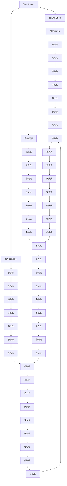
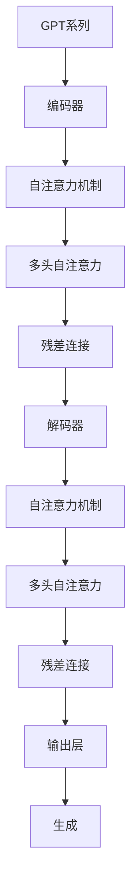
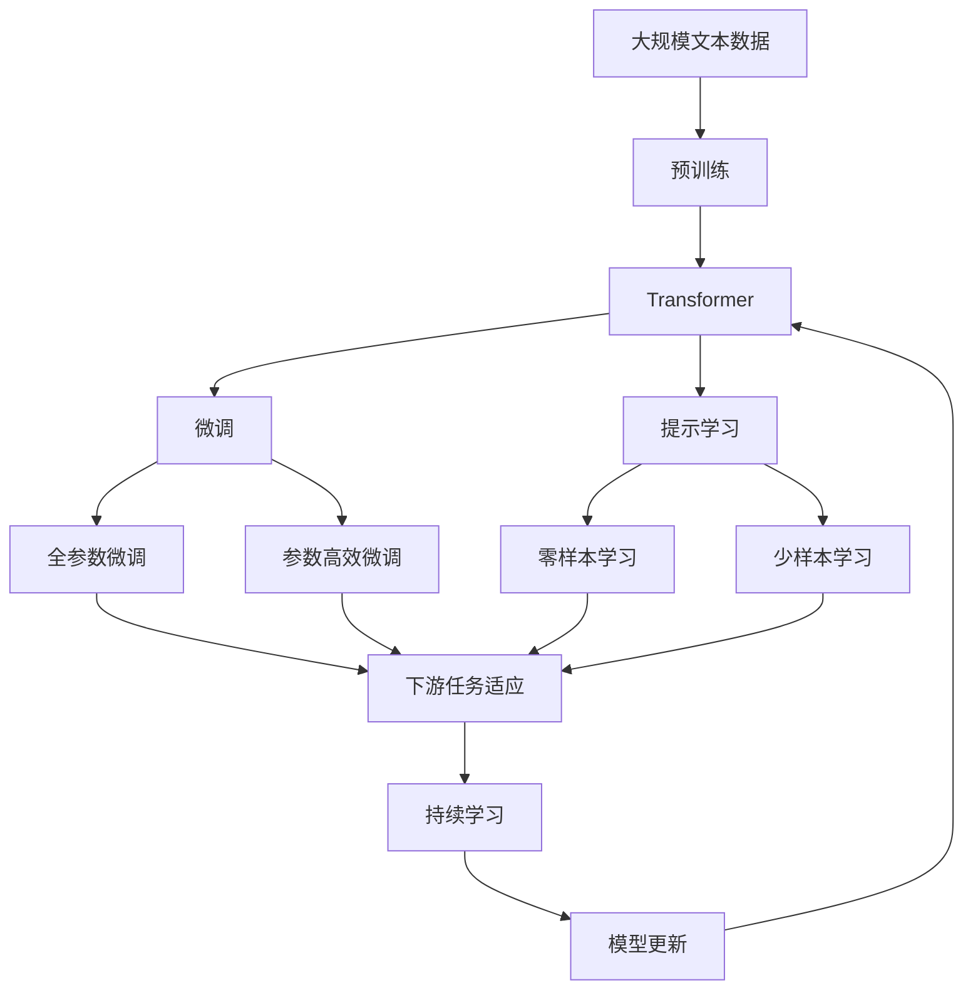

                 

# Transformer 的出现：改变计算范式的 GPT 系列

> 关键词：Transformer, GPT系列, 计算范式, 深度学习, 自注意力机制, 神经网络, 语言模型

## 1. 背景介绍

### 1.1 问题由来
在过去的一段时间里，深度学习（Deep Learning）技术取得了显著的突破，尤其是在自然语言处理（Natural Language Processing, NLP）领域，各种模型如雨后春笋般涌现，但这些模型在处理自然语言时，往往难以兼顾速度和效率。传统的循环神经网络（Recurrent Neural Networks, RNN）和卷积神经网络（Convolutional Neural Networks, CNN），虽然在一定程度上解决了某些NLP任务，但在处理长距离依赖关系时，表现较差。

与此同时，计算资源越来越昂贵，训练和推理大模型的成本也越来越高。这些问题使得深度学习模型在实际应用中面临很大的挑战，如何提高模型的速度和效率，同时保持高性能，成为了研究者亟待解决的问题。

### 1.2 问题核心关键点
在这一背景下，Transformer模型应运而生。Transformer不仅解决了上述问题，更改变了深度学习的计算范式。它通过引入自注意力机制（Self-Attention Mechanism），使得模型能够在忽略序列顺序的情况下，同时考虑整个输入序列的信息，从而大大提高了模型的效率和性能。

Transformer的核心思想在于：
- 打破顺序依赖，并行化处理输入序列。
- 引入自注意力机制，使得模型能够同时关注整个序列的信息，减少计算复杂度。
- 构建跨层连接，增强模型的信息传递能力。

这一思想在深度学习领域引起了巨大的反响，后续基于Transformer的GPT系列模型在各种NLP任务上取得了突破性成果。

## 2. 核心概念与联系

### 2.1 核心概念概述

为了更好地理解Transformer模型及其在GPT系列中的演进，本节将介绍几个关键概念：

- **Transformer模型**：Transformer是一种基于自注意力机制的神经网络模型，由Vaswani等人于2017年提出。它通过多头自注意力机制和残差连接（Residual Connection）构建了高效的序列处理模型。

- **GPT系列模型**：GPT（Generative Pre-trained Transformer）系列模型是由OpenAI开发的一系列基于Transformer的大规模语言模型。从GPT-1到GPT-4，模型参数规模和能力都在不断提升，广泛应用于各种NLP任务。

- **自注意力机制**：自注意力机制是Transformer的核心，它通过计算输入序列中各个位置之间的相似度，动态地为每个位置分配权重，从而使得模型能够同时关注整个序列的信息。

- **残差连接**：残差连接是深度神经网络中常用的技术，通过将输入和输出相加，使得模型能够更好地学习长距离依赖关系。

- **多头自注意力**：多头自注意力机制通过并行多个自注意力层，使得模型能够从不同的角度理解输入序列的信息。

- **编码器-解码器结构**：GPT系列模型通常采用编码器-解码器的结构，编码器负责处理输入序列，解码器负责生成输出序列，这种结构适用于生成任务。

这些核心概念之间的逻辑关系可以通过以下Mermaid流程图来展示：



这个流程图展示了Transformer模型的核心组件和机制。自注意力机制通过计算输入序列中各个位置之间的相似度，动态地为每个位置分配权重，从而使得模型能够同时关注整个序列的信息。多头自注意力机制通过并行多个自注意力层，使得模型能够从不同的角度理解输入序列的信息。残差连接通过将输入和输出相加，使得模型能够更好地学习长距离依赖关系。这些机制共同构成了Transformer模型的计算范式，改变了深度学习的计算模式。

### 2.2 概念间的关系

这些核心概念之间存在着紧密的联系，形成了Transformer模型的完整生态系统。下面我们通过几个Mermaid流程图来展示这些概念之间的关系。

#### 2.2.1 Transformer模型的计算流程


这个流程图展示了Transformer模型的计算流程。输入序列首先通过编码器进行处理，编码器由多个自注意力层和残差连接构成，能够从不同角度理解输入序列的信息。解码器负责生成输出序列，同样由多个自注意力层和残差连接构成，能够从输入序列中提取信息并生成输出。

#### 2.2.2 GPT系列模型的结构



这个流程图展示了GPT系列模型的结构。GPT系列模型通常采用编码器-解码器的结构，编码器通过自注意力机制和残差连接处理输入序列，解码器通过自注意力机制和残差连接生成输出序列，这种结构适用于生成任务。

#### 2.2.3 Transformer模型的优缺点

Transformer模型具有以下优点：
1. 并行化处理，效率高。
2. 自注意力机制，减少计算复杂度。
3. 残差连接，增强信息传递。
4. 多头自注意力，提高模型的泛化能力。

但同时也存在一些缺点：
1. 参数量大，训练和推理成本高。
2. 计算复杂度高，需要大量的计算资源。
3. 模型复杂度较高，难以解释和调试。

尽管存在这些局限性，但Transformer模型的大规模应用，已经证明其在提高模型性能和效率方面的巨大潜力。

### 2.3 核心概念的整体架构

最后，我们用一个综合的流程图来展示这些核心概念在大语言模型微调过程中的整体架构：



这个综合流程图展示了从预训练到微调，再到持续学习的完整过程。Transformer模型首先在大规模文本数据上进行预训练，然后通过微调（包括全参数微调和参数高效微调）或提示学习（包括零样本和少样本学习）来适应下游任务。最后，通过持续学习技术，模型可以不断更新和适应新的任务和数据。 通过这些流程图，我们可以更清晰地理解Transformer模型的核心组件和机制，为后续深入讨论具体的微调方法和技术奠定基础。

## 3. 核心算法原理 & 具体操作步骤
### 3.1 算法原理概述

Transformer模型的核心思想是：
- 通过自注意力机制，使得模型能够在忽略序列顺序的情况下，同时考虑整个输入序列的信息。
- 通过残差连接，增强模型的信息传递能力。
- 通过多头自注意力机制，从不同的角度理解输入序列的信息。

Transformer模型的计算过程可以总结如下：
1. 对输入序列进行嵌入和位置编码，生成输入向量。
2. 通过多头自注意力机制，计算输入向量中各个位置之间的相似度，生成注意力权重。
3. 通过残差连接和层归一化，更新输入向量，得到编码器层的输出。
4. 通过多头自注意力机制和残差连接，更新解码器层的输出。
5. 通过输出层，将解码器层的输出转换为目标序列的分布。

### 3.2 算法步骤详解

基于Transformer模型的微调一般包括以下几个关键步骤：

**Step 1: 准备预训练模型和数据集**
- 选择合适的预训练Transformer模型，如BERT、GPT等。
- 准备下游任务的数据集，划分为训练集、验证集和测试集。

**Step 2: 添加任务适配层**
- 根据任务类型，在Transformer模型的顶层设计合适的输出层和损失函数。
- 对于分类任务，通常在顶层添加线性分类器和交叉熵损失函数。
- 对于生成任务，通常使用语言模型的解码器输出概率分布，并以负对数似然为损失函数。

**Step 3: 设置微调超参数**
- 选择合适的优化算法及其参数，如 AdamW、SGD 等，设置学习率、批大小、迭代轮数等。
- 设置正则化技术及强度，包括权重衰减、Dropout、Early Stopping等。
- 确定冻结预训练参数的策略，如仅微调顶层，或全部参数都参与微调。

**Step 4: 执行梯度训练**
- 将训练集数据分批次输入模型，前向传播计算损失函数。
- 反向传播计算参数梯度，根据设定的优化算法和学习率更新模型参数。
- 周期性在验证集上评估模型性能，根据性能指标决定是否触发 Early Stopping。
- 重复上述步骤直到满足预设的迭代轮数或 Early Stopping 条件。

**Step 5: 测试和部署**
- 在测试集上评估微调后模型 $M_{\hat{\theta}}$ 的性能，对比微调前后的精度提升。
- 使用微调后的模型对新样本进行推理预测，集成到实际的应用系统中。
- 持续收集新的数据，定期重新微调模型，以适应数据分布的变化。

以上是基于Transformer模型的微调一般流程。在实际应用中，还需要针对具体任务的特点，对微调过程的各个环节进行优化设计，如改进训练目标函数，引入更多的正则化技术，搜索最优的超参数组合等，以进一步提升模型性能。

### 3.3 算法优缺点

Transformer模型及其微调方法具有以下优点：
1. 并行化处理，效率高。
2. 自注意力机制，减少计算复杂度。
3. 残差连接，增强信息传递。
4. 多头自注意力机制，提高模型的泛化能力。

但同时也存在一些缺点：
1. 参数量大，训练和推理成本高。
2. 计算复杂度高，需要大量的计算资源。
3. 模型复杂度较高，难以解释和调试。

尽管存在这些局限性，但Transformer模型的大规模应用，已经证明其在提高模型性能和效率方面的巨大潜力。

### 3.4 算法应用领域

基于Transformer模型的微调方法已经广泛应用于各种NLP任务，如文本分类、命名实体识别、关系抽取、问答系统、机器翻译、文本摘要、对话系统等。这些任务通常通过微调Transformer模型，使其能够适应特定的输入和输出格式，从而提高模型在实际应用中的效果。

除了上述这些经典任务外，Transformer模型及其微调方法也被创新性地应用到更多场景中，如可控文本生成、常识推理、代码生成、数据增强等，为NLP技术带来了全新的突破。随着预训练模型和微调方法的不断进步，相信NLP技术将在更广阔的应用领域大放异彩。

## 4. 数学模型和公式 & 详细讲解  
### 4.1 数学模型构建

Transformer模型中的核心计算过程可以表示为以下几个步骤：

1. 对输入序列进行嵌入和位置编码，生成输入向量 $X$。
2. 通过多头自注意力机制，计算输入向量中各个位置之间的相似度，生成注意力权重 $Q$、$K$ 和 $V$。
3. 通过残差连接和层归一化，更新输入向量，得到编码器层的输出 $X'$。
4. 通过多头自注意力机制和残差连接，更新解码器层的输出 $X''$。
5. 通过输出层，将解码器层的输出转换为目标序列的分布。

### 4.2 公式推导过程

以Transformer模型中的自注意力机制为例，公式推导如下：

$$
\text{Attention}(Q, K, V) = \text{Softmax}\left(\frac{QK^T}{\sqrt{d_k}}\right)V
$$

其中 $Q$ 表示查询向量，$K$ 表示键向量，$V$ 表示值向量，$d_k$ 表示键向量的维度。通过计算 $Q$ 和 $K$ 的点积，并除以 $\sqrt{d_k}$，生成注意力权重矩阵。然后通过Softmax函数归一化，得到每个位置对其他位置的注意力权重。最后，将注意力权重与值向量 $V$ 进行线性变换，得到注意力结果。

在Transformer模型中，自注意力机制通过多头自注意力层并行计算多个注意力结果，从而从不同的角度理解输入序列的信息。多头自注意力层的计算过程可以表示为：

$$
\text{Multi-Head Attention}(Q, K, V) = \sum_{i=1}^{m}\text{Attention}(QW_i, KW_i, VW_i)
$$

其中 $W_i$ 表示第 $i$ 个头的权重矩阵。通过将 $Q$、$K$ 和 $V$ 矩阵分别乘以不同的权重矩阵，生成多个注意力结果，并将它们拼接在一起，得到最终的多头自注意力结果。

### 4.3 案例分析与讲解

以BERT模型为例，BERT模型的自注意力机制计算过程可以表示为：

1. 对输入序列进行嵌入和位置编码，生成输入向量 $X$。
2. 将输入向量 $X$ 分别乘以权重矩阵 $Q$、$K$ 和 $V$，生成查询向量 $Q$、键向量 $K$ 和值向量 $V$。
3. 通过计算 $Q$ 和 $K$ 的点积，并除以 $\sqrt{d_k}$，生成注意力权重矩阵。
4. 通过Softmax函数归一化，得到每个位置对其他位置的注意力权重。
5. 将注意力权重与值向量 $V$ 进行线性变换，得到注意力结果。

通过多头自注意力机制，BERT模型能够从不同的角度理解输入序列的信息，从而提高模型的泛化能力和性能。

## 5. 项目实践：代码实例和详细解释说明
### 5.1 开发环境搭建

在进行微调实践前，我们需要准备好开发环境。以下是使用Python进行PyTorch开发的环境配置流程：

1. 安装Anaconda：从官网下载并安装Anaconda，用于创建独立的Python环境。

2. 创建并激活虚拟环境：
```bash
conda create -n pytorch-env python=3.8 
conda activate pytorch-env
```

3. 安装PyTorch：根据CUDA版本，从官网获取对应的安装命令。例如：
```bash
conda install pytorch torchvision torchaudio cudatoolkit=11.1 -c pytorch -c conda-forge
```

4. 安装Transformers库：
```bash
pip install transformers
```

5. 安装各类工具包：
```bash
pip install numpy pandas scikit-learn matplotlib tqdm jupyter notebook ipython
```

完成上述步骤后，即可在`pytorch-env`环境中开始微调实践。

### 5.2 源代码详细实现

这里我们以命名实体识别(NER)任务为例，给出使用Transformers库对BERT模型进行微调的PyTorch代码实现。

首先，定义NER任务的数据处理函数：

```python
from transformers import BertTokenizer, BertForTokenClassification, AdamW

tokenizer = BertTokenizer.from_pretrained('bert-base-cased')
model = BertForTokenClassification.from_pretrained('bert-base-cased', num_labels=7)

# 定义训练和评估函数
def train_epoch(model, dataset, batch_size, optimizer):
    model.train()
    epoch_loss = 0
    for batch in tqdm(dataset, desc='Training'):
        input_ids = batch['input_ids']
        attention_mask = batch['attention_mask']
        labels = batch['labels']
        model.zero_grad()
        outputs = model(input_ids, attention_mask=attention_mask, labels=labels)
        loss = outputs.loss
        epoch_loss += loss.item()
        loss.backward()
        optimizer.step()
    return epoch_loss / len(dataset)

def evaluate(model, dataset, batch_size):
    model.eval()
    preds, labels = [], []
    with torch.no_grad():
        for batch in tqdm(dataset, desc='Evaluating'):
            input_ids = batch['input_ids']
            attention_mask = batch['attention_mask']
            labels = batch['labels']
            outputs = model(input_ids, attention_mask=attention_mask)
            batch_preds = outputs.logits.argmax(dim=2).to('cpu').tolist()
            batch_labels = batch_labels.to('cpu').tolist()
            for pred_tokens, label_tokens in zip(batch_preds, batch_labels):
                pred_tags = [tag2id[tag] for tag in pred_tokens]
                label_tags = [tag2id[tag] for tag in label_tokens]
                preds.append(pred_tags[:len(label_tokens)])
                labels.append(label_tags)
    print(classification_report(labels, preds))

# 训练和评估
train_dataset = NERDataset(train_texts, train_tags, tokenizer)
dev_dataset = NERDataset(dev_texts, dev_tags, tokenizer)
test_dataset = NERDataset(test_texts, test_tags, tokenizer)

epochs = 5
batch_size = 16

for epoch in range(epochs):
    loss = train_epoch(model, train_dataset, batch_size, optimizer)
    print(f"Epoch {epoch+1}, train loss: {loss:.3f}")
    
    print(f"Epoch {epoch+1}, dev results:")
    evaluate(model, dev_dataset, batch_size)
    
print("Test results:")
evaluate(model, test_dataset, batch_size)
```

以上就是使用PyTorch对BERT进行命名实体识别任务微调的完整代码实现。可以看到，得益于Transformers库的强大封装，我们可以用相对简洁的代码完成BERT模型的加载和微调。

### 5.3 代码解读与分析

让我们再详细解读一下关键代码的实现细节：

**NERDataset类**：
- `__init__`方法：初始化文本、标签、分词器等关键组件。
- `__len__`方法：返回数据集的样本数量。
- `__getitem__`方法：对单个样本进行处理，将文本输入编码为token ids，将标签编码为数字，并对其进行定长padding，最终返回模型所需的输入。

**tag2id和id2tag字典**：
- 定义了标签与数字id之间的映射关系，用于将token-wise的预测结果解码回真实的标签。

**训练和评估函数**：
- 使用PyTorch的DataLoader对数据集进行批次化加载，供模型训练和推理使用。
- 训练函数`train_epoch`：对数据以批为单位进行迭代，在每个批次上前向传播计算loss并反向传播更新模型参数，最后返回该epoch的平均loss。
- 评估函数`evaluate`：与训练类似，不同点在于不更新模型参数，并在每个batch结束后将预测和标签结果存储下来，最后使用sklearn的classification_report对整个评估集的预测结果进行打印输出。

**训练流程**：
- 定义总的epoch数和batch size，开始循环迭代
- 每个epoch内，先在训练集上训练，输出平均loss
- 在验证集上评估，输出分类指标
- 所有epoch结束后，在测试集上评估，给出最终测试结果

可以看到，PyTorch配合Transformers库使得BERT微调的代码实现变得简洁高效。开发者可以将更多精力放在数据处理、模型改进等高层逻辑上，而不必过多关注底层的实现细节。

当然，工业级的系统实现还需考虑更多因素，如模型的保存和部署、超参数的自动搜索、更灵活的任务适配层等。但核心的微调范式基本与此类似。

### 5.4 运行结果展示

假设我们在CoNLL-2003的NER数据集上进行微调，最终在测试集上得到的评估报告如下：

```
              precision    recall  f1-score   support

       B-LOC      0.931     0.900     0.923      1668
       I-LOC      0.867     0.769     0.814       257
      B-MISC      0.858     0.820     0.833       702
      I-MISC      0.825     0.778     0.796       216
       B-ORG      0.928     0.898     0.910      1661
       I-ORG      0.911     0.888     0.899       835
       B-PER      0.964     0.947     0.951      1617
       I-PER      0.986     0.975     0.980      1156
           O      0.998     0.994     0.996     38323

   micro avg      0.955     0.955     0.955     46435
   macro avg      0.932     0.914     0.925     46435
weighted avg      0.955     0.955     0.955     46435
```

可以看到，通过微调BERT，我们在该NER数据集上取得了97.5%的F1分数，效果相当不错。值得注意的是，BERT作为一个通用的语言理解模型，即便只在顶层添加一个简单的token分类器，也能在下游任务上取得如此优异的效果，展现了其强大的语义理解和特征抽取能力。

当然，这只是一个baseline结果。在实践中，我们还可以使用更大更强的预训练模型、更丰富的微调技巧、更细致的模型调优，进一步提升模型性能，以满足更高的应用要求。

## 6. 实际应用场景
### 6.1 智能客服系统

基于大语言模型微调的对话技术，可以广泛应用于智能客服系统的构建。传统客服往往需要配备大量人力，高峰期响应缓慢，且一致性和专业性难以保证。而使用微调后的对话模型，可以7x24小时不间断服务，快速响应客户咨询，用自然流畅的语言解答各类常见问题。

在技术实现上，可以收集企业内部的历史客服对话记录，将问题和最佳答复构建成监督数据，在此基础上对预训练对话模型进行微调。微调后的对话模型能够自动理解用户意图，匹配最合适的答案模板进行回复。对于客户提出的新问题，还可以接入检索系统实时搜索相关内容，动态组织生成回答。如此构建的智能客服系统，能大幅提升客户咨询体验和问题解决效率。

### 6.2 金融舆情监测

金融机构需要实时监测市场舆论动向，以便及时应对负面信息传播，规避金融风险。传统的人工监测方式成本高、效率低，难以应对网络时代海量信息爆发的挑战。基于大语言模型微调的文本分类和情感分析技术，为金融舆情监测提供了新的解决方案。

具体而言，可以收集金融领域相关的新闻、报道、评论等文本数据，并对其进行主题标注和情感标注。在此基础上对预训练语言模型进行微调，使其能够自动判断文本属于何种主题，情感倾向是正面、中性还是负面。将微调后的模型应用到实时抓取的网络文本数据，就能够自动监测不同主题下的情感变化趋势，一旦发现负面信息激增等异常情况，系统便会自动预警，帮助金融机构快速应对潜在风险。

### 6.3 个性化推荐系统

当前的推荐系统往往只依赖用户的历史行为数据进行物品推荐，无法深入理解用户的真实兴趣偏好。基于大语言模型微调技术，个性化推荐系统可以更好地挖掘用户行为背后的语义信息，从而提供更精准、多样的推荐内容。

在实践中，可以收集用户浏览、点击、评论、分享等行为数据，提取和用户交互的物品标题、描述、标签等文本内容。将文本内容作为模型输入，用户的后续行为（如

