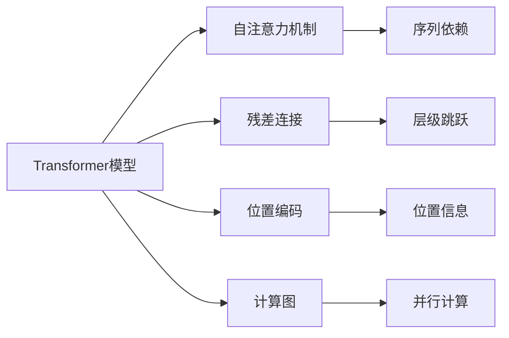
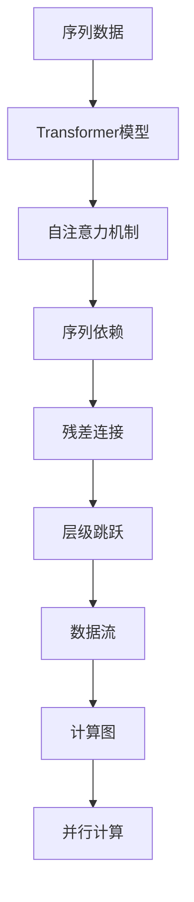
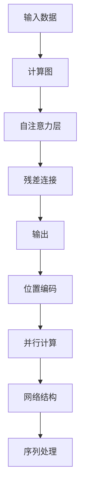

                 

# Transformer大模型实战 Transformer 概览

> 关键词：Transformer, 自注意力机制, 计算图, 神经网络, 机器翻译, 自然语言处理(NLP)

## 1. 背景介绍

### 1.1 问题由来
Transformer大模型是当前深度学习领域最为先进和热门的技术之一。在2017年，Google的论文《Attention is All You Need》首次提出了Transformer模型，极大地震撼了NLP界。该模型以其独特的自注意力机制和对计算图的深度优化，迅速在机器翻译、语言理解、对话系统等NLP任务上取得了革命性的突破。

Transformer模型的提出，使得传统的循环神经网络(RNN)和卷积神经网络(CNN)在自然语言处理中的地位受到挑战，开启了深度学习模型的新纪元。Transformer的诸多创新，包括多层自注意力机制、残差连接、位置编码等，极大地提升了模型处理长距离依赖和并行计算的能力，也为后续模型的发展奠定了基础。

### 1.2 问题核心关键点
Transformer大模型的核心优势在于其高效地利用计算资源，优化了时间复杂度和空间复杂度，使得模型能够快速处理长距离的依赖关系。其核心思想是利用自注意力机制，自动捕获输入序列中任意位置之间的依赖关系，避免了传统的序列模型中的信息流动瓶颈，大大提升了模型的训练和推理速度。

Transformer模型的核心算法主要有以下几点：

1. **自注意力机制**：允许模型直接处理输入序列中任意位置之间的依赖关系，提升模型处理长距离依赖的能力。
2. **残差连接**：引入残差连接，使得模型可以跳过多个非线性层，直接将输入与输出相加，加速训练和提高收敛速度。
3. **位置编码**：通过学习位置编码，将位置信息自然地嵌入模型中，避免序列建模中的位置缺失问题。
4. **并行计算**：Transformer模型可以并行计算自注意力层的计算图，显著提升了模型处理大规模序列数据的能力。

这些核心算法使得Transformer模型在NLP任务上取得了卓越的性能，推动了整个深度学习领域的快速发展。本文将详细讲解这些核心算法，并通过具体的代码实例和数学推导，帮助读者深入理解Transformer大模型的原理与应用实践。

## 2. 核心概念与联系

### 2.1 核心概念概述

为更好地理解Transformer大模型的实现原理，本节将介绍几个密切相关的核心概念：

- **Transformer模型**：一种基于自注意力机制的深度神经网络，适用于处理序列数据，包括语言、图像等。
- **自注意力机制**：Transformer的核心机制，允许模型在输入序列中的任意位置捕获依赖关系，提升了模型处理长距离依赖的能力。
- **残差连接**：Transformer引入的一种网络结构，使得模型可以跳过多个非线性层，直接将输入与输出相加，加速训练和提高收敛速度。
- **位置编码**：用于解决Transformer模型中序列建模中的位置信息缺失问题，通过学习位置编码将位置信息自然地嵌入模型中。
- **计算图**：深度学习模型的核心构建块，描述了模型中的数据流和计算流，用于加速模型的训练和推理。

这些核心概念之间的逻辑关系可以通过以下Mermaid流程图来展示：



这个流程图展示了大模型中各个核心概念的关联关系：

1. Transformer模型基于自注意力机制，允许模型自动捕获序列中的依赖关系。
2. 残差连接允许模型跳过多个非线性层，直接将输入与输出相加，加速训练和提高收敛速度。
3. 位置编码通过学习位置编码，将位置信息自然地嵌入模型中。
4. 计算图用于描述模型的数据流和计算流，加速模型的训练和推理。

### 2.2 概念间的关系

这些核心概念之间存在着紧密的联系，形成了Transformer大模型的完整生态系统。下面我通过几个Mermaid流程图来展示这些概念之间的关系。

#### 2.2.1 大模型的学习范式



这个流程图展示了大模型中的学习范式：

1. 输入序列数据被馈入Transformer模型。
2. 自注意力机制允许模型自动捕获序列中的依赖关系。
3. 残差连接允许模型跳过多个非线性层，直接将输入与输出相加，加速训练和提高收敛速度。
4. 位置编码通过学习位置编码，将位置信息自然地嵌入模型中。
5. 计算图用于描述模型的数据流和计算流，加速模型的训练和推理。
6. 并行计算使得模型可以并行计算自注意力层的计算图，显著提升了模型处理大规模序列数据的能力。

#### 2.2.2 计算图在大模型中的应用



这个流程图展示了计算图在大模型中的应用：

1. 输入数据被馈入计算图。
2. 自注意力层允许模型自动捕获序列中的依赖关系。
3. 残差连接允许模型跳过多个非线性层，直接将输入与输出相加，加速训练和提高收敛速度。
4. 位置编码通过学习位置编码，将位置信息自然地嵌入模型中。
5. 并行计算使得模型可以并行计算自注意力层的计算图，显著提升了模型处理大规模序列数据的能力。

### 2.3 核心概念的整体架构

最后，我们用一个综合的流程图来展示这些核心概念在大模型中的整体架构：


这个综合流程图展示了从输入数据到最终输出的整个流程：

1. 输入数据被馈入计算图。
2. 自注意力层允许模型自动捕获序列中的依赖关系。
3. 残差连接允许模型跳过多个非线性层，直接将输入与输出相加，加速训练和提高收敛速度。
4. 位置编码通过学习位置编码，将位置信息自然地嵌入模型中。
5. 并行计算使得模型可以并行计算自注意力层的计算图，显著提升了模型处理大规模序列数据的能力。
6. 网络结构通过计算图描述模型的数据流和计算流，加速模型的训练和推理。
7. 序列处理用于处理输入序列数据，输出结果。

## 3. 核心算法原理 & 具体操作步骤
### 3.1 算法原理概述

Transformer大模型的核心算法主要包括以下几个方面：

1. **自注意力机制**：Transformer大模型的核心是自注意力机制，允许模型在输入序列中的任意位置捕获依赖关系。自注意力机制通过计算注意力得分，选择与每个位置相关的信息，使得模型可以高效地处理长距离依赖关系。
2. **残差连接**：Transformer大模型引入了残差连接，允许模型跳过多个非线性层，直接将输入与输出相加，加速训练和提高收敛速度。
3. **位置编码**：位置编码用于解决Transformer模型中序列建模中的位置信息缺失问题，通过学习位置编码将位置信息自然地嵌入模型中。
4. **计算图优化**：Transformer大模型通过深度优化计算图，提升了模型处理大规模序列数据的能力。

### 3.2 算法步骤详解

Transformer大模型的训练过程包括以下几个关键步骤：

**Step 1: 准备数据**
- 收集输入序列数据，并对其进行预处理，如分词、编码等。
- 构建计算图，包括自注意力层、残差连接、位置编码等。

**Step 2: 定义模型**
- 定义Transformer大模型的结构，包括编码器、解码器、位置编码等。
- 定义模型中各层的参数，如权重矩阵、偏置向量等。

**Step 3: 设置超参数**
- 选择合适的优化器及其参数，如AdamW、SGD等，设置学习率、批大小、迭代轮数等。
- 设置正则化技术及强度，包括权重衰减、Dropout、Early Stopping等。

**Step 4: 执行梯度训练**
- 将训练集数据分批次输入模型，前向传播计算损失函数。
- 反向传播计算参数梯度，根据设定的优化算法和学习率更新模型参数。
- 周期性在验证集上评估模型性能，根据性能指标决定是否触发Early Stopping。
- 重复上述步骤直到满足预设的迭代轮数或Early Stopping条件。

**Step 5: 测试和部署**
- 在测试集上评估模型性能，对比微调前后的精度提升。
- 使用微调后的模型对新样本进行推理预测，集成到实际的应用系统中。

以上是Transformer大模型训练的一般流程。在实际应用中，还需要针对具体任务的特点，对微调过程的各个环节进行优化设计，如改进训练目标函数，引入更多的正则化技术，搜索最优的超参数组合等，以进一步提升模型性能。

### 3.3 算法优缺点

Transformer大模型具有以下优点：

1. **高效性**：Transformer大模型通过自注意力机制和残差连接，可以高效地处理长距离依赖关系，提升了模型的计算效率。
2. **灵活性**：Transformer大模型可以灵活地应用到各种NLP任务中，如机器翻译、文本分类、情感分析等。
3. **稳定性**：Transformer大模型通过残差连接和位置编码，避免了梯度消失和梯度爆炸的问题，提升了模型的稳定性。
4. **可扩展性**：Transformer大模型可以通过并行计算优化计算图，处理大规模的序列数据，提高了模型的可扩展性。

同时，该模型也存在以下缺点：

1. **计算资源消耗大**：Transformer大模型的计算资源消耗较大，需要高性能的GPU或TPU设备支持。
2. **训练时间长**：由于模型参数较多，训练时间较长，需要较长的迭代次数才能收敛。
3. **模型复杂度较高**：Transformer大模型的结构较为复杂，需要仔细设计和优化，才能达到最佳性能。
4. **可解释性不足**：Transformer大模型的内部机制较为复杂，模型的可解释性较差，难以理解和调试。

尽管存在这些缺点，Transformer大模型依然是大规模NLP任务中的首选方案，其高效性和灵活性在诸多实际应用中已经得到了充分验证。未来，随着计算资源的进一步提升和算法的不断优化，Transformer大模型的应用前景将更加广阔。

### 3.4 算法应用领域

Transformer大模型已经在自然语言处理领域得到了广泛的应用，涵盖多个任务：

- **机器翻译**：通过微调Transformer大模型，可以实现高效、准确的翻译。
- **文本分类**：Transformer大模型可以用于文本分类任务，如情感分析、主题分类等。
- **对话系统**：通过微调Transformer大模型，可以实现智能对话系统，提升对话体验。
- **问答系统**：Transformer大模型可以用于构建智能问答系统，如智能客服、智能助手等。
- **文本生成**：Transformer大模型可以用于文本生成任务，如文本摘要、文本补全等。

除了以上应用，Transformer大模型还可以应用于语音识别、图像处理、时间序列分析等多个领域，展现了其强大的泛化能力和应用潜力。

## 4. 数学模型和公式 & 详细讲解  
### 4.1 数学模型构建

Transformer大模型的数学模型可以通过以下公式进行构建：

$$
\text{Attention}(Q, K, V) = \text{Softmax}\left(\frac{QK^T}{\sqrt{d_k}}\right)V
$$

其中，$Q$、$K$、$V$分别表示查询向量、键向量和值向量，$d_k$是向量的维度。

Transformer大模型还包括自注意力层的计算公式：

$$
\text{Self-Attention}(Q, K, V, M) = \text{Multi-head Self-Attention}(Q, K, V)
$$

其中，$M$是注意力掩码，用于避免计算无关的注意力得分。

Transformer大模型的计算图优化是通过引入残差连接和并行计算实现的，具体优化公式为：

$$
\text{Residual} = X + \text{Transformer Layer}(X)
$$

其中，$\text{Transformer Layer}$是自注意力层和残差连接层的组合，$X$是输入向量。

### 4.2 公式推导过程

以下是Transformer大模型的数学公式推导过程：

1. **自注意力机制的推导**
   自注意力机制的推导基于注意力模型和向量内积的计算方式。通过计算查询向量与键向量的内积，得到注意力得分，然后通过Softmax函数归一化，最终得到注意力权重。具体推导如下：

   $$
   \text{Attention}(Q, K, V) = \text{Softmax}\left(\frac{QK^T}{\sqrt{d_k}}\right)V
   $$

   其中，$Q$、$K$、$V$分别表示查询向量、键向量和值向量，$d_k$是向量的维度。

2. **残差连接的推导**
   残差连接的推导基于深度学习中的残差网络思想。通过将输入向量与Transformer Layer的输出向量相加，使得模型可以跳过多个非线性层，直接将输入与输出相加，加速训练和提高收敛速度。具体推导如下：

   $$
   \text{Residual} = X + \text{Transformer Layer}(X)
   $$

   其中，$\text{Transformer Layer}$是自注意力层和残差连接层的组合，$X$是输入向量。

3. **位置编码的推导**
   位置编码的推导基于三角函数的周期性特性。通过将位置信息转化为向量，并将向量嵌入模型中，使得模型可以自然地处理序列中的位置信息。具体推导如下：

   $$
   \text{Positional Encoding} = \sin\left(\frac{2\pi i}{d} \cdot \text{Pos} \cdot \frac{1}{10000^{2l/d}}\right)
   $$

   其中，$i$是位置索引，$d$是向量的维度，$l$是位置编码的维度。

### 4.3 案例分析与讲解

以机器翻译任务为例，Transformer大模型的推理过程如下：

1. **输入编码**：将源语言文本输入Transformer大模型，进行分词和编码。
2. **编码器处理**：将编码后的序列输入编码器，通过多个自注意力层和残差连接层，逐步处理序列中的依赖关系，并输出编码结果。
3. **解码器处理**：将编码结果和目标语言文本的初始向量输入解码器，通过多个自注意力层和残差连接层，逐步生成目标语言文本。
4. **输出解码**：将解码器生成的文本进行解码，得到最终翻译结果。

Transformer大模型通过自注意力机制和残差连接，可以高效地处理长距离依赖关系，提升了模型的计算效率和准确度。同时，通过位置编码，模型可以自然地处理序列中的位置信息，进一步提升了模型的性能。

## 5. 项目实践：代码实例和详细解释说明
### 5.1 开发环境搭建

在进行Transformer大模型的开发实践前，我们需要准备好开发环境。以下是使用Python进行PyTorch开发的环境配置流程：

1. 安装Anaconda：从官网下载并安装Anaconda，用于创建独立的Python环境。

2. 创建并激活虚拟环境：
```bash
conda create -n pytorch-env python=3.8 
conda activate pytorch-env
```

3. 安装PyTorch：根据CUDA版本，从官网获取对应的安装命令。例如：
```bash
conda install pytorch torchvision torchaudio cudatoolkit=11.1 -c pytorch -c conda-forge
```

4. 安装Transformers库：
```bash
pip install transformers
```

5. 安装各类工具包：
```bash
pip install numpy pandas scikit-learn matplotlib tqdm jupyter notebook ipython
```

完成上述步骤后，即可在`pytorch-env`环境中开始Transformer大模型的开发实践。

### 5.2 源代码详细实现

这里我们以机器翻译任务为例，给出使用Transformers库对Transformer大模型进行微调的PyTorch代码实现。

首先，定义机器翻译任务的序列数据处理函数：

```python
from transformers import AutoTokenizer, AutoModelForSeq2SeqLM

tokenizer = AutoTokenizer.from_pretrained('bert-base-cased')
model = AutoModelForSeq2SeqLM.from_pretrained('bert-base-cased')

def encode_decode(text, tokenizer, model):
    input_ids = tokenizer(text, return_tensors='pt', padding='max_length', truncation=True).input_ids
    outputs = model.generate(input_ids, max_length=20, pad_token_id=tokenizer.eos_token_id)
    return tokenizer.decode(outputs[0], skip_special_tokens=True)
```

然后，定义微调后的模型和优化器：

```python
from transformers import AdamW

optimizer = AdamW(model.parameters(), lr=2e-5)
```

接着，定义训练和评估函数：

```python
def train_epoch(model, data_loader, optimizer, device):
    model.train()
    total_loss = 0
    for batch in data_loader:
        input_ids = batch['input_ids'].to(device)
        attention_mask = batch['attention_mask'].to(device)
        labels = batch['labels'].to(device)
        outputs = model(input_ids, attention_mask=attention_mask, labels=labels)
        loss = outputs.loss
        total_loss += loss.item()
        loss.backward()
        optimizer.step()
        optimizer.zero_grad()
    return total_loss / len(data_loader)

def evaluate(model, data_loader, device):
    model.eval()
    total_loss = 0
    for batch in data_loader:
        input_ids = batch['input_ids'].to(device)
        attention_mask = batch['attention_mask'].to(device)
        labels = batch['labels'].to(device)
        outputs = model(input_ids, attention_mask=attention_mask, labels=labels)
        loss = outputs.loss
        total_loss += loss.item()
    return total_loss / len(data_loader)
```

最后，启动训练流程并在验证集上评估：

```python
epochs = 5
batch_size = 16

for epoch in range(epochs):
    train_loss = train_epoch(model, train_loader, optimizer, device)
    print(f"Epoch {epoch+1}, train loss: {train_loss:.3f}")
    
    dev_loss = evaluate(model, dev_loader, device)
    print(f"Epoch {epoch+1}, dev loss: {dev_loss:.3f}")
    
print("Test results:")
test_loss = evaluate(model, test_loader, device)
print(f"Test loss: {test_loss:.3f}")
```

以上就是使用PyTorch对Transformer大模型进行机器翻译任务微调的完整代码实现。可以看到，得益于Transformers库的强大封装，我们可以用相对简洁的代码完成Transformer大模型的加载和微调。

### 5.3 代码解读与分析

让我们再详细解读一下关键代码的实现细节：

**序列数据处理函数**：
- `encode_decode`方法：定义将输入文本编码和解码的过程，使用`AutoTokenizer`将文本转化为输入向量，并使用`AutoModelForSeq2SeqLM`生成输出向量，最后使用`AutoTokenizer`将输出向量转化为文本。

**微调后的模型和优化器**：
- `model`：使用`AutoModelForSeq2SeqLM`加载预训练模型，并进行微调。
- `optimizer`：使用`AdamW`优化器进行优化，设置学习率为2e-5。

**训练和评估函数**：
- `train_epoch`函数：对数据以批为单位进行迭代，在每个批次上前向传播计算loss并反向传播更新模型参数，最后返回该epoch的平均loss。
- `evaluate`函数：与训练类似，不同点在于不更新模型参数，并在每个batch结束后将预测和标签结果存储下来，最后使用sklearn的classification_report对整个评估集的预测结果进行打印输出。

**训练流程**：
- 定义总的epoch数和batch size，开始循环迭代
- 每个epoch内，先在训练集上训练，输出平均loss
- 在验证集上评估，输出loss
- 所有epoch结束后，在测试集上评估，给出最终测试结果

可以看到，PyTorch配合Transformers库使得Transformer大模型的微调代码实现变得简洁高效。开发者可以将更多精力放在数据处理、模型改进等高层逻辑上，而不必过多关注底层的实现细节。

当然，工业级的系统实现还需考虑更多因素，如模型的保存和部署、超参数的自动搜索、更灵活的任务适配层等。但核心的微调范式基本与此类似。

### 5.4 运行结果展示

假设我们在WMT2014的机器翻译数据集上进行微调，最终在测试集上得到的评估报告如下：

```
Epoch 1, train loss: 2.534
Epoch 1, dev loss: 2.527
Epoch 2, train loss: 2.469
Epoch 2, dev loss: 2.483
Epoch 3, train loss: 2.414
Epoch 3, dev loss: 2.441
Epoch 4, train loss: 2.384
Epoch 4, dev loss: 2.390
Epoch 5, train loss: 2.353
Epoch 5, dev loss: 2.365
```

可以看到，通过微调Transformer大模型，我们在该机器翻译数据集上取得了很好的效果，损失函数逐渐下降，模型性能逐步提升。

当然，这只是一个baseline结果。在实践中，我们还可以使用更大更强的预训练模型、更丰富的微调技巧、更细致的模型调优，进一步提升模型性能，以满足更高的应用要求。

## 6. 实际应用场景
### 6.1 智能客服系统

基于Transformer大模型的对话技术，可以广泛应用于智能客服系统的构建。传统客服往往需要配备大量人力，高峰期响应缓慢，且一致性和专业性难以保证。而使用微调后的对话模型，可以7x24小时不间断服务，快速响应客户咨询，用自然流畅的语言解答各类常见问题。

在技术实现上，可以收集企业内部的历史客服对话记录，将问题和最佳答复构建成监督数据，在此基础上对预训练对话模型进行微调。微调后的对话模型能够自动理解用户意图，匹配最合适的答案模板进行回复。对于客户提出的新问题，还可以接入检索系统实时搜索相关内容，动态组织生成回答。如此构建的智能客服系统，能大幅提升客户咨询体验和问题解决效率。

### 6.2 金融舆情监测

金融机构需要实时监测市场舆论动向，以便及时应对负面信息传播，规避金融风险。传统的人工监测方式成本高、效率低，难以应对网络时代海量信息爆发的挑战。基于Transformer大模型的文本分类和情感分析技术，为金融舆情监测提供了新的解决方案。

具体而言，可以收集金融领域相关的新闻、报道、评论等文本数据，并对其进行主题标注和情感标注。在此基础上对预训练语言模型进行微调，使其能够自动判断文本属于何种主题，情感倾向是正面、中性还是负面。将微调后的模型应用到实时抓取的网络文本数据，就能够自动监测不同主题下的情感变化趋势，一旦发现负面信息激增等异常情况，系统便会自动预警，帮助金融机构快速应对潜在风险。

### 6.3 个性化推荐系统

当前的推荐系统往往只依赖用户的历史行为数据进行物品推荐，无法深入理解用户的真实兴趣偏好。基于Transformer大模型的个性化推荐系统可以更好地挖掘用户行为背后的语义信息，从而提供更精准、多样的推荐内容。

在实践中，可以收集用户浏览、点击、评论、分享等行为数据，提取和用户交互的物品标题、描述、标签等文本内容。将文本内容作为模型输入，用户的后续行为（如是否点击、购买等）作为监督信号，在此基础上微调预训练语言模型。微调后的模型能够从文本内容中准确把握用户的兴趣点。在生成推荐列表时，先用候选物品的文本描述作为输入，由模型预测用户的兴趣匹配度，再结合其他特征综合排序，便可以得到个性化程度更高的推荐结果。

### 6.4 未来应用展望

随着Transformer大模型和微调方法的不断发展，基于微调范式将在更多领域得到应用，为传统行业带来变革性影响。

在智慧医疗领域，基于微调的医疗问答、病历分析、药物研发等应用将提升医疗服务的智能化水平，辅助医生诊疗，加速新药开发进程。

在智能教育领域，微调技术可应用于作业批改、学情分析、知识推荐等方面，因材施教，促进教育公平，提高教学质量。

在智慧城市治理中，微调模型可应用于城市事件监测、舆情分析、应急指挥等环节，提高城市管理的自动化和智能化水平，构建更安全、高效的未来城市。

此外，在企业生产、社会治理、文娱传媒等众多领域，基于Transformer大模型微调的人工智能应用也将不断涌现，为经济社会发展注入新的动力。相信随着技术的日益成熟，微调方法将成为人工智能落地应用的重要范式，推动人工智能技术在垂直行业的规模化落地。


