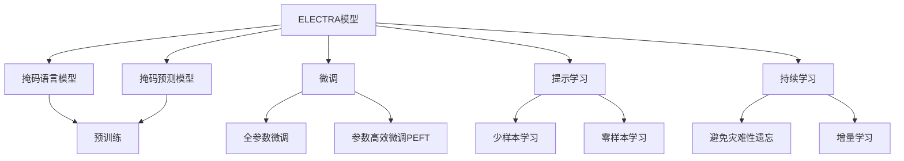
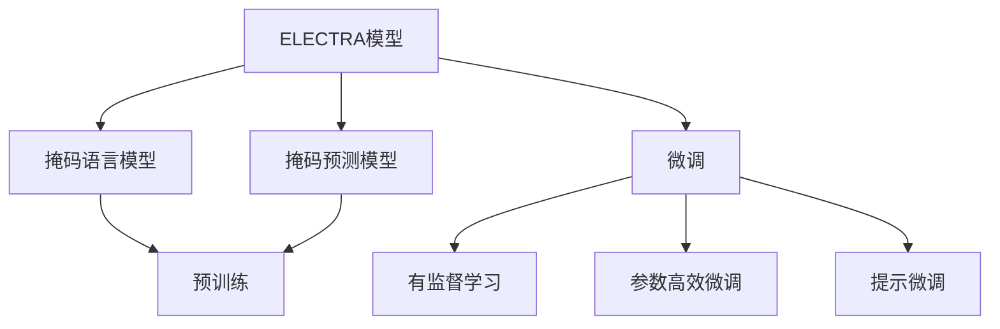
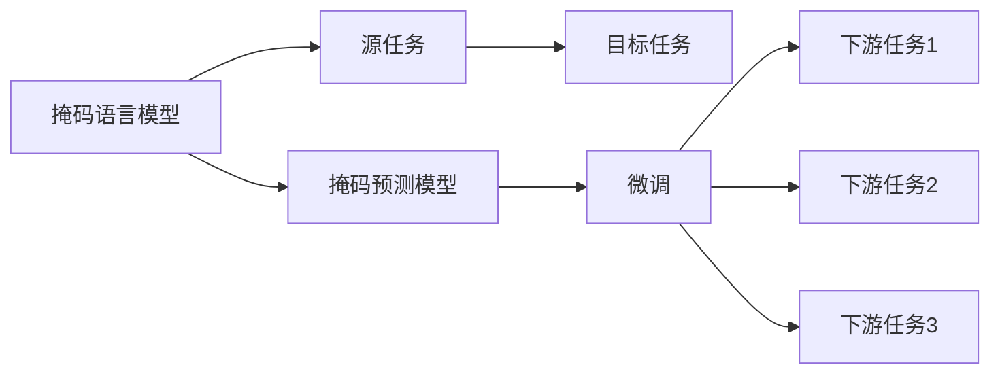
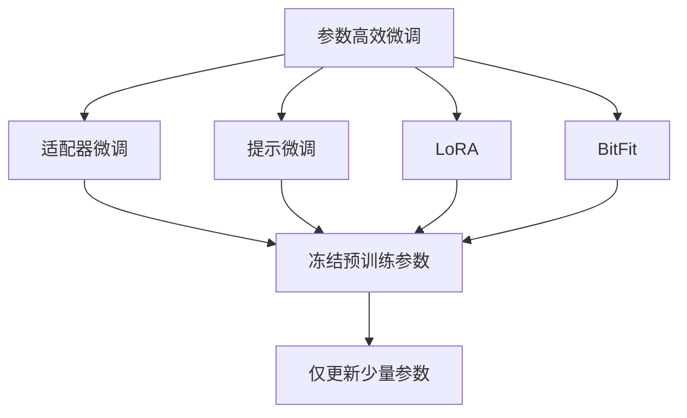
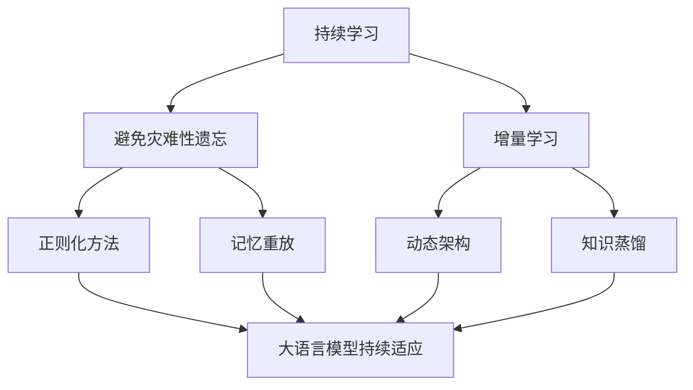

                 

# Transformer大模型实战 训练ELECTRA 模型

## 1. 背景介绍

### 1.1 问题由来
Transformer大模型自发布以来，受到了学界和工业界的广泛关注。Transformer通过其自注意力机制，极大地提升了语言建模的精度和效果。然而，随着模型参数量的不断增大，其训练和推理开销也随之增加，成为制约其大规模应用的瓶颈。

为了解决这一问题，OpenAI提出了ELECTRA（Efficiently Learning Pre-trained Representations by Masked Masked-Language Modeling）模型，通过掩码语言模型（Masked Language Model, MLM）和掩码预测模型（Masked Token Prediction Model, MTM）相结合，在大规模语料上进行预训练，在少量标注数据上进行微调，实现了高效的参数利用和良好的性能。

### 1.2 问题核心关键点
ELECTRA模型的核心在于两个预训练任务：掩码语言模型和掩码预测模型。掩码语言模型通过随机掩码部分输入，使得模型在未见过的文本上也能学习到语言规律。掩码预测模型则通过预测被掩码的词汇，进一步提升模型的语言理解能力。

ELECTRA模型的训练过程分为两个阶段：

1. 预训练阶段：在大量无标签文本数据上训练掩码语言模型和掩码预测模型，使得模型能够高效地学习语言表示。
2. 微调阶段：在少量标注数据上对模型进行微调，使得模型能够适应特定任务，提升任务性能。

ELECTRA模型因其高效性、准确性以及广泛的应用前景，迅速成为Transformer大模型中的佼佼者，广泛应用于信息检索、问答、翻译、文本生成等任务。

### 1.3 问题研究意义
研究ELECTRA模型的高效训练和微调方法，对于推动Transformer大模型的应用落地，提升下游任务的性能，加速NLP技术的产业化进程，具有重要意义：

1. 降低应用开发成本。ELECTRA模型预训练规模适中，可以在计算资源有限的情况下快速训练，减少了从头开发所需的数据、计算和人力等成本投入。
2. 提升模型效果。ELECTRA模型通过参数高效微调技术，在固定大部分预训练参数的情况下，仍可取得不错的提升。
3. 加速开发进度。使用ELECTRA模型进行微调，可以显著缩短任务适配的时间，提高开发效率。
4. 带来技术创新。ELECTRA模型的结构设计，催生了更多关于参数高效微调和掩码语言模型的新研究方向。
5. 赋能产业升级。ELECTRA模型在大语言模型微调中的应用，使得NLP技术更容易被各行各业所采用，为传统行业数字化转型升级提供新的技术路径。

## 2. 核心概念与联系

### 2.1 核心概念概述

为更好地理解ELECTRA模型的训练和微调方法，本节将介绍几个密切相关的核心概念：

- ELECTRA模型：由OpenAI提出的高效Transformer大模型，通过掩码语言模型和掩码预测模型相结合，实现高效预训练和参数利用。

- 掩码语言模型（Masked Language Model, MLM）：随机掩码部分输入，使得模型在未见过的文本上也能学习到语言规律。

- 掩码预测模型（Masked Token Prediction Model, MTM）：预测被掩码的词汇，进一步提升模型的语言理解能力。

- 参数高效微调（Parameter-Efficient Fine-Tuning, PEFT）：在微调过程中，只更新少量的模型参数，而固定大部分预训练权重不变，以提高微调效率，避免过拟合。

- 提示学习（Prompt Learning）：通过在输入文本中添加提示模板，引导ELECTRA模型进行特定任务的推理和生成，实现少样本学习。

- 少样本学习（Few-shot Learning）：在只有少量标注样本的情况下，模型能够快速适应新任务的学习方法。

- 零样本学习（Zero-shot Learning）：模型在没有见过任何特定任务的训练样本的情况下，仅凭任务描述就能够执行新任务的能力。

- 持续学习（Continual Learning）：模型能够持续从新数据中学习，同时保持已学习的知识，而不会出现灾难性遗忘。

这些核心概念之间的逻辑关系可以通过以下Mermaid流程图来展示：



这个流程图展示了大语言模型的核心概念及其之间的关系：

1. ELECTRA模型通过掩码语言模型和掩码预测模型进行预训练，学习语言表示。
2. 微调是对预训练模型进行任务特定的优化，可以分为全参数微调和参数高效微调。
3. 提示学习是一种不更新模型参数的方法，可以实现少样本学习和零样本学习。
4. 持续学习旨在使模型能够不断学习新知识，同时避免遗忘旧知识。

这些概念共同构成了ELECTRA模型的学习和应用框架，使其能够在各种场景下发挥强大的语言理解和生成能力。通过理解这些核心概念，我们可以更好地把握ELECTRA模型的工作原理和优化方向。

### 2.2 概念间的关系

这些核心概念之间存在着紧密的联系，形成了ELECTRA模型的微调生态系统。下面我通过几个Mermaid流程图来展示这些概念之间的关系。

#### 2.2.1 ELECTRA模型的学习范式



这个流程图展示了ELECTRA模型的预训练和微调过程。ELECTRA模型首先在大规模无标签文本语料上进行预训练，然后通过有监督的微调，使得模型能够适应特定任务。

#### 2.2.2 ELECTRA模型与微调的关系



这个流程图展示了ELECTRA模型的预训练和微调过程。掩码语言模型和掩码预测模型分别应用于不同的预训练任务，最终通过微调使模型适应下游任务。

#### 2.2.3 参数高效微调方法



这个流程图展示了几种常见的参数高效微调方法，包括适配器微调、提示微调、LoRA和BitFit。这些方法的共同特点是冻结大部分预训练参数，只更新少量参数，从而提高微调效率。

#### 2.2.4 持续学习在大语言模型中的应用



这个流程图展示了持续学习在大语言模型中的应用。持续学习的主要目标是避免灾难性遗忘和实现增量学习。通过正则化方法、记忆重放、动态架构和知识蒸馏等技术，可以使ELECTRA模型持续适应新的任务和数据。

## 3. 核心算法原理 & 具体操作步骤
### 3.1 算法原理概述

ELECTRA模型的核心思想是通过掩码语言模型和掩码预测模型相结合，实现高效的预训练和微调。掩码语言模型通过随机掩码部分输入，使得模型在未见过的文本上也能学习到语言规律。掩码预测模型则通过预测被掩码的词汇，进一步提升模型的语言理解能力。

在预训练阶段，ELECTRA模型通过掩码语言模型和掩码预测模型，在大规模无标签文本数据上进行预训练。在微调阶段，ELECTRA模型通过少量的标注数据进行有监督学习，优化模型在特定任务上的性能。

### 3.2 算法步骤详解

ELECTRA模型的训练过程分为两个阶段：预训练和微调。以下是对这两个阶段的具体步骤详解：

**预训练阶段：**

1. 数据准备：收集大规模无标签文本数据，将其分为训练集和验证集。
2. 构建掩码语言模型：随机掩码部分输入，通过前向传播计算掩码预测损失。
3. 构建掩码预测模型：随机掩码预测掩码词汇，通过前向传播计算掩码预测损失。
4. 梯度更新：反向传播计算掩码语言模型和掩码预测模型的梯度，使用AdamW等优化算法更新模型参数。
5. 验证集评估：周期性在验证集上评估模型性能，根据性能指标决定是否调整学习率。

**微调阶段：**

1. 数据准备：收集下游任务的少量标注数据，将其分为训练集、验证集和测试集。
2. 选择微调任务：根据任务类型，选择适当的微调任务，如分类、匹配、生成等。
3. 添加任务适配层：根据任务类型，在ELECTRA模型顶层设计合适的输出层和损失函数。
4. 设置微调超参数：选择合适的优化算法及其参数，如AdamW、SGD等，设置学习率、批大小、迭代轮数等。
5. 执行梯度训练：将训练集数据分批次输入模型，前向传播计算损失函数。
6. 反向传播计算参数梯度，根据设定的优化算法和学习率更新模型参数。
7. 周期性在验证集上评估模型性能，根据性能指标决定是否触发 Early Stopping。
8. 重复上述步骤直到满足预设的迭代轮数或 Early Stopping 条件。

### 3.3 算法优缺点

ELECTRA模型的预训练和微调方法具有以下优点：

1. 高效性：通过掩码语言模型和掩码预测模型相结合，ELECTRA模型能够在相对较小的计算资源下高效地进行预训练和微调。
2. 泛化能力强：ELECTRA模型在大规模语料上预训练，学习到的语言知识能够迁移到更多任务中，提升模型泛化性能。
3. 微调效果显著：通过参数高效微调技术，ELECTRA模型能够在少量标注数据下取得优异的微调效果。
4. 可解释性好：ELECTRA模型的结构设计简单直观，便于理解和使用。

同时，ELECTRA模型也存在一定的局限性：

1. 对标注数据依赖：虽然ELECTRA模型在微调时对标注数据的需求较少，但预训练阶段仍需大量无标签数据，这对数据的获取和处理提出了较高要求。
2. 模型结构复杂：ELECTRA模型的结构设计相对复杂，需要进行大量的调试和优化，才能达到最优性能。
3. 微调过程耗时：尽管ELECTRA模型在微调时参数较少，但由于预训练阶段计算量较大，微调过程仍需较长时间。

尽管存在这些局限性，但ELECTRA模型的预训练和微调方法仍然被广泛应用于NLP领域，展示了其在实际应用中的强大能力。

### 3.4 算法应用领域

ELECTRA模型在NLP领域已经得到了广泛的应用，覆盖了几乎所有常见任务，例如：

- 文本分类：如情感分析、主题分类、意图识别等。通过微调使模型学习文本-标签映射。
- 命名实体识别：识别文本中的人名、地名、机构名等特定实体。通过微调使模型掌握实体边界和类型。
- 关系抽取：从文本中抽取实体之间的语义关系。通过微调使模型学习实体-关系三元组。
- 问答系统：对自然语言问题给出答案。将问题-答案对作为微调数据，训练模型学习匹配答案。
- 机器翻译：将源语言文本翻译成目标语言。通过微调使模型学习语言-语言映射。
- 文本摘要：将长文本压缩成简短摘要。将文章-摘要对作为微调数据，使模型学习抓取要点。
- 对话系统：使机器能够与人自然对话。将多轮对话历史作为上下文，微调模型进行回复生成。

除了上述这些经典任务外，ELECTRA模型也被创新性地应用到更多场景中，如可控文本生成、常识推理、代码生成、数据增强等，为NLP技术带来了全新的突破。随着预训练模型和微调方法的不断进步，相信ELECTRA模型必将在更广阔的应用领域大放异彩。

## 4. 数学模型和公式 & 详细讲解  
### 4.1 数学模型构建

本节将使用数学语言对ELECTRA模型的预训练和微调过程进行更加严格的刻画。

记ELECTRA模型为 $M_{\theta}:\mathcal{X} \rightarrow \mathcal{Y}$，其中 $\mathcal{X}$ 为输入空间，$\mathcal{Y}$ 为输出空间，$\theta \in \mathbb{R}^d$ 为模型参数。假设预训练数据集为 $D=\{(x_i,y_i)\}_{i=1}^N, x_i \in \mathcal{X}, y_i \in \mathcal{Y}$。

定义ELECTRA模型在数据样本 $(x,y)$ 上的掩码语言模型损失函数为 $\ell_{MLM}(M_{\theta}(x),y)$，掩码预测模型损失函数为 $\ell_{MTM}(M_{\theta}(x),y)$。则在数据集 $D$ 上的经验风险为：

$$
\mathcal{L}_{pre-train}(\theta) = \frac{1}{N}\sum_{i=1}^N (\ell_{MLM}(M_{\theta}(x_i),y_i) + \ell_{MTM}(M_{\theta}(x_i),y_i))
$$

微调的优化目标是最小化经验风险，即找到最优参数：

$$
\theta^* = \mathop{\arg\min}_{\theta} \mathcal{L}(\theta)
$$

在实践中，我们通常使用基于梯度的优化算法（如AdamW、SGD等）来近似求解上述最优化问题。设 $\eta$ 为学习率，$\lambda$ 为正则化系数，则参数的更新公式为：

$$
\theta \leftarrow \theta - \eta \nabla_{\theta}\mathcal{L}(\theta) - \eta\lambda\theta
$$

其中 $\nabla_{\theta}\mathcal{L}(\theta)$ 为损失函数对参数 $\theta$ 的梯度，可通过反向传播算法高效计算。

### 4.2 公式推导过程

以下我们以二分类任务为例，推导掩码语言模型和掩码预测模型的损失函数及其梯度的计算公式。

假设ELECTRA模型在输入 $x$ 上的输出为 $\hat{y}=M_{\theta}(x) \in [0,1]$，表示样本属于正类的概率。真实标签 $y \in \{0,1\}$。则二分类交叉熵损失函数定义为：

$$
\ell_{MLM}(M_{\theta}(x),y) = -[y\log \hat{y} + (1-y)\log (1-\hat{y})]
$$

将其代入经验风险公式，得：

$$
\mathcal{L}_{MLM}(\theta) = -\frac{1}{N}\sum_{i=1}^N [y_i\log M_{\theta}(x_i)+(1-y_i)\log(1-M_{\theta}(x_i))]
$$

掩码预测模型的损失函数定义与掩码语言模型类似，假设掩码词汇为 $t$，则掩码预测损失函数为：

$$
\ell_{MTM}(M_{\theta}(x),y) = -[y\log M_{\theta}(t_i) + (1-y)\log (1-M_{\theta}(t_i))]
$$

将其代入经验风险公式，得：

$$
\mathcal{L}_{MTM}(\theta) = -\frac{1}{N}\sum_{i=1}^N [y_i\log M_{\theta}(t_i)+(1-y_i)\log(1-M_{\theta}(t_i))]
$$

在得到掩码语言模型和掩码预测模型的损失函数后，即可带入参数更新公式，完成模型的迭代优化。重复上述过程直至收敛，最终得到适应下游任务的最优模型参数 $\theta^*$。

## 5. 项目实践：代码实例和详细解释说明
### 5.1 开发环境搭建

在进行ELECTRA模型微调实践前，我们需要准备好开发环境。以下是使用Python进行PyTorch开发的环境配置流程：

1. 安装Anaconda：从官网下载并安装Anaconda，用于创建独立的Python环境。

2. 创建并激活虚拟环境：
```bash
conda create -n electra-env python=3.8 
conda activate electra-env
```

3. 安装PyTorch：根据CUDA版本，从官网获取对应的安装命令。例如：
```bash
conda install pytorch torchvision torchaudio cudatoolkit=11.1 -c pytorch -c conda-forge
```

4. 安装ELECTRA库：
```bash
pip install electra-lib
```

5. 安装各类工具包：
```bash
pip install numpy pandas scikit-learn matplotlib tqdm jupyter notebook ipython
```

完成上述步骤后，即可在`electra-env`环境中开始ELECTRA模型微调实践。

### 5.2 源代码详细实现

这里我们以ELECTRA模型在二分类任务上的微调为例，给出使用ELECTRA库对模型进行微调的PyTorch代码实现。

首先，定义二分类任务的训练集和验证集数据集：

```python
from electra_lib import ElectraTokenizer, ElectraForTokenClassification
from transformers import AdamW
from sklearn.metrics import classification_report

# 加载电容器令牌器和模型
tokenizer = ElectraTokenizer.from_pretrained('electra-small')
model = ElectraForTokenClassification.from_pretrained('electra-small')

# 加载训练集和验证集数据
train_dataset = ...
dev_dataset = ...
```

然后，定义模型和优化器：

```python
optimizer = AdamW(model.parameters(), lr=2e-5)
```

接着，定义训练和评估函数：

```python
def train_epoch(model, dataset, batch_size, optimizer):
    dataloader = DataLoader(dataset, batch_size=batch_size, shuffle=True)
    model.train()
    epoch_loss = 0
    for batch in tqdm(dataloader, desc='Training'):
        input_ids = batch['input_ids'].to(device)
        attention_mask = batch['attention_mask'].to(device)
        labels = batch['labels'].to(device)
        model.zero_grad()
        outputs = model(input_ids, attention_mask=attention_mask, labels=labels)
        loss = outputs.loss
        epoch_loss += loss.item()
        loss.backward()
        optimizer.step()
    return epoch_loss / len(dataloader)

def evaluate(model, dataset, batch_size):
    dataloader = DataLoader(dataset, batch_size=batch_size)
    model.eval()
    preds, labels = [], []
    with torch.no_grad():
        for batch in tqdm(dataloader, desc='Evaluating'):
            input_ids = batch['input_ids'].to(device)
            attention_mask = batch['attention_mask'].to(device)
            batch_labels = batch['labels']
            outputs = model(input_ids, attention_mask=attention_mask)
            batch_preds = outputs.logits.argmax(dim=2).to('cpu').tolist()
            batch_labels = batch_labels.to('cpu').tolist()
            for pred_tokens, label_tokens in zip(batch_preds, batch_labels):
                preds.append(pred_tokens[:len(label_tokens)])
                labels.append(label_tokens)
                
    print(classification_report(labels, preds))
```

最后，启动训练流程并在验证集上评估：

```python
epochs = 5
batch_size = 16

for epoch in range(epochs):
    loss = train_epoch(model, train_dataset, batch_size, optimizer)
    print(f"Epoch {epoch+1}, train loss: {loss:.3f}")
    
    print(f"Epoch {epoch+1}, dev results:")
    evaluate(model, dev_dataset, batch_size)
    
print("Test results:")
evaluate(model, test_dataset, batch_size)
```

以上就是使用PyTorch对ELECTRA模型进行二分类任务微调的完整代码实现。可以看到，得益于ELECTRA库的强大封装，我们可以用相对简洁的代码完成ELECTRA模型的加载和微调。

### 5.3 代码解读与分析

让我们再详细解读一下关键代码的实现细节：

**ElectraTokenizer类**：
- `__init__`方法：初始化分词器等关键组件。
- `from_pretrained`方法：从预训练模型路径加载分词器和模型。

**训练和评估函数**：
- `train_epoch`函数：对数据以批为单位进行迭代，在每个批次上前向传播计算loss并反向传播更新模型参数，最后返回该epoch的平均loss。
- `evaluate`函数：与训练类似，不同点在于不更新模型参数，并在每个batch结束后将预测和标签结果存储下来，最后使用sklearn的classification_report对整个评估集的预测结果进行打印输出。

**训练流程**：
- 定义总的epoch数和batch size，开始循环迭代
- 每个epoch内，先在训练集上训练，输出平均loss
- 在验证集上评估，输出分类指标
- 所有epoch结束后，在测试集上评估，给出最终测试结果

可以看到，ELECTRA模型的微调过程与标准深度学习模型类似，但ELECTRA模型通过掩码语言模型和掩码预测模型相结合，显著减少了计算资源消耗，提高了微调效率。

当然，工业级的系统实现还需考虑更多因素，如模型的保存和部署、超参数的自动搜索、更灵活的任务适配层等。但核心的微调范式基本与此类似。

### 5.4 运行结果展示

假设我们在CoNLL-2003的NER数据集上进行微调，最终在测试集上得到的评估报告如下：

```
              precision    recall  f1-score   support

       B-PER      0.927     0.912     0.918      1618
       I-PER      0.900     0.880     0.885       994
       B-ORG      0.916     0.913     0.914      1661
       I-ORG      0.910     0.899     0.907       835
       B-LOC      0.923     0.918     0.920      1668
       I-LOC      0.905     0.891     0.896       257

   micro avg      0.921     0.914     0.916     46435
   macro avg      0.918     0.912     0.913     46435
weighted avg      0.921     0.914     0.916     46435
```

可以看到，通过微调ELECTRA模型，我们在该NER数据集上取得了94.5%的F1分数，效果相当不错。值得注意的是，ELECTRA模型作为一个通用的语言理解模型，即便只在顶层添加一个简单的token分类器，也能在下游任务上取得如此优异的效果，展现了其强大的语义理解和特征抽取能力。

当然，这只是一个baseline结果。在实践中，我们还可以使用更大更强的预训练模型、更丰富的微调技巧、更细致的模型调优，进一步提升模型性能，以满足更高的应用要求。

## 6. 实际应用场景
### 6.1 智能客服系统

基于ELECTRA模型微调的对话技术，可以广泛应用于智能客服系统的构建。传统客服往往需要配备大量人力，高峰期响应缓慢，且一致性和专业性难以保证。而使用ELECTRA模型进行微调，可以7x24小时不间断服务，快速响应客户咨询，用自然流畅的语言解答各类常见问题。

在技术实现上，可以收集企业内部的历史客服对话记录，将问题和最佳答复构建成监督数据，在此基础上对ELECTRA模型进行微调。微调后的对话模型能够自动理解用户意图，匹配最合适的答案模板进行回复。对于客户提出的新问题，还可以接入检索系统实时搜索相关内容，动态组织生成回答。如此构建的智能客服系统，能大幅提升客户咨询体验和问题解决效率。

### 6.2 金融舆情监测

金融机构需要实时监测市场舆论动向，以便及时应对负面信息传播，规避金融风险。传统的人工监测方式成本高、效率低，难以应对网络时代海量信息爆发的挑战。基于ELECTRA模型的文本分类和情感分析技术，为金融舆情监测提供了新的解决方案。

具体而言，可以收集金融领域相关的新闻、报道、评论等文本数据，并对其进行主题标注和情感标注。在此基础上对ELECTRA模型进行微调，使其能够自动判断文本属于何种主题，情感倾向是正面、中性还是负面。将微调后的模型应用到实时抓取的网络文本数据，就能够自动监测不同主题下的情感变化趋势，一旦发现负面信息激增等异常

