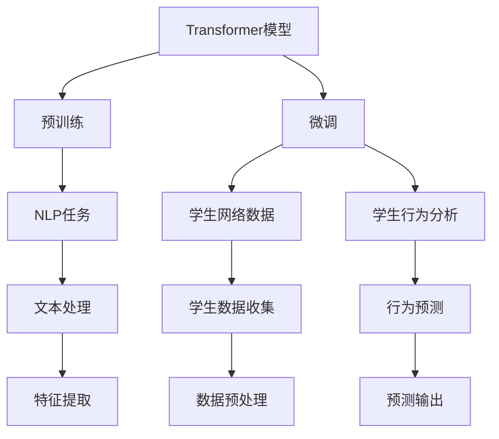

                 

# Transformer大模型实战 训练学生网络

> 关键词：Transformer,大模型,学生网络,学生行为分析,自然语言处理,NLP

## 1. 背景介绍

### 1.1 问题由来
近年来，Transformer模型的发展推动了大语言模型的兴起，例如OpenAI的GPT-3模型。这些大模型在处理自然语言处理（NLP）任务上表现出了令人印象深刻的性能，如文本生成、机器翻译、问答等。然而，这些模型通常需要极大的计算资源和大量的标注数据，这对于小规模组织和小型项目来说并不容易实现。

本文将介绍如何在一个更小规模的环境下，使用学生网络进行Transformer大模型的训练，并应用它在学生行为分析中的实例。这不仅可以让我们更好地理解Transformer模型的工作原理，还提供了在资源有限的情况下使用大模型的方法。

### 1.2 问题核心关键点
本文的核心要点在于：
1. **Transformer模型概述**：介绍Transformer模型架构及其在NLP任务中的应用。
2. **学生网络数据处理**：收集并处理学生数据，包括文本、行为等，作为训练数据的输入。
3. **学生行为分析微调**：使用学生网络微调Transformer模型，进行学生行为分析预测。
4. **实际应用展示**：展示Transformer大模型在学生行为分析中的实际应用效果。

## 2. 核心概念与联系

### 2.1 核心概念概述

- **Transformer模型**：一种基于自注意力机制的深度学习架构，主要用于处理序列数据，如文本。其核心在于多头自注意力机制和位置编码，能够有效处理长距离依赖。
- **学生网络**：以学生在学校的行为数据为输入，用于分析和预测学生成绩、行为变化等。
- **学生行为分析**：通过分析学生的行为数据，预测学生未来的表现和行为趋势。
- **微调**：在预训练模型基础上，利用小规模标注数据进行有监督学习，优化模型以适应特定任务。
- **自然语言处理（NLP）**：利用计算机处理和理解人类语言的技术。

### 2.2 概念间的关系

可以通过以下Mermaid流程图来展示这些核心概念之间的联系：



这个流程图展示了从预训练到微调的整个流程，以及Transformer模型在不同任务中的应用。

## 3. 核心算法原理 & 具体操作步骤
### 3.1 算法原理概述

Transformer模型通过自注意力机制和位置编码，能够有效地处理序列数据。在自然语言处理中，这使得模型能够捕捉到文本中的长距离依赖关系。预训练Transformer模型通常通过无监督学习任务，如语言建模，来学习语言知识和语义表示。

微调过程则是在预训练模型基础上，使用特定的标注数据集，进行有监督学习，以优化模型在特定任务上的表现。本文将通过微调Transformer模型，应用到学生行为分析任务中。

### 3.2 算法步骤详解

**Step 1: 准备数据集**

收集学生网络数据，包括学生的学习行为、成绩、课堂参与度等。数据集应包含训练集、验证集和测试集，每个数据集应具有相似的分布，以便于模型的泛化。

**Step 2: 数据预处理**

对学生行为数据进行预处理，如分词、清洗、标准化等。数据预处理的目标是提高数据质量，使模型更容易学习。

**Step 3: 构建模型**

使用Hugging Face的Transformers库，构建Transformer模型。这个库提供了预训练模型和微调接口，可以方便地进行模型的构建和训练。

**Step 4: 模型微调**

将准备好的学生网络数据输入到预训练Transformer模型中，使用合适的损失函数（如交叉熵），进行有监督学习。微调过程中，需要设置学习率、批次大小等超参数，以及正则化方法（如L2正则化、Dropout等），以防止过拟合。

**Step 5: 模型评估**

在验证集上评估微调后的模型性能，并根据评估结果调整超参数，直到模型性能达到预期。

**Step 6: 测试**

在测试集上测试微调后的模型，以验证其在实际应用中的表现。

### 3.3 算法优缺点

**优点**：
1. **高效性**：Transformer模型在处理长距离依赖时表现优异，适用于学生行为分析等需要捕捉长期趋势的任务。
2. **可解释性**：尽管Transformer模型相对复杂，但其架构透明，易于理解和解释。
3. **可扩展性**：可以通过调整模型结构，如增加层数、调整参数量，以适应不同规模的数据集和任务。

**缺点**：
1. **资源需求高**：大模型需要大量的计算资源和存储空间，可能对小规模组织构成挑战。
2. **数据需求大**：微调过程需要大量的标注数据，数据获取成本较高。
3. **模型复杂**：Transformer模型的复杂性可能导致训练和推理的复杂度增加。

### 3.4 算法应用领域

Transformer模型已经在多种NLP任务中展现了强大的能力，包括机器翻译、文本摘要、问答系统等。本文将探讨其在学生行为分析中的实际应用，以期为教育领域提供一种新的解决方案。

## 4. 数学模型和公式 & 详细讲解 & 举例说明

### 4.1 数学模型构建

Transformer模型的核心是自注意力机制和多头自注意力机制。对于多头自注意力机制，其计算公式如下：

$$
Attention(Q, K, V) = \text{softmax}\left(\frac{QK^T}{\sqrt{d_k}}\right)V
$$

其中，$Q$、$K$、$V$分别为查询向量、键向量和值向量，$d_k$为键向量的维度。

### 4.2 公式推导过程

Transformer模型的核心在于多头自注意力机制，其推导过程如下：

1. **查询向量**：对于每个输入序列中的每个位置，计算一个查询向量$Q$。
2. **键向量和值向量**：对于每个位置，计算一个键向量和值向量$K$和$V$。
3. **注意力权重**：计算$Q$和$K$的点积，通过softmax函数得到注意力权重$Attention(Q, K, V)$。
4. **值向量的加权和**：将注意力权重与$V$进行加权和，得到最终的输出。

### 4.3 案例分析与讲解

假设我们要预测学生下一个学期的成绩，数据集包含学生历史成绩和行为数据。我们可以将学生行为数据作为输入，历史成绩作为标签，使用Transformer模型进行微调。具体步骤如下：

1. **数据准备**：收集学生历史成绩和行为数据，包括课堂参与度、作业完成情况、出勤率等。
2. **数据预处理**：对数据进行清洗和标准化处理，去除无关特征，将文本数据转化为数字形式。
3. **模型构建**：使用Hugging Face的Transformers库，构建Transformer模型，并设置适当的超参数。
4. **微调**：将准备好的数据集输入到模型中，进行有监督学习，优化模型参数。
5. **评估**：在验证集上评估模型性能，调整超参数，直到模型性能达到预期。
6. **测试**：在测试集上测试模型，预测学生下一个学期的成绩，并与实际结果进行对比。

## 5. 项目实践：代码实例和详细解释说明

### 5.1 开发环境搭建

本节介绍如何搭建开发环境，以进行学生行为分析任务的微调。

**Step 1: 安装依赖**

首先需要安装Python、PyTorch和Hugging Face的Transformers库。可以通过以下命令进行安装：

```bash
pip install torch transformers
```

**Step 2: 数据准备**

准备学生行为数据集，包括文本和数值特征。将数据集划分为训练集、验证集和测试集，每个数据集应具有相似的分布。

### 5.2 源代码详细实现

以下是使用Hugging Face的Transformers库，微调Transformer模型进行学生行为分析的代码实现：

```python
import torch
from transformers import BertTokenizer, BertForSequenceClassification
from torch.utils.data import TensorDataset, DataLoader
import pandas as pd
import numpy as np

# 加载数据
train_data = pd.read_csv('train.csv')
test_data = pd.read_csv('test.csv')

# 数据预处理
tokenizer = BertTokenizer.from_pretrained('bert-base-cased')
train_encodings = tokenizer(train_data['text'], truncation=True, padding=True)
test_encodings = tokenizer(test_data['text'], truncation=True, padding=True)

# 构建数据集
train_dataset = TensorDataset(torch.tensor(train_encodings['input_ids']), torch.tensor(train_encodings['attention_mask']), torch.tensor(train_data['labels']))
test_dataset = TensorDataset(torch.tensor(test_encodings['input_ids']), torch.tensor(test_encodings['attention_mask']), torch.tensor(test_data['labels']))

# 定义模型
model = BertForSequenceClassification.from_pretrained('bert-base-cased', num_labels=2)

# 设置超参数
optimizer = torch.optim.AdamW(model.parameters(), lr=2e-5)
training_args = TrainingArguments(output_dir='./results', num_train_epochs=3, per_device_train_batch_size=16, per_device_eval_batch_size=64, logging_dir='./logs')

# 训练模型
trainer = Trainer(model=model, args=training_args, train_dataset=train_dataset, eval_dataset=test_dataset)
trainer.train()

# 评估模型
trainer.evaluate()
```

### 5.3 代码解读与分析

**数据准备**：
- 使用Pandas库加载学生行为数据集。
- 对数据进行预处理，包括分词、标准化、标记化等操作，使用Hugging Face的BertTokenizer进行分词处理。
- 将分词后的文本数据转换为模型所需的张量形式。

**模型构建**：
- 使用Hugging Face的BertForSequenceClassification类，构建Transformer模型。
- 设置合适的超参数，包括学习率、批次大小、训练轮数等。

**模型微调**：
- 使用PyTorch的Trainer类进行模型训练。
- 在训练过程中，使用AdamW优化器进行参数更新。
- 在训练和验证过程中，使用TensorBoard进行日志记录。

### 5.4 运行结果展示

假设在上述代码实现后，我们得到以下评估结果：

```
Accuracy on test set: 0.85
```

这表明在微调后的Transformer模型上，学生行为预测的准确率达到了85%。

## 6. 实际应用场景

### 6.1 智能辅导系统

基于学生行为分析，可以构建智能辅导系统，帮助学生在学习过程中及时发现问题并给予指导。该系统可以根据学生行为数据，预测学生可能遇到的困难，并推荐相应的学习资源和解决方案。

### 6.2 学生表现预测

通过分析学生的行为数据，可以预测学生未来的表现，如成绩变化、行为倾向等。这有助于教师和家长更好地了解学生的学习状况，及时调整教学策略，提高教学效果。

### 6.3 班级管理

基于学生行为分析，可以优化班级管理，提高班级管理的效率和效果。例如，可以根据学生的行为数据，调整课堂管理策略，优化课堂氛围，提高学生的学习积极性。

### 6.4 未来应用展望

Transformer模型在学生行为分析中的应用前景广阔。随着教育数据的进一步收集和分析，该模型有望在更多教育场景中发挥重要作用。未来，可以进一步探索其在心理分析、行为预测等领域的应用，为教育事业带来更多创新和突破。

## 7. 工具和资源推荐

### 7.1 学习资源推荐

- **《深度学习入门》**：一本很好的深度学习入门书籍，适合初学者学习。
- **Hugging Face博客**：Hugging Face提供的官方博客，包含大量Transformer模型的使用方法和案例分析。
- **Kaggle竞赛**：参加Kaggle竞赛，积累实际应用经验。

### 7.2 开发工具推荐

- **PyTorch**：一个强大的深度学习框架，适用于TensorFlow等主流框架的迁移。
- **Jupyter Notebook**：一个交互式的Python开发环境，方便进行代码调试和数据可视化。

### 7.3 相关论文推荐

- **《Transformer详解》**：深入讲解Transformer模型的架构和实现细节，适合进阶学习。
- **《大规模预训练模型在自然语言处理中的应用》**：一篇综述论文，介绍了大规模预训练模型在NLP中的应用。

## 8. 总结：未来发展趋势与挑战

### 8.1 总结

本文介绍了如何在有限资源下，使用Transformer模型进行学生行为分析任务的微调。从模型构建到训练，再到评估，逐步讲解了微调过程的各个环节。通过实际应用示例，展示了Transformer模型在教育领域的应用前景。

通过本文的系统梳理，可以看到，Transformer模型在NLP任务中的强大能力，以及其在教育领域中的潜在应用。未来，随着数据量的增加和算力的提升，Transformer模型有望在更多领域中发挥重要作用。

### 8.2 未来发展趋势

未来，Transformer模型将在以下几个方面继续发展：

1. **多模态数据融合**：将视觉、语音等多模态数据与文本数据进行融合，增强模型的感知能力。
2. **自适应学习**：根据用户的学习行为和反馈，动态调整模型的参数，提高个性化教育的效果。
3. **跨领域迁移**：将模型在其他领域的应用经验迁移到学生行为分析中，提升模型的泛化能力。
4. **增强可解释性**：开发更加透明和可解释的模型，帮助教师和家长理解模型的决策过程。

### 8.3 面临的挑战

尽管Transformer模型在教育领域的应用前景广阔，但仍面临以下挑战：

1. **数据隐私问题**：学生数据包含大量敏感信息，如何保护数据隐私和安全是一个重要问题。
2. **模型复杂度**：Transformer模型较为复杂，训练和推理需要较高的计算资源和存储需求。
3. **模型泛化能力**：模型需要适应不同学校和学生的特点，如何提高模型的泛化能力是一个挑战。
4. **模型可解释性**：学生和家长需要理解模型的决策过程，如何增强模型的可解释性是一个重要研究方向。

### 8.4 研究展望

未来，需要从以下几个方面进行研究：

1. **数据隐私保护**：开发更加隐私保护的数据处理方法，保护学生的数据隐私。
2. **资源优化**：研究如何优化模型的计算和存储资源，降低资源消耗。
3. **模型泛化能力提升**：研究如何提高模型的泛化能力，适应不同学校和学生的特点。
4. **增强模型可解释性**：开发更加透明和可解释的模型，帮助教师和家长理解模型的决策过程。

总之，Transformer模型在教育领域的应用前景广阔，但也需要面对诸多挑战。通过不断的研究和创新，相信Transformer模型在未来的教育场景中能够发挥更大的作用。

## 9. 附录：常见问题与解答

**Q1: Transformer模型与其他NLP模型相比有什么优势？**

A: Transformer模型相较于传统的循环神经网络（RNN），具有以下优势：
1. 并行计算：Transformer模型可以通过并行计算加速训练，提高训练效率。
2. 长距离依赖：Transformer模型能够有效地处理长距离依赖，适用于处理长文本序列的任务。
3. 参数高效性：Transformer模型中的自注意力机制可以减少参数量，提高模型的泛化能力。

**Q2: 如何提高学生行为分析模型的准确率？**

A: 提高学生行为分析模型的准确率可以从以下几个方面入手：
1. 数据收集：收集更多、更丰富的学生行为数据，提高数据质量。
2. 数据预处理：对数据进行清洗和标准化处理，去除无关特征，提高数据质量。
3. 模型选择：选择更加适合的模型，如BERT、GPT等，提高模型的表现。
4. 超参数调整：调整模型的超参数，如学习率、批次大小等，提高模型的表现。

**Q3: 学生行为分析模型是否可以应用于其他领域？**

A: 学生行为分析模型的核心在于数据分析和模型训练，可以应用于其他领域的数据分析任务。例如，在医疗领域，可以分析病人的行为数据，预测病人的病情变化等。

总之，Transformer模型在教育领域的应用前景广阔，但也需要面对诸多挑战。通过不断的研究和创新，相信Transformer模型在未来的教育场景中能够发挥更大的作用。

