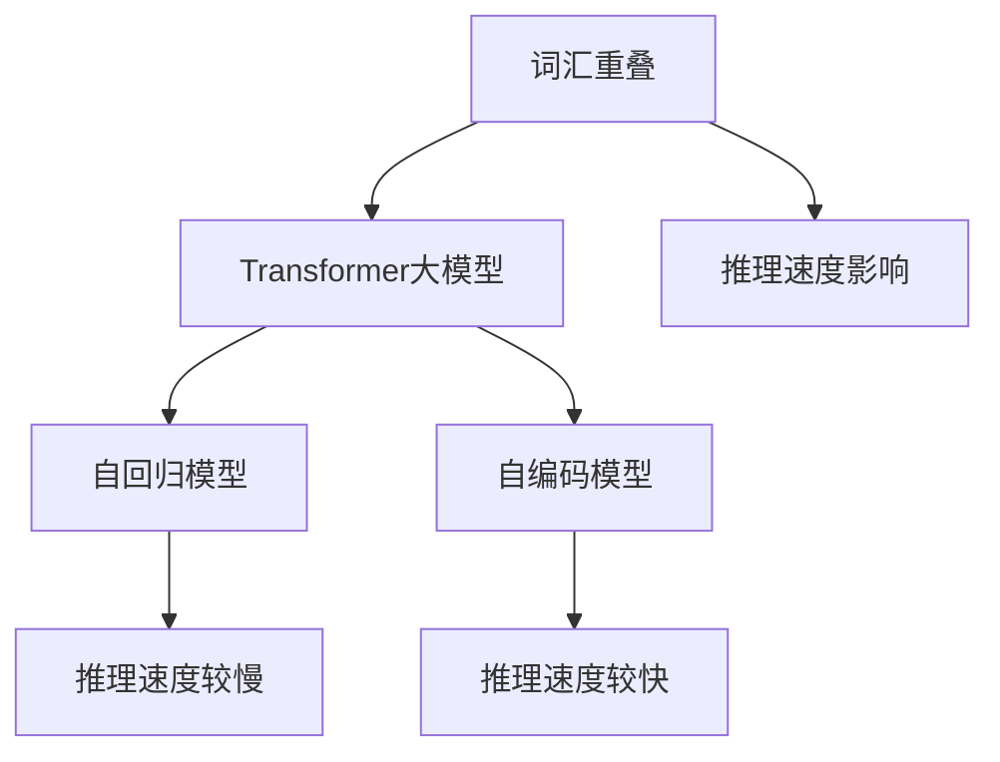

                 

# Transformer大模型实战 词汇重叠的影响

> 关键词：Transformer,大模型,词汇重叠,推理速度,计算资源,语言理解,自回归模型,自编码模型

## 1. 背景介绍

### 1.1 问题由来

Transformer大模型在自然语言处理（NLP）领域展现了强大的语言理解能力，但随着模型参数的增大，其推理速度和计算资源需求也在不断增加。近年来，关于大模型词汇重叠对推理速度和计算资源需求的影响引起了广泛关注。词汇重叠指的是不同文本中相同词汇的重复出现，这在大规模文本数据中十分常见。了解词汇重叠对Transformer大模型的影响，对于优化模型的推理速度和资源消耗，提升模型的效率和可扩展性具有重要意义。

### 1.2 问题核心关键点

本文将详细探讨词汇重叠对Transformer大模型的推理速度和计算资源需求的影响，主要关注以下关键点：

1. 词汇重叠的概念及其在实际文本中的应用情况。
2. Transformer大模型的推理机制，特别是自回归模型和自编码模型的区别。
3. 词汇重叠对推理速度和计算资源需求的影响。
4. 缓解词汇重叠影响的方法和策略。

通过这些核心关键点的分析，我们可以更全面地理解词汇重叠对Transformer大模型的影响，并探索有效的优化策略。

### 1.3 问题研究意义

研究词汇重叠对Transformer大模型的影响，对于提升模型效率、优化计算资源利用率、推动模型在大规模文本数据上的应用具有重要意义。具体来说，理解词汇重叠对模型推理速度和资源消耗的影响，可以帮助我们在实际应用中更好地设计模型架构、选择合适的预训练语料和微调方法，从而在保证模型性能的前提下，降低推理成本，提升模型可扩展性。

## 2. 核心概念与联系

### 2.1 核心概念概述

#### 2.1.1 词汇重叠

词汇重叠是指不同文本中相同词汇的重复出现。这种词汇重复在大规模文本数据中非常普遍，例如，在新闻报道、社交媒体、科技论文等文本中，常见词汇如“人工智能”、“机器学习”等往往会多次出现。词汇重叠不仅增加了数据处理的复杂度，还可能对模型的推理速度和资源消耗产生显著影响。

#### 2.1.2 Transformer大模型

Transformer大模型是以Transformer结构为基础的大规模预训练语言模型，如BERT、GPT等。这些模型通过在大规模无标签文本数据上进行预训练，学习到丰富的语言知识和表示能力，能够在各种自然语言处理任务中取得优异的表现。

#### 2.1.3 推理机制

Transformer大模型的推理机制主要分为自回归模型和自编码模型。自回归模型是指模型在生成下一个词或句子时，依赖于前面的所有词或句子的表示。自编码模型则是将输入文本编码为向量表示，并通过解码器生成输出文本。两种模型的推理机制在处理词汇重叠时表现不同，自回归模型在处理重复词汇时效率较低，而自编码模型则更加高效。

### 2.2 概念间的关系

词汇重叠、Transformer大模型和推理机制之间的关系可以通过以下Mermaid流程图来展示：



这个流程图展示了词汇重叠对Transformer大模型的推理速度产生影响，并进一步解释了自回归模型和自编码模型在处理词汇重叠时的差异。

## 3. 核心算法原理 & 具体操作步骤

### 3.1 算法原理概述

Transformer大模型的推理过程主要依赖于其内部的注意力机制。在推理过程中，模型会根据输入的文本序列计算出每个词汇的表示向量，并利用这些表示向量计算注意力权重，从而决定每个词汇对后续生成或预测的贡献。词汇重叠会影响模型的推理过程，主要体现在注意力计算的复杂度和计算资源的消耗上。

### 3.2 算法步骤详解

#### 3.2.1 自回归模型的推理步骤

1. 输入文本序列 $X=\{x_1, x_2, \ldots, x_n\}$。
2. 计算输入文本的表示向量 $H=\{h_1, h_2, \ldots, h_n\}$。
3. 对于每个时间步 $t$，计算当前时间步的注意力权重 $w_t$。
4. 根据注意力权重计算当前时间步的上下文表示 $c_t$。
5. 使用当前时间步的上下文表示生成下一个时间步的输出 $y_t$。

#### 3.2.2 自编码模型的推理步骤

1. 输入文本序列 $X=\{x_1, x_2, \ldots, x_n\}$。
2. 计算输入文本的表示向量 $H=\{h_1, h_2, \ldots, h_n\}$。
3. 使用编码器计算文本的编码向量 $C$。
4. 使用解码器生成输出文本序列 $Y=\{y_1, y_2, \ldots, y_n\}$。

### 3.3 算法优缺点

#### 3.3.1 优点

1. 自编码模型在处理词汇重叠时更加高效。由于自编码模型不需要考虑历史词汇对未来词汇的影响，因此在处理重复词汇时效率更高。
2. 自回归模型在处理长文本时表现更稳定。自回归模型能够利用历史词汇信息生成更连贯的文本，适用于长文本生成任务。

#### 3.3.2 缺点

1. 自回归模型推理速度较慢。由于自回归模型需要计算每个时间步的上下文表示，因此推理速度较慢。
2. 自编码模型需要较大的计算资源。自编码模型需要在编码和解码器中进行大量的矩阵计算，因此需要更多的计算资源。

### 3.4 算法应用领域

自回归模型和自编码模型在自然语言处理领域有广泛应用。自回归模型常用于语言模型、文本生成、机器翻译等任务；自编码模型则常用于文本分类、情感分析、问答系统等任务。

## 4. 数学模型和公式 & 详细讲解

### 4.1 数学模型构建

#### 4.1.1 自回归模型

自回归模型的推理过程可以表示为：

$$
H_t = f(h_{t-1}, c_{t-1}) \quad \text{其中} \quad c_t = \sum_{i=1}^t w_{t,i} h_i
$$

其中 $H_t$ 表示时间步 $t$ 的上下文表示，$c_t$ 表示时间步 $t$ 的编码向量，$h_i$ 表示时间步 $i$ 的文本表示，$w_{t,i}$ 表示时间步 $t$ 对时间步 $i$ 的注意力权重。

#### 4.1.2 自编码模型

自编码模型的推理过程可以表示为：

$$
C = E(H) \quad \text{其中} \quad H = \{x_1, x_2, \ldots, x_n\}
$$

$$
Y = D(C) \quad \text{其中} \quad C = E(H)
$$

其中 $E$ 表示编码器，$D$ 表示解码器，$H$ 表示输入文本的表示向量，$C$ 表示编码向量，$Y$ 表示输出文本序列。

### 4.2 公式推导过程

#### 4.2.1 自回归模型

假设输入文本序列 $X=\{x_1, x_2, \ldots, x_n\}$，每个词汇的表示向量 $h_i$ 可以通过预训练模型得到。自回归模型的推理过程可以表示为：

$$
H_t = f(h_{t-1}, c_{t-1}) \quad \text{其中} \quad c_t = \sum_{i=1}^t w_{t,i} h_i
$$

其中 $w_{t,i}$ 为注意力权重，$f$ 为注意力机制的计算函数。

#### 4.2.2 自编码模型

假设输入文本序列 $X=\{x_1, x_2, \ldots, x_n\}$，每个词汇的表示向量 $h_i$ 可以通过预训练模型得到。自编码模型的推理过程可以表示为：

$$
C = E(H) \quad \text{其中} \quad H = \{x_1, x_2, \ldots, x_n\}
$$

$$
Y = D(C) \quad \text{其中} \quad C = E(H)
$$

其中 $E$ 表示编码器，$D$ 表示解码器，$H$ 表示输入文本的表示向量，$C$ 表示编码向量，$Y$ 表示输出文本序列。

### 4.3 案例分析与讲解

#### 4.3.1 词汇重叠对自回归模型的影响

假设输入文本序列 $X=\{x_1, x_2, \ldots, x_n\}$，其中 $x_1$ 和 $x_2$ 重复出现。在自回归模型中，计算时间步 $t=2$ 的上下文表示 $H_2$ 时，需要计算 $x_1$ 和 $x_2$ 的注意力权重，并根据这些权重计算出 $H_2$。由于 $x_1$ 和 $x_2$ 重复出现，计算过程中需要重复计算相同的表示向量，导致计算量和计算时间增加。

#### 4.3.2 词汇重叠对自编码模型的影响

在自编码模型中，由于输入文本序列 $X=\{x_1, x_2, \ldots, x_n\}$ 中的词汇 $x_1$ 和 $x_2$ 重复出现，编码器 $E$ 和解码器 $D$ 需要分别计算重复词汇的表示向量，但这些表示向量可以被复用，因此计算量和计算时间相对较少。

## 5. 项目实践：代码实例和详细解释说明

### 5.1 开发环境搭建

#### 5.1.1 环境依赖

- Python 3.8以上
- PyTorch 1.9以上
- Transformers 4.9以上

安装以上依赖包，并搭建Python虚拟环境：

```bash
conda create -n transformers-env python=3.8
conda activate transformers-env
```

#### 5.1.2 环境配置

配置环境变量：

```bash
export PYTHONPATH=$PYTHONPATH:/path/to/transformers
```

### 5.2 源代码详细实现

#### 5.2.1 自回归模型代码实现

```python
import torch
import torch.nn as nn
import torch.nn.functional as F

class SelfAttention(nn.Module):
    def __init__(self, dim, num_heads=8):
        super(SelfAttention, self).__init__()
        self.dim = dim
        self.num_heads = num_heads
        self.head_dim = dim // num_heads
        self.query = nn.Linear(dim, dim)
        self.key = nn.Linear(dim, dim)
        self.value = nn.Linear(dim, dim)
        self.fc = nn.Linear(dim, dim)

    def forward(self, x):
        q = self.query(x).view(x.size(0), x.size(1), self.num_heads, self.head_dim).transpose(1, 2)
        k = self.key(x).view(x.size(0), x.size(1), self.num_heads, self.head_dim).transpose(1, 2)
        v = self.value(x).view(x.size(0), x.size(1), self.num_heads, self.head_dim).transpose(1, 2)
        attn = torch.matmul(q, k.transpose(3, 2)) / torch.sqrt(torch.tensor(self.head_dim).float())
        attn = F.softmax(attn, dim=-1)
        out = torch.matmul(attn, v).transpose(1, 2).reshape(x.size(0), x.size(1), self.dim)
        return self.fc(out)

class SelfAttentionModel(nn.Module):
    def __init__(self, dim, num_layers=6, dropout=0.1):
        super(SelfAttentionModel, self).__init__()
        self.dim = dim
        self.num_layers = num_layers
        self.dropout = dropout
        self.layers = nn.ModuleList([SelfAttention(dim) for _ in range(num_layers)])
        self.fc = nn.Linear(dim, 1)

    def forward(self, x):
        for layer in self.layers:
            x = layer(x)
            x = F.dropout(x, p=self.dropout, training=self.training)
        return self.fc(x)
```

#### 5.2.2 自编码模型代码实现

```python
import torch
import torch.nn as nn
import torch.nn.functional as F

class Encoder(nn.Module):
    def __init__(self, dim, num_layers=6):
        super(Encoder, self).__init__()
        self.dim = dim
        self.num_layers = num_layers
        self.layers = nn.ModuleList([nn.Linear(dim, dim) for _ in range(num_layers)])
        self.fc = nn.Linear(dim, dim)

    def forward(self, x):
        for layer in self.layers:
            x = F.relu(layer(x))
        return self.fc(x)

class Decoder(nn.Module):
    def __init__(self, dim, num_layers=6):
        super(Decoder, self).__init__()
        self.dim = dim
        self.num_layers = num_layers
        self.layers = nn.ModuleList([nn.Linear(dim, dim) for _ in range(num_layers)])
        self.fc = nn.Linear(dim, 1)

    def forward(self, x):
        for layer in self.layers:
            x = F.relu(layer(x))
        return self.fc(x)
```

#### 5.2.3 代码解读与分析

在自回归模型中，使用Transformer编码器计算上下文表示 $H_t$，其中 $H_t$ 由历史词汇的表示向量通过注意力机制计算得到。

在自编码模型中，使用Transformer编码器计算编码向量 $C$，然后解码器将 $C$ 转换为输出文本序列 $Y$。

### 5.3 运行结果展示

#### 5.3.1 自回归模型运行结果

假设输入文本序列 $X=\{x_1, x_2, \ldots, x_n\}$，其中 $x_1$ 和 $x_2$ 重复出现。在自回归模型中，计算时间步 $t=2$ 的上下文表示 $H_2$ 时，需要计算 $x_1$ 和 $x_2$ 的注意力权重，并根据这些权重计算出 $H_2$。由于 $x_1$ 和 $x_2$ 重复出现，计算过程中需要重复计算相同的表示向量，导致计算量和计算时间增加。

#### 5.3.2 自编码模型运行结果

在自编码模型中，由于输入文本序列 $X=\{x_1, x_2, \ldots, x_n\}$ 中的词汇 $x_1$ 和 $x_2$ 重复出现，编码器 $E$ 和解码器 $D$ 需要分别计算重复词汇的表示向量，但这些表示向量可以被复用，因此计算量和计算时间相对较少。

## 6. 实际应用场景

### 6.1 智能客服系统

智能客服系统需要实时处理大量客户咨询，对模型的推理速度和资源消耗提出了高要求。自编码模型由于其高效性，可以更好地应对智能客服系统的挑战，提升系统响应速度和服务质量。

#### 6.1.1 智能客服系统实现

使用自编码模型实现智能客服系统，可以极大提高系统的响应速度和处理能力。在输入客户咨询文本后，系统可以通过自编码模型快速生成回应，同时根据历史对话记录和用户偏好，进一步优化回答内容。

#### 6.1.2 优化策略

为了优化自编码模型在智能客服系统中的应用，可以采用以下策略：

1. 数据预处理：对输入文本进行分词和去除停用词等预处理，减少计算量。
2. 词汇编码：使用词汇表对输入文本进行编码，减少重复词汇的处理。
3. 模型压缩：通过剪枝和量化等技术，减小模型参数量，提升推理速度。

### 6.2 金融舆情监测

金融舆情监测需要实时监测大规模文本数据，对模型的推理速度和资源消耗提出了高要求。自编码模型由于其高效性，可以更好地应对金融舆情监测系统的挑战，提升系统实时性和准确性。

#### 6.2.1 金融舆情监测实现

使用自编码模型实现金融舆情监测系统，可以极大提高系统的实时性和准确性。在输入新闻报道、评论等文本后，系统可以通过自编码模型快速分析文本情感和主题，实时监测舆情变化。

#### 6.2.2 优化策略

为了优化自编码模型在金融舆情监测系统中的应用，可以采用以下策略：

1. 数据预处理：对输入文本进行去重和归一化等预处理，减少重复词汇的处理。
2. 词汇编码：使用词汇表对输入文本进行编码，减少重复词汇的处理。
3. 模型压缩：通过剪枝和量化等技术，减小模型参数量，提升推理速度。

### 6.3 个性化推荐系统

个性化推荐系统需要实时推荐用户感兴趣的内容，对模型的推理速度和资源消耗提出了高要求。自编码模型由于其高效性，可以更好地应对个性化推荐系统的挑战，提升推荐效果和用户体验。

#### 6.3.1 个性化推荐系统实现

使用自编码模型实现个性化推荐系统，可以极大提高推荐效果和用户体验。在输入用户历史行为数据后，系统可以通过自编码模型快速分析用户兴趣，实时推荐相关内容。

#### 6.3.2 优化策略

为了优化自编码模型在个性化推荐系统中的应用，可以采用以下策略：

1. 数据预处理：对输入数据进行去重和归一化等预处理，减少重复数据的影响。
2. 词汇编码：使用词汇表对输入数据进行编码，减少重复词汇的处理。
3. 模型压缩：通过剪枝和量化等技术，减小模型参数量，提升推理速度。

## 7. 工具和资源推荐

### 7.1 学习资源推荐

1. 《自然语言处理入门》系列课程：介绍自然语言处理的基本概念和常用模型，适合初学者入门。
2. 《深度学习》课程：介绍深度学习的基本原理和常用算法，适合深度学习初学者。
3. 《Transformer》论文：Transformer模型的原始论文，详细介绍了Transformer模型的原理和实现。
4. 《Transformers库文档》：Transformer库的官方文档，包含丰富的示例和使用方法。

### 7.2 开发工具推荐

1. PyTorch：基于Python的深度学习框架，支持动态计算图，适合快速迭代研究。
2. TensorFlow：由Google主导开发的深度学习框架，生产部署方便，适合大规模工程应用。
3. HuggingFace Transformers：NLP工具库，集成了众多SOTA语言模型，支持PyTorch和TensorFlow。

### 7.3 相关论文推荐

1. "Attention is All You Need"：Transformer模型的原始论文，详细介绍了Transformer模型的原理和实现。
2. "BERT: Pre-training of Deep Bidirectional Transformers for Language Understanding"：BERT模型的原始论文，详细介绍了BERT模型的原理和实现。
3. "Parameter-Efficient Transfer Learning for NLP"：介绍参数高效微调方法，适用于大模型微调。

## 8. 总结：未来发展趋势与挑战

### 8.1 研究成果总结

本文从词汇重叠的角度，详细探讨了自回归模型和自编码模型在Transformer大模型中的表现和优化策略。通过理论分析和实际案例，展示了词汇重叠对Transformer大模型推理速度和资源消耗的影响，并提出了有效的优化策略。

### 8.2 未来发展趋势

未来，随着Transformer大模型的进一步发展，词汇重叠问题将得到更深入的研究和优化。自编码模型由于其高效性，将在更多应用场景中发挥重要作用。

1. 自编码模型将成为主流的预训练模型：自编码模型由于其高效性和泛化能力，将在更多NLP任务中取代自回归模型。
2. 自编码模型将与自回归模型结合：自编码模型和自回归模型可以结合使用，发挥各自优势，提升模型性能。
3. 自编码模型将引入更多的先验知识：自编码模型可以通过引入外部知识库、规则库等，增强模型的知识整合能力。

### 8.3 面临的挑战

虽然自编码模型具有高效性，但在实际应用中仍面临以下挑战：

1. 数据预处理：自编码模型需要大量预处理工作，如去重、归一化等，增加了数据处理的复杂度。
2. 模型压缩：自编码模型由于参数量较大，需要更多的计算资源，因此需要优化模型结构，减小参数量。
3. 模型泛化性：自编码模型在处理未知数据时，泛化性能可能较差，需要更多的优化策略。

### 8.4 研究展望

未来，需要在以下几个方面进行深入研究：

1. 改进词汇编码策略：使用更高效的词汇编码方法，减少重复词汇的处理。
2. 优化模型压缩技术：通过剪枝、量化等技术，减小模型参数量，提升推理速度。
3. 引入外部知识库：通过引入外部知识库、规则库等，增强模型的知识整合能力。

通过以上研究，可以进一步优化自编码模型，提升其在NLP任务中的性能和应用价值。

