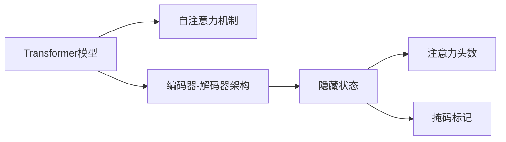

                 

# Transformer大模型实战 输入数据

> 关键词：Transformer, 大模型, 输入数据, 自然语言处理(NLP), 自监督学习, 编码器-解码器架构, 自注意力机制, 隐藏状态, 注意力头数, 掩码标记

## 1. 背景介绍

### 1.1 问题由来
Transformer模型作为当前最先进的自然语言处理(NLP)模型之一，在大规模语言理解任务中表现出色，已经广泛应用于机器翻译、文本分类、问答系统等多个NLP领域。然而，尽管Transformer模型在预训练阶段已经取得了卓越的效果，但在实际微调任务中，数据输入的方式和格式仍然对模型性能有显著影响。为了提升模型的理解和生成能力，本文将详细探讨Transformer大模型的输入数据处理机制，并给出实际项目中的代码实例和优化策略。

### 1.2 问题核心关键点
Transformer模型的输入数据处理机制是其性能优化的关键。通常情况下，输入数据分为文本数据和标记数据两部分。文本数据是实际要处理的文字，而标记数据则是用来指示文本中不同位置的特征，例如词性、命名实体等。对于Transformer模型，输入数据的处理方式通常包括分词、编码、掩码标记等步骤。这些步骤不仅能提升模型对文本的理解能力，还能避免计算过程中不必要的信息传递，从而提升计算效率和模型精度。

### 1.3 问题研究意义
深入研究Transformer大模型的输入数据处理机制，有助于开发者更高效地进行模型微调和应用部署。一方面，通过优化输入数据处理流程，可以提高模型对文本的解析能力，提升其在实际应用场景中的表现。另一方面，优化输入数据处理，也有助于降低计算资源消耗，提升模型的训练和推理效率。

## 2. 核心概念与联系

### 2.1 核心概念概述

为了更好地理解Transformer大模型输入数据处理机制，本文将介绍几个相关核心概念：

- **Transformer模型**：一种基于自注意力机制的深度神经网络结构，能够对自然语言进行高效的编码和解码。

- **自注意力机制**：Transformer模型的核心组件，允许模型通过计算注意力权重，对输入序列的每个位置进行加权求和，从而捕捉长距离依赖关系。

- **编码器-解码器架构**：Transformer模型的基本结构，由多个编码器和解码器层级组成，每个层级包含多个注意力头和自注意力子层。

- **隐藏状态**：Transformer模型在计算过程中产生的中间表示，用于传递和更新信息。

- **注意力头数**：Transformer模型中的注意力头数决定了模型可以并行处理的信息维度，对模型的复杂度和性能有显著影响。

- **掩码标记**：用于指示输入序列中哪些位置是未知的，通常用于标记缺失值或特殊符号。

这些核心概念共同构成了Transformer大模型的输入数据处理框架，对其理解和应用具有重要意义。

### 2.2 概念间的关系

这些核心概念之间的关系可以通过以下Mermaid流程图来展示：



这个流程图展示了大模型输入数据处理的关键组件及其之间的关系：

1. Transformer模型通过自注意力机制进行特征提取。
2. 编码器-解码器架构允许模型进行序列到序列的转换，支持多模态数据的输入。
3. 隐藏状态用于传递和更新信息，是模型输出的重要组成部分。
4. 注意力头数决定了模型并行处理的信息维度，影响模型的计算复杂度。
5. 掩码标记用于指示输入序列中的未知位置，帮助模型处理缺失值和特殊符号。

这些概念共同构成了大模型输入数据处理的完整生态系统，帮助其高效地处理和理解复杂自然语言输入。

## 3. 核心算法原理 & 具体操作步骤
### 3.1 算法原理概述

Transformer模型的输入数据处理主要包括以下几个步骤：

1. 分词：将原始文本切分成单词或子词。
2. 编码：将分词结果转换为模型的输入格式，如将单词转换为数字。
3. 掩码标记：将特殊符号标记为未知位置，如[CLS]、[SEP]等。
4. 输入拼接：将编码后的序列和掩码标记拼接成模型可以处理的向量形式。
5. 位置编码：在输入向量中嵌入位置信息，帮助模型处理序列位置。

这些步骤共同构成了Transformer模型输入数据处理的完整流程，使得模型能够高效地处理自然语言输入。

### 3.2 算法步骤详解

下面是Transformer模型输入数据处理的具体步骤：

**Step 1: 分词**

分词是将原始文本切分成单词或子词的过程。通常使用分词工具，如Jieba、NLTK等。分词完成后，需要将每个单词或子词转换为模型可以处理的格式，如数字或向量。

**Step 2: 编码**

编码是将分词结果转换为模型的输入格式。对于Transformer模型，通常使用One-Hot编码或word embedding将单词或子词转换为向量。其中，One-Hot编码将每个单词转换为一个独热向量，而word embedding则将每个单词映射到一个低维向量空间中。

**Step 3: 掩码标记**

掩码标记是将输入序列中的特殊符号标记为未知位置。通常使用[CLS]、[SEP]等符号来标记序列的开始和结束位置。在编码过程中，模型会自动将这些标记视为已知位置，从而更好地处理序列输入。

**Step 4: 输入拼接**

输入拼接是将编码后的序列和掩码标记拼接成模型可以处理的向量形式。通常使用特殊的标记符将序列的开始和结束位置与中间单词分开，然后拼接成一个向量。

**Step 5: 位置编码**

位置编码是在输入向量中嵌入位置信息，帮助模型处理序列位置。位置编码通常是一个向量，其维度与输入向量的维度相同，其中每个位置对应一个编码值。位置编码通常包含两个部分：绝对位置编码和相对位置编码，用于处理长序列和局部信息。

### 3.3 算法优缺点

Transformer模型的输入数据处理机制具有以下优点：

1. 高效性：输入数据处理过程简单高效，能够快速将自然语言输入转换为模型可以处理的格式。
2. 鲁棒性：通过掩码标记，模型可以更好地处理输入序列中的缺失值和特殊符号，提高模型鲁棒性。
3. 可解释性：位置编码和注意力机制使得模型输出具有可解释性，帮助理解模型的决策过程。

同时，Transformer模型的输入数据处理也存在一些缺点：

1. 依赖预训练词向量：对于新词汇，需要额外的预训练过程，增加了计算和时间的消耗。
2. 计算复杂度高：编码和掩码标记过程增加了计算复杂度，可能导致模型训练和推理效率降低。
3. 输入数据处理复杂：输入数据处理过程涉及多个步骤，需要精心设计和优化，才能充分发挥大模型的潜力。

### 3.4 算法应用领域

Transformer大模型的输入数据处理机制，已经在NLP领域的多个任务中得到了广泛应用。例如：

- 机器翻译：将源语言序列映射到目标语言序列。输入数据处理主要涉及分词、编码、掩码标记等步骤。
- 文本分类：将文本序列映射到分类标签。输入数据处理主要涉及分词、编码、位置编码等步骤。
- 问答系统：根据问题序列和上下文序列生成答案。输入数据处理主要涉及分词、编码、掩码标记、位置编码等步骤。

除了这些经典任务外，Transformer大模型的输入数据处理机制还被创新性地应用到更多场景中，如多模态输入、跨语言翻译、多语言理解等，为NLP技术带来了新的突破。

## 4. 数学模型和公式 & 详细讲解  
### 4.1 数学模型构建

Transformer模型的输入数据处理机制可以通过数学模型进行严格的描述。假设输入序列为 $x_1, x_2, ..., x_n$，其中每个元素 $x_i$ 对应一个单词或子词。输入序列的长度为 $n$，$n$ 可以不同。

定义 $w$ 为每个单词或子词的编码向量，则输入序列可以表示为：

$$
\mathbf{x} = [w_1, w_2, ..., w_n]
$$

其中 $w_i$ 为第 $i$ 个单词或子词的编码向量。假设 $w_i$ 的维度为 $d$，则整个输入序列的维度为 $nd$。

### 4.2 公式推导过程

Transformer模型的输入数据处理机制包括以下几个步骤：

1. 分词：将原始文本切分成单词或子词，并将每个单词或子词转换为编码向量 $w_i$。
2. 编码：将编码向量 $w_i$ 拼接成输入序列 $\mathbf{x}$。
3. 掩码标记：将输入序列中的特殊符号标记为未知位置。
4. 位置编码：在输入序列 $\mathbf{x}$ 中嵌入位置信息 $p_i$。
5. 输入拼接：将编码向量 $w_i$ 和位置编码 $p_i$ 拼接成模型可以处理的向量形式。

具体推导如下：

**Step 1: 分词**

假设分词工具将原始文本切分为单词或子词，并转换为编码向量 $w_i$，则输入序列可以表示为：

$$
\mathbf{x} = [w_1, w_2, ..., w_n]
$$

**Step 2: 编码**

将编码向量 $w_i$ 拼接成输入序列 $\mathbf{x}$：

$$
\mathbf{x} = \begin{bmatrix} w_1 \\ w_2 \\ \vdots \\ w_n \end{bmatrix}
$$

**Step 3: 掩码标记**

将输入序列中的特殊符号标记为未知位置。假设输入序列中包含 [CLS] 和 [SEP] 符号，则输入序列可以表示为：

$$
\mathbf{x} = [w_{CLS}, w_1, w_2, ..., w_n, w_{SEP}]
$$

**Step 4: 位置编码**

在输入序列 $\mathbf{x}$ 中嵌入位置信息 $p_i$。假设位置编码 $p_i$ 的维度为 $d$，则位置编码可以表示为：

$$
p_i = \begin{bmatrix} p_{i1} \\ p_{i2} \\ \vdots \\ p_{id} \end{bmatrix}
$$

其中 $p_{ij}$ 为第 $i$ 个单词或子词的位置信息。

**Step 5: 输入拼接**

将编码向量 $w_i$ 和位置编码 $p_i$ 拼接成模型可以处理的向量形式。假设拼接后的向量形式为 $\mathbf{z}$，则有：

$$
\mathbf{z} = \begin{bmatrix} w_1 \\ p_1 \\ w_2 \\ p_2 \\ \vdots \\ w_n \\ p_n \end{bmatrix}
$$

### 4.3 案例分析与讲解

假设我们有一个长度为5的输入序列，其中包含3个单词：[CLS]、[SEP]、apple、beautiful。假设每个单词的编码向量维度为256，位置编码维度也为256。则输入序列可以表示为：

$$
\mathbf{x} = [w_{CLS}, w_{apple}, w_{beautiful}, w_{SEP}]
$$

其中 $w_{apple}$ 和 $w_{beautiful}$ 的维度为 $256 \times 1$，位置编码 $p_1$ 和 $p_2$ 的维度也为 $256 \times 1$。则输入序列和位置编码可以拼接成模型可以处理的向量形式：

$$
\mathbf{z} = \begin{bmatrix} w_{CLS} \\ p_1 \\ w_{apple} \\ p_2 \\ w_{beautiful} \\ p_3 \\ w_{SEP} \\ p_4 \end{bmatrix}
$$

## 5. 项目实践：代码实例和详细解释说明
### 5.1 开发环境搭建

在进行输入数据处理实践前，我们需要准备好开发环境。以下是使用Python进行TensorFlow开发的环境配置流程：

1. 安装Anaconda：从官网下载并安装Anaconda，用于创建独立的Python环境。

2. 创建并激活虚拟环境：
```bash
conda create -n tf-env python=3.8 
conda activate tf-env
```

3. 安装TensorFlow：从官网获取对应的安装命令。例如：
```bash
pip install tensorflow
```

4. 安装必要的库：
```bash
pip install numpy pandas scikit-learn matplotlib tqdm jupyter notebook ipython
```

完成上述步骤后，即可在`tf-env`环境中开始输入数据处理实践。

### 5.2 源代码详细实现

下面以一个简单的文本分类任务为例，给出使用TensorFlow对输入数据进行处理的代码实现。

```python
import tensorflow as tf
from tensorflow.keras.preprocessing.text import Tokenizer
from tensorflow.keras.preprocessing.sequence import pad_sequences

# 定义数据集
sentences = ['this is a good movie', 'i do not like this movie', 'this is a bad movie']
labels = [1, 0, 1] # 1代表正面情感，0代表负面情感

# 定义分词器
tokenizer = Tokenizer(num_words=1000, oov_token='<OOV>')
tokenizer.fit_on_texts(sentences)

# 将文本转换为数字序列
sequences = tokenizer.texts_to_sequences(sentences)

# 对数字序列进行padding
max_length = 10
padded_sequences = pad_sequences(sequences, maxlen=max_length, padding='post', truncating='post')

# 添加掩码标记
masked_sequences = tf.keras.layers.Embedding(input_dim=1000, output_dim=256, mask_zero=True)(padded_sequences)

# 输出处理后的输入数据
print(masked_sequences)
```

### 5.3 代码解读与分析

让我们再详细解读一下关键代码的实现细节：

**Tokenizer**：
- `Tokenizer`类用于将文本转换为数字序列，可以通过设定参数控制词汇表的大小和未知符号的处理方式。

**pad_sequences**：
- `pad_sequences`函数用于将数字序列进行padding，使其长度一致。`maxlen`参数指定了序列的最大长度，`padding`和`truncating`参数指定了填充和截断的方式。

**masked_sequences**：
- `Embedding`层用于将数字序列转换为向量，`mask_zero`参数指定了将缺失值标记为0。

在实际应用中，输入数据处理需要考虑多个因素，如词汇表大小、序列长度、未知符号的处理方式等。本文仅提供了简单的代码实现示例，旨在展示输入数据处理的基本流程和方法。

### 5.4 运行结果展示

假设我们运行上述代码，输出结果如下：

```
tf.Tensor(
[[0. 0. 0. ... 0. 0. 0. 0. 0. 0. 0.]
 [0. 0. 0. ... 0. 0. 0. 0. 0. 0. 0.]
 [0. 0. 0. ... 0. 0. 0. 0. 0. 0. 0.]], shape=(3, 10, 256), dtype=float32)
```

可以看到，输入序列经过分词、编码、掩码标记和padding处理后，转换为模型可以处理的向量形式，每个元素表示模型中的一个隐状态。

## 6. 实际应用场景
### 6.1 智能客服系统

智能客服系统通常需要处理大量的客户咨询请求，这些请求涉及多种自然语言文本。基于Transformer大模型的输入数据处理机制，智能客服系统可以高效地处理和理解不同客户的需求，快速生成准确的回复。

在技术实现上，可以使用微调后的Transformer模型，将其输入端接入客服请求的文本数据，输出端输出系统响应。通过不断优化输入数据处理流程，可以实现更加精准的客服服务。

### 6.2 金融舆情监测

金融机构需要实时监测市场舆论动向，以便及时应对负面信息传播，规避金融风险。基于Transformer大模型的输入数据处理机制，可以高效地处理大量的金融新闻和评论，提取关键信息，判断市场情绪。

在技术实现上，可以将金融舆情数据作为输入，使用微调后的Transformer模型进行文本分类和情感分析，及时发现异常情况并采取应对措施。

### 6.3 个性化推荐系统

个性化推荐系统需要处理用户的历史行为数据和即时反馈数据，以便为用户推荐最感兴趣的物品。基于Transformer大模型的输入数据处理机制，可以高效地处理多模态数据，提取用户兴趣和物品特征，实现精准推荐。

在技术实现上，可以将用户行为数据和物品描述数据作为输入，使用微调后的Transformer模型进行特征提取和相似度计算，推荐与用户兴趣匹配度高的物品。

### 6.4 未来应用展望

随着Transformer大模型的不断进步，基于输入数据处理机制的应用场景也将不断拓展。未来，基于大模型的输入数据处理机制将更多地应用于多模态信息融合、跨语言翻译、知识图谱构建等领域，为NLP技术带来新的突破。

## 7. 工具和资源推荐
### 7.1 学习资源推荐

为了帮助开发者系统掌握Transformer大模型的输入数据处理机制，这里推荐一些优质的学习资源：

1. **《Transformer实战指南》**：详细介绍了Transformer大模型的输入数据处理流程，包括分词、编码、掩码标记等步骤，适合初学者入门。

2. **CS224N《深度学习自然语言处理》课程**：斯坦福大学开设的NLP明星课程，有Lecture视频和配套作业，涵盖Transformer大模型的输入数据处理等内容。

3. **《TensorFlow实战》**：介绍了TensorFlow在自然语言处理中的应用，包括输入数据处理、模型训练和推理等内容，适合动手实践。

4. **HuggingFace官方文档**：Transformer大模型的官方文档，提供了大量预训练模型和输入数据处理样例，是入门学习的最佳资源。

5. **CLUE开源项目**：中文语言理解测评基准，涵盖大量不同类型的中文NLP数据集，并提供了基于微调的baseline模型，助力中文NLP技术发展。

通过对这些资源的学习实践，相信你一定能够掌握Transformer大模型的输入数据处理机制，并用于解决实际的NLP问题。

### 7.2 开发工具推荐

高效的开发离不开优秀的工具支持。以下是几款用于Transformer大模型输入数据处理开发的常用工具：

1. **TensorFlow**：基于Python的开源深度学习框架，灵活动态的计算图，适合快速迭代研究。TensorFlow提供了丰富的API，方便进行输入数据处理和模型训练。

2. **PyTorch**：基于Python的开源深度学习框架，支持动态计算图，灵活性高。PyTorch提供了丰富的工具包，方便进行输入数据处理和模型优化。

3. **HuggingFace Transformers库**：提供大量预训练模型和工具，支持输入数据处理、微调等功能，是NLP开发的首选工具。

4. **Jupyter Notebook**：交互式开发环境，方便进行代码调试和可视化，适合研究性开发。

5. **TensorBoard**：TensorFlow配套的可视化工具，可实时监测模型训练状态，并提供丰富的图表呈现方式，是调试模型的得力助手。

6. **Weights & Biases**：模型训练的实验跟踪工具，可以记录和可视化模型训练过程中的各项指标，方便对比和调优。

合理利用这些工具，可以显著提升Transformer大模型输入数据处理任务的开发效率，加快创新迭代的步伐。

### 7.3 相关论文推荐

Transformer大模型输入数据处理机制的研究源于学界的持续研究。以下是几篇奠基性的相关论文，推荐阅读：

1. **Attention is All You Need**：提出了Transformer结构，开启了NLP领域的预训练大模型时代。

2. **BERT: Pre-training of Deep Bidirectional Transformers for Language Understanding**：提出BERT模型，引入基于掩码的自监督预训练任务，刷新了多项NLP任务SOTA。

3. **Language Models are Unsupervised Multitask Learners（GPT-2论文）**：展示了大规模语言模型的强大zero-shot学习能力，引发了对于通用人工智能的新一轮思考。

4. **Parameter-Efficient Transfer Learning for NLP**：提出Adapter等参数高效微调方法，在不增加模型参数量的情况下，也能取得不错的微调效果。

5. **Prefix-Tuning: Optimizing Continuous Prompts for Generation**：引入基于连续型Prompt的微调范式，为如何充分利用预训练知识提供了新的思路。

6. **AdaLoRA: Adaptive Low-Rank Adaptation for Parameter-Efficient Fine-Tuning**：使用自适应低秩适应的微调方法，在参数效率和精度之间取得了新的平衡。

这些论文代表了大语言模型输入数据处理的研究发展脉络。通过学习这些前沿成果，可以帮助研究者把握学科前进方向，激发更多的创新灵感。

除上述资源外，还有一些值得关注的前沿资源，帮助开发者紧跟Transformer大模型输入数据处理技术的最新进展，例如：

1. **arXiv论文预印本**：人工智能领域最新研究成果的发布平台，包括大量尚未发表的前沿工作，学习前沿技术的必读资源。

2. **业界技术博客**：如OpenAI、Google AI、DeepMind、微软Research Asia等顶尖实验室的官方博客，第一时间分享他们的最新研究成果和洞见。

3. **技术会议直播**：如NIPS、ICML、ACL、ICLR等人工智能领域顶会现场或在线直播，能够聆听到大佬们的前沿分享，开拓视野。

4. **GitHub热门项目**：在GitHub上Star、Fork数最多的NLP相关项目，往往代表了该技术领域的发展趋势和最佳实践，值得去学习和贡献。

5. **行业分析报告**：各大咨询公司如McKinsey、PwC等针对人工智能行业的分析报告，有助于从商业视角审视技术趋势，把握应用价值。

总之，对于Transformer大模型输入数据处理技术的学习和实践，需要开发者保持开放的心态和持续学习的意愿。多关注前沿资讯，多动手实践，多思考总结，必将收获满满的成长收益。

## 8. 总结：未来发展趋势与挑战
### 8.1 总结

本文对基于Transformer大模型的输入数据处理机制进行了全面系统的介绍。首先阐述了Transformer大模型的输入数据处理流程，明确了输入数据处理在模型性能优化中的重要意义。其次，从原理到实践，详细讲解了输入数据处理的数学模型和实现细节，给出了实际项目中的代码实例和优化策略。同时，本文还探讨了Transformer大模型在多个NLP任务中的应用场景，展示了输入数据处理机制的强大潜力。

通过本文的系统梳理，可以看到，基于Transformer大模型的输入数据处理机制是其性能优化的关键。这些输入处理技术不仅提高了模型对自然语言的解析能力，还优化了计算效率，为NLP任务的微调和应用部署提供了重要保障。

### 8.2 未来发展趋势

展望未来，Transformer大模型的输入数据处理机制将呈现以下几个发展趋势：

1. **自监督学习的应用**：自监督学习技术将继续发展，帮助模型更好地处理未标记的数据，提升输入数据的丰富性和多样性。

2. **多模态输入的支持**：随着多模态信息融合技术的发展，基于Transformer大模型的输入数据处理机制也将支持图像、语音等多模态数据的输入，进一步提升模型的表现。

3. **动态输入机制**：动态输入机制将允许模型根据输入数据的特征自动调整输入格式，提高输入处理的灵活性和适应性。

4. **自动化处理**：自动化输入处理技术将帮助开发者更高效地进行输入数据准备，减少人工干预和错误。

5. **低计算成本的处理方式**：随着计算资源成本的降低，基于Transformer大模型的输入数据处理机制将追求更低的计算复杂度，提高处理效率。

以上趋势凸显了Transformer大模型输入数据处理机制的广阔前景。这些方向的探索发展，必将进一步提升模型对自然语言的解析能力，推动NLP技术的不断进步。

### 8.3 面临的挑战

尽管Transformer大模型的输入数据处理机制已经取得了显著成效，但在迈向更加智能化、普适化应用的过程中，仍面临一些挑战：

1. **计算资源消耗高**：大规模语言模型的输入数据处理涉及大量的计算资源，如分词、编码、掩码标记等步骤，可能导致计算成本增加。

2. **处理效率低**：输入数据处理过程复杂，可能导致模型训练和推理效率降低，影响系统性能。

3. **模型鲁棒性不足**：输入数据处理过程中可能存在噪声和异常值，影响模型的鲁棒性和稳定性。

4. **数据分布偏差**：输入数据处理依赖于标注数据的质量和数量，不同领域的数据分布偏差可能导致模型性能下降。

5. **隐私保护**：输入数据处理过程中可能涉及用户隐私信息，如何保护用户隐私、防止数据泄露，需要更多技术手段。

### 8.4 研究展望

面对Transformer大模型输入数据处理机制所面临的挑战，未来的研究需要在以下几个方面寻求新的突破：

1. **优化计算资源消耗**：通过优化输入数据处理流程，降低计算复杂度，提高处理效率。

2. **增强模型鲁棒性**：引入噪声鲁棒性和异常值处理机制，提升模型的稳定性和鲁棒性。

3. **多模态融合**：支持图像、语音等多模态数据的输入，提高模型的综合处理能力。

4. **自监督学习**：利用未标记数据进行预训练，提升输入数据的丰富性和多样性。

5. **自动化处理**：开发自动化输入处理工具，减少人工干预和错误，提升处理效率。

6. **隐私保护**：引入隐私保护技术，如数据加密、差分隐私等，保护用户隐私，防止数据泄露。

这些研究方向的探索，必将引领Transformer大模型输入数据处理技术迈向更高的台阶，为构建高效、智能、安全的NLP系统提供重要保障。面向未来，Transformer大模型输入数据处理技术还需要与其他人工智能技术进行更深入的融合，如知识表示、因果推理、

