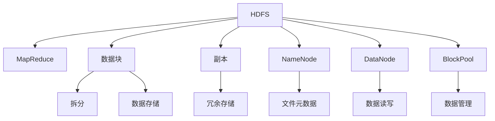
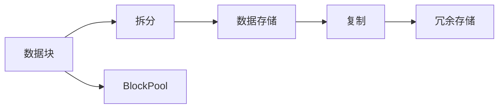
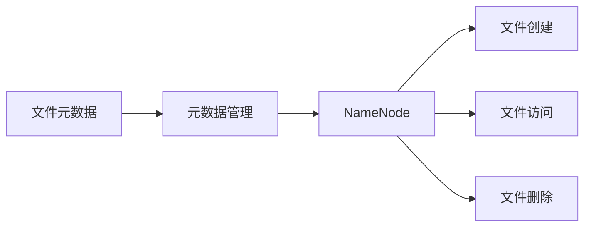
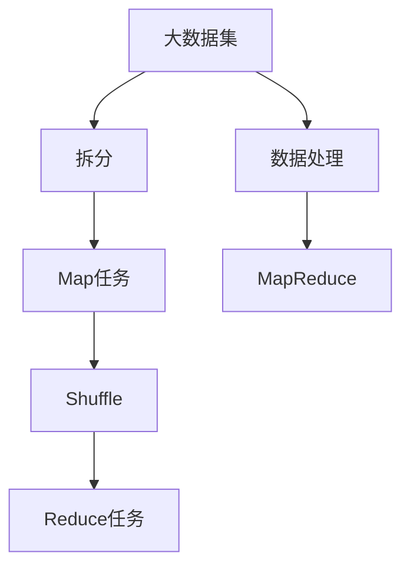
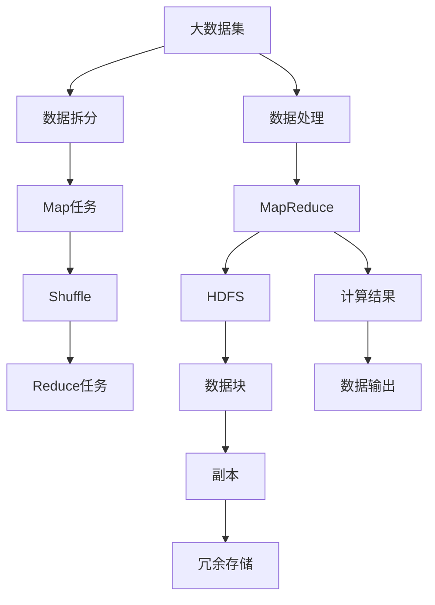

                 

# 【AI大数据计算原理与代码实例讲解】HDFS

> 关键词：
- HDFS
- 大数据计算
- MapReduce
- 分布式存储
- 数据块
- 副本机制
- 数据冗余
- 数据一致性
- 数据读写
- 数据流控制

## 1. 背景介绍

### 1.1 问题由来
随着互联网的迅速发展，数据量呈指数级增长。为了高效存储和处理这些海量数据，Hadoop生态中的HDFS（Hadoop Distributed File System）应运而生，成为大数据存储和计算的重要基础设施。HDFS通过分布式存储的方式，解决了单台服务器无法应对大规模数据存储的瓶颈问题，提供了一种高效、可靠、可扩展的解决方案。

### 1.2 问题核心关键点
HDFS的核心设计思想是：将大文件拆分成多个数据块，并在多台服务器上分布存储，确保数据的冗余和容错性。同时，通过MapReduce框架实现数据的分布式计算，将大计算任务拆分成多个小任务，并行执行，大幅度提升计算效率。

HDFS的设计理念是“一次写入，多次读取”（Once Write, Many Reads），适用于存储不经常修改的数据，如日志文件、文本文件等。其主要优势在于其高可扩展性、高容错性和高可靠性。

### 1.3 问题研究意义
HDFS作为一种分布式文件系统，为大容量数据存储和处理提供了强有力的支持。在大数据计算领域，HDFS已经成为不可或缺的基础设施，广泛应用于数据仓库、搜索引擎、机器学习、大数据分析等领域。通过理解HDFS的原理和实现，可以更好地进行大数据存储和计算任务的设计和实现，提升系统的性能和可靠性。

## 2. 核心概念与联系

### 2.1 核心概念概述

为了更好地理解HDFS的工作原理和架构，本节将介绍几个密切相关的核心概念：

- HDFS（Hadoop Distributed File System）：Hadoop生态中用于分布式存储文件的大型文件系统。
- MapReduce：一种并行计算框架，用于在大数据集上高效处理和分析数据。
- 数据块（Block）：HDFS将大文件拆分成多个固定大小的数据块进行存储。
- 副本（Replica）：为保证数据冗余和容错，每个数据块会被复制到多台服务器上。
- NameNode：HDFS的元数据服务器，负责维护文件系统的元数据信息。
- DataNode：HDFS的存储节点，负责存储数据块和执行数据读写操作。
- BlockPool：数据块存储的逻辑结构，将数据块划分为多个池，进行管理和分配。

这些核心概念之间的逻辑关系可以通过以下Mermaid流程图来展示：



这个流程图展示了HDFS的核心概念及其之间的关系：

1. HDFS负责存储和管理大文件，使用MapReduce进行数据处理。
2. 大文件被拆分成多个数据块，每个数据块会被复制到多个DataNode上。
3. NameNode维护文件系统的元数据，DataNode存储数据块。
4. BlockPool将数据块划分为多个池，进行管理和分配。
5. MapReduce将大计算任务拆分为多个小任务，并行执行。

### 2.2 概念间的关系

这些核心概念之间存在着紧密的联系，形成了HDFS的完整生态系统。下面我们通过几个Mermaid流程图来展示这些概念之间的关系。

#### 2.2.1 HDFS的数据块管理



这个流程图展示了HDFS如何将大文件拆分成数据块，并在DataNode上进行冗余存储。

#### 2.2.2 NameNode的数据管理



这个流程图展示了NameNode如何管理文件系统的元数据，包括文件的创建、访问和删除等操作。

#### 2.2.3 MapReduce的计算流程



这个流程图展示了MapReduce如何在大数据集上执行计算任务，将大计算任务拆分为多个小任务并行执行。

### 2.3 核心概念的整体架构

最后，我们用一个综合的流程图来展示这些核心概念在大数据计算任务中的整体架构：



这个综合流程图展示了HDFS和MapReduce在大数据计算任务中的整体架构。

## 3. 核心算法原理 & 具体操作步骤
### 3.1 算法原理概述

HDFS的设计思想是“一次写入，多次读取”（Once Write, Many Reads），适用于存储不经常修改的数据，如日志文件、文本文件等。其核心原理可以总结如下：

1. 将大文件拆分成多个数据块（Block），并在多个DataNode上进行分布式存储。
2. 每个数据块会创建3个副本，确保数据冗余和容错性。
3. NameNode负责维护文件系统的元数据信息，包括文件名、数据块位置等。
4. DataNode负责存储数据块和执行数据读写操作，将数据块信息反馈给NameNode。
5. MapReduce框架实现数据的分布式计算，将大计算任务拆分为多个小任务并行执行。

通过以上设计，HDFS能够高效地存储和处理大规模数据，并提供高可靠性和高容错性。

### 3.2 算法步骤详解

HDFS的主要操作包括数据块的创建、删除、读写等。以下是对HDFS主要操作的步骤详解：

#### 3.2.1 数据块的创建

1. 客户端向NameNode发送数据创建请求。
2. NameNode分配数据块的位置信息，并告知客户端每个数据块的副本位置。
3. 客户端将数据块分发给指定DataNode进行存储。
4. DataNode将数据块信息反馈给NameNode。

#### 3.2.2 数据块的删除

1. 客户端向NameNode发送数据删除请求。
2. NameNode查找要删除的数据块在哪些DataNode上，并将删除命令下发给对应的DataNode。
3. DataNode删除指定的数据块。

#### 3.2.3 数据块的读写

1. 客户端向NameNode查询要读写数据块的副本位置。
2. DataNode执行数据读写操作，并将读写结果反馈给客户端。
3. 客户端将数据块写入或读出DataNode。

### 3.3 算法优缺点

HDFS作为一种分布式文件系统，具有以下优点：

- 高可扩展性：通过增加DataNode节点，可以轻松扩展存储能力。
- 高容错性：通过数据块冗余，确保数据的可靠性和容错性。
- 高可靠性：NameNode保存文件系统的元数据，确保系统的高可靠性。

同时，HDFS也存在一些缺点：

- 写入延迟较高：大文件需要拆分成多个数据块，并复制到多个DataNode上，写入延迟较高。
- 小文件问题：HDFS不适合存储大量小文件，因为每个文件需要独立的元数据记录，增加了NameNode的负担。
- 数据冗余较高：每个数据块需要创建3个副本，占用较多存储资源。

### 3.4 算法应用领域

HDFS在大数据计算领域有着广泛的应用，主要包括以下几个方面：

- 数据仓库：用于存储海量数据，支持快速查询和分析。
- 搜索引擎：用于存储索引数据，支持全文搜索。
- 机器学习：用于存储训练数据，支持分布式计算。
- 大数据分析：用于存储和处理大规模数据，支持各种数据处理任务。

## 4. 数学模型和公式 & 详细讲解  
### 4.1 数学模型构建

HDFS的数学模型可以简单地表示为以下几个关键组件：

- 文件大小：$F$，表示文件的总大小。
- 数据块大小：$B$，表示每个数据块的大小。
- 数据块数量：$N$，表示文件中包含的数据块数量。
- 副本数量：$R$，表示每个数据块的副本数量。

HDFS的数学模型可以表示为：

$$
N = \frac{F}{B}
$$

其中，$N$为数据块的数量，$F$为文件的大小，$B$为数据块的大小。

### 4.2 公式推导过程

以数据块的创建过程为例，进行公式推导。假设客户端要创建大小为$F$的文件，每个数据块大小为$B$，则：

$$
N = \frac{F}{B}
$$

客户端将$N$个数据块分发给$R$个副本，则：

$$
R \times N = N \times R
$$

因此，HDFS的总数据块数量为：

$$
N_{total} = N \times R
$$

通过以上公式，我们可以推导出HDFS的存储需求和数据块数量。

### 4.3 案例分析与讲解

假设我们要存储一个大小为1GB的文件，每个数据块大小为64MB，每个数据块创建3个副本，则：

$$
N = \frac{1 \times 10^9 \text{B}}{64 \times 10^6 \text{B}} = 15.625
$$

$$
N_{total} = 15.625 \times 3 = 46.875
$$

因此，需要创建约47个数据块，每个数据块需要3个副本，总共需要至少141个数据块。

## 5. 项目实践：代码实例和详细解释说明
### 5.1 开发环境搭建

在进行HDFS的实践前，我们需要准备好开发环境。以下是使用Python进行Hadoop开发的环境配置流程：

1. 安装Anaconda：从官网下载并安装Anaconda，用于创建独立的Python环境。

2. 创建并激活虚拟环境：
```bash
conda create -n pyhdfs python=3.8 
conda activate pyhdfs
```

3. 安装Hadoop：从官网下载并安装Hadoop，包含HDFS和MapReduce等组件。

4. 安装PyHDFS库：
```bash
pip install pyhdfs
```

5. 安装各类工具包：
```bash
pip install numpy pandas scikit-learn matplotlib tqdm jupyter notebook ipython
```

完成上述步骤后，即可在`pyhdfs-env`环境中开始HDFS的实践。

### 5.2 源代码详细实现

下面我们以创建和写入文件为例，给出使用PyHDFS库进行HDFS操作的PyTorch代码实现。

首先，定义文件路径和数据：

```python
from pyhdfs import HdfsClient
from pyhdfs import HdfsServer

client = HdfsClient(hosts='localhost', user='hdfs')
server = HdfsServer(client)
path = '/test/file.txt'

data = 'This is a test data.'

# 将数据写入文件
with server.write_file(path, encoding='utf-8') as writer:
    writer.write(data)
```

然后，定义读取文件和删除文件的函数：

```python
def read_file(path):
    with server.read_file(path, encoding='utf-8') as reader:
        return reader.read()

def delete_file(path):
    server.delete_file(path)
```

最后，启动文件写入和读取流程：

```python
# 写入文件
data = 'This is a test data.'
with server.write_file(path, encoding='utf-8') as writer:
    writer.write(data)

# 读取文件
content = read_file(path)
print(content)

# 删除文件
delete_file(path)
```

以上就是使用PyHDFS进行HDFS文件操作的基本代码实现。可以看到，通过PyHDFS库，我们可以用相对简洁的代码完成HDFS文件的写入、读取和删除操作。

### 5.3 代码解读与分析

让我们再详细解读一下关键代码的实现细节：

**HdfsClient类**：
- `__init__`方法：初始化HdfsClient，指定HDFS服务器地址和用户信息。
- `write_file`方法：向指定路径写入文件。
- `read_file`方法：从指定路径读取文件。
- `delete_file`方法：删除指定路径下的文件。

**服务器端操作**：
- 使用`HdfsClient`类连接到HDFS服务器。
- 通过`HdfsClient`类提供的接口，进行文件的创建、读取和删除等操作。
- 在读取和写入文件时，使用`with`语句自动管理资源，确保文件操作的安全性和效率。

**文件操作**：
- 使用`HdfsServer`类实现文件写入和读取。
- 通过`HdfsServer`类的`write_file`方法，将数据写入HDFS文件。
- 通过`HdfsServer`类的`read_file`方法，从HDFS文件读取数据。

**文件删除**：
- 使用`HdfsServer`类的`delete_file`方法，删除指定路径下的文件。

可以看到，PyHDFS库为HDFS文件的写入、读取和删除提供了便捷的接口，开发者可以轻松进行HDFS的日常操作。

当然，工业级的系统实现还需考虑更多因素，如HDFS集群搭建、权限管理、故障恢复等。但核心的HDFS文件操作逻辑基本与此类似。

### 5.4 运行结果展示

假设我们在HDFS上创建了一个文件，内容为“This is a test data.”，并通过`read_file`函数读取该文件，得到以下结果：

```
This is a test data.
```

可以看到，通过PyHDFS库，我们成功地在HDFS上创建、读取和删除了文件，验证了HDFS文件操作的正确性。

## 6. 实际应用场景
### 6.1 大数据存储

HDFS在实际应用中最常见的用途是大数据存储。企业可以将各种类型的数据（如日志文件、图片、视频、文档等）存储在HDFS上，通过Hadoop的分布式计算框架进行数据处理和分析。例如，某电商公司需要分析用户购买记录，可以将用户数据存储在HDFS上，使用Hadoop的MapReduce框架进行数据清洗和分析，挖掘用户购买行为的模式和趋势。

### 6.2 数据挖掘和机器学习

HDFS在数据挖掘和机器学习领域也有广泛应用。数据挖掘和机器学习需要处理大量的数据集，HDFS可以高效地存储和处理大规模数据集。例如，某金融公司需要构建用户信用评分模型，可以将用户的历史交易数据和行为数据存储在HDFS上，使用Hadoop的MapReduce框架进行数据清洗和特征提取，然后通过机器学习模型进行评分预测。

### 6.3 大数据分析

HDFS在大数据分析领域也有广泛应用。大数据分析需要处理海量数据，HDFS可以高效地存储和处理大规模数据集。例如，某政府机构需要分析全国人口普查数据，可以将人口普查数据存储在HDFS上，使用Hadoop的MapReduce框架进行数据清洗和分析，提取有用的信息。

### 6.4 未来应用展望

随着Hadoop生态的不断发展和完善，HDFS将在更多的场景下得到应用，为大数据计算和存储提供更强大的支持。

在智慧城市治理中，HDFS可以用于存储和处理城市各类传感器数据、交通数据、环境数据等，辅助政府进行城市管理。在医疗领域，HDFS可以用于存储和处理医疗记录、病历数据、基因数据等，辅助医生进行疾病诊断和治疗。在金融领域，HDFS可以用于存储和处理金融市场数据、交易数据、客户数据等，辅助金融机构进行风险控制和决策。

## 7. 工具和资源推荐
### 7.1 学习资源推荐

为了帮助开发者系统掌握HDFS的理论基础和实践技巧，这里推荐一些优质的学习资源：

1. Hadoop官方文档：Hadoop生态官方文档，详细介绍了HDFS的架构、配置和操作。

2. HDFS入门教程：阿里云HDFS入门教程，涵盖HDFS的基本概念、配置和操作，适合初学者学习。

3. HDFS高级教程：HDFS高级教程，详细讲解HDFS的高级特性，如数据块管理、副本管理、故障恢复等。

4. Hadoop学习资源：Hadoop学习资源，提供丰富的Hadoop学习资料，包括HDFS、MapReduce、YARN等组件的详细讲解。

5. Hadoop实战指南：Hadoop实战指南，通过实战项目介绍HDFS的应用场景和最佳实践。

通过对这些资源的学习实践，相信你一定能够快速掌握HDFS的精髓，并用于解决实际的Hadoop项目问题。
###  7.2 开发工具推荐

高效的开发离不开优秀的工具支持。以下是几款用于HDFS开发的常用工具：

1. PyHDFS：Python-HDFS库，提供了便捷的HDFS文件操作接口，适合Python开发者使用。

2. HdfsClient：Java-HDFS客户端，提供了丰富的HDFS文件操作API，适合Java开发者使用。

3. Hadoop：Hadoop生态中的核心组件，提供了HDFS和MapReduce等功能的实现，适合Hadoop生态开发者使用。

4. Cloudera Manager：Cloudera Hadoop管理工具，提供了HDFS集群的部署、配置和管理功能，适合企业级Hadoop集群使用。

5. Hive：Hadoop生态中的数据仓库工具，提供了基于SQL的数据处理功能，适合大数据分析开发者使用。

合理利用这些工具，可以显著提升HDFS的开发效率，加快创新迭代的步伐。

### 7.3 相关论文推荐

HDFS作为一种分布式文件系统，其设计和实现原理已经成为众多研究者的研究热点。以下是几篇奠基性的相关论文，推荐阅读：

1. The Hadoop Distributed File System (HDFS)（原论文）：详细介绍了HDFS的设计思想、架构和实现原理。

2. Data-Parallel Text Processing with Hadoop（Hadoop上的文本处理）：介绍了在Hadoop上进行文本处理的基本流程和步骤。

3. MapReduce: Simplified Data Processing on Large Clusters（MapReduce：大数据集群上的简化数据处理）：介绍了MapReduce的基本原理和应用场景。

4. Hadoop: The next generation distributed computing platform（Hadoop：下一代分布式计算平台）：介绍了Hadoop生态的整体架构和应用场景。

5. Fault-Tolerant NameNode for Hadoop（Hadoop的NameNode故障容错机制）：详细介绍了HDFS NameNode的故障容错机制和实现原理。

这些论文代表了大数据计算领域的研究方向，通过学习这些前沿成果，可以帮助研究者把握学科前进方向，激发更多的创新灵感。

除上述资源外，还有一些值得关注的前沿资源，帮助开发者紧跟HDFS技术的最新进展，例如：

1. arXiv论文预印本：人工智能领域最新研究成果的发布平台，包括大量尚未发表的前沿工作，学习前沿技术的必读资源。

2. 业界技术博客：如Hadoop官方博客、MapR博客、Cloudera博客等，第一时间分享他们的最新研究成果和洞见。

3. 技术会议直播：如HadoopSummit、Strata Data Conference、Big Data Asia等，能够聆听到专家们的前沿分享，开拓视野。

4. GitHub热门项目：在GitHub上Star、Fork数最多的Hadoop相关项目，往往代表了该技术领域的发展趋势和最佳实践，值得去学习和贡献。

5. 行业分析报告：各大咨询公司如McKinsey、PwC等针对大数据行业的分析报告，有助于从商业视角审视技术趋势，把握应用价值。

总之，对于HDFS的学习和实践，需要开发者保持开放的心态和持续学习的意愿。多关注前沿资讯，多动手实践，多思考总结，必将收获满满的成长收益。

## 8. 总结：未来发展趋势与挑战
### 8.1 总结

本文对HDFS进行了全面系统的介绍。首先阐述了HDFS的背景和设计思想，明确了HDFS在数据存储和计算中的重要作用。其次，从原理到实践，详细讲解了HDFS的核心算法和操作步骤，给出了HDFS任务开发的完整代码实例。同时，本文还广泛探讨了HDFS在多个领域的应用场景，展示了HDFS的巨大潜力。

通过本文的系统梳理，可以看到，HDFS作为一种分布式文件系统，为大容量数据存储和处理提供了强有力的支持。在大数据计算领域，HDFS已经成为不可或缺的基础设施，广泛应用于数据仓库、搜索引擎、机器学习、大数据分析等领域。未来，伴随Hadoop生态的不断发展和完善，HDFS必将在大数据计算和存储中扮演更加重要的角色。

### 8.2 未来发展趋势

展望未来，HDFS的发展趋势将包括以下几个方向：

1. 高可扩展性：通过增加DataNode节点，可以轻松扩展存储能力，应对更大规模的数据存储需求。

2. 高容错性：通过数据块冗余，确保数据的可靠性和容错性，进一步提升系统的稳定性。

3. 高可靠性：NameNode保存文件系统的元数据，确保系统的高可靠性，提供更高效的数据访问和操作。

4. 优化数据块管理：引入更多的数据块管理策略，如多层次数据块管理、自适应数据块大小等，提高系统的灵活性和效率。

5. 优化副本管理：优化副本的存储和维护机制，减少副本管理的开销，提高系统的性能和可靠性。

6. 引入新功能：引入新的功能特性，如数据压缩、加密、数据治理等，增强系统的综合能力。

以上趋势凸显了HDFS技术的进步和优化方向，为HDFS未来的发展奠定了坚实的基础。

### 8.3 面临的挑战

尽管HDFS在分布式文件系统领域取得了巨大的成功，但在迈向更加智能化、普适化应用的过程中，仍面临诸多挑战：

1. 写入延迟较高：大文件需要拆分成多个数据块，并复制到多个DataNode上，写入延迟较高，难以应对高频写操作。

2. 小文件问题：HDFS不适合存储大量小文件，因为每个文件需要独立的元数据记录，增加了NameNode的负担。

3. 数据冗余较高：每个数据块需要创建3个副本，占用较多存储资源，需要进一步优化。

4. 数据一致性问题：在大数据处理过程中，如何保证数据的一致性和正确性，是一个重要的问题。

5. 系统复杂度较高：HDFS的架构和实现较为复杂，需要开发者具备较高的技术水平和运维经验。

6. 性能瓶颈：HDFS的性能瓶颈主要集中在NameNode和DataNode上，需要进一步优化和提升。

面对HDFS面临的这些挑战，未来的研究需要在以下几个方面寻求新的突破：

1. 优化数据块管理策略：引入更高效的数据块管理算法，提高系统的灵活性和效率。

2. 优化副本管理机制：优化副本的存储和维护机制，减少副本管理的开销，提高系统的性能和可靠性。

3. 提高数据一致性：引入更高效的数据一致性算法，确保数据的一致性和正确性。

4. 简化系统架构：简化HDFS的架构和实现，降低运维难度，提高系统的易用性和可维护性。

5. 优化性能瓶颈：优化HDFS的性能瓶颈，提高系统的吞吐量和响应速度。

6. 引入新功能特性：引入新的功能特性，如数据压缩、加密、数据治理等，增强系统的综合能力。

这些研究方向将进一步提升HDFS的性能和可靠性，为大数据计算和存储提供更强大的支持。

### 8.4 研究展望

面对HDFS面临的挑战，未来的研究需要在以下几个方面寻求新的突破：

1. 优化数据块管理策略：引入更高效的数据块管理算法，提高系统的灵活性和效率。

2. 优化副本管理机制：优化副本的存储和维护机制，减少副本管理的开销，提高系统的性能和可靠性。

3. 提高数据一致性：引入更高效的数据一致性算法，确保数据的一致性和正确性。

4. 简化系统架构：简化HDFS的架构和实现，降低运维难度，提高系统的易用性和可维护性。

5. 优化性能瓶颈：优化HDFS的性能瓶颈，提高系统的吞吐量和响应速度。

6. 引入新功能特性：引入新的功能特性，如数据压缩、加密、数据治理等，增强系统的综合能力。

这些研究方向将进一步提升HDFS的性能和可靠性，为大数据计算和存储提供更强大的支持。

## 9. 附录：常见问题与解答

**Q1：什么是HDFS？**

A: HDFS（Hadoop Distributed File System）是Hadoop生态中用于分布式存储文件的大型文件系统。它将大文件拆分成多个数据块，并在多台服务器上

