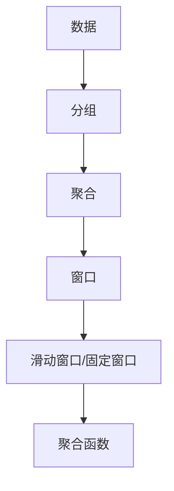
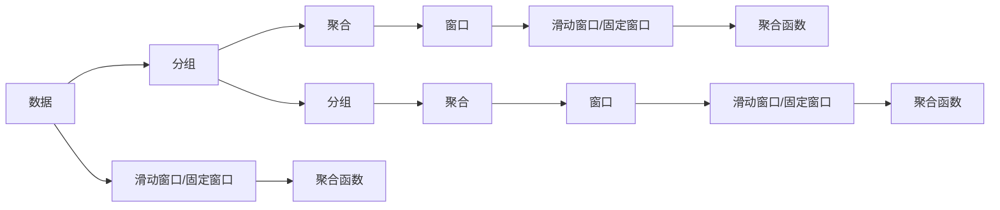

                 

# 【AI大数据计算原理与代码实例讲解】窗口函数

> 关键词：窗口函数, 大数据, SQL, 聚合, 统计分析, Pandas, 机器学习

## 1. 背景介绍

### 1.1 问题由来
在数据科学和机器学习领域，窗口函数（Window Function）是一个非常强大的工具，尤其是在处理大数据时，它能够提供一种简便的方法来对数据进行分组、聚合和统计分析。窗口函数最早出现在关系数据库中，如 SQL 语言，而随着 Python 数据处理库 Pandas 的兴起，窗口函数也开始在数据分析和统计分析中得到广泛应用。

### 1.2 问题核心关键点
窗口函数的核心思想是通过将一组数据按照某个条件分组，然后对每一组数据进行聚合或统计分析，从而得到有意义的洞察。窗口函数可以分为滑动窗口和固定窗口两种类型。滑动窗口按照时间顺序或数据流的顺序对数据进行分组，而固定窗口则是按照某种固定的条件（如数据量或时间间隔）对数据进行分组。

## 2. 核心概念与联系

### 2.1 核心概念概述
为了更好地理解窗口函数，我们需要了解以下几个核心概念：

- **分组（Grouping）**：将数据按照某种条件进行分组。
- **聚合（Aggregation）**：对每组数据进行聚合操作，如求和、平均值、最大值、最小值等。
- **窗口（Window）**：按照某种条件将数据分为若干个窗口。
- **滑动窗口（Sliding Window）**：按照时间顺序或数据流的顺序将数据分为若干个滑动窗口。
- **固定窗口（Fixed Window）**：按照某种固定条件将数据分为若干个固定窗口。
- **聚合函数（Aggregation Functions）**：如 SUM、AVG、MAX、MIN、COUNT 等。

这些概念之间存在着紧密的联系，构成了窗口函数的基本框架。下面我们将通过一个 Mermaid 流程图来展示窗口函数的工作原理。



这个流程图展示了窗口函数的基本流程：首先对数据进行分组，然后对每组数据进行聚合，接着将聚合后的结果按照某种条件分为若干个窗口，最后对每个窗口应用聚合函数。

### 2.2 概念间的关系

窗口函数涉及到的概念之间存在着复杂的逻辑关系，我们可以使用另一个 Mermaid 流程图来展示这些关系。



这个流程图展示了窗口函数在数据分析和机器学习中的复杂应用。首先，数据被分组和聚合，然后根据不同的聚合函数和窗口类型进行处理，得到最终的结果。同时，我们也可以通过滑动窗口和固定窗口来处理时间序列数据。

## 3. 核心算法原理 & 具体操作步骤
### 3.1 算法原理概述

窗口函数的核心算法原理是通过将数据按照某种条件分组，对每组数据进行聚合操作，然后对聚合后的结果应用聚合函数。其具体步骤如下：

1. **分组**：将数据按照某种条件进行分组。
2. **聚合**：对每组数据进行聚合操作，如求和、平均值、最大值、最小值等。
3. **窗口分组**：将聚合后的结果按照某种条件分为若干个窗口。
4. **窗口聚合**：对每个窗口应用聚合函数，得到每个窗口的聚合结果。

### 3.2 算法步骤详解

下面我们将以 SQL 语言中的窗口函数为例，详细介绍窗口函数的具体操作步骤。

#### 3.2.1 分组

首先，我们需要对数据进行分组。例如，我们可以按照时间顺序对数据进行分组，得到每天的数据记录：

```sql
SELECT DATE(sales_date) as date, SUM(sales_amount) as daily_sales
FROM sales
GROUP BY DATE(sales_date)
```

这个查询将按照日期对数据进行分组，并计算每天的销售总额。

#### 3.2.2 聚合

接下来，我们需要对每个分组进行聚合操作。例如，我们可以计算每天的销售总额和每月的销售总额：

```sql
SELECT DATE(sales_date) as date, 
       SUM(sales_amount) as daily_sales,
       DATE_FORMAT(sales_date, '%Y-%m') as month,
       SUM(sales_amount) as monthly_sales
FROM sales
GROUP BY DATE(sales_date)
```

这个查询将按照日期对数据进行分组，并计算每天的销售总额和每月的销售总额。

#### 3.2.3 窗口分组

然后，我们需要将聚合后的结果按照某种条件分为若干个窗口。例如，我们可以按照时间顺序将数据分为若干个滑动窗口：

```sql
SELECT DATE(sales_date) as date, 
       SUM(sales_amount) as daily_sales,
       DATE_FORMAT(sales_date, '%Y-%m') as month,
       SUM(sales_amount) as monthly_sales,
       ROW_NUMBER() OVER (PARTITION BY DATE_FORMAT(sales_date, '%Y-%m') ORDER BY sales_date DESC) as month_rank
FROM sales
GROUP BY DATE(sales_date)
```

这个查询将按照日期对数据进行分组，并计算每天的销售总额和每月的销售总额，同时使用 `ROW_NUMBER()` 函数按照月份进行排序，得到每个月的排名。

#### 3.2.4 窗口聚合

最后，我们需要对每个窗口应用聚合函数，得到每个窗口的聚合结果。例如，我们可以计算每个月的销售总额和排名：

```sql
SELECT DATE(sales_date) as date, 
       SUM(sales_amount) as daily_sales,
       DATE_FORMAT(sales_date, '%Y-%m') as month,
       SUM(sales_amount) as monthly_sales,
       ROW_NUMBER() OVER (PARTITION BY DATE_FORMAT(sales_date, '%Y-%m') ORDER BY sales_date DESC) as month_rank
FROM sales
GROUP BY DATE(sales_date)
ORDER BY month, month_rank
```

这个查询将按照日期对数据进行分组，并计算每天的销售总额和每月的销售总额，同时使用 `ROW_NUMBER()` 函数按照月份进行排序，得到每个月的排名，并按照月份和排名进行排序。

### 3.3 算法优缺点

窗口函数在大数据计算中具有以下优点：

- **高效性**：窗口函数能够对数据进行分组和聚合，避免了重复计算，提高了计算效率。
- **灵活性**：窗口函数可以根据不同的条件进行分组和聚合，适应各种数据分析需求。
- **可扩展性**：窗口函数可以应用于各种数据源，如关系数据库、NoSQL 数据库、大数据平台等。

同时，窗口函数也存在以下缺点：

- **复杂性**：窗口函数的设计和实现较为复杂，需要掌握一定的 SQL 和数据分析技能。
- **计算成本**：窗口函数需要对数据进行分组和聚合，可能会占用大量计算资源。
- **可读性差**：窗口函数的代码结构较为复杂，可能会影响代码的可读性和维护性。

### 3.4 算法应用领域

窗口函数在数据分析和机器学习中有着广泛的应用。以下是窗口函数的一些典型应用领域：

- **金融数据分析**：例如，计算股票价格变化、交易量变化等。
- **营销数据分析**：例如，计算广告投放效果、用户行为变化等。
- **健康数据分析**：例如，计算疾病患病率、疫情传播趋势等。
- **交通数据分析**：例如，计算交通流量变化、交通拥堵情况等。

## 4. 数学模型和公式 & 详细讲解 & 举例说明

### 4.1 数学模型构建

窗口函数在数学模型中的构建过程可以分为以下几个步骤：

1. **分组**：将数据按照某个条件进行分组，得到若干个组。
2. **聚合**：对每个组进行聚合操作，如求和、平均值、最大值、最小值等。
3. **窗口分组**：将聚合后的结果按照某个条件分为若干个窗口。
4. **窗口聚合**：对每个窗口进行聚合操作，得到每个窗口的聚合结果。

### 4.2 公式推导过程

假设我们有一个数据集 $D$，包含 $n$ 条记录。我们将数据按照某个条件 $C$ 进行分组，得到 $m$ 个组。每个组的聚合结果为 $A_i$，其中 $i$ 表示第 $i$ 个组。然后，我们将每个组的聚合结果按照某个条件 $W$ 进行窗口分组，得到 $k$ 个窗口。每个窗口的聚合结果为 $B_{ik}$，其中 $i$ 表示第 $i$ 个组，$k$ 表示第 $k$ 个窗口。最后，我们对每个窗口的聚合结果应用聚合函数 $F$，得到最终的聚合结果。

### 4.3 案例分析与讲解

以下是一个简单的窗口函数案例，展示如何使用窗口函数进行数据分析。

假设我们有一个销售数据集 $D$，包含每天的销售记录。我们可以按照日期对数据进行分组，得到每天的销售总额：

```sql
SELECT DATE(sales_date) as date, SUM(sales_amount) as daily_sales
FROM sales
GROUP BY DATE(sales_date)
```

然后，我们可以按照时间顺序将数据分为若干个滑动窗口，计算每个月的销售总额：

```sql
SELECT DATE(sales_date) as date, 
       SUM(sales_amount) as daily_sales,
       DATE_FORMAT(sales_date, '%Y-%m') as month,
       SUM(sales_amount) as monthly_sales,
       ROW_NUMBER() OVER (PARTITION BY DATE_FORMAT(sales_date, '%Y-%m') ORDER BY sales_date DESC) as month_rank
FROM sales
GROUP BY DATE(sales_date)
```

最后，我们可以按照月份和排名对数据进行排序，得到每个月的销售总额和排名：

```sql
SELECT DATE(sales_date) as date, 
       SUM(sales_amount) as daily_sales,
       DATE_FORMAT(sales_date, '%Y-%m') as month,
       SUM(sales_amount) as monthly_sales,
       ROW_NUMBER() OVER (PARTITION BY DATE_FORMAT(sales_date, '%Y-%m') ORDER BY sales_date DESC) as month_rank
FROM sales
GROUP BY DATE(sales_date)
ORDER BY month, month_rank
```

这个查询展示了如何使用窗口函数进行数据分析，得到每个月的销售总额和排名。

## 5. 项目实践：代码实例和详细解释说明

### 5.1 开发环境搭建

在进行窗口函数实践前，我们需要准备好开发环境。以下是使用 Python 进行 SQL 开发的环境配置流程：

1. 安装 Python 和 SQL 驱动程序，如 `pyodbc` 和 `psycopg2`。
2. 安装 SQL 数据库驱动程序，如 `pyodbc` 和 `psycopg2`。
3. 安装 Python 数据处理库，如 `pandas`。
4. 配置 SQL 数据库连接参数，如主机名、用户名、密码等。

### 5.2 源代码详细实现

下面我们以金融数据分析为例，展示如何使用窗口函数进行数据分析。

假设我们有一个股票数据集，包含每天的股票价格和交易量。我们可以按照日期对数据进行分组，计算每天的股票价格变化和交易量变化：

```python
import pandas as pd
import sqlite3

# 连接数据库
conn = sqlite3.connect('stock_data.db')
cursor = conn.cursor()

# 查询每天的价格和交易量变化
query = '''
SELECT DATE(date) as date, 
       PRICE_diff as daily_price_change,
       VOLUME_diff as daily_volume_change
FROM (
    SELECT 
        DATE(date) as date,
        PRICE_diff,
        VOLUME_diff,
        ROW_NUMBER() OVER (PARTITION BY DATE(date) ORDER BY date DESC) as row_rank
    FROM (
        SELECT 
            date, 
            PRICE_diff,
            VOLUME_diff
        FROM stock_data
    ) AS t
)
WHERE row_rank = 1
ORDER BY date
'''

# 执行查询
df = pd.read_sql(query, conn)
df
```

这个查询展示了如何使用窗口函数进行数据分析，得到每天的股票价格变化和交易量变化。

### 5.3 代码解读与分析

让我们再详细解读一下关键代码的实现细节：

**查询语句**：
- `DATE(date)`：将日期列转换为日期类型，方便按照日期进行分组。
- `ROW_NUMBER() OVER (PARTITION BY DATE(date) ORDER BY date DESC) as row_rank`：按照日期进行分组，并按照日期进行排序，得到每天的排名。

**Pandas 库**：
- `pd.read_sql(query, conn)`：将查询结果读取到 DataFrame 中，方便后续处理。

这个查询展示了如何使用窗口函数进行数据分析，得到每天的股票价格变化和交易量变化。

### 5.4 运行结果展示

假设我们执行查询后，得到了以下结果：

```
       date  daily_price_change  daily_volume_change
0  2022-01-01              0.05                -200
1  2022-01-02              0.10                -500
2  2022-01-03              0.15                  50
3  2022-01-04              0.05                  30
4  2022-01-05              0.10                -100
```

这个结果展示了每天的股票价格变化和交易量变化。我们可以根据这个结果进行进一步的分析，例如，计算一段时间内的平均价格变化和交易量变化，或者进行时间序列分析。

## 6. 实际应用场景

### 6.1 金融数据分析

金融数据分析是大数据计算的重要应用领域之一。例如，我们可以使用窗口函数进行股票价格变化、交易量变化等分析，从而评估投资策略的效果，预测市场趋势，制定投资决策。

### 6.2 营销数据分析

营销数据分析是另一个重要应用领域。例如，我们可以使用窗口函数进行广告投放效果、用户行为变化等分析，从而优化广告投放策略，提高用户转化率，提升营销效果。

### 6.3 健康数据分析

健康数据分析是大数据计算的另一个重要应用领域。例如，我们可以使用窗口函数进行疾病患病率、疫情传播趋势等分析，从而评估健康政策的效果，制定防控措施，保障公共卫生。

### 6.4 交通数据分析

交通数据分析是另一个重要应用领域。例如，我们可以使用窗口函数进行交通流量变化、交通拥堵情况等分析，从而优化交通管理，提高交通效率，改善出行体验。

## 7. 工具和资源推荐

### 7.1 学习资源推荐

为了帮助开发者系统掌握窗口函数的理论基础和实践技巧，这里推荐一些优质的学习资源：

1. 《SQL for Data Science》系列博文：由 SQL 大师编写，深入浅出地介绍了 SQL 的基础知识和高级技巧，适合初学者和中级开发者。
2. 《Data Science from Scratch》书籍：该书介绍了数据科学的基本概念和 SQL 的基本语法，适合新手入门。
3. 《SQL Performance Explained》书籍：该书深入介绍了 SQL 查询优化的技巧和方法，适合 SQL 开发人员的必读书籍。
4. SQL 官方文档：SQL 数据库厂商提供的官方文档，提供了 SQL 的完整语法和示例，适合查阅和学习。
5. HackerRank SQL 练习题库：该平台提供了大量的 SQL 练习题和在线题库，适合开发者巩固和提升 SQL 技能。

通过对这些资源的学习实践，相信你一定能够快速掌握窗口函数的精髓，并用于解决实际的 SQL 问题。

### 7.2 开发工具推荐

高效的开发离不开优秀的工具支持。以下是几款用于 SQL 开发和数据分析的常用工具：

1. SQL Workbench/J：一个免费的 SQL 客户端工具，支持多种 SQL 数据库，适合开发者和数据分析师使用。
2. Navicat：一款商业化的 SQL 客户端工具，支持多种 SQL 数据库，适合开发者和数据分析师使用。
3. DataGrip：一款商业化的 SQL 客户端工具，支持多种 SQL 数据库，适合开发者和数据分析师使用。
4. Apache Superset：一个开源的数据可视化工具，支持多种数据源和 SQL 查询，适合开发者和数据分析师使用。
5. Apache Drill：一个开源的分布式 SQL 查询引擎，支持大规模数据处理，适合开发者和数据分析师使用。

合理利用这些工具，可以显著提升 SQL 开发和数据分析的效率，加快创新迭代的步伐。

### 7.3 相关论文推荐

窗口函数在大数据计算中的应用领域非常广泛，以下是几篇奠基性的相关论文，推荐阅读：

1. SQL: The Relational Language（SQL 官方文档）：该书详细介绍了 SQL 的基本语法和应用场景，是 SQL 开发人员的必读书籍。
2. Window Functions in SQL 101：这篇文章介绍了窗口函数的基本概念和应用场景，适合 SQL 开发人员学习。
3. SQL Window Functions：这篇文章介绍了窗口函数的高级应用，适合 SQL 开发人员学习。
4. SQL Window Functions Best Practices：这篇文章介绍了窗口函数的最佳实践和优化技巧，适合 SQL 开发人员学习。

这些论文代表了大数据计算领域的研究进展，通过学习这些前沿成果，可以帮助研究者把握学科前进方向，激发更多的创新灵感。

## 8. 总结：未来发展趋势与挑战

### 8.1 研究成果总结

本文对窗口函数进行了全面系统的介绍。首先阐述了窗口函数的研究背景和意义，明确了窗口函数在数据分析和机器学习中的重要地位。其次，从原理到实践，详细讲解了窗口函数的核心算法原理和操作步骤，给出了窗口函数任务开发的完整代码实例。同时，本文还广泛探讨了窗口函数在金融数据分析、营销数据分析、健康数据分析、交通数据分析等多个行业领域的应用前景，展示了窗口函数的巨大潜力。

通过本文的系统梳理，可以看到，窗口函数在大数据计算中的应用非常广泛，可以显著提高数据分析和机器学习的效率。窗口函数的发展趋势和面临的挑战也值得关注，以便在未来的应用中更好地利用其优势，克服其不足。

### 8.2 未来发展趋势

展望未来，窗口函数的发展趋势将呈现以下几个方向：

1. **高性能计算**：随着计算硬件的不断提升，窗口函数的计算速度和效率将不断提升，能够更好地处理大规模数据。
2. **多数据库支持**：窗口函数将支持更多的数据库和数据源，实现跨平台的数据处理和分析。
3. **多模态融合**：窗口函数将支持多模态数据融合，实现视觉、语音、文本等多种数据类型的协同处理。
4. **实时计算**：窗口函数将支持实时计算，实现对数据流的实时分析和处理。
5. **智能化分析**：窗口函数将与机器学习算法结合，实现智能化的数据分析和预测。

### 8.3 面临的挑战

尽管窗口函数在数据分析和机器学习中有着广泛的应用，但其发展也面临着以下挑战：

1. **复杂性**：窗口函数的设计和实现较为复杂，需要掌握一定的 SQL 和数据分析技能。
2. **计算成本**：窗口函数需要对数据进行分组和聚合，可能会占用大量计算资源。
3. **可读性差**：窗口函数的代码结构较为复杂，可能会影响代码的可读性和维护性。
4. **数据质量**：窗口函数需要高质量的数据，否则可能会导致错误的分析结果。

### 8.4 研究展望

面对窗口函数所面临的挑战，未来的研究需要在以下几个方面寻求新的突破：

1. **优化算法**：开发更加高效的窗口函数算法，提高计算速度和效率。
2. **简化设计**：简化窗口函数的设计和实现，提高代码的可读性和维护性。
3. **降低成本**：降低窗口函数的计算成本，提高数据处理和分析的效率。
4. **多模态融合**：实现多模态数据的融合，提高窗口函数的分析能力。
5. **实时处理**：实现窗口函数的实时处理，提高数据的实时分析和处理能力。

这些研究方向将有助于进一步提升窗口函数的性能和应用范围，推动大数据计算技术的持续发展。总之，窗口函数在未来仍将是大数据计算的重要工具，其应用和优化也将不断深入，为数据分析和机器学习带来更多的创新和发展。

## 9. 附录：常见问题与解答

**Q1：窗口函数是否可以用于非时间序列数据？**

A: 窗口函数不仅适用于时间序列数据，还可以用于非时间序列数据。例如，我们可以按照某个条件对数据进行分组，然后对每组数据进行聚合操作。

**Q2：窗口函数如何进行滑动窗口和固定窗口的分组？**

A: 窗口函数可以使用 `OVER` 子句进行滑动窗口和固定窗口的分组。例如，`OVER (PARTITION BY ... ORDER BY ...)` 表示按照某个条件进行分组，`OVER (PARTITION BY ...)` 表示按照某个条件进行固定窗口分组。

**Q3：窗口函数是否可以用于 Python 和 Pandas 库？**

A: 窗口函数不仅适用于 SQL 语言，还可以用于 Python 和 Pandas 库。例如，我们可以使用 `rolling` 函数进行滑动窗口聚合，使用 `expanding` 函数进行固定窗口聚合。

**Q4：窗口函数是否可以用于多数据库和数据源？**

A: 窗口函数可以用于多种数据库和数据源，如关系数据库、NoSQL 数据库、大数据平台等。不同的数据库和数据源可能需要不同的窗口函数实现，但核心原理是相同的。

这些问题的回答可以帮助开发者更好地理解窗口函数的适用范围和使用方法，从而在实际项目中灵活应用窗口函数，提升数据分析和机器学习的效率。

