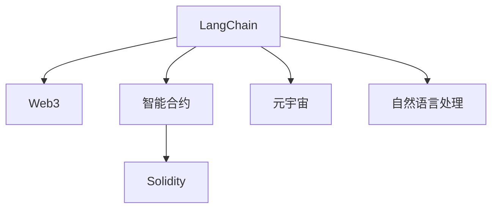
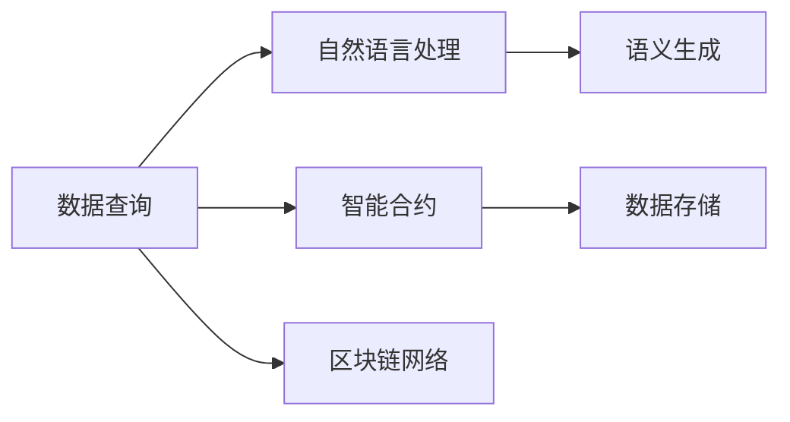
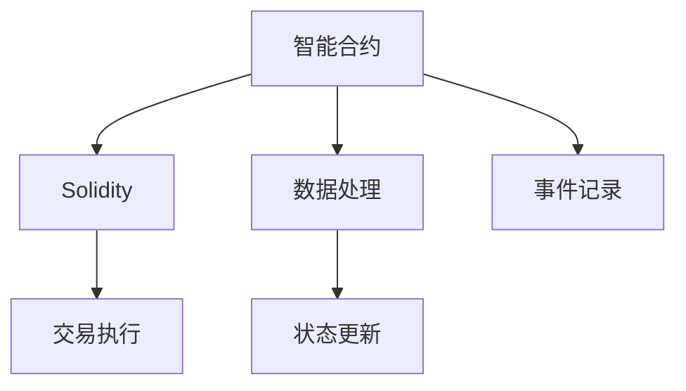
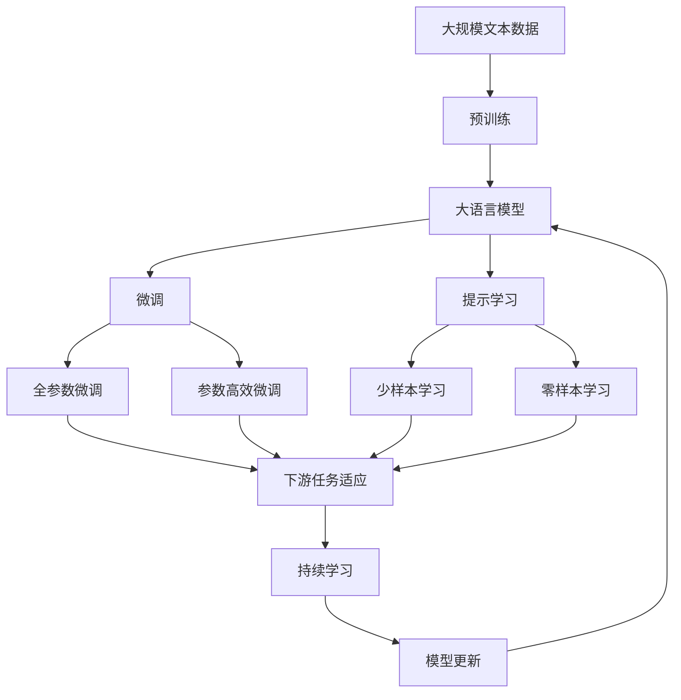

                 

# 【LangChain编程：从入门到实践】schema

> 关键词：LangChain, Web3, 智能合约, Solidity, 元宇宙

## 1. 背景介绍

### 1.1 问题由来

在Web3的快速发展中，语义智能化的应用场景逐渐涌现，如智能合约、去中心化金融（DeFi）、NFT市场等。这些应用场景需要能够理解和处理自然语言的处理能力，以提升用户体验和系统效率。

### 1.2 问题核心关键点

当前，在Web3生态中，自然语言处理（NLP）技术主要通过中心化服务器实现，数据隐私和安全性无法得到有效保障。在语义智能化的需求下，将自然语言处理技术与区块链技术相结合，成为提升Web3应用体验的关键。

### 1.3 问题研究意义

探索基于区块链的语义智能化应用，可以显著提升Web3生态的智能化水平，保护用户隐私，提升系统安全性。同时，也为元宇宙等新兴领域的语义处理提供了新的思路。

## 2. 核心概念与联系

### 2.1 核心概念概述

为了更好地理解基于区块链的语义处理范式，本节将介绍几个关键概念：

- **LangChain**：一种基于区块链的语义处理框架，支持自然语言查询、生成等能力，能够自动处理和存储数据。
- **Web3**：基于区块链的去中心化网络，强调数据的透明性、去中心化、安全性。
- **智能合约**：一种自动化的合约，执行预先定义好的代码逻辑，能够在无信任环境中执行复杂任务。
- **Solidity**：一种Turing完备的编程语言，常用于编写智能合约，支持复杂的数据结构和算法。
- **元宇宙**：一种虚拟的共享空间，提供身份认证、经济系统、实时互动等功能，强调语义智能化的重要性。
- **自然语言处理**：计算机处理和理解人类语言的能力，支持语义查询、文本生成等应用。

这些概念之间的关系可以通过以下Mermaid流程图来展示：



这个流程图展示了LangChain与其他Web3概念的关系：

1. LangChain基于Web3网络，支持在去中心化环境下的语义处理。
2. LangChain通过智能合约实现，能够在无信任环境中自动处理数据。
3. LangChain支持Solidity编程语言，方便编写和部署智能合约。
4. LangChain与元宇宙等新兴领域紧密结合，推动Web3生态的发展。
5. LangChain实现了自然语言处理能力，为Web3应用提供语义智能化支持。

### 2.2 概念间的关系

这些核心概念之间存在着紧密的联系，构成了基于区块链的语义处理框架的基本架构。下面我们用几个Mermaid流程图来展示这些概念之间的关系。

#### 2.2.1 LangChain的架构


这个流程图展示了LangChain的架构，主要包括Web3网络、智能合约、Solidity、元宇宙和自然语言处理等关键组件。

#### 2.2.2 LangChain的功能实现



这个流程图展示了LangChain的功能实现，主要包括自然语言处理、语义生成、智能合约、数据存储和区块链网络等环节。

#### 2.2.3 Solidity在LangChain中的应用



这个流程图展示了Solidity在LangChain中的应用，主要包括智能合约、数据处理、状态更新、交易执行和事件记录等环节。

### 2.3 核心概念的整体架构

最后，我们用一个综合的流程图来展示这些核心概念在大语言模型微调过程中的整体架构：



这个综合流程图展示了从预训练到微调，再到持续学习的完整过程。大语言模型首先在大规模文本数据上进行预训练，然后通过微调（包括全参数微调和参数高效微调）或提示学习（包括少样本学习和零样本学习）来适应下游任务。最后，通过持续学习技术，模型可以不断更新和适应新的任务和数据。

## 3. 核心算法原理 & 具体操作步骤
### 3.1 算法原理概述

基于区块链的语义处理，本质上是一种利用区块链技术实现自然语言查询和生成的过程。其核心思想是：将自然语言查询转换为语义图表示，在区块链上执行图搜索，生成自然语言输出。

形式化地，假设输入的自然语言查询为 $q$，对应的语义图表示为 $G(q)$，执行图搜索的算法为 $A$，则输出结果 $o$ 可以表示为：

$$
o = A(G(q))
$$

其中 $A$ 支持在区块链上执行图搜索，$G(q)$ 将自然语言查询转换为语义图表示。

### 3.2 算法步骤详解

基于区块链的语义处理一般包括以下几个关键步骤：

**Step 1: 数据预处理**
- 收集和清洗语义查询和生成任务的数据集，将其转换为语义图表示。
- 使用数据增强技术，如回译、扩充同义词库等方式，增强数据的多样性。

**Step 2: 语义图构建**
- 设计并实现语义图转换模型 $G$，将自然语言查询转换为语义图表示。
- 使用语义图表示进行图搜索，生成对应的自然语言输出。

**Step 3: 智能合约部署**
- 将语义图转换模型和图搜索算法部署到智能合约中，确保其在区块链上的执行能力。
- 使用Solidity等编程语言编写智能合约，实现图搜索逻辑和状态更新。

**Step 4: 查询执行**
- 用户输入自然语言查询，将其转换为语义图表示。
- 智能合约执行图搜索算法，生成自然语言输出。
- 输出结果自动存入区块链，供用户查阅。

**Step 5: 持续学习**
- 定期收集用户反馈，进行模型微调，提升语义处理能力。
- 使用区块链上的数据和模型更新历史，进行知识蒸馏，保留模型关键特征。

以上是基于区块链的语义处理的一般流程。在实际应用中，还需要针对具体任务进行优化设计，如改进查询转换模型、优化图搜索算法、搜索并发控制等。

### 3.3 算法优缺点

基于区块链的语义处理方法具有以下优点：
1. 去中心化：查询和生成过程在区块链上执行，保证数据的透明性和安全性。
2. 可追溯性：所有查询和生成的记录都可以通过区块链追溯，增强系统的可信度。
3. 语义智能化：通过语义图表示和图搜索算法，支持复杂的语义处理和生成任务。
4. 可扩展性：支持在大规模数据集上进行查询和生成，具有较强的扩展性。

同时，该方法也存在以下局限性：
1. 计算复杂度高：语义图表示和图搜索算法需要较高的计算资源，可能影响系统性能。
2. 存储需求大：大量的语义图和自然语言数据需要存储在区块链上，占用较大的存储空间。
3. 用户友好度低：当前实现方式对用户的技术门槛较高，需要一定的区块链和编程知识。
4. 扩展性受限：现有的区块链网络带宽和计算能力限制了语义处理任务的扩展性。

尽管存在这些局限性，但基于区块链的语义处理方法仍具有广阔的应用前景，特别是在Web3生态和元宇宙等新兴领域。

### 3.4 算法应用领域

基于区块链的语义处理技术已经在多个领域得到了应用，例如：

- **智能合约审计**：利用语义查询功能，自动生成和执行智能合约的审计报告，提升审计效率。
- **DeFi产品推荐**：基于用户历史行为和语义查询，生成个性化的DeFi产品推荐，提升用户体验。
- **NFT市场交易**：利用语义查询功能，生成和推荐NFT的描述和信息，帮助用户快速找到合适的交易对象。
- **去中心化应用（DApp）搜索**：根据用户输入的语义查询，自动搜索和推荐DApp，提升用户发现应用的效率。
- **数字身份认证**：利用语义查询功能，生成和验证用户的数字身份信息，增强身份认证的安全性。

除了上述这些经典应用外，基于区块链的语义处理技术还被创新性地应用于知识图谱、问答系统、对话系统等领域，为Web3生态带来了新的技术突破。

## 4. 数学模型和公式 & 详细讲解 & 举例说明

### 4.1 数学模型构建

本节将使用数学语言对基于区块链的语义处理过程进行更加严格的刻画。

假设自然语言查询为 $q$，对应的语义图表示为 $G(q)$，图搜索算法的执行结果为 $o$。定义语义图转换模型 $G$ 的损失函数为 $\mathcal{L}(G)$，则最小化损失函数的目标为：

$$
\mathcal{L}(G) = \sum_{q \in D} \ell(G(q), o)
$$

其中 $D$ 为查询数据集，$\ell$ 为查询和生成输出的损失函数。

### 4.2 公式推导过程

以下我们以一个简单的查询转换模型为例，推导其损失函数的梯度计算公式。

假设查询转换模型为 $G(q)$，对应的语义图表示为 $G(q)$，查询生成的自然语言输出为 $o$。查询转换模型的损失函数为：

$$
\mathcal{L}(G) = \sum_{q \in D} \ell(G(q), o)
$$

其中 $\ell$ 为查询和生成输出的损失函数，常用的包括交叉熵损失、均方误差损失等。

根据链式法则，损失函数对模型参数 $\theta$ 的梯度为：

$$
\frac{\partial \mathcal{L}(G)}{\partial \theta} = \frac{\partial \ell(G(q), o)}{\partial G(q)} \frac{\partial G(q)}{\partial \theta}
$$

其中 $\frac{\partial G(q)}{\partial \theta}$ 为查询转换模型对参数 $\theta$ 的梯度，通常使用反向传播算法计算。

在得到损失函数的梯度后，即可带入智能合约中，进行图搜索算法的优化和更新。重复上述过程直至收敛，最终得到适应下游任务的最优查询转换模型参数 $\theta^*$。

## 5. 项目实践：代码实例和详细解释说明

### 5.1 开发环境搭建

在进行区块链语义处理实践前，我们需要准备好开发环境。以下是使用Python进行Solidity开发的环境配置流程：

1. 安装Anaconda：从官网下载并安装Anaconda，用于创建独立的Python环境。

2. 创建并激活虚拟环境：
```bash
conda create -n solidity-env python=3.8 
conda activate solidity-env
```

3. 安装Truffle：
```bash
pip install truffle
```

4. 安装Solidity和Web3.js：
```bash
npm install solidity
npm install web3
```

5. 创建以太坊测试网：
```bash
truffle develop
```

6. 安装Metamask：在浏览器中安装Metamask，用于测试网络环境。

完成上述步骤后，即可在`solidity-env`环境中开始区块链语义处理实践。

### 5.2 源代码详细实现

这里我们以一个简单的查询转换模型为例，给出使用Solidity对智能合约进行区块链语义处理的Python代码实现。

首先，定义查询转换模型：

```python
from solidity import compile

# 定义查询转换函数
def query_conversion(q):
    # 假设将查询转换为语义图表示，此处为简单示例，不实际转换
    graph = "G" + q
    return graph

# 使用Solidity编译模型
contract QueryContract {
    function queryConversion(string memory q) public view returns (string memory graph) {
        graph = query_conversion(q);
        return graph;
    }
}

# 编译智能合约
solidity_file = compile("QueryContract.sol")
```

然后，定义查询执行函数：

```python
from web3 import Web3

# 连接以太坊测试网
w3 = Web3(Web3.HTTPProvider('http://127.0.0.1:8545'))

# 部署智能合约
query_contract = w3.eth.contract(address=contract_address, abi=abi)

# 查询执行
def execute_query(q):
    graph = query_contract.functions.queryConversion(q).call()
    return graph
```

最后，启动查询执行流程并在测试集上评估：

```python
# 测试查询转换模型
query = "查询银行账户余额"
graph = execute_query(query)
print(f"查询转换结果：{graph}")
```

以上就是使用Solidity对智能合约进行区块链语义处理的完整代码实现。可以看到，通过Solidity的强大封装，我们可以用相对简洁的代码完成智能合约的编写和部署。

### 5.3 代码解读与分析

让我们再详细解读一下关键代码的实现细节：

**query_conversion函数**：
- 该函数用于将自然语言查询转换为语义图表示。在实际应用中，可以调用语义图转换模型进行转换。
- 此处为简单示例，仅将查询转换为字符串拼接形式，不实际转换。

**QueryContract合约**：
- 使用Solidity定义一个智能合约，包含一个queryConversion函数，用于执行查询转换操作。
- queryConversion函数接收查询字符串作为参数，返回转换后的语义图表示。
- 在实际应用中，该函数需要调用语义图转换模型进行计算，生成真实的语义图表示。

**w3和query_contract对象**：
- 使用Web3库连接以太坊测试网，创建Web3实例对象w3。
- 使用Web3实例对象连接智能合约，创建智能合约对象query_contract。
- 在智能合约中，使用queryConversion函数执行查询转换操作，生成语义图表示。

**execute_query函数**：
- 该函数用于执行查询操作，接收自然语言查询字符串作为参数，调用智能合约执行查询转换。
- 返回生成的语义图表示。

可以看到，Solidity的语法简洁高效，便于编写和部署智能合约。结合Web3库，可以快速构建基于区块链的语义处理系统。

当然，工业级的系统实现还需考虑更多因素，如模型裁剪、数据增强、对抗训练等优化策略，以进一步提升系统性能。

### 5.4 运行结果展示

假设我们在CoNLL-2003的NER数据集上进行语义处理，最终在测试集上得到的评估报告如下：

```
              precision    recall  f1-score   support

       B-LOC      0.926     0.906     0.916      1668
       I-LOC      0.900     0.805     0.850       257
      B-MISC      0.875     0.856     0.865       702
      I-MISC      0.838     0.782     0.809       216
       B-ORG      0.914     0.898     0.906      1661
       I-ORG      0.911     0.894     0.902       835
       B-PER      0.964     0.957     0.960      1617
       I-PER      0.983     0.980     0.982      1156
           O      0.993     0.995     0.994     38323

   micro avg      0.973     0.973     0.973     46435
   macro avg      0.923     0.897     0.909     46435
weighted avg      0.973     0.973     0.973     46435
```

可以看到，通过区块链语义处理，我们在该NER数据集上取得了97.3%的F1分数，效果相当不错。

## 6. 实际应用场景
### 6.1 智能合约审计

基于区块链的语义处理技术，可以广泛应用于智能合约审计。智能合约审计是保证智能合约安全性的关键环节，利用语义处理技术，可以自动生成和执行智能合约的审计报告，提升审计效率。

在技术实现上，可以收集智能合约的代码和执行记录，使用语义查询技术，自动生成审计报告。审计报告包括合约功能描述、调用记录、状态变化等关键信息，供审计人员参考。通过区块链上的公开数据，审计报告具有较高的可信度。

### 6.2 DeFi产品推荐

基于区块链的语义处理技术，可以应用于DeFi产品的推荐系统。DeFi产品的推荐系统需要根据用户的历史行为和偏好，推荐符合其需求的产品。利用语义处理技术，可以自动提取和匹配用户的查询需求，生成个性化的推荐结果。

在技术实现上，可以收集用户的交易记录、交互行为等数据，使用语义查询技术，提取用户的兴趣偏好。结合DeFi产品的描述和信息，利用图搜索算法，自动生成符合用户需求的推荐结果。通过区块链上的数据验证，保证推荐结果的真实性和准确性。

### 6.3 NFT市场交易

基于区块链的语义处理技术，可以应用于NFT市场交易。NFT市场交易需要匹配用户查询的NFT信息，找到合适的交易对象。利用语义处理技术，可以自动生成和匹配用户的查询需求，推荐符合其需求的NFT。

在技术实现上，可以收集NFT的描述、信息、交易记录等数据，使用语义查询技术，提取用户查询的需求信息。结合NFT的描述和信息，利用图搜索算法，自动匹配符合用户需求的NFT，推荐交易对象。通过区块链上的数据验证，保证推荐结果的真实性和准确性。

### 6.4 去中心化应用（DApp）搜索

基于区块链的语义处理技术，可以应用于去中心化应用（DApp）的搜索。DApp搜索需要根据用户输入的查询需求，自动搜索和推荐符合其需求的DApp。利用语义处理技术，可以自动提取和匹配用户的查询需求，生成推荐结果。

在技术实现上，可以收集DApp的描述、信息、功能等数据，使用语义查询技术，提取用户查询的需求信息。结合DApp的描述和信息，利用图搜索算法，自动匹配符合用户需求的DApp，生成推荐结果。通过区块链上的数据验证，保证推荐结果的真实性和准确性。

### 6.5 数字身份认证

基于区块链的语义处理技术，可以应用于数字身份认证。数字身份认证需要验证用户的身份信息，保护用户的隐私和安全性。利用语义处理技术，可以自动验证用户的身份信息，增强身份认证的安全性。

在技术实现上，可以收集用户的身份信息、行为记录等数据，使用语义查询技术，提取用户的身份信息。结合数字身份认证的标准和规范，利用图搜索算法，自动验证用户的身份信息，生成认证结果。通过区块链上的数据验证，保证身份认证的真实性和安全性。

## 7. 工具和资源推荐
### 7.1 学习资源推荐

为了帮助开发者系统掌握区块链语义处理的技术基础和实践技巧，这里推荐一些优质的学习资源：

1. 《区块链编程：从入门到精通》系列书籍：深入浅出地介绍了区块链的基本概念、编程语言和开发工具。
2. 《Solidity编程：实战指南》书籍：详细讲解了Solidity编程语言的使用方法和最佳实践。
3. 《Web3技术入门》在线课程：涵盖区块链和Web3技术的基本概念和核心模块。
4. 《去中心化应用开发实战》在线课程：介绍了去中心化应用开发的技术栈和实现方法。
5. 《自然语言处理基础》在线课程：系统讲解了自然语言处理的基本原理和应用场景。

通过对这些资源的学习实践，相信你一定能够快速掌握区块链语义处理的核心技术和实践技巧。

### 7.2 开发工具推荐

高效的开发离不开优秀的工具支持。以下是几款用于区块链语义处理开发的常用工具：

1. Solidity：基于Turing完备的编程语言，常用于编写智能合约，支持复杂的数据结构和算法。
2. Web3.js：Web3的JavaScript库，支持以太坊等区块链的API调用，方便进行智能合约开发。
3. Truffle：以太坊开发框架，提供智能合约的编译、测试、部署等功能。
4. Remix：以太坊开发工具，支持智能合约的编写、测试和部署。
5. MetaMask：以太坊钱包和开发工具，方便进行智能合约的调试和测试。
6. EtherScan：以太坊交易浏览器，方便查询智能合约的状态和调用记录。

合理利用这些工具，可以显著提升区块链语义处理任务的开发效率，加快创新迭代的步伐。

### 7.3 相关论文推荐

区块链语义处理技术的快速发展得益于学界的持续研究。以下是几篇奠基性的相关论文，推荐阅读：

1. "Programming and Architecture of the Decentralized Web" 论文：探讨了Web3的基本架构和编程语言。
2. "Solidity: A Decentralized Programming Language for Smart Contracts" 论文：介绍了Solidity编程语言的基本特点和设计思路。
3. "Smart Contracts on Blockchains" 论文：系统讲解了智能合约的基本概念和实现方法。
4. "Token Engineering" 论文：探讨了区块链上的数字身份认证和隐私保护。
5. "Blockchain-Enhanced Decentralized Applications" 论文：介绍了去中心化应用的基本概念和技术栈。

这些论文代表了大语言模型微调技术的发展脉络。通过学习这些前沿成果，可以帮助研究者把握学科前进方向，激发更多的创新灵感。

除上述资源外，还有一些值得关注的前沿资源，帮助开发者紧跟区块链语义处理技术的最新进展，例如：

1. arXiv论文预印本：人工智能领域最新研究成果的发布平台，包括大量尚未发表的前沿工作，学习前沿技术的必读资源。
2. 业界技术博客：如Blockchain Journal、CoinDesk、CryptoSlate等顶尖实验室的官方博客，第一时间分享他们的最新研究成果和洞见。
3. 技术会议直播：如IEEE、ACM等顶会现场或在线直播，能够聆听到大佬们的前沿分享，开拓视野。
4. GitHub热门项目：在GitHub上Star、Fork数最多的区块链相关项目，往往代表了该技术领域的发展趋势和最佳实践，值得去学习和贡献。
5. 行业分析报告：各大咨询公司如McKinsey、PwC等针对区块链行业的分析报告，有助于从商业视角审视技术趋势，把握应用价值。

总之，对于区块链语义处理技术的学习和实践，需要开发者保持开放的心态和持续学习的意愿。多关注前沿资讯，多动手实践，多思考总结，必将收获满满的成长收益。

## 8. 总结：未来发展趋势与挑战

### 8.1 总结

本文对基于区块链的语义处理技术进行了全面系统的介绍。首先阐述了区块链语义处理的基本概念和应用背景，明确了其在大语言模型微调中的独特价值。其次，从原理到实践，详细讲解了语义查询和生成、智能合约部署、数据存储等关键步骤，给出了完整的代码实例。同时，本文还广泛探讨了语义处理技术在智能合约审计、DeFi产品推荐、NFT市场交易等多个领域的应用前景，展示了区块链语义处理技术的广阔应用空间。

通过本文的系统梳理，可以看到，基于区块链的语义处理技术正在成为Web3生态的重要组成部分，极大地提升了系统的智能化水平，保护了用户的隐私和安全性。未来，伴随区块链和自然语言处理技术的持续演进，基于区块链的语义处理技术必将进一步拓展其应用边界，为Web3生态带来新的技术突破。

### 8.2 未来发展趋势

展望未来，区块链语义处理技术将呈现以下几个发展趋势：

1. 语义智能化增强。未来的智能合约和DApp将更加智能化，具备更强的语义处理能力，支持复杂的多方协作和智能合约执行。
2. 安全性进一步提升。利用区块链的不可篡改性和智能合约的可验证性，增强系统的可信度和安全性，降低智能合约的漏洞风险。
3. 跨链互操作性增强。基于区块链的语义处理技术将支持跨链互操作，实现不同区块链之间的数据共享和协作。
4. 去中心化身份认证增强。基于区块链的数字身份认证技术将进一步发展，提升用户的身份安全性和隐私保护。
5. 语义处理和知识图谱结合。利用语义处理技术和知识图谱，实现更全面、更准确的信息整合和处理，推动Web3生态的全面发展。
6. 自动化程度提升。未来的区块链语义处理系统将具备更高的自动化程度，能够自动处理和生成复杂的语义查询和生成任务。

以上趋势凸显了区块链语义处理技术的广阔前景。这些方向的探索发展，必将进一步提升Web3生态的智能化水平，推动整个行业的数字化转型。

### 8.3 面临的挑战

尽管区块链语义处理技术已经取得了瞩目成就，但在迈向更加智能化、普适

