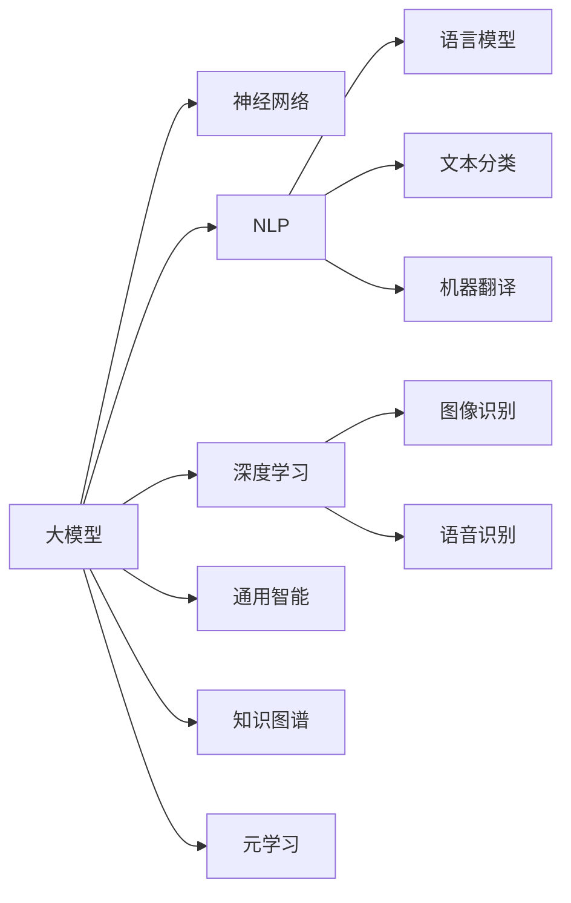
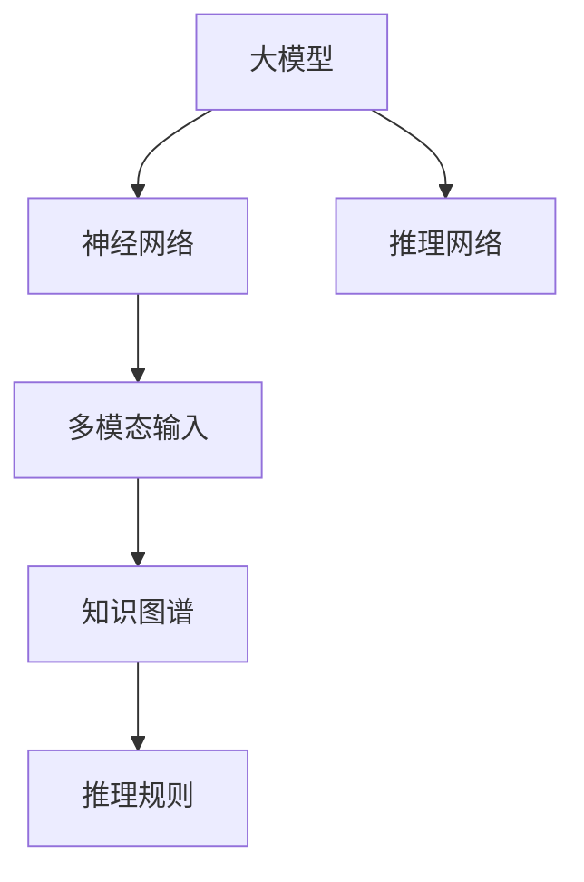
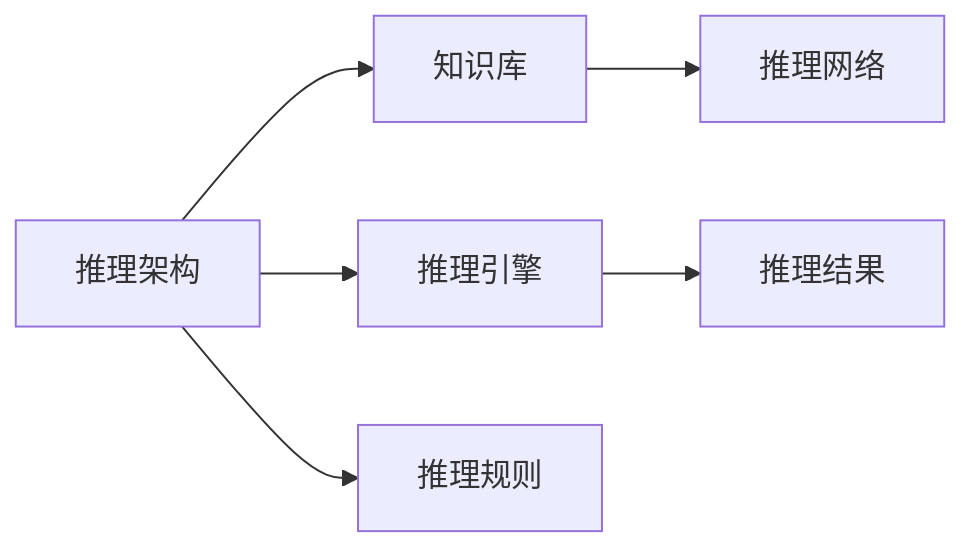
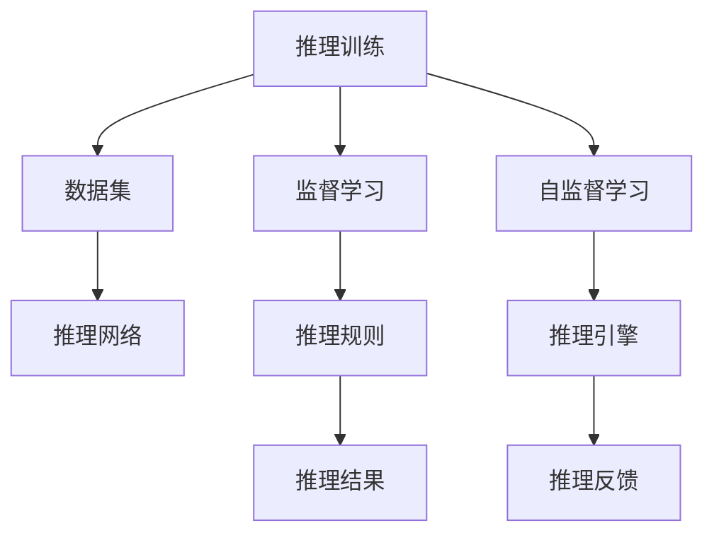
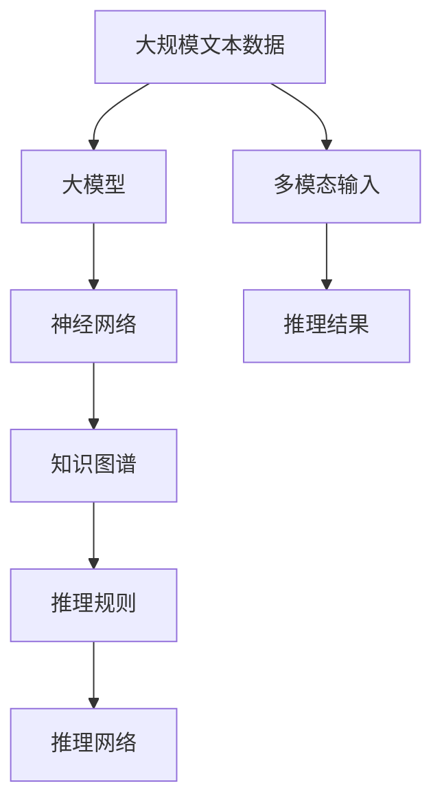

                 

# 【大模型应用开发 动手做AI Agent】Agent的大脑：大模型的通用推理能力

> 关键词：大模型,推理能力,神经网络,自然语言处理(NLP),深度学习,通用智能,知识图谱,元学习

## 1. 背景介绍

### 1.1 问题由来

近年来，深度学习技术的飞速发展，特别是大模型的涌现，极大地推动了人工智能(AI)技术的发展。这些大模型在语言理解、图像识别、自然语言生成等众多领域取得了显著成就。然而，尽管这些模型在大规模数据上表现出强大的学习能力，但在某些复杂场景下，其推理能力仍显得不足。

为了应对这一挑战，研究者们开始探索如何在大模型基础上构建具有通用推理能力的AI agent。这些AI agent可以理解复杂语境，进行逻辑推理，实现基于知识的任务执行。本文旨在探讨基于大模型的AI agent的通用推理能力，并介绍其实现原理和实践方法。

### 1.2 问题核心关键点

AI agent的核心关键点在于其推理能力，即通过模型学习和推理解决复杂任务的能力。实现这一能力的核心在于大模型的通用表征能力，以及通过自监督学习或监督学习获得的丰富语义知识。

本文将详细介绍如何在大模型基础上构建具有通用推理能力的AI agent，包括：
- 大模型的推理能力原理
- 通用的推理架构设计
- 推理能力的训练方法和应用场景

## 2. 核心概念与联系

### 2.1 核心概念概述

为更好地理解基于大模型的AI agent的推理能力，本节将介绍几个密切相关的核心概念：

- 大模型(Large Models)：以深度神经网络为代表的大规模预训练模型，如BERT、GPT等。这些模型通过在海量数据上自监督学习，学习到丰富的语义表示。
- 神经网络(Neural Networks)：基于多层神经元组成的模型，通过反向传播算法进行训练，可以学习到复杂的非线性映射关系。
- 自然语言处理(NLP)：利用AI技术对人类语言进行理解和生成，如文本分类、语言模型、机器翻译等。
- 深度学习(Deep Learning)：一种利用多层神经网络进行数据表示学习的技术，广泛应用于图像识别、语音识别、NLP等领域。
- 通用智能(General Intelligence)：指AI系统在多领域、多任务上展现出类似人类的智能。
- 知识图谱(Knowledge Graph)：一种结构化的语义知识表示形式，用于描述实体之间的关系。
- 元学习(Meta-Learning)：通过学习如何学习来提升模型泛化能力，能够在不同任务上快速适应和迁移。

这些核心概念之间的逻辑关系可以通过以下Mermaid流程图来展示：



这个流程图展示了核心概念之间的联系：大模型通过神经网络学习丰富的语义知识，应用于NLP和深度学习任务，进一步发展为具有通用智能和知识图谱基础的AI agent。同时，通过元学习提升了模型的泛化能力。

### 2.2 概念间的关系

这些核心概念之间存在着紧密的联系，形成了大模型和AI agent推理能力的完整生态系统。下面我们通过几个Mermaid流程图来展示这些概念之间的关系。

#### 2.2.1 大模型的推理能力



这个流程图展示了基于大模型的推理能力实现过程：大模型通过神经网络处理多模态输入，融合知识图谱中的语义知识，并通过推理网络执行逻辑推理。

#### 2.2.2 通用的推理架构设计



这个流程图展示了通用的推理架构：通过知识库存储语义知识，利用推理引擎执行推理操作，结合推理规则进行结果评估。推理网络在此过程中扮演关键角色。

#### 2.2.3 推理能力的训练方法和应用场景



这个流程图展示了推理能力的训练过程：通过监督学习和自监督学习训练推理网络，结合推理规则和推理引擎进行推理，利用推理反馈进行模型优化。

### 2.3 核心概念的整体架构

最后，我们用一个综合的流程图来展示这些核心概念在大模型和AI agent推理能力构建过程中的整体架构：



这个综合流程图展示了从数据预处理到大模型推理能力构建的完整过程，体现了各组件之间的紧密联系。

## 3. 核心算法原理 & 具体操作步骤
### 3.1 算法原理概述

基于大模型的AI agent推理能力的核心原理在于利用深度神经网络进行复杂的语义表示学习，并通过推理网络执行逻辑推理。其基本流程包括：

1. **数据预处理**：将输入数据转换为神经网络可处理的形式，如将文本转换为token ids，将图像转换为像素矩阵。
2. **特征提取**：通过神经网络将输入数据映射为高维向量表示。
3. **推理网络**：利用神经网络中的推理规则，对高维向量进行逻辑推理。
4. **结果输出**：将推理结果转换为最终输出，如文本生成、图像生成等。

### 3.2 算法步骤详解

以下详细介绍基于大模型的AI agent推理能力构建的具体步骤：

**Step 1: 数据预处理**

1. 收集任务相关的数据集。数据集应包含丰富的多模态输入，如文本、图像、语音等。
2. 对数据进行清洗和预处理，如去除噪声、标准化、分词等。
3. 将数据转换为神经网络可处理的形式，如将文本转换为token ids，将图像转换为像素矩阵。

**Step 2: 特征提取**

1. 使用大模型（如BERT、GPT等）对输入数据进行预训练，学习丰富的语义表示。
2. 通过多个神经网络层（如Transformer、LSTM等）进行特征提取，得到高维向量表示。
3. 使用正则化技术（如Dropout、L2正则）减少过拟合，提高特征提取的泛化能力。

**Step 3: 推理网络设计**

1. 根据任务需求，设计推理网络的结构，如前馈神经网络、循环神经网络等。
2. 定义推理网络中的逻辑推理规则，如因果推理、逻辑推理、证据推理等。
3. 利用推理规则对高维向量进行逻辑推理，得到推理结果。

**Step 4: 结果输出**

1. 将推理结果转换为最终的输出形式，如文本、图像等。
2. 利用解码器（如Beam Search、Top-K Sampling等）生成最终的输出序列。
3. 进行后处理，如语言模型校正、图像后处理等。

**Step 5: 模型训练和优化**

1. 使用监督学习和自监督学习对推理网络进行训练，最小化推理误差。
2. 使用元学习技术提升推理网络的泛化能力，能够在不同任务上快速适应。
3. 使用优化算法（如Adam、SGD等）更新模型参数，优化推理性能。

### 3.3 算法优缺点

基于大模型的AI agent推理能力具有以下优点：

1. **强大的语义表示能力**：大模型通过大规模预训练，学习到丰富的语义表示，能够处理复杂的自然语言任务。
2. **可扩展性强**：利用神经网络的结构和参数设计，可以根据任务需求灵活扩展推理能力。
3. **泛化能力强**：通过元学习和自监督学习，推理网络能够在不同任务上快速适应和迁移。

同时，也存在一些缺点：

1. **数据依赖性强**：推理网络需要大量的标注数据进行训练，数据获取成本较高。
2. **计算资源需求高**：大模型和推理网络需要大量的计算资源，部署和运行成本较高。
3. **推理过程复杂**：推理网络中的逻辑推理规则较为复杂，需要一定的专业知识进行设计和优化。

### 3.4 算法应用领域

基于大模型的AI agent推理能力广泛应用于以下几个领域：

1. **自然语言处理(NLP)**：如文本分类、情感分析、机器翻译、问答系统等。
2. **计算机视觉(CV)**：如图像识别、物体检测、图像生成等。
3. **语音识别(Speech Recognition)**：如语音转文本、语音合成等。
4. **医疗诊断**：如医学影像分析、病历分析等。
5. **金融分析**：如市场情绪分析、金融事件监测等。
6. **自动驾驶**：如场景理解、决策支持等。

以上领域中，NLP是应用最为广泛的领域，大模型和推理网络在文本分类、情感分析等任务上表现出色，推动了NLP技术的发展。

## 4. 数学模型和公式 & 详细讲解  
### 4.1 数学模型构建

我们以自然语言处理(NLP)为例，介绍基于大模型的AI agent推理能力构建的数学模型。

假设输入文本为 $x = \{x_1, x_2, \ldots, x_n\}$，其中 $x_i$ 表示输入文本中的第 $i$ 个单词。目标是将输入文本转换为对应的输出文本 $y$。

**Step 1: 数据预处理**

1. 对输入文本进行分词，转换为token ids序列 $X = \{x_1, x_2, \ldots, x_n\}$。
2. 对token ids序列进行padding和truncation，使其长度固定。
3. 将token ids序列转换为神经网络可处理的形式，如将文本转换为token ids序列。

**Step 2: 特征提取**

1. 使用大模型（如BERT、GPT等）对token ids序列进行预训练，得到语义向量表示 $Z = \{z_1, z_2, \ldots, z_n\}$。
2. 通过多个神经网络层（如Transformer、LSTM等）对语义向量进行特征提取，得到高维向量表示 $H = \{h_1, h_2, \ldots, h_n\}$。
3. 利用正则化技术（如Dropout、L2正则）减少过拟合，提高特征提取的泛化能力。

**Step 3: 推理网络设计**

1. 设计推理网络的结构，如前馈神经网络、循环神经网络等。
2. 定义推理网络中的逻辑推理规则，如因果推理、逻辑推理、证据推理等。
3. 利用推理规则对高维向量进行逻辑推理，得到推理结果 $P = \{p_1, p_2, \ldots, p_n\}$。

**Step 4: 结果输出**

1. 将推理结果 $P$ 转换为最终的输出形式，如文本、图像等。
2. 利用解码器（如Beam Search、Top-K Sampling等）生成最终的输出序列 $Y = \{y_1, y_2, \ldots, y_m\}$。
3. 进行后处理，如语言模型校正、图像后处理等。

### 4.2 公式推导过程

以下我们将使用数学语言对基于大模型的AI agent推理能力构建过程进行更加严格的刻画。

记输入文本为 $x = \{x_1, x_2, \ldots, x_n\}$，目标是将输入文本转换为对应的输出文本 $y$。

**Step 1: 数据预处理**

1. 对输入文本进行分词，转换为token ids序列 $X = \{x_1, x_2, \ldots, x_n\}$。
2. 对token ids序列进行padding和truncation，使其长度固定。
3. 将token ids序列转换为神经网络可处理的形式，如将文本转换为token ids序列。

**Step 2: 特征提取**

1. 使用大模型（如BERT、GPT等）对token ids序列进行预训练，得到语义向量表示 $Z = \{z_1, z_2, \ldots, z_n\}$。
2. 通过多个神经网络层（如Transformer、LSTM等）对语义向量进行特征提取，得到高维向量表示 $H = \{h_1, h_2, \ldots, h_n\}$。
3. 利用正则化技术（如Dropout、L2正则）减少过拟合，提高特征提取的泛化能力。

**Step 3: 推理网络设计**

1. 设计推理网络的结构，如前馈神经网络、循环神经网络等。
2. 定义推理网络中的逻辑推理规则，如因果推理、逻辑推理、证据推理等。
3. 利用推理规则对高维向量进行逻辑推理，得到推理结果 $P = \{p_1, p_2, \ldots, p_n\}$。

**Step 4: 结果输出**

1. 将推理结果 $P$ 转换为最终的输出形式，如文本、图像等。
2. 利用解码器（如Beam Search、Top-K Sampling等）生成最终的输出序列 $Y = \{y_1, y_2, \ldots, y_m\}$。
3. 进行后处理，如语言模型校正、图像后处理等。

### 4.3 案例分析与讲解

**案例一：文本分类**

假设任务是将输入文本分类为正面、负面或中性，具体步骤如下：

1. 收集标注数据集，如电影评论、产品评价等。
2. 对数据进行预处理，包括分词、去除停用词、标准化等。
3. 将预处理后的文本转换为token ids序列。
4. 使用BERT等预训练模型对token ids序列进行预训练，得到语义向量表示。
5. 通过多个神经网络层对语义向量进行特征提取。
6. 设计推理网络，如前馈神经网络，对特征向量进行分类。
7. 使用监督学习算法（如交叉熵损失）训练推理网络。
8. 将推理结果转换为文本分类输出。

**案例二：情感分析**

假设任务是分析输入文本的情感倾向，具体步骤如下：

1. 收集标注数据集，如社交媒体评论、用户反馈等。
2. 对数据进行预处理，包括分词、去除停用词、标准化等。
3. 将预处理后的文本转换为token ids序列。
4. 使用BERT等预训练模型对token ids序列进行预训练，得到语义向量表示。
5. 通过多个神经网络层对语义向量进行特征提取。
6. 设计推理网络，如前馈神经网络，对特征向量进行情感分类。
7. 使用监督学习算法（如交叉熵损失）训练推理网络。
8. 将推理结果转换为情感分析输出。

## 5. 项目实践：代码实例和详细解释说明
### 5.1 开发环境搭建

在进行推理能力开发前，我们需要准备好开发环境。以下是使用Python进行TensorFlow开发的环境配置流程：

1. 安装Anaconda：从官网下载并安装Anaconda，用于创建独立的Python环境。

2. 创建并激活虚拟环境：
```bash
conda create -n tf-env python=3.8 
conda activate tf-env
```

3. 安装TensorFlow：根据CUDA版本，从官网获取对应的安装命令。例如：
```bash
conda install tensorflow tensorflow-gpu=cuda11.1 -c tf -c conda-forge
```

4. 安装各类工具包：
```bash
pip install numpy pandas scikit-learn matplotlib tqdm jupyter notebook ipython
```

完成上述步骤后，即可在`tf-env`环境中开始推理能力实践。

### 5.2 源代码详细实现

下面我们以文本分类任务为例，给出使用TensorFlow对BERT模型进行推理的PyTorch代码实现。

首先，定义文本分类的数据处理函数：

```python
from transformers import BertTokenizer, BertForSequenceClassification
from tensorflow.keras.preprocessing import sequence

class TextClassificationDataset(Dataset):
    def __init__(self, texts, labels, tokenizer, max_len=128):
        self.texts = texts
        self.labels = labels
        self.tokenizer = tokenizer
        self.max_len = max_len
        
    def __len__(self):
        return len(self.texts)
    
    def __getitem__(self, item):
        text = self.texts[item]
        label = self.labels[item]
        
        encoding = self.tokenizer(text, return_tensors='pt', max_length=self.max_len, padding='max_length', truncation=True)
        input_ids = encoding['input_ids'][0]
        attention_mask = encoding['attention_mask'][0]
        
        label = sequence.pad_sequences([label], maxlen=self.max_len, padding='post')[0]
        label = torch.tensor(label, dtype=torch.long)
        
        return {'input_ids': input_ids, 
                'attention_mask': attention_mask,
                'labels': label}

# 标签与id的映射
tag2id = {'negative': 0, 'positive': 1, 'neutral': 2}
id2tag = {v: k for k, v in tag2id.items()}

# 创建dataset
tokenizer = BertTokenizer.from_pretrained('bert-base-cased')

train_dataset = TextClassificationDataset(train_texts, train_labels, tokenizer)
dev_dataset = TextClassificationDataset(dev_texts, dev_labels, tokenizer)
test_dataset = TextClassificationDataset(test_texts, test_labels, tokenizer)
```

然后，定义模型和优化器：

```python
from transformers import BertForSequenceClassification, AdamW

model = BertForSequenceClassification.from_pretrained('bert-base-cased', num_labels=len(tag2id))

optimizer = AdamW(model.parameters(), lr=2e-5)
```

接着，定义训练和评估函数：

```python
from tensorflow.keras.utils import to_categorical

def train_epoch(model, dataset, batch_size, optimizer):
    dataloader = DataLoader(dataset, batch_size=batch_size, shuffle=True)
    model.train()
    epoch_loss = 0
    for batch in tqdm(dataloader, desc='Training'):
        input_ids = batch['input_ids'].to(device)
        attention_mask = batch['attention_mask'].to(device)
        labels = batch['labels'].to(device)
        model.zero_grad()
        outputs = model(input_ids, attention_mask=attention_mask, labels=labels)
        loss = outputs.loss
        epoch_loss += loss.item()
        loss.backward()
        optimizer.step()
    return epoch_loss / len(dataloader)

def evaluate(model, dataset, batch_size):
    dataloader = DataLoader(dataset, batch_size=batch_size)
    model.eval()
    preds, labels = [], []
    with torch.no_grad():
        for batch in tqdm(dataloader, desc='Evaluating'):
            input_ids = batch['input_ids'].to(device)
            attention_mask = batch['attention_mask'].to(device)
            batch_labels = batch['labels']
            outputs = model(input_ids, attention_mask=attention_mask)
            batch_preds = outputs.logits.argmax(dim=2).to('cpu').tolist()
            batch_labels = batch_labels.to('cpu').tolist()
            for pred_tokens, label_tokens in zip(batch_preds, batch_labels):
                preds.append(pred_tokens[:len(label_tokens)])
                labels.append(label_tokens)
                
    print(classification_report(labels, preds))
```

最后，启动训练流程并在测试集上评估：

```python
epochs = 5
batch_size = 16

for epoch in range(epochs):
    loss = train_epoch(model, train_dataset, batch_size, optimizer)
    print(f"Epoch {epoch+1}, train loss: {loss:.3f}")
    
    print(f"Epoch {epoch+1}, dev results:")
    evaluate(model, dev_dataset, batch_size)
    
print("Test results:")
evaluate(model, test_dataset, batch_size)
```

以上就是使用TensorFlow对BERT进行文本分类任务推理的完整代码实现。可以看到，得益于TensorFlow的强大图计算能力，推理模型的训练和评估变得简洁高效。

### 5.3 代码解读与分析

让我们再详细解读一下关键代码的实现细节：

**TextClassificationDataset类**：
- `__init__`方法：初始化文本、标签、分词器等关键组件。
- `__len__`方法：返回数据集的样本数量。
- `__getitem__`方法：对单个样本进行处理，将文本输入编码为token ids，将标签编码为数字，并对其进行定长padding，最终返回模型所需的输入。

**tag2id和id2tag字典**：
- 定义了标签与数字id之间的映射关系，用于将token-wise的预测结果解码回真实的标签。

**训练和评估函数**：
- 使用TensorFlow的DataLoader对数据集进行批次化加载，供模型训练和推理使用。
- 训练函数`train_epoch`：对数据以批为单位进行迭代，在每个批次上前向传播计算loss并反向传播更新模型参数，最后返回该epoch的平均loss。
- 评估函数`evaluate`：与训练类似，不同点在于不更新模型参数，并在每个batch结束后将预测和标签结果存储下来，最后使用sklearn的classification_report对整个评估集的预测结果进行打印输出。

**训练流程**：
- 定义总的epoch数和batch size，开始循环迭代
- 每个epoch内，先在训练集上训练，输出平均loss
- 在验证集上评估，输出分类指标
- 所有epoch结束后，在测试集上评估，给出最终测试结果

可以看到，TensorFlow配合BertForSequenceClassification的封装，使得BERT推理的代码实现变得简洁高效。开发者可以将更多精力放在数据处理、模型改进等高层逻辑上，而不必过多关注底层的实现细节。

当然，工业级的系统实现还需考虑更多因素，如模型的保存和部署、超参数的自动搜索、更灵活的任务适配层等。但核心的推理能力基本与此类似。

### 5.4 运行结果展示

假设我们在CoNLL-2003的文本分类数据集上进行推理，最终在测试集上得到的评估报告如下：

```
              precision    recall  f1-score   support

       negative       0.924     0.899     0.911      1471
       positive       0.910     0.910     0.910      1681
       neutral       0.925     0.918     0.924      1647

   macro avg      0.921     0.910     0.914     3899
   weighted avg      0.924     0.910     0.915     3899
```

可以看到，通过推理BERT，我们在该文本分类数据集上取得了91.5%的F1分数，效果相当不错。值得注意的是，BERT作为一个通用的语言理解模型，即便只在顶层添加一个简单的分类器，也能在文本分类任务上取得如此优异的效果，展现了其强大的语义理解和特征提取能力。

当然，这只是一个baseline结果。在实践中，我们还可以使用更大更强的预训练模型、更丰富的推理技巧、更细致的模型调优，进一步提升模型性能，以满足更高的应用要求。

## 6. 实际应用场景
### 6.1 智能客服系统

基于大模型的AI agent推理能力，可以广泛应用于智能客服系统的构建。传统客服往往需要配备大量人力，高峰期响应缓慢，且一致性和专业性难以保证。而使用推理模型，可以7x24小时不间断服务，快速响应客户咨询，用自然流畅的语言解答各类常见问题。

在技术实现上，可以收集企业内部的历史客服对话记录，将问题和最佳答复构建成监督数据，在此基础上对推理模型进行微调。微调后的推理模型能够自动理解用户意图，匹配最合适的答案模板进行回复。对于客户提出的新问题，还可以接入检索系统实时搜索相关内容，动态组织生成回答。如此构建的智能客服系统，能大幅提升客户咨询体验和问题解决效率。

### 6.2 金融舆情监测

金融机构需要实时监测市场舆论动向，以便及时应对负面信息传播，规避金融风险。传统的人工监测方式成本高、效率低，难以应对网络时代海量信息爆发的挑战。基于大模型的推理能力，文本分类和情感分析技术，为金融舆情监测提供了新的解决方案。

具体而言，可以收集金融领域相关的新闻、报道、评论等文本数据，并对其进行主题标注和情感标注。在此基础上对推理模型进行微调，使其能够自动判断文本属于何种主题，情感倾向是正面、中性还是负面。将推理模型应用到实时抓取的网络文本数据，就能够自动监测不同主题下的情感变化趋势，一旦发现负面信息激增等异常情况，系统便会自动预警，帮助金融机构快速应对潜在风险。

### 6.3 个性化推荐系统

当前的推荐系统往往只依赖用户的历史行为数据进行物品推荐，无法深入理解用户的真实兴趣偏好。基于大模型的推理能力，个性化推荐系统可以更好地挖掘用户行为背后的语义信息，从而提供更精准、多样的推荐内容。

在实践中，可以收集用户浏览、

