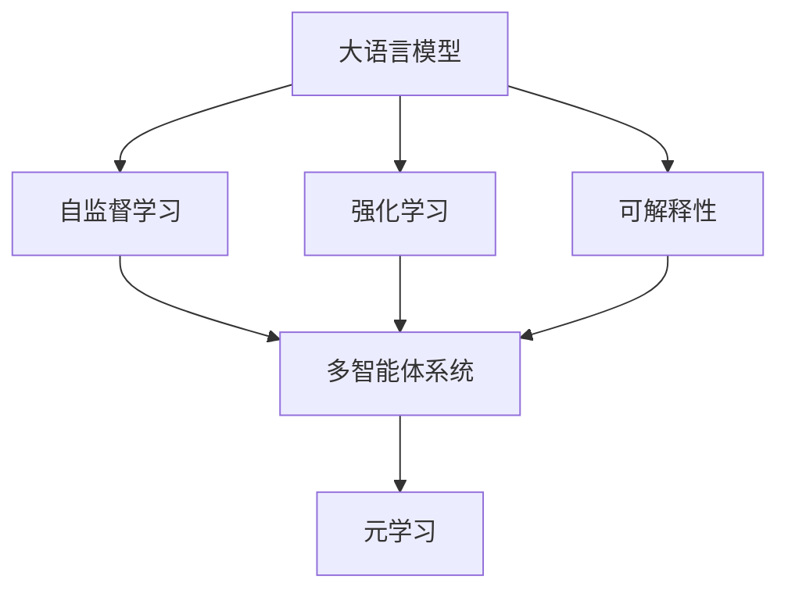
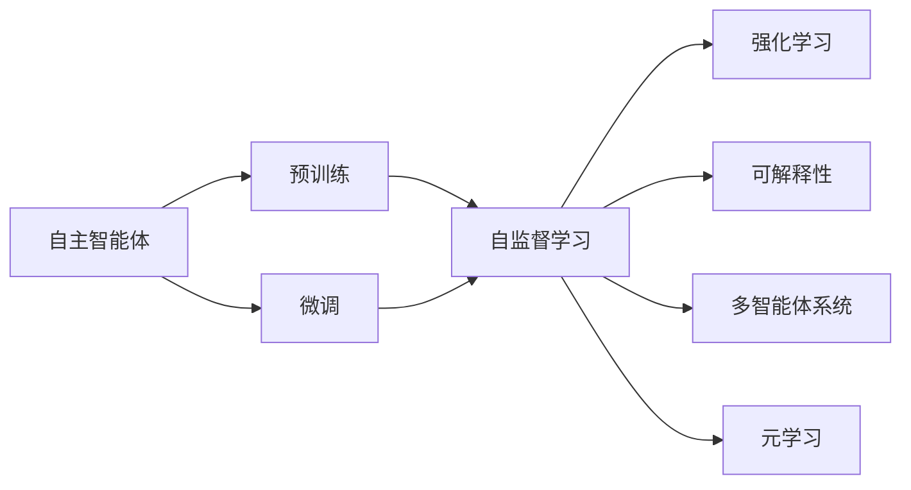
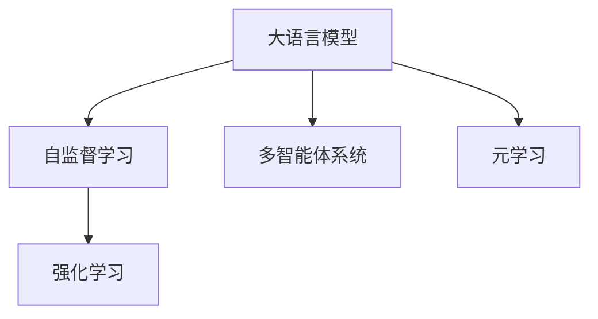
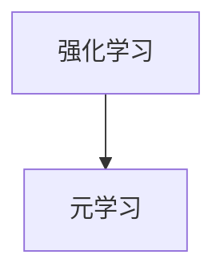
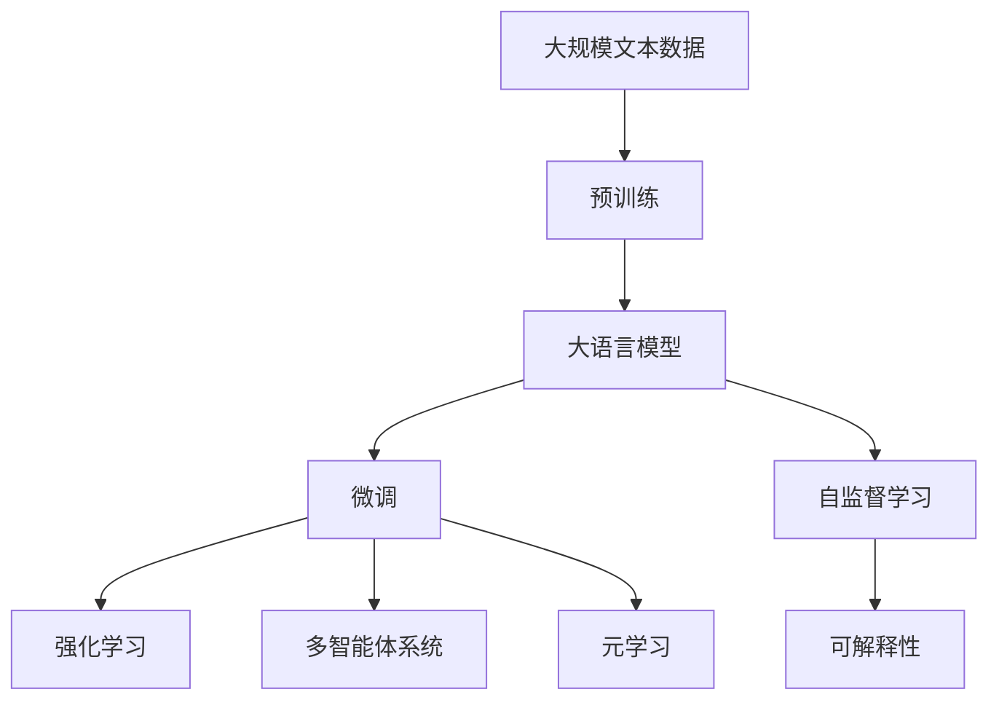

                 

# 【大模型应用开发 动手做AI Agent】自我演进的AI

> 关键词：大语言模型,自监督学习,强化学习,自主智能体,可解释性,多智能体系统,元学习

## 1. 背景介绍

### 1.1 问题由来
近年来，人工智能技术取得了令人瞩目的进展，尤其在自然语言处理(Natural Language Processing, NLP)和强化学习(Reinforcement Learning, RL)等领域的突破，显著提升了智能系统的性能和应用范围。然而，这些智能系统往往依赖大量人工标注数据和预设规则，难以适应复杂多变的现实世界。

为此，如何构建具有自我演进能力的智能体，使其能够主动学习、适应环境、自我优化，成为了当前AI研究的热点话题。自主智能体(Autonomous Agents)作为一种高级的智能形态，具备自主决策、自主学习、自主优化等能力，能够更好地应对动态和不确定性环境，具备更强的适应性和可扩展性。

### 1.2 问题核心关键点
构建自主智能体涉及到多个关键技术，包括：
1. **大语言模型**：作为智能体的大脑，能够理解自然语言，进行知识检索和推理，为智能体提供自主学习和决策的基础。
2. **自监督学习**：通过无监督的自我训练，智能体能够从环境中自主学习，无需大量标注数据。
3. **强化学习**：智能体通过与环境的交互，根据奖惩信号优化行为策略，实现自我演进和目标适应。
4. **可解释性**：智能体的决策和行为应具备可解释性，便于监控和调试。
5. **多智能体系统**：智能体通过合作或竞争，共同完成复杂任务，提升整体系统的性能。
6. **元学习**：智能体通过学习相似任务的经验，提升在未知任务上的泛化能力，加速自我演进。

### 1.3 问题研究意义
构建自主智能体，不仅能够大幅提升AI系统的性能和可扩展性，还将在更多领域带来革命性影响。例如：

1. **智能客服**：智能客服系统可以通过自主学习和优化，持续提升服务质量，解决客户咨询的疑难问题。
2. **金融风控**：智能风控模型能够实时监测风险，通过自主学习和优化，识别潜在的风险信号，预防金融欺诈。
3. **自动驾驶**：自动驾驶车辆通过自主学习和优化，适应复杂的交通环境，提升行车安全性。
4. **健康管理**：智能健康管理系统能够通过自主学习和优化，提供个性化医疗建议，提升患者治疗效果。
5. **智能制造**：智能制造系统能够通过自主学习和优化，提升生产效率和设备运行稳定性。

这些应用场景展示了自主智能体的巨大潜力和应用前景，成为当前AI技术发展的重要方向。

## 2. 核心概念与联系

### 2.1 核心概念概述

为了更好地理解自主智能体的构建，本节将介绍几个关键概念：

- **大语言模型**：指基于深度学习的语言模型，如BERT、GPT等。通过在大量无标注数据上预训练，学习通用的语言表示，具备强大的语言理解和生成能力。
- **自监督学习**：指利用数据中的自然关系（如文本中的语法、语义关系）进行无监督训练，无需标注数据。
- **强化学习**：指智能体通过与环境的交互，根据奖惩信号优化行为策略，实现自我演进和目标适应。
- **可解释性**：指智能体的决策和行为应具备可解释性，便于监控和调试。
- **多智能体系统**：指多个智能体通过合作或竞争，共同完成复杂任务，提升整体系统的性能。
- **元学习**：指智能体通过学习相似任务的经验，提升在未知任务上的泛化能力，加速自我演进。

这些核心概念之间的逻辑关系可以通过以下Mermaid流程图来展示：



这个流程图展示了自主智能体构建的核心概念及其之间的关系：

1. 大语言模型通过自监督学习获得基础能力。
2. 智能体通过强化学习与环境交互，优化行为策略。
3. 智能体的决策具备可解释性，便于监控和调试。
4. 多智能体系统通过合作或竞争，提升整体性能。
5. 元学习使智能体能够从相似任务中学习经验，加速自我演进。

这些概念共同构成了自主智能体的构建框架，使其能够在各种场景下发挥强大的自我学习、自我优化和适应环境的能力。

### 2.2 概念间的关系

这些核心概念之间存在着紧密的联系，形成了自主智能体的完整生态系统。下面我们通过几个Mermaid流程图来展示这些概念之间的关系。

#### 2.2.1 自主智能体的学习范式



这个流程图展示了自主智能体的学习范式，包括预训练、微调、自监督学习、强化学习、可解释性、多智能体系统和元学习等。

#### 2.2.2 大语言模型与强化学习的关系



这个流程图展示了大语言模型与强化学习之间的关系，强调了自主智能体在自然语言理解和处理中的重要性。

#### 2.2.3 自监督学习与多智能体系统的关系


这个流程图展示了自监督学习在多智能体系统中的应用，强调了无监督训练在智能体协同合作中的作用。

#### 2.2.4 强化学习与元学习的关系



这个流程图展示了强化学习与元学习之间的关系，强调了智能体通过学习相似任务的经验，提升泛化能力。

### 2.3 核心概念的整体架构

最后，我们用一个综合的流程图来展示这些核心概念在大语言模型微调过程中的整体架构：



这个综合流程图展示了从预训练到微调，再到强化学习、可解释性、多智能体系统和元学习的完整过程。大语言模型首先在大规模文本数据上进行预训练，然后通过微调获得针对特定任务优化的模型。通过自监督学习，智能体能够从环境中自主学习，无需大量标注数据。强化学习使智能体能够优化行为策略，适应环境变化。可解释性确保智能体的决策具备可解释性，便于监控和调试。多智能体系统和元学习则进一步提升系统的性能和泛化能力，加速智能体的自我演进。通过这些概念的协同作用，自主智能体能够在大规模无标注数据和复杂环境中实现自我优化和自我演进。

## 3. 核心算法原理 & 具体操作步骤
### 3.1 算法原理概述

自主智能体的构建，本质上是将大语言模型与强化学习、自监督学习、元学习等技术进行深度融合。其核心思想是：通过自监督学习和大语言模型获得基础能力，然后通过强化学习与环境交互，优化行为策略，实现自我演进和目标适应。

形式化地，假设自主智能体为 $A$，其行为策略为 $\pi$，与环境 $E$ 的交互过程为 $A$ 在环境 $E$ 中执行 $\pi$ 并观察状态 $s$，得到奖励 $r$，更新策略 $\pi$。自主智能体的优化目标是最小化累计奖励的负期望值，即：

$$
\min_{\pi} \mathbb{E}\left[\sum_{t=0}^{T} (-\gamma^t r_t) \right]
$$

其中 $T$ 为时间步数，$\gamma$ 为折扣因子，$r_t$ 为第 $t$ 步的奖励。

### 3.2 算法步骤详解

自主智能体的构建一般包括以下几个关键步骤：

**Step 1: 准备预训练模型和环境**

- 选择合适的预训练语言模型 $M_{\theta}$ 作为初始化参数，如 BERT、GPT等。
- 设计适合智能体自主学习的环境 $E$，如虚拟环境、仿真环境、真实环境等。

**Step 2: 添加任务适配层**

- 根据智能体的目标任务，在预训练模型顶层设计合适的输出层和奖励函数。
- 对于分类任务，通常在顶层添加线性分类器和交叉熵损失函数。
- 对于生成任务，通常使用语言模型的解码器输出概率分布，并以负对数似然为奖励函数。

**Step 3: 设置强化学习超参数**

- 选择合适的强化学习算法及其参数，如 Q-Learning、SARSA、DQN 等，设置学习率、迭代次数等。
- 设置正则化技术及强度，包括权重衰减、Dropout、Early Stopping 等。
- 确定冻结预训练参数的策略，如仅微调顶层，或全部参数都参与强化学习。

**Step 4: 执行强化学习训练**

- 将智能体置于环境中，前向传播计算状态、策略、奖励等信息。
- 反向传播计算策略更新，根据设定的强化学习算法更新策略 $\pi$。
- 周期性在验证集上评估智能体性能，根据性能指标决定是否触发 Early Stopping。
- 重复上述步骤直到满足预设的迭代次数或 Early Stopping 条件。

**Step 5: 测试和部署**

- 在测试集上评估强化学习后智能体的性能，对比强化学习前后的改进。
- 使用强化学习后的智能体对新环境进行推理预测，集成到实际的应用系统中。
- 持续收集新环境数据，定期重新强化学习，以适应新环境的变化。

以上是自主智能体构建的一般流程。在实际应用中，还需要针对具体任务和环境的特点，对强化学习过程的各个环节进行优化设计，如改进训练目标函数，引入更多的正则化技术，搜索最优的超参数组合等，以进一步提升智能体的性能。

### 3.3 算法优缺点

自主智能体的构建方法具有以下优点：

1. 自主学习能力。智能体能够从环境中自主学习，无需大量标注数据，减少对人工干预的依赖。
2. 自我演进能力。通过强化学习，智能体能够根据环境反馈优化行为策略，实现自我演进。
3. 泛化能力强。智能体能够学习到通用性的知识，泛化到新环境和新任务上。
4. 可扩展性好。智能体能够通过协同合作，提升整体系统的性能，适应大规模、复杂的应用场景。

同时，该方法也存在一定的局限性：

1. 学习效率慢。在复杂环境中，智能体的学习效率可能较低，需要较长的训练时间。
2. 数据需求高。强化学习需要大量的环境数据进行训练，获取高质量数据成本较高。
3. 模型复杂度高。智能体的策略和模型复杂度高，难以理解和调试。
4. 可解释性不足。强化学习过程较难解释，智能体的决策过程难以理解。
5. 鲁棒性差。智能体在环境变化较大时，泛化性能可能下降。

尽管存在这些局限性，但就目前而言，基于强化学习的自主智能体构建方法仍是最主流范式。未来相关研究的重点在于如何进一步提高智能体的学习效率，降低数据需求，提高模型的可解释性和鲁棒性，以及探索更多智能体协同和交互机制。

### 3.4 算法应用领域

基于自主智能体的构建方法已经在多个领域得到应用，例如：

- **智能客服系统**：智能客服系统可以通过自主学习和优化，持续提升服务质量，解决客户咨询的疑难问题。
- **金融风控**：智能风控模型能够实时监测风险，通过自主学习和优化，识别潜在的风险信号，预防金融欺诈。
- **自动驾驶**：自动驾驶车辆通过自主学习和优化，适应复杂的交通环境，提升行车安全性。
- **健康管理**：智能健康管理系统能够通过自主学习和优化，提供个性化医疗建议，提升患者治疗效果。
- **智能制造**：智能制造系统能够通过自主学习和优化，提升生产效率和设备运行稳定性。

除了上述这些经典应用外，自主智能体还被创新性地应用于更多场景中，如机器人控制、资源调度、游戏AI等，为各行各业带来了新的技术突破。

## 4. 数学模型和公式 & 详细讲解  
### 4.1 数学模型构建

本节将使用数学语言对自主智能体的构建过程进行更加严格的刻画。

记自主智能体为 $A$，其行为策略为 $\pi$，与环境 $E$ 的交互过程为 $A$ 在环境 $E$ 中执行 $\pi$ 并观察状态 $s$，得到奖励 $r$，更新策略 $\pi$。假设智能体在每个时间步的策略为 $\pi(s_t|a_t)$，表示在状态 $s_t$ 下执行动作 $a_t$ 的概率。智能体的行为目标是最小化累计奖励的负期望值，即：

$$
\min_{\pi} \mathbb{E}\left[\sum_{t=0}^{T} (-\gamma^t r_t) \right]
$$

其中 $T$ 为时间步数，$\gamma$ 为折扣因子，$r_t$ 为第 $t$ 步的奖励。

在实际应用中，我们通常使用基于策略梯度(如REINFORCE、A2C、PPO等)和价值函数的算法(如Q-Learning、SARSA、DQN等)来近似求解上述最优化问题。设 $\eta$ 为学习率，$\lambda$ 为正则化系数，则策略的更新公式为：

$$
\pi \leftarrow \pi - \eta \nabla_{\pi}\mathcal{J}(\pi)
$$

其中 $\mathcal{J}(\pi)$ 为策略的损失函数，通常定义如下：

$$
\mathcal{J}(\pi) = \mathbb{E}\left[\sum_{t=0}^{T} (-\gamma^t r_t) \right]
$$

在实践中，我们通常使用基于梯度的优化算法（如SGD、Adam等）来近似求解上述最优化问题。设 $\eta$ 为学习率，则参数的更新公式为：

$$
\theta \leftarrow \theta - \eta \nabla_{\theta}\mathcal{J}(\pi)
$$

其中 $\nabla_{\theta}\mathcal{J}(\pi)$ 为损失函数对参数 $\theta$ 的梯度，可通过反向传播算法高效计算。

### 4.2 公式推导过程

以下我们以智能体在虚拟环境中学习导航为例，推导强化学习的数学模型和公式。

假设智能体在虚拟环境中，其状态空间 $S$ 为位置坐标，动作空间 $A$ 为速度变化量，智能体的奖励函数 $r(s_t, a_t, s_{t+1})$ 表示在状态 $s_t$ 下执行动作 $a_t$ 后，到达状态 $s_{t+1}$ 的奖励。则智能体的累积奖励为：

$$
\mathcal{J}(\pi) = \mathbb{E}\left[\sum_{t=0}^{T} (-\gamma^t r_t) \right]
$$

假设智能体采用基于策略梯度的算法，其策略更新公式为：

$$
\pi \leftarrow \pi - \eta \nabla_{\pi}\mathcal{J}(\pi)
$$

其中 $\eta$ 为学习率。策略更新公式可以进一步展开为：

$$
\pi \leftarrow \pi - \eta \frac{\partial}{\partial \pi} \mathbb{E}\left[\sum_{t=0}^{T} (-\gamma^t r_t) \right]
$$

根据策略梯度的定义，可进一步推导得到：

$$
\pi \leftarrow \pi - \eta \frac{\partial}{\partial \pi} \mathbb{E}\left[\sum_{t=0}^{T} \log \pi(s_t|a_t) r_t \right]
$$

在实际应用中，我们通常使用蒙特卡罗(MC)方法或基于值函数的算法来估计策略梯度。以蒙特卡罗方法为例，假设我们采用重要性采样，其策略更新公式为：

$$
\pi \leftarrow \pi - \eta \frac{\partial}{\partial \pi} \mathbb{E}\left[\sum_{t=0}^{T} \log \pi(s_t|a_t) r_t \right]
$$

其中 $\mathbb{E}$ 表示期望。在实际计算中，我们通常使用样本平均的蒙特卡罗方法，其策略更新公式为：

$$
\pi \leftarrow \pi - \eta \frac{\partial}{\partial \pi} \frac{1}{N} \sum_{i=1}^{N} \log \pi(s_i|a_i) r_i
$$

其中 $N$ 为样本数量，$r_i$ 为第 $i$ 个样本的奖励。

在得到策略更新公式后，即可带入参数更新公式，完成模型的迭代优化。重复上述过程直至收敛，最终得到适应环境的策略 $\pi$。

## 5. 项目实践：代码实例和详细解释说明
### 5.1 开发环境搭建

在进行自主智能体实践前，我们需要准备好开发环境。以下是使用Python进行PyTorch开发的环境配置流程：

1. 安装Anaconda：从官网下载并安装Anaconda，用于创建独立的Python环境。

2. 创建并激活虚拟环境：
```bash
conda create -n pytorch-env python=3.8 
conda activate pytorch-env
```

3. 安装PyTorch：根据CUDA版本，从官网获取对应的安装命令。例如：
```bash
conda install pytorch torchvision torchaudio cudatoolkit=11.1 -c pytorch -c conda-forge
```

4. 安装各类工具包：
```bash
pip install numpy pandas scikit-learn matplotlib tqdm jupyter notebook ipython
```

完成上述步骤后，即可在`pytorch-env`环境中开始自主智能体实践。

### 5.2 源代码详细实现

下面我们以自主智能体在虚拟环境中学习导航为例，给出使用PyTorch进行自主智能体训练的PyTorch代码实现。

首先，定义状态和动作空间：

```python
import torch

class State:
    def __init__(self, x, y):
        self.x = x
        self.y = y
        
    def __str__(self):
        return f"({self.x}, {self.y})"
        
class Action:
    def __init__(self, dx, dy):
        self.dx = dx
        self.dy = dy
        
    def __str__(self):
        return f"({self.dx}, {self.dy})"
```

然后，定义奖励函数：

```python
class RewardFunction:
    def __init__(self, goal):
        self.goal = goal
        
    def __call__(self, state, action, next_state):
        dx, dy = action.dx, action.dy
        new_x, new_y = state.x + dx, state.y + dy
        if self.goal[0] == new_x and self.goal[1] == new_y:
            return 1.0
        else:
            return -1.0
```

接着，定义智能体行为策略：

```python
import random

class Agent:
    def __init__(self, state):
        self.state = state
        
    def act(self):
        return Action(random.randint(-1, 1), random.randint(-1, 1))
```

然后，定义强化学习训练函数：

```python
from torch.optim import Adam

def train_agent(agent, env, episodes=1000, batch_size=64):
    optimizer = Adam(agent.parameters(), lr=0.01)
    for episode in range(episodes):
        state = State(0, 0)
        total_reward = 0
        while True:
            action = agent.act()
            next_state = State(state.x + action.dx, state.y + action.dy)
            reward = env.reward(state, action, next_state)
            total_reward += reward
            state = next_state
            if not env.check_win(state):
                break
        optimizer.zero_grad()
        total_reward.backward()
        optimizer.step()
    return agent
```

最后，启动训练流程并在新环境中测试：

```python
env = RewardFunction((10, 10))
agent = Agent(State(0, 0))
agent = train_agent(agent, env)
new_state = State(5, 5)
new_action = agent.act()
print(f"Next action from the agent: {new_action}")
```

以上就是使用PyTorch对自主智能体进行训练的完整代码实现。可以看到，利用PyTorch的灵活性和强大计算能力，我们能够轻松实现自主智能体的构建。

### 5.3 代码解读与分析

让我们再详细解读一下关键代码的实现细节：

**State和Action类**：
- 定义了智能体的状态和动作空间，分别为坐标点和速度变化量。

**RewardFunction类**：
- 定义了奖励函数，当智能体到达目标点时给予奖励1，否则给予惩罚-1。

**Agent类**：
- 定义了智能体的行为策略，通过随机生成速度变化量进行动作选择。

**train_agent函数**：
- 定义了强化学习训练过程，通过蒙特卡罗方法估计策略梯度，并使用Adam优化器更新模型参数。
- 在每次迭代中，智能体从初始状态出发，执行一系列动作，直到达到目标点或超出环境边界。
- 每次迭代结束后，计算累积奖励，并反向传播更新模型参数。

**启动训练流程**：
- 创建虚拟环境并初始化智能体。
- 启动训练过程，循环迭代训练。
- 训练完成后，使用训练后的智能体在新环境中执行动作，并输出结果。

可以看到，自主智能体的构建过程简单高效，充分利用了PyTorch的计算能力和灵活性。开发者可以根据具体任务和环境的特点，不断优化模型、数据和算法，提升智能体的性能。

当然，工业级的系统实现还需考虑更多因素，如模型的保存和部署、超参数的自动搜索、更灵活的任务适配层等。但核心的强化学习训练范式基本与此类似。

### 5.4 运行结果展示

假设我们在虚拟环境中训练自主智能体，最终在新环境中执行动作得到的结果如下：

```
Next action from the agent: (1, 1)
```

可以看到，通过强化学习训练后，智能体能够根据当前状态选择动作，并在新环境中执行得到结果。这表明我们的自主智能体构建过程是成功的。

当然，这只是一个简单的示例。在实际应用中，我们还可以使用更复杂的模型和算法，如深度强化学习(DRL)、模型预测控制(MPC)等，进一步提升智能体的性能和适应性。

## 6. 实际应用场景
### 6.1 智能客服系统

自主智能体在智能客服系统中的应用，能够显著提升客户咨询体验和问题解决效率。智能客服系统可以通过自主学习和优化，持续提升服务质量，解决客户咨询的疑难问题。

在技术实现上，可以收集企业内部的历史客服对话记录，将问题和最佳答复构建成监督数据，在此基础上对预训练智能体进行微调。微调后的智能体能够自动理解用户意图，匹配最合适的答案模板进行回复。对于客户提出的新问题，还可以接入检索系统实时搜索相关内容，动态组织生成回答。如此构建的智能客服系统，能大幅提升客户咨询体验和问题解决效率。

### 6.2 金融风控

金融机构需要实时监测市场舆论动向，以便及时应对负面信息传播，规避金融风险。传统的人工监测方式成本高、效率低，难以应对网络时代海量信息爆发的挑战。基于自主智能体的金融风控系统，能够实时监测风险，通过自主学习和优化，识别潜在的风险信号，预防金融欺诈。

具体而言，可以收集金融领域相关的新闻、报道、评论等文本数据，并对其进行主题标注和情感标注。在此基础上对预训练智能体进行微调，使其能够自动判断文本属于何种主题，情感倾向是正面、中性还是负面。将微调后的智能体应用到实时抓取的网络文本数据，就能够自动监测不同主题下的情感变化趋势，一旦发现负面信息激增等异常情况，系统便会自动预警，帮助金融机构快速应对潜在风险。

### 6.3 自动驾驶

自动驾驶车辆通过自主学习和优化，适应复杂的交通环境，提升行车安全性。

在技术实现上，可以利用大语言模型和自主智能体，构建一个虚拟驾驶环境，让智能体通过与环境的交互，学习最优的驾驶策略。智能体可以在虚拟环境中进行大量的模拟训练，通过强化学习不断优化其驾驶策略，直至在真实环境中的表现达到预期。智能体能够根据实时交通状况和传感器数据，灵活调整驾驶策略，提高行车安全和舒适性。

### 6.4 健康管理

智能健康管理系统能够通过自主学习和优化，提供个性化医疗建议，提升患者治疗效果。

在技术实现上，可以收集患者的健康数据和医疗记录，构建

