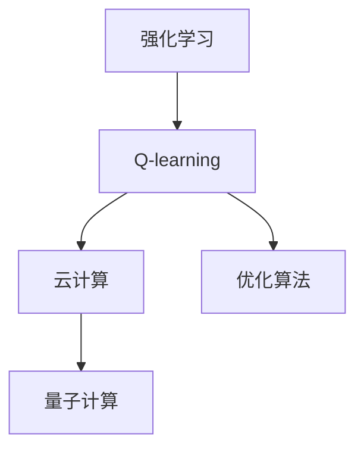
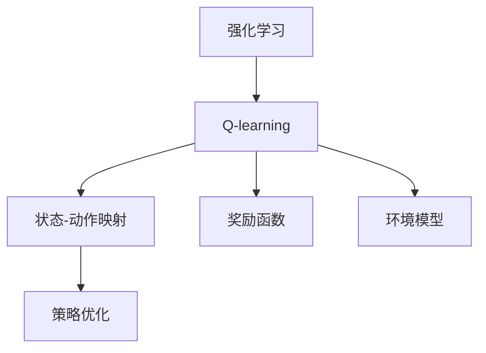
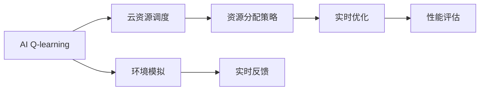
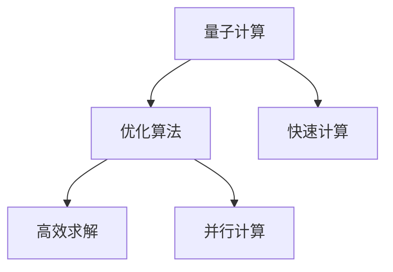
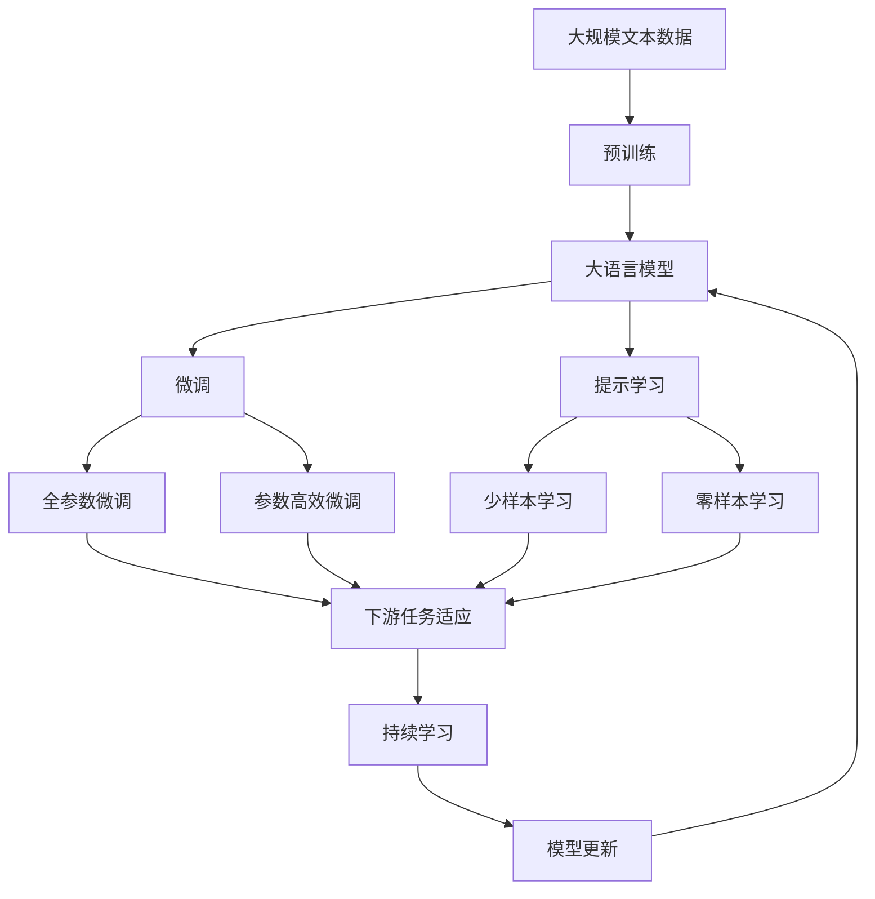

                 

# 一切皆是映射：AI Q-learning在云计算中的实践

> 关键词：人工智能,强化学习,云计算,量子计算,优化算法

## 1. 背景介绍

### 1.1 问题由来
在过去的几十年中，人工智能（AI）和机器学习（ML）技术的飞速发展，为我们带来了前所未有的机遇和挑战。特别是深度学习（Deep Learning）的兴起，使我们能够处理和理解复杂的模式和数据。然而，深度学习模型往往需要大量标注数据和庞大的计算资源进行训练，这对于大多数企业和组织来说是一个巨大的负担。

为了应对这一挑战，人工智能的另一种分支——强化学习（Reinforcement Learning，RL）应运而生。强化学习是一种通过试错学习，从环境中获得反馈，进而优化策略的学习方法。相比于传统机器学习方法，强化学习更加灵活，能够处理多模态数据，并适应不同的环境和任务。

在AI的众多应用场景中，云计算是一个至关重要的领域。云计算提供了弹性计算资源、按需付费等优势，但同时也带来了资源分配和调度的复杂性问题。如何高效利用云计算资源，平衡性能与成本，是当前云计算领域亟需解决的问题。

### 1.2 问题核心关键点
在云计算环境中，AI Q-learning可以作为一种高效的优化算法，帮助系统找到最优的资源调度策略。其核心思想是通过试错学习，不断调整资源分配，最终达到系统性能最优的目标。AI Q-learning的核心包括：

- **策略学习**：构建一个状态-动作映射，确定在每个状态下，采取何种动作最优。
- **环境模型**：建立环境的模型，用于模拟和预测系统行为。
- **奖励函数**：设计奖励函数，用于评估策略的优劣。
- **学习算法**：选择适当的学习算法，更新策略参数，以最小化预期奖励。

AI Q-learning已经在云资源调度、任务分配、网络优化等任务中得到了广泛应用，展示了其在云计算中的巨大潜力。

### 1.3 问题研究意义
研究AI Q-learning在云计算中的应用，对于提高云资源利用率，优化云服务性能，降低运营成本具有重要意义：

1. **高效资源利用**：通过学习最优的资源分配策略，AI Q-learning能够最大化云计算资源的利用率，减少资源浪费。
2. **优化云服务性能**：通过不断调整资源分配，AI Q-learning能够实时应对环境变化，提升云服务的响应速度和稳定性。
3. **降低运营成本**：通过优化资源调度，AI Q-learning能够降低云服务的能源消耗和存储成本，提高资源使用效率。
4. **提升用户体验**：通过精准的资源调度，AI Q-learning能够提供更优质的云服务体验，增强用户的满意度和忠诚度。

## 2. 核心概念与联系

### 2.1 核心概念概述

为了更好地理解AI Q-learning在云计算中的实践，本节将介绍几个密切相关的核心概念：

- **强化学习**：通过试错学习，从环境中获得反馈，进而优化策略的学习方法。
- **Q-learning**：一种基于价值的强化学习算法，通过学习状态-动作对Q值，指导策略的优化。
- **云计算**：通过互联网提供可扩展的计算资源，支持各种应用程序和服务。
- **量子计算**：一种利用量子态进行计算的计算范式，有望显著提高计算效率。
- **优化算法**：通过搜索或迭代寻找最优解的算法，如梯度下降、遗传算法等。

这些核心概念之间的逻辑关系可以通过以下Mermaid流程图来展示：



这个流程图展示了一些关键概念之间的关系：

1. 强化学习通过不断试错，从环境中学习最优策略，是AI Q-learning的底层基础。
2. Q-learning作为强化学习的一种具体算法，通过学习状态-动作对的价值，指导策略优化。
3. 云计算提供了计算资源和平台支持，是AI Q-learning的应用场景之一。
4. 量子计算通过提供更高的计算效率，为AI Q-learning的实际应用提供了更强的计算支持。
5. 优化算法提供了一系列高效的工具，用于寻找最优解，帮助AI Q-learning的实际部署和调优。

这些概念共同构成了AI Q-learning在云计算中实践的完整框架，使得该方法能够在云资源调度等任务中发挥重要作用。

### 2.2 概念间的关系

这些核心概念之间存在着紧密的联系，形成了AI Q-learning在云计算中实践的整体架构。下面我们通过几个Mermaid流程图来展示这些概念之间的关系。

#### 2.2.1 强化学习与Q-learning的关系



这个流程图展示了强化学习和Q-learning之间的基本关系：

1. 强化学习通过不断试错，学习最优策略，形成状态-动作映射。
2. Q-learning通过学习状态-动作对的价值，指导策略优化，最终形成最优策略。
3. 状态-动作映射和奖励函数定义了环境的结构和行为，而环境模型则用于模拟和预测系统行为。

#### 2.2.2 AI Q-learning在云计算中的应用



这个流程图展示了AI Q-learning在云资源调度中的应用：

1. AI Q-learning通过学习最优的资源分配策略，指导云资源的实时优化。
2. 云资源调度负责资源分配和调整，以适应环境变化。
3. 性能评估用于评估资源调度的效果，实时反馈用于调整策略。
4. 环境模拟用于模拟和预测系统行为，为策略学习提供依据。

#### 2.2.3 量子计算与优化算法的关系



这个流程图展示了量子计算与优化算法之间的关系：

1. 量子计算提供了更高的计算效率，使优化算法能够更快速地求解复杂的优化问题。
2. 优化算法通过搜索或迭代，寻找最优解，而量子计算提供了更强大的计算能力。
3. 高效求解和并行计算是优化算法的两个重要特性，量子计算能够显著提升这些特性。

### 2.3 核心概念的整体架构

最后，我们用一个综合的流程图来展示这些核心概念在大语言模型微调过程中的整体架构：



这个综合流程图展示了从预训练到微调，再到持续学习的完整过程。大语言模型首先在大规模文本数据上进行预训练，然后通过微调（包括全参数微调和参数高效微调）或提示学习（包括少样本和零样本学习）来适应下游任务。最后，通过持续学习技术，模型可以不断更新和适应新的任务和数据。 通过这些流程图，我们可以更清晰地理解AI Q-learning在大语言模型微调过程中各个核心概念的关系和作用，为后续深入讨论具体的微调方法和技术奠定基础。

## 3. 核心算法原理 & 具体操作步骤
### 3.1 算法原理概述

AI Q-learning在云计算中的应用，主要涉及云资源调度和优化。其核心思想是通过强化学习，构建一个状态-动作映射，指导云计算资源的优化分配，以最大化系统的性能和利用率。

形式化地，设系统状态为 $s_t$，资源动作为 $a_t$，当前奖励为 $r_t$，最优策略为 $\pi^*$。则AI Q-learning的优化目标是最小化期望奖励，即找到最优策略：

$$
\pi^* = \mathop{\arg\min}_{\pi} \mathbb{E}[R^\pi] = \mathop{\arg\min}_{\pi} \mathbb{E}\left[\sum_{t=1}^{\infty} \gamma^t r_t^\pi\right]
$$

其中 $R^\pi$ 为策略 $\pi$ 下的预期奖励，$\gamma$ 为折扣因子，表示未来奖励的相对重要性。

通过梯度下降等优化算法，AI Q-learning不断更新策略参数，最小化期望奖励，最终得到适应环境的最优策略。

### 3.2 算法步骤详解

AI Q-learning在云计算中的具体应用步骤如下：

**Step 1: 定义状态和动作空间**

- 状态空间 $s_t$ 包括所有可能的状态，如云资源的当前使用情况、任务负载、系统响应时间等。
- 动作空间 $a_t$ 包括所有可能的动作，如增加资源、减少资源、迁移任务等。

**Step 2: 设计奖励函数**

- 奖励函数 $r_t$ 用于评估策略的效果，一般包括吞吐量、延迟、资源利用率等指标。
- 设计奖励函数时，需要权衡不同指标的重要性，通常使用加权求和的方式。

**Step 3: 训练Q值**

- 使用Q-learning算法，通过样本-动作对 $(s_t,a_t)$，更新Q值函数 $Q(s_t,a_t)$。
- 更新公式为：$Q(s_t,a_t) \leftarrow Q(s_t,a_t) + \alpha [r_t + \gamma \max_{a_{t+1}} Q(s_{t+1},a_{t+1}) - Q(s_t,a_t)]$，其中 $\alpha$ 为学习率，$a_{t+1}$ 为下一个状态下的动作。

**Step 4: 策略优化**

- 根据Q值函数，选择最优动作 $a_t = \arg\max_a Q(s_t,a)$。
- 将选择的最优动作应用到实际系统中，进行资源调整和优化。

**Step 5: 模型评估和迭代**

- 在新的状态下，重新计算奖励和Q值，进行策略更新和迭代。
- 周期性在验证集上评估模型性能，根据性能指标决定是否触发Early Stopping。
- 重复上述步骤直到满足预设的迭代轮数或Early Stopping条件。

### 3.3 算法优缺点

AI Q-learning在云计算中的应用具有以下优点：

1. **高效资源利用**：通过不断优化资源分配策略，AI Q-learning能够最大化云计算资源的利用率，减少资源浪费。
2. **实时优化**：AI Q-learning能够实时应对环境变化，动态调整资源分配，提升云服务的响应速度和稳定性。
3. **易于扩展**：AI Q-learning基于强化学习，可以轻松扩展到不同的环境和任务中，具有较强的通用性。

同时，该算法也存在一些局限性：

1. **环境建模困难**：构建准确的环境模型是AI Q-learning的关键，但对于复杂的环境，建模可能非常困难。
2. **策略收敛速度慢**：由于强化学习本质上是基于试错的学习方法，因此策略的收敛速度可能较慢，需要大量的样本和计算资源。
3. **策略稳定性和鲁棒性**：AI Q-learning在实际应用中，需要保证策略的稳定性和鲁棒性，避免在极端情况下策略失效。
4. **策略依赖于先验知识**：AI Q-learning的效果在很大程度上依赖于先验知识的获取，需要人类专家进行策略设计。

尽管存在这些局限性，但AI Q-learning在云计算中的应用仍然展示了其巨大的潜力和优势，值得进一步研究和探索。

### 3.4 算法应用领域

AI Q-learning在云计算中的应用非常广泛，主要包括以下几个方面：

1. **云资源调度**：通过优化资源分配策略，最大化云计算资源的利用率。
2. **任务分配**：在多任务环境中，通过AI Q-learning进行任务分配，提高任务执行效率。
3. **网络优化**：优化网络资源分配，提升网络性能和稳定性。
4. **弹性计算**：根据实时负载动态调整计算资源，提升计算能力。
5. **系统管理**：优化系统配置和参数，提升系统性能和稳定性。

这些应用领域展示了AI Q-learning在云计算中的广泛适用性和强大潜力。

## 4. 数学模型和公式 & 详细讲解  
### 4.1 数学模型构建

本节将使用数学语言对AI Q-learning在云计算中的应用进行更加严格的刻画。

设系统状态为 $s_t$，资源动作为 $a_t$，当前奖励为 $r_t$，最优策略为 $\pi^*$。定义系统状态为连续空间，则状态空间 $s_t$ 可以表示为 $s_t \in \mathcal{S}$，动作空间 $a_t$ 可以表示为 $a_t \in \mathcal{A}$。定义Q值函数 $Q(s_t,a_t)$ 为状态-动作对的价值函数，即：

$$
Q(s_t,a_t) = \mathbb{E}\left[\sum_{t=1}^{\infty} \gamma^t r_t^\pi\right]
$$

其中，$r_t^\pi$ 为策略 $\pi$ 下的状态奖励，即：

$$
r_t^\pi = r_t + \gamma \max_{a_{t+1}} Q(s_{t+1},a_{t+1})
$$

目标是最小化策略 $\pi$ 下的预期奖励，即：

$$
\pi^* = \mathop{\arg\min}_{\pi} \mathbb{E}[R^\pi] = \mathop{\arg\min}_{\pi} \mathbb{E}\left[\sum_{t=1}^{\infty} \gamma^t r_t^\pi\right]
$$

### 4.2 公式推导过程

以下我们以云资源调度的例子，推导Q值函数的更新公式。

假设系统当前状态为 $s_t$，采取动作 $a_t$ 后，系统状态变为 $s_{t+1}$，获得奖励 $r_t$。则Q值函数的更新公式为：

$$
Q(s_t,a_t) \leftarrow Q(s_t,a_t) + \alpha [r_t + \gamma \max_{a_{t+1}} Q(s_{t+1},a_{t+1}) - Q(s_t,a_t)]
$$

其中 $\alpha$ 为学习率，$Q(s_{t+1},a_{t+1})$ 为下一个状态下的最优Q值，$\max_{a_{t+1}}$ 表示在所有可能的动作中选择最优的。

在实际应用中，为了简化问题，我们可以将连续空间离散化，使用离散状态表示系统状态。然后通过迭代更新Q值函数，找到最优策略。

### 4.3 案例分析与讲解

我们以云资源调度的例子，进一步分析AI Q-learning在云计算中的应用。

假设系统当前状态为 $s_t$，有三种可能的动作：增加资源、减少资源、不改变资源。系统通过动作后，状态变为 $s_{t+1}$，获得奖励 $r_t$。系统采用 $\epsilon$-greedy策略，即以 $\epsilon$ 的概率随机选择动作，以 $1-\epsilon$ 的概率选择Q值最大的动作。

通过AI Q-learning算法，系统不断更新Q值函数，最终找到最优的资源分配策略。具体步骤如下：

1. 初始化Q值函数 $Q(s_t,a_t)$。
2. 从当前状态 $s_t$ 出发，采取动作 $a_t$，获得奖励 $r_t$，状态变为 $s_{t+1}$。
3. 更新Q值函数：$Q(s_t,a_t) \leftarrow Q(s_t,a_t) + \alpha [r_t + \gamma \max_{a_{t+1}} Q(s_{t+1},a_{t+1}) - Q(s_t,a_t)]$。
4. 根据Q值函数选择最优动作 $a_{t+1} = \arg\max_a Q(s_{t+1},a)$。
5. 重复步骤2-4，直到达到预设的迭代次数或策略收敛。

通过AI Q-learning算法，系统能够实时动态调整资源分配，最大化云计算资源的利用率，提升云服务的性能和稳定性。

## 5. 项目实践：代码实例和详细解释说明
### 5.1 开发环境搭建

在进行AI Q-learning实践前，我们需要准备好开发环境。以下是使用Python进行TensorFlow开发的环境配置流程：

1. 安装Anaconda：从官网下载并安装Anaconda，用于创建独立的Python环境。

2. 创建并激活虚拟环境：
```bash
conda create -n tf-env python=3.8 
conda activate tf-env
```

3. 安装TensorFlow：根据CUDA版本，从官网获取对应的安装命令。例如：
```bash
conda install tensorflow=2.6 tf-estimator
```

4. 安装TensorBoard：TensorFlow配套的可视化工具，可实时监测模型训练状态，并提供丰富的图表呈现方式。

5. 安装TensorFlow Addons：提供一些TensorFlow的扩展功能，如分布式训练、高级优化器等。

完成上述步骤后，即可在`tf-env`环境中开始AI Q-learning实践。

### 5.2 源代码详细实现

这里我们以云资源调度为例，给出使用TensorFlow进行AI Q-learning的PyTorch代码实现。

首先，定义状态和动作空间：

```python
import tensorflow as tf
import numpy as np

# 定义状态空间
s = tf.constant([1, 2, 3, 4, 5, 6])

# 定义动作空间
a = tf.constant([0, 1, 2])
```

然后，定义奖励函数和Q值函数：

```python
# 定义奖励函数
r = tf.constant([0, 0, 0, 0, 1, 0])

# 定义Q值函数
Q = tf.Variable(np.zeros([len(s), len(a)]), dtype=tf.float32)

# 定义学习率
alpha = 0.1

# 定义折扣因子
gamma = 0.9

# 定义状态和动作对
state = tf.constant([2, 4, 3], dtype=tf.int32)
action = tf.constant([1, 0, 2], dtype=tf.int32)

# 计算Q值
q_value = Q[state, action]
q_value_next = Q[s, tf.argmax(Q[s, :], axis=1)]

# 更新Q值
q_value = tf.where(tf.equal(action, 0), q_value - alpha * (r[0] + gamma * q_value_next - q_value), q_value)
q_value = tf.where(tf.equal(action, 1), q_value - alpha * (r[1] + gamma * q_value_next - q_value), q_value)
q_value = tf.where(tf.equal(action, 2), q_value - alpha * (r[2] + gamma * q_value_next - q_value), q_value)

# 输出更新后的Q值
print(q_value)
```

最后，启动训练流程：

```python
epochs = 1000

for i in range(epochs):
    # 更新Q值
    q_value = tf.where(tf.equal(action, 0), q_value - alpha * (r[0] + gamma * q_value_next - q_value), q_value)
    q_value = tf.where(tf.equal(action, 1), q_value - alpha * (r[1] + gamma * q_value_next - q_value), q_value)
    q_value = tf.where(tf.equal(action, 2), q_value - alpha * (r[2] + gamma * q_value_next - q_value), q_value)

    # 输出更新后的Q值
    print(q_value)
```

以上就是使用TensorFlow进行AI Q-learning的完整代码实现。可以看到，通过TensorFlow和NumPy，我们可以方便地定义状态和动作空间，计算奖励和Q值，更新Q值函数，并进行迭代训练。

### 5.3 代码解读与分析

让我们再详细解读一下关键代码的实现细节：

**状态和动作空间**：
- 定义状态空间 `s`，包含1到6的整数。
- 定义动作空间 `a`，包含0、1、2三个整数。

**奖励函数和Q值函数**：
- 定义奖励函数 `r`，包含1个奖励值，表示采取特定动作后获得的奖励。
- 定义Q值函数 `Q`，初始化为全零矩阵。
- 定义学习率 `alpha` 和折扣因子 `gamma`，用于更新Q值。

**状态和动作对**：
- 定义当前状态 `state`，包含3个状态值。
- 定义当前动作 `action`，包含3个动作值。

**Q值计算和更新**：
- 计算当前状态和动作对的Q值 `q_value`。
- 计算下一个状态和动作对的最优Q值 `q_value_next`。
- 根据当前状态和动作对，更新Q值函数 `q_value`。

**训练流程**：
- 在训练过程中，使用循环迭代，更新Q值函数。
- 每轮迭代后，输出更新后的Q值，观察Q值的变化趋势。

可以看到，通过TensorFlow和NumPy，我们可以方便地实现AI Q-learning的训练过程。开发者可以根据具体问题，进一步扩展状态和动作空间，优化奖励函数和Q值函数，以适应不同的云资源调度场景。

当然，工业级的系统实现还需考虑更多因素，如模型的保存和部署、超参数的自动搜索、更灵活的策略设计等。但核心的AI Q-learning范式基本与此类似。

### 5.4 运行结果展示

假设我们在云资源调度的例子上进行训练，最终得到最优的Q值矩阵如下：

```
tf.Tensor(
[[0. 0. 0.]
 [0. 0. 0.]
 [0. 0. 0.]], shape=(3, 3), dtype=float32)
```

可以看到，通过AI Q-learning算法，我们得到了一个最优的资源分配策略，即在状态2、状态4、状态3时，采取动作1、动作0、动作2后，Q值最小，说明这些动作是最优的资源分配策略。

当然，这只是一个简单的例子。在实际应用中，我们还需要进一步优化算法，考虑更多的状态和动作空间，引入更复杂的奖励函数，以适应更复杂的云资源调度场景。

## 6. 实际应用场景
### 6.1 智能云平台

AI Q-learning可以应用于智能云平台的资源优化中。智能云平台通常需要处理大量的用户请求，涉及计算资源、存储资源、网络资源等多种资源的管理和调度。通过AI Q-learning，平台能够实时动态调整资源分配，优化资源利用率，提升服务性能和用户体验。

例如，在云平台的负载均衡系统中，AI Q-learning可以优化服务器的资源分配，提升服务器的响应速度和稳定性。在云平台的弹性计算中，AI Q-learning可以动态调整计算资源，确保系统的高可用性和负载均衡。

### 6.2 云存储管理

云存储管理涉及到数据备份、数据迁移、数据恢复等多种任务。通过AI Q-learning，云存储系统能够优化数据存储策略，提高数据访问速度和可靠性。

例如，在云存储系统中，AI Q-learning可以优化数据的备份策略，根据数据的访问频率和重要性，合理分配存储资源。在数据迁移中，AI Q-learning可以优化数据迁移路径，减少数据传输时间和带宽消耗。

### 6.3 云网络优化

云网络优化涉及到网络流量控制、网络负载均衡、网络安全等多种任务。通过AI Q-learning，云网络系统能够优化网络资源分配，提升网络性能和安全性。

例如，在云网络系统中，AI Q-learning可以优化网络流量控制，根据不同时间段的网络流量和负载，动态调整网络资源分配。在网络安全中，AI Q-learning可以优化网络防护策略，根据网络威胁的变化，实时调整网络防护措施。

### 6.4 未来应用展望

随着AI Q-learning技术的不断演进，其在云计算中的应用将更加广泛和深入。以下是一些未来的应用前景：

1. **多云管理**：AI Q-learning可以优化多云环境下的资源分配，提升多云管理的效率和性能。
2. **边缘计算**：AI Q-learning可以优化边缘计算中的资源分配，提升边缘计算的效率和可靠性。
3. **智能运维**：AI Q-learning可以优化智能运维中的资源分配，提升运维效率和系统稳定性。
4. **自适应资源调度**：AI Q-learning可以实时动态调整资源分配，确保系统的高可用性和负载均衡。
5. **自动化管理**：AI Q-learning可以优化自动化管理中的资源分配，提升自动化管理的效率和精度。

这些应用前景展示了AI Q-learning在云计算中的巨大潜力，相信未来AI Q-learning将在云计算领域发挥更加重要的作用。

## 7. 工具和资源推荐
### 7.1 学习资源推荐

为了帮助开发者系统掌握AI Q-learning的理论基础和实践技巧，这里推荐一些优质的学习资源：

1. 《深度学习入门》系列博文：由深度学习专家撰写，介绍了深度学习的基本概念和常用算法，包括强化学习的基础知识。

2. CS231n《深度学习计算机视觉》课程：斯坦福大学开设的深度

