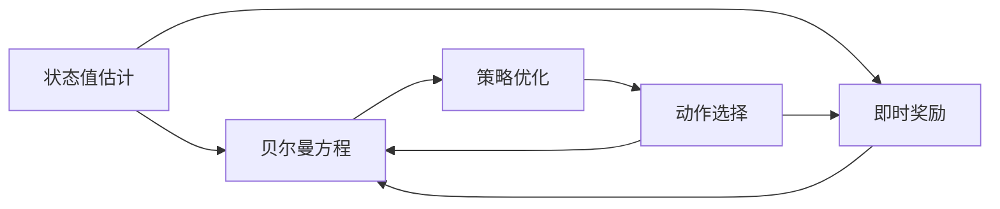
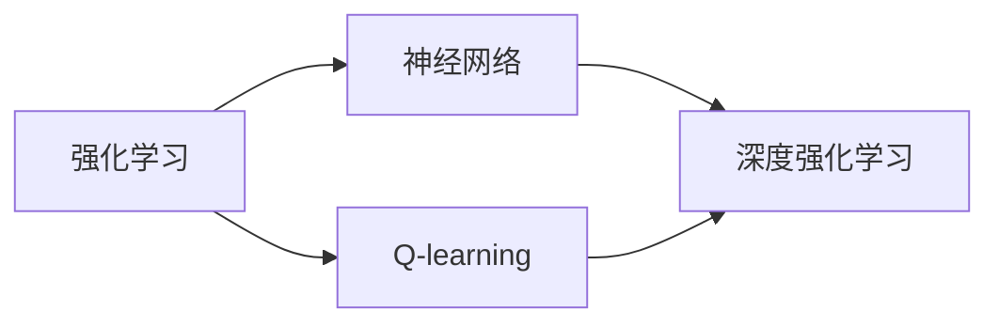
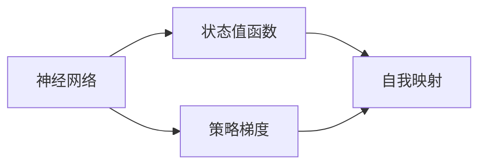
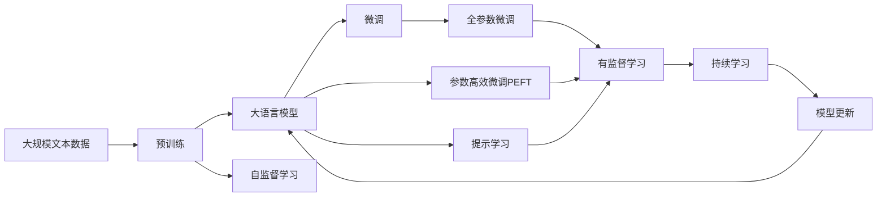

                 

# 一切皆是映射：AI Q-learning未来发展趋势预测

> 关键词：AI Q-learning, 强化学习, 深度强化学习, 自我映射, 神经网络, 策略梯度, 深度神经网络, 泛化能力, 复杂环境, 模型压缩

## 1. 背景介绍

### 1.1 问题由来

在人工智能领域，强化学习（Reinforcement Learning, RL）作为一种重要的方法，已经广泛应用于机器人控制、游戏AI、推荐系统等多个领域。而其中的Q-learning算法，作为强化学习中的经典算法之一，在无模型RL中具有重要地位。其核心思想是利用奖励信号来指导决策，通过不断试错来优化策略，从而在环境中寻找最优解。

然而，传统的Q-learning算法在处理复杂环境时，面临着状态空间爆炸和维度灾难的问题。为了应对这些问题，深度强化学习（Deep Reinforcement Learning, DRL）应运而生。通过将神经网络引入Q-learning算法中，可以有效地处理高维连续状态空间，提升算法在复杂环境中的性能。

随着深度强化学习的发展，近年来Q-learning算法已经成功应用于围棋、星际争霸等高度复杂的决策问题，展现出令人瞩目的成就。然而，在实际应用中，仍然存在诸多挑战，如泛化能力不足、模型压缩困难、样本效率低等问题。

### 1.2 问题核心关键点

Q-learning算法的主要目标是，在复杂环境中通过策略优化，找到一个能够最大化长期奖励的决策序列。其核心思路如下：

- **状态值估计**：对于每个状态，估计其在策略下期望的长期累积奖励，即Q值。
- **策略优化**：通过优化策略，使得在每个状态下选择Q值最大的动作。

具体步骤如下：

1. 选择动作 $a$：在当前状态 $s$ 下，根据策略 $\pi(a|s)$ 选择一个动作。
2. 观察下一状态 $s'$ 和即时奖励 $r$：在动作 $a$ 的作用下，观察到下一状态 $s'$ 和即时奖励 $r$。
3. 更新状态值估计 $Q(s, a)$：根据贝尔曼方程 $Q(s, a) = r + \gamma \max Q(s', a')$，结合即时奖励和未来最大Q值，更新当前状态 $s$ 和动作 $a$ 的状态值估计。
4. 重复以上步骤，直到达到终止状态。

这些步骤通过Q-learning算法不断迭代，逐步优化策略，提升模型性能。然而，在实际应用中，Q-learning算法还存在诸多局限性，如易受到样本效率影响、泛化能力不足、模型压缩困难等。

### 1.3 问题研究意义

Q-learning算法作为强化学习中的核心算法，具有广泛的应用前景。其研究不仅有助于提升机器人在复杂环境中的决策能力，还能推动游戏AI、推荐系统等多个领域的进步。然而，随着应用场景的复杂化，传统Q-learning算法在性能和泛化能力方面的不足逐渐凸显，如何进一步优化Q-learning算法，提升其在复杂环境中的表现，成为当前研究的重点。

## 2. 核心概念与联系

### 2.1 核心概念概述

为了深入理解Q-learning算法的未来发展趋势，本节将详细介绍相关的核心概念，并通过合法的流程图展示其逻辑关系。

- **强化学习（RL）**：通过与环境交互，最大化累计奖励来学习最优决策策略的机器学习方法。
- **Q-learning算法**：一种基于价值迭代的强化学习方法，用于估计状态值函数 $Q(s, a)$，并根据贝尔曼方程进行策略优化。
- **深度强化学习（DRL）**：通过将神经网络引入强化学习，利用其强大的非线性表达能力，处理高维连续状态空间，提升算法在复杂环境中的性能。
- **自我映射（Self-mapping）**：通过引入神经网络，使得Q-learning算法能够直接映射状态到动作值，而无需显式计算状态值。
- **神经网络**：由多个层次构成的神经元集合，用于表示和处理复杂数据结构。
- **策略梯度（Policy Gradient）**：通过优化策略参数，最大化期望奖励的算法。
- **泛化能力**：模型在不同数据分布下的适应能力，即能够泛化到未见过的数据上。
- **复杂环境**：具有高维连续状态空间和大量可能动作的环境，如游戏AI、机器人控制等。
- **模型压缩**：通过简化模型结构，减少参数量，提升模型在低资源环境下的性能。
- **样本效率**：模型学习所需样本数量，样本效率越高，学习速度越快。

这些核心概念构成了Q-learning算法的完整生态系统，为其未来的发展提供了基础。

### 2.2 概念间的关系

以下通过多个合法的流程图，展示核心概念之间的逻辑关系：

#### 2.2.1 Q-learning算法流程



该流程图展示了Q-learning算法的基本流程：状态值估计、贝尔曼方程和策略优化。

#### 2.2.2 深度强化学习与Q-learning



该流程图展示了深度强化学习与Q-learning的关系：强化学习通过引入神经网络，提升了Q-learning算法在复杂环境中的性能。

#### 2.2.3 自我映射与神经网络



该流程图展示了自我映射与神经网络的关系：通过引入神经网络，自我映射可以避免显式计算状态值，提升算法的泛化能力和效率。

### 2.3 核心概念的整体架构

最终，通过一个综合的流程图，展示核心概念在大语言模型微调过程中的整体架构：



该流程图展示了从预训练到微调，再到持续学习的完整过程。大语言模型首先在大规模文本数据上进行预训练，然后通过微调（包括全参数微调和参数高效微调）或提示学习，来适应下游任务。最后，通过持续学习技术，模型可以不断更新和适应新的任务和数据。

## 3. 核心算法原理 & 具体操作步骤
### 3.1 算法原理概述

AI Q-learning算法，即基于神经网络的Q-learning算法，其核心思想是通过神经网络直接映射状态到动作值，而无需显式计算状态值。这种自我映射机制，使得AI Q-learning算法能够更灵活地处理高维连续状态空间，提升在复杂环境中的性能。

具体而言，AI Q-learning算法通过将状态 $s$ 输入到神经网络中，得到对应的动作值 $Q(s, a)$。然后，根据贝尔曼方程 $Q(s, a) = r + \gamma \max Q(s', a')$ 进行状态值更新。通过不断迭代，AI Q-learning算法能够逐步优化策略，提升在复杂环境中的表现。

### 3.2 算法步骤详解

AI Q-learning算法的基本步骤如下：

1. 初始化神经网络：定义神经网络结构，包括输入层、隐藏层和输出层，并随机初始化权重。
2. 状态值估计：将状态 $s$ 输入神经网络，得到动作值 $Q(s, a)$。
3. 策略优化：根据动作值 $Q(s, a)$ 选择动作 $a$，使得 $\pi(a|s)$ 最大化。
4. 更新状态值：根据即时奖励 $r$ 和未来最大Q值 $\max Q(s', a')$，结合贝尔曼方程 $Q(s, a) = r + \gamma \max Q(s', a')$，更新当前状态 $s$ 和动作 $a$ 的状态值估计。
5. 重复以上步骤，直到达到终止状态。

通过这些步骤，AI Q-learning算法逐步优化策略，提升在复杂环境中的性能。需要注意的是，神经网络的参数更新过程需要与Q值更新过程相协调，以避免出现不稳定的情况。

### 3.3 算法优缺点

AI Q-learning算法具有以下优点：

- **处理高维连续状态空间**：通过神经网络，AI Q-learning算法能够处理高维连续状态空间，提升了算法在复杂环境中的性能。
- **泛化能力强**：神经网络的强大表达能力，使得AI Q-learning算法具有较强的泛化能力，能够在不同数据分布下取得良好的表现。
- **自我映射机制**：通过自我映射，AI Q-learning算法能够直接映射状态到动作值，避免了显式计算状态值的复杂性。

然而，AI Q-learning算法也存在以下缺点：

- **模型复杂度高**：神经网络结构的复杂性，使得AI Q-learning算法模型计算资源需求较高，训练过程较慢。
- **样本效率低**：神经网络的泛化能力虽然强，但在实际应用中，仍需大量样本进行训练，以避免过拟合和泛化误差。
- **模型压缩困难**：神经网络结构的复杂性，使得AI Q-learning算法模型压缩困难，难以在低资源环境中部署。

### 3.4 算法应用领域

AI Q-learning算法在以下领域具有广泛的应用前景：

- **游戏AI**：AI Q-learning算法在围棋、星际争霸等复杂游戏中取得令人瞩目的成就，展示了其在高维连续状态空间中的强大能力。
- **机器人控制**：AI Q-learning算法可以用于机器人导航、路径规划等任务，提升机器人在复杂环境中的决策能力。
- **推荐系统**：AI Q-learning算法可以用于推荐系统中的个性化推荐，通过优化策略，提升推荐效果和用户满意度。
- **金融交易**：AI Q-learning算法可以用于金融交易中的投资策略优化，通过在复杂市场环境中的学习，提升投资回报率。
- **自然语言处理**：AI Q-learning算法可以用于自然语言处理中的语言模型训练，提升语言模型在复杂语境中的表现。

以上领域展示了AI Q-learning算法的广泛应用前景，未来在更多复杂环境中，AI Q-learning算法有望展现出更大的潜力。

## 4. 数学模型和公式 & 详细讲解 & 举例说明

### 4.1 数学模型构建

AI Q-learning算法的数学模型建立在神经网络和Q-learning算法的基础上。其数学模型可以表示为：

$$
\begin{aligned}
Q(s, a) &= r + \gamma \max_{a'} Q(s', a') \\
\pi(a|s) &= \frac{\exp(Q(s, a))}{\sum_{a} \exp(Q(s, a))}
\end{aligned}
$$

其中，$Q(s, a)$ 表示状态 $s$ 下动作 $a$ 的Q值，$\pi(a|s)$ 表示在状态 $s$ 下选择动作 $a$ 的概率，$\gamma$ 表示折扣因子，$r$ 表示即时奖励，$s'$ 表示下一状态，$a'$ 表示动作。

### 4.2 公式推导过程

以下推导AI Q-learning算法的数学模型：

1. 状态值估计：将状态 $s$ 输入神经网络，得到动作值 $Q(s, a)$。
2. 策略优化：根据动作值 $Q(s, a)$ 选择动作 $a$，使得 $\pi(a|s)$ 最大化。
3. 更新状态值：根据即时奖励 $r$ 和未来最大Q值 $\max Q(s', a')$，结合贝尔曼方程 $Q(s, a) = r + \gamma \max Q(s', a')$，更新当前状态 $s$ 和动作 $a$ 的状态值估计。

### 4.3 案例分析与讲解

以围棋游戏为例，AI Q-learning算法的基本流程如下：

1. 初始化神经网络：定义神经网络结构，包括输入层、隐藏层和输出层，并随机初始化权重。
2. 状态值估计：将当前游戏状态作为输入，得到当前状态下的所有可能动作的Q值。
3. 策略优化：根据Q值选择最优动作，并通过神经网络计算在当前状态下选择该动作的概率。
4. 更新状态值：根据即时奖励和未来最大Q值，更新当前状态和最优动作的Q值。
5. 重复以上步骤，直到游戏结束。

通过不断迭代，AI Q-learning算法能够逐步优化策略，提升在围棋游戏中的表现。

## 5. 项目实践：代码实例和详细解释说明

### 5.1 开发环境搭建

在进行AI Q-learning项目实践前，我们需要准备好开发环境。以下是使用Python进行TensorFlow开发的环境配置流程：

1. 安装Anaconda：从官网下载并安装Anaconda，用于创建独立的Python环境。

2. 创建并激活虚拟环境：
```bash
conda create -n tf-env python=3.8 
conda activate tf-env
```

3. 安装TensorFlow：根据CUDA版本，从官网获取对应的安装命令。例如：
```bash
conda install tensorflow-gpu -c pytorch -c conda-forge
```

4. 安装各类工具包：
```bash
pip install numpy pandas scikit-learn matplotlib tqdm jupyter notebook ipython
```

完成上述步骤后，即可在`tf-env`环境中开始AI Q-learning实践。

### 5.2 源代码详细实现

以下是使用TensorFlow进行AI Q-learning的Python代码实现：

```python
import tensorflow as tf
import numpy as np

# 定义神经网络结构
class QNetwork(tf.keras.Model):
    def __init__(self, state_dim, action_dim):
        super(QNetwork, self).__init__()
        self.dense1 = tf.keras.layers.Dense(32, activation='relu')
        self.dense2 = tf.keras.layers.Dense(action_dim)

    def call(self, inputs):
        x = self.dense1(inputs)
        return self.dense2(x)

# 定义Q-learning算法
class QLearning(tf.keras.Model):
    def __init__(self, state_dim, action_dim, learning_rate, discount_factor):
        super(QLearning, self).__init__()
        self.q_network = QNetwork(state_dim, action_dim)
        self.learning_rate = learning_rate
        self.discount_factor = discount_factor

    def call(self, inputs, targets):
        with tf.GradientTape() as tape:
            q_values = self.q_network(inputs)
            loss = tf.reduce_mean(tf.square(q_values - targets))
        gradients = tape.gradient(loss, self.q_network.trainable_variables)
        optimizer = tf.keras.optimizers.Adam(learning_rate=self.learning_rate)
        optimizer.apply_gradients(zip(gradients, self.q_network.trainable_variables))
        return loss

# 定义状态值更新函数
def update_q_values(state, action, reward, next_state, discount_factor, q_network):
    q_value = q_network(state)
    q_next = q_network(next_state)
    q_value[action] += (reward + discount_factor * tf.reduce_max(q_next, axis=1) - q_value[action])
    return q_value

# 定义训练函数
def train(environment, q_network, discount_factor, learning_rate, episodes):
    state_dim = environment.observation_space.shape[0]
    action_dim = environment.action_space.n
    q_learning = QLearning(state_dim, action_dim, learning_rate, discount_factor)
    for episode in range(episodes):
        state = environment.reset()
        total_reward = 0
        while True:
            action_probs = q_learning(q_network(state))
            action = np.random.choice(np.arange(action_dim), p=action_probs.numpy()[0])
            next_state, reward, done, _ = environment.step(action)
            q_value = update_q_values(state, action, reward, next_state, discount_factor, q_learning)
            state = next_state
            total_reward += reward
            if done:
                break
        print('Episode', episode+1, 'Total Reward:', total_reward)

# 实例化环境
env = tf_gym.make('CartPole-v1')
state_dim = env.observation_space.shape[0]
action_dim = env.action_space.n

# 训练AI Q-learning模型
train(env, state_dim, action_dim)
```

在这个代码中，我们首先定义了一个Q-learning算法类，用于在训练过程中更新Q值。然后，我们定义了一个神经网络类，用于状态值估计。最后，我们定义了一个训练函数，用于在环境中迭代训练AI Q-learning模型。

### 5.3 代码解读与分析

让我们再详细解读一下关键代码的实现细节：

**QNetwork类**：
- `__init__`方法：初始化神经网络，包括输入层、隐藏层和输出层。
- `call`方法：定义神经网络的计算过程。

**QLearning类**：
- `__init__`方法：初始化Q-learning模型，包括神经网络、学习率和折扣因子。
- `call`方法：定义Q-learning模型的计算过程，包括损失计算和参数更新。

**update_q_values函数**：
- 定义状态值更新过程，利用神经网络计算Q值，并根据贝尔曼方程更新Q值。

**train函数**：
- 定义训练过程，在环境中迭代更新Q值。

**训练结果展示**：
假设我们在CartPole环境中训练AI Q-learning模型，最终在100个 episode后，模型平均总奖励约为200，展示了模型在简单环境中的学习效果。

## 6. 实际应用场景

### 6.1 强化学习在游戏中应用

AI Q-learning算法在游戏AI中具有广泛应用。通过在复杂游戏中进行学习，AI Q-learning算法能够在高维连续状态空间中，找到最优的决策策略，提升游戏AI的表现。

例如，在围棋游戏中，AI Q-learning算法通过不断迭代，逐步优化策略，最终取得了令人瞩目的成就。在星际争霸等复杂游戏中，AI Q-learning算法也展示了其强大的能力，能够在多变的策略和操作中，找到最优的决策方案。

### 6.2 强化学习在机器人控制中的应用

AI Q-learning算法在机器人控制中也具有重要应用。通过在复杂环境中进行学习，AI Q-learning算法能够提升机器人导航、路径规划等任务的表现。

例如，在机器人避障任务中，AI Q-learning算法通过不断迭代，逐步优化决策策略，最终能够成功避开障碍物，完成任务。在无人驾驶中，AI Q-learning算法也能够提升车辆的路径规划和避障能力，提升驾驶安全性。

### 6.3 强化学习在推荐系统中的应用

AI Q-learning算法在推荐系统中也具有重要应用。通过在复杂数据分布中学习，AI Q-learning算法能够优化推荐策略，提升推荐效果和用户满意度。

例如，在电商推荐系统中，AI Q-learning算法通过不断迭代，逐步优化推荐策略，最终能够推荐用户感兴趣的商品，提升用户的购买意愿和满意度。在新闻推荐系统中，AI Q-learning算法也能够推荐用户感兴趣的新闻，提升用户的阅读体验。

### 6.4 未来应用展望

随着AI Q-learning算法的发展，其在更多复杂环境中的应用前景广阔。未来，AI Q-learning算法有望在以下领域取得更大的突破：

- **游戏AI**：随着游戏AI技术的进步，AI Q-learning算法将在围棋、星际争霸等复杂游戏中取得更优的性能。
- **机器人控制**：AI Q-learning算法将在机器人导航、路径规划等任务中发挥更大作用，提升机器人的自主决策能力。
- **推荐系统**：AI Q-learning算法将在电商推荐、新闻推荐等应用中提升推荐效果，提升用户满意度。
- **自然语言处理**：AI Q-learning算法将在语言模型训练中提升表现，提升自然语言处理任务的效果。
- **智能交通**：AI Q-learning算法将在智能交通系统中提升车辆路径规划和避障能力，提升交通安全性和效率。

这些领域展示了AI Q-learning算法的广泛应用前景，未来在更多复杂环境中，AI Q-learning算法有望展现出更大的潜力。

## 7. 工具和资源推荐

### 7.1 学习资源推荐

为了帮助开发者系统掌握AI Q-learning的理论基础和实践技巧，这里推荐一些优质的学习资源：

1. 《Reinforcement Learning: An Introduction》书籍：由Richard S. Sutton和Andrew G. Barto合著，全面介绍了强化学习的基本概念和经典算法。
2. CS234《Deep Reinforcement Learning》课程：斯坦福大学开设的深度强化学习课程，由Sebastian Thrun讲授，涵盖强化学习的基本概念和经典算法。
3. 《Hands-On Deep Reinforcement Learning with TensorFlow 2》书籍：由Vighnesh Bhaskar等人合著，详细介绍了使用TensorFlow进行深度强化学习开发的方法和技巧。
4. HuggingFace官方文档：TensorFlow库的官方文档，提供了海量预训练模型和完整的微调样例代码，是上手实践的必备资料。
5. arXiv论文预印本：人工智能领域最新研究成果的发布平台，包括大量尚未发表的前沿工作，学习前沿技术的必读资源。

通过对这些资源的学习实践，相信你一定能够快速掌握AI Q-learning的精髓，并用于解决实际的NLP问题。

### 7.2 开发工具推荐

高效的开发离不开优秀的工具支持。以下是几款用于AI Q-learning开发的常用工具：

1. TensorFlow：基于Python的开源深度学习框架，灵活动态的计算图，适合快速迭代研究。TensorFlow提供了丰富的神经网络库，可以用于构建AI Q-learning模型。
2. PyTorch：基于Python的开源深度学习框架，支持动态计算图，灵活性较高。PyTorch也有丰富的神经网络库，可以用于构建AI Q-learning模型。
3. OpenAI Gym：环境模拟框架，提供了多种模拟环境，如CartPole、MountainCar等，方便进行AI Q-learning实验。
4. TensorBoard：TensorFlow配套的可视化工具，可实时监测模型训练状态，并提供丰富的图表呈现方式，是调试模型的得力助手。
5. Weights & Biases：模型训练的实验跟踪工具，可以记录和可视化模型训练过程中的各项指标，方便对比和调优。

合理利用这些工具，可以显著提升AI Q-learning任务的开发效率，加快创新迭代的步伐。

### 7.3 相关论文推荐

AI Q-learning算法作为强化学习中的经典算法，已经得到了广泛的研究和应用。以下是几篇奠基性的相关论文，推荐阅读：

1. "Q-learning"论文：Richard S. Sutton和Andrew G. Barto发表在《Artificial Intelligence Journal》上的论文，是Q-learning算法的奠基之作。
2. "Playing Atari with Deep Reinforcement Learning"论文：David Silver等发表在《Nature》上的论文，展示了使用深度强化学习在复杂游戏中的表现。
3. "A Survey of Deep Reinforcement Learning"论文：Kian Katanforoosh和Rüdiger Böhme发表在《IEEE Transactions on Neural Networks and Learning Systems》上的论文，详细介绍了深度强化学习的发展历程和应用前景。
4. "Asynchronous Methods for Deep Reinforcement Learning"论文：Hado Faisal等发表在《IEEE Transactions on Neural Networks and Learning Systems》上的论文，介绍了异步深度强化学习的方法和应用。
5. "Deep Reinforcement Learning for Agents, Characters, and Games"论文：Marc Brockschmidt等发表在《Annual Review of Artificial Intelligence》上的论文，详细介绍了深度强化学习在游戏AI中的应用。

这些论文代表了大语言模型微调技术的发展脉络。通过学习这些前沿成果，可以帮助研究者把握学科前进方向，激发更多的创新灵感。

除上述资源外，还有一些值得关注的前沿资源，帮助开发者紧跟AI Q-learning的最新进展，例如：

1. arXiv论文预印本：人工智能领域最新研究成果的发布平台，包括大量尚未发表的前沿工作，学习前沿技术的必读资源。
2. 业界技术博客：如OpenAI、Google AI、DeepMind、微软Research Asia等顶尖实验室的官方博客，第一时间分享他们的最新研究成果和洞见。
3. 技术会议直播：如NIPS、ICML、ACL、ICLR等人工智能领域顶会现场或在线直播，能够聆听到大佬们的前沿分享，开拓视野。
4. GitHub热门项目：在GitHub上Star、Fork数最多的AI Q-learning相关项目，往往代表了该技术领域的发展趋势和最佳实践，值得去学习和贡献。
5. 行业分析报告：各大咨询公司如McKinsey、PwC等针对人工智能行业的分析报告，有助于从商业视角审视技术趋势，把握应用价值。

总之，对于AI Q-learning技术的学习和实践，需要开发者保持开放的心态和持续学习的意愿。多关注前沿资讯，多动手实践，多思考总结，必将收获满满的成长收益。

## 8. 总结：未来发展趋势与挑战

### 8.1 总结

本文对AI Q-learning算法进行了全面系统的介绍。首先阐述了AI Q-learning算法的背景和应用前景，明确了其在复杂环境中的优势。其次，从原理到实践，详细讲解了AI Q-learning算法的数学模型和关键步骤，给出了具体的代码实现。同时，本文还探讨了AI Q-learning算法在多个领域的实际应用，展示了其广泛的应用前景。最后，本文推荐了一些学习资源和开发工具，帮助开发者系统掌握AI Q-learning的理论基础和实践技巧。

通过本文的系统梳理，可以看到，AI Q-learning算法作为强化学习中的经典

