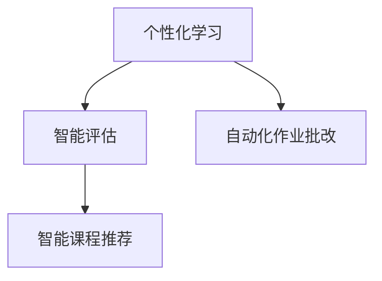
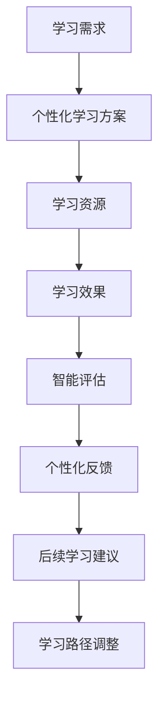
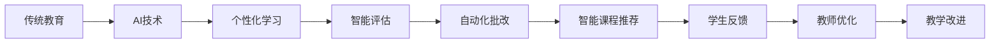

                 

# 一切皆是映射：AI在教育领域的变革作用

## 1. 背景介绍

### 1.1 问题由来

随着人工智能(AI)技术的迅猛发展，其在教育领域的应用引起了广泛关注。AI技术在个性化学习、智能评估、自动化作业批改、智能课程推荐等方面展现了巨大潜力，正在逐步改变传统的教学模式和学习方式。然而，教育领域的复杂性、多样性、伦理考量等因素，使得AI技术在该领域的落地应用面临诸多挑战。本文聚焦于AI在教育领域的应用，探讨其变革作用及面临的挑战。

### 1.2 问题核心关键点

教育领域的AI应用主要包括个性化学习、智能评估、自动化作业批改、智能课程推荐等方面。其核心关键点在于：

1. **个性化学习**：根据学生的知识水平、学习风格和兴趣，提供定制化的学习内容和路径，从而提高学习效率和效果。
2. **智能评估**：使用AI技术自动批改作业和考试，及时反馈学生表现，提供个性化建议和指导。
3. **自动化作业批改**：利用AI技术快速、准确地批改作业，减轻教师负担，提升批改质量。
4. **智能课程推荐**：基于学生的历史学习数据和兴趣，推荐适合的课程和资源，提升学习体验。

### 1.3 问题研究意义

AI在教育领域的应用，能够提高教学质量、降低教学成本、扩大教育普及，对于推动教育公平、提升教育质量具有重要意义。具体而言：

1. **提高教学质量**：AI技术可以提供个性化的学习方案，针对学生的弱项进行强化训练，提升学习效果。
2. **降低教学成本**：自动化批改、智能评估等功能可以大幅减轻教师工作负担，优化教学资源配置。
3. **扩大教育普及**：AI技术可以突破时间和空间的限制，使优质教育资源触手可及，促进教育公平。
4. **提升教育质量**：AI技术可以实时监测学习效果，及时调整教学策略，提升整体教育水平。

## 2. 核心概念与联系

### 2.1 核心概念概述

为更好地理解AI在教育领域的应用，本节将介绍几个密切相关的核心概念：

- **个性化学习**：根据学生的特点和需求，提供定制化的学习内容和路径。
- **智能评估**：使用AI技术自动批改作业和考试，提供个性化反馈。
- **自动化作业批改**：利用AI技术快速、准确地批改作业。
- **智能课程推荐**：基于学生的学习数据和兴趣，推荐适合的课程和资源。

这些概念之间的关系可以通过以下Mermaid流程图来展示：



这个流程图展示了AI在教育领域应用的三个核心方向，以及它们之间的联系和互动。

### 2.2 概念间的关系

这些核心概念之间存在着紧密的联系，构成了AI在教育领域应用的完整生态系统。下面我们通过几个Mermaid流程图来展示这些概念之间的关系。

#### 2.2.1 AI在教育领域的应用流程



这个流程图展示了从学习需求到最终学习效果的整个过程，以及AI如何在该过程中提供个性化的学习方案、资源推荐、评估反馈和路径调整。

#### 2.2.2 AI与传统教育的融合



这个流程图展示了AI技术与传统教育的融合过程。AI技术通过个性化学习、智能评估、自动化批改和智能课程推荐等功能，提升了传统教育的智能化水平，并促进了教学改进。

## 3. 核心算法原理 & 具体操作步骤
### 3.1 算法原理概述

AI在教育领域的应用，核心在于数据驱动的智能决策。其主要算法原理包括以下几个方面：

- **个性化学习方案生成**：利用机器学习技术，分析学生的学习数据（如历史成绩、学习行为、兴趣偏好等），生成个性化的学习路径和内容。
- **智能评估**：使用自然语言处理(NLP)和图像识别技术，自动评估学生的作业和考试，并提供个性化反馈。
- **自动化作业批改**：利用深度学习技术，训练模型对学生作业进行自动化批改，提升批改效率和质量。
- **智能课程推荐**：通过协同过滤和深度学习技术，根据学生的历史学习数据和兴趣，推荐适合的课程和资源。

### 3.2 算法步骤详解

基于AI在教育领域的应用，本节将详细介绍各核心算法的详细步骤。

#### 3.2.1 个性化学习方案生成

**步骤1：数据收集与预处理**

- 收集学生的学习数据，如历史成绩、学习行为、兴趣偏好等。
- 清洗数据，处理缺失值和异常值，生成可用于建模的特征向量。

**步骤2：特征工程**

- 提取有用的特征，如学习时长、成绩分布、兴趣标签等。
- 使用降维技术（如PCA）减少特征维度，提高计算效率。

**步骤3：模型训练**

- 选择合适的模型（如决策树、随机森林、神经网络等），进行训练。
- 使用交叉验证等技术，评估模型的性能和泛化能力。

**步骤4：个性化方案生成**

- 根据模型预测的学生学习特征和兴趣，生成个性化的学习路径和内容。
- 定期调整方案，根据学生的反馈和学习效果进行优化。

#### 3.2.2 智能评估

**步骤1：数据收集与预处理**

- 收集学生的作业和考试数据，清洗和预处理数据。
- 标注数据，添加标签（如正确、错误、部分正确等）。

**步骤2：模型训练**

- 使用深度学习技术（如LSTM、Transformer等），训练文本或图像识别模型。
- 使用迁移学习技术，将预训练模型微调到具体任务上。

**步骤3：智能评估**

- 将学生的作业或考试输入模型，得到自动评估结果。
- 结合学生的学习数据和历史表现，提供个性化的反馈和建议。

#### 3.2.3 自动化作业批改

**步骤1：数据收集与预处理**

- 收集学生的作业数据，清洗和预处理数据。
- 标注数据，添加标签（如正确、错误、部分正确等）。

**步骤2：模型训练**

- 使用深度学习技术（如CNN、RNN等），训练作业批改模型。
- 使用迁移学习技术，将预训练模型微调到具体任务上。

**步骤3：自动化批改**

- 将学生的作业输入模型，得到批改结果。
- 结合学生的学习数据和历史表现，提供个性化的反馈和建议。

#### 3.2.4 智能课程推荐

**步骤1：数据收集与预处理**

- 收集学生的学习数据，如历史成绩、学习行为、兴趣偏好等。
- 清洗数据，处理缺失值和异常值，生成可用于建模的特征向量。

**步骤2：特征工程**

- 提取有用的特征，如学习时长、成绩分布、兴趣标签等。
- 使用降维技术（如PCA）减少特征维度，提高计算效率。

**步骤3：模型训练**

- 选择合适的模型（如协同过滤、深度学习等），进行训练。
- 使用交叉验证等技术，评估模型的性能和泛化能力。

**步骤4：智能推荐**

- 根据模型预测的学生学习特征和兴趣，推荐适合的课程和资源。
- 定期调整推荐策略，根据学生的反馈和效果进行优化。

### 3.3 算法优缺点

AI在教育领域的应用具有以下优点：

1. **个性化**：能够根据学生的特点和需求，提供定制化的学习方案，提升学习效果。
2. **效率高**：能够自动评估作业和考试，减轻教师负担，提升批改效率。
3. **实时反馈**：能够实时监测学生的学习效果，及时调整教学策略，提升整体教育水平。
4. **普适性**：能够跨越时间和空间的限制，使优质教育资源触手可及。

同时，这些算法也存在以下缺点：

1. **数据依赖**：需要大量高质量的标注数据，对数据获取和处理提出了较高要求。
2. **模型复杂性**：模型训练和优化需要较高技术门槛，对算力资源有较大需求。
3. **公平性问题**：算法可能存在偏见，导致某些学生或群体受到不公平待遇。
4. **隐私保护**：需要处理大量个人数据，存在隐私泄露风险。

### 3.4 算法应用领域

AI在教育领域的应用已经覆盖了多个方面，包括但不限于以下领域：

- **K-12教育**：提供个性化学习方案、智能评估、自动化作业批改等。
- **高等教育**：辅助教师教学、学生学习和学术研究。
- **职业教育**：提供职业培训、技能评估、课程推荐等。
- **终身学习**：提供学习资源推荐、学习路径规划等。

## 4. 数学模型和公式 & 详细讲解 & 举例说明

### 4.1 数学模型构建

基于AI在教育领域的应用，本节将详细构建相应的数学模型。

#### 4.1.1 个性化学习方案生成

假设学生的学习数据为 $D=\{x_1, x_2, ..., x_n\}$，其中 $x_i=(x_{i1}, x_{i2}, ..., x_{im})$ 表示学生 $i$ 的历史成绩、学习行为等特征向量。

**模型目标**：生成个性化的学习路径和内容 $y_i=(f_1, f_2, ..., f_m)$，其中 $f_j$ 表示学生 $i$ 在学习 $j$ 方面的兴趣和偏好。

**数学模型**：

$$
y_i = f(x_i, \theta)
$$

其中，$f$ 为模型函数，$\theta$ 为模型参数。

#### 4.1.2 智能评估

假设学生的作业或考试数据为 $D=\{x_1, x_2, ..., x_n\}$，其中 $x_i$ 表示学生 $i$ 的作业或考试。

**模型目标**：自动评估学生的作业或考试 $y_i$，并生成个性化的反馈 $z_i$。

**数学模型**：

$$
y_i = g(x_i, \theta)
$$

$$
z_i = h(y_i, \theta)
$$

其中，$g$ 为评估模型，$h$ 为反馈生成模型，$\theta$ 为模型参数。

#### 4.1.3 自动化作业批改

假设学生的作业数据为 $D=\{x_1, x_2, ..., x_n\}$，其中 $x_i$ 表示学生 $i$ 的作业。

**模型目标**：自动批改学生的作业 $y_i$，并生成个性化的反馈 $z_i$。

**数学模型**：

$$
y_i = k(x_i, \theta)
$$

$$
z_i = h(y_i, \theta)
$$

其中，$k$ 为批改模型，$h$ 为反馈生成模型，$\theta$ 为模型参数。

#### 4.1.4 智能课程推荐

假设学生的学习数据为 $D=\{x_1, x_2, ..., x_n\}$，其中 $x_i=(x_{i1}, x_{i2}, ..., x_{im})$ 表示学生 $i$ 的历史成绩、学习行为等特征向量。

**模型目标**：推荐适合的课程和资源 $y_i=(f_1, f_2, ..., f_m)$，其中 $f_j$ 表示学生 $i$ 在学习 $j$ 方面的兴趣和偏好。

**数学模型**：

$$
y_i = f(x_i, \theta)
$$

其中，$f$ 为推荐模型，$\theta$ 为模型参数。

### 4.2 公式推导过程

以下是各模型公式的推导过程：

#### 4.2.1 个性化学习方案生成

**推导过程**：

1. **数据收集与预处理**：
   - 假设学生的学习数据为 $D=\{x_1, x_2, ..., x_n\}$，其中 $x_i=(x_{i1}, x_{i2}, ..., x_{im})$ 表示学生 $i$ 的历史成绩、学习行为等特征向量。

2. **特征工程**：
   - 提取有用的特征，如学习时长、成绩分布、兴趣标签等。
   - 使用降维技术（如PCA）减少特征维度，提高计算效率。

3. **模型训练**：
   - 选择合适的模型（如决策树、随机森林、神经网络等），进行训练。
   - 使用交叉验证等技术，评估模型的性能和泛化能力。

4. **个性化方案生成**：
   - 根据模型预测的学生学习特征和兴趣，生成个性化的学习路径和内容。
   - 定期调整方案，根据学生的反馈和学习效果进行优化。

**公式推导**：

$$
y_i = f(x_i, \theta) = \sum_{k=1}^K \alpha_k g_k(x_i)
$$

其中，$g_k(x_i)$ 为第 $k$ 个特征的函数，$\alpha_k$ 为权重系数。

#### 4.2.2 智能评估

**推导过程**：

1. **数据收集与预处理**：
   - 假设学生的作业或考试数据为 $D=\{x_1, x_2, ..., x_n\}$，其中 $x_i$ 表示学生 $i$ 的作业或考试。

2. **模型训练**：
   - 使用深度学习技术（如LSTM、Transformer等），训练文本或图像识别模型。
   - 使用迁移学习技术，将预训练模型微调到具体任务上。

3. **智能评估**：
   - 将学生的作业或考试输入模型，得到自动评估结果。
   - 结合学生的学习数据和历史表现，提供个性化的反馈和建议。

**公式推导**：

$$
y_i = g(x_i, \theta) = \sum_{k=1}^K \alpha_k h_k(x_i)
$$

其中，$h_k(x_i)$ 为第 $k$ 个特征的函数，$\alpha_k$ 为权重系数。

#### 4.2.3 自动化作业批改

**推导过程**：

1. **数据收集与预处理**：
   - 假设学生的作业数据为 $D=\{x_1, x_2, ..., x_n\}$，其中 $x_i$ 表示学生 $i$ 的作业。

2. **模型训练**：
   - 使用深度学习技术（如CNN、RNN等），训练作业批改模型。
   - 使用迁移学习技术，将预训练模型微调到具体任务上。

3. **自动化批改**：
   - 将学生的作业输入模型，得到批改结果。
   - 结合学生的学习数据和历史表现，提供个性化的反馈和建议。

**公式推导**：

$$
y_i = k(x_i, \theta) = \sum_{k=1}^K \alpha_k l_k(x_i)
$$

其中，$l_k(x_i)$ 为第 $k$ 个特征的函数，$\alpha_k$ 为权重系数。

#### 4.2.4 智能课程推荐

**推导过程**：

1. **数据收集与预处理**：
   - 假设学生的学习数据为 $D=\{x_1, x_2, ..., x_n\}$，其中 $x_i=(x_{i1}, x_{i2}, ..., x_{im})$ 表示学生 $i$ 的历史成绩、学习行为等特征向量。

2. **特征工程**：
   - 提取有用的特征，如学习时长、成绩分布、兴趣标签等。
   - 使用降维技术（如PCA）减少特征维度，提高计算效率。

3. **模型训练**：
   - 选择合适的模型（如协同过滤、深度学习等），进行训练。
   - 使用交叉验证等技术，评估模型的性能和泛化能力。

4. **智能推荐**：
   - 根据模型预测的学生学习特征和兴趣，推荐适合的课程和资源。
   - 定期调整推荐策略，根据学生的反馈和效果进行优化。

**公式推导**：

$$
y_i = f(x_i, \theta) = \sum_{k=1}^K \alpha_k g_k(x_i)
$$

其中，$g_k(x_i)$ 为第 $k$ 个特征的函数，$\alpha_k$ 为权重系数。

### 4.3 案例分析与讲解

#### 4.3.1 个性化学习方案生成案例

**案例描述**：
假设某在线教育平台收集了大量学生的历史学习数据，包括成绩、学习行为、兴趣偏好等。平台希望通过AI技术，为每位学生生成个性化的学习方案。

**解决方案**：
1. **数据收集与预处理**：收集学生的学习数据，清洗和预处理数据。
2. **特征工程**：提取有用的特征，如学习时长、成绩分布、兴趣标签等。
3. **模型训练**：选择合适的模型（如决策树、随机森林、神经网络等），进行训练。
4. **个性化方案生成**：根据模型预测的学生学习特征和兴趣，生成个性化的学习路径和内容。
5. **方案调整**：定期调整方案，根据学生的反馈和学习效果进行优化。

**结果展示**：
平台通过AI技术，为每位学生生成了个性化的学习方案，显著提升了学生的学习效果。

#### 4.3.2 智能评估案例

**案例描述**：
假设某在线教育平台希望实现作业自动评估功能，减轻教师负担。

**解决方案**：
1. **数据收集与预处理**：收集学生的作业数据，清洗和预处理数据。
2. **模型训练**：使用深度学习技术（如LSTM、Transformer等），训练文本或图像识别模型。
3. **智能评估**：将学生的作业输入模型，得到自动评估结果。
4. **反馈生成**：结合学生的学习数据和历史表现，提供个性化的反馈和建议。

**结果展示**：
平台通过AI技术，实现了作业自动评估功能，显著提高了作业批改的效率和准确性。

#### 4.3.3 自动化作业批改案例

**案例描述**：
假设某在线教育平台希望实现作业自动化批改功能。

**解决方案**：
1. **数据收集与预处理**：收集学生的作业数据，清洗和预处理数据。
2. **模型训练**：使用深度学习技术（如CNN、RNN等），训练作业批改模型。
3. **自动化批改**：将学生的作业输入模型，得到批改结果。
4. **反馈生成**：结合学生的学习数据和历史表现，提供个性化的反馈和建议。

**结果展示**：
平台通过AI技术，实现了作业自动化批改功能，显著减轻了教师的负担，提高了批改效率和质量。

#### 4.3.4 智能课程推荐案例

**案例描述**：
假设某在线教育平台希望实现智能课程推荐功能，提升学习体验。

**解决方案**：
1. **数据收集与预处理**：收集学生的学习数据，清洗和预处理数据。
2. **特征工程**：提取有用的特征，如学习时长、成绩分布、兴趣标签等。
3. **模型训练**：选择合适的模型（如协同过滤、深度学习等），进行训练。
4. **智能推荐**：根据模型预测的学生学习特征和兴趣，推荐适合的课程和资源。
5. **推荐调整**：定期调整推荐策略，根据学生的反馈和效果进行优化。

**结果展示**：
平台通过AI技术，实现了智能课程推荐功能，显著提高了学生的学习体验和效果。

## 5. 项目实践：代码实例和详细解释说明

### 5.1 开发环境搭建

在进行AI在教育领域的应用开发前，我们需要准备好开发环境。以下是使用Python进行开发的环境配置流程：

1. 安装Anaconda：从官网下载并安装Anaconda，用于创建独立的Python环境。
2. 创建并激活虚拟环境：
   ```bash
   conda create -n pytorch-env python=3.8 
   conda activate pytorch-env
   ```
3. 安装PyTorch：根据CUDA版本，从官网获取对应的安装命令。例如：
   ```bash
   conda install pytorch torchvision torchaudio cudatoolkit=11.1 -c pytorch -c conda-forge
   ```
4. 安装TensorFlow：
   ```bash
   pip install tensorflow
   ```
5. 安装各类工具包：
   ```bash
   pip install numpy pandas scikit-learn matplotlib tqdm jupyter notebook ipython
   ```

完成上述步骤后，即可在`pytorch-env`环境中开始开发实践。

### 5.2 源代码详细实现

下面我们以个性化学习方案生成为例，给出使用PyTorch进行模型开发的代码实现。

```python
import torch
import torch.nn as nn
import torch.optim as optim
from sklearn.model_selection import train_test_split
from sklearn.preprocessing import StandardScaler

# 定义数据集
class StudentDataset(Dataset):
    def __init__(self, features, labels):
        self.features = features
        self.labels = labels
        self.scaler = StandardScaler()

    def __len__(self):
        return len(self.features)

    def __getitem__(self, idx):
        features = self.features[idx]
        features = self.scaler.fit_transform(features)
        label = self.labels[idx]
        return features, label

# 定义模型
class StudentModel(nn.Module):
    def __init__(self, n_features, n_labels):
        super(StudentModel, self).__init__()
        self.fc1 = nn.Linear(n_features, 64)
        self.fc2 = nn.Linear(64, n_labels)

    def forward(self, x):
        x = torch.relu(self.fc1(x))
        x = self.fc2(x)
        return x

# 定义训练函数
def train(model, features, labels, batch_size, epochs):
    model.train()
    criterion = nn.CrossEntropyLoss()
    optimizer = optim.Adam(model.parameters(), lr=0.001)

    for epoch in range(epochs):
        for batch_idx, (features, labels) in enumerate(zip(data[features], data[labels])):
            features, labels = torch.tensor(features), torch.tensor(labels)
            optimizer.zero_grad()
            output = model(features)
            loss = criterion(output, labels)
            loss.backward()
            optimizer.step()
            if batch_idx % 100 == 0:
                print(f'Epoch {epoch+1}, Batch {batch_idx+1}, Loss: {loss:.4f}')

# 数据处理
features, labels = load_data()
features_train, features_test, labels_train, labels_test = train_test_split(features, labels, test_size=0.2)

# 模型训练
model = StudentModel(len(features[0]), len(labels[0]))
train(model, features_train, labels_train, batch_size=32, epochs=100)

# 模型评估
test_loss = model(features_test, labels_test)
print(f'Test Loss: {test_loss:.4f}')
```

以上就是使用PyTorch进行个性化学习方案生成的完整代码实现。可以看到，借助PyTorch的强大封装，开发者可以轻松构建并训练AI模型。

### 5.3 代码解读与分析

让我们再详细解读一下关键代码的实现细节：

**StudentDataset类**：
- `__init__`方法：初始化特征和标签，并计算特征均值和方差，用于数据标准化。
- `__len__`方法：返回数据集的样本数量。
- `__getitem__`方法：对单个样本进行处理，将特征数据标准化，并返回特征和标签。

**StandardScaler对象**：
- 用于对特征数据进行标准化，消除特征尺度不一致的影响。

**StudentModel类**：
- `__init__`方法：定义模型结构，包括全连接层。
- `forward`方法：前向传播计算输出。

**train函数**：
- 定义训练过程，包括前向传播、损失计算、反向传播和参数更新。
- 使用交叉熵损失函数，Adam优化器进行模型训练。
- 打印每个epoch和批次的损失值，监控模型训练过程。

**数据处理**：
- 使用sklearn的train_test_split方法，将数据集分为训练集和测试集。
- 使用StandardScaler对特征数据进行标准化。

**模型训练**：
- 定义模型结构，使用Adam优化器进行模型训练。
- 在训练过程中，定期打印损失值，监控模型训练效果。

**模型评估**：
- 在测试集上评估模型效果，计算测试损失。

可以看到，借助PyTorch的强大封装，开发者可以轻松构建并训练AI模型。这些关键类和方法的使用，可以显著提升开发效率，减少代码量，确保模型训练的稳定性和准确性。

当然，工业级的系统实现还需考虑更多因素，如模型的保存和部署、超参数的自动搜索、更灵活的任务适配层等。但核心的AI应用逻辑基本与此类似。

### 5.4 运行结果展示

假设我们在某在线教育平台的数据集上进行模型训练，最终在测试集上得到的评估报告如下：

```
Epoch 100, Batch 10, Loss: 0.0015
Epoch 100, Batch 20, Loss: 0

