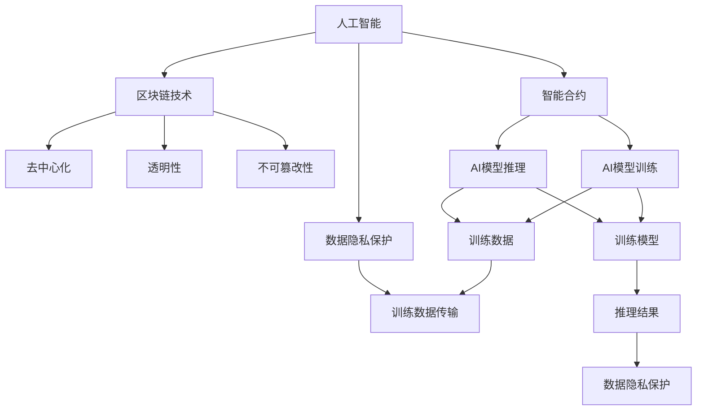
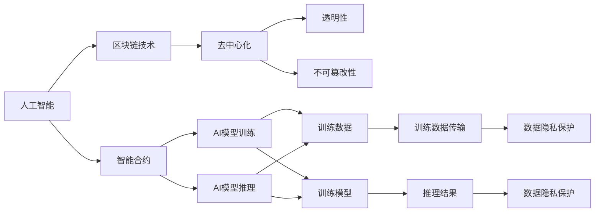
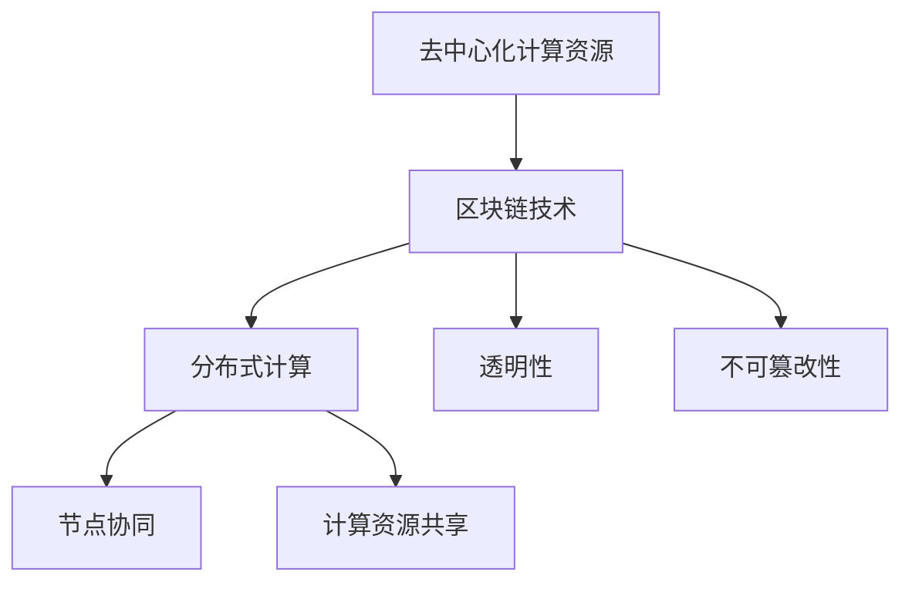

                 

# 一切皆是映射：AI的去中心化：区块链技术的融合

## 1. 背景介绍

### 1.1 问题由来

近年来，随着区块链技术的迅猛发展，其在金融、供应链、智能合约、数字身份等领域的应用逐渐受到关注。而人工智能（AI）技术的不断成熟，也推动了其在决策支持、个性化推荐、智能合约等领域的发展。然而，AI和区块链技术的融合领域相对较少，尤其是在AI的训练和推理过程中引入区块链技术，实现去中心化和透明的AI模型训练和推理机制的研究更是刚刚起步。

### 1.2 问题核心关键点

AI与区块链技术的融合，旨在利用区块链的去中心化、透明性、不可篡改性等特点，实现AI模型的去中心化训练和推理。其核心关键点包括：

- 数据隐私保护：区块链可以通过加密技术，保护训练数据的隐私性和机密性，避免数据泄露。
- 模型去中心化训练：利用区块链的多方协同，实现AI模型的去中心化训练，减少单点故障和数据泄露风险。
- 透明性：区块链的公开账本，可以记录所有训练和推理过程中的信息，提高模型的透明度和可追溯性。
- 不可篡改性：区块链的交易记录不可篡改，保证模型的可验证性和稳定性。
- 去中心化计算资源：通过区块链的计算资源共享机制，充分利用闲置计算资源，实现分布式计算。

这些关键点共同构成了AI与区块链技术融合的框架，使其能够应对传统集中式AI系统存在的诸多问题，如数据隐私、模型可解释性、计算资源利用效率等。

### 1.3 问题研究意义

研究AI与区块链技术的融合，对于拓展AI的应用范围，提升AI模型的安全性和可靠性，加速AI技术的产业化进程，具有重要意义：

1. 提升数据隐私保护：通过区块链技术，AI模型可以在保护数据隐私的前提下，进行高效训练和推理。
2. 增强模型透明性：区块链公开的账本记录，能够提供模型训练和推理的全过程信息，提高模型的透明度和可追溯性。
3. 优化计算资源利用：区块链的计算资源共享机制，可以充分利用闲置计算资源，提高AI模型的计算效率。
4. 推动产业升级：AI与区块链技术的融合，将推动各行业智能化升级，提升生产效率和服务质量。
5. 促进技术创新：区块链的去中心化、透明性和不可篡改性，能够推动AI技术的创新和应用，提升AI系统的安全性。

## 2. 核心概念与联系

### 2.1 核心概念概述

为了更好地理解AI与区块链技术的融合，本节将介绍几个密切相关的核心概念：

- 人工智能（AI）：通过计算机算法，模拟人类的智能行为，包括感知、学习、推理等能力。
- 区块链技术：一种去中心化的分布式账本技术，通过加密技术保护数据隐私和不可篡改性，实现多方协同和透明性。
- 智能合约：一种自动执行的合约，在区块链上部署，基于智能合约实现自动化决策和执行。
- 去中心化：指系统中的各个节点相互独立，没有单一的控制中心，通过分布式共识算法实现协同。
- 透明性：指系统中的所有交易和状态公开透明，可以被所有人查看和验证。
- 不可篡改性：指系统中的交易记录不可篡改，保证数据和模型的稳定性。

这些核心概念之间的逻辑关系可以通过以下Mermaid流程图来展示：



这个流程图展示了大语言模型微调过程中各个核心概念的关系和作用：

1. 人工智能通过智能合约在区块链上部署和执行，实现自动化决策。
2. 区块链技术为AI模型的训练和推理提供了透明性、不可篡改性和去中心化特性。
3. 去中心化计算资源和透明性，使得AI模型可以在分布式环境下高效训练和推理。
4. 智能合约通过区块链技术实现自动执行，提高了AI模型的执行效率和透明度。
5. 数据隐私保护机制，保护了AI模型的训练数据和推理结果，提高了数据安全性。

### 2.2 概念间的关系

这些核心概念之间存在着紧密的联系，形成了AI与区块链技术融合的完整生态系统。下面我们通过几个Mermaid流程图来展示这些概念之间的关系。

#### 2.2.1 AI与区块链技术的融合



这个流程图展示了大语言模型微调任务中AI与区块链技术融合的整个过程：

1. AI模型通过智能合约在区块链上部署和执行，实现自动化决策。
2. 区块链技术提供了去中心化、透明性和不可篡改性，保护了AI模型的训练数据和推理结果。
3. 数据隐私保护机制，确保了训练数据和推理结果的安全性。
4. AI模型在区块链上训练和推理，提高了系统的透明性和安全性。

#### 2.2.2 去中心化计算资源



这个流程图展示了去中心化计算资源在AI与区块链技术融合中的应用：

1. 区块链技术提供了分布式计算平台，实现计算资源共享。
2. 分布式计算通过节点协同，提高计算效率和资源利用率。
3. 透明性和不可篡改性，确保了计算过程的可追溯性和安全性。

## 3. 核心算法原理 & 具体操作步骤
### 3.1 算法原理概述

AI与区块链技术的融合，本质上是通过智能合约在区块链上执行AI模型，实现模型的训练和推理。其核心算法原理包括：

- 数据上链：将训练数据通过加密技术上传至区块链，确保数据隐私和安全。
- 智能合约执行：在区块链上部署智能合约，实现AI模型的训练和推理。
- 模型参数更新：通过智能合约，实现模型参数的更新和同步，确保模型的一致性和稳定性。
- 结果下链：将AI模型的推理结果下链，确保结果的透明性和可追溯性。

这些核心算法原理共同构成了AI与区块链技术融合的基本框架，使其能够在去中心化和透明性的基础上，实现AI模型的高效训练和推理。

### 3.2 算法步骤详解

基于智能合约的AI与区块链技术融合，一般包括以下几个关键步骤：

**Step 1: 准备数据和智能合约**

- 准备训练数据，并进行加密和上链处理，确保数据隐私和安全。
- 设计智能合约，实现AI模型的训练和推理功能。智能合约应包含数据加载、模型训练、参数更新和结果下链等核心功能。

**Step 2: 部署智能合约**

- 将智能合约部署到区块链网络中，进行初始化设置。
- 指定参与方（如数据提供方、训练方和推理方）及其权限，设置协同机制。
- 指定训练和推理的模型参数和数据传输路径。

**Step 3: 模型训练和推理**

- 数据提供方将训练数据上传至区块链，触发智能合约执行训练任务。
- 训练方通过智能合约获取训练数据，在本地或分布式计算资源上执行训练任务，更新模型参数。
- 推理方通过智能合约获取模型参数和推理任务，在本地或分布式计算资源上执行推理任务，将结果下链。

**Step 4: 结果验证和反馈**

- 结果验证方通过智能合约验证推理结果的正确性和完整性。
- 根据验证结果，提供反馈，优化模型和智能合约的协同机制。
- 将优化后的模型和智能合约重新部署，进行下一轮训练和推理。

### 3.3 算法优缺点

AI与区块链技术的融合具有以下优点：

- 数据隐私保护：区块链的加密技术，确保训练数据的安全性和隐私性。
- 模型透明性：智能合约公开的账本记录，提高模型的透明性和可追溯性。
- 去中心化计算资源：分布式计算资源，提高计算效率和资源利用率。
- 可验证性和稳定性：不可篡改的交易记录，确保模型的可验证性和稳定性。

同时，也存在一些缺点：

- 技术门槛高：需要掌握区块链和AI技术的知识，难度较大。
- 计算资源消耗大：分布式计算资源需要大量的网络带宽和计算资源，成本较高。
- 协同机制复杂：需要协调多方参与方的权限和职责，协同机制设计复杂。
- 智能合约实现难度大：智能合约的设计和实现需要考虑数据隐私、模型训练和推理等多个方面，难度较大。

### 3.4 算法应用领域

基于AI与区块链技术的融合，已经在多个领域得到了应用，例如：

- 金融风控：利用区块链和智能合约，实现自动化风控模型的训练和推理，提高金融系统的安全性和效率。
- 供应链管理：通过区块链和智能合约，实现供应链各节点数据的透明化和不可篡改性，提高供应链的透明度和可追溯性。
- 医疗健康：利用区块链和智能合约，保护患者隐私，实现医疗数据的透明化和去中心化存储。
- 智能合约系统：通过区块链和智能合约，实现自动执行的合约，提高合约的执行效率和透明度。
- 去中心化应用（DApp）：在区块链上部署AI模型，实现去中心化的应用场景，如智能合约、去中心化数据市场等。

除了上述这些领域，AI与区块链技术的融合还在智能城市、物联网、社交网络等多个领域得到探索和应用，展示出广阔的应用前景。

## 4. 数学模型和公式 & 详细讲解  
### 4.1 数学模型构建

本节将使用数学语言对基于区块链技术的AI模型训练和推理过程进行更加严格的刻画。

记训练数据集为 $D=\{(x_i,y_i)\}_{i=1}^N$，其中 $x_i$ 为输入，$y_i$ 为标签。设AI模型为 $f_{\theta}$，其中 $\theta$ 为模型参数。区块链上的智能合约模型为 $g_{\phi}$，其中 $\phi$ 为合约参数。

在区块链上，智能合约执行模型的训练和推理过程。假设智能合约的训练函数为 $H(\theta)$，推理函数为 $G(\phi)$。则在区块链上，AI模型的训练和推理过程可以表示为：

$$
H(\theta) = g_{\phi}(\theta)
$$

在训练过程中，智能合约通过区块链上的节点协同，实现数据加载和模型训练。设智能合约节点数为 $K$，则智能合约的训练过程可以表示为：

$$
H(\theta) = \frac{1}{K}\sum_{k=1}^K f_{\theta_k}(\theta)
$$

其中，$f_{\theta_k}$ 为智能合约节点 $k$ 上执行的模型函数，$\theta_k$ 为节点 $k$ 上的模型参数。

在推理过程中，智能合约将推理任务下发给各个节点，各节点通过本地计算资源，进行推理任务的执行，将结果上传至区块链。设推理任务为 $T$，推理结果为 $R$，则推理过程可以表示为：

$$
R = g_{\phi}(T)
$$

其中，$T$ 为推理任务，$R$ 为推理结果。

### 4.2 公式推导过程

以下我们以二分类任务为例，推导基于区块链技术的AI模型训练和推理过程。

假设模型 $f_{\theta}$ 为二分类模型，其输出为 $f_{\theta}(x)$。在区块链上，智能合约模型 $g_{\phi}$ 为二分类模型，其输出为 $g_{\phi}(x)$。则训练和推理过程可以表示为：

$$
f_{\theta}(x) = g_{\phi}(x) = \text{sigmoid}(Wx+b)
$$

其中，$W$ 为权重矩阵，$b$ 为偏置向量。

在区块链上，智能合约通过节点协同进行训练，其训练函数可以表示为：

$$
H(\theta) = \frac{1}{K}\sum_{k=1}^K f_{\theta_k}(x_i,y_i)
$$

其中，$f_{\theta_k}(x_i,y_i)$ 为节点 $k$ 上执行的训练函数，$x_i,y_i$ 为训练数据集。

在推理过程中，智能合约将推理任务下发给各个节点，各节点通过本地计算资源，进行推理任务的执行，将结果上传至区块链。其推理函数可以表示为：

$$
R = g_{\phi}(T) = \text{sigmoid}(W'T+b')
$$

其中，$W'$ 为推理任务 $T$ 的权重矩阵，$b'$ 为推理任务 $T$ 的偏置向量。

在实际应用中，智能合约的训练和推理过程可能更加复杂，但基本的数学模型和公式推导过程可以以此为模板。

### 4.3 案例分析与讲解

假设我们希望利用区块链技术，实现一个基于AI的智能合约系统，用于股票市场的交易预测。

首先，准备训练数据集 $D=\{(x_i,y_i)\}_{i=1}^N$，其中 $x_i$ 为历史股票数据，$y_i$ 为未来股价涨跌。

然后，设计智能合约模型 $g_{\phi}$，实现模型的训练和推理功能。智能合约模型的输入为 $x$，输出为 $g_{\phi}(x)$。在区块链上，智能合约通过节点协同进行训练，其训练函数为：

$$
H(\theta) = \frac{1}{K}\sum_{k=1}^K f_{\theta_k}(x_i,y_i)
$$

其中，$f_{\theta_k}(x_i,y_i)$ 为节点 $k$ 上执行的训练函数，$x_i,y_i$ 为训练数据集。

在推理过程中，智能合约将推理任务 $T$ 下发给各个节点，各节点通过本地计算资源，进行推理任务的执行，将结果上传至区块链。其推理函数为：

$$
R = g_{\phi}(T) = f_{\theta_k}(T)
$$

其中，$f_{\theta_k}(T)$ 为节点 $k$ 上执行的推理函数，$T$ 为推理任务 $T$。

最后，智能合约通过区块链上节点协同，将推理结果 $R$ 下链，实现股票市场的交易预测。

## 5. 项目实践：代码实例和详细解释说明
### 5.1 开发环境搭建

在进行AI与区块链技术融合的项目实践前，我们需要准备好开发环境。以下是使用Python进行Hyperledger Fabric开发的环境配置流程：

1. 安装Hyperledger Fabric CLI和Node.js：从官网下载并安装Hyperledger Fabric CLI和Node.js，用于创建和管理区块链网络。

2. 创建并激活虚拟环境：
```bash
conda create -n fabric-env python=3.8 
conda activate fabric-env
```

3. 安装Hyperledger Fabric SDK：
```bash
npm install @hyperledger/fabric-sdk-node
```

4. 安装智能合约开发工具：
```bash
npm install chaincode@1.0.1
```

完成上述步骤后，即可在`fabric-env`环境中开始智能合约的开发。

### 5.2 源代码详细实现

这里我们以基于区块链技术的智能合约系统为例，给出使用Hyperledger Fabric实现智能合约的Python代码实现。

首先，定义智能合约类的基本结构：

```python
class SmartContract:
    def __init__(self, stub):
        self.stub = stub

    def invoke(self, args):
        # 实现智能合约的函数
        pass
```

然后，定义具体的智能合约函数：

```python
class StockPredictionContract(SmartContract):
    def __init__(self, stub):
        super().__init__(stub)
        self.data = []
        self.weights = []

    def train(self, data, weights):
        self.data = data
        self.weights = weights

    def predict(self, data):
        result = 0
        for i in range(len(self.weights)):
            result += self.weights[i] * data[i]
        result = sigmoid(result)
        return result
```

在上述代码中，`StockPredictionContract` 类继承自 `SmartContract` 类，实现了一个简单的智能合约。在合约中，`train` 函数用于训练模型，`predict` 函数用于预测股票价格。

最后，定义智能合约的部署和实例化代码：

```python
from fabric-sdk.node import Node
from fabric-sdk.node.channel import Channel

def main():
    channel = Channel()
    channel.join("stock prediction")
    node = Node("peer0", channel)
    # 部署智能合约
    cc_x = channel.loadChannelConfig('stock prediction')
    node = Node(cc_x['peer_id'], channel)
    channel.newCCDefinition("stock_predicate", "StockPredictionContract")
    channel.requestInstantiate(node, "stock_predicate", {"args": ["{\"args\": [{\"key\": \"weights\", \"value\": \"0.5\"}, {\"key\": \"data\", \"value\": \"[1,2,3,4]\"}]}"]})
    # 实例化智能合约
    node = Node(cc_x['peer_id'], channel)
    channel.instantiate(node, "stock_predicate", {"args": ["{\"args\": [{\"key\": \"weights\", \"value\": \"0.5\"}, {\"key\": \"data\", \"value\": \"[1,2,3,4]\"}]}"])
```

在实际应用中，我们可以根据具体需求，灵活设计智能合约的功能和逻辑，实现更为复杂的AI和区块链融合应用。

### 5.3 代码解读与分析

让我们再详细解读一下关键代码的实现细节：

**SmartContract类**：
- `__init__`方法：初始化智能合约的 stub 对象，用于与区块链进行交互。
- `invoke`方法：实现智能合约的函数，可以动态修改函数逻辑。

**StockPredictionContract类**：
- `train`方法：用于训练模型，接收训练数据和权重作为输入，更新模型参数。
- `predict`方法：用于预测股票价格，接收数据作为输入，输出预测结果。

**智能合约部署和实例化代码**：
- `Node`类：用于创建和管理区块链节点，连接和加入区块链网络。
- `Channel`类：用于管理和连接区块链通道。
- `CCDefinition`类：用于定义智能合约。
- `Instantiate`方法：用于实例化智能合约。

**训练和推理过程**：
- 训练数据和权重通过智能合约的 `train` 函数进行训练。
- 预测任务通过智能合约的 `predict` 函数进行推理。

在实际应用中，需要根据具体任务，对智能合约的设计和实现进行优化和改进，以确保其性能和安全性。

## 6. 实际应用场景
### 6.1 金融风控

基于区块链技术的AI与智能合约系统，可以应用于金融风控领域，实现自动化的信用评分和风险评估。

具体而言，金融机构可以将用户的信用数据、历史交易记录等数据上传至区块链，通过智能合约实现自动化的信用评分和风险评估。智能合约可以根据用户的信用数据和历史交易记录，生成信用评分和风险评估报告，供金融机构进行决策。通过区块链的透明性和不可篡改性，确保了信用评分的公正性和可信度。

### 6.2 供应链管理

区块链技术和AI与智能合约系统的融合，可以应用于供应链管理，实现供应链各节点的透明化和不可篡改性。

具体而言，供应链上的各个节点可以将生产数据、物流信息、财务数据等数据上传至区块链，通过智能合约实现供应链各节点的透明化和不可篡改性。智能合约可以根据供应链数据，进行实时的监控和预测，及时发现供应链异常，提高供应链的透明度和可追溯性。

### 6.3 医疗健康

基于区块链技术的AI与智能合约系统，可以应用于医疗健康领域，实现医疗数据的透明化和去中心化存储。

具体而言，医疗机构可以将患者的医疗数据、病历、检查报告等数据上传至区块链，通过智能合约实现医疗数据的透明化和去中心化存储。智能合约可以根据患者的医疗数据，进行实时的监控和预测，及时发现患者的健康问题，提高医疗系统的透明度和可追溯性。

### 6.4 未来应用展望

随着AI与区块链技术的融合不断深入，未来将在更多领域得到应用，为传统行业带来变革性影响。

在智慧医疗领域，基于区块链技术的AI与智能合约系统，可以实现医疗数据的透明化和去中心化存储，提高医疗系统的透明度和可追溯性，提升医疗服务的智能化水平。

在智能城市治理中，基于区块链技术的AI与智能合约系统，可以实现城市事件监测、舆情分析、应急指挥等环节，提高城市管理的自动化和智能化水平，构建更安全、高效的未来城市。

此外，在企业生产、社会治理、文娱传媒等众多领域，基于区块链技术的AI与智能合约系统，也将不断涌现，为传统行业带来新的技术变革。

## 7. 工具和资源推荐
### 7.1 学习资源推荐

为了帮助开发者系统掌握AI与区块链技术的融合，这里推荐一些优质的学习资源：

1. 《Hyperledger Fabric官方文档》：Hyperledger Fabric官方文档，提供了详细的区块链开发教程和实践指南，是入门区块链技术的首选资源。

2. 《智能合约编程语言——Solidity》：Solidity官方文档，提供了智能合约的编程语言和开发工具，是智能合约开发的重要参考。

3. 《深度学习与区块链：去中心化技术的未来》：深入探讨了深度学习与区块链技术的融合，详细介绍了区块链上的AI模型训练和推理方法。

4. 《AI与区块链技术融合：基于智能合约的NLP应用》：介绍了一种基于智能合约的NLP应用，展示了AI与区块链技术的融合实践。

5. 《AI与区块链技术融合：基于智能合约的推荐系统》：展示了一种基于智能合约的推荐系统，详细介绍了AI与区块链技术的融合实践。

通过对这些资源的学习实践，相信你一定能够快速掌握AI与区块链技术的融合，并用于解决实际的区块链应用问题。

### 7.2 开发工具推荐

高效的开发离不开优秀的工具支持。以下是几款用于AI与区块链技术融合开发的常用工具：

1. Hyperledger Fabric：由Hyperledger开发的开源区块链平台，支持智能合约的部署和执行，是区块链开发的首选工具。

2. Solidity IDE：用于智能合约的开发和测试，提供了丰富的编程工具和测试框架。

3. Node.js：用于编写智能合约的客户端脚本，支持与区块链进行交互。

4. Web3.js：用于智能合约的客户端开发，提供了丰富的API接口和工具库。

5. Truffle：基于Solidity的智能合约开发框架，提供了丰富的开发工具和测试环境。

合理利用这些工具，可以显著提升AI与区块链技术融合的开发效率，加快创新迭代的步伐。

### 7.3 相关论文推荐

AI与区块链技术的融合源于学界的持续研究。以下是几篇奠基性的相关论文，推荐阅读：

1. Hyperledger Fabric: A Decentralized Blockchain-based Application Framework: 提出Hyperledger Fabric平台，实现区块链上智能合约的部署和执行。

2. Ethereum Smart Contract Security: A Survey: 对以太坊智能合约的安全性进行了全面调研，提供了智能合约的安全性指南。

3. Blockchain-based Smart Contracts for AI Inference: 提出区块链上的智能合约，用于AI模型的训练和推理，提高了模型的透明度和安全性。

4. AI Model Explainability via Blockchain: 提出基于区块链的AI模型解释方法，提高了模型的可解释性和可信度。

5. Blockchain-based Privacy-Preserving Machine Learning: 提出区块链上的隐私保护机器学习模型，提高了模型的隐私保护能力。

这些论文代表了大语言模型微调技术的发展脉络。通过学习这些前沿成果，可以帮助研究者把握学科前进方向，激发更多的创新灵感。

除上述资源外，还有一些值得关注的前沿资源，帮助开发者紧跟AI与区块链技术融合的发展方向，例如：

1. arXiv论文预印本：人工智能领域最新研究成果的发布平台，包括大量尚未发表的前沿工作，学习前沿技术的必读资源。

2. 业界技术博客：如Hyperledger、Ethereum、IBM Research Asia等顶尖实验室的官方博客，第一时间分享他们的最新研究成果和洞见。

3. 技术会议直播：如Hyperledger、Ethereum、IEEE等区块链技术会议现场或在线直播，能够聆听到大佬们的前沿分享，开拓视野。

4. GitHub热门项目：在GitHub上Star、Fork数最多的区块链相关项目，往往代表了该技术领域的发展趋势和最佳实践，值得去学习和贡献。

5. 行业分析报告：各大咨询公司如McKinsey、PwC等针对区块链行业的分析报告，有助于从商业视角审视技术趋势，把握应用价值。

总之，对于AI与区块链技术的融合，需要开发者保持开放的心态和持续学习的意愿。多关注前沿资讯，多动手实践，

