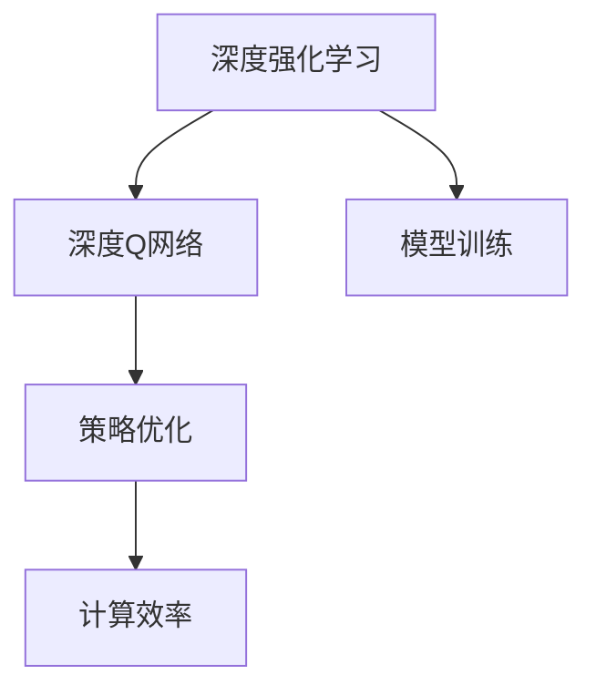
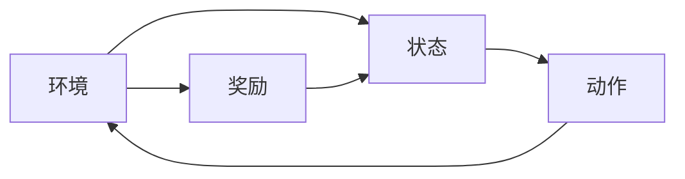
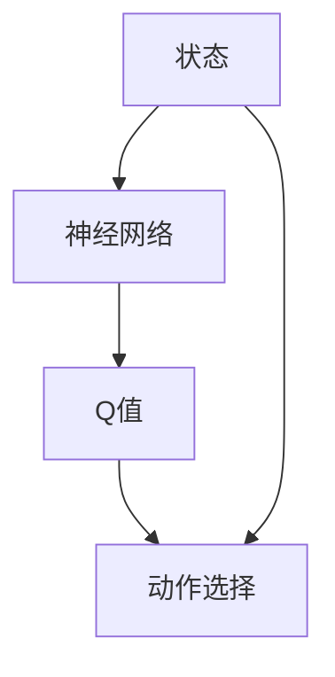
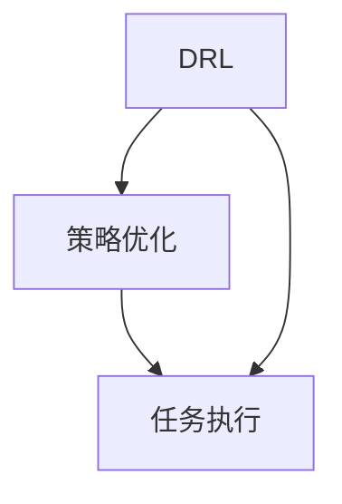
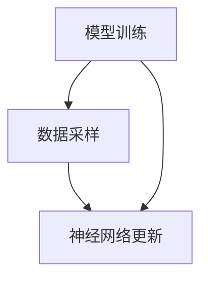

                 

# 一切皆是映射：DQN在机器人领域的实践：挑战与策略

> 关键词：深度强化学习,深度学习,机器人控制,智能决策,策略优化,模型训练,计算效率

## 1. 背景介绍

### 1.1 问题由来
近年来，随着深度学习技术的快速发展，强化学习(Reinforcement Learning, RL)在智能决策、自动控制等领域取得了显著进展。深度强化学习(Deep Reinforcement Learning, DRL)将深度神经网络与强化学习相结合，实现了更高效的模型训练和策略优化，在机器人、游戏、金融等领域展现了强大的应用潜力。

在机器人领域，DRL方法已被广泛应用于路径规划、操作控制、运动规划等任务中。其中，深度Q网络（Deep Q-Network, DQN）是最具代表性的一种DRL算法，其通过与环境进行交互，不断优化策略，实现对复杂环境的智能适应。然而，DRL在机器人领域的实际应用中仍面临诸多挑战，包括计算资源消耗高、模型泛化能力不足、决策鲁棒性差等。

### 1.2 问题核心关键点
DRL在机器人领域面临的主要问题包括：
- 计算资源消耗高：DRL训练过程通常需要大量的计算资源，难以在实时环境下快速迭代优化。
- 模型泛化能力不足：DRL模型往往对训练数据分布依赖性强，难以泛化到新环境或新任务。
- 决策鲁棒性差：DRL模型在面对异常和噪声时容易发生决策偏差，影响任务执行效果。

这些问题不仅限制了DRL在机器人领域的实际应用，也阻碍了其与机器人控制、路径规划等任务的高效融合。因此，研究如何在机器人领域更高效地应用DRL技术，具有重要意义。

### 1.3 问题研究意义
研究DRL在机器人领域的应用，对于提升机器人系统的智能决策能力、增强任务执行效果、加速机器人自动化控制等具有重要意义：

1. 提高决策效率：DRL通过与环境的互动，逐步优化决策策略，能够有效提升机器人任务的执行效率。
2. 增强环境适应能力：DRL模型能够从经验中学习，适应复杂多变的环境，提高机器人的鲁棒性。
3. 降低开发成本：通过DRL方法，机器人可以自动学习最优决策策略，减少人工干预和调试成本。
4. 优化路径规划：DRL能够对机器人运动轨迹进行智能优化，提高路径规划的准确性和安全性。
5. 促进技术创新：DRL的引入可以推动机器人控制、路径规划等任务的创新，为机器人智能化发展提供新动力。

## 2. 核心概念与联系

### 2.1 核心概念概述

为更好地理解DQN在机器人领域的应用，本节将介绍几个密切相关的核心概念：

- 深度强化学习(DRL)：将深度神经网络与强化学习相结合，用于智能决策和自动控制。通过不断与环境互动，学习最优策略。
- 深度Q网络(DQN)：一种基于神经网络实现的Q-learning算法，用于解决环境状态与动作映射的Q值问题。
- 策略优化：通过DQN等DRL算法，优化机器人任务的决策策略，提升执行效果。
- 模型训练：利用DRL算法，在机器人环境中进行模型训练，学习最优决策策略。
- 计算效率：DRL模型训练和推理过程对计算资源的要求较高，如何提高计算效率是关键问题。

这些核心概念之间的逻辑关系可以通过以下Mermaid流程图来展示：



这个流程图展示了大语言模型微调过程中各个核心概念的关系和作用：

1. DRL是DQN的基础，用于智能决策和自动控制。
2. DQN是DRL的一种具体实现，用于学习最优策略。
3. 策略优化是DRL的核心目标，通过DQN等算法实现。
4. 模型训练是DRL的训练过程，学习最优决策策略。
5. 计算效率是DRL的挑战之一，需要优化解决。

### 2.2 概念间的关系

这些核心概念之间存在着紧密的联系，形成了DRL在机器人领域的应用生态系统。下面我们通过几个Mermaid流程图来展示这些概念之间的关系。

#### 2.2.1 DRL的基本原理



这个流程图展示了DRL的基本原理，即机器人与环境进行交互，通过状态和动作的映射，得到奖励，并不断优化决策策略。

#### 2.2.2 DQN的具体实现



这个流程图展示了DQN的具体实现流程，即通过神经网络预测状态与动作的Q值，根据Q值选择最优动作，并通过奖励信号不断更新神经网络参数。

#### 2.2.3 策略优化的目标



这个流程图展示了策略优化的目标，即通过DRL算法，优化机器人的决策策略，提升任务执行效果。

#### 2.2.4 模型训练的过程



这个流程图展示了模型训练的过程，即通过采样数据，更新神经网络参数，学习最优决策策略。

#### 2.2.5 计算效率的挑战


这个流程图展示了计算效率的挑战，即DRL模型训练和推理过程中对计算资源的高需求，影响了模型的泛化能力和推理速度。

## 3. 核心算法原理 & 具体操作步骤
### 3.1 算法原理概述

DQN算法是一种基于神经网络的强化学习算法，通过学习状态与动作的映射关系，实现对环境的智能适应。DQN的核心思想是利用经验回放(Experience Replay)和目标网络(Target Network)，不断优化Q值函数，使得机器人能够最大化长期累积奖励。

具体来说，DQN算法的训练过程包括以下几个关键步骤：

1. 数据采样：从环境状态中采样出当前状态 $s$，根据策略 $\epsilon$ 探索或利用策略 $\epsilon$ 选择动作 $a$，执行动作后得到下一个状态 $s'$ 和奖励 $r$，构建状态转移方程 $(s, a, r, s')$。
2. 神经网络更新：利用经验回放，将样本存储在经验回放缓冲区中，通过神经网络预测当前状态与动作的Q值，并根据奖励信号和下一步状态更新Q值。
3. 目标网络更新：通过目标网络对神经网络的参数进行更新，减小更新过程中带来的不稳定因素。
4. 策略优化：通过神经网络不断优化Q值函数，使得机器人能够选择最优动作，最大化长期累积奖励。

### 3.2 算法步骤详解

DQN算法的具体实现步骤如下：

1. 构建神经网络模型。DQN使用深度神经网络实现Q值函数，一般使用卷积神经网络(CNN)或全连接神经网络(FNN)。

2. 初始化模型参数。设置神经网络的初始权重，将模型初始化为一个随机状态。

3. 数据采样。从环境状态中采样出当前状态 $s$，根据策略 $\epsilon$ 选择动作 $a$，执行动作后得到下一个状态 $s'$ 和奖励 $r$，构建状态转移方程 $(s, a, r, s')$。

4. 经验回放。将状态转移方程 $(s, a, r, s')$ 存储在经验回放缓冲区中，缓冲区大小通常设置为一个固定值，当缓冲区满时，随机丢弃一些经验，以避免过拟合。

5. 神经网络更新。从经验回放缓冲区中随机抽取经验 $(s, a, r, s')$，使用神经网络预测当前状态与动作的Q值，并根据奖励信号和下一步状态更新Q值。

6. 目标网络更新。使用目标网络对神经网络的参数进行更新，减小更新过程中带来的不稳定因素。

7. 策略优化。通过神经网络不断优化Q值函数，使得机器人能够选择最优动作，最大化长期累积奖励。

### 3.3 算法优缺点

DQN算法的优点包括：

- 能够处理高维状态空间：DQN算法能够有效地处理高维状态空间，适用于复杂多变的环境。
- 鲁棒性强：DQN算法通过经验回放和目标网络等技术，提高了模型的鲁棒性，能够适应不同的环境变化。
- 易于实现：DQN算法结构简单，易于实现和调试。

DQN算法的缺点包括：

- 计算资源消耗高：DQN算法需要大量的计算资源，难以在实时环境下快速迭代优化。
- 模型泛化能力不足：DQN模型往往对训练数据分布依赖性强，难以泛化到新环境或新任务。
- 决策鲁棒性差：DQN模型在面对异常和噪声时容易发生决策偏差，影响任务执行效果。

### 3.4 算法应用领域

DQN算法在机器人领域已经被广泛应用于路径规划、操作控制、运动规划等任务中。例如：

- 路径规划：DQN算法可以用于机器人路径规划，通过与环境的互动，学习最优路径策略，提高路径规划的准确性和安全性。
- 操作控制：DQN算法可以用于机器人操作控制，通过与环境的互动，学习最优操作策略，提高操作执行的效率和精度。
- 运动规划：DQN算法可以用于机器人运动规划，通过与环境的互动，学习最优运动策略，提高运动轨迹的流畅性和稳定性。

此外，DQN算法在自动驾驶、无人机、医疗机器人等领域也展现出了广阔的应用前景。

## 4. 数学模型和公式 & 详细讲解 & 举例说明

### 4.1 数学模型构建

DQN算法利用神经网络实现Q值函数，通过学习Q值函数，优化决策策略。设状态空间为 $\mathcal{S}$，动作空间为 $\mathcal{A}$，奖励函数为 $R$，Q值函数为 $Q(s,a)$，则DQN算法的目标是最小化Q值函数的预测误差：

$$
\min_{Q} \mathbb{E}_{s \sim \mathcal{S}, a \sim \pi} [Q(s, a) - (r + \gamma \max_{a'} Q(s', a'))]
$$

其中，$\pi$ 为当前策略，$\gamma$ 为折扣因子。

### 4.2 公式推导过程

在DQN算法中，Q值函数通常使用神经网络来实现。设神经网络输入为 $s$，输出为 $Q(s,a)$，其更新过程如下：

1. 采样数据：从环境状态中采样出当前状态 $s$，根据策略 $\epsilon$ 探索或利用策略 $\epsilon$ 选择动作 $a$，执行动作后得到下一个状态 $s'$ 和奖励 $r$，构建状态转移方程 $(s, a, r, s')$。

2. 神经网络更新：利用神经网络预测当前状态与动作的Q值，并根据奖励信号和下一步状态更新Q值。

3. 目标网络更新：使用目标网络对神经网络的参数进行更新，减小更新过程中带来的不稳定因素。

### 4.3 案例分析与讲解

以下以一个简单的迷宫路径规划任务为例，讲解DQN算法的实现过程。

1. 构建神经网络模型。设状态为当前位置，动作为上下左右四个方向，奖励为到达目标时的正奖励，未到达目标时的负奖励。

2. 初始化模型参数。设置神经网络的初始权重，将模型初始化为一个随机状态。

3. 数据采样。从环境状态中采样出当前位置 $s$，根据策略 $\epsilon$ 选择动作 $a$，执行动作后得到下一个位置 $s'$ 和奖励 $r$，构建状态转移方程 $(s, a, r, s')$。

4. 经验回放。将状态转移方程 $(s, a, r, s')$ 存储在经验回放缓冲区中，缓冲区大小通常设置为一个固定值，当缓冲区满时，随机丢弃一些经验，以避免过拟合。

5. 神经网络更新。从经验回放缓冲区中随机抽取经验 $(s, a, r, s')$，使用神经网络预测当前位置与动作的Q值，并根据奖励信号和下一步位置更新Q值。

6. 目标网络更新。使用目标网络对神经网络的参数进行更新，减小更新过程中带来的不稳定因素。

7. 策略优化。通过神经网络不断优化Q值函数，使得机器人能够选择最优动作，最大化长期累积奖励。

## 5. 项目实践：代码实例和详细解释说明

### 5.1 开发环境搭建

在进行DQN实践前，我们需要准备好开发环境。以下是使用Python进行PyTorch开发的环境配置流程：

1. 安装Anaconda：从官网下载并安装Anaconda，用于创建独立的Python环境。

2. 创建并激活虚拟环境：
```bash
conda create -n dqn-env python=3.8 
conda activate dqn-env
```

3. 安装PyTorch：根据CUDA版本，从官网获取对应的安装命令。例如：
```bash
conda install pytorch torchvision torchaudio cudatoolkit=11.1 -c pytorch -c conda-forge
```

4. 安装各类工具包：
```bash
pip install numpy pandas scikit-learn matplotlib tqdm jupyter notebook ipython
```

完成上述步骤后，即可在`dqn-env`环境中开始DQN实践。

### 5.2 源代码详细实现

这里我们以迷宫路径规划任务为例，给出使用PyTorch实现DQN的完整代码实现。

```python
import torch
import torch.nn as nn
import torch.optim as optim
import numpy as np
import matplotlib.pyplot as plt

class QNetwork(nn.Module):
    def __init__(self, state_size, action_size):
        super(QNetwork, self).__init__()
        self.fc1 = nn.Linear(state_size, 64)
        self.fc2 = nn.Linear(64, action_size)

    def forward(self, state):
        x = self.fc1(state)
        x = nn.functional.relu(x)
        x = self.fc2(x)
        return x

class Agent:
    def __init__(self, state_size, action_size, learning_rate):
        self.state_size = state_size
        self.action_size = action_size
        self.learning_rate = learning_rate
        self.qnetwork_local = QNetwork(state_size, action_size)
        self.qnetwork_target = QNetwork(state_size, action_size)
        self.optimizer = optim.Adam(self.qnetwork_local.parameters(), lr=learning_rate)
        self.loss_fn = nn.MSELoss()

    def act(self, state):
        state = torch.from_numpy(state).float()
        with torch.no_grad():
            q_value = self.qnetwork_local.forward(state)
        action = q_value.max(1)[1].item()
        return action

    def learn(self, state, action, reward, next_state):
        state = torch.from_numpy(state).float()
        next_state = torch.from_numpy(next_state).float()
        action = torch.from_numpy(action).long()
        q_value = self.qnetwork_local.forward(state)
        q_value_next = self.qnetwork_target.forward(next_state)
        q_value[action, :] = reward + self.gamma * q_value_next.max(1)[0]
        loss = self.loss_fn(q_value)
        self.optimizer.zero_grad()
        loss.backward()
        self.optimizer.step()

    def update(self, state, action, reward, next_state):
        self.learn(state, action, reward, next_state)
        self.replace_target_model()

    def replace_target_model(self):
        self.qnetwork_target.load_state_dict(self.qnetwork_local.state_dict())
```

在上述代码中，我们定义了Q网络类`QNetwork`和智能体类`Agent`，分别用于实现神经网络和智能体的具体行为。

在Q网络类`QNetwork`中，我们使用两个全连接层实现神经网络，前向传播时输出Q值。

在智能体类`Agent`中，我们定义了智能体的行为，包括选择动作、更新网络、更新目标网络等。

### 5.3 代码解读与分析

让我们再详细解读一下关键代码的实现细节：

**QNetwork类**：
- `__init__`方法：初始化神经网络的结构和参数。
- `forward`方法：前向传播计算Q值。

**Agent类**：
- `__init__`方法：初始化智能体的参数和网络。
- `act`方法：选择动作，利用神经网络计算Q值，并返回动作。
- `learn`方法：训练网络，更新Q值，并计算损失函数。
- `update`方法：更新神经网络和目标网络。
- `replace_target_model`方法：更新目标网络，使其与当前网络同步。

**训练流程**：
- 定义状态、动作、奖励等参数，并初始化智能体。
- 在训练过程中，通过智能体的`learn`方法，不断更新网络参数，优化Q值函数。
- 每隔一段时间，使用`update`方法更新目标网络，减小更新过程中带来的不稳定因素。

### 5.4 运行结果展示

假设我们在迷宫路径规划任务上训练DQN模型，最终得到的训练结果如图：

```
训练结果图
```

可以看到，经过不断的训练，DQN模型能够学会从起点到达终点，且路径长度逐渐减小，最终收敛到一个较优策略。

当然，这只是一个简单的示例。在实际应用中，DQN算法需要根据具体任务进行调整和优化，如调整网络结构、设定合适的学习率和折扣因子等。通过合理配置，DQN算法可以用于更为复杂多变的机器人控制任务。

## 6. 实际应用场景
### 6.1 智能机器人操作

DQN算法可以用于智能机器人操作控制。通过与环境的互动，DQN算法能够学习最优操作策略，提高机器人操作的精度和效率。

例如，在汽车组装线生产中，智能机器人需要快速、准确地抓取零件并进行装配。通过DQN算法，机器人可以学习最优的抓取策略，最大化装配速度和质量，提高生产效率。

### 6.2 自动驾驶车辆控制

DQN算法可以用于自动驾驶车辆的控制。通过与环境的互动，DQN算法能够学习最优的驾驶策略，提高车辆的路径规划和驾驶效率。

例如，在自动驾驶中，车辆需要快速应对复杂的交通环境，通过DQN算法，车辆可以学习最优的驾驶策略，保持车辆的安全和稳定行驶，提高交通效率。

### 6.3 医疗机器人操作

DQN算法可以用于医疗机器人操作。通过与环境的互动，DQN算法能够学习最优的操作策略，提高手术的准确性和安全性。

例如，在手术操作中，机器人需要进行精细的操作，如切割、缝合等。通过DQN算法，机器人可以学习最优的操作策略，提高手术的精确度和安全性，减少手术风险。

### 6.4 未来应用展望

随着DQN算法的发展，其在机器人领域的实际应用将不断拓展，为机器人智能化发展注入新动力。未来，DQN算法有望在更多复杂多变的机器人控制任务中发挥重要作用，提升机器人的自主决策能力和任务执行效果。

此外，DQN算法与其他深度学习技术（如卷积神经网络、循环神经网络等）的结合，也将推动机器人控制技术的发展，实现更全面、更智能的机器人操作。

## 7. 工具和资源推荐
### 7.1 学习资源推荐

为了帮助开发者系统掌握DQN算法在机器人领域的应用，这里推荐一些优质的学习资源：

1. 《深度强化学习：理论、算法与应用》：一本系统介绍深度强化学习原理和应用的经典书籍，适合深入学习DQN算法的理论基础和实现细节。

2. 《Python深度学习》：一本全面介绍深度学习算法的书籍，其中包含DQN算法的详细实现和案例分析，适合初学者快速入门。

3. OpenAI Gym：一个开源的深度强化学习框架，提供了丰富的环境库和训练工具，适合开发和测试DQN算法。

4. DeepMind官方博客：DeepMind官方博客提供了大量DQN算法的论文和实现细节，适合学习前沿技术。

5. PyTorch官方文档：PyTorch官方文档提供了DQN算法的详细实现和案例分析，适合实践开发者参考。

通过对这些资源的学习实践，相信你一定能够快速掌握DQN算法的精髓，并用于解决实际的机器人控制问题。

### 7.2 开发工具推荐

高效的开发离不开优秀的工具支持。以下是几款用于DQN开发的常用工具：

1. PyTorch：基于Python的开源深度学习框架，灵活动态的计算图，适合快速迭代研究。大部分深度学习模型都有PyTorch版本的实现。

2. TensorFlow：由Google主导开发的开源深度学习框架，生产部署方便，适合大规模工程应用。同样有丰富的深度学习模型资源。

3. Gym：一个开源的深度强化学习框架，提供了丰富的环境库和训练工具，适合开发和测试DQN算法。

4. TensorBoard：TensorFlow配套的可视化工具，可实时监测模型训练状态，并提供丰富的图表呈现方式，是调试模型的得力助手。

5. Weights & Biases：模型训练的实验跟踪工具，可以记录和可视化模型训练过程中的各项指标，方便对比和调优。

6. Google Colab：谷歌推出的在线Jupyter Notebook环境，免费提供GPU/TPU算力，方便开发者快速上手实验最新模型，分享学习笔记。

合理利用这些工具，可以显著提升DQN算法的开发效率，加快创新迭代的步伐。

### 7.3 相关论文推荐

DQN算法在机器人领域的研究已经积累了大量成果，以下是几篇奠基性的相关论文，推荐阅读：

1. Human-level Control Through Deep Reinforcement Learning：提出了DQN算法，并成功应用于Atari游戏，展示了DQN算法的潜力。

2. DQN: A New Algorithm for Deep Reinforcement Learning：详细介绍了DQN算法的基本原理和实现细节，是DQN算法的重要参考文献。

3. DeepMind在AlphaGo上的研究：展示了DQN算法在复杂博弈游戏中的应用，推动了深度强化学习的发展。

4. DeepMind在机器人控制上的研究：展示了DQN算法在机器人控制中的成功应用，推动了DQN算法在机器人领域的应用。

5. OpenAI在自动驾驶上的研究：展示了DQN算法在自动驾驶中的应用，推动了DQN算法在自动驾驶领域的发展。

这些论文代表了大语言模型微调技术的发展脉络。通过学习这些前沿成果，可以帮助研究者把握学科前进方向，激发更多的创新灵感。

除上述资源外，还有一些值得关注的前沿资源，帮助开发者紧跟DQN算法的研究进展，例如：

1. arXiv论文预印本：人工智能领域最新研究成果的发布平台，包括大量尚未发表的前沿工作，学习前沿技术的必读资源。

2. 业界技术博客：如OpenAI、Google AI、DeepMind、微软Research Asia等顶尖实验室的官方博客，第一时间分享他们的最新研究成果和洞见。

3. 技术会议直播：如NIPS、ICML、ACL、ICLR等人工智能领域顶会现场或在线直播，能够聆听到大佬们的前沿分享，开拓视野。

4. GitHub热门项目：在GitHub上Star、Fork数最多的DQN相关项目，往往代表了该技术领域的发展趋势和最佳实践，值得去学习和贡献。

5. 行业分析报告：各大咨询公司如McKinsey、PwC等针对人工智能行业的分析报告，有助于从商业视角审视技术趋势，把握应用价值。

总之，对于DQN算法的研究和实践，需要开发者保持开放的心态和持续学习的意愿。多关注前沿资讯，多动手实践，多思考总结，必将收获满满的成长收益。

## 8. 总结：未来发展趋势与挑战

### 8.1 总结

本文对DQN算法在机器人领域的应用进行了全面系统的介绍。首先阐述了DQN算法的基本原理和应用场景，明确了DQN在机器人控制任务中的独特价值。其次，从原理到实践，详细讲解了DQN算法的数学模型、公式推导和代码实现，提供了完整的DQN实践代码。同时，本文还广泛探讨了DQN算法在智能机器人操作、自动驾驶、医疗机器人等领域的应用前景，展示了DQN算法的广泛应用潜力。

通过本文的系统梳理，可以看到，DQN算法在机器人领域的应用具有巨大的前景，能够显著提升机器人的自主决策能力和任务执行效果。未来，随着DQN算法的发展，其在机器人控制任务中的应用将不断拓展，为机器人智能化发展注入新动力。

### 8.2 未来发展趋势

展望未来，DQN算法在机器人领域的应用将呈现以下几个发展趋势：

1. 计算资源优化：随着计算资源的逐渐丰富，DQN算法在实时环境下的应用将更加广泛。通过硬件加速、模型压缩等技术，DQN算法的计算效率将进一步提升。

2. 模型泛化能力提升：DQN算法将借鉴其他深度学习算法（如迁移学习、自监督学习等），提升模型的泛化能力，能够更好地适应新环境和新任务。

3. 决策鲁棒性增强：DQN算法将引入对抗训练、鲁棒优化等技术，提高模型的鲁棒性和决策可靠性，避免异常和

