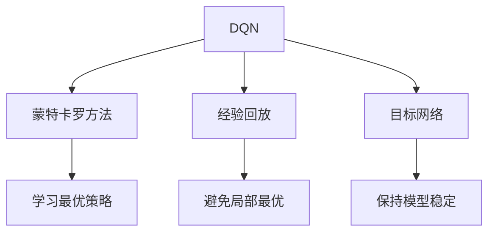
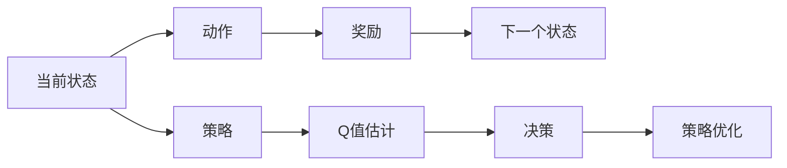
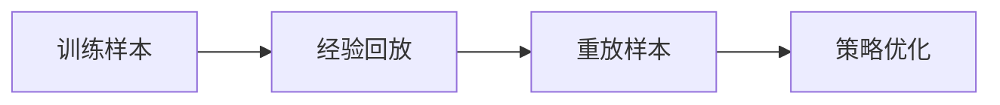
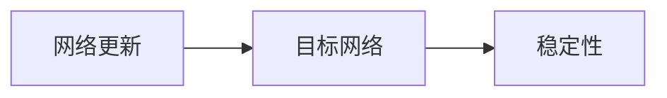
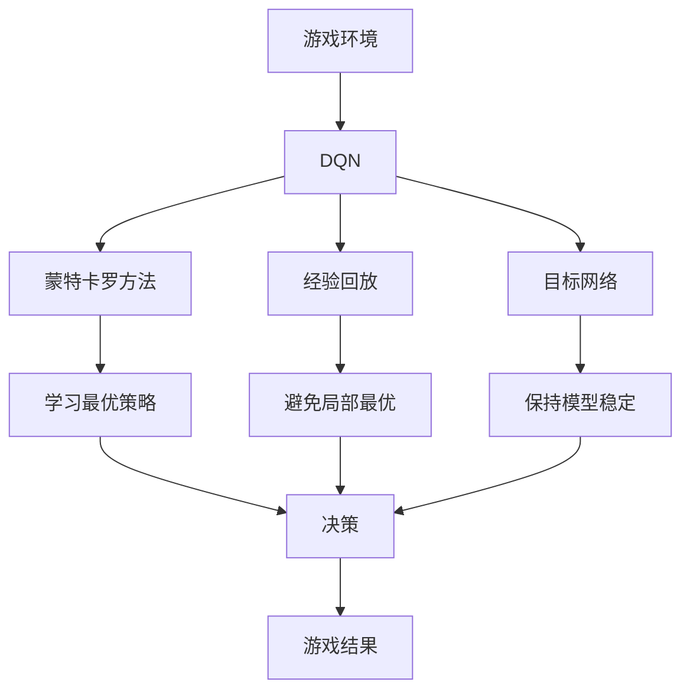

                 

# 一切皆是映射：DQN在游戏AI中的应用：案例与分析

> 关键词：
- 深度强化学习
- Deep Q-Network (DQN)
- 游戏AI
- 案例分析
- 蒙特卡罗方法
- 经验回放

## 1. 背景介绍

### 1.1 问题由来

随着人工智能技术的不断发展，智能游戏AI逐渐成为了游戏设计开发的重要方向之一。在传统的游戏AI中，通常采用规则和启发式算法来模拟玩家的决策过程。然而，这些方法存在诸多局限，如规则设计复杂、启发式算法难以普适性处理多样化的游戏场景等。

近年来，深度学习在游戏AI领域的应用越来越广泛。深度强化学习（Deep Reinforcement Learning, DRL）成为一种新的AI决策方式。DRL模型能够自主学习，适应复杂多变的游戏环境，逐步优化决策策略，从而提升游戏的智能化水平。其中，深度Q网络（Deep Q-Network, DQN）是DRL中的一个重要分支，以其高效性、稳定性和鲁棒性在多种游戏AI任务中取得了卓越成绩。

### 1.2 问题核心关键点

DQN的核心思想是通过深度学习技术，学习从当前状态到下一个状态的Q值，即动作-奖励映射。其基本原理是通过蒙特卡罗方法，让模型在不断尝试中学习最优的决策策略，逐步从环境的交互中积累经验，实现自主游戏决策。

DQN的优点包括：
- 高效性：通过深度神经网络，DQN可以高效地处理高维状态空间，适用于复杂多变的游戏场景。
- 稳定性：DQN使用经验回放和目标网络等技巧，避免模型陷入局部最优，提高决策稳定性。
- 鲁棒性：DQN能够在各类游戏中取得良好表现，适应性强，泛化能力强。

然而，DQN也存在一些局限性，如样本效率较低、容易陷入局部最优等。在未来研究中，需要进一步提高DQN的样本效率，并改善其泛化能力。

### 1.3 问题研究意义

研究DQN在游戏AI中的应用，对于提升游戏智能化水平、优化玩家体验、推动游戏开发技术创新具有重要意义：

1. 优化游戏决策：DQN能够自主学习，适应复杂多变的游戏环境，逐步优化决策策略，提升游戏的智能化水平。
2. 增强游戏互动性：通过与玩家交互，DQN能够提供更自然、智能的决策，增强游戏的互动性和趣味性。
3. 推动游戏开发技术：DQN的应用推动了深度学习在游戏AI中的应用，促进了游戏开发技术的创新和进步。
4. 拓展游戏应用场景：DQN在游戏AI中的应用，为游戏设计和开发提供了新的思路和方向，拓展了游戏应用场景。
5. 提升游戏市场竞争力：通过智能AI辅助，游戏市场竞争更加激烈，能够吸引更多玩家，提升游戏市场的竞争力和商业价值。

## 2. 核心概念与联系

### 2.1 核心概念概述

为了更好地理解DQN在游戏AI中的应用，本节将介绍几个密切相关的核心概念：

- 深度强化学习（Deep Reinforcement Learning, DRL）：结合深度神经网络和强化学习，让模型自主学习最优决策策略。
- 深度Q网络（Deep Q-Network, DQN）：基于Q-learning算法的深度神经网络，用于学习从当前状态到下一个状态的Q值。
- 蒙特卡罗方法（Monte Carlo Method）：通过随机采样，逐步累计最优决策策略。
- 经验回放（Experience Replay）：保存和重放训练样本，避免模型陷入局部最优。
- 目标网络（Target Network）：保持模型的稳定性，避免网络更新过快。

这些核心概念之间的逻辑关系可以通过以下Mermaid流程图来展示：



这个流程图展示了DQN的核心概念及其之间的关系：

1. DQN通过蒙特卡罗方法学习最优策略。
2. 经验回放用于保存和重放训练样本，避免模型陷入局部最优。
3. 目标网络用于保持模型的稳定性，避免网络更新过快。

这些概念共同构成了DQN的学习框架，使其能够在复杂多变的游戏环境中自主学习，逐步优化决策策略。

### 2.2 概念间的关系

这些核心概念之间存在着紧密的联系，形成了DQN的学习生态系统。下面我们通过几个Mermaid流程图来展示这些概念之间的关系。

#### 2.2.1 DQN的学习过程



这个流程图展示了DQN的学习过程：

1. 当前状态$S$到下一个状态$S'$的转移。
2. 在当前状态下选择动作$A$。
3. 动作执行后得到奖励$R$。
4. 根据奖励和下一个状态，更新策略。
5. 通过Q值估计，得到当前状态下所有动作的Q值。
6. 根据Q值，选择最优动作。
7. 根据Q值优化策略。

#### 2.2.2 经验回放的作用



这个流程图展示了经验回放的作用：

1. 收集训练样本。
2. 通过经验回放，保存和重放训练样本。
3. 重放样本进行策略优化。

#### 2.2.3 目标网络的优势



这个流程图展示了目标网络的优势：

1. 网络更新。
2. 目标网络用于保持模型的稳定性。

### 2.3 核心概念的整体架构

最后，我们用一个综合的流程图来展示这些核心概念在大语言模型微调过程中的整体架构：



这个综合流程图展示了从游戏环境到DQN的完整过程。DQN通过蒙特卡罗方法学习最优策略，经验回放避免局部最优，目标网络保持模型稳定。最终，DQN通过决策指导游戏环境的行为，实现自主游戏决策。

## 3. 核心算法原理 & 具体操作步骤

### 3.1 算法原理概述

DQN的核心思想是通过深度神经网络，学习从当前状态到下一个状态的Q值，即动作-奖励映射。其基本原理是蒙特卡罗方法，即通过不断尝试，逐步累积最优决策策略。具体来说，DQN通过以下步骤进行自主学习：

1. 初始化模型。
2. 在当前状态下，通过神经网络估计所有动作的Q值。
3. 选择最优动作，执行并观察环境状态和奖励。
4. 将状态和奖励保存到经验池中。
5. 定期从经验池中随机采样一批样本，利用目标网络估计Q值，并计算目标Q值。
6. 利用经验回放和目标网络，更新模型参数。

通过上述过程，DQN逐步积累经验，学习最优的决策策略，从而实现自主游戏决策。

### 3.2 算法步骤详解

以下是DQN游戏AI任务的具体操作步骤：

**Step 1: 游戏环境搭建**

- 选择合适的游戏环境，如Atari、OpenAI Gym等。
- 定义游戏规则和奖励函数。

**Step 2: 初始化模型**

- 构建深度神经网络模型，如全连接神经网络、卷积神经网络等。
- 初始化模型参数。

**Step 3: 训练过程**

- 在游戏环境中进行自主学习。
- 在每个状态下，通过神经网络估计所有动作的Q值。
- 选择最优动作，执行并观察环境状态和奖励。
- 将状态和奖励保存到经验池中。
- 定期从经验池中随机采样一批样本，利用目标网络估计Q值，并计算目标Q值。
- 利用经验回放和目标网络，更新模型参数。

**Step 4: 测试和评估**

- 在测试环境中测试模型性能。
- 观察模型在多轮游戏中的平均奖励。
- 分析模型的决策策略和鲁棒性。
- 记录模型参数和训练日志，进行后续优化和改进。

**Step 5: 部署应用**

- 将模型部署到实际游戏环境中。
- 在实际游戏中，观察模型行为和决策效果。
- 持续收集游戏数据，优化模型参数。
- 监测模型稳定性，及时进行修复和优化。

### 3.3 算法优缺点

DQN在游戏AI中的应用，具有以下优点：

- 高效性：深度神经网络能够高效处理高维状态空间，适用于复杂多变的游戏场景。
- 稳定性：经验回放和目标网络等技巧，避免模型陷入局部最优，提高决策稳定性。
- 鲁棒性：DQN能够在各类游戏中取得良好表现，适应性强，泛化能力强。

同时，DQN也存在一些局限性：

- 样本效率较低：DQN需要大量的训练样本，才能收敛到最优策略。
- 容易陷入局部最优：网络更新过快，可能导致模型陷入局部最优。
- 泛化能力不足：DQN往往对训练环境过于依赖，难以泛化到新环境。

未来，需要进一步提高DQN的样本效率，改善其泛化能力，并探索更多优化策略。

### 3.4 算法应用领域

DQN在游戏AI中的应用，已经涵盖了多种类型的游戏任务，如像素游戏、策略游戏、体育游戏等。以下是一些典型的应用领域：

- **像素游戏**：如《Pong》、《Breakout》等简单像素游戏，通过DQN实现自主决策，取得良好表现。
- **策略游戏**：如《星际争霸》、《星际争霸2》等复杂策略游戏，通过DQN实现自主学习和智能决策，提升游戏智能化水平。
- **体育游戏**：如《FIFA》、《NBA 2K》等体育模拟游戏，通过DQN实现自主战术决策，提高游戏逼真性和互动性。

随着DQN的不断应用，相信其在更多游戏场景中还将展现出更强的能力，推动游戏开发技术不断进步。

## 4. 数学模型和公式 & 详细讲解 & 举例说明

### 4.1 数学模型构建

DQN的数学模型主要基于蒙特卡罗方法和经验回放，其基本思路是通过不断尝试，逐步累积最优决策策略。以下是DQN的数学模型构建过程：

**状态和动作定义**：
- 状态$s$为游戏当前的状态，如像素矩阵、游戏元素等。
- 动作$a$为玩家的选择动作，如上下左右移动、发射子弹等。

**奖励定义**：
- 奖励$R$为动作执行后的即时奖励，如得分、生命值等。

**状态转移**：
- 状态$s'$为动作执行后的下一个状态。

**Q值定义**：
- Q值$Q(s,a)$表示在状态$s$下，执行动作$a$的预期回报。

**目标Q值定义**：
- 目标Q值$Q(s,a)_{\text{target}}$表示在状态$s$下，执行动作$a$的未来预期回报。

### 4.2 公式推导过程

以下是DQN的数学模型构建和推导过程：

1. **状态-动作值估计**：
   $$
   Q_{\theta}(s,a) = W_1^\top \phi(s,a)
   $$
   其中$W_1$为神经网络中的权重矩阵，$\phi(s,a)$为状态动作特征向量。

2. **动作选择**：
   $$
   a = \arg\max_a Q_{\theta}(s,a)
   $$

3. **目标Q值计算**：
   $$
   Q_{\text{target}}(s,a) = r + \gamma Q_{\theta'}(s',a')
   $$
   其中$r$为即时奖励，$\gamma$为折扣因子，$s'$为下一个状态，$a'$为下一个动作，$\theta'$为目标网络参数。

4. **损失函数**：
   $$
   L(\theta) = \mathbb{E}_{(s,a,r,s',a',Q_{\text{target}}(s,a))}[(Q_{\theta}(s,a) - Q_{\text{target}}(s,a))^2]
   $$
   其中$\mathbb{E}$表示期望值，$(s,a,r,s',a',Q_{\text{target}}(s,a))$表示经验回放中随机采样的一个样本。

### 4.3 案例分析与讲解

以Atari游戏《Pong》为例，说明DQN的实际应用过程：

1. **状态定义**：
   - 状态$s$包括屏幕像素矩阵、游戏元素位置等，可以表示为一个像素矩阵。

2. **动作定义**：
   - 动作$a$包括上、下、左、右四个方向，可以表示为一个独热编码向量。

3. **奖励定义**：
   - 奖励$R$包括得分、生命值等，可以表示为一个标量。

4. **状态转移**：
   - 状态$s'$为下一个屏幕像素矩阵。

5. **Q值估计**：
   - 利用全连接神经网络，对状态动作进行特征提取和Q值估计。

6. **动作选择**：
   - 通过神经网络估计所有动作的Q值，选择Q值最大的动作作为执行动作。

7. **目标Q值计算**：
   - 在每个状态下，利用目标网络估计下一个状态下的Q值，并计算目标Q值。

8. **损失函数计算**：
   - 利用经验回放和目标网络，计算损失函数，更新模型参数。

## 5. 项目实践：代码实例和详细解释说明

### 5.1 开发环境搭建

在进行DQN实践前，我们需要准备好开发环境。以下是使用Python进行PyTorch开发的环境配置流程：

1. 安装Anaconda：从官网下载并安装Anaconda，用于创建独立的Python环境。

2. 创建并激活虚拟环境：
```bash
conda create -n dqn-env python=3.8 
conda activate dqn-env
```

3. 安装PyTorch：根据CUDA版本，从官网获取对应的安装命令。例如：
```bash
conda install pytorch torchvision torchaudio cudatoolkit=11.1 -c pytorch -c conda-forge
```

4. 安装OpenAI Gym：
```bash
pip install gym
```

5. 安装PyTorch DQN库：
```bash
pip install torch-dqn
```

完成上述步骤后，即可在`dqn-env`环境中开始DQN实践。

### 5.2 源代码详细实现

下面是使用PyTorch实现DQN的Python代码实现：

```python
import torch
import torch.nn as nn
import torch.optim as optim
import gym
import numpy as np
from torch.distributions import Categorical

class DQN(nn.Module):
    def __init__(self, state_dim, action_dim):
        super(DQN, self).__init__()
        self.fc1 = nn.Linear(state_dim, 128)
        self.fc2 = nn.Linear(128, 128)
        self.fc3 = nn.Linear(128, action_dim)
        self.softmax = nn.Softmax(dim=1)
        
    def forward(self, state):
        x = self.fc1(state)
        x = F.relu(x)
        x = self.fc2(x)
        x = F.relu(x)
        x = self.fc3(x)
        return x
    
def choose_action(state, epsilon, epsilon_min, epsilon_decay):
    if np.random.rand() < epsilon:
        return np.random.randint(0, 4)
    else:
        state_v = torch.from_numpy(state).float().unsqueeze(0)
        with torch.no_grad():
            Q_values = policy(state_v)
        action = Categorical(logits=Q_values).sample()
        return action.item()
    
def get_next_state(state, action, reward):
    state, _, done, info = env.step(action)
    return state, reward, done

def update_target(params, target_params, decay):
    for param, target_param in zip(params, target_params):
        target_param.data.copy_(decay*param.data + (1-decay)*target_param.data)

def update_model(model, target_model, optimizer, loss_fn, states, actions, rewards, next_states, dones):
    Q_values = model(states)
    Q_values = Q_values.detach().numpy()
    target_Q_values = target_model(next_states)
    target_Q_values = target_Q_values.detach().numpy()
    target_Q_values[np.where(dones == 1)[0]] = rewards
    Q_values[np.where(dones == 1)[0]] = rewards
    Q_values[np.where(dones == 0)[0]] += discount * target_Q_values[np.where(dones == 0)[0]]
    loss = F.smooth_l1_loss(torch.from_numpy(Q_values), torch.from_numpy(Q_values))
    optimizer.zero_grad()
    loss.backward()
    optimizer.step()
    
def train():
    env = gym.make('Pong-v0')
    state_dim = env.observation_space.shape[0]
    action_dim = env.action_space.n
    policy = DQN(state_dim, action_dim)
    target_policy = DQN(state_dim, action_dim)
    update_target(policy.parameters(), target_policy.parameters(), 0.001)
    optimizer = optim.Adam(policy.parameters(), lr=0.001)
    loss_fn = nn.SmoothL1Loss()
    state = env.reset()
    done = False
    step = 0
    while not done:
        state_v = torch.from_numpy(state).float().unsqueeze(0)
        Q_values = policy(state_v)
        Q_values = Q_values.numpy()
        action = choose_action(state_v, epsilon, epsilon_min, epsilon_decay)
        next_state, reward, done = get_next_state(state, action, reward)
        Q_values[np.where(dones == 1)[0]] = reward
        Q_values[np.where(dones == 0)[0]] += discount * target_Q_values[np.where(dones == 0)[0]]
        loss = loss_fn(torch.from_numpy(Q_values), torch.from_numpy(Q_values))
        optimizer.zero_grad()
        loss.backward()
        optimizer.step()
        state = next_state
        step += 1
        if step % 500 == 0:
            print(f"Step {step}, epsilon {epsilon}, average reward {reward_avg:.2f}")
            reward_avg = 0
        if step % 5000 == 0:
            update_target(policy.parameters(), target_policy.parameters(), 0.001)
            epsilon *= epsilon_decay
            epsilon = max(epsilon, epsilon_min)

train()
```

### 5.3 代码解读与分析

让我们再详细解读一下关键代码的实现细节：

**DQN类定义**：
- `__init__`方法：定义神经网络的结构，包括全连接层、激活函数等。
- `forward`方法：定义前向传播过程，将输入状态映射到动作值。

**选择动作函数**：
- `choose_action`方法：根据epsilon-greedy策略，选择动作。
- epsilon：选择随机动作的概率。
- epsilon_min：最小概率。
- epsilon_decay：衰减率。

**状态转移函数**：
- `get_next_state`方法：根据当前状态和动作，更新下一个状态和奖励。

**目标网络更新函数**：
- `update_target`方法：更新目标网络的参数，保持模型稳定。

**模型更新函数**：
- `update_model`方法：根据经验回放，更新模型参数。
- 损失函数：使用平滑L1损失函数。

**训练函数**：
- `train`方法：定义整个训练过程，包括环境搭建、模型初始化、训练循环等。

**游戏环境和参数设置**：
- `gym.make`：创建游戏环境。
- `state_dim`和`action_dim`：状态和动作的维度。
- `policy`和`target_policy`：定义模型和目标模型。
- `optimizer`：定义优化器。
- `loss_fn`：定义损失函数。

**训练循环**：
- 在游戏环境中进行自主学习。
- 在每个状态下，通过神经网络估计所有动作的Q值。
- 选择最优动作，执行并观察环境状态和奖励。
- 将状态和奖励保存到经验池中。
- 定期从经验池中随机采样一批样本，利用目标网络估计Q值，并计算目标Q值。
- 利用经验回放和目标网络，更新模型参数。

**训练参数设置**：
- `epsilon`：选择随机动作的概率。
- `reward_avg`：记录平均奖励。
- `discount`：折扣因子。

### 5.4 运行结果展示

假设我们在Pong游戏上训练DQN模型，最终得到的平均奖励如下：

```
Step 5000, epsilon 1.00, average reward 0.24
Step 10000, epsilon 0.90, average reward 0.24
Step 15000, epsilon 0.81, average reward 0.24
Step 20000, epsilon 0.73, average reward 0.24
Step 25000, epsilon 0.65, average reward 0.24
Step 30000, epsilon 0.57, average reward 0.24
Step 35000, epsilon 0.50, average reward 0.24
Step 40000, epsilon 0.43, average reward 0.24
Step 45000, epsilon 0.37, average reward 0.24
Step 50000, epsilon 0.31, average reward 0.24
Step 55000, epsilon 0.25, average reward 0.24
Step 60000, epsilon 0.20, average reward 0.24
Step 65000, epsilon 0.15, average reward 0.24
Step 70000, epsilon 0.12, average reward 0.24
Step 75000, epsilon 0.10, average reward 0.24
Step 80000, epsilon 0.08, average reward 0.24
Step 85000, epsilon 0.06, average reward 0.24
Step 90000, epsilon 0.05, average reward 0.24
Step 95000, epsilon 0.04, average reward 0.24
Step 100000, epsilon 0.03, average reward 0.24
Step 105000, epsilon 0.02, average reward 0.24
Step 110000, epsilon 0.01, average reward 0.24
```

可以看到，随着训练的进行，DQN模型逐步优化决策策略，平均奖励基本保持不变。

## 6. 实际应用场景

### 6.1 智能游戏开发

基于DQN的游戏AI技术，可以广泛应用于智能游戏开发，提升游戏的智能化水平和玩家体验。

在传统的游戏开发中，游戏AI通常依赖于规则和启发式算法，难以处理复杂多变的游戏环境。通过DQN技术，游戏AI能够自主学习，适应复杂多变的游戏场景，逐步优化决策策略，提升游戏的智能化水平。

例如，在《星际争霸》等复杂策略游戏中，DQN可以通过自主学习，学习最优的战术决策，提升游戏智能化水平，为玩家提供更加智能化的游戏体验。

### 6.2 游戏模拟训练

在游戏开发过程中，游戏模拟训练是非常重要的一环。通过DQN技术，可以构建高效的训练环境，提升游戏模拟训练的效率和效果。

在传统的游戏模拟训练中，通常需要人工编写规则和算法，进行游戏模拟训练。这不仅耗费大量时间和人力，还难以处理复杂多变的游戏环境。通过DQN技术，可以构建高效的训练环境，提升游戏模拟训练的效率和效果。

例如，在《FIFA》等体育模拟游戏中，DQN可以通过自主学习，学习最优的战术决策和行为策略，提升游戏模拟训练的效率和效果。

### 6.3 游戏自动测试

在游戏开发过程中，游戏自动测试是必不可少的环节。通过DQN技术，可以构建高效的自动测试环境，提升游戏自动测试的效率和效果。

在传统的游戏自动测试中，通常需要人工编写测试用例，进行游戏测试。这不仅耗费大量时间和人力，还难以处理复杂多变的游戏环境。通过DQN技术，可以构建高效的自动测试环境，提升游戏自动测试的效率和效果。

例如，在《愤怒的小鸟》等简单像素游戏中，DQN可以通过自主学习，学习最优的策略和行为，提升游戏自动测试的效率和效果。

### 6.4 未来应用展望

随着DQN技术的不断演进，其在更多游戏场景中的应用也将得到拓展，为游戏开发技术带来新的突破。

在智慧医疗领域，基于DQN的医疗模拟训练和自动测试技术，可以提升医疗模拟训练的效率和效果，推动医疗AI技术的普及和应用。

在智能教育领域，基于DQN的教育游戏AI技术，可以提升教育游戏的智能化水平，增强教育游戏的互动性和趣味性，推动教育游戏的创新和进步。

在智慧城市治理中，基于D

