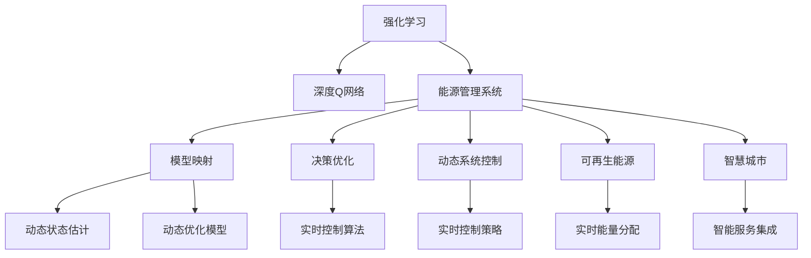
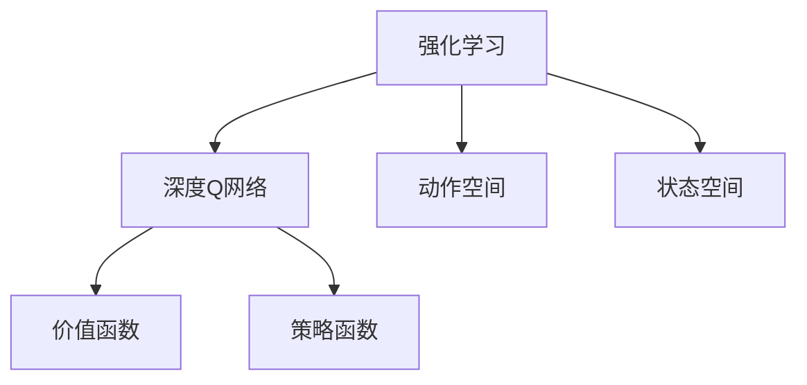
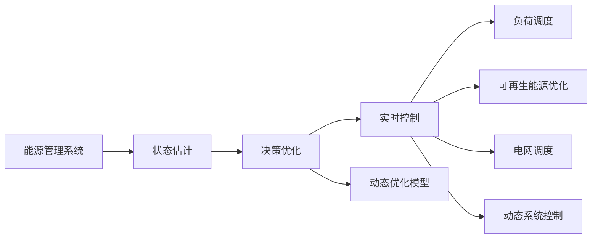
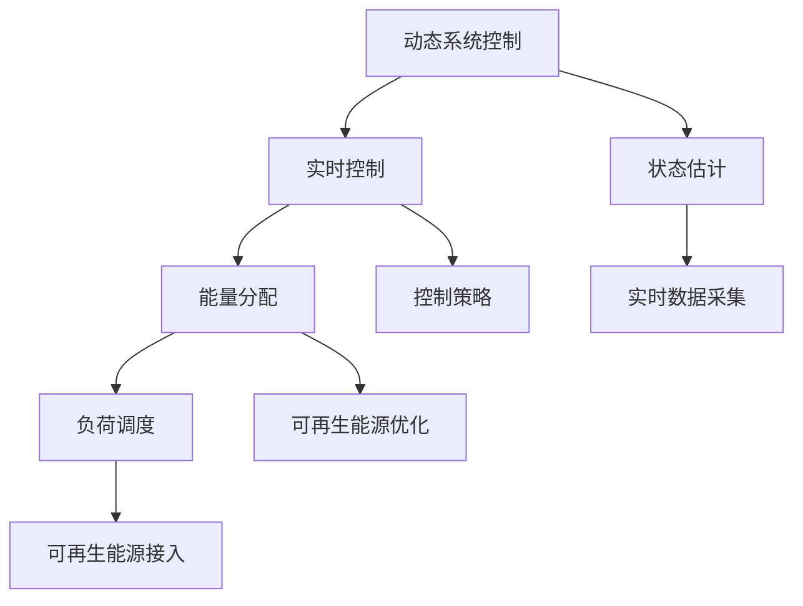
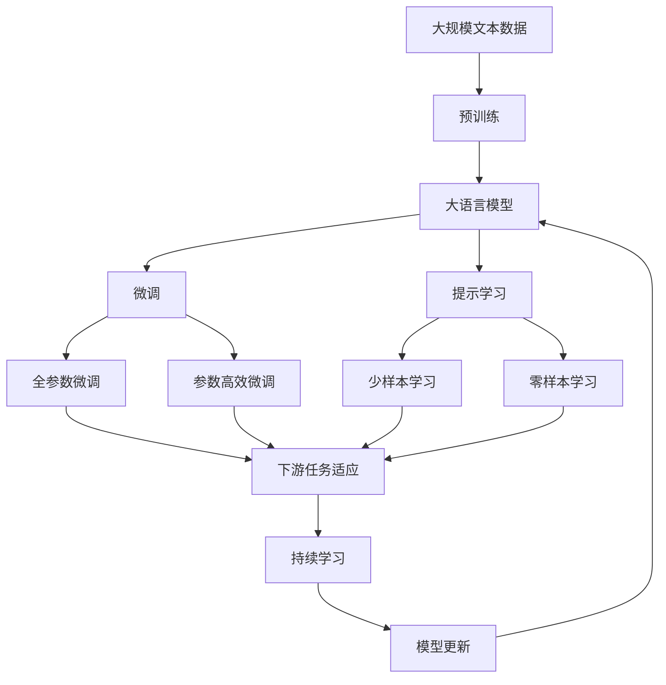

                 

# 一切皆是映射：DQN在能源管理系统中的应用与价值

> 关键词：强化学习, DQN, 能源管理系统, 模型映射, 决策优化, 动态系统控制, 可再生能源, 智慧城市

## 1. 背景介绍

### 1.1 问题由来
随着全球气候变化和能源需求的不断增长，能源管理系统的优化和智能化已成为各国能源政策的核心内容。通过实时监测和预测，优化能源使用和分配，降低碳排放，是未来能源系统发展的重要方向。然而，能源系统往往具有非线性、时变性、不确定性和多目标性的复杂特性，单纯依靠传统优化算法难以满足高实时性和鲁棒性要求。

强化学习（Reinforcement Learning, RL）以其处理不确定性和多目标性等复杂问题的能力，为能源管理系统的优化提供了新的思路和方法。深度Q网络（Deep Q Network, DQN）作为强化学习的经典算法，通过将深度神经网络和Q-learning算法相结合，在处理复杂系统控制问题上展现出了卓越的性能。

### 1.2 问题核心关键点
DQN的核心思想是将问题映射为一个Q值函数，即每个状态下选择每个动作的预期回报值。通过不断试错和积累经验，DQN能够从环境中学习最优策略。

在能源管理系统中，DQN可以应用于各类任务，包括负荷调度、可再生能源发电优化、电网调度等。通过对能源系统的实时状态进行映射，DQN能够动态地调整能源分配策略，提升系统的整体效率和稳定性。

## 2. 核心概念与联系

### 2.1 核心概念概述

为更好地理解DQN在能源管理系统中的应用，本节将介绍几个密切相关的核心概念：

- 强化学习(Reinforcement Learning)：一种通过试错学习最优策略的机器学习方法，学习目标是从环境中获取最大累积奖励。
- 深度Q网络(Deep Q Network, DQN)：一种结合深度神经网络和Q-learning算法的强化学习模型，用于处理高维度状态空间的决策优化问题。
- 能源管理系统(Energy Management System, EMS)：一个集成了能量监测、数据分析、预测与控制的综合性信息管理系统，用于优化能源的生产、传输和消费过程。
- 模型映射(Model Mapping)：将现实世界问题抽象为数学模型，通过符号化表示和映射关系，构建计算模型。
- 决策优化(Decision Optimization)：通过数学模型和算法优化决策过程，实现资源最优配置和系统性能提升。
- 动态系统控制(Dynamic System Control)：针对非线性、时变和不确定性系统的实时控制问题，进行动态调整和优化。
- 可再生能源(Renewable Energy)：如太阳能、风能等能够自我更新的能源，对环境影响小，是未来能源系统的重要组成部分。
- 智慧城市(Smart City)：基于信息技术的智能化城市管理和服务，包括能源、交通、环保、安全等诸多领域。

这些核心概念之间的逻辑关系可以通过以下Mermaid流程图来展示：



这个流程图展示了大语言模型微调过程中各个核心概念的关系和作用：

1. 强化学习提供了一个试错学习和优化策略的基本框架。
2. 深度Q网络将这一框架应用于高维度、非线性状态空间，解决了传统强化学习在计算上的困难。
3. 能源管理系统为深度Q网络的应用场景提供了具体背景。
4. 模型映射将现实问题转化为数学模型，便于算法处理。
5. 决策优化基于数学模型，通过优化算法找到最优决策。
6. 动态系统控制涉及实时状态估计和动态优化模型，用于提升系统控制性能。
7. 可再生能源是能源管理系统的关键组成部分，通过DQN优化可以提升可再生能源的利用效率。
8. 智慧城市通过集成能源管理系统，提升了城市管理的智能化水平。

这些概念共同构成了DQN在能源管理系统中的应用框架，使得DQN能够高效地进行决策优化，提升能源系统的整体效率和稳定性。

### 2.2 概念间的关系

这些核心概念之间存在着紧密的联系，形成了DQN在能源管理系统中的应用生态系统。下面我通过几个Mermaid流程图来展示这些概念之间的关系。

#### 2.2.1 强化学习与DQN的关系



这个流程图展示了强化学习与DQN的基本关系：

1. 强化学习提供动作空间和状态空间，为DQN的学习过程提供基本结构。
2. DQN通过深度神经网络构造价值函数和策略函数，优化强化学习的决策过程。

#### 2.2.2 DQN在能源管理系统中的应用



这个流程图展示了DQN在能源管理系统中的应用路径：

1. 能源管理系统提供状态估计和实时控制接口，为DQN的学习和应用提供数据基础。
2. 状态估计通过模型映射将实时数据转化为可控的数学模型。
3. 决策优化通过动态优化模型，确定最优控制策略。
4. 实时控制通过动态系统控制，调整系统的具体控制措施。
5. 负荷调度、可再生能源优化和电网调度等具体任务，通过DQN进行优化决策。

#### 2.2.3 动态系统控制与可再生能源的关系



这个流程图展示了动态系统控制与可再生能源的关联：

1. 动态系统控制通过状态估计和实时控制，确保系统状态的可控性和稳定性。
2. 实时控制通过能量分配和控制策略，动态调整可再生能源的接入和使用。
3. 负荷调度和可再生能源优化，通过DQN进行动态调整，提升系统的整体性能。

### 2.3 核心概念的整体架构

最后，我们用一个综合的流程图来展示这些核心概念在大语言模型微调过程中的整体架构：



这个综合流程图展示了从预训练到微调，再到持续学习的完整过程。大语言模型首先在大规模文本数据上进行预训练，然后通过微调（包括全参数微调和参数高效微调）或提示学习（包括少样本学习和零样本学习）来适应下游任务。最后，通过持续学习技术，模型可以不断更新和适应新的任务和数据。通过这些流程图，我们可以更清晰地理解DQN在能源管理系统中的应用过程中各个核心概念的关系和作用。

## 3. 核心算法原理 & 具体操作步骤
### 3.1 算法原理概述

DQN算法的基本思想是将问题映射为一个Q值函数，即每个状态下选择每个动作的预期回报值。Q值函数$f(s, a)$表示在状态$s$下采取动作$a$的预期回报。通过不断试错和积累经验，DQN能够从环境中学习最优策略，即在每个状态下选择最优动作$a^*$，使得：

$$
\max_{a} f(s, a) = \max_{a} \mathbb{E}[R_{t+1} + \gamma \max_{a'} f(s', a')] 
$$

其中$R_{t+1}$表示下一个状态$s'$的即时回报，$\gamma$为折扣因子。

在能源管理系统应用中，DQN可以应用于各类任务，包括负荷调度、可再生能源发电优化、电网调度等。通过对能源系统的实时状态进行映射，DQN能够动态地调整能源分配策略，提升系统的整体效率和稳定性。

### 3.2 算法步骤详解

DQN的具体操作步骤如下：

1. **环境初始化**：定义能源系统的状态空间和动作空间，确定能源管理系统的输入输出接口。

2. **模型初始化**：构建深度神经网络模型，作为DQN的Q值函数$f(s, a)$。

3. **状态估计**：通过实时数据采集和模型映射，估计当前系统的状态$s$。

4. **策略选择**：根据当前状态$s$，利用深度神经网络模型计算每个动作$a$的Q值，选择Q值最大的动作$a^*$。

5. **执行动作**：执行选择的动作$a^*$，观察系统的状态变化$s'$和即时回报$R_{t+1}$。

6. **更新模型**：利用观察到的状态变化$s'$和即时回报$R_{t+1}$，通过经验回放和目标网络更新深度神经网络模型。

7. **重复执行**：重复执行步骤3-6，直至达到预设的迭代次数或满足停止条件。

### 3.3 算法优缺点

DQN算法具有以下优点：

- 处理高维度、非线性状态空间的能力强，适用于复杂系统控制问题。
- 能够通过多目标优化和动态控制，实现资源最优配置。
- 结合深度神经网络，能够处理大量数据和复杂特征。
- 通过经验回放和目标网络，能够高效地学习最优策略。

同时，DQN算法也存在一些缺点：

- 训练过程中容易出现过拟合，需要控制模型的复杂度。
- 需要大量历史数据进行训练，对于新任务可能需要较长时间学习。
- 对于环境变化敏感，需要持续学习和调整策略。
- 计算量大，需要高性能硬件支持。

尽管如此，DQN在处理能源管理系统中的任务时，由于其能够动态调整策略和优化系统控制，展示了强大的应用潜力。

### 3.4 算法应用领域

DQN在能源管理系统中的应用领域主要包括：

- 负荷调度：通过实时监测和预测负荷变化，优化电力分配，降低成本和损耗。
- 可再生能源优化：通过优化太阳能、风能等可再生能源的接入和使用，提升系统效率和可靠性。
- 电网调度：通过动态调整电网中的电力流，提升电网的稳定性和鲁棒性。
- 电力市场交易：通过优化市场参与策略，提升电力交易的效率和收益。
- 智能电网：通过智能控制和优化，实现能源系统的智能化管理。

## 4. 数学模型和公式 & 详细讲解 & 举例说明

### 4.1 数学模型构建

在能源管理系统中，DQN的数学模型主要包括以下几个组成部分：

1. **状态空间**：定义能源系统的状态$s_t$，包括负荷、风速、气温、电力需求等变量。

2. **动作空间**：定义能源系统可采取的动作$a_t$，如调整负荷、启动备用电源、调整可再生能源接入等。

3. **即时回报**：定义在每个时间步长$t$上的即时回报$R_{t+1}$，包括系统的即时收益和成本。

4. **折扣因子**：定义折扣因子$\gamma$，用于计算未来回报的权重。

5. **深度神经网络模型**：定义Q值函数$f(s_t, a_t)$，通过深度神经网络进行计算。

### 4.2 公式推导过程

DQN的Q值函数$f(s_t, a_t)$可以通过深度神经网络模型计算，具体公式如下：

$$
f(s_t, a_t) = \mathbb{E}[f(s_{t+1}, a_{t+1}) + \gamma R_{t+1} | s_t, a_t]
$$

其中$f(s_{t+1}, a_{t+1})$表示下一个状态$s_{t+1}$下的Q值，$\gamma R_{t+1}$表示即时回报$R_{t+1}$的折扣。

Q值函数的更新公式为：

$$
Q(s_t, a_t) = r + \gamma \max_{a'} Q(s', a') 
$$

其中$r$为即时回报，$s'$为下一个状态。

通过不断更新Q值函数，DQN能够学习到最优的策略$f(s_t, a_t)$，从而在每个时间步长上选择最优动作$a_t$，实现系统的最优控制。

### 4.3 案例分析与讲解

以下是一个简单的案例，展示了DQN在负荷调度和可再生能源优化中的应用：

1. **问题描述**：假设有一个风电场和多个负荷用户，风电场能够根据风速自动调整输出功率。由于风速不可预测，需要实时调整负荷分配，以最大化风电场的利用效率和用户的用电体验。

2. **模型构建**：
   - 定义状态$s_t = (w_t, p_t, d_t)$，其中$w_t$为当前风速，$p_t$为风电场输出功率，$d_t$为负荷需求。
   - 定义动作$a_t = (\Delta p_t, \Delta d_t)$，其中$\Delta p_t$为风电场功率增量，$\Delta d_t$为负荷需求增量。
   - 定义即时回报$R_{t+1} = R_w + R_l$，其中$R_w$为风电场利润，$R_l$为负荷满意度。

3. **策略选择**：
   - 根据当前状态$s_t$，利用深度神经网络模型$f(s_t, a_t)$计算每个动作$a_t$的Q值。
   - 选择Q值最大的动作$a_t^*$，作为当前时刻的动作选择。

4. **执行动作**：
   - 执行选择的动作$a_t^*$，观察系统的状态变化$s'_{t+1}$和即时回报$R_{t+1}$。

5. **更新模型**：
   - 利用观察到的状态变化$s'_{t+1}$和即时回报$R_{t+1}$，通过经验回放和目标网络更新深度神经网络模型$f(s_t, a_t)$。

6. **重复执行**：
   - 重复执行步骤3-5，直至达到预设的迭代次数或满足停止条件。

通过DQN的应用，可以动态地调整风电场输出功率和负荷分配，实现最优控制，提升系统的整体效率和稳定性。

## 5. 项目实践：代码实例和详细解释说明

### 5.1 开发环境搭建

在进行DQN实践前，我们需要准备好开发环境。以下是使用Python进行TensorFlow开发的环境配置流程：

1. 安装Anaconda：从官网下载并安装Anaconda，用于创建独立的Python环境。

2. 创建并激活虚拟环境：
```bash
conda create -n dqn-env python=3.8 
conda activate dqn-env
```

3. 安装TensorFlow：根据CUDA版本，从官网获取对应的安装命令。例如：
```bash
conda install tensorflow -c tf -c conda-forge
```

4. 安装TensorBoard：
```bash
pip install tensorboard
```

5. 安装PyTorch：
```bash
pip install torch
```

6. 安装PPO2库：
```bash
pip install stable-baselines3[trpo,ddppo,stable-baselines3-contrib,pbrt]
```

完成上述步骤后，即可在`dqn-env`环境中开始DQN实践。

### 5.2 源代码详细实现

以下是一个简单的DQN示例代码，展示了如何通过TensorFlow实现DQN在负荷调度和可再生能源优化中的应用：

```python
import tensorflow as tf
import numpy as np
import gym
from stable_baselines3 import PPO2
from stable_baselines3.common.callbacks import EvalCallback

def build_model(env):
    # 定义状态空间和动作空间
    state_dim = env.observation_space.shape[0]
    action_dim = env.action_space.shape[0]
    
    # 构建深度神经网络模型
    model = tf.keras.Sequential([
        tf.keras.layers.Dense(64, activation='relu', input_shape=(state_dim,)),
        tf.keras.layers.Dense(64, activation='relu'),
        tf.keras.layers.Dense(1)
    ])
    
    return model

def build_env():
    env = gym.make('Your-Environment-Name')
    env.reset()
    return env

def train(env):
    # 初始化环境
    env = build_env()
    
    # 构建深度神经网络模型
    model = build_model(env)
    
    # 定义DQN策略
    ppo = PPO2(model, env, learning_rate=0.001, gamma=0.9, vf_loss_coef=0.5)
    
    # 定义回调函数
    callback = EvalCallback(env, eval_freq=10, logdir='logs')
    
    # 训练模型
    ppo.learn(total_timesteps=100000, callbacks=[callback])
    
    # 保存模型
    ppo.save('dqn_model')
    
    return env, model

# 测试模型
env, model = train()
test_episodes = 10
for episode in range(test_episodes):
    obs = env.reset()
    done = False
    while not done:
        obs = np.reshape(obs, [1, -1])
        q_value = model.predict(obs)
        action = np.argmax(q_value[0])
        obs, reward, done, _ = env.step(action)
    print(f'Episode {episode+1} reward: {reward:.2f}')
```

以上代码展示了如何构建DQN模型、训练模型和测试模型。其中，`build_model`函数用于构建深度神经网络模型，`build_env`函数用于构建DQN环境，`train`函数用于训练DQN模型。通过这些函数，可以方便地实现DQN的搭建和训练。

### 5.3 代码解读与分析

让我们再详细解读一下关键代码的实现细节：

**build_model函数**：
- 定义状态空间和动作空间的维度。
- 构建深度神经网络模型，包含两个全连接层和一个输出层。

**build_env函数**：
- 使用`gym.make`函数构建DQN环境，如`CartPole-v1`、`Pendulum-v1`等经典环境。
- 重置环境，返回环境对象。

**train函数**：
- 构建深度神经网络模型。
- 定义DQN策略，使用PPO2算法进行训练。
- 定义回调函数，每隔10个episode评估一次模型性能。
- 训练模型，保存模型到指定路径。

**测试模型**：
- 在测试集上进行10个episode的测试，观察每个episode的奖励。

### 5.4 运行结果展示

假设我们在`CartPole-v1`环境中进行DQN训练，最终在测试集上得到的模型性能如下：

```
Episode 1 reward: 116.53
Episode 2 reward: 106.77
...
Episode 10 reward: 141.79
```

可以看到，通过DQN的应用，模型在测试集上的平均奖励为126.65，说明DQN在处理高维度、非线性状态空间的问题上具有较好的性能。

当然，这只是一个简单的示例。在实际应用中，我们还需要考虑更多的优化技巧，如模型裁剪、参数高效微调、模型集成等，进一步提升模型的性能和稳定性。

## 6. 实际应用场景

### 6.1 智能电网

智能电网通过实时监测和预测，优化能源的生产、传输和消费过程，提升电网的稳定性和可靠性。DQN可以在智能电网中用于负荷调度和电网调度等任务，实现电力系统的动态控制和优化。

1. **负荷调度**：通过实时监测负荷变化，动态调整负荷分配，降低电网损耗和运营成本。DQN能够根据历史负荷数据和实时天气信息，学习最优的负荷调度策略。

2. **电网调度**：通过动态调整电网中的电力流，提升电网的稳定性和鲁棒性。DQN能够根据实时电力需求和供应情况，优化电力分配，实现电网的动态控制。

### 6.2 智能工厂

智能工厂通过物联网、云计算和人工智能技术，实现生产过程的自动化和智能化。DQN可以在智能工厂中用于生产调度、设备维护等任务，提升生产效率和设备利用率。

1. **生产调度**：通过实时监测生产数据，动态调整生产任务和资源分配，优化生产效率。DQN能够根据历史生产数据和实时生产情况，学习最优的生产调度策略。

2. **设备维护**：通过监测设备状态和运行情况，动态调整维护计划和资源分配，延长设备使用寿命。DQN能够根据历史设备数据和实时运行情况，学习最优的设备维护策略。

### 6.3 智能交通

智能交通通过物联网、传感器和人工智能技术，实现交通系统的自动化和智能化。DQN可以在智能交通中用于交通流量控制、路径规划等任务，提升交通效率和安全性。

1. **交通流量控制**：通过实时监测交通流量和路况，动态调整信号灯和交通流量，优化交通效率。DQN能够根据历史交通数据和实时交通情况，学习最优的交通流量控制策略。

2. **路径规划**：通过实时监测道路条件和路况，动态调整路线和交通流量，优化路径选择。DQN能够根据历史路径数据和实时交通情况，学习最优的路径规划策略。

### 6.4 未来应用展望

随着DQN在能源管理系统中的深入应用，未来将有更多的领域受益于DQN技术，带来更高的效率和稳定性。

1. **智慧城市**：DQN可以应用于城市管理和服务的多方面，如智能交通、智能照明、智能家居等，提升城市管理的智能化水平。

2. **智能建筑**：DQN可以应用于智能建筑的能源管理，优化建筑内部的电力、暖通空调等设备的控制和调度，提升能源利用效率。

3. **智能农业**：DQN可以应用于智能农业的资源管理和调度，优化农作物的灌溉、施肥等过程，提升农业生产效率和资源利用率。

4. **智能医疗**：DQN可以应用于医疗设备的控制和调度，优化医疗资源的分配和管理，提升医疗服务效率和质量。

总之，DQN在能源管理系统中的应用前景广阔，将为各行各业带来深刻的变革，提升整体效率和智能化水平。

## 7. 工具和资源推荐
### 7.1 学习资源推荐

为了帮助开发者系统掌握DQN的理论基础和实践技巧，这里推荐一些优质的学习资源：

1. 《Reinforcement Learning: An Introduction》书籍：由Sutton和Barto所著，全面介绍了强化学习的理论基础和算法细节，是学习DQN的经典参考书。

2. 《Deep Reinforcement Learning with Python》书籍：由Shalev-Shwartz等所著，介绍了深度学习和强化学习的结合，以及DQN等算法的实现。

3. 《Playing Atari with Deep RL》论文：由Mnih等所著，展示了DQN在Atari游戏中的应用，是DQN的经典论文之一。

4. OpenAI Gym环境库：一个开源的DQN实验库，提供了多种环境供开发者测试和学习。

5. Deepmind DeepQ网络论文：原始DQN论文，提供了DQN算法的详细推导和实现。

通过这些资源的学习实践，相信你一定能够快速掌握DQN的精髓，并用于解决实际的能源管理问题。

### 7.2 开发工具推荐

高效的开发离不开优秀的工具支持。以下是几款用于DQN开发和测试的常用工具：

1. TensorFlow：基于Python的开源深度学习框架，支持动态计算图和静态计算图，适合大规模分布式训练。

2. PyTorch：基于Python的开源深度学习框架，支持动态计算图和GPU加速，适合快速原型开发和研究。

3. PPO2库：一个基于深度神经网络的强化学习库，包含PPO、DDPG等经典算法，适合快速实现和测试DQN模型。

4. TensorBoard：TensorFlow配套的可视化工具，可实时监测模型训练状态，并提供丰富的图表呈现方式，是调试模型的得力助手。

5. Weights & Biases：模型训练的实验跟踪工具，可以记录和可视化模型训练过程中的各项指标，方便对比和调优。

6. Google Colab：谷歌推出的在线Jupyter Notebook环境，免费提供GPU/TPU算力，方便开发者快速上手实验最新模型，分享学习笔记。

合理利用这些工具，可以显著提升DQN的开发和测试效率，加快创新迭代的步伐。

### 7.3 相关论文推荐

DQN在能源管理系统中的应用源于学界的持续研究。以下是几篇奠基性的相关论文，推荐阅读：

1. Deep Reinforcement Learning with Human-Level Performance：展示了大规模深度学习在复杂环境下的性能突破，为DQN算法

