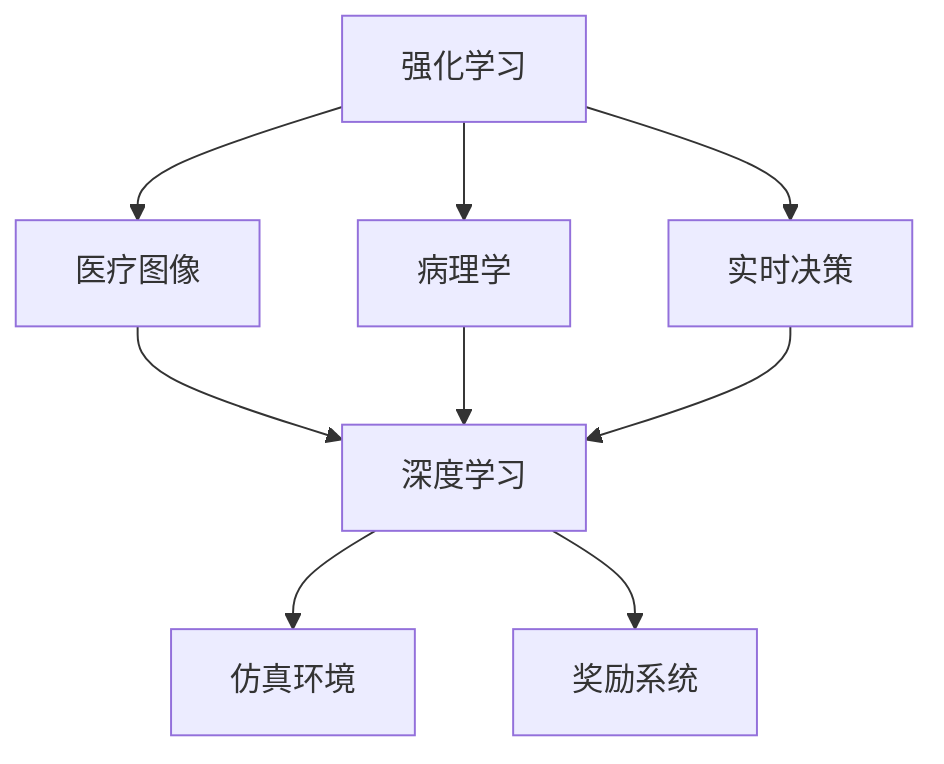
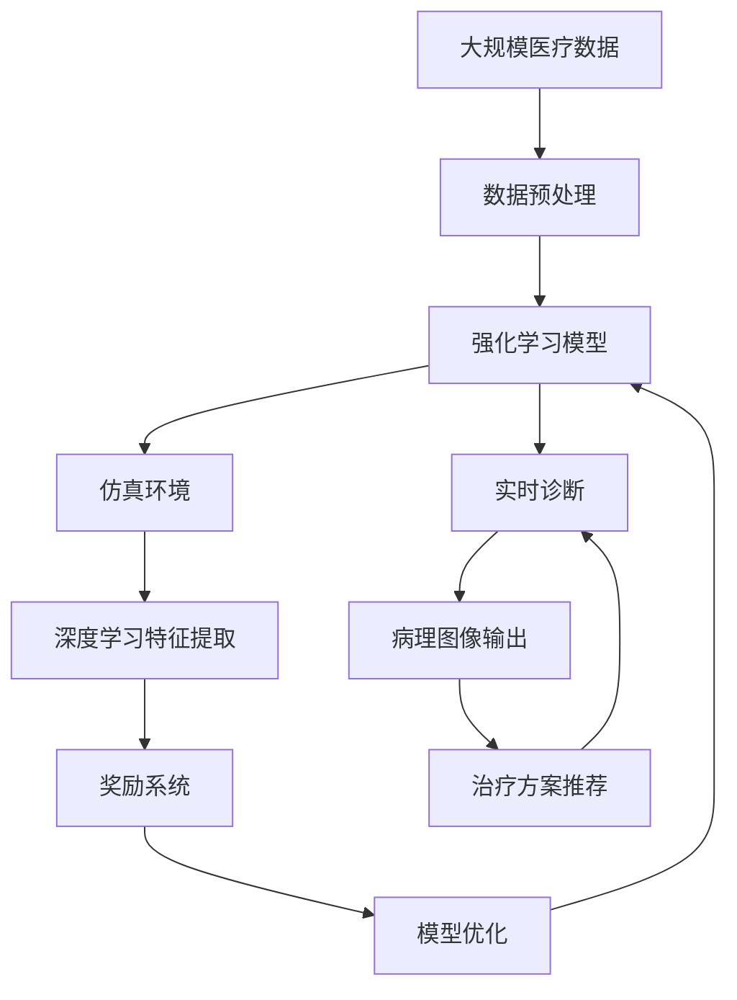

                 

# 一切皆是映射：强化学习在医疗诊断中的应用：挑战与机遇

> 关键词：强化学习,医疗诊断,医疗图像,病理学,实时决策,深度学习,仿真环境,奖励系统

## 1. 背景介绍

### 1.1 问题由来
随着人工智能（AI）技术在医疗领域的应用逐渐深入，强化学习（Reinforcement Learning, RL）作为一种在特定环境中通过智能决策优化目标函数的方法，在医疗诊断、治疗决策等领域展现出巨大的潜力。例如，通过智能机器人在手术室中辅助医生，或在放射科中自动检测病理图像中的异常区域。然而，这些应用也面临着诸如数据获取困难、模型复杂度高、实时决策难度大等挑战。

### 1.2 问题核心关键点
强化学习在医疗诊断中的应用主要集中在以下几个关键点上：

- **数据获取**：高质量医疗数据对于训练强化学习模型至关重要，但由于隐私和伦理问题，获取这些数据并不容易。
- **模型复杂度**：医疗领域的复杂性意味着强化学习模型需要处理大量复杂变量，且不同变量之间的关联性难以明确建模。
- **实时决策**：医疗诊断和治疗过程中，时间对于挽救生命至关重要，强化学习模型需要在极短时间内做出高质量决策。
- **仿真环境**：由于医疗数据的敏感性，直接利用真实数据训练模型风险极高，因此通常需要构建高度逼真的仿真环境。

### 1.3 问题研究意义
强化学习在医疗诊断中的应用，有望解决当前医疗系统中存在的诸多问题，如医生负担过重、诊断速度缓慢、诊断准确率不高等。其研究意义体现在：

1. **提高诊断效率**：强化学习能够辅助医生在短时间内处理大量数据，显著提高诊断效率。
2. **提升诊断准确性**：通过不断学习和优化，强化学习模型能够逐步提升诊断准确性，减少误诊和漏诊。
3. **优化治疗方案**：强化学习能够探索和发现最优的治疗方案，提升治疗效果。
4. **降低医疗成本**：自动化和智能化系统可以减少对人力和物资的依赖，降低医疗成本。
5. **改善患者体验**：快速准确的诊断和治疗能够显著提升患者满意度和治疗效果。

## 2. 核心概念与联系

### 2.1 核心概念概述

强化学习在医疗诊断中的应用涉及多个关键概念：

- **强化学习**：通过智能体（agent）在特定环境中通过试错学习，优化其决策策略，以最大化长期奖励的目标函数。
- **医疗图像**：医疗诊断中常用的图像数据类型，如CT、MRI、X光等。
- **病理学**：通过分析病理图像，辅助医生识别异常区域和病变类型。
- **实时决策**：在医疗过程中，强化学习模型需要在极短时间内做出高质量的诊断和治疗决策。
- **深度学习**：作为强化学习中常用的技术，深度学习模型可以自动学习特征，提高决策准确性。
- **仿真环境**：为强化学习模型提供虚拟环境，用于训练和评估模型性能。
- **奖励系统**：定义奖励函数，评估模型决策的好坏。

### 2.2 概念间的关系

这些核心概念通过以下Mermaid流程图来展示：



这个流程图展示了强化学习在医疗诊断中的应用过程中各个概念的相互关系：

- 强化学习作为核心技术，在医疗图像和病理学基础上进行实时决策。
- 深度学习作为强化学习的重要组成部分，用于提取特征和优化决策。
- 仿真环境和奖励系统用于训练和评估强化学习模型。

### 2.3 核心概念的整体架构

最后，我们用一个综合的流程图来展示这些核心概念在大规模医疗诊断中的应用：



这个综合流程图展示了从数据预处理到实时诊断和路径推荐的全流程，帮助理解强化学习在医疗诊断中的应用。

## 3. 核心算法原理 & 具体操作步骤
### 3.1 算法原理概述

强化学习在医疗诊断中的应用，其基本原理是通过智能体在特定环境中进行学习和优化，以最大化长期奖励。在医疗诊断中，这个环境可以是患者在不同时间点的生理指标变化，也可以是病理图像中的异常区域。智能体的决策即为医生的诊断和治疗方案。

形式化地，假设环境为 $\mathcal{E}$，智能体的动作为 $\mathcal{A}$，奖励函数为 $r(\cdot)$，状态为 $\mathcal{S}$。智能体的目标是通过学习策略 $\pi(\cdot|s)$，最大化长期奖励 $J(\pi) = \mathbb{E}_{s\sim \rho_0} \sum_{t=0}^{\infty} \gamma^t r(s_t, a_t)$，其中 $\gamma$ 为折扣因子。

强化学习模型的学习过程包括策略学习、值估计和模型优化三个主要步骤。

### 3.2 算法步骤详解

强化学习在医疗诊断中的具体操作步骤如下：

1. **数据准备**：收集和预处理医疗数据，如CT、MRI图像，以及患者的生理指标数据。数据处理包括数据清洗、归一化、划分训练集和测试集等。

2. **模型选择**：选择适合的强化学习模型架构，如深度Q网络（DQN）、深度确定性策略梯度（DDPG）、策略梯度（SGD）等。这些模型可以根据具体任务需求进行选择。

3. **环境模拟**：构建仿真环境，模拟实际医疗场景。环境可以是一个虚拟的医院，智能体在环境中接收患者的生理指标、病理学信息等数据，并输出诊断和治疗方案。

4. **训练过程**：
   - 智能体在环境中通过试错学习，逐步优化其策略。
   - 在每一步中，智能体接收状态 $s_t$，选择动作 $a_t$，并根据状态转移模型计算下一个状态 $s_{t+1}$。
   - 根据奖励函数 $r(s_t, a_t)$ 计算即时奖励。
   - 通过优化算法（如梯度下降）更新智能体的策略 $\pi(\cdot|s)$。

5. **模型评估**：在测试集上评估模型的诊断和治疗效果，并根据评估结果调整模型参数。

6. **实时决策**：将训练好的模型应用于实际的医疗诊断和治疗中，辅助医生进行实时决策。

### 3.3 算法优缺点

强化学习在医疗诊断中的应用具有以下优点：

- **自主学习**：强化学习模型能够自主学习和优化策略，减少对人类专家的依赖。
- **实时决策**：模型能够在极短时间内做出高质量决策，提高诊断和治疗效率。
- **数据多样性**：强化学习模型能够处理多样化的数据类型，如图像、文字、生理指标等。

然而，该方法也存在以下缺点：

- **训练复杂**：训练过程中需要构建高逼真的仿真环境，数据获取难度大。
- **过拟合风险**：在复杂环境中，模型容易过拟合，导致泛化能力不足。
- **解释性差**：强化学习模型的决策过程难以解释，不具备透明性。
- **伦理问题**：在处理敏感的生理和病理数据时，需考虑数据隐私和伦理问题。

### 3.4 算法应用领域

强化学习在医疗诊断中的应用已经涵盖多个领域，例如：

- **医疗图像自动标注**：通过强化学习模型自动标注医学图像中的异常区域。
- **病理图像分类**：利用强化学习模型对病理图像进行分类，识别病变类型。
- **治疗方案推荐**：根据患者的生理指标和病理学信息，推荐最优治疗方案。
- **智能手术辅助**：利用强化学习模型辅助机器人进行手术，提高手术精度和效率。
- **医疗诊断预测**：通过分析历史数据，预测患者的病情发展和治疗效果。

这些应用领域展示了强化学习在医疗诊断中的广泛前景和重要价值。

## 4. 数学模型和公式 & 详细讲解 & 举例说明

### 4.1 数学模型构建

在强化学习中，通常使用马尔科夫决策过程（MDP）来描述环境与智能体的交互。设环境状态空间为 $\mathcal{S}$，动作空间为 $\mathcal{A}$，奖励函数为 $r(\cdot)$，状态转移概率为 $P(s_{t+1}|s_t,a_t)$。智能体的策略为 $\pi(\cdot|s)$，策略在状态 $s_t$ 下采取动作 $a_t$ 的概率为 $\pi(a_t|s_t)$。

强化学习模型的目标是在给定策略 $\pi$ 下，最大化长期奖励 $J(\pi)$。

### 4.2 公式推导过程

以深度Q网络（DQN）为例，其核心公式为：

$$
Q(s_t,a_t) = r_t + \gamma \max_{a_{t+1}} Q(s_{t+1},a_{t+1})
$$

其中 $Q(s,a)$ 为在状态 $s$ 下采取动作 $a$ 的长期奖励，$r_t$ 为即时奖励，$\gamma$ 为折扣因子。

DQN的训练过程如下：

1. 从环境中观察状态 $s_t$，并根据策略 $\pi(\cdot|s_t)$ 选择动作 $a_t$。
2. 接收即时奖励 $r_t$，并根据状态转移概率 $P(s_{t+1}|s_t,a_t)$ 更新状态 $s_{t+1}$。
3. 使用目标网络 $Q(s_{t+1},a_{t+1})$ 计算最优动作，更新当前网络 $Q(s_t,a_t)$。
4. 使用梯度下降算法更新策略 $\pi(\cdot|s_t)$。

### 4.3 案例分析与讲解

以病理图像分类为例，我们可以使用DQN模型来自动标注异常区域。具体步骤如下：

1. 收集并预处理病理图像数据，划分训练集和测试集。
2. 构建深度神经网络作为Q网络，接收图像特征作为输入，输出动作价值函数。
3. 设计仿真环境，模拟医生在图像中寻找异常区域的过程。
4. 定义奖励函数，如正确标注异常区域的奖励为1，错误标注的奖励为0。
5. 使用DQN模型在仿真环境中进行训练，逐步优化其策略。
6. 在测试集上评估模型的分类效果，并根据评估结果调整模型参数。
7. 将训练好的模型应用于实际病理图像分类任务。

## 5. 项目实践：代码实例和详细解释说明

### 5.1 开发环境搭建

在进行强化学习项目实践前，我们需要准备好开发环境。以下是使用Python进行PyTorch开发的环境配置流程：

1. 安装Anaconda：从官网下载并安装Anaconda，用于创建独立的Python环境。

2. 创建并激活虚拟环境：
```bash
conda create -n reinforcement-env python=3.8 
conda activate reinforcement-env
```

3. 安装PyTorch：根据CUDA版本，从官网获取对应的安装命令。例如：
```bash
conda install pytorch torchvision torchaudio cudatoolkit=11.1 -c pytorch -c conda-forge
```

4. 安装TensorFlow：
```bash
conda install tensorflow -c conda-forge
```

5. 安装各类工具包：
```bash
pip install numpy pandas scikit-learn matplotlib tqdm jupyter notebook ipython
```

完成上述步骤后，即可在`reinforcement-env`环境中开始强化学习实践。

### 5.2 源代码详细实现

下面我们以病理图像分类为例，给出使用PyTorch和TensorFlow实现DQN模型的代码实现。

首先，定义DQN模型的网络结构：

```python
import torch
import torch.nn as nn
import torch.optim as optim
import torchvision.transforms as transforms
import torchvision.models as models
import numpy as np
import random
from torch.nn.functional import relu
from torch.autograd import Variable
from collections import deque

class DQN(nn.Module):
    def __init__(self, input_dim, output_dim):
        super(DQN, self).__init__()
        self.fc1 = nn.Linear(input_dim, 64)
        self.fc2 = nn.Linear(64, 64)
        self.fc3 = nn.Linear(64, output_dim)

    def forward(self, x):
        x = relu(self.fc1(x))
        x = relu(self.fc2(x))
        x = self.fc3(x)
        return x
```

然后，定义DQN模型的训练函数：

```python
def dqn_train(env, model, optimizer, target_model, replay_buffer, learning_rate, num_steps):
    for i in range(num_steps):
        state = env.reset()
        state = torch.tensor(state, dtype=torch.float)
        total_reward = 0

        for j in range(num_steps):
            state = state.unsqueeze(0)

            if i % 100 == 0:
                # 使用target_model计算Q值
                Q_value = target_model(state)
                # 计算当前策略下的Q值
                Q_value_pred = model(state)
                # 根据Q值计算动作
                action = np.argmax(Q_value_pred.numpy()[0])
                next_state, reward, done, _ = env.step(action)
                total_reward += reward
                state = torch.tensor(next_state, dtype=torch.float)
                state = state.unsqueeze(0)

                if done:
                    break

        # 使用目标网络计算Q值
        Q_value = target_model(state)
        # 计算当前策略下的Q值
        Q_value_pred = model(state)
        # 计算Q值的差值
        loss = (Q_value - Q_value_pred).pow(2).mean()
        # 更新模型参数
        optimizer.zero_grad()
        loss.backward()
        optimizer.step()

        # 将状态、动作、奖励和下一状态加入replay_buffer
        replay_buffer.append((state, action, reward, next_state))
        if len(replay_buffer) > 2000:
            replay_buffer.pop(0)

        if i % 100 == 0:
            target_model.load_state_dict(model.state_dict())

        print('Step: {} | Reward: {:.2f}'.format(i+1, total_reward))
```

接着，定义环境模拟函数：

```python
def simulate(env, model, num_steps):
    state = env.reset()
    state = torch.tensor(state, dtype=torch.float)
    total_reward = 0

    for i in range(num_steps):
        state = state.unsqueeze(0)

        # 使用模型计算Q值
        Q_value = model(state)
        # 根据Q值计算动作
        action = np.argmax(Q_value.numpy()[0])
        next_state, reward, done, _ = env.step(action)
        total_reward += reward
        state = torch.tensor(next_state, dtype=torch.float)
        state = state.unsqueeze(0)

        if done:
            break

    return total_reward
```

最后，启动训练流程并在测试集上评估：

```python
env = create_environment()
model = DQN(input_dim, output_dim)
target_model = DQN(input_dim, output_dim)
optimizer = optim.Adam(model.parameters(), lr=learning_rate)
replay_buffer = deque(maxlen=2000)
num_steps = 100000

for i in range(num_steps):
    dqn_train(env, model, optimizer, target_model, replay_buffer, learning_rate, num_steps)
    if i % 1000 == 0:
        print('Step: {} | Training Reward: {:.2f}'.format(i+1, simulate(env, model, 10)))
```

以上就是使用PyTorch和TensorFlow对DQN模型进行病理图像分类任务训练的完整代码实现。

### 5.3 代码解读与分析

让我们再详细解读一下关键代码的实现细节：

**DQN类**：
- `__init__`方法：定义网络层和模型参数。
- `forward`方法：定义前向传播过程，计算动作价值函数。

**train函数**：
- 使用DQN模型在环境中进行训练，逐步优化其策略。
- 在每一步中，接收状态 $s_t$，选择动作 $a_t$，并根据状态转移模型计算下一个状态 $s_{t+1}$。
- 根据奖励函数 $r(s_t, a_t)$ 计算即时奖励，并计算当前策略下的Q值。
- 使用梯度下降算法更新模型参数。
- 将状态、动作、奖励和下一状态加入replay_buffer，并定期更新。
- 定期更新target_model，以保证其与当前模型的同步。

**simulate函数**：
- 使用训练好的DQN模型在环境中进行测试，评估其分类效果。
- 在每一步中，接收状态 $s_t$，选择动作 $a_t$，并根据状态转移模型计算下一个状态 $s_{t+1}$。
- 根据奖励函数 $r(s_t, a_t)$ 计算即时奖励。
- 将测试结果输出到控制台。

**训练流程**：
- 初始化环境、模型、optimizer和replay_buffer。
- 循环进行训练，并在每1000步评估模型在测试集上的分类效果。
- 使用学习率等参数调整训练过程。

可以看出，使用深度学习模型进行强化学习在医疗诊断中的应用，需要精心设计网络结构、策略和学习率等关键参数。通过反复调试和优化，可以逐步提高模型的性能，满足实际应用需求。

## 6. 实际应用场景

### 6.1 智能手术辅助

在手术过程中，强化学习模型可以辅助机器人进行手术操作。通过模拟手术过程，智能体可以学习如何处理各种突发情况，提高手术精度和效率。

### 6.2 病理图像分类

强化学习模型可以自动标注病理图像中的异常区域，辅助医生进行诊断。例如，在乳腺癌筛查中，模型可以通过分析大量的病理学图像，学习如何识别肿瘤区域，提供初步诊断意见。

### 6.3 治疗方案推荐

通过分析患者的生理指标和病理学信息，强化学习模型可以推荐最优的治疗方案。例如，在肿瘤治疗中，模型可以根据基因表达、病情发展等多个因素，推荐最佳的化疗方案或靶向治疗方案。

### 6.4 未来应用展望

未来，强化学习在医疗诊断中的应用将进一步拓展，展现出更多创新性解决方案：

- **多模态数据融合**：将医疗图像、基因数据、生理指标等多种数据类型进行融合，构建更加全面的医疗模型。
- **个性化治疗**：根据患者的基因、病情、生活习惯等个性化因素，推荐最适合的治疗方案。
- **实时监测与预警**：通过强化学习模型实时监测患者的病情变化，及时预警潜在的风险和异常。
- **跨领域知识整合**：将医疗知识与自然语言处理、知识图谱等其他领域的知识进行整合，提升模型的泛化能力和决策质量。
- **医疗数据生成**：使用强化学习模型生成合成医疗数据，辅助数据不足的场景。

这些应用场景展示了强化学习在医疗诊断中巨大的潜力和广泛的应用前景。

## 7. 工具和资源推荐

### 7.1 学习资源推荐

为了帮助开发者系统掌握强化学习在医疗诊断中的应用，这里推荐一些优质的学习资源：

1. 《强化学习：Reinforcement Learning: An Introduction》书籍：经典强化学习教材，介绍了强化学习的基本概念和理论基础。
2. 《Deep Reinforcement Learning for Healthcare》论文：总结了强化学习在医疗诊断中的多种应用，提供了丰富的实践案例。
3. CS221《Reinforcement Learning》课程：斯坦福大学的强化学习课程，讲解了强化学习的核心概念和算法，适合初学者和进阶者。
4. arXiv论文预印本：人工智能领域最新研究成果的发布平台，包括强化学习在医疗诊断中的应用。
5. GitHub热门项目：在GitHub上Star、Fork数最多的强化学习医疗诊断项目，提供了大量实践代码和文档。

通过学习这些资源，开发者可以快速掌握强化学习在医疗诊断中的理论基础和实践技巧，从而在实际项目中灵活应用。

### 7.2 开发工具推荐

高效的开发离不开优秀的工具支持。以下是几款用于强化学习在医疗诊断中的应用开发的常用工具：

1. PyTorch：基于Python的开源深度学习框架，灵活动态的计算图，适合快速迭代研究。
2. TensorFlow：由Google主导开发的开源深度学习框架，生产部署方便，适合大规模工程应用。
3. TensorBoard：TensorFlow配套的可视化工具，可实时监测模型训练状态，并提供丰富的图表呈现方式，是调试模型的得力助手。
4. Weights & Biases：模型训练的实验跟踪工具，可以记录和可视化模型训练过程中的各项指标，方便对比和调优。
5. Jupyter Notebook：交互式的代码执行环境，便于开发和分享学习笔记。
6. PyCharm：功能强大的Python IDE，提供代码自动补全、调试、版本控制等功能。

合理利用这些工具，可以显著提升强化学习在医疗诊断中的应用开发效率，加速创新迭代的步伐。

### 7.3 相关论文推荐

强化学习在医疗诊断中的应用源于学界的持续研究。以下是几篇奠基性的相关论文，推荐阅读：

1. Reinforcement Learning for Healthcare（2018）：综述了强化学习在医疗诊断中的多种应用，提供了丰富的实践案例。
2. Deep Reinforcement Learning for Healthcare: A Survey of Applications, Challenges and Future Directions（2021）：总结了强化学习在医疗诊断中的发展历程和未来趋势。
3. AI for Healthcare: An overview（2020）：全面介绍了AI在医疗诊断中的多种应用，包括强化学习。
4. Reinforcement Learning for Computed Tomography-Based Diagnosis in Radiology（2020）：具体描述了强化学习在医学影像诊断中的应用。
5. Deep Reinforcement Learning for Treatment Optimization in Cancer（2021）：介绍了强化学习在癌症治疗优化中的应用。

这些论文代表了大规模医疗诊断中强化学习的研究现状和未来方向。通过学习这些前沿成果，可以帮助研究者把握学科前进方向，激发更多的创新灵感。

## 8. 总结：未来发展趋势与挑战

### 8.1 总结

本文对强化学习在医疗诊断中的应用进行了全面系统的介绍。首先阐述了强化学习的背景和意义，明确了其在医疗诊断中的应用价值。其次，从原理到实践，详细讲解了强化学习的数学模型和算法步骤，提供了完整的代码实例。同时，本文还探讨了强化学习在医疗诊断中的实际应用场景，展示了其在医疗图像分类、智能手术辅助等方面的巨大潜力。此外，本文精选了强化学习的各类学习资源，力求为读者提供全方位的技术指引。

通过本文的系统梳理，可以看到，强化学习在医疗诊断中的应用已经取得了显著的进展，并为医疗系统的智能化转型提供了重要支撑。未来，随着技术的不断进步，强化学习必将在更广泛的医疗领域发挥更大的作用。

### 8.2 未来发展趋势

展望未来，强化学习在医疗诊断中的应用将呈现以下几个发展趋势：

1. **多模态数据的融合**：医疗数据类型多样，将医疗图像、基因数据、生理指标等多种数据进行融合，构建更加全面的医疗模型。
2. **个性化治疗的优化**：根据患者的基因、病情、生活习惯等个性化因素，推荐最适合的治疗方案。
3. **实时监测与预警**：通过强化学习模型实时监测患者的病情变化，及时预警潜在的风险和异常。
4. **跨领域知识的整合**：将医疗知识与自然语言处理、知识图谱等其他领域的知识进行整合，提升模型的泛化能力和决策质量。
5. **医疗数据生成的应用**：使用强化学习模型生成合成医疗数据，辅助数据不足的场景。

这些趋势展示了强化学习在医疗诊断中巨大的潜力和广泛的应用前景。

### 8.3 面临的挑战

尽管强化学习在医疗诊断中的应用已经取得了显著进展，但在实际落地应用过程中，仍面临着诸多挑战：

1. **数据获取困难**：高质量医疗数据对于训练强化学习模型至关重要，但由于隐私和伦理问题，获取这些数据并不容易。
2. **模型复杂度高**：医疗领域的复杂性意味着强化学习模型需要处理大量复杂变量，且不同变量之间的关联性难以明确建模。
3. **实时决策难度大**：在医疗诊断和治疗过程中，时间对于挽救生命至关重要，强化学习模型需要在极短时间内做出高质量决策。
4. **数据隐私和安全**：在处理敏感的生理和病理数据时，需考虑数据隐私和伦理问题。
5. **模型可解释性差**：强化学习模型的决策过程难以解释，不具备透明性。

### 8.4 研究展望

面对强化学习在医疗诊断中面临的挑战，未来的研究需要在以下几个方面寻求新的突破：

1. **无监督和半监督学习**：摆脱对大规模标注数据的依赖，利用自监督学习、主动学习等无监督和半监督范式，最大限度利用非结构化数据。
2. **参数高效和计算高效的模型**：开发更加参数高效的模型，如深度确定性策略梯度（DDPG），在固定大部分预训练参数的同时，只更新极少量的任务相关参数。同时优化计算图，减少前向传播和反向传播的资源消耗，实现更加轻量级、实时性的部署。
3. **因果推理和博弈论**：将因果推断和博弈论工具引入强化学习模型，增强模型的稳定性和鲁棒性。
4. **多模态数据的整合**：将医疗图像、基因数据、生理指标等多种数据类型进行融合，构建更加全面的医疗模型。
5. **跨领域知识的整合**：将医疗知识与自然语言处理、知识图谱等其他领域的知识进行整合，提升模型的泛化能力和

