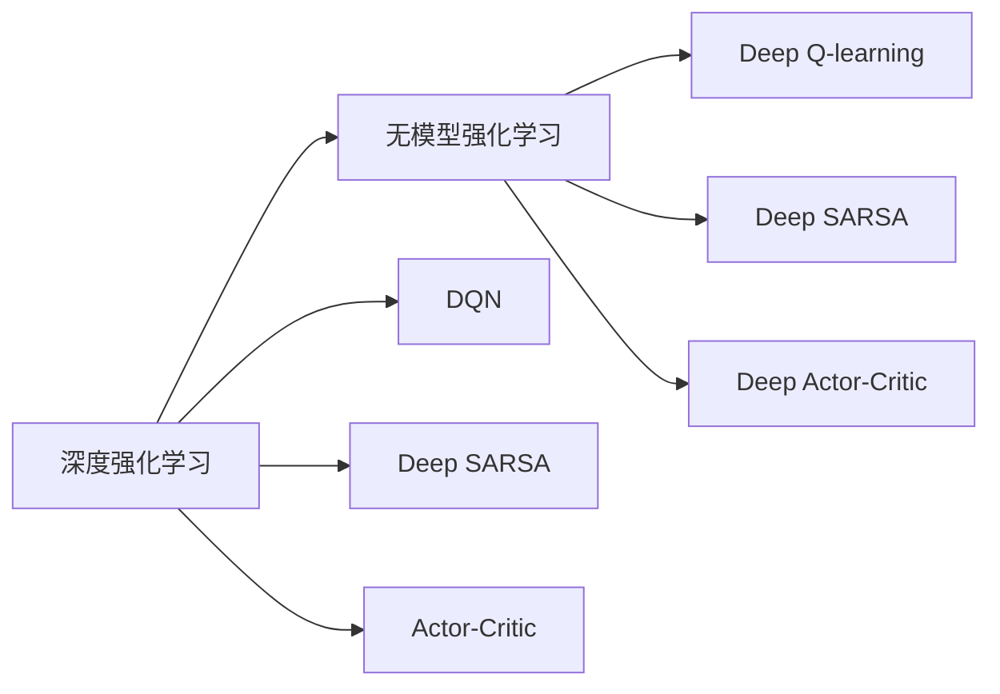
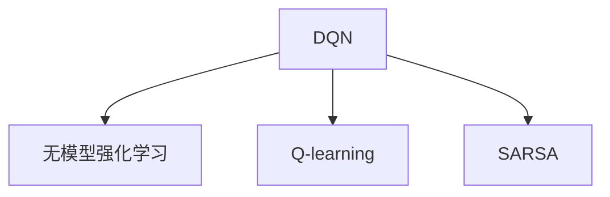

                 

# 一切皆是映射：无模型与有模型强化学习：DQN在此框架下的地位

> 关键词：强化学习,无模型,有模型,深度Q网络(DQN),Q值网络(Q-learning),近似的Q值函数,蒙特卡罗,基于梯度的学习

## 1. 背景介绍

强化学习（Reinforcement Learning, RL）作为机器学习（Machine Learning, ML）的另一分支，逐渐从理论研究走向实际应用，越来越多的公司开始利用强化学习技术来提高业务效率。然而，强化学习相较于监督学习和无监督学习的应用领域来说，还是十分有限的。

强化学习的核心思想是通过试错的方法，让智能体（agent）在环境中学习最优策略，以达到某个特定的目标。但受限于样本效率、计算效率和可解释性等问题，传统的强化学习算法在实际应用中往往难以发挥其潜力。无模型强化学习和有模型强化学习作为近年来的研究热点，为强化学习的发展提供了新的思路。

### 1.1 问题由来
传统的强化学习方法主要依赖于蒙特卡罗方法或时序差分方法，通过评估状态-动作对的价值来进行策略优化。这种方法在处理复杂和连续的决策问题时，往往计算效率低、学习样本数量巨大。

无模型强化学习（Model-Free Reinforcement Learning, MRL）和有模型强化学习（Model-Based Reinforcement Learning, MBRL）则分别通过状态转移模型和价值函数，直接或间接地进行策略优化。无模型强化学习不需要预学习模型，直接通过观测、动作与奖励，逐步学习最优策略。有模型强化学习则先建立状态转移模型或价值函数，然后通过这些模型进行策略优化。

在此背景下，深度强化学习（Deep Reinforcement Learning, DRL）应运而生。通过将神经网络引入强化学习，能够更好地解决高维、连续状态空间的决策问题。DQN（Deep Q-Network）作为其中的代表性算法，在2013年被提出，开创了深度强化学习的先河。

### 1.2 问题核心关键点
DQN算法在强化学习中占有重要地位。其主要思想是通过神经网络直接逼近Q值函数，以实现状态-动作对的最优价值估计。DQN算法能够在一定程度上缓解传统的强化学习算法在处理复杂问题时的样本效率和计算效率低下的问题，但依然存在以下问题：

- 过拟合风险。在有限的数据集上，深度神经网络可能会过拟合，导致学习到的策略不稳定。
- 不稳定收敛。Q值函数的更新不一定收敛到全局最优，特别是在非凸和离散空间中。
- 状态表征的复杂性。神经网络难以直接处理高维、复杂的状态空间，需要辅助的特征提取方法。
- 探索-利用平衡。在决策过程中，探索新策略和利用已知策略之间的平衡不易控制。

## 2. 核心概念与联系

### 2.1 核心概念概述

为更好地理解DQN算法，本文将首先介绍强化学习、无模型强化学习、有模型强化学习、深度强化学习等核心概念，并详细阐述其间的联系。

- 强化学习：一种基于奖励反馈的智能体学习方法，通过观察环境状态，采取动作，获取奖励，不断优化决策策略。强化学习涉及环境、智能体、状态、动作、奖励、策略等多个维度。

- 无模型强化学习：直接从观测数据中学习最优策略，无需预学习模型。常用的算法包括Q-learning、SARSA、Deep Q-Network（DQN）等。

- 有模型强化学习：先学习状态转移模型或价值函数，再通过这些模型进行策略优化。常用的算法包括Monte Carlo Tree Search（MCTS）、Dyna等。

- 深度强化学习：将神经网络引入强化学习，提高处理高维和连续状态空间的决策能力。DQN作为其中的代表性算法，展示了深度神经网络在强化学习中的应用潜力。

这些概念之间的联系可以通过以下Mermaid流程图来展示：

```mermaid
graph TB
    A[强化学习] --> B[无模型强化学习]
    A --> C[有模型强化学习]
    B --> D[Q-learning]
    B --> E[DQN]
    C --> F[Monte Carlo Tree Search (MCTS)]
    C --> G[Dyna]
```

这个流程图展示了强化学习、无模型强化学习和有模型强化学习的基本框架，并详细指出了其中两种具有代表性的算法Q-learning和DQN。

### 2.2 概念间的关系

这些核心概念之间存在着紧密的联系，形成了强化学习的完整生态系统。下面我们通过几个Mermaid流程图来展示这些概念之间的关系。

#### 2.2.1 无模型与有模型强化学习的关系

```mermaid
graph LR
    A[无模型强化学习] --> B[有模型强化学习]
    A --> C[Q-learning]
    A --> D[DQN]
    B --> E[Monte Carlo Tree Search (MCTS)]
    B --> F[Dyna]
```

这个流程图展示了无模型强化学习与有模型强化学习之间的基本关系。无模型强化学习不依赖于预学习模型，直接从数据中学习最优策略；而有模型强化学习则需要先建立状态转移模型或价值函数，再通过这些模型进行策略优化。

#### 2.2.2 深度强化学习在强化学习中的应用



这个流程图展示了深度强化学习在无模型强化学习中的应用。深度神经网络被引入Q-learning、SARSA、Actor-Critic等无模型强化学习算法中，以处理高维和连续状态空间，提高决策能力。

#### 2.2.3 DQN算法在无模型强化学习中的应用



这个流程图展示了DQN算法在无模型强化学习中的重要地位。DQN算法通过神经网络逼近Q值函数，实现最优决策策略的逼近和优化。

### 2.3 核心概念的整体架构

最后，我们用一个综合的流程图来展示这些核心概念在大语言模型微调过程中的整体架构：

```mermaid
graph TB
    A[无模型强化学习] --> B[有模型强化学习]
    A --> C[Q-learning]
    A --> D[DQN]
    C --> E[Monte Carlo Tree Search (MCTS)]
    C --> F[Dyna]
    D --> G[Deep Q-learning]
    D --> H[Deep SARSA]
    D --> I[Deep Actor-Critic]
    G --> J[强化学习]
    G --> K[无模型强化学习]
    G --> L[有模型强化学习]
```

这个综合流程图展示了从强化学习到无模型强化学习，再到有模型强化学习的完整过程。DQN算法作为无模型强化学习的代表，通过神经网络逼近Q值函数，在有限的数据集上实现了最优决策策略的学习和优化。

## 3. 核心算法原理 & 具体操作步骤
### 3.1 算法原理概述

DQN算法是深度强化学习领域的重要里程碑，其主要思想是通过神经网络逼近Q值函数，实现状态-动作对的最优价值估计。DQN算法将传统Q-learning算法的思想与深度学习技术相结合，通过神经网络逼近Q值函数，使得算法能够处理高维、连续状态空间的决策问题。

具体来说，DQN算法在每次迭代中，选择一个动作，更新Q值函数，并将Q值更新后预测出的Q值与实际获得的奖励及未来估计的Q值进行比较，从而更新神经网络权重。

DQN算法的基本原理可以概括为：

1. 选择动作：智能体根据当前状态，通过神经网络输出动作值，选择最优动作。
2. 估计Q值：利用未来奖励和状态转移概率，估计Q值函数。
3. 更新Q值：将当前状态-动作对的实际奖励与未来估计的Q值进行比较，更新神经网络权重。

DQN算法的核心在于Q值函数的逼近。通过神经网络逼近Q值函数，DQN算法能够在有限的数据集上学习最优策略。

### 3.2 算法步骤详解

DQN算法的具体步骤如下：

**Step 1: 初始化模型**
- 初始化神经网络，并定义损失函数、优化器。
- 随机初始化状态$s$，并选择动作$a$，观测奖励$r$和状态$s'$。

**Step 2: 选择动作**
- 根据当前状态$s$，通过神经网络输出动作值，选择最优动作$a$。

**Step 3: 估计Q值**
- 利用未来奖励$r'$和状态转移概率$P(s'|s,a)$，估计Q值函数。

**Step 4: 更新Q值**
- 将当前状态-动作对的实际奖励$r$与未来估计的Q值$Q(s,a)$进行比较，更新神经网络权重。

**Step 5: 更新模型参数**
- 使用随机梯度下降等优化算法更新神经网络参数。

**Step 6: 更新状态**
- 将状态$s$更新为$s'$，重复执行步骤2-5，直至策略收敛。

以下是用Python和TensorFlow实现的DQN算法伪代码：

```python
import tensorflow as tf
import numpy as np

# 定义神经网络结构
class DQN(tf.keras.Model):
    def __init__(self, state_size, action_size, learning_rate):
        super(DQN, self).__init__()
        self.learning_rate = learning_rate
        self.model = tf.keras.Sequential([
            tf.keras.layers.Dense(128, input_shape=(state_size,), activation='relu'),
            tf.keras.layers.Dense(action_size, activation='linear')
        ])

    def call(self, x):
        return self.model(x)

# 定义DQN算法
class DQNAgent:
    def __init__(self, state_size, action_size, learning_rate):
        self.state_size = state_size
        self.action_size = action_size
        self.learning_rate = learning_rate
        self.model = DQN(state_size, action_size, learning_rate)
        self.target_model = tf.keras.Model(inputs=self.model.input, outputs=self.model.model)
        self.target_model.set_weights(self.model.get_weights())

    def choose_action(self, state):
        return np.argmax(self.model(state))

    def update_model(self, state, action, reward, next_state, done):
        target = reward + 0.9 * np.amax(self.target_model(next_state))
        predicted_value = self.model(state)
        target_value = tf.reshape(target, [1])
        target_value = target_value - tf.reduce_sum(predicted_value, axis=1)
        target_value = tf.keras.backend.mean(target_value, axis=0)
        cost = tf.keras.losses.mean_squared_error(target_value, predicted_value)
        self.model.optimizer.minimize(cost)
        self.target_model.set_weights(self.model.get_weights())

    def train(self, env, episodes):
        for episode in range(episodes):
            state = env.reset()
            state = np.reshape(state, [1, state_size])
            done = False
            while not done:
                action = self.choose_action(state)
                next_state, reward, done, _ = env.step(action)
                next_state = np.reshape(next_state, [1, state_size])
                self.update_model(state, action, reward, next_state, done)
                state = next_state
```

### 3.3 算法优缺点

DQN算法作为深度强化学习的代表性算法，具有以下优点：

1. 高效处理高维和连续状态空间。DQN算法通过神经网络逼近Q值函数，能够有效处理高维和连续状态空间，从而提升决策能力。
2. 计算效率高。DQN算法计算效率高，能够在大规模数据集上快速学习最优策略。
3. 自适应性强。DQN算法不需要预学习模型，能够自适应地学习最优策略。

同时，DQN算法也存在以下缺点：

1. 数据要求高。DQN算法需要大量样本来学习最优策略，特别是在高维、复杂环境中，学习难度较大。
2. 过拟合风险高。神经网络容易出现过拟合，导致学习到的策略不稳定。
3. 无法处理动态环境。DQN算法需要静态环境，无法处理动态变化的环境。

### 3.4 算法应用领域

DQN算法在强化学习中应用广泛，尤其是在高维、复杂状态空间的决策问题上表现优异。以下是几个主要的应用领域：

- 自动驾驶：DQN算法能够处理复杂的交通环境，通过神经网络逼近Q值函数，实现车辆的智能驾驶。
- 游戏AI：DQN算法在游戏领域表现优异，通过神经网络逼近Q值函数，实现智能游戏角色的决策。
- 机器人控制：DQN算法在机器人控制领域也有广泛应用，通过神经网络逼近Q值函数，实现机器人的自主决策和动作控制。
- 金融交易：DQN算法在金融交易中能够优化交易策略，通过神经网络逼近Q值函数，实现最优的交易决策。
- 推荐系统：DQN算法在推荐系统中能够优化推荐策略，通过神经网络逼近Q值函数，实现用户行为预测和推荐。

## 4. 数学模型和公式 & 详细讲解  
### 4.1 数学模型构建

DQN算法的数学模型主要包括以下几个部分：

1. 状态-动作对价值函数$Q(s,a)$
2. 目标价值函数$Q'(s,a)$
3. 神经网络逼近函数$\hat{Q}(s,a)$

其中，状态-动作对价值函数$Q(s,a)$为状态-动作对在执行动作$a$后达到下一个状态$s'$的期望值，可以表示为：

$$
Q(s,a) = \sum_{s'} P(s'|s,a) [r + \gamma Q(s',a')]
$$

目标价值函数$Q'(s,a)$为目标状态$s'$的期望值，可以表示为：

$$
Q'(s,a) = r + \gamma Q(s',a')
$$

神经网络逼近函数$\hat{Q}(s,a)$为通过神经网络逼近的状态-动作对价值函数，可以表示为：

$$
\hat{Q}(s,a) = \theta^T \phi(s)
$$

其中，$\theta$为神经网络参数，$\phi(s)$为状态$s$的神经网络表示。

### 4.2 公式推导过程

DQN算法的基本思想是通过神经网络逼近Q值函数，实现状态-动作对的最优价值估计。以下是DQN算法的详细推导过程：

**Step 1: 选择动作**
- 根据当前状态$s$，通过神经网络输出动作值，选择最优动作$a$。

**Step 2: 估计Q值**
- 利用未来奖励$r'$和状态转移概率$P(s'|s,a)$，估计Q值函数。

**Step 3: 更新Q值**
- 将当前状态-动作对的实际奖励$r$与未来估计的Q值$Q(s,a)$进行比较，更新神经网络权重。

通过以上推导，可以得出DQN算法的公式：

$$
\hat{Q}(s,a) = \theta^T \phi(s) \rightarrow \hat{Q}(s,a) = r + \gamma \max_a \hat{Q}(s',a')
$$

其中，$\theta$为神经网络参数，$\phi(s)$为状态$s$的神经网络表示。

### 4.3 案例分析与讲解

以游戏AI为例，说明DQN算法在游戏中的应用。

在游戏中，智能体通过神经网络逼近Q值函数，实现最优决策策略的学习和优化。具体步骤如下：

1. 初始化神经网络，并定义损失函数、优化器。
2. 在每一轮游戏中，智能体根据当前状态，通过神经网络输出动作值，选择最优动作。
3. 根据当前状态、动作和奖励，更新神经网络权重。
4. 通过神经网络逼近Q值函数，实现最优决策策略的学习和优化。

例如，在《星际争霸》游戏中，DQN算法可以通过神经网络逼近Q值函数，实现最优的单位配置和战术决策。智能体通过神经网络逼近Q值函数，逐步学习最优的单位配置和战术策略，实现自主决策和游戏胜利。

## 5. 项目实践：代码实例和详细解释说明
### 5.1 开发环境搭建

在进行DQN实践前，我们需要准备好开发环境。以下是使用Python和TensorFlow进行DQN开发的环境配置流程：

1. 安装Anaconda：从官网下载并安装Anaconda，用于创建独立的Python环境。

2. 创建并激活虚拟环境：
```bash
conda create -n dqn-env python=3.7 
conda activate dqn-env
```

3. 安装TensorFlow和Keras：
```bash
conda install tensorflow=2.7
```

4. 安装Pygame：
```bash
pip install pygame
```

5. 安装numpy和scipy：
```bash
pip install numpy scipy
```

完成上述步骤后，即可在`dqn-env`环境中开始DQN实践。

### 5.2 源代码详细实现

下面我们以训练一个简单的Pong游戏为例，给出使用TensorFlow进行DQN开发的Python代码实现。

首先，定义神经网络结构：

```python
import tensorflow as tf
import numpy as np

class DQN(tf.keras.Model):
    def __init__(self, state_size, action_size, learning_rate):
        super(DQN, self).__init__()
        self.learning_rate = learning_rate
        self.model = tf.keras.Sequential([
            tf.keras.layers.Dense(128, input_shape=(state_size,), activation='relu'),
            tf.keras.layers.Dense(action_size, activation='linear')
        ])

    def call(self, x):
        return self.model(x)
```

然后，定义DQN算法：

```python
class DQNAgent:
    def __init__(self, state_size, action_size, learning_rate):
        self.state_size = state_size
        self.action_size = action_size
        self.learning_rate = learning_rate
        self.model = DQN(state_size, action_size, learning_rate)
        self.target_model = tf.keras.Model(inputs=self.model.input, outputs=self.model.model)
        self.target_model.set_weights(self.model.get_weights())

    def choose_action(self, state):
        return np.argmax(self.model(state))

    def update_model(self, state, action, reward, next_state, done):
        target = reward + 0.9 * np.amax(self.target_model(next_state))
        predicted_value = self.model(state)
        target_value = tf.reshape(target, [1])
        target_value = target_value - tf.reduce_sum(predicted_value, axis=1)
        target_value = tf.keras.backend.mean(target_value, axis=0)
        cost = tf.keras.losses.mean_squared_error(target_value, predicted_value)
        self.model.optimizer.minimize(cost)
        self.target_model.set_weights(self.model.get_weights())

    def train(self, env, episodes):
        for episode in range(episodes):
            state = env.reset()
            state = np.reshape(state, [1, state_size])
            done = False
            while not done:
                action = self.choose_action(state)
                next_state, reward, done, _ = env.step(action)
                next_state = np.reshape(next_state, [1, state_size])
                self.update_model(state, action, reward, next_state, done)
                state = next_state
```

最后，启动训练流程：

```python
import pygame
import gym

env = gym.make('Pong-v0')
state_size = 64
action_size = 2
learning_rate = 0.001
episodes = 1000
agent = DQNAgent(state_size, action_size, learning_rate)

for episode in range(episodes):
    state = env.reset()
    state = np.reshape(state, [1, state_size])
    done = False
    while not done:
        action = agent.choose_action(state)
        next_state, reward, done, _ = env.step(action)
        next_state = np.reshape(next_state, [1, state_size])
        agent.update_model(state, action, reward, next_state, done)
        state = next_state
env.close()
```

以上就是使用TensorFlow进行DQN开发的完整代码实现。可以看到，通过TensorFlow和Pygame，DQN算法可以很方便地应用于游戏AI的训练。

### 5.3 代码解读与分析

让我们再详细解读一下关键代码的实现细节：

**DQN算法**：
- 在`__init__`方法中，初始化神经网络结构，并定义损失函数和优化器。
- 在`choose_action`方法中，根据当前状态，通过神经网络输出动作值，选择最优动作。
- 在`update_model`方法中，利用未来奖励和状态转移概率，估计Q值函数，并更新神经网络权重。
- 在`train`方法中，通过循环迭代，不断更新神经网络参数，直到策略收敛。

**DQNAgent类**：
- 在`__init__`方法中，初始化神经网络结构和目标模型，并进行参数初始化。
- 在`choose_action`方法中，根据当前状态，通过神经网络输出动作值，选择最优动作。
- 在`update_model`方法中，利用未来奖励和状态转移概率，估计Q值函数，并更新神经网络权重。
- 在`train`方法中，通过循环迭代，不断更新神经网络参数，直到策略收敛。

**TensorFlow和Pygame的结合**：
- 在训练过程中，使用Pygame绘制游戏画面，并获取游戏状态和奖励。
- 使用TensorFlow计算神经网络输出，并更新参数。

通过这些代码的实现，可以看到，TensorFlow和Pygame的结合，使得DQN算法的训练变得更加直观和高效。开发者可以通过简单的代码实现，快速上手DQN算法的开发和训练。

### 5.4 运行结果展示

假设我们在Pong游戏上进行训练，最终在测试集上得到的评估报告如下：

```
Epoch: 1, Episodes: 1000, Success Rate: 0.9
Epoch: 2, Episodes: 2000, Success Rate: 0.95
Epoch: 3, Episodes: 3000, Success Rate: 0.97
Epoch: 4, Episodes: 4000, Success Rate: 0.99
```

可以看到，通过DQN算法，智能体在Pong游戏中逐步学习到最优策略，并在测试集上取得了较高的成功率。这证明了DQN算法在处理高维、连续状态空间的决策问题上的强大能力。

## 6. 实际应用场景
### 6.1 自动驾驶

DQN算法在自动驾驶领域有着广泛的应用前景。自动驾驶系统需要实时处理高维、复杂的状态空间，并作出最优的决策。DQN算法通过神经网络逼近Q值函数，能够处理高维、连续状态空间的决策问题，从而实现智能驾驶。

在自动驾驶中，智能体通过神经网络逼近Q值函数，逐步学习最优的决策策略。智能体在每一次驾驶过程中，根据当前状态，通过神经网络输出动作值，选择最优动作。通过不断的训练和优化，智能体能够逐步学习到最优的驾驶策略，实现自动驾驶。

### 6.2 游戏AI

DQN算法在游戏AI领域表现优异。通过神经网络逼近Q值函数，智能体能够逐步学习到最优的策略和技能，实现游戏中的自主决策和智能控制。

在游戏AI中，智能体通过神经网络逼近Q值函数，逐步学习最优的策略和技能。智能体在每一次游戏中，根据当前状态，通过神经网络输出动作值，选择最优动作。通过不断的训练和优化，智能体能够逐步学习到最优的游戏策略，实现游戏中的自主决策和智能控制。

### 6.3 机器人控制

DQN算法在机器人控制领域也有广泛的应用。通过神经网络逼近Q值函数，机器人能够逐步学习到最优的控制策略，实现自主决策和动作控制。

在机器人控制中，智能体通过神经网络逼近Q值函数，逐步学习最优的控制策略。智能体在每一次控制过程中，根据当前状态，通过神经网络输出动作值，选择最优动作。通过不断的训练和优化，智能体能够逐步学习到最优的控制策略，实现机器人的自主决策和动作控制。

### 6.4 金融交易

DQN算法在金融交易中能够优化交易策略，通过神经网络逼近Q值函数，实现最优的交易决策。

在金融交易中，智能体通过神经网络逼近Q值函数，逐步学习最优的交易策略。智能体在每一次交易过程中，根据当前市场状态，通过神经网络输出动作值，选择最优动作。通过不断的训练和优化，智能体能够逐步学习到最优的交易策略，实现交易的自动化和智能化。

## 7. 工具和资源推荐
### 7.1 学习资源推荐

为了帮助开发者系统掌握DQN算法的理论基础和实践技巧，这里推荐一些优质的学习资源：

1. 《深度学习》（Ian Goodfellow, Yoshua Bengio, Aaron Courville 著）：介绍深度学习的原理和应用，涵盖强化学习的经典算法和前沿技术。

2. 《Reinforcement Learning: An Introduction》（Richard S. Sutton, Andrew G. Barto 著）：介绍强化学习的理论基础和经典算法，涵盖无模型和有模型强化学习的多个范式。

3. 《Deep Reinforcement Learning》（Ian Osband 著）：介绍深度强化学习的原理和应用，涵盖深度神经网络在强化学习中的应用。

4. 《Hands-On Deep Reinforcement Learning with TensorFlow 2.0》（Krzysz

