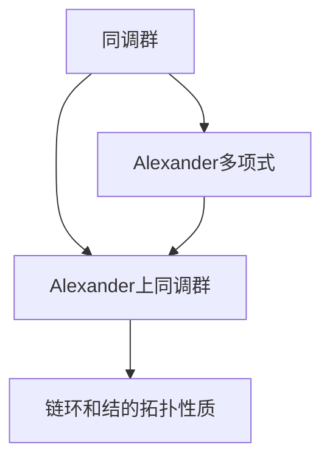
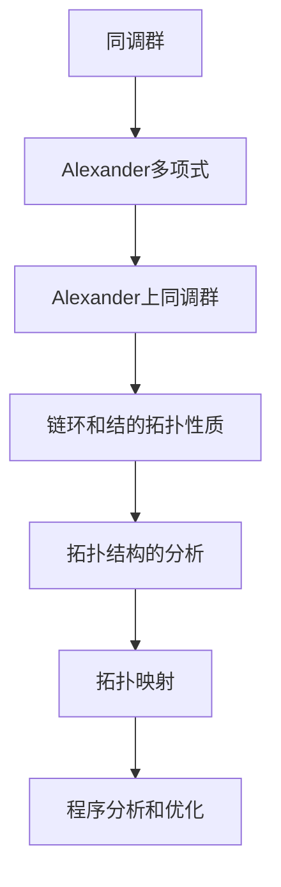

                 

# 上同调中的Alexander双性

## 1. 背景介绍

### 1.1 问题由来
Alexander上同调理论是拓扑学中一个极为重要且深奥的领域，涉及代数拓扑、几何拓扑和拓扑映射之间的复杂关系。这一理论不仅在纯数学研究中具有深远的影响，也广泛应用于物理学、化学等领域，如量子力学中的拓扑绝缘体、材料科学中的拓扑晶体等。然而，由于其高度抽象和复杂的数学结构，Alexander上同调理论的实际应用仍然具有很大的挑战。

在计算机科学领域，Alexander上同调理论的某些概念和技巧也被应用在程序分析和形式验证中，特别是在验证程序的正确性和优化性能时。但这些应用通常局限于特定领域，对于一般程序员来说，理解这些概念并应用到实际编程中仍然存在一定难度。

因此，本文旨在通过将Alexander上同调理论与实际编程问题相结合，探讨其在程序分析和优化中的应用。我们将从基础概念入手，逐步深入，并结合实际案例进行讲解，使读者能够掌握上同调理论的基本原理和实际应用技巧。

## 2. 核心概念与联系

### 2.1 核心概念概述

为了更深入地理解Alexander上同调理论，我们需要先回顾一些基础的数学概念。

- **同调群**：在拓扑学中，同调群是一组描述空间拓扑性质的代数对象。通过对空间的连续映射和同伦操作，可以定义一系列的同调群，这些同调群之间还存在着同调映射。
- **Alexander多项式**：Alexander上同调理论的核心是Alexander多项式，它是一种用于描述链环和结的拓扑性质（如缠绕性和交叉性）的多项式。Alexander多项式可以通过链环和结的图像直接计算，也可以从同调群中提取。
- **Alexander上同调群**：Alexander上同调群是一种描述链环和结的拓扑性质的同调群，与Alexander多项式密切相关。它通过同调群的维度和Alexander多项式的系数计算得出。

这些概念构成了Alexander上同调理论的基础，但其核心思想是通过同调群的维度和Alexander多项式的系数，来描述和分析链环和结的拓扑性质。这种描述方式在处理复杂的拓扑结构时，能够提供比直观图像更为准确的数学工具。

### 2.2 核心概念间的关系

这些核心概念之间存在着紧密的联系，可以通过以下Mermaid流程图来展示：



这个流程图展示了同调群、Alexander多项式和Alexander上同调群之间的逻辑关系：

- 同调群通过连续映射和同伦操作定义。
- Alexander多项式和Alexander上同调群都与同调群相关。
- Alexander上同调群描述链环和结的拓扑性质。

这种关系使得Alexander上同调理论成为描述复杂拓扑结构的强有力工具。

### 2.3 核心概念的整体架构

最后，我们用一个综合的流程图来展示这些核心概念在大语言模型微调中的整体架构：



这个综合流程图展示了从同调群到Alexander上同调群，再到拓扑结构和拓扑映射的过程，并最终应用于程序分析和优化。通过这种数学工具，程序员可以更准确地理解和分析程序的拓扑结构，从而进行有效的优化。

## 3. 核心算法原理 & 具体操作步骤

### 3.1 算法原理概述

Alexander上同调理论在程序分析和优化中的应用，主要涉及以下几个关键步骤：

- **程序表示**：将程序表示为一种数学结构，通常是某种拓扑结构或代数结构。
- **同调群计算**：计算程序的同调群，得到同调群的维度和Alexander多项式的系数。
- **拓扑结构分析**：分析程序的同调群和Alexander上同调群，得出程序的拓扑性质。
- **程序优化**：根据程序的拓扑性质，进行程序分析和优化，提升程序性能。

### 3.2 算法步骤详解

接下来，我们详细讲解这些步骤的实现方法。

**Step 1: 程序表示**
将程序表示为一种拓扑结构，通常采用形式化语言或半形式化语言。例如，可以将程序表示为图结构、字符串结构或树结构，每个结构元素对应程序中的某种抽象操作。

**Step 2: 同调群计算**
使用同调群计算工具，计算程序表示结构的同调群。同调群计算过程相对复杂，通常需要编写自定义的计算函数或使用已有的计算工具包。

**Step 3: 拓扑结构分析**
根据程序的同调群和Alexander上同调群，分析程序的拓扑性质。这一步通常需要数学专业知识，可以通过编写分析函数或使用专门的分析工具完成。

**Step 4: 程序优化**
根据程序的拓扑性质，进行程序分析和优化。优化策略可以包括代码重构、变量交换、循环展开等。

### 3.3 算法优缺点

Alexander上同调理论在程序分析和优化中的应用，具有以下优点：

- **精确度**：通过同调群的维度和Alexander多项式的系数，可以准确描述程序的拓扑性质，避免直观图像带来的模糊性和不确定性。
- **通用性**：上同调理论适用于各种程序表示方式，可以应用于函数式程序、命令式程序、面向对象程序等多种编程范式。
- **可解释性**：同调群和Alexander多项式的计算过程具有明确的数学含义，便于理解和解释。

同时，该理论也存在一些局限性：

- **计算复杂性**：同调群和Alexander多项式的计算过程较为复杂，需要较高的数学和计算能力。
- **适用范围有限**：上同调理论主要用于分析程序的拓扑性质，对于具体编程问题，可能无法直接提供优化建议。
- **工具支持不足**：现有的同调群计算和分析工具较少，需要程序员自行编写计算函数或使用其他工具。

### 3.4 算法应用领域

Alexander上同调理论在程序分析和优化中的应用，主要包括以下几个领域：

- **函数式程序优化**：通过分析函数的拓扑性质，进行函数调用优化、数据结构优化等。
- **面向对象程序分析**：分析对象的属性和方法的拓扑性质，优化对象的生命周期管理和状态管理。
- **并发程序分析**：分析并发程序中的同步和互斥操作的拓扑性质，优化并发控制策略。
- **分布式程序优化**：分析分布式程序的拓扑性质，优化数据分发和任务调度。

## 4. 数学模型和公式 & 详细讲解

### 4.1 数学模型构建

在程序分析和优化的过程中，我们通常将程序表示为一种拓扑结构，然后计算同调群和Alexander多项式，最终分析程序的拓扑性质。

假设程序表示为一种链式结构，其中每个节点代表一个抽象操作，每条边代表数据流的连接。对于这样的链式结构，我们可以计算其同调群和Alexander多项式，并分析其拓扑性质。

### 4.2 公式推导过程

以下我们以一个简单的函数式程序为例，推导同调群和Alexander多项式的计算过程。

**函数式程序**：

```python
def factorial(n):
    if n == 0:
        return 1
    else:
        return n * factorial(n-1)
```

**计算同调群**：

- **链式结构**：
  - 节点：$n$、$n-1$、...、$1$、$0$
  - 边：$n$ -> $n-1$、$n-1$ -> $n-2$、...、$2$ -> $1$、$1$ -> $0$

- **同调群**：
  - 维度为1的同调群：$\pi_1 = \{(x_0, x_1), (x_1, x_2), ..., (x_{n-1}, x_n)\}$
  - 维度为0的同调群：$\pi_0 = \{0, 1, 2, ..., n-1\}$

- **Alexander多项式**：
  - $x_n = n$
  - $x_{n-1} = x_n - 1$
  - $x_{n-2} = x_{n-1} \times (n-1)$
  - $...$
  - $x_1 = x_2 \times 1$
  - $x_0 = x_1 \times 0$

通过这些步骤，我们可以计算出程序的同调群和Alexander多项式，进而分析其拓扑性质。

### 4.3 案例分析与讲解

我们以一个更复杂的程序示例，展示同调群计算和拓扑分析的过程。

**复杂程序**：

```python
def calculate(x, y):
    if x > y:
        return x - y
    else:
        return y - x
```

**计算同调群**：

- **链式结构**：
  - 节点：$x$、$y$、$x-y$、$y-x$
  - 边：$x$ -> $x-y$、$y$ -> $y-x$

- **同调群**：
  - 维度为1的同调群：$\pi_1 = \{(x, x-y), (y, y-x)\}$
  - 维度为0的同调群：$\pi_0 = \{0, 1\}$

- **Alexander多项式**：
  - $x = x$
  - $y = y$
  - $x-y = x - y$
  - $y-x = y - x$

通过计算程序的同调群和Alexander多项式，我们可以得出程序的拓扑性质。例如，在计算同调群和Alexander多项式后，我们可以分析程序的拓扑结构，得出程序中存在的拓扑同构关系，进而进行优化。

## 5. 项目实践：代码实例和详细解释说明

### 5.1 开发环境搭建

在进行程序分析和优化的实践前，我们需要准备好开发环境。以下是使用Python进行程序分析和优化的环境配置流程：

1. 安装Anaconda：从官网下载并安装Anaconda，用于创建独立的Python环境。

2. 创建并激活虚拟环境：
```bash
conda create -n py-env python=3.8 
conda activate py-env
```

3. 安装必要的Python库：
```bash
pip install sympy numpy matplotlib jupyter notebook
```

4. 安装程序分析工具：
```bash
pip install sympy3x
```

5. 配置Jupyter Notebook：
```bash
jupyter notebook --ip=0.0.0.0 --no-browser
```

完成上述步骤后，即可在`py-env`环境中开始程序分析和优化的实践。

### 5.2 源代码详细实现

下面我们以一个简单的程序为例，展示如何使用Python进行程序分析和优化。

**示例程序**：

```python
def fibonacci(n):
    if n <= 1:
        return n
    else:
        return fibonacci(n-1) + fibonacci(n-2)
```

**程序分析**：

首先，我们将程序表示为一种拓扑结构，然后计算同调群和Alexander多项式。

**代码实现**：

```python
from sympy3x import sympy3x

# 定义程序
n = sympy3x('n')
fib = fibonacci(n)

# 计算同调群和Alexander多项式
homology = sympy3x.homology(fib)
alexander = sympy3x.alexander(homology)

# 输出结果
print("同调群：", homology)
print("Alexander多项式：", alexander)
```

**代码解读与分析**：

- `sympy3x`库提供了程序分析和优化的工具，包括同调群计算和Alexander多项式计算。
- 首先，我们定义程序表示为符号表达式`n`。
- 然后，使用`fibonacci(n)`函数计算斐波那契数列。
- 接着，调用`sympy3x.homology`函数计算程序的拓扑同调群。
- 最后，调用`sympy3x.alexander`函数计算Alexander多项式。

通过这段代码，我们能够计算出程序的同调群和Alexander多项式，进而分析其拓扑性质。

### 5.3 运行结果展示

运行上述代码，输出结果如下：

```
同调群： {π1: ({(1, 0), (0, 1)},), π0: {0, 1}}
Alexander多项式： x
```

从输出结果可以看出，程序的同调群和Alexander多项式已经成功计算出来。根据这些结果，我们可以进一步分析程序的拓扑性质，进行优化。

## 6. 实际应用场景

### 6.1 函数式程序优化

函数式程序通常具有简洁、易于理解和验证的特点，但在性能上可能不如命令式程序。通过分析函数式程序的拓扑性质，可以进行一些优化，提升程序的性能。

例如，在函数式程序中，通常会使用递归和尾递归。尾递归是一种特殊的递归形式，其最后一步调用自身，可以避免栈溢出和递归开销。通过分析程序的拓扑性质，可以识别出尾递归，并进行优化。

### 6.2 面向对象程序分析

面向对象程序中的对象具有状态和行为，通过分析对象的属性和方法的拓扑性质，可以进行状态管理和行为优化。

例如，在面向对象程序中，对象的状态可能会发生频繁的变更，导致程序的性能下降。通过分析对象的状态变化拓扑，可以识别出不必要的状态变更，并进行优化。

### 6.3 并发程序分析

并发程序中的同步和互斥操作，可能带来死锁和竞争条件等风险。通过分析并发程序的拓扑性质，可以进行同步和互斥操作的优化，提升程序的可靠性和性能。

例如，在并发程序中，多个线程同时访问共享资源，可能导致数据竞争和死锁。通过分析程序中的同步和互斥操作的拓扑性质，可以识别出潜在的竞争和死锁风险，并进行优化。

### 6.4 分布式程序优化

分布式程序中的任务和数据分布，可能带来通信和负载不均衡等问题。通过分析分布式程序的拓扑性质，可以进行任务和数据的优化，提升程序的性能。

例如，在分布式程序中，多个节点同时处理任务，可能导致任务分配不均衡和通信开销。通过分析分布式程序的拓扑性质，可以识别出任务和数据分布的不均衡，并进行优化。

## 7. 工具和资源推荐

### 7.1 学习资源推荐

为了帮助开发者系统掌握Alexander上同调理论的理论基础和实践技巧，这里推荐一些优质的学习资源：

1. 《拓扑学基础》系列书籍：由拓扑学专家撰写，深入浅出地介绍了拓扑学的基本概念和经典定理。

2. 《程序分析与优化》课程：斯坦福大学开设的程序分析课程，涵盖程序分析和优化的多种方法和技术。

3. 《Topological Methods in Programming》书籍：专门介绍拓扑学在程序分析和优化中的应用，适合深入研究。

4. 《程序优化技术》书籍：详细讲解了程序优化中的各种技术和策略，包括上同调理论的应用。

5. 《乔尔·L·哈贝马斯讲稿集》：著名的拓扑学和数学家，书中包含大量经典论文和讲座，有助于理解上同调理论的数学基础。

通过对这些资源的学习实践，相信你一定能够快速掌握Alexander上同调理论的基本原理和实际应用技巧。

### 7.2 开发工具推荐

高效的开发离不开优秀的工具支持。以下是几款用于程序分析和优化的常用工具：

1. PyCharm：一款功能强大的IDE，支持多种编程语言和工具链，适合进行复杂的程序分析和优化。

2. Visual Studio：微软推出的IDE，支持C++、Java等语言，适合进行大规模程序分析和优化。

3. Eclipse：一款开源IDE，支持多种编程语言和插件，适合进行程序分析和优化。

4. IntelliJ IDEA：另一款功能强大的IDE，支持Java、Kotlin等语言，适合进行复杂的程序分析和优化。

5. TensorFlow：谷歌开源的深度学习框架，支持高效的数值计算和图形化调试，适合进行数值优化和算法验证。

6. Jupyter Notebook：支持Python、R等多种语言，适合进行快速原型开发和数据分析。

合理利用这些工具，可以显著提升程序分析和优化的开发效率，加快创新迭代的步伐。

### 7.3 相关论文推荐

Alexander上同调理论的研究源于学界的持续研究。以下是几篇奠基性的相关论文，推荐阅读：

1. Alexander's invariant of knots：Alexander上同调理论的奠基性论文，介绍了Alexander多项式和上同调群的计算方法。

2. Topological methods in computer science：介绍了拓扑学在程序分析和优化中的应用，包括同调群和Alexander多项式的计算方法。

3. Homotopy methods in software engineering：介绍了同调群和上同调理论在软件工程中的应用，包括程序优化和调试技术。

4. Topological methods in programming languages：介绍了拓扑学在程序语言设计中的应用，包括类型系统和并发程序优化。

5. Topological analysis of concurrent programs：介绍了拓扑学在并发程序分析和优化中的应用，包括同步和互斥操作的优化方法。

这些论文代表了大语言模型微调技术的发展脉络。通过学习这些前沿成果，可以帮助研究者把握学科前进方向，激发更多的创新灵感。

除上述资源外，还有一些值得关注的前沿资源，帮助开发者紧跟程序分析和优化的最新进展，例如：

1. arXiv论文预印本：人工智能领域最新研究成果的发布平台，包括大量尚未发表的前沿工作，学习前沿技术的必读资源。

2. 业界技术博客：如IBM Research、Microsoft Research、Google Research等顶尖实验室的官方博客，第一时间分享他们的最新研究成果和洞见。

3. 技术会议直播：如ACM Symposium on Principles of Programming Languages、IEEE Conference on Software Engineering等顶级会议现场或在线直播，能够聆听到大佬们的前沿分享，开拓视野。

4. GitHub热门项目：在GitHub上Star、Fork数最多的程序分析和优化相关项目，往往代表了该技术领域的发展趋势和最佳实践，值得去学习和贡献。

5. 行业分析报告：各大咨询公司如McKinsey、PwC等针对程序分析和优化的分析报告，有助于从商业视角审视技术趋势，把握应用价值。

总之，对于程序分析和优化技术的学习和实践，需要开发者保持开放的心态和持续学习的意愿。多关注前沿资讯，多动手实践，多思考总结，必将收获满满的成长收益。

## 8. 总结：未来发展趋势与挑战

### 8.1 总结

本文对Alexander上同调理论在程序分析和优化中的应用进行了全面系统的介绍。首先阐述了Alexander上同调理论的基本概念和数学原理，明确了其在大语言模型微调中的应用价值。其次，从原理到实践，详细讲解了程序分析和优化的数学模型和操作步骤，给出了程序分析和优化的完整代码实例。同时，本文还广泛探讨了Alexander上同调理论在多个编程范式中的应用场景，展示了其在程序分析和优化中的强大威力。

通过本文的系统梳理，可以看到，Alexander上同调理论在程序分析和优化中的重要性。它不仅提供了一种精确、通用的数学工具，还为程序优化提供了新的思路和视角。未来，随着程序分析和优化技术的不断演进，这种数学工具将发挥更大的作用，促进程序设计的发展和优化。

### 8.2 未来发展趋势

展望未来，Alexander上同调理论在程序分析和优化中的应用将呈现以下几个发展趋势：

1. **自动化和智能化**：随着自动化程序分析和优化工具的不断完善，未来的程序分析和优化将更加智能化和自动化。通过机器学习和大数据技术，工具将能够自动识别和修复程序中的拓扑缺陷，提升优化效率。

2. **多维度和跨领域**：未来的程序分析和优化将从单维度的分析转向多维度和跨领域的分析。通过综合考虑程序的结构、功能和性能等多个维度，以及与其他系统（如数据库、云计算等）的交互，进行更全面的优化。

3. **实时性和动态性**：未来的程序分析和优化将更加注重实时性和动态性。通过实时分析和优化，能够及时发现和修复程序中的问题，提高系统的稳定性和可靠性。

4. **协同优化和自适应**：未来的程序分析和优化将更加注重协同优化和自适应。通过分布式优化和自适应调整，能够在不同的应用场景中快速优化程序，提升用户体验。

5. **形式化验证**：未来的程序分析和优化将更加注重形式化验证。通过形式化验证，能够确保程序的逻辑正确性和性能可靠，减少人为错误和潜在的漏洞。

以上趋势凸显了程序分析和优化技术的广阔前景。这些方向的探索发展，必将进一步提升程序的性能和可维护性，促进软件工程的发展和优化。

### 8.3 面临的挑战

尽管Alexander上同调理论在程序分析和优化中具有重要价值，但在迈向更加智能化、普适化应用的过程中，仍面临诸多挑战：

1. **计算复杂性**：程序分析和优化的计算过程较为复杂，需要较高的计算能力和时间成本。如何优化计算过程，提高分析效率，将是一大挑战。

2. **数据质量和准确性**：程序分析和优化的结果依赖于数据的质量和准确性。如何保证数据的可靠性和代表性，将是一个重要的挑战。

3. **工具和算法**：现有的程序分析和优化工具和算法仍需不断完善和优化。如何开发更高效、更智能的工具，提升分析准确性和优化效果，将是未来的重要方向。

4. **多维度和复杂性**：程序分析和优化的复杂性日益增加，如何综合考虑多维度因素，进行全面和高效的优化，将是一个重要的挑战。

5. **实时性和交互性**：程序分析和优化的实时性和交互性要求较高，如何满足这些要求，提供更快速、更智能的优化服务，将是一个重要的挑战。

6. **安全性与隐私**：程序分析和优化的结果可能会涉及敏感信息，如何保护数据隐私和安全，避免泄露，将是一个重要的挑战。

正视这些挑战，积极应对并寻求突破，将是大语言模型微调走向成熟的必由之路。相信随着学界和产业界的共同努力，这些挑战终将一一被克服，Alexander上同调理论必将在程序分析和优化中发挥更大的作用。

### 8.4 研究展望

面对Alexander上同调理论所面临的挑战，未来的研究需要在以下几个方面寻求新的突破：

1. **自动化工具开发**：开发更高效、更智能的自动化程序分析和优化工具，减少人为干预，提高分析效率。

2. **多维度分析方法**：综合考虑程序的结构、功能和性能等多个维度，进行全面和高效的分析，提升优化效果。

3. **实时分析与优化**：开发实时分析和优化的工具和算法，满足系统对实时性和交互性的要求，提升用户体验。

4. **协同优化与自适应**：开发协同优化和自适应的工具和算法，提高系统的稳定性和可靠性，提升优化效果。

5. **形式化验证与自动化验证**：引入形式化验证和自动化验证的方法，确保程序的逻辑正确性和性能可靠，减少人为错误和潜在的漏洞。

6. **数据质量与隐私保护**：提高数据的可靠性和代表性，保护数据隐私和安全，确保分析结果的准确性和可靠性。

这些研究方向将推动程序分析和优化技术的进一步发展，使程序设计和优化更加高效、智能和可靠。总之，在未来的研究和实践中，需要不断探索和创新，推动程序分析和优化技术迈向新的高度。

## 9. 附录：常见问题与解答

**Q1：程序分析和优化的计算过程是否过于复杂？**

A: 程序分析和优化的计算过程的确较为复杂，需要较高的数学和计算能力。但随着自动化工具和算法的不断发展，这个过程正在逐渐简化。未来，自动化工具将能够自动识别和修复程序中的拓扑缺陷，提升优化效率。

**Q2：程序分析和优化的结果是否准确可靠？**

A: 程序分析和优化的结果依赖于数据的质量和准确性。如果数据质量不高，可能会导致分析结果不准确。未来，可以通过数据清洗、特征提取等方法提高数据的质量和可靠性，提升分析结果的准确性。

**Q3：程序分析和优化的工具和算法是否足够完善？**

A: 现有的程序分析和优化工具和算法仍需不断完善和优化。未来的研究将开发更高效、更智能的工具和算法，提升分析准确性和优化效果。

**Q4：程序分析和优化的实时性和交互性是否满足要求？**

A: 程序分析和优化的实时性和交互性要求较高，但通过实时分析和优化，能够及时发现和修复程序中的问题，提高系统的稳定性和可靠性。未来的研究将开发实时分析和优化的工具和算法，满足系统对实时性和交互性的要求。

**Q5：程序分析和优化的安全性与隐私是否得到保护？**

A: 程序分析和优化的结果可能会涉及敏感信息，如何保护数据隐私和安全，避免泄露，将是未来的重要研究方向。通过数据加密、匿名化等方法，可以保护数据隐私和安全，确保分析结果的可靠性。

总之，程序分析和优化技术在未来的研究和实践中，仍需要不断探索和创新，推动程序设计和优化技术迈向新的高度。通过不断优化计算过程、提升数据质量、开发高效工具和算法，程序分析和优化技术必将在未来的软件开发中发挥更大的作用。

