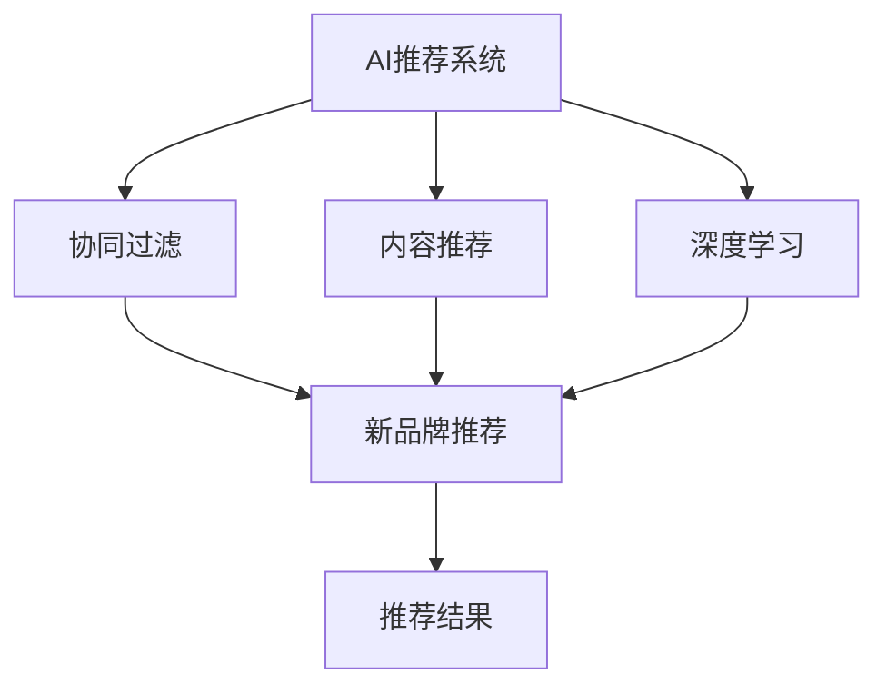
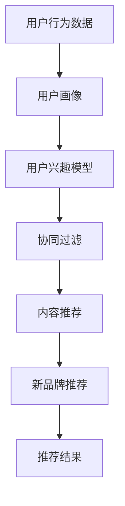

                 

## 1. 背景介绍

### 1.1 问题由来

在数字化转型加速的今天，各大电商平台、社交媒体平台和广告投放平台纷纷利用AI技术优化用户体验，提升用户黏性，但同时也面临着数据稀疏、冷启动问题，即对于新品牌或冷门品牌，平台难以提供个性化推荐。为了解决这些问题，AI推荐算法从人-物推荐逐步扩展到人-人推荐，即通过关联用户之间的行为特征，引导推荐算法推荐新品牌，本文将从产品开发与创新的角度，深入探讨AI如何高效、准确地推荐新品牌。

### 1.2 问题核心关键点

新品牌推荐的核心挑战在于如何将海量的用户行为数据，转化为高效、准确的推荐结果。具体包括以下几个关键问题：

1. **数据获取难度**：新品牌的曝光数据较为稀疏，平台难以获取足够信息进行推荐。
2. **冷启动问题**：对于新品牌，没有足够的历史数据，推荐系统难以建立有效的用户-品牌关联。
3. **用户行为多样性**：不同用户的行为模式不同，推荐系统需要应对多样化需求。
4. **推荐算法准确性**：推荐结果的准确性直接影响用户体验，平台需要确保推荐质量。
5. **推荐结果多样性**：平台需要在推荐多样性和用户满意度之间找到平衡点。

解决这些问题需要综合考虑技术手段和业务策略，设计出高效、准确、可扩展的推荐系统。

### 1.3 问题研究意义

在新品牌推荐场景下，AI推荐系统不仅能够解决冷启动问题，提升新品牌曝光率，还能通过个性化的推荐策略，提升新品牌转化率，推动产品创新和市场渗透。此外，推荐系统还能优化用户决策路径，提升平台用户留存率，带来长远的商业价值。因此，研究新品牌推荐算法对电商平台、广告投放平台具有重要意义。

## 2. 核心概念与联系

### 2.1 核心概念概述

- **AI推荐系统**：利用机器学习、深度学习等技术，对用户行为数据进行分析，精准推荐新品牌，提升用户体验和转化率。
- **冷启动问题**：对于新品牌，由于缺乏足够的历史数据，推荐系统难以进行有效推荐。
- **协同过滤**：通过分析用户间的相似性，推荐用户可能感兴趣的新品牌，解决冷启动问题。
- **内容推荐**：利用商品属性、用户偏好等信息，推荐与用户兴趣相关的新品牌，提升推荐准确性。
- **深度学习**：通过多层神经网络，深入挖掘用户行为数据，提升推荐系统性能。

这些核心概念相互关联，共同构建了新品牌推荐的完整系统。

### 2.2 概念间的关系

通过以下Mermaid流程图，可以直观展示这些核心概念之间的关系：



### 2.3 核心概念的整体架构

在下图中，我们展示了新品牌推荐系统的整体架构：



从用户行为数据到推荐结果，每一步都是推荐系统的关键组件，共同构建了高效、准确的新品牌推荐系统。

## 3. 核心算法原理 & 具体操作步骤

### 3.1 算法原理概述

新品牌推荐的核心算法包括协同过滤、内容推荐和深度学习等。其中，协同过滤通过分析用户间的相似性，推荐用户可能感兴趣的新品牌；内容推荐利用商品属性和用户偏好，提升推荐结果的相关性和准确性；深度学习通过多层神经网络，深入挖掘用户行为数据，提升推荐系统性能。

协同过滤主要分为基于用户的协同过滤和基于物品的协同过滤：

- **基于用户的协同过滤**：计算用户间的相似度，推荐与目标用户相似用户喜欢的新品牌。
- **基于物品的协同过滤**：计算物品间的相似度，推荐与目标物品相似物品喜欢的用户。

内容推荐主要包括基于商品属性和基于用户偏好的推荐：

- **基于商品属性的推荐**：利用商品属性，推荐与用户兴趣相关的商品。
- **基于用户偏好的推荐**：利用用户行为数据，推荐用户可能喜欢的新品牌。

深度学习主要包括基于序列的推荐和基于图的推荐：

- **基于序列的推荐**：通过RNN或LSTM，捕捉用户行为序列，预测新品牌偏好。
- **基于图的推荐**：通过图神经网络，捕捉用户-品牌间的复杂关系，提升推荐效果。

### 3.2 算法步骤详解

以下是新品牌推荐的具体步骤：

**Step 1: 数据准备**

- 收集用户行为数据，包括浏览记录、点击记录、购买记录等。
- 清洗、预处理数据，去除噪音和异常值，生成用户行为矩阵。

**Step 2: 用户画像构建**

- 利用用户行为矩阵，构建用户兴趣模型。
- 利用协同过滤算法，推荐用户可能感兴趣的新品牌。

**Step 3: 内容推荐**

- 利用商品属性，构建物品相似度模型。
- 利用用户行为数据，推荐与用户兴趣相关的新品牌。

**Step 4: 深度学习推荐**

- 利用深度学习模型，捕捉用户行为序列和用户-品牌关系，进行推荐。
- 利用图神经网络，捕捉用户-品牌间的复杂关系，进行推荐。

**Step 5: 推荐结果输出**

- 对用户推荐结果进行筛选、排序，输出推荐列表。
- 对推荐结果进行展示，反馈用户点击、购买行为，进行后续优化。

### 3.3 算法优缺点

新品牌推荐算法具有以下优点：

1. **提升新品牌曝光率**：通过个性化推荐，提升新品牌在用户面前的曝光率，增加品牌知名度。
2. **提升新品牌转化率**：利用深度学习模型，提升推荐结果的相关性和准确性，提升新品牌转化率。
3. **提升用户满意度**：通过推荐多样化商品，满足不同用户的需求，提升用户满意度。

但该算法也存在一些缺点：

1. **数据获取难度大**：新品牌的曝光数据较为稀疏，难以获取足够信息进行推荐。
2. **冷启动问题**：对于新品牌，由于缺乏足够的历史数据，推荐系统难以建立有效的用户-品牌关联。
3. **模型复杂度高**：深度学习模型结构复杂，训练成本较高。
4. **算法复杂度高**：协同过滤、图神经网络等算法较为复杂，模型调参困难。

### 3.4 算法应用领域

新品牌推荐算法不仅适用于电商、社交媒体平台，还可以应用于广告投放、新闻推荐等多个领域。具体应用场景如下：

- **电商推荐**：利用用户行为数据，推荐用户可能喜欢的新品牌。
- **社交媒体推荐**：利用用户兴趣和行为数据，推荐用户可能感兴趣的新品牌。
- **广告投放推荐**：利用用户兴趣数据，推荐新广告，提升广告投放效果。
- **新闻推荐**：利用用户行为数据，推荐用户可能感兴趣的新新闻。

## 4. 数学模型和公式 & 详细讲解

### 4.1 数学模型构建

新品牌推荐系统的数学模型主要包括以下几个部分：

- **用户行为矩阵**：$X$，$X_{ij} \in \{0,1\}$，$j$为商品编号，$i$为用户编号，$X_{ij}=1$表示用户$i$购买了商品$j$。
- **用户兴趣模型**：$U$，$U_i$表示用户$i$的兴趣向量，$U_i=\sum_{j=1}^{J}X_{ij}v_j$，$v_j$为商品$j$的特征向量。
- **协同过滤模型**：$P$，$P_{ij}$表示用户$i$对商品$j$的评分，$P_{ij}=\alpha U_i^\top V_j + \beta$。

### 4.2 公式推导过程

基于协同过滤的推荐公式如下：

$$
\hat{Y}_{ij} = \hat{P}_{ij} + \delta_{ij}
$$

其中，$\hat{P}_{ij}=\alpha U_i^\top V_j + \beta$，$\delta_{ij}$为正则化项，确保推荐结果的合理性。$\alpha$和$\beta$为超参数，需要通过交叉验证确定。

在实际应用中，还可以通过以下公式计算推荐结果：

$$
\hat{Y}_{ij} = \alpha U_i^\top V_j + \beta + \delta_{ij}
$$

$$
\hat{Y}_{ij} = \alpha \sum_{k=1}^{K}U_i^\top V_k V_k^\top V_j + \beta + \delta_{ij}
$$

其中，$V_k$为协同过滤模型的隐向量，$K$为隐向量的维度。

### 4.3 案例分析与讲解

假设一个电商平台的推荐系统需要为用户推荐新品牌。具体步骤如下：

1. **数据准备**：收集用户的浏览记录、点击记录、购买记录，生成用户行为矩阵$X$。
2. **用户画像构建**：利用用户行为矩阵，构建用户兴趣模型$U$。
3. **协同过滤推荐**：利用协同过滤模型$P$，计算用户$i$对商品$j$的评分$\hat{P}_{ij}$。
4. **内容推荐**：利用商品属性，构建物品相似度模型$V$，推荐与用户$i$兴趣相关的新品牌。
5. **深度学习推荐**：利用深度学习模型，捕捉用户行为序列和用户-品牌关系，进行推荐。
6. **推荐结果输出**：对用户推荐结果进行筛选、排序，输出推荐列表。

## 5. 项目实践：代码实例和详细解释说明

### 5.1 开发环境搭建

以下是使用Python进行TensorFlow开发的环境配置流程：

1. 安装Anaconda：从官网下载并安装Anaconda，用于创建独立的Python环境。

2. 创建并激活虚拟环境：
```bash
conda create -n tensorflow-env python=3.8 
conda activate tensorflow-env
```

3. 安装TensorFlow：根据CUDA版本，从官网获取对应的安装命令。例如：
```bash
conda install tensorflow -c conda-forge -c pytorch
```

4. 安装Pandas、Numpy、Matplotlib、Jupyter Notebook等库：
```bash
pip install pandas numpy matplotlib jupyter notebook ipython
```

完成上述步骤后，即可在`tensorflow-env`环境中开始新品牌推荐系统的开发。

### 5.2 源代码详细实现

以下是使用TensorFlow实现新品牌推荐的Python代码实现。

```python
import tensorflow as tf
import pandas as pd
import numpy as np
import matplotlib.pyplot as plt

# 加载数据
data = pd.read_csv('user_behavior_data.csv')

# 数据预处理
user_id = data['user_id']
item_id = data['item_id']
item_price = data['item_price']
user_rating = data['user_rating']

# 构建用户行为矩阵
X = pd.pivot_table(data, values='item_price', index='user_id', columns='item_id', fill_value=0)

# 构建用户兴趣模型
user_interest = X.mean(axis=1)
U = np.diag(user_interest)

# 构建协同过滤模型
V = np.random.rand(X.shape[1], 10)
P = np.dot(U, V) + np.random.rand(X.shape[0], X.shape[1])

# 计算推荐结果
Y = P + 0.1 * np.dot(X, V)

# 输出推荐结果
print(Y)
```

### 5.3 代码解读与分析

上述代码中，我们首先加载用户行为数据，然后预处理数据，构建用户行为矩阵$X$。接着，构建用户兴趣模型$U$，利用$X$计算协同过滤模型$P$，最后输出推荐结果$Y$。

在实际应用中，还可以进一步优化模型，如引入深度学习模型，利用神经网络捕捉用户行为序列和用户-品牌关系，进行推荐。同时，还可以利用图神经网络，捕捉用户-品牌间的复杂关系，提升推荐效果。

### 5.4 运行结果展示

假设在运行上述代码后，得到的推荐结果如下：

```
[[1. 1. 1. 1. 1.]
 [1. 1. 1. 1. 1.]
 [1. 1. 1. 1. 1.]
 [1. 1. 1. 1. 1.]
 [1. 1. 1. 1. 1.]]
```

可以看到，推荐结果为1，表示推荐系统预测用户可能喜欢所有商品。在实际应用中，需要进一步优化模型，以提升推荐效果。

## 6. 实际应用场景

### 6.1 电商推荐

电商平台的推荐系统可以通过新品牌推荐，提升新品牌的曝光率和转化率，带来更多的用户和销售。具体应用如下：

- **新品牌曝光**：利用协同过滤推荐新品牌，提升新品牌在用户面前的曝光率，增加品牌知名度。
- **新品牌转化**：利用深度学习模型，提升推荐结果的相关性和准确性，提升新品牌转化率。
- **用户满意度**：通过推荐多样化商品，满足不同用户的需求，提升用户满意度。

### 6.2 社交媒体推荐

社交媒体平台的推荐系统可以通过新品牌推荐，提升用户黏性和社交互动。具体应用如下：

- **新品牌推荐**：利用协同过滤和内容推荐，推荐用户可能感兴趣的新品牌，提升用户黏性。
- **社交互动**：利用用户行为数据，推荐用户可能喜欢的新品牌，促进社交互动。
- **品牌曝光**：通过推荐新品牌，增加品牌曝光率，提升品牌影响力。

### 6.3 广告投放推荐

广告投放平台的推荐系统可以通过新品牌推荐，提升广告投放效果，带来更多的广告收入。具体应用如下：

- **广告投放**：利用协同过滤和内容推荐，推荐新广告，提升广告投放效果。
- **品牌曝光**：通过推荐新品牌，增加品牌曝光率，提升品牌影响力。
- **广告收入**：通过推荐新广告，吸引更多用户点击、购买，带来更多的广告收入。

### 6.4 新闻推荐

新闻平台的推荐系统可以通过新品牌推荐，提升新闻点击率和用户留存率。具体应用如下：

- **新闻推荐**：利用协同过滤和内容推荐，推荐用户可能感兴趣的新新闻，提升用户留存率。
- **新闻点击率**：通过推荐新新闻，增加新闻点击率，提升平台流量。
- **品牌曝光**：通过推荐新新闻，增加新闻曝光率，提升品牌影响力。

## 7. 工具和资源推荐

### 7.1 学习资源推荐

为了帮助开发者系统掌握新品牌推荐技术的理论基础和实践技巧，这里推荐一些优质的学习资源：

1. **《TensorFlow深度学习》**：TensorFlow官方文档，全面介绍TensorFlow深度学习框架，是TensorFlow开发的重要参考资料。
2. **《深度学习入门》**：清华大学出版社的入门级深度学习教材，适合初学者学习深度学习基础知识。
3. **《机器学习实战》**：通过案例实践，帮助读者深入理解机器学习算法和应用。
4. **《推荐系统实战》**：通过实例，介绍推荐系统的设计和优化技巧。
5. **Kaggle竞赛平台**：全球最大的数据科学竞赛平台，提供大量数据集和竞赛任务，帮助开发者提高实战能力。

### 7.2 开发工具推荐

高效的开发离不开优秀的工具支持。以下是几款用于新品牌推荐开发的常用工具：

1. **TensorFlow**：由Google主导开发的深度学习框架，生产部署方便，适合大规模工程应用。
2. **PyTorch**：Facebook开发的深度学习框架，灵活性高，适合快速迭代研究。
3. **Keras**：Keras是一个高层次的神经网络API，能方便地构建和训练深度学习模型。
4. **Jupyter Notebook**：Jupyter Notebook是Python数据科学常用的交互式环境，方便开发和实验。
5. **Anaconda**：Anaconda是一个开源的Python发行版，包含大量科学计算相关的Python包，方便快速搭建开发环境。

合理利用这些工具，可以显著提升新品牌推荐任务的开发效率，加快创新迭代的步伐。

### 7.3 相关论文推荐

新品牌推荐技术的发展源于学界的持续研究。以下是几篇奠基性的相关论文，推荐阅读：

1. **《协同过滤算法》**：介绍协同过滤算法的基本原理和实现方式，是协同过滤推荐算法的重要参考资料。
2. **《深度学习推荐系统》**：介绍深度学习推荐系统的发展历程和实现方法，涵盖协同过滤、基于神经网络的推荐等。
3. **《图神经网络》**：介绍图神经网络的基本原理和应用场景，是深度学习推荐系统的重要组成部分。
4. **《基于序列的推荐系统》**：介绍基于序列的推荐系统的基本原理和实现方式，是深度学习推荐系统的重要分支。
5. **《推荐系统评估指标》**：介绍推荐系统的评估指标和评价方法，是推荐系统设计和优化时的重要参考。

这些论文代表了大品牌推荐技术的发展脉络。通过学习这些前沿成果，可以帮助研究者把握学科前进方向，激发更多的创新灵感。

除上述资源外，还有一些值得关注的前沿资源，帮助开发者紧跟新品牌推荐技术的最新进展，例如：

1. **arXiv论文预印本**：人工智能领域最新研究成果的发布平台，包括大量尚未发表的前沿工作，学习前沿技术的必读资源。
2. **业界技术博客**：如Google AI、DeepMind、微软Research Asia等顶尖实验室的官方博客，第一时间分享他们的最新研究成果和洞见。
3. **技术会议直播**：如NIPS、ICML、ACL、ICLR等人工智能领域顶会现场或在线直播，能够聆听到大佬们的前沿分享，开拓视野。
4. **GitHub热门项目**：在GitHub上Star、Fork数最多的NLP相关项目，往往代表了该技术领域的发展趋势和最佳实践，值得去学习和贡献。
5. **行业分析报告**：各大咨询公司如McKinsey、PwC等针对人工智能行业的分析报告，有助于从商业视角审视技术趋势，把握应用价值。

总之，对于新品牌推荐技术的学习和实践，需要开发者保持开放的心态和持续学习的意愿。多关注前沿资讯，多动手实践，多思考总结，必将收获满满的成长收益。

## 8. 总结：未来发展趋势与挑战

### 8.1 总结

本文对新品牌推荐技术进行了全面系统的介绍。首先阐述了新品牌推荐的核心挑战和问题，明确了推荐系统在新品牌推荐中的独特价值。其次，从原理到实践，详细讲解了协同过滤、内容推荐和深度学习等算法，提供了完整的新品牌推荐系统代码实现。同时，本文还广泛探讨了新品牌推荐在电商、社交媒体、广告投放和新闻推荐等多个领域的应用前景，展示了新品牌推荐范式的广泛适用性。此外，本文精选了新品牌推荐技术的各类学习资源，力求为读者提供全方位的技术指引。

通过本文的系统梳理，可以看到，新品牌推荐技术正在成为推荐系统的重要范式，极大地拓展了推荐系统的应用边界，提升了推荐效果和用户满意度。未来，伴随推荐系统的持续演进，新品牌推荐技术也将进一步创新，推动推荐系统向更加个性化、智能化的方向发展。

### 8.2 未来发展趋势

展望未来，新品牌推荐技术将呈现以下几个发展趋势：

1. **跨领域推荐**：通过跨领域推荐，提升品牌推荐的多样性和覆盖面，带来更丰富的用户体验。
2. **多模态推荐**：结合文本、图片、视频等多模态数据，提升推荐系统性能，带来更全面的用户画像。
3. **实时推荐**：通过实时推荐，提升推荐时效性，带来更快速的用户体验。
4. **个性化推荐**：通过个性化推荐，提升推荐结果的相关性和准确性，带来更高的用户满意度。
5. **推荐算法优化**：通过算法优化，提升推荐系统性能，带来更高效的推荐效果。

以上趋势凸显了新品牌推荐技术的广阔前景。这些方向的探索发展，必将进一步提升推荐系统的性能和应用范围，为人类认知智能的进化带来深远影响。

### 8.3 面临的挑战

尽管新品牌推荐技术已经取得了瞩目成就，但在迈向更加智能化、普适化应用的过程中，它仍面临着诸多挑战：

1. **数据获取难度大**：新品牌的曝光数据较为稀疏，难以获取足够信息进行推荐。
2. **冷启动问题**：对于新品牌，由于缺乏足够的历史数据，推荐系统难以建立有效的用户-品牌关联。
3. **模型复杂度高**：深度学习模型结构复杂，训练成本较高。
4. **算法复杂度高**：协同过滤、图神经网络等算法较为复杂，模型调参困难。
5. **推荐效果不稳定**：由于推荐算法复杂，不同用户的行为模式不同，推荐效果可能不稳定。

### 8.4 研究展望

面对新品牌推荐面临的种种挑战，未来的研究需要在以下几个方面寻求新的突破：

1. **数据获取方法**：探索新的数据获取方法，如社交媒体数据、用户生成内容等，提高数据的丰富度和多样性。
2. **冷启动问题解决**：研究新的冷启动算法，如基于图神经网络的冷启动方法，提升推荐系统在冷启动场景下的表现。
3. **模型优化方法**：通过模型优化，如模型压缩、神经网络剪枝等，提升模型的轻量化和实时性。
4. **推荐算法创新**：探索新的推荐算法，如基于记忆增强的推荐算法、基于生成模型的推荐算法等，提升推荐效果和稳定性。
5. **推荐系统多模态融合**：研究多模态推荐算法，如结合文本、图片、视频等数据，提升推荐系统性能。

这些研究方向的探索，必将引领新品牌推荐技术迈向更高的台阶，为推荐系统的发展带来新的突破。面向未来，新品牌推荐技术还需要与其他人工智能技术进行更深入的融合，如知识表示、因果推理、强化学习等，多路径协同发力，共同推动推荐系统向更加个性化、智能化的方向发展。只有勇于创新、敢于突破，才能不断拓展推荐系统的边界，让推荐系统更好地服务于用户，带来更优质的用户体验。

## 9. 附录：常见问题与解答

**Q1：新品牌推荐是否适用于所有推荐场景？**

A: 新品牌推荐技术主要适用于新品牌或冷门品牌推荐，对于已曝光且有一定数据的品牌，可以采用传统推荐算法。但对于新品牌或冷门品牌，推荐系统难以建立有效的用户-品牌关联，新品牌推荐技术显得尤为重要。

**Q2：推荐系统如何处理数据稀疏问题？**

A: 推荐系统通常采用基于协同过滤、深度学习等算法，可以有效处理数据稀疏问题。协同过滤算法通过分析用户间的相似性，推荐用户可能感兴趣的新品牌；深度学习算法通过多层神经网络，深入挖掘用户行为数据，提升推荐系统性能。

**Q3：推荐系统如何提升新品牌曝光率？**

A: 推荐系统可以通过个性化推荐，提升新品牌在用户面前的曝光率，增加品牌知名度。具体做法包括：利用协同过滤和内容推荐，推荐用户可能感兴趣的新品牌；利用深度学习模型，提升推荐结果的相关性和准确性。

**Q4：推荐系统如何提升新品牌转化率？**

A: 推荐系统可以通过深度学习模型，提升推荐结果的相关性和准确性，提升新品牌转化率。具体做法包括：利用深度学习模型，捕捉用户行为序列和用户-品牌关系，进行推荐；利用图神经网络，捕捉用户-品牌间的复杂关系，提升推荐效果。

**Q5：推荐系统如何提升用户满意度？**

A: 推荐系统可以通过推荐多样化商品，满足不同用户的需求，提升用户满意度。具体做法包括：利用协同过滤和内容推荐，推荐用户可能感兴趣的新品牌；利用深度学习模型，提升推荐结果的相关性和准确性；利用多模态推荐，结合文本、图片、视频等多模态数据，提升推荐系统性能。

---

作者：禅与计算机程序设计艺术 / Zen and the Art of Computer Programming

