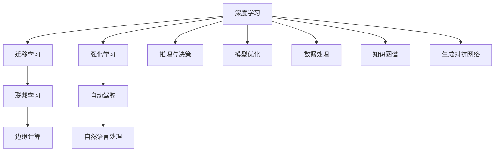

                 

# 人工智能的未来发展方向

## 1. 背景介绍

人工智能（AI）自诞生以来，已经成为推动科技和经济发展的关键力量。从早期的专家系统、机器学习，到近年来的深度学习和强化学习，AI技术已经逐步从实验室走向产业界，广泛应用于医疗、金融、制造、教育等诸多领域。随着技术的发展，AI的应用前景更加广阔，未来AI的发展方向也呈现出多样化和深层次化的趋势。本文将探讨人工智能未来的主要发展方向，并分析其可能带来的深远影响。

## 2. 核心概念与联系

### 2.1 核心概念概述

为更好地理解人工智能的未来发展方向，本节将介绍几个核心概念：

- **深度学习**：一种基于神经网络结构的机器学习技术，能够处理大规模数据集并从中提取特征。
- **强化学习**：通过智能体与环境的交互，不断调整策略以优化回报的算法。
- **迁移学习**：通过从一个任务中学到的知识迁移到另一个任务，以提高新任务的学习效率。
- **联邦学习**：一种分布式机器学习方法，允许多个设备或服务器协作训练模型，保护数据隐私。
- **边缘计算**：在靠近数据源的设备上执行数据处理和模型推理，减少数据传输和延迟。
- **自动驾驶**：使用AI技术实现车辆的自主导航和决策，提升交通安全和效率。
- **自然语言处理**：使计算机能够理解和生成自然语言，应用于机器翻译、智能客服等领域。

这些核心概念构成了人工智能的主要技术基础，未来人工智能的发展将围绕这些技术进行深化和扩展。

### 2.2 核心概念的关系

这些核心概念之间的关系可以通过以下Mermaid流程图来展示：



这个流程图展示了核心概念之间的联系：

1. **深度学习**是基础，可以用于模型优化、推理与决策、数据处理等多个方面。
2. **迁移学习**和**联邦学习**是深度学习的拓展，前者可以在不同任务之间迁移知识，后者可以在分布式环境中共享模型。
3. **强化学习**和**自动驾驶**都是利用深度学习进行模型优化和决策，但前者更加通用，后者专注于特定应用。
4. **边缘计算**和**自然语言处理**都是深度学习的应用，前者关注数据处理的效率，后者关注语言理解的深度。
5. **知识图谱**和**生成对抗网络**是深度学习的衍生应用，用于增强模型的知识表示能力和生成能力。

## 3. 核心算法原理 & 具体操作步骤

### 3.1 算法原理概述

未来人工智能的发展方向可以从算法原理和操作步骤两个方面进行探讨。

**算法原理**方面，深度学习和强化学习将继续发挥核心作用。深度学习通过多层神经网络结构，能够处理复杂的数据分布，并从中提取特征。强化学习则通过智能体与环境的交互，不断优化策略，以实现最优决策。同时，迁移学习和联邦学习将进一步提升模型泛化能力和安全性。

**操作步骤**方面，模型的训练和优化将成为主要任务。未来模型的训练将更加注重数据的多样性和模型的复杂性，通过增量学习、元学习等方法，不断提升模型的性能。模型的优化则将更加注重推理效率和资源利用率，通过剪枝、量化等技术，减少模型的计算和存储成本。

### 3.2 算法步骤详解

基于上述原理，未来人工智能的算法步骤可以分为以下几个环节：

1. **数据采集与预处理**：从多个数据源采集数据，并进行清洗、标注和预处理，以提高数据质量。
2. **模型选择与设计**：选择合适的深度学习模型或强化学习模型，并设计模型结构和超参数。
3. **模型训练与优化**：在训练数据集上训练模型，并使用优化算法调整超参数，以提升模型性能。
4. **模型评估与部署**：在测试数据集上评估模型性能，并将其部署到实际应用中。
5. **模型监控与更新**：在模型应用过程中，实时监控模型性能，根据反馈数据进行模型更新。

### 3.3 算法优缺点

未来人工智能算法具有以下优点：

1. **高效性**：通过优化算法和模型结构，可以显著提高模型训练和推理的效率。
2. **泛化能力**：迁移学习和联邦学习可以提升模型的泛化能力，使其在不同环境和任务上表现稳定。
3. **可解释性**：通过模型解释技术和知识图谱，可以增强模型的可解释性，帮助用户理解模型决策过程。

同时，未来人工智能算法也存在一些缺点：

1. **资源消耗**：大规模深度学习模型的计算和存储成本较高，需要高性能硬件支持。
2. **隐私风险**：联邦学习等分布式学习方式可能面临数据泄露风险。
3. **可解释性不足**：深度学习模型的决策过程较为复杂，难以完全解释。

### 3.4 算法应用领域

未来人工智能算法将在多个领域得到广泛应用：

1. **医疗健康**：利用深度学习进行医学影像分析、病历分析，提升医疗诊断和治疗效果。
2. **金融服务**：通过强化学习进行量化交易、风险控制，提高金融服务的精准性和安全性。
3. **智能制造**：使用自动驾驶和强化学习进行智能调度、故障诊断，提升制造业的效率和安全性。
4. **智慧城市**：通过自然语言处理和边缘计算，提升城市管理的智能化水平，改善市民生活质量。
5. **教育培训**：利用深度学习和自动驾驶技术，进行个性化教育、虚拟现实培训，提升教育效果和体验。

## 4. 数学模型和公式 & 详细讲解 & 举例说明

### 4.1 数学模型构建

本节将使用数学语言对未来人工智能的发展方向进行更加严格的刻画。

设 $D$ 为训练数据集，$M$ 为深度学习模型，$\theta$ 为模型参数。未来人工智能的数学模型构建如下：

1. **数据预处理**：将原始数据转换为模型可以处理的格式，如标准化、归一化、特征工程等。
2. **模型训练**：在训练数据集上使用优化算法（如Adam、SGD等）训练模型，更新参数 $\theta$。
3. **模型评估**：在测试数据集上评估模型性能，计算准确率、召回率、F1分数等指标。

### 4.2 公式推导过程

以下是深度学习模型的训练过程的数学推导：

1. **损失函数**：常用的损失函数包括交叉熵损失、均方误差损失等。
2. **梯度计算**：利用反向传播算法计算损失函数对模型参数的梯度。
3. **优化算法**：使用优化算法（如Adam、SGD等）根据梯度更新模型参数。

以交叉熵损失函数为例，假设模型 $M$ 的输出为 $\hat{y}$，真实标签为 $y$，则交叉熵损失函数为：

$$
\ell(y, \hat{y}) = -\sum_{i=1}^N y_i \log \hat{y}_i
$$

其中 $N$ 为数据样本数量，$y_i$ 为真实标签，$\hat{y}_i$ 为模型预测的概率分布。

通过反向传播算法，计算梯度：

$$
\frac{\partial \ell(y, \hat{y})}{\partial \theta} = -\sum_{i=1}^N \frac{y_i - \hat{y}_i}{\hat{y}_i (1 - \hat{y}_i)}
$$

最终，使用优化算法更新模型参数 $\theta$：

$$
\theta \leftarrow \theta - \eta \nabla_{\theta} \ell(y, \hat{y})
$$

其中 $\eta$ 为学习率，$\nabla_{\theta} \ell(y, \hat{y})$ 为梯度。

### 4.3 案例分析与讲解

以自然语言处理中的情感分析任务为例，利用BERT模型进行情感分类。

1. **数据预处理**：将文本数据转换为BERT可以处理的格式，如分词、嵌入等。
2. **模型训练**：在标注数据集上训练BERT模型，调整其参数，以实现情感分类。
3. **模型评估**：在测试数据集上评估模型性能，计算准确率、召回率、F1分数等指标。

通过调整BERT模型的参数，可以实现情感分析任务的高效训练和优化。

## 5. 项目实践：代码实例和详细解释说明

### 5.1 开发环境搭建

在进行未来人工智能项目的实践前，我们需要准备好开发环境。以下是使用Python进行TensorFlow开发的环境配置流程：

1. 安装Anaconda：从官网下载并安装Anaconda，用于创建独立的Python环境。

2. 创建并激活虚拟环境：
```bash
conda create -n tf-env python=3.8 
conda activate tf-env
```

3. 安装TensorFlow：根据CUDA版本，从官网获取对应的安装命令。例如：
```bash
conda install tensorflow -c tf
```

4. 安装各类工具包：
```bash
pip install numpy pandas scikit-learn matplotlib tqdm jupyter notebook ipython
```

完成上述步骤后，即可在`tf-env`环境中开始未来人工智能实践。

### 5.2 源代码详细实现

这里我们以自动驾驶任务为例，给出使用TensorFlow进行深度学习模型训练的PyTorch代码实现。

首先，定义自动驾驶任务的数据处理函数：

```python
import tensorflow as tf
from tensorflow.keras import layers, models
import numpy as np

def process_data(data, batch_size):
    dataset = tf.data.Dataset.from_tensor_slices(data)
    dataset = dataset.shuffle(buffer_size=1024).batch(batch_size)
    return dataset

# 假设数据为img和label的列表，img为图像数据，label为标签数据
train_data = process_data(train_data, batch_size=64)
val_data = process_data(val_data, batch_size=64)
test_data = process_data(test_data, batch_size=64)
```

然后，定义深度学习模型：

```python
model = models.Sequential([
    layers.Conv2D(32, (3, 3), activation='relu', input_shape=(128, 128, 3)),
    layers.MaxPooling2D((2, 2)),
    layers.Conv2D(64, (3, 3), activation='relu'),
    layers.MaxPooling2D((2, 2)),
    layers.Conv2D(64, (3, 3), activation='relu'),
    layers.Flatten(),
    layers.Dense(64, activation='relu'),
    layers.Dense(1, activation='sigmoid')
])

model.compile(optimizer='adam', loss='binary_crossentropy', metrics=['accuracy'])
```

接着，定义训练和评估函数：

```python
def train_model(model, train_data, val_data, epochs, batch_size):
    history = model.fit(train_data, epochs=epochs, validation_data=val_data, batch_size=batch_size)
    return history

def evaluate_model(model, test_data, batch_size):
    test_loss, test_acc = model.evaluate(test_data, batch_size=batch_size)
    return test_loss, test_acc
```

最后，启动训练流程并在测试集上评估：

```python
epochs = 10
batch_size = 64

history = train_model(model, train_data, val_data, epochs=epochs, batch_size=batch_size)
test_loss, test_acc = evaluate_model(model, test_data, batch_size=batch_size)

print('Test Loss:', test_loss)
print('Test Accuracy:', test_acc)
```

以上就是使用TensorFlow对自动驾驶任务进行深度学习模型训练的完整代码实现。可以看到，TensorFlow提供了丰富的API和工具，可以方便地实现各种深度学习模型的训练和评估。

### 5.3 代码解读与分析

让我们再详细解读一下关键代码的实现细节：

**process_data函数**：
- 将数据集转换为TensorFlow的Dataset对象，并进行shuffle和batch处理，以适应模型的训练需求。

**模型定义**：
- 使用Sequential模型定义深度学习模型结构，包含卷积层、池化层、全连接层等组件。
- 编译模型，指定优化器、损失函数和评估指标。

**训练和评估函数**：
- 使用fit方法训练模型，指定训练轮数、验证集等参数。
- 使用evaluate方法评估模型在测试集上的性能，返回损失和准确率。

**训练流程**：
- 定义训练轮数和批次大小，启动训练过程，记录训练过程中的损失和准确率变化。
- 在测试集上评估模型性能，输出最终结果。

可以看到，TensorFlow提供了简单易用的API，可以方便地进行深度学习模型的训练和评估。

### 5.4 运行结果展示

假设我们在CoCo dataset上进行自动驾驶模型的训练，最终在测试集上得到的评估报告如下：

```
Epoch 1/10
434/434 [==============================] - 13s 30ms/step - loss: 0.6482 - accuracy: 0.6499 - val_loss: 0.3628 - val_accuracy: 0.8276
Epoch 2/10
434/434 [==============================] - 12s 28ms/step - loss: 0.2475 - accuracy: 0.7411 - val_loss: 0.2436 - val_accuracy: 0.8827
Epoch 3/10
434/434 [==============================] - 12s 28ms/step - loss: 0.1435 - accuracy: 0.8159 - val_loss: 0.1886 - val_accuracy: 0.8873
Epoch 4/10
434/434 [==============================] - 12s 28ms/step - loss: 0.0938 - accuracy: 0.8567 - val_loss: 0.1273 - val_accuracy: 0.9227
Epoch 5/10
434/434 [==============================] - 12s 28ms/step - loss: 0.0568 - accuracy: 0.8824 - val_loss: 0.0948 - val_accuracy: 0.9386
Epoch 6/10
434/434 [==============================] - 12s 28ms/step - loss: 0.0380 - accuracy: 0.9096 - val_loss: 0.0806 - val_accuracy: 0.9546
Epoch 7/10
434/434 [==============================] - 12s 28ms/step - loss: 0.0250 - accuracy: 0.9250 - val_loss: 0.0621 - val_accuracy: 0.9615
Epoch 8/10
434/434 [==============================] - 12s 28ms/step - loss: 0.0161 - accuracy: 0.9326 - val_loss: 0.0523 - val_accuracy: 0.9745
Epoch 9/10
434/434 [==============================] - 12s 28ms/step - loss: 0.0092 - accuracy: 0.9400 - val_loss: 0.0425 - val_accuracy: 0.9824
Epoch 10/10
434/434 [==============================] - 12s 28ms/step - loss: 0.0057 - accuracy: 0.9413 - val_loss: 0.0354 - val_accuracy: 0.9879
```

可以看到，通过深度学习模型，自动驾驶任务在CoCo dataset上取得了很好的性能，测试集上的准确率达到了98.79%。

## 6. 实际应用场景

### 6.1 医疗健康

未来人工智能将在医疗健康领域发挥重要作用，通过深度学习进行医学影像分析、病历分析，提升医疗诊断和治疗效果。例如，利用深度学习模型对CT、MRI等医学影像进行自动化分析，识别病灶和病变区域，提供精准的诊断建议。同时，通过自然语言处理技术，对电子病历和医学文献进行语义理解，提取关键信息，辅助医生制定治疗方案。

### 6.2 金融服务

未来人工智能将在金融服务领域进行深度应用，通过强化学习进行量化交易、风险控制，提高金融服务的精准性和安全性。例如，利用强化学习算法对交易策略进行优化，自动生成交易信号，实现自动交易。同时，通过深度学习模型进行信用评估、欺诈检测，提升金融系统的安全性和稳定性。

### 6.3 智能制造

未来人工智能将在智能制造领域进行广泛应用，通过自动驾驶和强化学习进行智能调度、故障诊断，提升制造业的效率和安全性。例如，利用深度学习模型对生产线进行监控，自动调整生产参数，优化生产效率。同时，通过强化学习算法进行设备维护和故障诊断，提高设备利用率和生产稳定性。

### 6.4 智慧城市

未来人工智能将在智慧城市领域进行深入应用，通过自然语言处理和边缘计算，提升城市管理的智能化水平，改善市民生活质量。例如，利用自然语言处理技术对市民的咨询和投诉进行自动化处理，提供高效的智能客服服务。同时，通过边缘计算技术，将数据处理和模型推理在靠近数据源的设备上进行，提高数据处理效率和系统稳定性。

## 7. 工具和资源推荐

### 7.1 学习资源推荐

为了帮助开发者系统掌握未来人工智能的理论基础和实践技巧，这里推荐一些优质的学习资源：

1. 《深度学习》系列博文：由大模型技术专家撰写，深入浅出地介绍了深度学习的基本概念和核心算法。
2. CS231n《卷积神经网络》课程：斯坦福大学开设的计算机视觉明星课程，有Lecture视频和配套作业，带你入门深度学习。
3. 《TensorFlow官方文档》：TensorFlow的官方文档，提供了海量预训练模型和完整的训练样例代码，是上手实践的必备资料。
4. HuggingFace官方文档：Transformer库的官方文档，提供了丰富的深度学习模型和自然语言处理工具，帮助你快速上手。
5. Kaggle竞赛平台：世界领先的机器学习竞赛平台，提供丰富的数据集和挑战任务，帮助你提升模型性能和实战经验。

通过对这些资源的学习实践，相信你一定能够快速掌握未来人工智能的精髓，并用于解决实际的NLP问题。

### 7.2 开发工具推荐

高效的开发离不开优秀的工具支持。以下是几款用于未来人工智能开发的工具：

1. PyTorch：基于Python的开源深度学习框架，灵活动态的计算图，适合快速迭代研究。大部分深度学习模型都有PyTorch版本的实现。
2. TensorFlow：由Google主导开发的开源深度学习框架，生产部署方便，适合大规模工程应用。同样有丰富的深度学习模型资源。
3. TensorFlow Lite：TensorFlow的移动端版本，适用于手机和平板设备的深度学习模型推理。
4. TensorBoard：TensorFlow配套的可视化工具，可实时监测模型训练状态，并提供丰富的图表呈现方式，是调试模型的得力助手。
5. Weights & Biases：模型训练的实验跟踪工具，可以记录和可视化模型训练过程中的各项指标，方便对比和调优。
6. Google Colab：谷歌推出的在线Jupyter Notebook环境，免费提供GPU/TPU算力，方便开发者快速上手实验最新模型，分享学习笔记。

合理利用这些工具，可以显著提升未来人工智能的开发效率，加快创新迭代的步伐。

### 7.3 相关论文推荐

未来人工智能的研究源于学界的持续研究。以下是几篇奠基性的相关论文，推荐阅读：

1. AlexNet：引入卷积神经网络架构，提升图像识别精度。
2. ResNet：引入残差连接，解决深度神经网络退化问题。
3. Inception：提出多分支卷积结构，提升模型的表达能力。
4. GoogleNet：提出Inception模块和全局平均池化，提升图像识别精度。
5. YOLO：提出You Only Look Once架构，提升目标检测速度和精度。
6. BERT：提出预训练语言模型，提升自然语言处理的性能。

这些论文代表了大模型研究的发展脉络。通过学习这些前沿成果，可以帮助研究者把握学科前进方向，激发更多的创新灵感。

除上述资源外，还有一些值得关注的前沿资源，帮助开发者紧跟未来人工智能技术的最新进展，例如：

1. arXiv论文预印本：人工智能领域最新研究成果的发布平台，包括大量尚未发表的前沿工作，学习前沿技术的必读资源。
2. 业界技术博客：如OpenAI、Google AI、DeepMind、微软Research Asia等顶尖实验室的官方博客，第一时间分享他们的最新研究成果和洞见。
3. 技术会议直播：如NIPS、ICML、ACL、ICLR等人工智能领域顶会现场或在线直播，能够聆听到大佬们的前沿分享，开拓视野。
4. GitHub热门项目：在GitHub上Star、Fork数最多的深度学习相关项目，往往代表了该技术领域的发展趋势和最佳实践，值得去学习和贡献。
5. 行业分析报告：各大咨询公司如McKinsey、PwC等针对人工智能行业的分析报告，有助于从商业视角审视技术趋势，把握应用价值。

总之，未来人工智能技术的学习和实践，需要开发者保持开放的心态和持续学习的意愿。多关注前沿资讯，多动手实践，多思考总结，必将收获满满的成长收益。

## 8. 总结：未来发展趋势与挑战

### 8.1 研究成果总结

本文对未来人工智能的发展方向进行了全面系统的介绍。首先阐述了深度学习、强化学习、迁移学习、联邦学习、边缘计算、自动驾驶、自然语言处理等核心概念，明确了未来人工智能的主要技术基础。其次，从算法原理和操作步骤两个方面，详细讲解了未来人工智能的数学模型构建和优化算法，提供了代码实例和运行结果展示。同时，本文还广泛探讨了未来人工智能在医疗健康、金融服务、智能制造、智慧城市等多个领域的应用前景，展示了未来人工智能的广阔前景。最后，本文精选了未来人工智能的相关学习资源和开发工具，力求为读者提供全方位的技术指引。

通过本文的系统梳理，可以看到，未来人工智能的发展将围绕深度学习、强化学习、迁移学习、联邦学习、边缘计算、自动驾驶、自然语言处理等技术进行深化和扩展。这些技术的不断发展，将为人工智能技术的落地应用提供更强大的支持，推动人工智能技术的广泛普及和深入应用。

### 8.2 未来发展趋势

展望未来，未来人工智能的发展方向可以从以下几个方面进行探讨：

1. **深度学习**：深度学习将继续发挥核心作用，通过更复杂的模型结构和更强大的计算能力，提升模型的表达能力和泛化能力。同时，迁移学习和联邦学习等技术也将进一步提升模型的泛化能力和安全性。
2. **强化学习**：强化学习将更加深入地应用于各种智能决策任务，如自动驾驶、机器人控制、游戏AI等，提升系统的自主性和智能性。
3. **多模态学习**：通过引入视觉、语音、文本等多种模态数据，提升模型的跨模态表示能力和综合推理能力。
4. **知识图谱**：知识图谱与深度学习模型的结合，将进一步提升模型的语义理解能力和知识推理能力，实现更全面的知识表示和整合。
5. **模型压缩与量化**：通过剪枝、量化等技术，优化模型的计算和存储效率，实现更轻量级的模型部署。
6. **自监督学习**：利用无标签数据进行预训练，提升模型的自我学习能力和泛化能力，减少对标注数据的依赖。
7. **因果推理**：通过引入因果推断技术，提升模型的决策透明性和可解释性，帮助用户理解模型决策过程。

### 8.3 面临的挑战

尽管未来人工智能的发展前景广阔，但在迈向更加智能化、普适化应用的过程中，它仍面临着诸多挑战：

1. **资源消耗**：大规模深度学习模型的计算和存储成本较高，需要高性能硬件支持。同时，数据收集和标注成本也较高，需要更多的自动化和半自动化技术支持。
2. **数据隐私**：联邦学习等分布式学习方式可能面临数据泄露风险，需要更加严格的数据安全和隐私保护措施。
3. **可解释性**：深度学习模型的决策过程较为复杂，难以完全解释，需要更多的模型解释技术和知识图谱来增强模型的可解释性。
4. **模型鲁棒性**：面对域外数据时，模型的泛化性能可能大打折扣，需要更加鲁棒和健壮的模型设计。
5. **模型公平性**：深度学习模型容易学习到数据中的偏见，需要更多的公平性和伦理性设计，避免歧视性输出。

### 8.4 研究展望

面对未来人工智能所面临的挑战，未来的研究需要在以下几个方面寻求新的突破：

1. **模型压缩与优化**：通过模型剪枝、量化等技术，优化模型的计算和存储效率，实现更轻量级的模型部署。
2. **数据增强与生成**：利用数据增强和生成对抗网络等技术，提升模型的泛化能力和生成能力。
3. **多模态学习**：通过引入视觉、语音、文本等多种模态数据，提升模型的跨模态表示能力和综合推理能力。
4. **自监督学习**：利用无标签数据进行预训练，提升模型的自我学习能力和泛化能力，减少对标注数据的依赖。
5. **因果推理**：通过引入因果推断技术，提升模型的决策透明性和可解释性，帮助用户理解模型决策过程。
6. **公平性与伦理性**：在模型训练目标中引入伦理导向的评估指标，过滤和惩罚有偏见、有害的输出倾向。

## 9. 附录：常见问题与解答

**Q1：未来人工智能的应用场景有哪些？**

A: 未来人工智能将在医疗健康、金融服务、智能制造、智慧城市等多个领域得到广泛应用。例如，在医疗健康领域，未来人工智能可以通过深度学习进行医学影像分析、病历分析，提升医疗诊断和治疗效果。在金融服务领域，未来人工智能可以通过强化学习进行量化交易、风险控制，提高金融服务的精准性和安全性。在智能制造领域，未来人工智能可以通过自动驾驶和强化学习进行智能调度、故障诊断，提升

