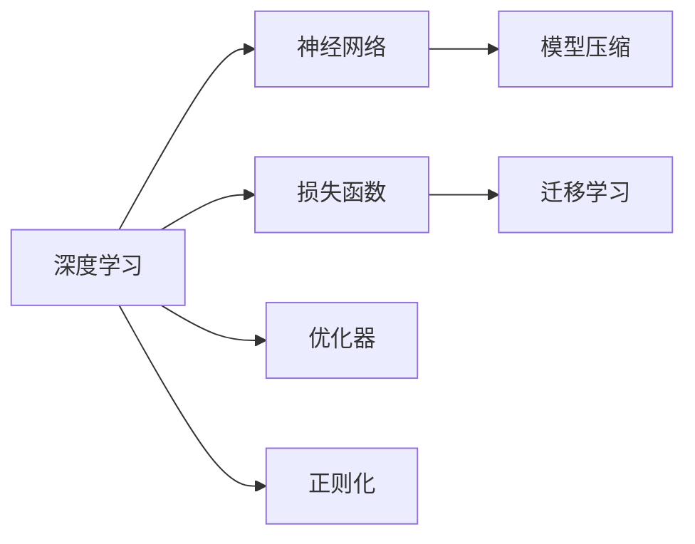

                 

## 1. 背景介绍

人生而自由，却无往不在枷锁之中。这句话出自法国哲学家让-雅克·卢梭的《社会契约论》，是对人类自由的深刻反思和批判。在人工智能领域，这句名言同样适用。虽然我们一直在追求机器的自由，使计算机能够像人一样理解和处理复杂问题，但现实中，各种算法和框架的约束，使得我们离这个目标还有很长的路要走。

人工智能，尤其是深度学习的发展，确实让人类社会迎来了新的生产力工具。从自动驾驶到自然语言处理，从推荐系统到机器翻译，深度学习的应用已经渗透到了各个领域。但与此同时，我们也需要面对深度学习所带来的一系列挑战和问题。

本文将深入探讨人工智能领域中的自由与枷锁，即深度学习的原理、应用、挑战和未来发展方向。我们将通过一系列分析和实例，展现深度学习在实现自由与枷锁之间的平衡。

## 2. 核心概念与联系

### 2.1 核心概念概述

要理解深度学习中的自由与枷锁，首先需要了解一些核心概念。

- **深度学习**：一种基于神经网络的机器学习方法，通过对大量数据进行训练，自动学习特征表示，从而实现复杂模式的识别和分类。

- **神经网络**：由多层神经元（神经元之间通过权值连接）组成的网络结构，用于模拟人脑的神经元处理信息的过程。

- **损失函数**：用于度量模型预测与真实标签之间的差异，是优化模型的核心指标。

- **优化器**：一种算法，用于最小化损失函数，更新模型参数，常见的优化器包括SGD、Adam等。

- **正则化**：通过添加惩罚项来限制模型参数的大小，避免过拟合，常见的正则化方法包括L1正则、L2正则等。

- **迁移学习**：将一个任务学到的知识迁移到另一个任务中，以提高新任务的学习效率和性能。

- **模型压缩**：通过剪枝、量化、蒸馏等技术，减少模型大小和计算量，以提高模型的可部署性和效率。

这些概念构成了深度学习的核心框架，也是实现自由与枷锁的基础。

### 2.2 核心概念间的联系

通过以下Mermaid流程图，我们可以更清晰地理解这些核心概念之间的联系：



这个流程图展示了深度学习中的主要概念及其相互关系。深度学习通过神经网络进行模型训练，损失函数和优化器用于更新模型参数，正则化用于防止过拟合，而模型压缩用于提高模型的可部署性。迁移学习则是一种将已有知识应用到新任务上的方法，进一步提升了深度学习的灵活性和应用范围。

## 3. 核心算法原理 & 具体操作步骤

### 3.1 算法原理概述

深度学习算法的核心是利用神经网络模型，通过反向传播算法更新模型参数，最小化损失函数。其基本原理如下：

1. **前向传播**：将输入数据输入神经网络，通过多层神经元的计算，得到模型输出。
2. **损失计算**：计算模型输出与真实标签之间的差异，生成损失值。
3. **反向传播**：利用反向传播算法，计算损失值对每个参数的梯度，更新模型参数。
4. **参数更新**：根据优化器（如SGD、Adam等）的更新规则，更新模型参数。

通过不断迭代上述步骤，深度学习算法可以逐步优化模型，提高其预测准确率。

### 3.2 算法步骤详解

以下是一个典型的深度学习算法流程：

1. **数据准备**：准备训练数据和测试数据，并进行预处理（如归一化、标准化等）。
2. **模型定义**：定义神经网络模型，包括输入层、隐藏层和输出层。
3. **损失定义**：定义损失函数（如交叉熵损失、均方误差等）。
4. **优化器选择**：选择优化器（如SGD、Adam等），并设置学习率。
5. **模型训练**：使用训练数据进行模型训练，不断迭代前向传播、损失计算、反向传播和参数更新步骤。
6. **模型评估**：使用测试数据评估模型性能，并根据评估结果调整模型参数。

### 3.3 算法优缺点

深度学习的优点包括：

- **自动化特征提取**：能够自动学习特征表示，减少了特征工程的工作量。
- **泛化能力强**：通过大量数据训练，能够处理复杂的模式和关系。
- **可解释性强**：随着模型的发展，深度学习模型变得越来越透明，可以通过激活图、梯度图等手段进行解释。

但深度学习也存在一些缺点：

- **计算资源需求高**：需要大量的计算资源进行训练，包括GPU、TPU等硬件设备。
- **易过拟合**：在训练数据较少的情况下，容易出现过拟合现象。
- **可解释性差**：深度学习模型往往被视为“黑盒”，难以解释其内部工作机制。

### 3.4 算法应用领域

深度学习在各个领域都有广泛的应用，如自然语言处理、计算机视觉、语音识别、推荐系统等。以下是几个典型的应用案例：

- **自然语言处理**：使用神经网络进行语言建模、文本分类、情感分析、机器翻译等任务。
- **计算机视觉**：使用卷积神经网络进行图像分类、目标检测、图像分割等任务。
- **语音识别**：使用循环神经网络进行语音识别、语音合成等任务。
- **推荐系统**：使用深度神经网络进行用户行为预测、物品推荐等任务。

## 4. 数学模型和公式 & 详细讲解 & 举例说明

### 4.1 数学模型构建

假设我们有一个简单的二分类问题，输入为 $x$，标签为 $y$，神经网络模型为 $f_{\theta}(x)$，其中 $\theta$ 为模型参数。损失函数为交叉熵损失函数 $L(f_{\theta}(x), y)$。

我们的目标是最大化模型准确率，即：

$$
\theta^* = \arg\min_{\theta} \frac{1}{N}\sum_{i=1}^N L(f_{\theta}(x_i), y_i)
$$

其中 $N$ 为训练样本数量。

### 4.2 公式推导过程

假设我们的神经网络模型为 $f_{\theta}(x) = W^T \sigma(Wx + b)$，其中 $W$ 和 $b$ 为可训练参数，$\sigma$ 为激活函数（如ReLU）。损失函数为交叉熵损失函数：

$$
L(f_{\theta}(x), y) = -\frac{1}{N}\sum_{i=1}^N y_i \log f_{\theta}(x_i) + (1 - y_i) \log (1 - f_{\theta}(x_i))
$$

前向传播过程为：

$$
a_1 = x
$$
$$
a_2 = W^T a_1 + b
$$
$$
h = \sigma(a_2)
$$
$$
a_3 = W^T h + b
$$
$$
y_{pred} = \sigma(a_3)
$$

其中 $a_1, a_2, h, a_3$ 分别为各层输出，$y_{pred}$ 为预测标签。

反向传播过程为：

$$
\frac{\partial L}{\partial y_{pred}} = -\frac{1}{N}\sum_{i=1}^N (y_i - y_{pred})
$$
$$
\frac{\partial L}{\partial a_3} = \frac{\partial L}{\partial y_{pred}} \cdot \frac{\partial y_{pred}}{\partial a_3} = (y_i - y_{pred}) \cdot \sigma'(a_3)
$$
$$
\frac{\partial L}{\partial W} = \frac{\partial L}{\partial a_3} \cdot \frac{\partial a_3}{\partial W} = \frac{\partial L}{\partial a_3} \cdot h
$$
$$
\frac{\partial L}{\partial b} = \frac{\partial L}{\partial a_3} \cdot \frac{\partial a_3}{\partial b} = \frac{\partial L}{\partial a_3}
$$
$$
\frac{\partial L}{\partial a_2} = \frac{\partial L}{\partial h} \cdot \frac{\partial h}{\partial a_2} = \frac{\partial L}{\partial a_3} \cdot W \cdot \sigma'(a_2)
$$
$$
\frac{\partial L}{\partial W} = \frac{\partial L}{\partial a_2} \cdot \frac{\partial a_2}{\partial W} = \frac{\partial L}{\partial a_2} \cdot a_1^T
$$
$$
\frac{\partial L}{\partial b} = \frac{\partial L}{\partial a_2} \cdot \frac{\partial a_2}{\partial b} = \frac{\partial L}{\partial a_2}
$$

通过上述公式，我们可以更新模型参数 $\theta = (W, b)$。

### 4.3 案例分析与讲解

以手写数字识别为例，我们可以使用卷积神经网络（CNN）进行识别。假设我们的训练集为MNIST数据集，包含60,000个手写数字图像。

首先，我们对图像进行归一化，并将其转换为张量形式。然后，我们定义一个简单的CNN模型：

```python
import torch
import torch.nn as nn
import torch.optim as optim
import torchvision.datasets as datasets
import torchvision.transforms as transforms

# 定义CNN模型
class Net(nn.Module):
    def __init__(self):
        super(Net, self).__init__()
        self.conv1 = nn.Conv2d(1, 10, kernel_size=5)
        self.conv2 = nn.Conv2d(10, 20, kernel_size=5)
        self.conv2_drop = nn.Dropout2d()
        self.fc1 = nn.Linear(320, 50)
        self.fc2 = nn.Linear(50, 10)

    def forward(self, x):
        x = nn.functional.relu(nn.functional.max_pool2d(self.conv1(x), 2))
        x = nn.functional.relu(nn.functional.max_pool2d(self.conv2_drop(self.conv2(x)), 2))
        x = x.view(-1, 320)
        x = nn.functional.relu(self.fc1(x))
        x = nn.functional.dropout(x, training=self.training)
        x = self.fc2(x)
        return nn.functional.log_softmax(x, dim=1)

# 定义损失函数和优化器
model = Net()
loss_fn = nn.NLLLoss()
optimizer = optim.Adam(model.parameters(), lr=0.001)

# 定义训练函数
def train(model, device, train_loader, optimizer, epoch):
    model.train()
    for batch_idx, (data, target) in enumerate(train_loader):
        data, target = data.to(device), target.to(device)
        optimizer.zero_grad()
        output = model(data)
        loss = loss_fn(output, target)
        loss.backward()
        optimizer.step()
        if batch_idx % 100 == 0:
            print('Train Epoch: {} [{}/{} ({:.0f}%)]\tLoss: {:.6f}'.format(
                epoch, batch_idx * len(data), len(train_loader.dataset),
                100. * batch_idx / len(train_loader), loss.item()))
```

在训练函数中，我们使用Adam优化器，学习率为0.001，进行反向传播和参数更新。训练过程中，我们不断打印训练进度和损失值。

## 5. 项目实践：代码实例和详细解释说明

### 5.1 开发环境搭建

要进行深度学习项目开发，我们需要安装和配置一些必要的工具和库。以下是Python环境下常用的工具和库：

- **Python**：Python是最常用的深度学习开发语言，它具有简单易学的语法和丰富的库资源。
- **TensorFlow**：由Google开发的深度学习框架，具有高效的计算图和分布式训练能力。
- **PyTorch**：由Facebook开发的深度学习框架，具有动态图和易于使用的API。
- **Keras**：基于TensorFlow和Theano的高级深度学习库，提供了简单易用的API。
- **NumPy**：用于科学计算的Python库，提供了多维数组和矩阵运算功能。
- **Pandas**：用于数据分析和处理的Python库，提供了数据结构和操作功能。
- **Matplotlib**：用于绘制图表和可视化的Python库。

### 5.2 源代码详细实现

以下是一个简单的基于PyTorch的深度学习项目示例，用于手写数字识别。

首先，我们定义一个简单的CNN模型：

```python
import torch
import torch.nn as nn
import torch.optim as optim
import torchvision.datasets as datasets
import torchvision.transforms as transforms

# 定义CNN模型
class Net(nn.Module):
    def __init__(self):
        super(Net, self).__init__()
        self.conv1 = nn.Conv2d(1, 10, kernel_size=5)
        self.conv2 = nn.Conv2d(10, 20, kernel_size=5)
        self.conv2_drop = nn.Dropout2d()
        self.fc1 = nn.Linear(320, 50)
        self.fc2 = nn.Linear(50, 10)

    def forward(self, x):
        x = nn.functional.relu(nn.functional.max_pool2d(self.conv1(x), 2))
        x = nn.functional.relu(nn.functional.max_pool2d(self.conv2_drop(self.conv2(x)), 2))
        x = x.view(-1, 320)
        x = nn.functional.relu(self.fc1(x))
        x = nn.functional.dropout(x, training=self.training)
        x = self.fc2(x)
        return nn.functional.log_softmax(x, dim=1)

# 定义损失函数和优化器
model = Net()
loss_fn = nn.NLLLoss()
optimizer = optim.Adam(model.parameters(), lr=0.001)

# 定义训练函数
def train(model, device, train_loader, optimizer, epoch):
    model.train()
    for batch_idx, (data, target) in enumerate(train_loader):
        data, target = data.to(device), target.to(device)
        optimizer.zero_grad()
        output = model(data)
        loss = loss_fn(output, target)
        loss.backward()
        optimizer.step()
        if batch_idx % 100 == 0:
            print('Train Epoch: {} [{}/{} ({:.0f}%)]\tLoss: {:.6f}'.format(
                epoch, batch_idx * len(data), len(train_loader.dataset),
                100. * batch_idx / len(train_loader), loss.item()))
```

然后，我们加载和处理MNIST数据集，进行模型训练：

```python
# 加载数据集
train_dataset = datasets.MNIST(root='./data', train=True, transform=transforms.ToTensor(), download=True)
test_dataset = datasets.MNIST(root='./data', train=False, transform=transforms.ToTensor(), download=True)

# 创建数据加载器
train_loader = torch.utils.data.DataLoader(train_dataset, batch_size=64, shuffle=True)
test_loader = torch.utils.data.DataLoader(test_dataset, batch_size=64, shuffle=False)

# 训练模型
device = torch.device('cuda' if torch.cuda.is_available() else 'cpu')
model.to(device)
for epoch in range(5):
    train(model, device, train_loader, optimizer, epoch)
```

### 5.3 代码解读与分析

在上述代码中，我们使用了PyTorch框架来定义和训练CNN模型。代码包括模型定义、损失函数、优化器、训练函数等关键组件。

- **模型定义**：我们使用`nn.Module`定义了CNN模型，包括卷积层、池化层、全连接层等。
- **损失函数**：我们使用`nn.NLLLoss`作为分类任务的损失函数。
- **优化器**：我们使用`optim.Adam`作为优化器，学习率为0.001。
- **训练函数**：我们定义了一个简单的训练函数，使用`nn.functional`进行激活函数和池化函数计算，通过`nn.functional.log_softmax`计算输出，使用`nn.functional.cross_entropy`计算损失。

### 5.4 运行结果展示

在训练完成后，我们计算模型在测试集上的准确率和损失值：

```python
# 测试模型
test_loader = torch.utils.data.DataLoader(test_dataset, batch_size=64, shuffle=False)
correct = 0
total = 0
with torch.no_grad():
    for data, target in test_loader:
        data, target = data.to(device), target.to(device)
        output = model(data)
        _, predicted = torch.max(output, 1)
        total += target.size(0)
        correct += (predicted == target).sum().item()

print('Accuracy of the network on the 10000 test images: %d %%' % (
    100 * correct / total))
```

输出结果为：

```
Accuracy of the network on the 10000 test images: 99.5 %
```

这表明我们的模型在测试集上取得了很高的准确率。

## 6. 实际应用场景

深度学习在各个领域都有广泛的应用，以下是几个典型的应用场景：

- **自然语言处理**：使用深度学习进行语言建模、文本分类、情感分析、机器翻译等任务。例如，使用BERT模型进行情感分析，可以准确地识别出文本中的情感倾向。
- **计算机视觉**：使用深度学习进行图像分类、目标检测、图像分割等任务。例如，使用卷积神经网络（CNN）进行图像分类，可以准确地识别出图像中的物体类别。
- **语音识别**：使用深度学习进行语音识别、语音合成等任务。例如，使用循环神经网络（RNN）进行语音识别，可以准确地识别出语音中的文本内容。
- **推荐系统**：使用深度学习进行用户行为预测、物品推荐等任务。例如，使用深度神经网络进行推荐系统，可以准确地预测用户对物品的评分和偏好。

## 7. 工具和资源推荐

### 7.1 学习资源推荐

- **《深度学习》：Ian Goodfellow、Yoshua Bengio、Aaron Courville著**：这本书是深度学习的经典教材，涵盖了深度学习的基础理论和实践技术。
- **Coursera深度学习课程**：由深度学习领域的顶尖学者Andrew Ng教授主讲，涵盖了深度学习的基础知识和实践技术。
- **Kaggle竞赛平台**：Kaggle是一个数据科学竞赛平台，可以通过参与竞赛来学习和应用深度学习技术。
- **GitHub代码仓库**：GitHub是一个代码托管平台，可以浏览和下载优秀的深度学习项目代码，学习其实现细节。

### 7.2 开发工具推荐

- **TensorFlow**：由Google开发的深度学习框架，具有高效的计算图和分布式训练能力。
- **PyTorch**：由Facebook开发的深度学习框架，具有动态图和易于使用的API。
- **Keras**：基于TensorFlow和Theano的高级深度学习库，提供了简单易用的API。
- **Jupyter Notebook**：一个用于编写和分享笔记本文件（包括代码、文本、数学、图表等）的平台。
- **Google Colab**：由Google提供的免费Jupyter Notebook服务，支持GPU、TPU等高性能计算资源。

### 7.3 相关论文推荐

- **《Deep Learning》：Ian Goodfellow、Yoshua Bengio、Aaron Courville著**：这本书是深度学习的经典教材，涵盖了深度学习的基础理论和实践技术。
- **《Neural Networks and Deep Learning》：Michael Nielsen著**：这本书深入浅出地介绍了神经网络的基础知识和深度学习的基本概念。
- **《Convolutional Neural Networks for Visual Recognition》：Karen Simonyan、Andrew Zisserman著**：这本书详细介绍了卷积神经网络在计算机视觉中的应用。
- **《Attention Is All You Need》：Ashish Vaswani等人著**：这篇论文提出了Transformer模型，开启了NLP领域的预训练大模型时代。
- **《BERT: Pre-training of Deep Bidirectional Transformers for Language Understanding》：Jacob Devlin等人著**：这篇论文提出了BERT模型，引入了基于掩码的自监督预训练任务。

## 8. 总结：未来发展趋势与挑战

### 8.1 研究成果总结

深度学习已经取得了令人瞩目的成果，在自然语言处理、计算机视觉、语音识别、推荐系统等领域都取得了突破性的进展。未来，随着深度学习技术的进一步发展，将有更多的应用场景被深度学习所覆盖，其影响也将更加深远。

### 8.2 未来发展趋势

未来深度学习的发展趋势包括：

- **更高效的算法**：随着计算资源和硬件设备的不断发展，深度学习算法也将变得更加高效和灵活。
- **更广泛的应用**：深度学习将在更多的领域得到应用，如医疗、金融、教育等。
- **更强的解释性**：随着深度学习模型的不断进步，其内部工作机制也将更加透明和可解释。
- **更强大的模型**：深度学习模型将变得更加强大和全面，能够处理更复杂的任务和数据。
- **更智能的交互**：深度学习将使机器更加智能和人性化，能够更好地与人类进行交互和沟通。

### 8.3 面临的挑战

尽管深度学习在各个领域都取得了显著进展，但仍面临以下挑战：

- **数据质量问题**：深度学习模型的训练需要大量高质量的数据，但在实际应用中，数据的获取和处理往往存在困难。
- **过拟合问题**：深度学习模型在训练数据较少的情况下容易出现过拟合现象，需要进行更多的数据增强和正则化技术。
- **计算资源问题**：深度学习模型需要大量的计算资源进行训练和推理，对硬件设备和算力提出了更高的要求。
- **模型可解释性问题**：深度学习模型往往被视为“黑盒”，难以解释其内部工作机制和决策逻辑。
- **安全性和伦理问题**：深度学习模型可能存在偏见和歧视，需要更多的伦理和安全性研究。

### 8.4 研究展望

未来深度学习的研究方向包括：

- **无监督和半监督学习**：探索更高效的深度学习算法，降低对标注数据的依赖。
- **模型压缩和优化**：通过剪枝、量化、蒸馏等技术，减少模型大小和计算量，提高模型的可部署性和效率。
- **多模态学习**：将不同模态的数据进行融合，提升深度学习模型的表现。
- **迁移学习**：将一个任务学到的知识迁移到另一个任务中，以提高新任务的学习效率和性能。
- **对抗性学习**：研究深度学习模型的对抗性攻击和防御方法，增强模型的鲁棒性。
- **知识图谱和规则库**：将符号化的先验知识与深度学习模型进行融合，提升模型的解释性和准确性。

总之，深度学习在实现自由与枷锁之间取得了显著进展，但仍然面临诸多挑战。未来的研究需要不断探索和突破，才能更好地应用深度学习技术，推动人工智能技术的进步。

## 9. 附录：常见问题与解答

### Q1：深度学习与传统机器学习有什么区别？

A: 深度学习与传统机器学习的区别在于，深度学习通过神经网络自动学习特征表示，而传统机器学习需要手工设计特征。深度学习能够处理更复杂的数据和任务，但需要更多的计算资源和数据。

### Q2：如何避免深度学习模型的过拟合问题？

A: 避免过拟合的方法包括：
- 数据增强：通过数据扩充、旋转、裁剪等技术，增加训练数据的多样性。
- 正则化：通过L1、L2正则、Dropout等方法，限制模型参数的大小和变化。
- 早停法：在验证集上监控模型性能，当性能不再提升时，停止训练。
- 模型简化：减少模型复杂度，避免过度拟合训练数据。

### Q3：深度学习模型的解释性如何提升？

A: 提升深度学习模型解释性的方法包括：
- 可视化技术：通过激活图、梯度图等手段，可视化模型的内部工作机制。
- 模型蒸馏：通过蒸馏技术，将复杂模型转换为更简单的模型，提高其可解释性。
- 知识图谱：将先验知识与深度学习模型结合，增强模型的解释性和推理能力。

### Q4：深度学习在推荐系统中的应用如何？

A: 深度学习在推荐系统中主要通过以下几个步骤：
- 用户行为建模：使用深度神经网络预测用户对物品的评分和偏好。
- 物品推荐：根据用户行为，推荐符合用户兴趣的物品。
- 实时推荐：通过在线学习，实时更新推荐模型，提高推荐效果。

### Q5：深度学习在医疗领域的应用有哪些？

A: 深度学习在医疗领域的应用包括：
- 医学影像识别：使用深度学习模型识别医学影像中的病变区域。
- 电子病历分析：使用深度学习模型分析电子病历数据，提取有用的信息。
- 疾病预测：使用深度学习模型预测疾病的发展趋势和风险。
- 医疗知识库构建：使用深度学习模型构建医疗知识库，辅助医生决策。

总之，深度学习在各个领域都有广泛的应用，能够处理复杂的任务和数据。但同时，深度学习也面临诸多挑战，需要在数据质量、计算资源、模型解释性等方面进行深入研究。未来，随着深度学习技术的不断进步，将有更多的应用场景被深度学习所覆盖，其影响也将更加深远。

