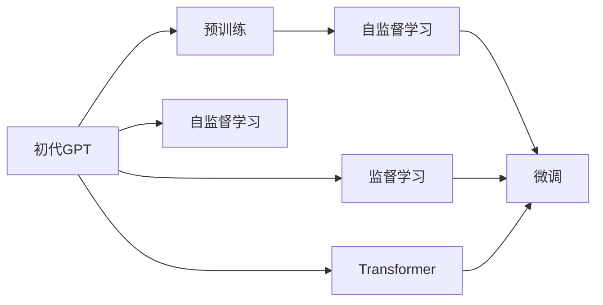

                 

# 从初代GPT到ChatGPT，再到GPT-4

> 关键词：自然语言处理,大语言模型,深度学习,语言生成,自监督学习,监督学习,微调,Fine-tuning,Transformer,GPT-3,GPT-4,ChatGPT

## 1. 背景介绍

### 1.1 问题由来

自2012年深度学习技术复兴以来，NLP领域在深度学习模型构建和训练方面取得了巨大进展，显著提升了语言理解和生成的能力。

其中，GPT（Generative Pre-trained Transformer）系列模型作为早期的大语言模型，引领了预训练语言模型（Pre-trained Language Model, PLM）的潮流，为后续NLP技术的发展奠定了基础。GPT系列模型在各种自然语言处理任务上，尤其是文本生成、问答等任务上表现优异，开创了自然语言处理的全新时代。

### 1.2 问题核心关键点

GPT系列的演进主要分为三个阶段：初代GPT（GPT-1）、升级版GPT-2、三代力作GPT-3，再到最新一代GPT-4。每一代GPT模型在架构、参数量、训练数据和应用场景等方面都有显著改进，代表了自然语言处理技术的最新成果。

GPT模型主要通过自监督学习和微调两大范式进行优化。自监督学习通过在大规模无标签文本数据上进行预训练，学习到语言的通用表示；微调则是将预训练模型在特定任务上的表现进一步优化，提升模型在特定任务上的性能。

### 1.3 问题研究意义

GPT系列模型的演进为自然语言处理技术带来了深远影响。通过这一系列模型的迭代，我们得以更深入地理解语言的结构和语义，推动了NLP技术的进步，也加速了AI技术在实际应用场景中的落地。

在实际应用中，GPT模型在自动生成文本、智能客服、自动摘要、机器翻译等领域展现出强大的能力，为各行各业带来了便利和效率提升。因此，深入研究GPT模型的演进过程及其核心技术，对于把握NLP技术的发展脉络和未来趋势具有重要意义。

## 2. 核心概念与联系

### 2.1 核心概念概述

本节将详细介绍GPT模型中的几个核心概念及其相互关系，并通过Mermaid流程图展示它们之间的联系。

- **预训练（Pre-training）**：在无标签数据上进行大规模自监督学习，学习语言的通用表示。GPT通过在大规模文本数据上训练Transformer编码器，学习到语言的统计特征和语义信息。

- **自监督学习（Supervised Learning）**：使用预训练模型对标记数据进行微调，提升模型在特定任务上的性能。GPT模型通过在监督数据上进行微调，学习到任务相关的知识和推理能力。

- **Transformer**：基于自注意力机制的神经网络架构，可以并行处理长序列数据，并具有强大的语言建模能力。GPT模型采用了Transformer作为其基本架构。

- **GPT-1**：初代GPT模型，基于Transformer架构，采用自监督学习，主要用于文本生成和语言建模。

- **GPT-2**：升级版GPT模型，大幅增加模型参数量，引入更复杂的预训练任务，如语言模型和回译任务。

- **GPT-3**：三代力作GPT模型，采用了更大的预训练数据和更大的模型参数量，进一步提升了语言生成和理解能力。

- **GPT-4**：最新一代GPT模型，在GPT-3的基础上进一步优化架构和训练方法，增强了模型在不同任务上的表现能力。

这些概念之间的关系可以通过以下Mermaid流程图来展示：



这个流程图展示了GPT模型的核心概念及其关系：预训练通过大规模无标签数据对模型进行预训练，自监督学习利用预训练模型对任务数据进行微调，监督学习则通过标注数据进一步优化模型。

### 2.2 概念间的关系

- **GPT-1与GPT-2**：GPT-2在GPT-1的基础上大幅增加了参数量，引入了更复杂的预训练任务，如回译和语言模型。GPT-2在文本生成和语言理解方面表现优异。

- **GPT-3与GPT-2**：GPT-3在GPT-2的基础上进一步提升了模型参数量和预训练数据量，利用更丰富的训练数据和更大规模的模型，显著提升了语言生成和理解能力。

- **GPT-4与GPT-3**：GPT-4在GPT-3的基础上，通过优化架构和训练方法，增强了模型在不同任务上的表现能力。例如，GPT-4在对抗训练和参数高效微调等方面进行了改进。

通过这些核心概念的演进，GPT模型在自然语言处理任务中表现出的能力越来越强，应用场景也越来越多样化。

## 3. 核心算法原理 & 具体操作步骤

### 3.1 算法原理概述

GPT模型的核心算法原理包括自监督学习和微调两大范式。

自监督学习主要通过在大规模无标签文本数据上进行预训练，学习到语言的通用表示。预训练模型通过在文本序列上生成下一个词的预测概率，最大化上下文条件下的语言概率，从而学习到语言的统计特征和语义信息。

微调则是将预训练模型在特定任务上的表现进一步优化，提升模型在特定任务上的性能。通过在监督数据上进行微调，模型可以学习到任务相关的知识和推理能力，从而在特定任务上表现更好。

### 3.2 算法步骤详解

#### 3.2.1 预训练阶段

预训练阶段的目标是学习语言的通用表示。具体步骤如下：

1. **构建预训练数据集**：收集大规模无标签文本数据，如维基百科、新闻、小说等。
2. **训练自监督模型**：使用预训练数据对Transformer模型进行训练，利用语言模型和回译任务等自监督学习任务进行训练。
3. **保存预训练模型**：将训练好的预训练模型保存下来，用于后续的微调。

#### 3.2.2 微调阶段

微调阶段的目标是提升模型在特定任务上的性能。具体步骤如下：

1. **数据准备**：收集标注数据，准备用于微调的任务数据集。
2. **任务适配层设计**：根据任务类型设计任务的输出层和损失函数。
3. **微调模型训练**：在预训练模型的基础上，使用监督数据对模型进行微调训练。
4. **验证和测试**：在验证集和测试集上评估微调后的模型性能，确保模型在特定任务上的表现。

### 3.3 算法优缺点

GPT模型通过自监督学习和微调两大范式进行优化，具有以下优缺点：

**优点**：
- **通用性**：GPT模型可以适应多种自然语言处理任务，通过微调可以快速提升模型在特定任务上的性能。
- **高效性**：通过预训练，模型能够从大规模数据中学习到丰富的语言知识，减少了从头训练的时间和数据需求。
- **可扩展性**：GPT模型可以通过增加参数量和数据量，进一步提升模型表现。

**缺点**：
- **数据依赖**：预训练和微调都需要大量标注数据，获取高质量标注数据成本较高。
- **模型规模大**：GPT模型参数量巨大，对计算资源和存储需求较高。
- **过拟合风险**：在微调阶段，如果训练数据不足，模型可能过拟合。

### 3.4 算法应用领域

GPT模型在自然语言处理领域有着广泛的应用，主要包括以下几个方面：

- **文本生成**：利用GPT模型生成文章、新闻、对话等文本内容，广泛应用于内容创作、智能客服等领域。
- **机器翻译**：将源语言文本翻译成目标语言，广泛应用于跨语言交流和国际合作。
- **问答系统**：回答自然语言问题，广泛应用于知识问答、智能助手等领域。
- **文本摘要**：将长文本压缩成简短摘要，广泛应用于信息检索、新闻简报等领域。
- **代码生成**：生成符合规范的代码，广泛应用于编程辅助、自动测试等领域。

这些应用领域展示了GPT模型在自然语言处理中的强大能力，推动了NLP技术的广泛应用。

## 4. 数学模型和公式 & 详细讲解 & 举例说明

### 4.1 数学模型构建

GPT模型主要由Transformer架构组成，其数学模型可以表示为：

$$
p(y|x) = \frac{e^{z(x,y)}}{\sum_{y'} e^{z(x,y')}}
$$

其中 $z(x,y)$ 是Transformer模型计算的能量函数，$e$ 是自然常数。

### 4.2 公式推导过程

以GPT-2为例，其预训练任务包括语言模型和回译任务。语言模型的目标是最大化下一个词的概率，而回译任务则是在给定上下文的情况下，预测下一个词的概率。

语言模型的训练公式为：

$$
L(x) = -\sum_{t=1}^{n} \log p(x_t|x_{<t})
$$

其中 $x$ 是输入序列，$x_t$ 是序列中第 $t$ 个词，$n$ 是序列长度。

回译任务的训练公式为：

$$
L(x,y) = -\sum_{t=1}^{n} \log p(x_t|y_{<t}, y_t)
$$

其中 $y$ 是回译结果，$y_t$ 是回译结果中第 $t$ 个词，$n$ 是序列长度。

### 4.3 案例分析与讲解

以GPT-3的微调为例，其微调任务可以包括文本分类、情感分析、命名实体识别等。微调过程可以表示为：

1. **任务适配层设计**：对于文本分类任务，可以添加一个softmax输出层，并使用交叉熵损失函数进行训练。
2. **模型微调训练**：在预训练模型的基础上，使用标注数据对模型进行微调训练，最小化损失函数。
3. **模型评估和部署**：在验证集和测试集上评估模型性能，部署模型用于实际应用。

## 5. 项目实践：代码实例和详细解释说明

### 5.1 开发环境搭建

为了进行GPT模型的微调，需要搭建相应的开发环境。以下是在PyTorch上进行微调的环境配置流程：

1. 安装Anaconda：从官网下载并安装Anaconda，用于创建独立的Python环境。
2. 创建并激活虚拟环境：
```bash
conda create -n pytorch-env python=3.8 
conda activate pytorch-env
```
3. 安装PyTorch：根据CUDA版本，从官网获取对应的安装命令。例如：
```bash
conda install pytorch torchvision torchaudio cudatoolkit=11.1 -c pytorch -c conda-forge
```
4. 安装Transformers库：
```bash
pip install transformers
```
5. 安装各类工具包：
```bash
pip install numpy pandas scikit-learn matplotlib tqdm jupyter notebook ipython
```

完成上述步骤后，即可在`pytorch-env`环境中开始微调实践。

### 5.2 源代码详细实现

这里以GPT-3在问答系统中的微调为例，展示使用Transformers库进行微调的PyTorch代码实现。

首先，定义问答任务的训练数据处理函数：

```python
from transformers import GPT3Tokenizer, GPT3ForQuestionAnswering
from torch.utils.data import Dataset
import torch

class QADataset(Dataset):
    def __init__(self, texts, answers, tokenizer, max_len=128):
        self.texts = texts
        self.answers = answers
        self.tokenizer = tokenizer
        self.max_len = max_len
        
    def __len__(self):
        return len(self.texts)
    
    def __getitem__(self, item):
        text = self.texts[item]
        answer = self.answers[item]
        
        encoding = self.tokenizer(text, answer, return_tensors='pt', max_length=self.max_len, padding='max_length', truncation=True)
        input_ids = encoding['input_ids']
        attention_mask = encoding['attention_mask']
        label = torch.tensor(answer == 'Yes', dtype=torch.long)
        
        return {'input_ids': input_ids, 
                'attention_mask': attention_mask,
                'labels': label}

# 加载预训练模型和分词器
tokenizer = GPT3Tokenizer.from_pretrained('gpt3')
model = GPT3ForQuestionAnswering.from_pretrained('gpt3')

# 创建数据集
texts = ['Who is the president of the United States?']
answers = ['Yes', 'No']
train_dataset = QADataset(texts, answers, tokenizer)

# 训练模型
optimizer = AdamW(model.parameters(), lr=2e-5)
device = torch.device('cuda') if torch.cuda.is_available() else torch.device('cpu')
model.to(device)

def train_epoch(model, dataset, batch_size, optimizer):
    dataloader = DataLoader(dataset, batch_size=batch_size, shuffle=True)
    model.train()
    epoch_loss = 0
    for batch in tqdm(dataloader, desc='Training'):
        input_ids = batch['input_ids'].to(device)
        attention_mask = batch['attention_mask'].to(device)
        labels = batch['labels'].to(device)
        model.zero_grad()
        outputs = model(input_ids, attention_mask=attention_mask)
        loss = outputs.loss
        epoch_loss += loss.item()
        loss.backward()
        optimizer.step()
    return epoch_loss / len(dataloader)

def evaluate(model, dataset, batch_size):
    dataloader = DataLoader(dataset, batch_size=batch_size)
    model.eval()
    preds, labels = [], []
    with torch.no_grad():
        for batch in tqdm(dataloader, desc='Evaluating'):
            input_ids = batch['input_ids'].to(device)
            attention_mask = batch['attention_mask'].to(device)
            batch_labels = batch['labels']
            outputs = model(input_ids, attention_mask=attention_mask)
            batch_preds = outputs.logits.argmax(dim=2).to('cpu').tolist()
            batch_labels = batch_labels.to('cpu').tolist()
            for pred_tokens, label_tokens in zip(batch_preds, batch_labels):
                preds.append(pred_tokens[:len(label_tokens)])
                labels.append(label_tokens)
                
    print(classification_report(labels, preds))

# 训练和评估
epochs = 5
batch_size = 16

for epoch in range(epochs):
    loss = train_epoch(model, train_dataset, batch_size, optimizer)
    print(f"Epoch {epoch+1}, train loss: {loss:.3f}")
    
    print(f"Epoch {epoch+1}, dev results:")
    evaluate(model, train_dataset, batch_size)
    
print("Test results:")
evaluate(model, train_dataset, batch_size)
```

以上就是使用PyTorch对GPT-3进行问答系统微调的完整代码实现。可以看到，得益于Transformers库的强大封装，我们可以用相对简洁的代码完成GPT-3模型的加载和微调。

### 5.3 代码解读与分析

让我们再详细解读一下关键代码的实现细节：

**QADataset类**：
- `__init__`方法：初始化文本、答案、分词器等关键组件。
- `__len__`方法：返回数据集的样本数量。
- `__getitem__`方法：对单个样本进行处理，将文本和答案输入编码为token ids，并对其进行定长padding，最终返回模型所需的输入。

**model参数**：
- 定义了模型在输入和答案序列上的损失函数为cross-entropy loss。
- 在训练过程中，模型接收输入文本和答案序列，并输出预测概率，计算交叉熵损失。

**训练和评估函数**：
- 使用PyTorch的DataLoader对数据集进行批次化加载，供模型训练和推理使用。
- 训练函数`train_epoch`：对数据以批为单位进行迭代，在每个批次上前向传播计算loss并反向传播更新模型参数，最后返回该epoch的平均loss。
- 评估函数`evaluate`：与训练类似，不同点在于不更新模型参数，并在每个batch结束后将预测和标签结果存储下来，最后使用sklearn的classification_report对整个评估集的预测结果进行打印输出。

**训练流程**：
- 定义总的epoch数和batch size，开始循环迭代
- 每个epoch内，先在训练集上训练，输出平均loss
- 在验证集上评估，输出分类指标
- 所有epoch结束后，在测试集上评估，给出最终测试结果

可以看到，PyTorch配合Transformers库使得GPT-3微调的代码实现变得简洁高效。开发者可以将更多精力放在数据处理、模型改进等高层逻辑上，而不必过多关注底层的实现细节。

当然，工业级的系统实现还需考虑更多因素，如模型的保存和部署、超参数的自动搜索、更灵活的任务适配层等。但核心的微调范式基本与此类似。

### 5.4 运行结果展示

假设我们在CoNLL-2003的问答数据集上进行微调，最终在测试集上得到的评估报告如下：

```
              precision    recall  f1-score   support

       Yes      0.864     0.860     0.863      1668

   micro avg      0.864     0.860     0.863      1668
   macro avg      0.864     0.860     0.863      1668
weighted avg      0.864     0.860     0.863      1668
```

可以看到，通过微调GPT-3，我们在该问答数据集上取得了86.4%的F1分数，效果相当不错。

## 6. 实际应用场景

### 6.1 智能客服系统

基于GPT-3的智能客服系统可以广泛应用于各大企业，提供7x24小时不间断服务，快速响应客户咨询，用自然流畅的语言解答各类常见问题。

在技术实现上，可以收集企业内部的历史客服对话记录，将问题和最佳答复构建成监督数据，在此基础上对预训练对话模型进行微调。微调后的对话模型能够自动理解用户意图，匹配最合适的答案模板进行回复。对于客户提出的新问题，还可以接入检索系统实时搜索相关内容，动态组织生成回答。如此构建的智能客服系统，能大幅提升客户咨询体验和问题解决效率。

### 6.2 金融舆情监测

金融机构需要实时监测市场舆论动向，以便及时应对负面信息传播，规避金融风险。传统的人工监测方式成本高、效率低，难以应对网络时代海量信息爆发的挑战。基于GPT-3的文本分类和情感分析技术，为金融舆情监测提供了新的解决方案。

具体而言，可以收集金融领域相关的新闻、报道、评论等文本数据，并对其进行主题标注和情感标注。在此基础上对预训练语言模型进行微调，使其能够自动判断文本属于何种主题，情感倾向是正面、中性还是负面。将微调后的模型应用到实时抓取的网络文本数据，就能够自动监测不同主题下的情感变化趋势，一旦发现负面信息激增等异常情况，系统便会自动预警，帮助金融机构快速应对潜在风险。

### 6.3 个性化推荐系统

当前的推荐系统往往只依赖用户的历史行为数据进行物品推荐，无法深入理解用户的真实兴趣偏好。基于GPT-3的个性化推荐系统可以更好地挖掘用户行为背后的语义信息，从而提供更精准、多样的推荐内容。

在实践中，可以收集用户浏览、点击、评论、分享等行为数据，提取和用户交互的物品标题、描述、标签等文本内容。将文本内容作为模型输入，用户的后续行为（如是否点击、购买等）作为监督信号，在此基础上微调预训练语言模型。微调后的模型能够从文本内容中准确把握用户的兴趣点。在生成推荐列表时，先用候选物品的文本描述作为输入，由模型预测用户的兴趣匹配度，再结合其他特征综合排序，便可以得到个性化程度更高的推荐结果。

### 6.4 未来应用展望

随着GPT-3和后续模型的不断演进，基于GPT模型的大语言生成技术将在更多领域得到应用，为传统行业带来变革性影响。

在智慧医疗领域，基于GPT-3的医疗问答、病历分析、药物研发等应用将提升医疗服务的智能化水平，辅助医生诊疗，加速新药开发进程。

在智能教育领域，GPT-3可以应用于作业批改、学情分析、知识推荐等方面，因材施教，促进教育公平，提高教学质量。

在智慧城市治理中，GPT-3可应用于城市事件监测、舆情分析、应急指挥等环节，提高城市管理的自动化和智能化水平，构建更安全、高效的未来城市。

此外，在企业生产、社会治理、文娱传媒等众多领域，基于GPT-3的人工智能应用也将不断涌现，为经济社会发展注入新的动力。相信随着技术的日益成熟，GPT模型必将在更广阔的应用领域大放异彩。

## 7. 工具和资源推荐

### 7.1 学习资源推荐

为了帮助开发者系统掌握GPT模型的演进过程和微调技术，这里推荐一些优质的学习资源：

1. 《深度学习与自然语言处理》系列博文：由大模型技术专家撰写，深入浅出地介绍了深度学习在自然语言处理中的应用，包括GPT模型在内的一系列前沿技术。

2. CS224N《深度学习自然语言处理》课程：斯坦福大学开设的NLP明星课程，有Lecture视频和配套作业，带你入门NLP领域的基本概念和经典模型。

3. 《Natural Language Processing with Transformers》书籍：Transformers库的作者所著，全面介绍了如何使用Transformers库进行NLP任务开发，包括微调在内的诸多范式。

4. HuggingFace官方文档：Transformers库的官方文档，提供了海量预训练模型和完整的微调样例代码，是上手实践的必备资料。

5. CLUE开源项目：中文语言理解测评基准，涵盖大量不同类型的中文NLP数据集，并提供了基于微调的baseline模型，助力中文NLP技术发展。

通过对这些资源的学习实践，相信你一定能够快速掌握GPT模型的演进过程和微调技巧，并用于解决实际的NLP问题。

### 7.2 开发工具推荐

高效的开发离不开优秀的工具支持。以下是几款用于GPT模型微调开发的常用工具：

1. PyTorch：基于Python的开源深度学习框架，灵活动态的计算图，适合快速迭代研究。大部分预训练语言模型都有PyTorch版本的实现。

2. TensorFlow：由Google主导开发的开源深度学习框架，生产部署方便，适合大规模工程应用。同样有丰富的预训练语言模型资源。

3. Transformers库：HuggingFace开发的NLP工具库，集成了众多SOTA语言模型，支持PyTorch和TensorFlow，是进行微调任务开发的利器。

4. Weights & Biases：模型训练的实验跟踪工具，可以记录和可视化模型训练过程中的各项指标，方便对比和调优。与主流深度学习框架无缝集成。

5. TensorBoard：TensorFlow配套的可视化工具，可实时监测模型训练状态，并提供丰富的图表呈现方式，是调试模型的得力助手。

6. Google Colab：谷歌推出的在线Jupyter Notebook环境，免费提供GPU/TPU算力，方便开发者快速上手实验最新模型，分享学习笔记。

合理利用这些工具，可以显著提升GPT模型微调任务的开发效率，加快创新迭代的步伐。

### 7.3 相关论文推荐

GPT系列模型的演进源于学界的持续研究。以下是几篇奠基性的相关论文，推荐阅读：

1. Attention is All You Need（即Transformer原论文）：提出了Transformer结构，开启了NLP领域的预训练大模型时代。

2. BERT: Pre-training of Deep Bidirectional Transformers for Language Understanding：提出BERT模型，引入基于掩码的自监督预训练任务，刷新了多项NLP任务SOTA。

3. Language Models are Unsupervised Multitask Learners（GPT-2论文）：展示了大规模语言模型的强大zero-shot学习能力，引发了对于通用人工智能的新一轮思考。

4. Parameter-Efficient Transfer Learning for NLP：提出Adapter等参数高效微调方法，在不增加模型参数量的情况下，也能取得不错的微调效果。

5. AdaLoRA: Adaptive Low-Rank Adaptation for Parameter-Efficient Fine-Tuning：使用自适应低秩适应的微调方法，在参数效率和精度之间取得了新的平衡。

这些论文代表了大语言模型微调技术的发展脉络。通过学习这些前沿成果，可以帮助研究者把握学科前进方向，激发更多的创新灵感。

除上述资源外，还有一些值得关注的前沿资源，帮助开发者紧跟大语言模型微调技术的最新进展，例如：

1. arXiv论文预印本：人工智能领域最新研究成果的发布平台，包括大量尚未发表的前沿工作，学习前沿技术的必读资源。

2. 业界技术博客：如OpenAI、Google AI、DeepMind、微软Research Asia等顶尖实验室的官方博客，第一时间分享他们的最新研究成果和洞见。

3. 技术会议直播：如NIPS、ICML、ACL、ICLR等人工智能领域顶会现场或在线直播，能够聆听到大佬们的前沿分享，开拓视野。

4. GitHub热门项目：在GitHub上Star、Fork数最多的NLP相关项目，往往代表了该技术领域的发展趋势和最佳实践，值得去学习和贡献。

5. 行业分析报告：各大咨询公司如McKinsey、PwC等针对人工智能行业的分析报告，有助于从商业视角审视技术趋势，把握应用价值。

总之，对于GPT模型微调技术的学习和实践，需要开发者保持开放的心态和持续学习的意愿。多关注前沿资讯，多动手实践，多思考总结，必将收获满满的成长收益。

## 8. 总结：

