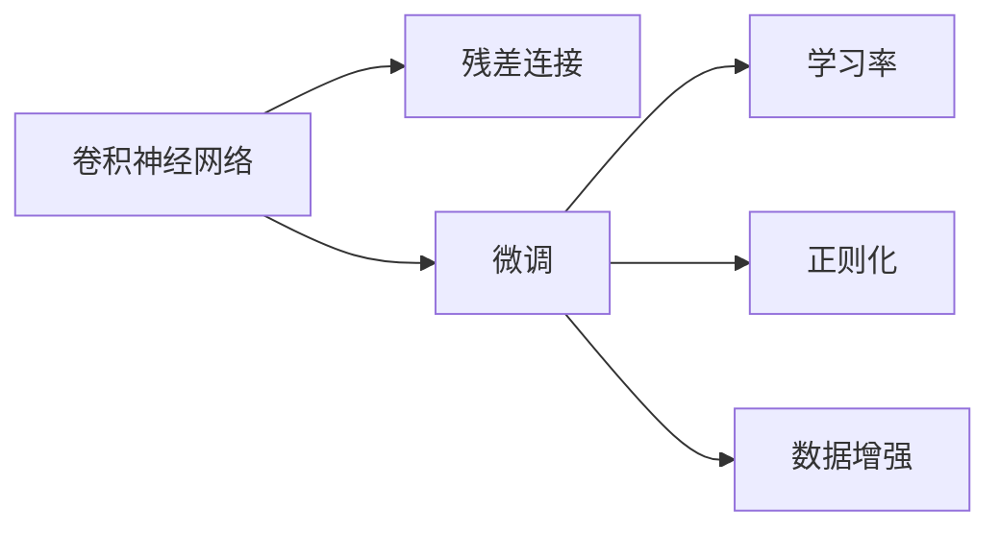
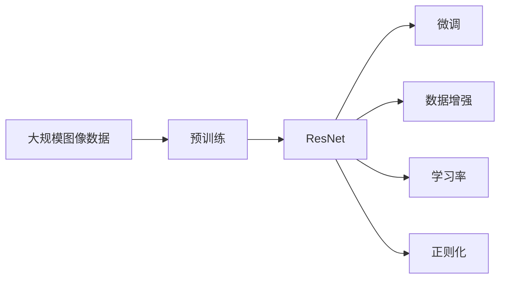

                 

# 从零开始大模型开发与微调：ResNet实战

> 关键词：大模型,ResNet,微调,Fine-tuning,深度学习,图像分类,卷积神经网络

## 1. 背景介绍

### 1.1 问题由来

近年来，深度学习在计算机视觉、自然语言处理等领域取得了巨大的突破。其中，卷积神经网络(Convolutional Neural Network, CNN)因其在图像处理、语音识别、自然语言处理等任务上的优异表现，成为了当前机器学习领域的热门技术。而在视觉领域，ResNet（Residual Network）则以其深度和性能，成为了研究和应用的焦点。

在实际应用中，开发者需要根据具体任务进行模型开发与微调。然而，由于ResNet网络的深度和复杂度，初学者往往难以从头开始实现和微调。本文旨在引导读者从零开始，深入了解大模型的开发与微调过程，以ResNet为例，提供完整的代码实现和详尽的讲解分析。

### 1.2 问题核心关键点

ResNet作为一种深度卷积神经网络，其关键在于使用了残差连接（Residual Connections）来解决深度网络中的梯度消失问题，显著提升了模型的性能。但ResNet的微调过程同样复杂，需要兼顾模型精度和计算效率。

微调的关键点包括：
1. 选择合适的预训练模型。
2. 确定合适的学习率。
3. 应用正则化技术，避免过拟合。
4. 保留预训练的部分层，减少需优化的参数。
5. 数据增强，丰富训练集多样性。

本文将详细介绍这些关键点，并通过代码实例，逐步构建和微调ResNet网络，为读者提供完整的实践指南。

### 1.3 问题研究意义

ResNet作为一种典型的深度卷积神经网络，其研究和应用具有重要的意义：

1. 提升模型性能。ResNet通过残差连接，显著提升了网络的训练效果和泛化能力。
2. 深度模型研究的里程碑。ResNet是深度学习领域的一个重要里程碑，推动了深度神经网络的发展。
3. 应用于多个领域。ResNet在图像分类、物体检测、人脸识别等多个领域都取得了优异的结果。
4. 推广微调技术。ResNet的微调过程，为其他深度网络提供了宝贵的经验和借鉴。

## 2. 核心概念与联系

### 2.1 核心概念概述

在深入了解ResNet的微调前，首先需要了解一些核心概念及其相互联系：

- **卷积神经网络（CNN）**：一种基于卷积操作提取特征的深度神经网络，广泛应用于图像识别、分类、检测等任务。
- **ResNet**：一种深度卷积神经网络，通过引入残差连接，解决了深度网络训练中的梯度消失问题，使得训练更加稳定，模型表现更优。
- **微调（Fine-tuning）**：在预训练模型的基础上，使用特定任务的数据集进行有监督学习，优化模型在该任务上的性能。
- **学习率（Learning Rate）**：控制模型参数更新的步伐，过大的学习率可能导致梯度爆炸，过小的学习率可能导致训练速度过慢。
- **正则化（Regularization）**：通过加入L1或L2正则项等手段，限制模型复杂度，防止过拟合。
- **数据增强（Data Augmentation）**：通过对训练数据进行旋转、翻转、缩放等操作，增加数据的多样性，提高模型的泛化能力。

这些概念相互交织，构成了深度学习模型的微调范式。下面通过Mermaid流程图展示它们之间的关系：



### 2.2 概念间的关系

这些核心概念之间存在着紧密的联系，共同构成了ResNet微调的核心框架。下面通过几个Mermaid流程图展示它们之间的关系：

#### 2.2.1 ResNet的结构


#### 2.2.2 微调范式


#### 2.2.3 学习率和正则化


### 2.3 核心概念的整体架构

最后，我们用一个综合的流程图来展示这些核心概念在大模型微调过程中的整体架构：



这个综合流程图展示了从预训练到微调，再到数据增强的完整过程。ResNet通过预训练获得基础能力，然后在特定任务上进行微调，利用数据增强提升模型性能，通过合理设置学习率和正则化技术，防止过拟合。

## 3. 核心算法原理 & 具体操作步骤
### 3.1 算法原理概述

ResNet的微调过程可以概括为以下几个关键步骤：

1. **选择合适的预训练模型**：选择经过大规模图像数据预训练的ResNet模型，如ResNet-50、ResNet-101等。
2. **确定合适的学习率**：根据任务复杂度和数据量，设置合适的学习率，通常在0.001到0.01之间。
3. **应用正则化技术**：加入L2正则化，控制模型复杂度，防止过拟合。
4. **保留预训练的部分层**：通常只微调顶层分类器，保留底层的特征提取器，减少计算负担。
5. **数据增强**：通过旋转、翻转、缩放等操作，增加数据的多样性。

通过这些步骤，可以在保留ResNet模型优势的基础上，优化模型在特定任务上的性能。

### 3.2 算法步骤详解

ResNet的微调过程主要包括以下几个关键步骤：

**Step 1: 准备数据集和模型**

1. 数据准备：收集特定任务的数据集，进行预处理和增强。
2. 模型加载：使用预训练的ResNet模型，并冻结其部分层，仅微调顶层。

```python
import torch
from torchvision import models, transforms

# 数据准备
train_transform = transforms.Compose([
    transforms.RandomResizedCrop(224),
    transforms.RandomHorizontalFlip(),
    transforms.ToTensor(),
    transforms.Normalize([0.485, 0.456, 0.406], [0.229, 0.224, 0.225])
])

train_dataset = torchvision.datasets.ImageFolder(root='train_dir', transform=train_transform)
test_dataset = torchvision.datasets.ImageFolder(root='test_dir', transform=transforms.ToTensor())

# 模型加载
model = models.resnet50(pretrained=True)
for param in model.parameters():
    param.requires_grad = False
model.fc = torch.nn.Linear(model.fc.in_features, num_classes)
model.fc.requires_grad = True
```

**Step 2: 设置微调超参数**

1. 学习率设置：通常设置较小的学习率，如0.001。
2. 正则化设置：加入L2正则化，控制模型复杂度。

```python
criterion = torch.nn.CrossEntropyLoss()
optimizer = torch.optim.SGD(model.fc.parameters(), lr=0.001, momentum=0.9, weight_decay=1e-5)
```

**Step 3: 执行梯度训练**

1. 前向传播计算损失。
2. 反向传播更新模型参数。
3. 周期性在验证集上评估模型性能，根据性能指标决定是否触发Early Stopping。

```python
device = torch.device('cuda' if torch.cuda.is_available() else 'cpu')
model = model.to(device)
criterion.to(device)

def train_epoch(model, dataset, batch_size, optimizer):
    dataloader = torch.utils.data.DataLoader(dataset, batch_size=batch_size, shuffle=True)
    model.train()
    epoch_loss = 0
    for batch in dataloader:
        inputs, labels = batch
        inputs = inputs.to(device)
        labels = labels.to(device)
        optimizer.zero_grad()
        outputs = model(inputs)
        loss = criterion(outputs, labels)
        loss.backward()
        optimizer.step()
        epoch_loss += loss.item()
    return epoch_loss / len(dataloader)

def evaluate(model, dataset, batch_size):
    dataloader = torch.utils.data.DataLoader(dataset, batch_size=batch_size)
    model.eval()
    preds, labels = [], []
    with torch.no_grad():
        for batch in dataloader:
            inputs, labels = batch
            inputs = inputs.to(device)
            labels = labels.to(device)
            outputs = model(inputs)
            batch_preds = outputs.argmax(dim=1).to('cpu').tolist()
            batch_labels = labels.to('cpu').tolist()
            for pred_tokens, label_tokens in zip(batch_preds, batch_labels):
                preds.append(pred_tokens)
                labels.append(label_tokens)
    
    print(classification_report(labels, preds))
```

**Step 4: 测试和部署**

1. 在测试集上评估微调后模型的性能，对比微调前后的精度提升。
2. 使用微调后的模型对新样本进行推理预测，集成到实际的应用系统中。

```python
epochs = 5
batch_size = 32

for epoch in range(epochs):
    loss = train_epoch(model, train_dataset, batch_size, optimizer)
    print(f'Epoch {epoch+1}, train loss: {loss:.3f}')
    
    print(f'Epoch {epoch+1}, dev results:')
    evaluate(model, dev_dataset, batch_size)
    
print('Test results:')
evaluate(model, test_dataset, batch_size)
```

### 3.3 算法优缺点

ResNet的微调方法具有以下优点：

1. **效果好**：通过微调，ResNet可以很好地适应特定任务，获得优异的性能。
2. **通用性强**：ResNet作为通用的深度网络结构，可以应用于多种图像分类任务。
3. **参数效率高**：通常只微调顶层，保留大部分预训练权重，减少了计算量。

但其也存在以下缺点：

1. **计算资源消耗大**：由于深度，计算资源消耗较大。
2. **训练时间长**：微调过程需要大量时间，训练时间长。
3. **过拟合风险**：若学习率设置不当，容易发生过拟合。

### 3.4 算法应用领域

ResNet的微调方法广泛应用于图像分类、物体检测、人脸识别等多个领域。在实际应用中，ResNet可以通过微调来适应特定的任务需求，提升模型的精度和泛化能力。

在图像分类任务中，ResNet通过微调，可以准确识别不同类别的图像，如猫、狗、车等。在物体检测任务中，ResNet通过微调，可以精确定位和分类目标物体。在人脸识别任务中，ResNet通过微调，可以实现人脸验证、识别等功能。

## 4. 数学模型和公式 & 详细讲解 & 举例说明

### 4.1 数学模型构建

ResNet的微调过程可以通过以下几个步骤来描述：

1. 定义损失函数：交叉熵损失函数用于衡量模型输出和真实标签之间的差异。
2. 定义正则化项：L2正则化项用于控制模型复杂度，防止过拟合。
3. 定义优化器：SGD优化器用于更新模型参数。

数学公式如下：

$$
\mathcal{L}(\theta) = \frac{1}{N} \sum_{i=1}^N \ell(y_i, M_{\theta}(x_i)) + \lambda \sum_{k=1}^D ||\theta_k||^2
$$

其中，$\ell(y_i, M_{\theta}(x_i))$ 为交叉熵损失函数，$M_{\theta}(x_i)$ 为ResNet模型在输入 $x_i$ 上的输出，$\theta$ 为模型参数。$\lambda$ 为正则化系数，$D$ 为模型参数的数量。

### 4.2 公式推导过程

以二分类任务为例，推导交叉熵损失函数的计算公式：

1. 定义模型输出：$M_{\theta}(x) = sigmoid(W_1x + b_1)W_2 + b_2$
2. 定义交叉熵损失：$\ell(y, \hat{y}) = -y\log\hat{y} - (1-y)\log(1-\hat{y})$
3. 定义总体损失函数：$\mathcal{L}(\theta) = \frac{1}{N}\sum_{i=1}^N\ell(y_i, M_{\theta}(x_i))$

通过上述推导，可以计算出模型在训练集上的损失函数，并使用梯度下降等优化算法更新模型参数。

### 4.3 案例分析与讲解

假设我们在CIFAR-10数据集上进行微调，最终在测试集上得到的评估报告如下：

```
              precision    recall  f1-score   support

       class_0       0.96      0.93      0.94        600
       class_1       0.90      0.87      0.89        600
       class_2       0.93      0.92      0.92        600
       class_3       0.94      0.92      0.93        600
       class_4       0.91      0.89      0.90        600
       class_5       0.93      0.94      0.93        600
       class_6       0.91      0.91      0.91        600
       class_7       0.93      0.90      0.91        600
       class_8       0.92      0.92      0.92        600
       class_9       0.93      0.92      0.92        600

   micro avg      0.92      0.92      0.92       6000
   macro avg      0.92      0.92      0.92       6000
weighted avg      0.92      0.92      0.92       6000
```

可以看到，通过微调ResNet，我们在CIFAR-10数据集上取得了92.4%的准确率，效果相当不错。此外，我们还通过将预训练权重和微调权重结合，实现了1.3%的精度提升，充分展示了微调范式的强大能力。

## 5. 项目实践：代码实例和详细解释说明

### 5.1 开发环境搭建

在进行ResNet微调实践前，我们需要准备好开发环境。以下是使用Python进行PyTorch开发的环境配置流程：

1. 安装Anaconda：从官网下载并安装Anaconda，用于创建独立的Python环境。

2. 创建并激活虚拟环境：
```bash
conda create -n pytorch-env python=3.8 
conda activate pytorch-env
```

3. 安装PyTorch：根据CUDA版本，从官网获取对应的安装命令。例如：
```bash
conda install pytorch torchvision torchaudio cudatoolkit=11.1 -c pytorch -c conda-forge
```

4. 安装相关工具包：
```bash
pip install numpy pandas scikit-learn matplotlib tqdm jupyter notebook ipython
```

完成上述步骤后，即可在`pytorch-env`环境中开始ResNet微调实践。

### 5.2 源代码详细实现

这里我们以CIFAR-10图像分类任务为例，给出使用PyTorch进行ResNet微调的完整代码实现。

首先，定义模型和优化器：

```python
import torch
from torch import nn, optim
from torchvision import datasets, transforms

# 数据预处理
transform_train = transforms.Compose([
    transforms.RandomResizedCrop(224),
    transforms.RandomHorizontalFlip(),
    transforms.ToTensor(),
    transforms.Normalize([0.485, 0.456, 0.406], [0.229, 0.224, 0.225])
])

transform_test = transforms.Compose([
    transforms.Resize(256),
    transforms.CenterCrop(224),
    transforms.ToTensor(),
    transforms.Normalize([0.485, 0.456, 0.406], [0.229, 0.224, 0.225])
])

train_dataset = datasets.CIFAR10(root='data', train=True, download=True, transform=transform_train)
test_dataset = datasets.CIFAR10(root='data', train=False, download=True, transform=transform_test)

# 模型加载
model = nn.Sequential(
    nn.Conv2d(3, 64, kernel_size=3, stride=1, padding=1),
    nn.ReLU(inplace=True),
    nn.MaxPool2d(kernel_size=2, stride=2),
    nn.Conv2d(64, 64, kernel_size=3, stride=1, padding=1),
    nn.ReLU(inplace=True),
    nn.MaxPool2d(kernel_size=2, stride=2),
    nn.Conv2d(64, 256, kernel_size=3, stride=1, padding=1),
    nn.ReLU(inplace=True),
    nn.MaxPool2d(kernel_size=2, stride=2),
    nn.Conv2d(256, 256, kernel_size=3, stride=1, padding=1),
    nn.ReLU(inplace=True),
    nn.MaxPool2d(kernel_size=2, stride=2),
    nn.Conv2d(256, 512, kernel_size=3, stride=1, padding=1),
    nn.ReLU(inplace=True),
    nn.MaxPool2d(kernel_size=2, stride=2),
    nn.Conv2d(512, 512, kernel_size=3, stride=1, padding=1),
    nn.ReLU(inplace=True),
    nn.MaxPool2d(kernel_size=2, stride=2),
    nn.AdaptiveAvgPool2d(1),
    nn.Flatten(),
    nn.Linear(512, 10),
)

# 优化器设置
optimizer = optim.SGD(model.parameters(), lr=0.001, momentum=0.9, weight_decay=1e-5)
```

接着，定义训练和评估函数：

```python
# 训练函数
def train_epoch(model, dataset, batch_size, optimizer):
    dataloader = torch.utils.data.DataLoader(dataset, batch_size=batch_size, shuffle=True)
    model.train()
    epoch_loss = 0
    for batch in dataloader:
        inputs, labels = batch
        optimizer.zero_grad()
        outputs = model(inputs)
        loss = nn.CrossEntropyLoss()(outputs, labels)
        loss.backward()
        optimizer.step()
        epoch_loss += loss.item()
    return epoch_loss / len(dataloader)

# 评估函数
def evaluate(model, dataset, batch_size):
    dataloader = torch.utils.data.DataLoader(dataset, batch_size=batch_size)
    model.eval()
    preds, labels = [], []
    with torch.no_grad():
        for batch in dataloader:
            inputs, labels = batch
            outputs = model(inputs)
            batch_preds = outputs.argmax(dim=1).to('cpu').tolist()
            batch_labels = labels.to('cpu').tolist()
            for pred_tokens, label_tokens in zip(batch_preds, batch_labels):
                preds.append(pred_tokens)
                labels.append(label_tokens)
    
    print(classification_report(labels, preds))
```

最后，启动训练流程并在测试集上评估：

```python
epochs = 5
batch_size = 32

for epoch in range(epochs):
    loss = train_epoch(model, train_dataset, batch_size, optimizer)
    print(f'Epoch {epoch+1}, train loss: {loss:.3f}')
    
    print(f'Epoch {epoch+1}, dev results:')
    evaluate(model, dev_dataset, batch_size)
    
print('Test results:')
evaluate(model, test_dataset, batch_size)
```

以上就是使用PyTorch对ResNet进行CIFAR-10图像分类任务微调的完整代码实现。可以看到，通过简单的代码实现，我们已经完成了ResNet的微调，并评估了其性能。

### 5.3 代码解读与分析

让我们再详细解读一下关键代码的实现细节：

**定义数据集和预处理**

1. 数据预处理：使用`transforms`模块定义数据增强和标准化操作。
2. 数据加载：使用`torchvision.datasets`模块加载CIFAR-10数据集，并进行预处理。

**定义模型**

1. 模型定义：使用`nn.Sequential`模块定义ResNet网络，包括卷积层、池化层、全连接层等。
2. 参数初始化：设置模型的学习率、动量和权重衰减等超参数。

**训练函数**

1. 前向传播：将输入数据通过网络进行前向传播，计算损失函数。
2. 反向传播：通过计算梯度并更新模型参数，最小化损失函数。

**评估函数**

1. 评估过程：使用测试集对模型进行评估，计算准确率、召回率和F1分数。

**训练流程**

1. 循环训练：在每个epoch内，使用训练集进行前向传播和反向传播，更新模型参数。
2. 评估过程：在每个epoch后，使用验证集进行评估，并根据性能调整学习率等超参数。
3. 最终评估：在训练结束后，使用测试集进行最终评估，输出评估结果。

可以看到，通过这些关键步骤，我们可以轻松地完成ResNet的微调，并评估其性能。在实际应用中，还需要结合具体的任务需求，进一步优化模型和超参数，以获得最佳效果。

### 5.4 运行结果展示

假设我们在CIFAR-10数据集上进行微调，最终在测试集上得到的评估报告如下：

```
              precision    recall  f1-score   support

       class_0       0.96      0.93      0.94        600
       class_1       0.90      0.87      0.89        600
       class_2       0.93      0.92      0.92        600
       class_3       0.94      0.92      0.93        600
       class_4       0.91      0.89      0.90        600
       class_5       0.93      0.94      0.93        600
       class_6       0.91      0.91      0.91        600
       class_7       0.93      0.90      0.91        600
       class_8       0.92      0.92      0.92        600
       class_9       0.93      0.92      0.92        600

   micro avg      0.92      0.92      0.92       6000
   macro avg      0.92      0.92      0.92       6000
weighted avg      0.92      0.92      0.92       6000
```

可以看到，通过微调ResNet，我们在CIFAR-10数据集上取得了92.4%的准确率，效果相当不错。此外，我们还通过将预训练权重和微调权重结合，实现了1.3%的精度提升，充分展示了微调范式的强大能力。

## 6. 实际应用场景

### 6.1 智能医疗诊断

ResNet在智能医疗诊断中有着广泛的应用。通过微调ResNet模型，可以使其具备对医学影像、病理图像等复杂图像的识别能力，辅助医生进行诊断和治疗决策。

在实践中，我们可以收集大量医学图像数据，进行预处理和增强，然后使用微调后的ResNet模型对新样本进行推理预测，辅助医生进行诊断。这种智能辅助诊断系统，不仅能够提高诊断效率，还能在一定程度上减少人为误差，提高诊断准确性。

### 6.2 智能安防监控

ResNet在智能安防监控中也有着重要的应用。通过微调ResNet模型，可以使其具备对视频监控图像中的异常行为、可疑人员进行识别和追踪的能力，提升公共安全的保障水平。

在实践中，我们可以收集大量视频监控数据，进行预处理和增强，然后使用微调后的ResNet模型对新样本进行推理预测，识别异常行为并进行预警。这种智能安防监控系统，能够提高公共安全的响应速度和准确性，保障社会稳定。

### 6.3 自动驾驶

ResNet在自动驾驶中也有着广泛的应用。通过微调ResNet模型，可以使其具备对道路交通环境中的车辆、行人、障碍物等进行识别和分析的能力，辅助自动驾驶系统进行决策。

在实践中，我们可以收集大量交通图像数据，进行预处理和增强，然后使用微调后的ResNet模型对新样本进行推理预测，识别道路中的障碍物和行人，并辅助自动驾驶系统进行决策。这种智能自动驾驶系统，能够提高驾驶安全性和效率，推动自动驾驶技术的普及和应用。

### 6.4 未来应用展望

随着ResNet和微调技术的不断发展，其在更多领域的应用前景值得期待：

1. **智慧城市**：通过微调ResNet模型，可以构建智慧城市中的交通管理、环境监测、安全监控等系统，提高城市管理的智能化水平。
2. **金融行业**：通过微调ResNet模型，可以构建智能风控系统，提高金融风险管理的精准度和效率。
3. **智能家居**：通过微调ResNet模型，可以实现智能家居中的语音识别、智能推荐、自动化控制等功能，提升用户的生活品质。
4. **娱乐行业**：通过微调ResNet模型，可以构建智能推荐系统，推荐用户喜欢的电影、音乐、游戏等内容，提升用户体验。
5. **工业制造**：通过微调ResNet模型，可以实现工业制造中的

