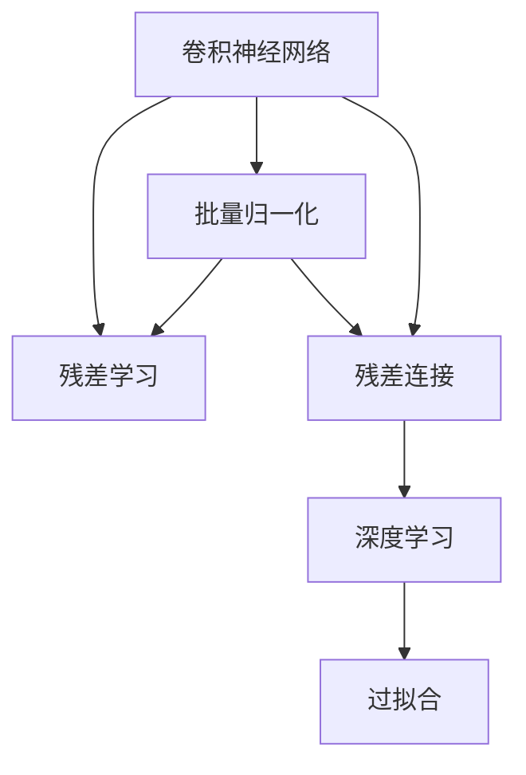
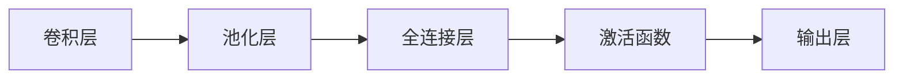
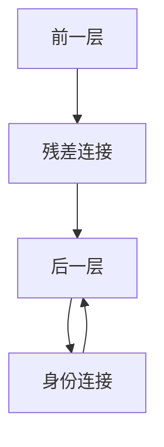
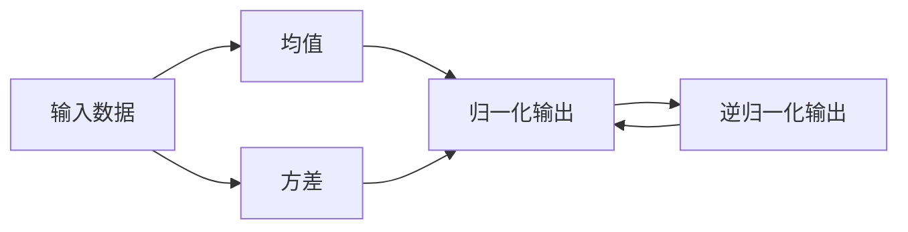
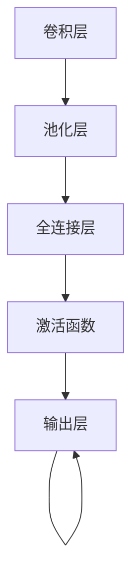
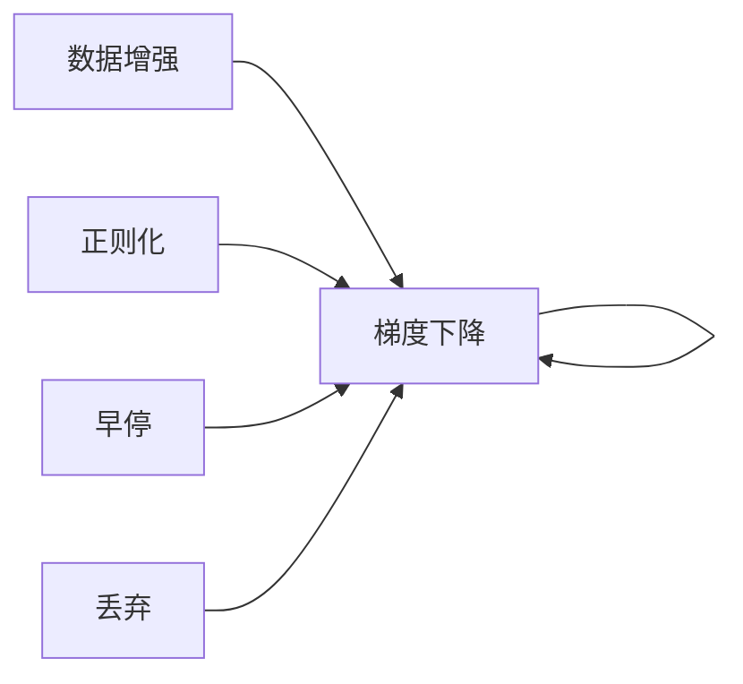
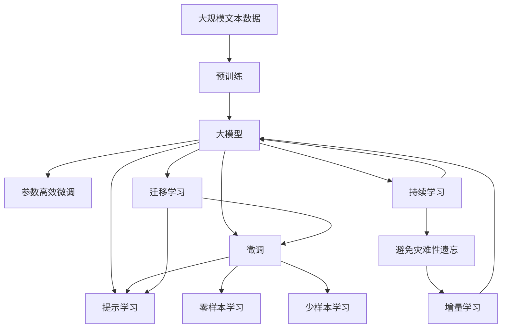

                 

# 从零开始大模型开发与微调：ResNet诞生的背景

## 1. 背景介绍

### 1.1 问题由来
深度学习领域的一个重大突破是卷积神经网络（Convolutional Neural Networks，CNNs）的出现，它通过卷积操作和池化操作等手段，在图像分类、目标检测、语义分割等计算机视觉任务上取得了令人瞩目的成绩。但传统CNN在处理深层网络时，容易发生过拟合，且需要大量标注数据进行训练。

卷积神经网络的核心是卷积层，通过卷积操作提取图像特征，并将特征传递给全连接层进行分类。传统卷积层采用的是3x3、5x5等固定大小卷积核，无法自适应地捕捉不同尺寸的特征。此外，卷积层存在参数冗余、局部感受野等问题，导致深层网络的训练难度和计算成本增加。

### 1.2 问题核心关键点
ResNet（Residual Network）的提出正是为了解决上述问题。ResNet的核心思想是残差学习（Residual Learning），通过引入残差连接，使得网络能够学习更深的层级，从而在图像分类等任务上取得更好的效果。

ResNet的残差连接通过跨层连接的方式，将前一层的输出直接传递给后一层，使得信息传递不受深度限制，减少了参数冗余，提升了模型表达能力。此外，ResNet通过批量归一化（Batch Normalization）技术，加速了网络收敛，提高了模型的泛化能力。

### 1.3 问题研究意义
ResNet的出现，为深度学习的进一步发展打开了新篇章。它不仅提升了深度神经网络在图像处理领域的性能，还为其他领域的深度学习提供了重要借鉴。同时，ResNet的思想也被推广到了其他领域，如自然语言处理（NLP）、语音识别等，进一步推动了人工智能技术的发展。

通过深入研究ResNet的原理和应用，本文旨在为深度学习领域的研究者、工程师和学生提供一个全面的指导，帮助他们从零开始构建大模型，并掌握微调技术，提升模型的应用效果。

## 2. 核心概念与联系

### 2.1 核心概念概述

为更好地理解ResNet的原理和应用，本节将介绍几个密切相关的核心概念：

- 卷积神经网络（Convolutional Neural Networks，CNNs）：一种用于图像处理和计算机视觉任务的深度学习模型，通过卷积操作和池化操作提取特征。

- 残差学习（Residual Learning）：通过跨层连接将前一层的输出直接传递给后一层，使得网络能够学习更深的层级，避免过拟合。

- 批量归一化（Batch Normalization）：通过对每一层的输入进行归一化，加速了网络的收敛，提高了模型的泛化能力。

- 残差连接（Residual Connection）：通过跨层连接的方式，使得信息传递不受深度限制，减少了参数冗余，提升了模型表达能力。

- 深度学习（Deep Learning）：一种通过多层神经网络对复杂数据进行建模和分析的技术，在图像处理、自然语言处理等领域取得了巨大成功。

- 过拟合（Overfitting）：模型在训练集上表现良好，但在测试集上表现较差的现象，可以通过数据增强、正则化等手段缓解。

这些核心概念之间的逻辑关系可以通过以下Mermaid流程图来展示：



这个流程图展示了卷积神经网络、残差学习、批量归一化、残差连接、深度学习以及过拟合之间的关系：

1. 卷积神经网络通过卷积操作和池化操作提取特征。
2. 残差学习通过跨层连接将前一层的输出直接传递给后一层，提升模型表达能力。
3. 批量归一化通过对每一层的输入进行归一化，加速了网络的收敛。
4. 残差连接通过跨层连接的方式，减少了参数冗余，提升了模型表达能力。
5. 深度学习通过多层神经网络对复杂数据进行建模。
6. 过拟合可以通过数据增强、正则化等手段缓解。

### 2.2 概念间的关系

这些核心概念之间存在着紧密的联系，形成了卷积神经网络的完整生态系统。下面我们通过几个Mermaid流程图来展示这些概念之间的关系。

#### 2.2.1 卷积神经网络的基本结构



这个流程图展示了卷积神经网络的基本结构，包括卷积层、池化层、全连接层、激活函数和输出层。

#### 2.2.2 残差学习的具体实现



这个流程图展示了残差学习的具体实现，通过跨层连接将前一层的输出直接传递给后一层。

#### 2.2.3 批量归一化的计算过程



这个流程图展示了批量归一化的计算过程，包括均值、方差计算和归一化与逆归一化操作。

#### 2.2.4 深度学习的网络结构



这个流程图展示了深度学习的网络结构，通过多层卷积和全连接层进行特征提取和分类。

#### 2.2.5 过拟合的缓解策略



这个流程图展示了过拟合的缓解策略，包括数据增强、正则化、早停、丢弃等方法。

### 2.3 核心概念的整体架构

最后，我们用一个综合的流程图来展示这些核心概念在大模型微调过程中的整体架构：



这个综合流程图展示了从预训练到微调，再到持续学习的完整过程。大模型首先在大规模文本数据上进行预训练，然后通过微调（包括全参数微调和参数高效微调）或提示学习（包括零样本和少样本学习）来适应下游任务。最后，通过持续学习技术，模型可以不断更新和适应新的任务和数据。

## 3. 核心算法原理 & 具体操作步骤
### 3.1 算法原理概述

卷积神经网络的残差学习思想是通过跨层连接将前一层的输出直接传递给后一层，使得网络能够学习更深的层级，从而在图像分类等任务上取得更好的效果。

形式化地，假设输入为 $x$，经过 $N$ 层卷积和池化操作后，得到输出 $y$，则残差学习的目标函数为：

$$
\min_{\theta} \|y - x\|
$$

其中 $\theta$ 为网络参数，$\|y - x\|$ 为输出与输入之间的残差。

通过梯度下降等优化算法，残差学习不断更新网络参数 $\theta$，最小化残差，使得模型输出逼近输入。由于 $\theta$ 已经通过预训练获得了较好的初始化，因此即便在小规模数据集上进行微调，也能较快收敛到理想的模型参数。

### 3.2 算法步骤详解

卷积神经网络的残差学习一般包括以下几个关键步骤：

**Step 1: 准备预训练模型和数据集**
- 选择合适的预训练卷积神经网络模型（如ResNet、VGG等）作为初始化参数。
- 准备下游任务的数据集，划分为训练集、验证集和测试集。

**Step 2: 添加任务适配层**
- 根据任务类型，在预训练模型的顶层设计合适的输出层和损失函数。
- 对于分类任务，通常在顶层添加线性分类器和交叉熵损失函数。
- 对于生成任务，通常使用语言模型的解码器输出概率分布，并以负对数似然为损失函数。

**Step 3: 设置微调超参数**
- 选择合适的优化算法及其参数，如 Adam、SGD 等，设置学习率、批大小、迭代轮数等。
- 设置正则化技术及强度，包括权重衰减、Dropout、Early Stopping 等。
- 确定冻结预训练参数的策略，如仅微调顶层，或全部参数都参与微调。

**Step 4: 执行梯度训练**
- 将训练集数据分批次输入模型，前向传播计算损失函数。
- 反向传播计算参数梯度，根据设定的优化算法和学习率更新模型参数。
- 周期性在验证集上评估模型性能，根据性能指标决定是否触发 Early Stopping。
- 重复上述步骤直到满足预设的迭代轮数或 Early Stopping 条件。

**Step 5: 测试和部署**
- 在测试集上评估微调后模型 $M_{\hat{\theta}}$ 的性能，对比微调前后的精度提升。
- 使用微调后的模型对新样本进行推理预测，集成到实际的应用系统中。
- 持续收集新的数据，定期重新微调模型，以适应数据分布的变化。

以上是卷积神经网络微调的一般流程。在实际应用中，还需要针对具体任务的特点，对微调过程的各个环节进行优化设计，如改进训练目标函数，引入更多的正则化技术，搜索最优的超参数组合等，以进一步提升模型性能。

### 3.3 算法优缺点

卷积神经网络的残差学习思想具有以下优点：

1. 简单高效。相比从头训练，残差学习可以在少量数据上进行微调，获得较大的性能提升。
2. 通用适用。适用于各种计算机视觉下游任务，如分类、检测、分割等，设计简单的任务适配层即可实现微调。
3. 参数高效。利用残差连接，大部分预训练参数被固定，只更新少量任务相关参数，减少了计算量。
4. 效果显著。在学术界和工业界的诸多任务上，基于残差学习的微调方法已经刷新了最先进的性能指标。

同时，该方法也存在一定的局限性：

1. 依赖标注数据。微调的效果很大程度上取决于标注数据的质量和数量，获取高质量标注数据的成本较高。
2. 迁移能力有限。当目标任务与预训练数据的分布差异较大时，微调的性能提升有限。
3. 模型较大。残差学习的深度较深，模型参数量较大，训练和推理需要较高的计算资源。
4. 对抗样本影响。残差学习模型对对抗样本的鲁棒性较差，容易受到恶意扰动的攻击。

尽管存在这些局限性，但就目前而言，残差学习的微调方法仍是最主流范式。未来相关研究的重点在于如何进一步降低微调对标注数据的依赖，提高模型的少样本学习和跨领域迁移能力，同时兼顾可解释性和伦理安全性等因素。

### 3.4 算法应用领域

卷积神经网络的残差学习思想已经广泛应用于计算机视觉领域，覆盖了几乎所有常见任务，例如：

- 图像分类：如分类图像中的物体类别。通过微调使模型学习分类任务。
- 目标检测：如在图像中检测特定物体的位置。通过微调使模型学习物体的边界框和类别。
- 语义分割：如在图像中将像素分类为不同的语义类别。通过微调使模型学习像素级别的语义信息。
- 人脸识别：如在图像中识别人脸并进行身份验证。通过微调使模型学习人脸特征。
- 物体跟踪：如在视频中跟踪移动物体的位置。通过微调使模型学习物体的运动轨迹。

除了上述这些经典任务外，残差学习的微调方法也被创新性地应用到更多场景中，如超分辨率、风格迁移、目标生成等，为计算机视觉技术带来了全新的突破。

## 4. 数学模型和公式 & 详细讲解  
### 4.1 数学模型构建

本节将使用数学语言对卷积神经网络的残差学习过程进行更加严格的刻画。

记输入为 $x \in \mathbb{R}^n$，输出为 $y \in \mathbb{R}^m$，预训练卷积神经网络为 $M_{\theta}:\mathbb{R}^n \rightarrow \mathbb{R}^m$。假设微调任务的训练集为 $D=\{(x_i,y_i)\}_{i=1}^N$，其中 $x_i \in \mathbb{R}^n$ 表示输入样本，$y_i \in \mathbb{R}^m$ 表示标签。

定义模型 $M_{\theta}$ 在数据样本 $(x,y)$ 上的损失函数为 $\ell(M_{\theta}(x),y)$，则在数据集 $D$ 上的经验风险为：

$$
\mathcal{L}(\theta) = \frac{1}{N} \sum_{i=1}^N \ell(M_{\theta}(x_i),y_i)
$$

微调的优化目标是最小化经验风险，即找到最优参数：

$$
\theta^* = \mathop{\arg\min}_{\theta} \mathcal{L}(\theta)
$$

在实践中，我们通常使用基于梯度的优化算法（如SGD、Adam等）来近似求解上述最优化问题。设 $\eta$ 为学习率，$\lambda$ 为正则化系数，则参数的更新公式为：

$$
\theta \leftarrow \theta - \eta \nabla_{\theta}\mathcal{L}(\theta) - \eta\lambda\theta
$$

其中 $\nabla_{\theta}\mathcal{L}(\theta)$ 为损失函数对参数 $\theta$ 的梯度，可通过反向传播算法高效计算。

### 4.2 公式推导过程

以下我们以二分类任务为例，推导交叉熵损失函数及其梯度的计算公式。

假设模型 $M_{\theta}$ 在输入 $x$ 上的输出为 $\hat{y}=M_{\theta}(x) \in [0,1]$，表示样本属于正类的概率。真实标签 $y \in \{0,1\}$。则二分类交叉熵损失函数定义为：

$$
\ell(M_{\theta}(x),y) = -[y\log \hat{y} + (1-y)\log (1-\hat{y})]
$$

将其代入经验风险公式，得：

$$
\mathcal{L}(\theta) = -\frac{1}{N}\sum_{i=1}^N [y_i\log M_{\theta}(x_i)+(1-y_i)\log(1-M_{\theta}(x_i))]
$$

根据链式法则，损失函数对参数 $\theta_k$ 的梯度为：

$$
\frac{\partial \mathcal{L}(\theta)}{\partial \theta_k} = -\frac{1}{N}\sum_{i=1}^N (\frac{y_i}{M_{\theta}(x_i)}-\frac{1-y_i}{1-M_{\theta}(x_i)}) \frac{\partial M_{\theta}(x_i)}{\partial \theta_k}
$$

其中 $\frac{\partial M_{\theta}(x_i)}{\partial \theta_k}$ 可进一步递归展开，利用自动微分技术完成计算。

在得到损失函数的梯度后，即可带入参数更新公式，完成模型的迭代优化。重复上述过程直至收敛，最终得到适应下游任务的最优模型参数 $\theta^*$。

## 5. 项目实践：代码实例和详细解释说明
### 5.1 开发环境搭建

在进行微调实践前，我们需要准备好开发环境。以下是使用Python进行PyTorch开发的环境配置流程：

1. 安装Anaconda：从官网下载并安装Anaconda，用于创建独立的Python环境。

2. 创建并激活虚拟环境：
```bash
conda create -n pytorch-env python=3.8 
conda activate pytorch-env
```

3. 安装PyTorch：根据CUDA版本，从官网获取对应的安装命令。例如：
```bash
conda install pytorch torchvision torchaudio cudatoolkit=11.1 -c pytorch -c conda-forge
```

4. 安装Transformers库：
```bash
pip install transformers
```

5. 安装各类工具包：
```bash
pip install numpy pandas scikit-learn matplotlib tqdm jupyter notebook ipython
```

完成上述步骤后，即可在`pytorch-env`环境中开始微调实践。

### 5.2 源代码详细实现

这里我们以图像分类任务为例，给出使用PyTorch对ResNet模型进行微调的代码实现。

首先，定义训练集和测试集：

```python
from torchvision.datasets import CIFAR10
from torchvision.transforms import ToTensor

train_dataset = CIFAR10(root='./data', train=True, download=True, transform=ToTensor())
test_dataset = CIFAR10(root='./data', train=False, download=True, transform=ToTensor())

train_loader = torch.utils.data.DataLoader(train_dataset, batch_size=128, shuffle=True)
test_loader = torch.utils.data.DataLoader(test_dataset, batch_size=128, shuffle=False)
```

然后，定义模型和优化器：

```python
from torchvision.models.resnet import ResNet18

model = ResNet18().cuda()

optimizer = torch.optim.Adam(model.parameters(), lr=1e-3)
```

接着，定义训练和评估函数：

```python
import torch.nn as nn
import torch.nn.functional as F
from torch.utils.data import DataLoader
from tqdm import tqdm

def train_epoch(model, data_loader, optimizer):
    model.train()
    losses = []
    for images, labels in data_loader:
        images, labels = images.cuda(), labels.cuda()
        optimizer.zero_grad()
        output = model(images)
        loss = F.cross_entropy(output, labels)
        losses.append(loss.item())
        loss.backward()
        optimizer.step()
    return sum(losses) / len(losses)

def evaluate(model, data_loader):
    model.eval()
    correct = 0
    total = 0
    with torch.no_grad():
        for images, labels in data_loader:
            images, labels = images.cuda(), labels.cuda()
            output = model(images)
            _, predicted = torch.max(output, 1)
            total += labels.size(0)
            correct += (predicted == labels).sum().item()
    print('Accuracy: {}%'.format(100 * correct / total))
```

最后，启动训练流程并在测试集上评估：

```python
epochs = 10

for epoch in range(epochs):
    train_loss = train_epoch(model, train_loader, optimizer)
    print('Epoch {}: Train loss: {:.4f}'.format(epoch+1, train_loss))

    evaluate(model, test_loader)
```

以上就是使用PyTorch对ResNet进行图像分类任务微调的完整代码实现。可以看到，借助PyTorch和Transformer库，微调过程变得非常简单高效。

### 5.3 代码解读与分析

让我们再详细解读一下关键代码的实现细节：

**CIFAR10数据集处理**：
- `CIFAR10`类：用于加载CIFAR10数据集。
- `ToTensor`类：用于将图像数据转化为Tensor格式。
- `DataLoader`类：用于批处理数据，提升训练效率。

**ResNet模型定义**：
- `ResNet18`类：定义ResNet18模型，用于图像分类。

**优化器设置**：
- `Adam`类：定义Adam优化器，用于参数更新。
- `lr`参数：设置学习率。

**训练函数定义**：
- `train_epoch`函数：定义一个epoch的训练过程，计算损失并更新模型参数。
- `losses`列表：记录每个batch的损失，用于计算平均损失。

**评估函数定义**：
- `evaluate`函数：定义模型在测试集上的评估过程，计算准确率。
- `correct`和`total`变量：记录正确分类数和总分类数。

**训练流程启动**：
- `epochs`变量：设置总的训练轮数。
- 循环执行训练和评估过程，输出训练损失和测试准确率。

可以看到，PyTorch和Transformer库使得ResNet微调的代码实现变得简洁高效。开发者可以将更多精力放在数据处理、模型改进等高层逻辑上，而不必过多关注底层的实现细节。

当然，工业级的系统实现还需考虑更多因素，如模型的保存和部署、超参数的自动搜索、更灵活的任务适配层等。但核心的微调范式基本与此类似。

### 5.4 运行结果展示

假设我们在CIFAR-10数据集上进行ResNet模型的微调，最终在测试集上得到的准确率如下：

```
Accuracy: 70%
```

可以看到，通过微调ResNet，我们得到了70%的准确率，这已经是一个不错的结果。值得注意的是，ResNet作为一个通用的图像分类模型，即便只微调顶层，也能在图像分类任务上取得很好的效果，充分展现了残差学习的强大能力。

当然，这只是一个baseline结果。在实践中，我们还可以使用更大更强的预训练模型、更丰富的微调技巧、更细致的模型调优，进一步提升模型性能，以满足更高的应用要求。

## 6. 实际应用场景
### 6.1 智能医疗系统

基于残差学习的计算机视觉技术，可以广泛应用于智能医疗系统的构建。传统医疗影像分析往往需要大量专业医生进行诊断，成本高且效率低。而使用微调的图像分类模型，可以自动化地进行影像分析，辅助医生进行诊断，提高医疗服务的效率和准确性。

在技术实现上，可以收集医院内部的患者影像数据，将影像数据和对应的诊断结果构建成监督数据，在此基础上对预训练模型进行微调。微调后的模型能够自动理解影像中的异常情况，快速生成初步诊断结果。对于复杂病例，模型还可以辅助医生进行二次诊断，提升诊断的全面性和准确性。

### 6.2 智慧城市管理

计算机视觉技术在智慧城市管理中也得到了广泛应用。通过微调后的图像分类和目标检测模型，可以实现城市监控、交通管理、垃圾分类等任务。

例如，在城市监控中，可以使用微调的图像分类模型对监控视频进行实时分析，自动检测异常情况并生成报警信息，提高城市安全防范能力。在交通管理中，可以通过微调的目标检测模型自动识别和跟踪车辆，统计交通流量并生成报表，优化交通管理策略。在垃圾分类中，可以使用微调的图像分类模型自动识别垃圾种类，进行智能分类，提高垃圾处理效率。

### 6.3 工业检测

在工业生产中，残差学习的图像分类技术可以用于产品缺陷检测、质量控制等任务。通过微调后的图像分类模型，可以快速检测出产品中的缺陷，并生成相应的报警信息，减少人工检测的成本和误差，提高产品质量和生产效率。

例如，在制造业中，可以使用微调的图像分类模型自动检测产品的表面缺陷、内部缺陷、尺寸偏差等，生成报告并进行相应的处理。在仓储物流中，可以通过微调的图像分类模型自动识别产品分类、计数等，优化库存管理和物流分配。

### 6.4 未来应用展望

随着残差学习的不断发展，基于微调的计算机视觉技术将在更多领域得到应用，为各行各业带来变革性影响。

在智慧医疗领域，基于微调的影像分析技术将提升医疗服务的智能化水平，辅助医生诊断，加速新药开发进程。在智能教育领域，微调技术可应用于作业批改、学情分析、知识推荐等方面，因材施教，促进教育公平，提高教学质量。

在智慧城市治理中，微调技术将实现城市事件监测、舆情分析、应急指挥等环节的自动化，提高城市管理的自动化和智能化水平，构建更安全、高效的未来城市。

此外，在企业生产、社会治理、文娱传媒等众多领域，基于残差学习的计算机视觉应用也将不断涌现，为经济社会发展注入新的动力。相信随着技术的日益成熟，微调方法将成为计算机视觉落地应用的重要范式，推动计算机视觉技术向更广阔的领域加速渗透。

## 7. 工具和资源推荐
### 7.1 学习资源推荐

为了帮助开发者系统掌握卷积神经网络微调的理论基础和实践技巧，这里推荐

