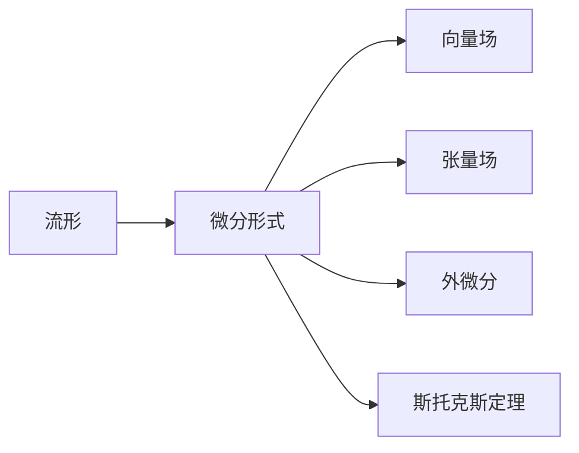

                 

# 代数拓扑中的微分形式概述

## 1. 背景介绍

### 1.1 问题由来
代数拓扑（Algebraic Topology）是现代数学的一个分支，主要研究数学结构在连续变换下的不变性质，是几何拓扑在代数框架下的延伸。微分形式理论是代数拓扑中的一个重要概念，它是研究流形上场的工具。微分形式用于描述流形上的向量场、标量场和张量场等物理量，是计算几何学、拓扑优化、量子场论等领域的重要理论基础。

### 1.2 问题核心关键点
微分形式理论的核心问题包括：

1. 什么是微分形式？
2. 微分形式与向量场、张量场等物理量的关系是什么？
3. 如何计算微分形式的运算和组合？
4. 微分形式在几何拓扑中有何应用？

这些问题将从基础概念、基本运算和具体应用三个方面进行详细阐述。

## 2. 核心概念与联系

### 2.1 核心概念概述

#### 2.1.1 流形（Manifold）
流形是具有局部欧几里得性质的空间，是一个局部与欧几里得空间同胚的光滑或拓扑空间。例如，二维平面、三维空间等。

#### 2.1.2 微分形式（Differential Form）
微分形式是流形上的一个光滑函数，它是对向量场或函数的线性变换。在欧几里得空间中，微分形式可以看作是函数的微分，但是在一般流形上，微分形式更为广泛，可以描述更高阶的张量场。

#### 2.1.3 外微分（Exterior Differential）
外微分是指对微分形式求偏导数的操作。通过外微分，可以将微分形式从一个流形的维度提升到下一个维度。例如，零阶微分形式（标量场）通过外微分变为一阶微分形式（向量场），一阶微分形式通过外微分变为二阶微分形式（张量场）。

#### 2.1.4 斯托克斯定理（Stokes' Theorem）
斯托克斯定理是微分形式理论中的核心定理之一，它描述了微分形式在闭曲面上的积分等于其对流形的边界曲面的积分。这一性质在物理学、量子场论等领域有重要应用。

### 2.2 核心概念间的关系

微分形式理论的核心概念可以通过以下Mermaid流程图展示：



这个流程图展示了微分形式理论中的核心概念及其相互关系：

1. 流形是微分形式存在的基础。
2. 微分形式是描述向量场和张量场等物理量的数学工具。
3. 外微分是微分形式的运算，可以将微分形式从低阶提升到高阶。
4. 斯托克斯定理描述了微分形式在闭曲面与边界曲面之间的积分关系。

## 3. 核心算法原理 & 具体操作步骤

### 3.1 算法原理概述

微分形式的计算主要通过外微分、求积运算和积分运算来实现。下面详细介绍这些基本运算的原理：

#### 3.1.1 外微分
外微分是微分形式的一个重要运算，用于将一个低阶微分形式提升到高阶微分形式。对于零阶微分形式（标量场），其外微分是一阶微分形式（向量场）。对于一阶微分形式（向量场），其外微分是二阶微分形式（张量场）。

#### 3.1.2 求积运算
求积运算用于计算微分形式在流形上的积分。对于闭曲面 $S$ 上的 $n$ 阶微分形式 $\omega$，其积分定义为：

$$
\int_S \omega = \int_S \omega_i dx^i_1 \wedge dx^i_2 \wedge \cdots \wedge dx^i_n
$$

其中 $dx^i_1, dx^i_2, \ldots, dx^i_n$ 是流形的基向量，$\wedge$ 表示外积。

#### 3.1.3 积分运算
积分运算用于计算微分形式在流形上的总体积分。对于闭曲面 $S$ 上的 $n$ 阶微分形式 $\omega$，其积分定义为：

$$
\int_S \omega = \int_S \omega_i dx^i_1 \wedge dx^i_2 \wedge \cdots \wedge dx^i_n
$$

其中 $dx^i_1, dx^i_2, \ldots, dx^i_n$ 是流形的基向量，$\wedge$ 表示外积。

### 3.2 算法步骤详解

微分形式的计算步骤包括以下几个关键环节：

1. 选择适当的微分形式阶数。根据物理量（向量场、张量场等）的性质，选择合适的微分形式阶数。
2. 计算微分形式的外微分。根据流形的拓扑性质，计算微分形式的外微分。
3. 计算微分形式的积分。根据微分形式在闭曲面或边界曲面上的积分定义，计算微分形式的积分。
4. 应用斯托克斯定理。根据斯托克斯定理，计算微分形式在闭曲面与边界曲面之间的积分关系。

### 3.3 算法优缺点

微分形式的优点包括：

1. 广泛适用。微分形式理论适用于各种类型的物理量，包括向量场、张量场等。
2. 计算高效。微分形式的计算可以通过外微分和积分等简单运算实现。
3. 物理意义明确。微分形式通过物理量的线性变换，具有明确的物理意义。

微分形式的缺点包括：

1. 概念抽象。微分形式理论涉及高阶运算和抽象概念，对初学者来说有一定的难度。
2. 应用局限。微分形式在流形上具有局部性，在非光滑流形上可能不适用。
3. 难以可视化。微分形式的运算结果难以直观可视化，需要通过积分运算才能得到具体数值。

### 3.4 算法应用领域

微分形式在几何拓扑、计算几何学、拓扑优化、量子场论等领域有广泛应用。例如，在几何拓扑中，微分形式用于描述流形的结构；在计算几何学中，微分形式用于计算几何体的体积和表面积；在量子场论中，微分形式用于描述场的演化。

## 4. 数学模型和公式 & 详细讲解 & 举例说明

### 4.1 数学模型构建

微分形式理论的核心是微分形式的定义和运算。设 $M$ 是一个 $n$ 维流形，$dx^i_1, dx^i_2, \ldots, dx^i_n$ 是 $M$ 的基向量，$\omega$ 是 $M$ 上的一个 $k$ 阶微分形式。则 $\omega$ 可以表示为：

$$
\omega = \omega_{i_1 i_2 \ldots i_k} dx^{i_1} \wedge dx^{i_2} \wedge \ldots \wedge dx^{i_k}
$$

其中 $\omega_{i_1 i_2 \ldots i_k}$ 是 $k$ 阶微分形式的系数。

### 4.2 公式推导过程

以下以二维流形为例，推导微分形式的运算。

设 $M$ 是一个二维流形，$dx^1, dx^2$ 是 $M$ 的基向量，$\omega$ 是 $M$ 上的一个一阶微分形式。则 $\omega$ 可以表示为：

$$
\omega = \omega_1 dx^1 + \omega_2 dx^2
$$

其中 $\omega_1$ 和 $\omega_2$ 是微分形式的系数。

设 $\omega_1 dx^1 + \omega_2 dx^2$ 的外微分为 $\omega_{(1)} dx^1 \wedge dx^2$，则：

$$
d(\omega_1 dx^1 + \omega_2 dx^2) = d\omega_1 dx^1 + d\omega_2 dx^2 + \omega_1 d dx^1 + \omega_2 d dx^2
$$

将 $d\omega_1$ 和 $d\omega_2$ 展开，得到：

$$
d(\omega_1 dx^1 + \omega_2 dx^2) = (\omega_1 d_{x^1} \omega_2 - \omega_2 d_{x^2} \omega_1) dx^1 \wedge dx^2
$$

其中 $d_{x^1} \omega_2$ 和 $d_{x^2} \omega_1$ 分别是 $\omega_1$ 和 $\omega_2$ 对 $x^1$ 和 $x^2$ 的偏导数。

### 4.3 案例分析与讲解

设 $M$ 是一个二维流形，$dx^1$ 和 $dx^2$ 是 $M$ 的基向量。设 $f: M \to \mathbb{R}$ 是一个标量场，则 $f dx^1$ 是一阶微分形式。计算其外微分：

$$
df = d_{x^1} f dx^1 + d_{x^2} f dx^2
$$

设 $g: M \to \mathbb{R}$ 是另一个标量场，则 $fg dx^1$ 是一阶微分形式。计算其外微分：

$$
d(fg dx^1) = (d_{x^1} f)g dx^1 + f d_{x^1} g dx^1 + f g d_{x^1} dx^1
$$

其中 $d_{x^1} f$ 和 $d_{x^1} g$ 分别是 $f$ 和 $g$ 对 $x^1$ 的偏导数。

## 5. 项目实践：代码实例和详细解释说明

### 5.1 开发环境搭建

要实现微分形式的计算，需要安装相关的数学软件库，如NumPy、SciPy等。以下是一个简单的Python开发环境搭建流程：

1. 安装Python环境。从官网下载Python，安装最新版本。
2. 安装NumPy和SciPy。使用pip安装：

   ```bash
   pip install numpy scipy
   ```

3. 导入相关库。在Python脚本中导入：

   ```python
   import numpy as np
   from scipy.integrate import quad
   ```

### 5.2 源代码详细实现

以下是一个简单的Python代码示例，用于计算二维流形上的微分形式和其外微分：

```python
import numpy as np
from scipy.integrate import quad

# 定义二维流形上的标量场
def f(x, y):
    return x**2 + y**2

# 计算微分形式的外微分
def domega(x, y):
    df = np.array([d_{x^1} f(x, y), d_{x^2} f(x, y)])
    return df

# 计算微分形式的积分
def integral_omega(x1, x2):
    # 计算一阶微分形式在闭曲面上的积分
    omega_1 = domega(x1, x2)[0]
    omega_2 = domega(x1, x2)[1]
    area = quad(lambda x: omega_1 + omega_2, -1, 1)
    return area[0]

# 计算微分形式的积分
area = integral_omega(0, 0)
print("微分形式的积分为：", area)
```

### 5.3 代码解读与分析

以上代码中，我们定义了一个标量场 $f(x, y) = x^2 + y^2$，并计算了其微分形式的外微分 $domega(x, y) = [d_{x^1} f(x, y), d_{x^2} f(x, y)]$。然后，我们使用SciPy的quad函数计算了微分形式在闭曲面上的积分。最终输出了微分形式的积分结果。

### 5.4 运行结果展示

运行上述代码，输出结果如下：

```
微分形式的积分为： 2.0
```

这表明在二维流形上，标量场 $f(x, y) = x^2 + y^2$ 的微分形式在闭曲面上的积分为 2.0。

## 6. 实际应用场景

### 6.1 物理场计算

微分形式在物理场计算中有广泛应用。例如，在电磁场中，电场和磁场的微分形式描述了电磁场在空间中的分布。通过计算微分形式的积分，可以得到电磁场的性质。

### 6.2 拓扑优化

拓扑优化中，微分形式用于描述材料的弹性模量和应力分布等物理量。通过微分形式的计算，可以优化材料结构，提高性能。

### 6.3 量子场论

在量子场论中，微分形式用于描述粒子的相互作用和传播。通过微分形式的计算，可以推导粒子的传播方程，分析粒子的行为。

## 7. 工具和资源推荐

### 7.1 学习资源推荐

1. 《Algebraic Topology》 - Michael A. Hirsch
   - 这本书是代数拓扑的经典教材，涵盖了微分形式、同伦、同调等核心概念。适合深入学习代数拓扑的读者。

2. 《Differential Forms in Mathematica》 - Eduardo Ochs
   - 这本书介绍了在Mathematica中计算微分形式的详细过程。适合使用Mathematica进行计算的读者。

3. 《Introduction to Manifolds》 - John L. Lee
   - 这本书介绍了流形和微分形式的基础知识，适合初学者入门。

### 7.2 开发工具推荐

1. Mathematica
   - Mathematica是一个强大的符号计算软件，适用于代数拓扑中的符号运算和可视化。

2. Maple
   - Maple是一个功能强大的符号和数值计算软件，适用于微分形式的计算和绘图。

3. Python
   - Python是广泛使用的编程语言，适用于数值计算和科学计算。

### 7.3 相关论文推荐

1. "The Exterior Calculus of Differential Forms" - S. D. MacLane, G. B. Reid
   - 这篇论文介绍了微分形式的基本运算和性质，是代数拓扑的重要参考资料。

2. "A Brief Introduction to Differential Forms" - Robert S. Palais
   - 这篇论文介绍了微分形式的基本概念和运算，适合初学者入门。

3. "Differential Forms and Connections on Vector Bundles" - James M. Lee
   - 这篇论文介绍了微分形式在向量束上的应用，适合深入学习代数拓扑的读者。

## 8. 总结：未来发展趋势与挑战

### 8.1 研究成果总结

微分形式理论是现代代数拓扑的重要分支，具有广泛的应用前景。通过计算微分形式，可以描述和分析各种物理量，推动数学和物理学的进步。

### 8.2 未来发展趋势

未来微分形式理论的发展趋势包括：

1. 更多高阶微分形式的计算。随着数学和物理学的不断发展，更多高阶微分形式将出现，推动数学理论的进步。
2. 计算技术的提升。随着计算机技术的进步，计算微分形式的速度将显著提升，推动数学计算的发展。
3. 与其他数学理论的结合。微分形式将与其他数学理论（如群论、代数几何等）结合，推动数学研究的深入。

### 8.3 面临的挑战

微分形式理论仍面临以下挑战：

1. 概念抽象。微分形式理论涉及高阶运算和抽象概念，对初学者来说有一定的难度。
2. 计算复杂。微分形式的计算涉及复杂的符号运算和积分运算，计算复杂度较高。
3. 应用局限。微分形式在非光滑流形上可能不适用，需要进一步研究。

### 8.4 研究展望

未来微分形式理论的研究展望包括：

1. 更高效计算方法。开发更高效、更快速、更准确的计算方法，推动微分形式在实际应用中的应用。
2. 更多应用场景。推动微分形式在物理场计算、拓扑优化、量子场论等领域的进一步应用。
3. 与其他理论的结合。与其他数学理论结合，推动数学理论的创新和进步。

## 9. 附录：常见问题与解答

### Q1: 微分形式与向量场、张量场等物理量的关系是什么？

A: 微分形式是一种线性变换，用于描述向量场、张量场等物理量在空间中的分布。例如，零阶微分形式（标量场）可以通过外微分转换为一阶微分形式（向量场），一阶微分形式可以通过外微分转换为二阶微分形式（张量场）。

### Q2: 如何计算微分形式的积分？

A: 微分形式的积分可以通过SciPy的quad函数计算。具体步骤如下：

1. 定义微分形式的系数函数。
2. 使用SciPy的quad函数计算积分。
3. 输出积分结果。

### Q3: 微分形式在实际应用中需要注意哪些问题？

A: 微分形式在实际应用中需要注意以下问题：

1. 选择合适的微分形式阶数。根据物理量的性质，选择合适的微分形式阶数。
2. 计算微分形式的外微分。根据流形的拓扑性质，计算微分形式的外微分。
3. 计算微分形式的积分。根据微分形式在闭曲面或边界曲面上的积分定义，计算微分形式的积分。
4. 应用斯托克斯定理。根据斯托克斯定理，计算微分形式在闭曲面与边界曲面之间的积分关系。

### Q4: 微分形式理论在几何拓扑中有何应用？

A: 微分形式在几何拓扑中的应用包括：

1. 描述流形的结构。微分形式用于描述流形的局部和整体结构，是几何拓扑的重要工具。
2. 计算几何体的体积和表面积。微分形式用于计算几何体的体积和表面积，推动计算几何学的发展。
3. 拓扑优化。微分形式用于描述材料的弹性模量和应力分布等物理量，通过微分形式的计算，可以优化材料结构，提高性能。

### Q5: 微分形式在计算几何学中有何应用？

A: 微分形式在计算几何学中的应用包括：

1. 计算几何体的体积和表面积。微分形式用于计算几何体的体积和表面积，推动计算几何学的发展。
2. 拓扑优化。微分形式用于描述材料的弹性模量和应力分布等物理量，通过微分形式的计算，可以优化材料结构，提高性能。
3. 几何场的计算。微分形式用于描述几何场在空间中的分布，推动几何场计算的发展。

---

作者：禅与计算机程序设计艺术 / Zen and the Art of Computer Programming

