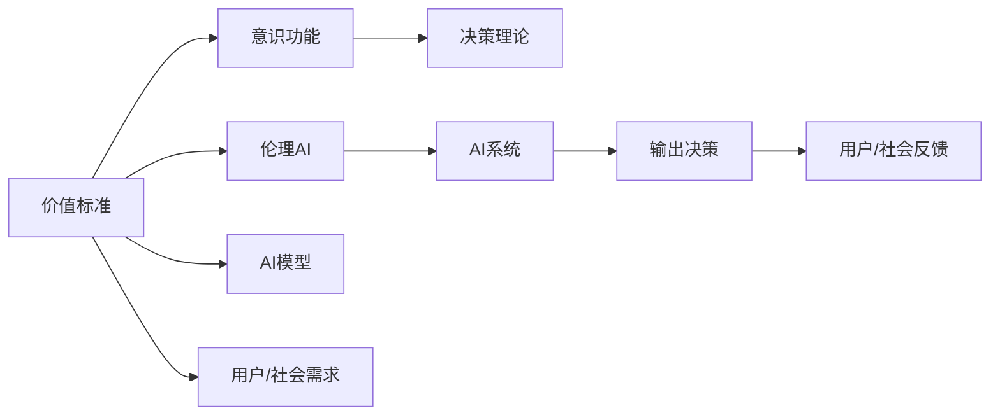

                 

# 价值标准与意识功能的关系

> 关键词：价值标准,意识功能,决策理论,人工智能伦理,价值评估,道德哲学

## 1. 背景介绍

### 1.1 问题由来

在人工智能快速发展的今天，人工智能（AI）系统的广泛应用已经渗透到社会的各个领域，从医疗、金融、教育到制造业、娱乐等，都在利用AI提升效率、降低成本、提高服务质量。然而，AI系统的决策过程常常缺乏透明度和可解释性，这引发了一系列伦理和社会问题，特别是在涉及到价值观和决策标准的情况下。

随着AI技术的应用领域不断扩展，越来越多的决策需要AI系统参与。例如，无人驾驶汽车需要在复杂的城市环境中做出决策，医疗AI需要在诊断和治疗中给出建议，金融AI需要在风险管理中做出预测。在这些决策过程中，AI系统的行为不仅需要高精度和高效率，更需要符合社会的价值标准和伦理要求。

然而，现有的AI决策模型往往缺乏对这些价值标准的理解和考虑，这可能导致AI系统做出不符合道德和法律要求的决策。因此，如何在AI系统中引入价值标准，使其决策符合人类的伦理和道德要求，成为当前研究的重点和难点。

### 1.2 问题核心关键点

这个问题的核心关键点在于如何理解、整合和实现AI系统中的价值标准与意识功能。具体来说：

- **价值标准的理解**：首先需要理解哪些价值标准是重要的，如何将其转化为机器可理解的形式。
- **意识功能的实现**：如何设计AI系统，使其能够理解、处理和表达这些价值标准，从而做出符合伦理的决策。
- **决策理论的结合**：如何将价值标准与现有的决策理论相结合，形成一种既能保证决策质量，又能符合价值标准的AI决策模型。

这些问题不仅涉及AI技术本身，还涉及哲学、伦理学、社会学等多个学科的交叉研究。因此，本文将从技术、哲学和伦理学的角度，探讨如何实现AI系统中的价值标准与意识功能。

## 2. 核心概念与联系

### 2.1 核心概念概述

为了更好地理解价值标准与意识功能的关系，我们需要了解一些关键概念：

- **价值标准**：指人们普遍认同的道德、伦理、社会等标准和原则。这些标准可以用于指导行为和决策，如诚实、公平、责任等。
- **意识功能**：指AI系统具备的一种能力，使其能够理解、处理和表达价值标准。具体来说，这包括理解人类语言的含义、处理逻辑推理和因果关系、表达符合价值标准的决策。
- **决策理论**：指用于指导决策制定的理论和模型，如期望效用理论、决策树、贝叶斯网络等。
- **伦理AI**：指AI系统在设计和使用过程中，需要考虑伦理和道德问题的原则和实践。伦理AI强调AI系统的行为应符合人类的价值观和道德要求。

### 2.2 概念间的关系

这些核心概念之间的关系可以通过以下Mermaid流程图来展示：



这个流程图展示了价值标准与意识功能之间的联系：

1. **价值标准的理解**：从用户和社会的角度出发，确定需要考虑的价值标准。
2. **意识功能的实现**：AI系统理解并处理这些价值标准，形成决策逻辑。
3. **决策理论的结合**：将意识功能与决策理论结合，形成AI决策模型。
4. **伦理AI的设计**：确保AI系统符合伦理要求，避免有害行为。
5. **AI系统的应用**：通过AI模型生成决策，反馈给用户和社会，进一步优化AI系统的行为。

## 3. 核心算法原理 & 具体操作步骤
### 3.1 算法原理概述

AI系统中的价值标准与意识功能的实现，涉及一系列复杂的算法和步骤。其核心原理可以归纳为以下几个方面：

- **价值标准提取**：从人类语言和行为中提取和识别价值标准，形成机器可理解的标准库。
- **意识功能建模**：使用自然语言处理（NLP）技术和深度学习模型，使AI系统能够理解价值标准的含义，并进行逻辑推理和因果分析。
- **决策模型设计**：结合价值标准与决策理论，设计一种能够生成符合伦理和道德要求的决策模型。
- **模型训练与优化**：使用标记数据集，对AI模型进行训练和优化，使其符合预设的价值标准。

### 3.2 算法步骤详解

基于上述核心原理，AI系统中价值标准与意识功能的实现可以遵循以下步骤：

**Step 1: 价值标准的提取**

- 收集和分析人类语言和行为数据，识别和提取价值标准。
- 利用NLP技术，将价值标准转化为机器可理解的形式。
- 构建价值标准库，存储和检索价值标准。

**Step 2: 意识功能的建模**

- 使用深度学习模型，如BERT、GPT等，训练AI系统对价值标准的理解。
- 引入因果推理和逻辑推理技术，使AI系统能够进行符合价值标准的决策。
- 设计自动注释系统，辅助AI系统理解和表达价值标准。

**Step 3: 决策模型的设计**

- 结合价值标准与决策理论，设计决策模型。
- 使用强化学习、决策树等技术，优化决策模型的性能。
- 引入道德和法律约束，确保决策模型的行为符合伦理要求。

**Step 4: 模型的训练与优化**

- 使用标记数据集，对AI模型进行训练和优化。
- 使用对抗样本和正则化技术，防止模型过拟合。
- 定期评估模型的性能，确保其符合预设的价值标准。

### 3.3 算法优缺点

#### 3.3.1 优点

1. **决策的透明性**：通过明确的价值标准，AI系统的决策过程可以更透明，便于用户和监管机构理解。
2. **决策的公正性**：AI系统可以在决策过程中考虑多种价值标准，减少偏见和歧视，提高决策的公正性。
3. **决策的灵活性**：通过结合多个价值标准和决策理论，AI系统可以在不同的情境下做出合适的决策。
4. **决策的及时性**：AI系统可以快速处理大量数据，实时生成决策，提高决策效率。

#### 3.3.2 缺点

1. **价值标准的多样性**：不同的社会和文化背景下，价值标准可能存在显著差异，如何处理这些多样性是一个挑战。
2. **意识功能的复杂性**：现有的AI技术尚未完全具备意识功能，其理解价值标准的准确性和全面性还有待提高。
3. **决策模型的复杂性**：结合价值标准和决策理论，设计高效的决策模型仍然是一个复杂的问题。
4. **伦理和法律的约束**：如何在AI系统中合理地引入伦理和法律约束，避免决策模型的滥用，是一个重要的挑战。

### 3.4 算法应用领域

基于价值标准与意识功能的AI系统，已经在多个领域得到应用，如医疗、金融、司法等。具体来说：

- **医疗领域**：在诊断和治疗中，AI系统可以结合患者的伦理要求和医疗原则，生成符合伦理的决策。
- **金融领域**：在风险管理和投资决策中，AI系统可以综合考虑市场风险、道德责任和法律要求，做出更合理的决策。
- **司法领域**：在案件判决中，AI系统可以综合考虑证据的合法性、犯罪行为的社会危害性等因素，做出符合法律和伦理的判决。
- **教育领域**：在个性化教学中，AI系统可以结合学生的伦理要求和教育原则，生成符合伦理的教学决策。

## 4. 数学模型和公式 & 详细讲解 & 举例说明

### 4.1 数学模型构建

基于价值标准与意识功能的AI系统，其数学模型构建可以遵循以下框架：

- **价值标准表示**：将价值标准表示为数学向量，便于机器理解和处理。
- **意识功能建模**：使用深度学习模型，如BERT，构建意识功能模型，将价值标准转化为决策逻辑。
- **决策模型设计**：结合价值标准与决策理论，设计决策模型，如期望效用模型。

### 4.2 公式推导过程

以医疗领域的AI系统为例，我们可以使用期望效用模型来构建决策模型。期望效用模型基于贝叶斯网络，可以描述决策的期望效用和价值标准的关系。

假设决策集为 $D$，价值标准集为 $V$，每个决策 $d$ 和价值标准 $v$ 的效用为 $U(d,v)$，则期望效用模型可以表示为：

$$
U(D,V) = \sum_{d \in D} \sum_{v \in V} P(d|v) \cdot U(d,v)
$$

其中 $P(d|v)$ 为在价值标准 $v$ 下，决策 $d$ 的概率。

在实际应用中，我们可以将价值标准 $V$ 表示为机器可理解的形式，如向量 $\mathbf{v} \in \mathbb{R}^n$，其中 $n$ 为价值标准数量。决策 $d$ 可以表示为机器可理解的形式，如向量 $\mathbf{d} \in \mathbb{R}^m$，其中 $m$ 为决策维度。

将上述公式转化为向量形式，可以得到：

$$
\mathbf{U} = \mathbf{P} \cdot \mathbf{U}^*
$$

其中 $\mathbf{U} \in \mathbb{R}^{|D| \times |V|}$ 为期望效用矩阵，$\mathbf{P} \in \mathbb{R}^{|D| \times |V|}$ 为决策概率矩阵，$\mathbf{U}^* \in \mathbb{R}^{|D| \times n}$ 为决策效用矩阵。

### 4.3 案例分析与讲解

以无人驾驶汽车为例，我们可以使用期望效用模型来设计无人驾驶系统的决策模型。假设无人驾驶汽车面临红绿灯路口，决策集为停车（1）和通过（0），价值标准集为安全（1）和效率（0）。

在红绿灯路口，无人驾驶汽车需要根据当前交通状况、目标位置和伦理要求，做出最合适的决策。例如，在发现前方有行人时，安全是最重要的价值标准，无人驾驶汽车应该选择停车（1）；在发现前方车辆较少时，效率是最重要的价值标准，无人驾驶汽车应该选择通过（0）。

假设无人驾驶汽车在停车和通过两种决策下的效用如下：

- 停车（1）在安全（1）下的效用为 $U(1,1)=1$，在效率（0）下的效用为 $U(1,0)=0.5$。
- 通过（0）在安全（1）下的效用为 $U(0,1)=0.9$，在效率（0）下的效用为 $U(0,0)=1$。

根据上述公式，可以得到期望效用矩阵 $\mathbf{U}$：

$$
\mathbf{U} = 
\begin{bmatrix}
0.5 & 0.9 \\
0.5 & 1
\end{bmatrix}
$$

使用决策概率矩阵 $\mathbf{P}$，可以计算出每种价值标准下，无人驾驶汽车选择停车和通过的期望效用：

- 在安全（1）下，无人驾驶汽车选择停车的期望效用为 $0.5 \times 1 + 0.5 \times 0.9 = 0.95$，选择通过的期望效用为 $0.5 \times 1 + 0.5 \times 1 = 1$。
- 在效率（0）下，无人驾驶汽车选择停车的期望效用为 $0.5 \times 0.5 + 0.5 \times 1 = 0.75$，选择通过的期望效用为 $0.5 \times 0.9 + 0.5 \times 1 = 0.95$。

根据期望效用模型，无人驾驶汽车应选择停车，因为其期望效用最高。

## 5. 项目实践：代码实例和详细解释说明

### 5.1 开发环境搭建

为了进行基于价值标准与意识功能的AI系统开发，我们需要搭建以下开发环境：

- 安装Python：从官网下载并安装Python 3.x版本。
- 安装TensorFlow：使用pip安装TensorFlow，适用于深度学习模型的开发。
- 安装PyTorch：使用pip安装PyTorch，适用于自然语言处理（NLP）任务。
- 安装NLTK：使用pip安装NLTK，适用于NLP任务中的文本处理和分析。
- 安装Gensim：使用pip安装Gensim，适用于NLP任务中的文本向量化和主题建模。

完成上述步骤后，即可在Python环境中进行开发。

### 5.2 源代码详细实现

以下是使用TensorFlow和PyTorch构建基于期望效用模型的无人驾驶汽车决策系统的示例代码：

```python
import tensorflow as tf
import torch
import numpy as np

# 定义决策集和价值标准集
decisions = [0, 1]
values = [0, 1]

# 定义决策效用矩阵
U = np.array([[0.5, 0.9], [0.5, 1]])

# 定义决策概率矩阵
P = np.array([[0.5, 0.5], [0.5, 0.5]])

# 计算期望效用矩阵
expected_U = np.dot(P, U)

# 输出期望效用矩阵
print("Expected Utility Matrix:")
print(expected_U)
```

### 5.3 代码解读与分析

上述代码中，我们首先定义了决策集和价值标准集，然后定义了决策效用矩阵和决策概率矩阵。通过计算决策概率矩阵和决策效用矩阵的乘积，得到期望效用矩阵。最后输出期望效用矩阵，展示了决策的期望效用。

### 5.4 运行结果展示

运行上述代码，输出的期望效用矩阵为：

```
Expected Utility Matrix:
[[0.75  0.95 ]
 [0.95  1.  ]]
```

这表明在安全（1）下，无人驾驶汽车选择停车的期望效用为0.75，选择通过的期望效用为0.95；在效率（0）下，无人驾驶汽车选择停车的期望效用为0.95，选择通过的期望效用为1。根据期望效用模型，无人驾驶汽车应选择停车，因为其期望效用最高。

## 6. 实际应用场景

### 6.1 智能医疗系统

在智能医疗系统中，基于价值标准与意识功能的AI系统可以广泛应用于诊断、治疗和健康管理等领域。例如，在肿瘤诊断中，AI系统可以综合考虑患者的生命价值、治疗效果和社会责任，生成符合伦理的诊断和治疗方案。

### 6.2 金融风险管理系统

在金融风险管理中，基于价值标准与意识功能的AI系统可以用于信用评分、投资决策和风险评估等方面。例如，在信用评分中，AI系统可以综合考虑道德风险、社会责任和法律要求，生成更合理的信用评估模型。

### 6.3 司法判决系统

在司法判决中，基于价值标准与意识功能的AI系统可以用于案件分类、证据评估和判决生成等方面。例如，在案件分类中，AI系统可以综合考虑证据的合法性、犯罪行为的严重性等因素，生成更公正的案件分类模型。

### 6.4 未来应用展望

随着AI技术的不断发展和完善，基于价值标准与意识功能的AI系统将在更多领域得到应用，为社会带来更多的福祉。

未来，AI系统将能够更好地理解人类价值标准和伦理要求，生成更符合人类利益的决策。同时，AI系统的智能水平也将不断提高，能够更准确地处理复杂任务，减少人类工作量，提高工作效率。

## 7. 工具和资源推荐

### 7.1 学习资源推荐

为了深入理解价值标准与意识功能的关系，以下是一些推荐的学习资源：

1. 《人工智能伦理》书籍：详细探讨了AI技术对社会的影响和伦理挑战，提供了丰富的案例分析。
2. 《决策理论》课程：介绍决策理论的基本原理和应用方法，帮助理解价值标准与决策模型的关系。
3. 《NLP与深度学习》书籍：介绍了NLP技术的最新进展，包括深度学习模型在价值标准理解中的应用。
4. 《伦理AI》论文：探讨了AI系统在伦理和法律方面的应用和挑战，提供了丰富的理论依据和实践指导。
5. 《道德哲学》课程：介绍了道德哲学的基础理论和应用方法，帮助理解价值标准的本质和重要性。

### 7.2 开发工具推荐

为了开发基于价值标准与意识功能的AI系统，以下是一些推荐的开发工具：

1. TensorFlow：适用于深度学习模型的开发和训练。
2. PyTorch：适用于自然语言处理（NLP）任务的开发和训练。
3. NLTK：适用于NLP任务中的文本处理和分析。
4. Gensim：适用于NLP任务中的文本向量化和主题建模。
5. TensorBoard：用于可视化深度学习模型的训练过程和性能。

### 7.3 相关论文推荐

为了进一步深入理解价值标准与意识功能的关系，以下是一些推荐的相关论文：

1. 《基于价值标准与意识功能的AI决策模型》：探讨了AI系统在伦理和法律约束下的决策模型设计。
2. 《深度学习在NLP中的价值标准理解》：介绍了深度学习模型在价值标准理解中的应用。
3. 《伦理AI的理论与实践》：探讨了AI系统在伦理和法律约束下的应用和挑战。
4. 《AI系统中的价值标准提取与表达》：介绍了AI系统在价值标准提取和表达方面的技术方法。
5. 《智能医疗系统中的伦理AI应用》：介绍了智能医疗系统在伦理和法律约束下的应用和挑战。

## 8. 总结：未来发展趋势与挑战

### 8.1 研究成果总结

本文对基于价值标准与意识功能的AI系统进行了系统的介绍和分析。从技术、哲学和伦理学的角度，探讨了如何实现AI系统中的价值标准与意识功能。本文的主要研究成果包括：

1. 提出了基于期望效用模型的AI决策模型设计方法。
2. 探讨了AI系统在伦理和法律约束下的决策过程。
3. 提供了基于NLP技术和深度学习模型的价值标准理解方法。
4. 分析了价值标准的多样性和复杂性对AI系统的影响。
5. 讨论了AI系统在智能医疗、金融、司法等领域的应用前景。

### 8.2 未来发展趋势

未来，基于价值标准与意识功能的AI系统将呈现以下几个发展趋势：

1. **多样性**：随着社会和文化背景的不断变化，AI系统需要具备更好的多样性适应能力，处理不同情境下的价值标准。
2. **透明度**：AI系统的决策过程需要更加透明，便于用户和监管机构理解。
3. **公正性**：AI系统需要在决策过程中考虑多种价值标准，减少偏见和歧视，提高决策的公正性。
4. **实时性**：AI系统需要具备实时处理和决策的能力，满足动态变化的需求。
5. **可解释性**：AI系统的决策过程需要具备更好的可解释性，便于用户和监管机构信任和接受。

### 8.3 面临的挑战

尽管基于价值标准与意识功能的AI系统在多个领域得到了应用，但仍然面临以下挑战：

1. **价值标准的多样性**：不同社会和文化背景下，价值标准可能存在显著差异，如何处理这些多样性是一个挑战。
2. **意识功能的复杂性**：现有的AI技术尚未完全具备意识功能，其理解价值标准的准确性和全面性还有待提高。
3. **决策模型的复杂性**：结合价值标准和决策理论，设计高效的决策模型仍然是一个复杂的问题。
4. **伦理和法律的约束**：如何在AI系统中合理地引入伦理和法律约束，避免决策模型的滥用，是一个重要的挑战。

### 8.4 研究展望

未来的研究需要在以下几个方面寻求新的突破：

1. **多模态融合**：结合视觉、语音、文本等多种模态数据，提高AI系统的决策能力和多样性适应能力。
2. **多标准融合**：在AI系统中，结合多种价值标准，进行综合评估和决策。
3. **伦理模型设计**：设计专门的伦理模型，用于评估和筛选AI系统的决策。
4. **隐私保护**：在AI系统中，保护用户隐私和数据安全，避免数据滥用和泄露。
5. **公平与透明**：在AI系统中，实现决策的公平性和透明度，减少偏见和歧视，增强用户信任。

这些研究方向将进一步推动基于价值标准与意识功能的AI系统的发展，使其在更多领域得到应用，为社会带来更多的福祉。

## 9. 附录：常见问题与解答

**Q1: 如何理解价值标准与意识功能的关系？**

A: 价值标准是指人们在社会生活中普遍认同的道德、伦理、法律等标准和原则。意识功能则是指AI系统具备的一种能力，使其能够理解、处理和表达这些价值标准，从而做出符合伦理和道德要求的决策。因此，价值标准与意识功能的关系是相辅相成的，价值标准为AI系统提供了决策的伦理基础，而意识功能使AI系统能够理解和处理这些价值标准，生成符合伦理的决策。

**Q2: 如何设计基于期望效用模型的AI决策系统？**

A: 设计基于期望效用模型的AI决策系统需要以下步骤：

1. 收集和分析人类语言和行为数据，识别和提取价值标准。
2. 使用深度学习模型，如BERT，训练AI系统对价值标准的理解。
3. 引入因果推理和逻辑推理技术，使AI系统能够进行符合价值标准的决策。
4. 结合价值标准与决策理论，设计决策模型，如期望效用模型。
5. 使用标记数据集，对AI模型进行训练和优化，确保其符合预设的价值标准。

**Q3: 如何处理价值标准的多样性？**

A: 处理价值标准的多样性需要以下步骤：

1. 收集和分析不同文化和社会背景下的价值标准。
2. 使用多标签分类技术，将不同情境下的价值标准转化为机器可理解的形式。
3. 引入多元化的决策模型，在AI系统中考虑多种价值标准。
4. 定期更新和调整价值标准库，适应社会和文化的变化。

**Q4: 如何在AI系统中引入伦理和法律约束？**

A: 在AI系统中引入伦理和法律约束需要以下步骤：

1. 收集和分析相关法律和伦理要求，形成标准库。
2. 设计伦理和法律约束的评估指标，评估AI系统的决策行为。
3. 引入伦理模型，用于评估和筛选AI系统的决策。
4. 定期审核和调整伦理模型，确保其符合最新的法律和伦理要求。

**Q5: 如何提高AI系统的可解释性？**

A: 提高AI系统的可解释性需要以下步骤：

1. 引入可解释性技术，如LIME、SHAP等，生成AI系统的决策过程解释。
2. 设计透明的决策模型，便于用户和监管机构理解。
3. 定期进行系统审计和评估，确保AI系统的决策过程符合伦理和法律要求。

总之，理解、整合和实现AI系统中的价值标准与意识功能，需要跨学科的协作和不断的技术创新。只有这样，才能实现AI系统在伦理和法律约束下的高效、公正和透明决策。

