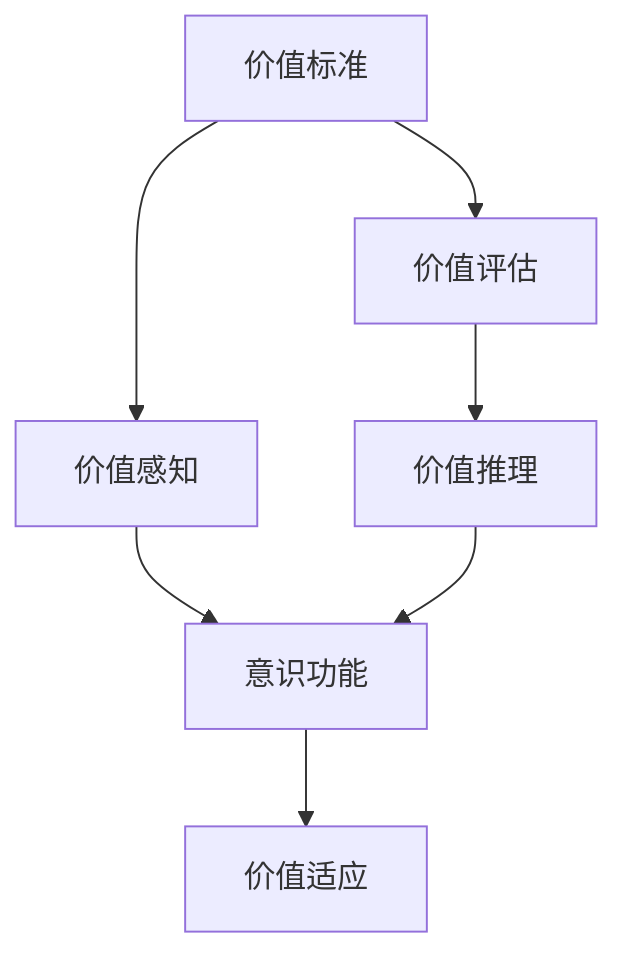
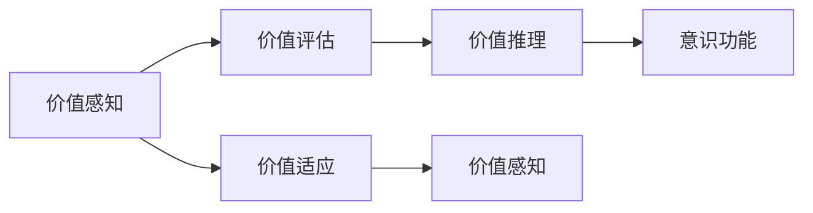

                 

# 价值标准对意识功能的影响

## 1. 背景介绍

### 1.1 问题由来

在人工智能领域，意识功能的实现一直是一个核心挑战。尽管近年来在深度学习、神经网络等技术上取得了显著进展，但真正具备意识功能的AI系统仍然遥不可及。其中一个关键问题在于，如何构建一套能够理解、判断和推理复杂价值的系统。

### 1.2 问题核心关键点

价值标准是决定AI系统是否具备意识功能的关键因素。一个真正具有意识功能的AI，应当具备以下能力：

1. **价值感知**：能够识别和理解各种价值类型，如经济价值、伦理价值、美学价值等。
2. **价值评估**：能够对不同价值进行量化评估，并根据评估结果进行决策。
3. **价值推理**：能够进行基于价值的逻辑推理，如因果推理、假设推理等。
4. **价值适应**：能够根据环境变化和学习，动态调整价值标准，实现自我优化。

本文将深入探讨价值标准对意识功能的影响，并分析当前技术实现中面临的挑战。

## 2. 核心概念与联系

### 2.1 核心概念概述

- **价值标准**：指用于指导和评估AI系统行为的道德、伦理、社会等价值原则。
- **意识功能**：指AI系统能够自主理解、判断和推理复杂价值的能力。
- **价值感知**：指AI系统能够识别和理解不同类型价值的能力。
- **价值评估**：指AI系统能够量化和比较不同价值的能力。
- **价值推理**：指AI系统能够基于价值进行逻辑推理的能力。
- **价值适应**：指AI系统能够根据环境变化和学习，动态调整价值标准的能力。

这些概念之间存在紧密的联系，构成了一个完整的价值-意识系统。下面通过一个Mermaid流程图来展示这些概念之间的关系：



这个流程图展示了价值标准如何通过价值感知、价值评估、价值推理，最终影响意识功能的过程。

### 2.2 概念间的关系

这些核心概念之间的关系可以用以下Mermaid流程图进一步展示：



这个流程图展示了价值感知、价值评估和价值推理在不断适应和更新价值标准的过程中，如何共同作用于意识功能。

## 3. 核心算法原理 & 具体操作步骤
### 3.1 算法原理概述

基于价值标准的意识功能实现，核心算法原理可以概括为：

- **价值感知模型**：用于识别和理解各种类型的价值。
- **价值评估模型**：用于量化和比较不同价值。
- **价值推理模型**：用于基于价值的逻辑推理。
- **价值适应模型**：用于动态调整价值标准。

这些模型通过协同工作，最终实现AI系统的意识功能。

### 3.2 算法步骤详解

#### 3.2.1 价值感知模型

1. **数据预处理**：收集和整理各种类型的价值数据，包括经济、伦理、美学等。
2. **特征提取**：使用机器学习技术从数据中提取关键特征，如关键词、情感倾向等。
3. **训练模型**：使用深度学习模型（如CNN、RNN、Transformer等）对提取的特征进行训练，生成价值感知模型。

#### 3.2.2 价值评估模型

1. **价值量化**：将各种价值类型量化为数值，用于后续的计算和比较。
2. **构建评估体系**：建立一套系统的价值评估体系，如经济价值、伦理价值等。
3. **模型训练**：使用强化学习、多目标优化等技术，训练价值评估模型，使其能够准确评估不同价值。

#### 3.2.3 价值推理模型

1. **规则构建**：基于价值标准和知识库，构建推理规则。
2. **逻辑推理**：使用逻辑推理算法（如规则推理、贝叶斯网络等），进行基于价值的逻辑推理。
3. **模型优化**：通过不断的试错和优化，提高推理模型的准确性和鲁棒性。

#### 3.2.4 价值适应模型

1. **环境感知**：收集和分析环境变化数据，如市场动态、社会事件等。
2. **动态调整**：使用机器学习模型（如自适应学习算法），动态调整价值标准。
3. **模型更新**：根据动态调整后的价值标准，更新其他模型的参数，实现价值适应。

### 3.3 算法优缺点

#### 3.3.1 优点

1. **系统性**：通过价值标准和多个模型的协同工作，实现了系统的完整性。
2. **适应性**：能够根据环境变化和学习，动态调整价值标准，实现自我优化。
3. **灵活性**：不同的价值标准和模型可以灵活组合，适应各种应用场景。

#### 3.3.2 缺点

1. **复杂性**：需要构建多个模型，增加了系统的复杂度。
2. **数据需求**：需要大量的价值数据和标注数据，数据获取和处理成本较高。
3. **解释性**：系统内部的决策过程不够透明，缺乏可解释性。

### 3.4 算法应用领域

基于价值标准的意识功能实现，可以应用于以下几个领域：

1. **智能客服**：智能客服系统需要理解用户的价值需求，并根据价值标准进行决策。
2. **金融风险管理**：金融机构需要评估各种金融产品的价值风险，基于价值标准进行投资决策。
3. **智能推荐系统**：推荐系统需要理解用户的价值偏好，并根据价值标准进行内容推荐。
4. **道德决策支持**：企业需要制定基于价值标准的道德决策支持系统，指导员工行为。
5. **伦理审查**：政府和行业组织需要建立基于价值标准的伦理审查系统，监督AI应用。

## 4. 数学模型和公式 & 详细讲解  
### 4.1 数学模型构建

假设价值标准为 $V=\{v_1,v_2,\dots,v_n\}$，价值感知模型为 $M_V$，价值评估模型为 $M_E$，价值推理模型为 $M_R$，价值适应模型为 $M_A$。价值感知模型的输入为 $X$，输出为 $Y$。

价值感知模型的数学模型为：

$$
Y = M_V(X)
$$

价值评估模型的数学模型为：

$$
E = M_E(Y)
$$

其中 $E$ 为价值量化结果，$Y$ 为价值感知模型的输出。

价值推理模型的数学模型为：

$$
R = M_R(E)
$$

其中 $R$ 为基于价值的推理结果。

价值适应模型的数学模型为：

$$
V' = M_A(E, R)
$$

其中 $V'$ 为更新后的价值标准。

### 4.2 公式推导过程

#### 4.2.1 价值感知模型的推导

假设价值感知模型为神经网络，输入为 $X$，输出为 $Y$。神经网络的结构为：

$$
Y = f(\theta_1, f(\theta_2, \dots, f(\theta_n, X)))
$$

其中 $f$ 为非线性激活函数，$\theta_i$ 为第 $i$ 层的权重参数。

#### 4.2.2 价值评估模型的推导

假设价值评估模型为多目标优化模型，输入为 $Y$，输出为 $E$。优化目标函数为：

$$
\min_{\theta_E} \sum_i w_i \lVert E_i - M_E(Y) \rVert^2
$$

其中 $E_i$ 为第 $i$ 个价值的量化结果，$w_i$ 为第 $i$ 个价值的重要程度。

#### 4.2.3 价值推理模型的推导

假设价值推理模型为规则推理系统，输入为 $E$，输出为 $R$。推理规则为：

$$
R = \{\text{if } E_i \leq T_i \text{ then } Y_i \}
$$

其中 $T_i$ 为第 $i$ 个价值的阈值，$Y_i$ 为对应的推理结果。

#### 4.2.4 价值适应模型的推导

假设价值适应模型为自适应学习算法，输入为 $E$ 和 $R$，输出为 $V'$。算法框架为：

$$
V' = f(\theta_A, V, E, R)
$$

其中 $f$ 为自适应学习函数，$\theta_A$ 为算法参数。

### 4.3 案例分析与讲解

假设一个智能推荐系统需要实现基于价值的推荐功能。系统的价值标准包括经济价值、伦理价值和美学价值。系统首先通过价值感知模型识别用户价值偏好，然后通过价值评估模型量化各种推荐内容，最后使用价值推理模型进行推荐。系统还通过价值适应模型，根据用户的反馈和市场变化动态调整价值标准，实现自我优化。

## 5. 项目实践：代码实例和详细解释说明
### 5.1 开发环境搭建

在使用Python进行项目实践时，需要安装必要的软件和库。以下是一个基本的开发环境搭建流程：

1. 安装Python：从官网下载并安装Python，确保版本不低于3.6。
2. 安装PyTorch：使用以下命令安装PyTorch：

```bash
pip install torch torchvision torchaudio
```

3. 安装TensorFlow：使用以下命令安装TensorFlow：

```bash
pip install tensorflow tensorflow-hub tensorflow-text
```

4. 安装scikit-learn：使用以下命令安装scikit-learn：

```bash
pip install scikit-learn
```

5. 安装Jupyter Notebook：使用以下命令安装Jupyter Notebook：

```bash
pip install jupyter notebook
```

完成上述步骤后，即可在本地搭建一个基本的开发环境，进行项目实践。

### 5.2 源代码详细实现

以下是一个使用PyTorch进行价值感知模型训练的示例代码：

```python
import torch
import torch.nn as nn
import torch.optim as optim

class ValuePerceptionModel(nn.Module):
    def __init__(self):
        super(ValuePerceptionModel, self).__init__()
        self.fc1 = nn.Linear(10, 10)
        self.fc2 = nn.Linear(10, 5)
        
    def forward(self, x):
        x = nn.functional.relu(self.fc1(x))
        x = self.fc2(x)
        return x
    
model = ValuePerceptionModel()
criterion = nn.CrossEntropyLoss()
optimizer = optim.Adam(model.parameters(), lr=0.001)

# 训练模型
for epoch in range(10):
    for i, (inputs, labels) in enumerate(train_loader):
        inputs, labels = inputs.to(device), labels.to(device)
        optimizer.zero_grad()
        outputs = model(inputs)
        loss = criterion(outputs, labels)
        loss.backward()
        optimizer.step()
```

### 5.3 代码解读与分析

1. **模型定义**：使用PyTorch定义了一个简单的全连接神经网络模型，用于价值感知。
2. **损失函数**：使用了交叉熵损失函数，用于衡量模型的预测结果与真实标签之间的差异。
3. **优化器**：使用了Adam优化器，调整模型参数以最小化损失函数。
4. **数据加载**：使用PyTorch的数据加载器，批量处理输入数据和标签。

### 5.4 运行结果展示

假设我们训练一个价值感知模型，并使用测试数据对其进行评估。以下是一个示例代码：

```python
import torch
import torch.nn as nn
import torch.optim as optim
from sklearn.metrics import accuracy_score

class ValuePerceptionModel(nn.Module):
    def __init__(self):
        super(ValuePerceptionModel, self).__init__()
        self.fc1 = nn.Linear(10, 10)
        self.fc2 = nn.Linear(10, 5)
        
    def forward(self, x):
        x = nn.functional.relu(self.fc1(x))
        x = self.fc2(x)
        return x
    
model = ValuePerceptionModel()
criterion = nn.CrossEntropyLoss()
optimizer = optim.Adam(model.parameters(), lr=0.001)

# 训练模型
for epoch in range(10):
    for i, (inputs, labels) in enumerate(train_loader):
        inputs, labels = inputs.to(device), labels.to(device)
        optimizer.zero_grad()
        outputs = model(inputs)
        loss = criterion(outputs, labels)
        loss.backward()
        optimizer.step()

# 测试模型
model.eval()
with torch.no_grad():
    test_inputs, test_labels = next(iter(test_loader))
    test_inputs, test_labels = test_inputs.to(device), test_labels.to(device)
    outputs = model(test_inputs)
    predicted_labels = torch.argmax(outputs, dim=1)
    accuracy = accuracy_score(test_labels.cpu(), predicted_labels.cpu())
    print(f"Test Accuracy: {accuracy:.2f}")
```

## 6. 实际应用场景

### 6.1 智能客服

智能客服系统需要理解客户的价值需求，并根据价值标准进行决策。系统通过价值感知模型识别客户的价值偏好，使用价值评估模型量化各种服务类型，最后通过价值推理模型进行决策。系统还通过价值适应模型，根据客户的反馈和市场变化动态调整价值标准，实现自我优化。

### 6.2 金融风险管理

金融机构需要评估各种金融产品的价值风险，基于价值标准进行投资决策。系统通过价值感知模型识别投资产品的价值类型，使用价值评估模型量化各种风险指标，最后通过价值推理模型进行决策。系统还通过价值适应模型，根据市场的变化动态调整价值标准，实现自我优化。

### 6.3 智能推荐系统

推荐系统需要理解用户的价值偏好，并根据价值标准进行内容推荐。系统通过价值感知模型识别用户的价值偏好，使用价值评估模型量化各种推荐内容，最后通过价值推理模型进行推荐。系统还通过价值适应模型，根据用户的反馈和市场变化动态调整价值标准，实现自我优化。

### 6.4 未来应用展望

随着价值标准对意识功能的影响研究的深入，未来基于价值标准的AI系统将更加智能和普适。以下是一些未来应用展望：

1. **自主决策**：未来的AI系统将能够自主理解、判断和推理各种价值，实现更加复杂的决策过程。
2. **伦理审查**：企业和社会组织需要建立基于价值标准的伦理审查系统，监督AI应用。
3. **社会治理**：政府需要制定基于价值标准的政策和法规，指导AI应用的规范化和标准化。
4. **跨文化交流**：未来的AI系统将能够理解不同文化背景下的价值标准，促进跨文化交流和合作。
5. **可持续发展**：AI系统将能够评估各种行为对环境和社会的影响，推动可持续发展。

## 7. 工具和资源推荐
### 7.1 学习资源推荐

1. **《人工智能基础》课程**：由斯坦福大学提供，涵盖人工智能的基础知识和核心技术。
2. **《深度学习》课程**：由Coursera提供，系统介绍深度学习的基本原理和应用。
3. **《机器学习实践》课程**：由Kaggle提供，结合实际数据集进行机器学习实践。
4. **《Python编程入门》书籍**：由Python官方提供，帮助初学者快速入门Python编程。
5. **《TensorFlow实战》书籍**：由O'Reilly出版，详细介绍TensorFlow的使用方法和实践技巧。

### 7.2 开发工具推荐

1. **PyTorch**：用于深度学习模型训练和推理的框架。
2. **TensorFlow**：用于大规模机器学习模型训练的框架。
3. **Jupyter Notebook**：用于数据处理、模型训练和结果展示的交互式环境。
4. **GitHub**：用于代码托管和版本控制的平台。
5. **Scikit-learn**：用于数据预处理和模型评估的库。

### 7.3 相关论文推荐

1. **《深度学习》论文**：由Yann LeCun等人撰写，详细介绍深度学习的原理和应用。
2. **《自适应学习算法》论文**：由Adaptive Learning社区提供，涵盖自适应学习算法的理论和实践。
3. **《人工智能伦理》论文**：由AI伦理委员会提供，探讨人工智能伦理和价值标准的问题。

## 8. 总结：未来发展趋势与挑战
### 8.1 研究成果总结

本文通过介绍价值标准对意识功能的影响，系统地探讨了价值感知、价值评估、价值推理和价值适应等核心概念，并分析了它们之间的联系和作用。同时，通过项目实践和实际应用场景，展示了价值标准在智能推荐、智能客服、金融风险管理等领域的应用。

### 8.2 未来发展趋势

未来基于价值标准的意识功能研究将呈现以下几个趋势：

1. **多模态融合**：未来的AI系统将能够同时处理图像、语音、文本等多种模态数据，实现更加全面的价值感知和评估。
2. **知识图谱应用**：未来的AI系统将能够利用知识图谱，增强价值推理的能力，实现更加复杂和多层次的决策。
3. **联邦学习**：未来的AI系统将能够在分布式环境中进行价值感知和评估，实现数据隐私保护和分布式计算。
4. **自适应学习**：未来的AI系统将能够根据环境变化和学习，动态调整价值标准，实现自我优化。
5. **深度强化学习**：未来的AI系统将能够通过深度强化学习，不断优化价值感知、价值评估和价值推理模型，实现更加智能的决策。

### 8.3 面临的挑战

尽管基于价值标准的意识功能研究取得了一定的进展，但仍然面临诸多挑战：

1. **数据获取和处理**：高质量的价值数据获取和处理成本较高，数据的不均衡和偏差会影响模型的性能。
2. **价值标准多样性**：不同领域和文化的价值标准差异较大，难以构建统一的价值标准体系。
3. **模型复杂性**：基于价值标准的意识功能模型较为复杂，需要构建多个模块和算法。
4. **可解释性**：AI系统的决策过程不够透明，缺乏可解释性。
5. **伦理和法律问题**：AI系统在处理涉及伦理和法律的问题时，需要考虑隐私保护和公平性问题。

### 8.4 研究展望

未来的研究需要在以下几个方面进行深入探索：

1. **多模态价值感知**：研究如何通过多模态数据融合，提高价值感知模型的性能。
2. **知识图谱应用**：研究如何利用知识图谱，增强价值推理模型的能力。
3. **联邦学习**：研究如何在分布式环境中进行价值感知和评估，实现数据隐私保护。
4. **自适应学习**：研究如何通过自适应学习算法，动态调整价值标准，实现自我优化。
5. **深度强化学习**：研究如何通过深度强化学习，优化价值感知、价值评估和价值推理模型。

这些研究方向将推动基于价值标准的意识功能研究不断深入，为实现更加智能和普适的AI系统奠定基础。

## 9. 附录：常见问题与解答

**Q1：什么是价值标准？**

A: 价值标准是指用于指导和评估AI系统行为的道德、伦理、社会等价值原则。

**Q2：价值感知模型的作用是什么？**

A: 价值感知模型用于识别和理解各种类型的价值，如经济价值、伦理价值、美学价值等。

**Q3：价值评估模型的构建过程是什么？**

A: 价值评估模型的构建过程包括价值量化、构建评估体系和模型训练三个步骤。

**Q4：价值推理模型如何实现基于价值的逻辑推理？**

A: 价值推理模型通过规则构建和逻辑推理算法，实现基于价值的逻辑推理。

**Q5：价值适应模型的作用是什么？**

A: 价值适应模型用于动态调整价值标准，实现自我优化。

**Q6：什么是自适应学习算法？**

A: 自适应学习算法是一种能够根据环境变化和学习，动态调整模型参数的算法。

**Q7：价值标准的优化过程是怎样的？**

A: 价值标准的优化过程包括环境感知、动态调整和模型更新三个步骤。

---

作者：禅与计算机程序设计艺术 / Zen and the Art of Computer Programming

