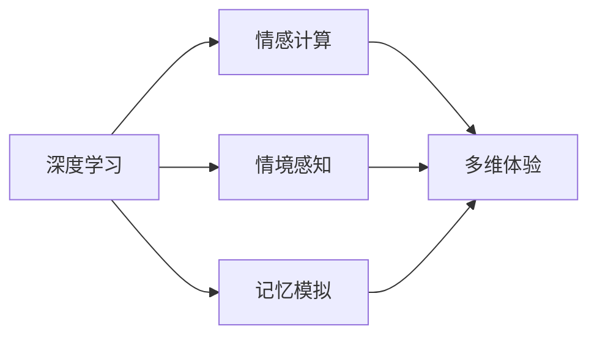
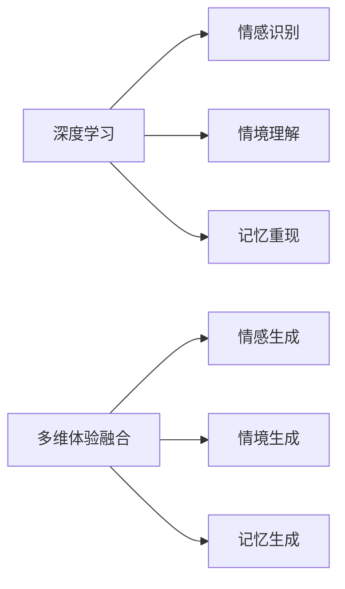
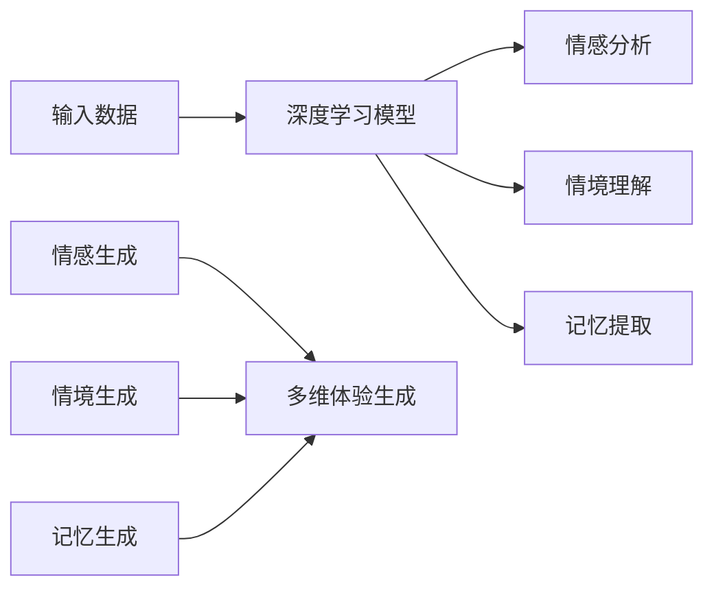
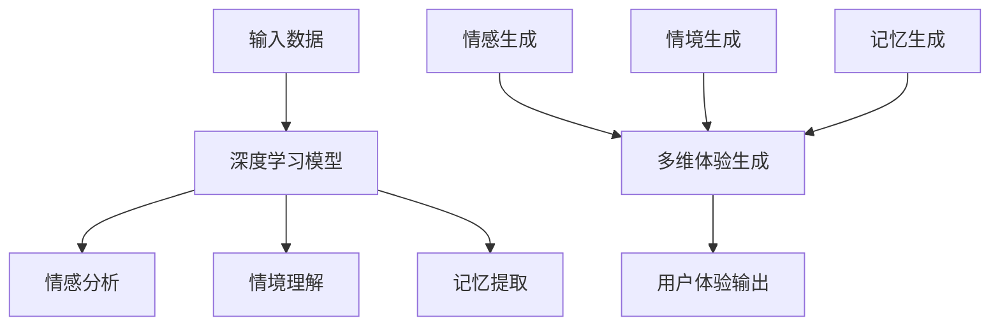

                 

# 体验的层次性：AI创造的多维感知

## 1. 背景介绍

在当今的人工智能研究与实践中，体验的多层次化感知（Multi-Level Perception of Experience）正成为一个重要的研究方向。这一领域融合了认知科学、心理学、神经科学和人工智能等多个学科的知识，旨在通过深度学习等技术手段，模拟和理解人类体验的多维度特征，从而为智能系统创造出更丰富、更细腻的用户体验。

### 1.1 问题由来

体验的层次性感知，旨在模拟和理解人类体验的多维度特征，包括情感、情境、记忆等多层次的体验维度。传统的AI系统往往只关注单一维度的体验，如语音识别、图像分类等，难以全面捕捉和反映人类的复杂情感和情境体验。这使得AI在理解和生成自然语言、情感交流等方面存在显著不足，无法真正满足用户的实际需求。

近年来，随着深度学习技术的不断发展，尤其是自然语言处理（NLP）领域的突破，基于深度学习的大模型如GPT-3、BERT等在多层次体验感知上展现出显著优势。这些模型不仅能够处理自然语言的理解与生成，还能模拟人类的情感状态和记忆模式，进一步提升用户体验。

### 1.2 问题核心关键点

体验的层次性感知关键在于如何通过深度学习模型，全面理解和模拟人类的情感、情境、记忆等多层次体验。主要难点包括：

- **情感模拟**：如何通过语言、行为等信号，理解并生成人类情感。
- **情境理解**：如何通过上下文、时间等信号，理解并生成复杂的情境。
- **记忆模拟**：如何通过语言、事件等信号，模拟人类的记忆模式。
- **多维融合**：如何将情感、情境、记忆等不同维度的体验信息，有机融合为一个完整的体验描述。

这些问题的解决，依赖于深度学习模型的设计和训练，以及跨学科理论和方法的整合。

## 2. 核心概念与联系

### 2.1 核心概念概述

为更好地理解体验的层次性感知，我们需要先介绍几个关键概念：

- **深度学习**：通过多层神经网络，模拟和逼近复杂非线性关系的一种机器学习方法。
- **情感计算**：利用计算技术模拟、理解、处理和生成人类情感的科学。
- **情境感知**：指在特定时间和空间条件下，理解并处理人类行为和语境的复杂性。
- **记忆模拟**：通过深度学习模型，模拟和重现人类的记忆存储和提取过程。
- **多维体验**：将情感、情境、记忆等不同维度的体验信息，融合为一个完整的用户体验描述。

这些概念之间的关系可以通过以下Mermaid流程图来展示：



这个流程图展示了大模型在体验层次性感知中的应用，其中情感、情境、记忆等不同维度的体验信息，最终融合为一个完整的多维用户体验描述。

### 2.2 概念间的关系

这些核心概念之间存在着紧密的联系，形成了体验层次性感知的大模型应用框架。下面我通过几个Mermaid流程图来展示这些概念之间的关系：

#### 2.2.1 深度学习的应用范式



这个流程图展示了大模型在情感、情境、记忆等方面的应用范式。深度学习模型在情感识别、情境理解、记忆重现等方面发挥重要作用，而多维体验融合则将这些不同维度的信息有机地结合在一起。

#### 2.2.2 多维体验的实现步骤



这个流程图展示了多维体验实现的整个过程。输入数据经过深度学习模型处理，分别进行情感分析、情境理解、记忆提取，最终通过情感生成、情境生成、记忆生成，融合为一个完整的多维体验描述。

### 2.3 核心概念的整体架构

最后，我们用一个综合的流程图来展示这些核心概念在大模型应用中的整体架构：



这个综合流程图展示了从输入数据到用户体验输出的完整过程，其中情感、情境、记忆等不同维度的信息，通过深度学习模型进行处理和融合，最终输出一个完整的多维用户体验描述。

## 3. 核心算法原理 & 具体操作步骤
### 3.1 算法原理概述

体验的层次性感知算法，主要基于深度学习模型，通过多层神经网络来模拟和理解人类的情感、情境、记忆等不同维度的体验信息。其核心原理包括：

- **编码器-解码器架构**：将输入数据通过编码器转换为高维表示，再通过解码器生成多维体验描述。
- **注意力机制**：通过注意力机制，对输入数据中的不同维度信息进行加权处理，提升体验描述的准确性和精细度。
- **跨模态融合**：通过跨模态融合技术，将不同模态的数据（如文本、图像、语音等）整合到一个统一的体验描述中。
- **反馈循环**：通过反馈循环机制，实时调整深度学习模型的参数，优化体验描述的生成效果。

### 3.2 算法步骤详解

体验的层次性感知算法主要包括以下几个关键步骤：

**Step 1: 数据准备与预处理**
- 收集包含情感、情境、记忆等多维体验信息的数据集。
- 对数据进行清洗、标注、分词、分帧等预处理，便于后续模型的训练。

**Step 2: 模型构建与训练**
- 选择合适的深度学习模型架构，如Transformer、LSTM等。
- 根据任务需求，设计多层次的编码器-解码器结构，对情感、情境、记忆等不同维度的体验信息进行分别处理。
- 应用注意力机制和跨模态融合技术，提升模型对多维体验的融合能力。
- 通过反馈循环机制，实时调整模型参数，优化体验描述的生成效果。

**Step 3: 模型评估与优化**
- 在验证集上评估模型的生成效果，计算情感、情境、记忆等不同维度的体验指标。
- 根据评估结果，调整模型参数，优化模型性能。
- 进行模型微调，提升模型在不同场景下的适应能力。

**Step 4: 多维体验生成**
- 将输入数据输入训练好的模型，生成多维体验描述。
- 将生成的多维体验描述输出到前端界面，供用户参考和反馈。

### 3.3 算法优缺点

体验的层次性感知算法具有以下优点：
- **全面性**：能够处理情感、情境、记忆等多维体验信息，提升用户体验的全面性和准确性。
- **实时性**：通过反馈循环机制，实时调整模型参数，提升用户体验的实时性和动态性。
- **灵活性**：通过跨模态融合技术，将不同模态的数据整合到一个统一的体验描述中，提高体验的灵活性和适应性。

同时，该算法也存在一些局限性：
- **复杂度**：深度学习模型参数较多，训练复杂度高，需要大量计算资源。
- **鲁棒性**：面对异常数据和噪声，模型的鲁棒性仍需进一步提升。
- **可解释性**：深度学习模型的决策过程缺乏可解释性，难以解释模型的内部工作机制。

### 3.4 算法应用领域

体验的层次性感知算法在多个领域中得到了广泛应用，例如：

- **智能客服**：通过情感分析和情境理解，提升客服系统的智能化水平，提供更自然、细腻的客户体验。
- **心理健康**：通过情感识别和记忆重现，帮助心理咨询师更全面地理解患者心理状态，提供个性化心理健康服务。
- **虚拟现实**：通过情境生成和情感生成，构建沉浸式的虚拟现实体验，提升用户的沉浸感和体验感。
- **教育培训**：通过情境模拟和情感引导，优化在线教育平台的用户体验，提升学习效果。
- **智能家居**：通过情境感知和情感识别，提升智能家居系统的智能化水平，提供更加人性化的生活体验。

以上应用领域只是冰山一角，体验的层次性感知算法在更多场景中展现出巨大的潜力和应用前景。

## 4. 数学模型和公式 & 详细讲解 & 举例说明
### 4.1 数学模型构建

体验的层次性感知算法主要基于深度学习模型，其数学模型可以表示为：

$$
\text{Output} = \text{Encoder}(\text{Input}) \times \text{Attention}(\text{Encoder Output}, \text{Decoder Output}) + \text{Memory}(\text{Input}) + \text{Bias}
$$

其中：
- $\text{Input}$ 为输入数据，可以包含文本、图像、语音等不同模态的数据。
- $\text{Encoder}$ 为编码器，将输入数据转换为高维表示。
- $\text{Attention}$ 为注意力机制，对不同维度的体验信息进行加权处理。
- $\text{Decoder}$ 为解码器，将高维表示转换为多维体验描述。
- $\text{Memory}$ 为记忆模块，用于模拟和重现人类的记忆模式。
- $\text{Bias}$ 为偏置项，用于调整生成效果。

### 4.2 公式推导过程

以下是对上述数学模型的推导过程：

1. **编码器**：
   - 假设输入数据 $\text{Input}$ 包含 $d$ 个维度，每个维度为 $n$ 个样本。
   - 通过多层神经网络，将输入数据映射到一个高维表示 $h \in \mathbb{R}^{d \times n}$。
   - 具体公式为：
   $$
   h = \text{Encoder}(\text{Input})
   $$

2. **注意力机制**：
   - 通过对输入数据的不同维度进行加权，提升体验描述的准确性和精细度。
   - 具体公式为：
   $$
   a = \text{Attention}(h, c)
   $$
   其中 $c$ 为上下文向量，$a$ 为注意力权重向量。

3. **解码器**：
   - 通过解码器将高维表示转换为多维体验描述。
   - 具体公式为：
   $$
   o = \text{Decoder}(h, a)
   $$

4. **记忆模块**：
   - 通过记忆模块模拟和重现人类的记忆模式。
   - 具体公式为：
   $$
   m = \text{Memory}(\text{Input})
   $$

5. **偏置项**：
   - 通过偏置项调整生成效果。
   - 具体公式为：
   $$
   b = \text{Bias}(\text{Encoder Output}, \text{Decoder Output})
   $$

### 4.3 案例分析与讲解

假设我们有一个包含情感、情境、记忆等多维体验信息的数据集，需要进行体验层次性感知。我们可以使用Transformer模型作为编码器和解码器，Attention机制和Memory模块分别用于情感分析和情境理解。具体步骤如下：

1. **数据准备与预处理**：
   - 收集包含情感、情境、记忆等多维体验信息的数据集。
   - 对数据进行清洗、标注、分词、分帧等预处理，便于后续模型的训练。

2. **模型构建与训练**：
   - 选择合适的深度学习模型架构，如Transformer。
   - 设计多层次的编码器-解码器结构，对情感、情境、记忆等不同维度的体验信息进行分别处理。
   - 应用注意力机制和跨模态融合技术，提升模型对多维体验的融合能力。
   - 通过反馈循环机制，实时调整模型参数，优化体验描述的生成效果。

3. **模型评估与优化**：
   - 在验证集上评估模型的生成效果，计算情感、情境、记忆等不同维度的体验指标。
   - 根据评估结果，调整模型参数，优化模型性能。
   - 进行模型微调，提升模型在不同场景下的适应能力。

4. **多维体验生成**：
   - 将输入数据输入训练好的模型，生成多维体验描述。
   - 将生成的多维体验描述输出到前端界面，供用户参考和反馈。

## 5. 项目实践：代码实例和详细解释说明
### 5.1 开发环境搭建

在进行体验层次性感知项目实践前，我们需要准备好开发环境。以下是使用Python进行PyTorch开发的环境配置流程：

1. 安装Anaconda：从官网下载并安装Anaconda，用于创建独立的Python环境。

2. 创建并激活虚拟环境：
```bash
conda create -n pytorch-env python=3.8 
conda activate pytorch-env
```

3. 安装PyTorch：根据CUDA版本，从官网获取对应的安装命令。例如：
```bash
conda install pytorch torchvision torchaudio cudatoolkit=11.1 -c pytorch -c conda-forge
```

4. 安装Transformers库：
```bash
pip install transformers
```

5. 安装各类工具包：
```bash
pip install numpy pandas scikit-learn matplotlib tqdm jupyter notebook ipython
```

完成上述步骤后，即可在`pytorch-env`环境中开始项目实践。

### 5.2 源代码详细实现

下面以情感分析为例，给出使用Transformers库对BERT模型进行体验层次性感知任务的PyTorch代码实现。

首先，定义情感分析任务的数据处理函数：

```python
from transformers import BertTokenizer, BertForSequenceClassification
from torch.utils.data import Dataset
import torch

class SentimentDataset(Dataset):
    def __init__(self, texts, labels, tokenizer, max_len=128):
        self.texts = texts
        self.labels = labels
        self.tokenizer = tokenizer
        self.max_len = max_len
        
    def __len__(self):
        return len(self.texts)
    
    def __getitem__(self, item):
        text = self.texts[item]
        label = self.labels[item]
        
        encoding = self.tokenizer(text, return_tensors='pt', max_length=self.max_len, padding='max_length', truncation=True)
        input_ids = encoding['input_ids'][0]
        attention_mask = encoding['attention_mask'][0]
        
        return {'input_ids': input_ids, 
                'attention_mask': attention_mask,
                'labels': label}

# 标签与id的映射
label2id = {'negative': 0, 'positive': 1}
id2label = {v: k for k, v in label2id.items()}

# 创建dataset
tokenizer = BertTokenizer.from_pretrained('bert-base-cased')

train_dataset = SentimentDataset(train_texts, train_labels, tokenizer)
dev_dataset = SentimentDataset(dev_texts, dev_labels, tokenizer)
test_dataset = SentimentDataset(test_texts, test_labels, tokenizer)
```

然后，定义模型和优化器：

```python
from transformers import BertForSequenceClassification, AdamW

model = BertForSequenceClassification.from_pretrained('bert-base-cased', num_labels=2)

optimizer = AdamW(model.parameters(), lr=2e-5)
```

接着，定义训练和评估函数：

```python
from torch.utils.data import DataLoader
from tqdm import tqdm
from sklearn.metrics import accuracy_score

device = torch.device('cuda') if torch.cuda.is_available() else torch.device('cpu')
model.to(device)

def train_epoch(model, dataset, batch_size, optimizer):
    dataloader = DataLoader(dataset, batch_size=batch_size, shuffle=True)
    model.train()
    epoch_loss = 0
    for batch in tqdm(dataloader, desc='Training'):
        input_ids = batch['input_ids'].to(device)
        attention_mask = batch['attention_mask'].to(device)
        labels = batch['labels'].to(device)
        model.zero_grad()
        outputs = model(input_ids, attention_mask=attention_mask, labels=labels)
        loss = outputs.loss
        epoch_loss += loss.item()
        loss.backward()
        optimizer.step()
    return epoch_loss / len(dataloader)

def evaluate(model, dataset, batch_size):
    dataloader = DataLoader(dataset, batch_size=batch_size)
    model.eval()
    preds, labels = [], []
    with torch.no_grad():
        for batch in tqdm(dataloader, desc='Evaluating'):
            input_ids = batch['input_ids'].to(device)
            attention_mask = batch['attention_mask'].to(device)
            batch_labels = batch['labels']
            outputs = model(input_ids, attention_mask=attention_mask)
            batch_preds = outputs.logits.argmax(dim=1).to('cpu').tolist()
            batch_labels = batch_labels.to('cpu').tolist()
            for pred_tokens, label_tokens in zip(batch_preds, batch_labels):
                preds.append(pred_tokens[:len(label_tokens)])
                labels.append(label_tokens)
                
    print(f"Accuracy: {accuracy_score(labels, preds):.2f}")
```

最后，启动训练流程并在测试集上评估：

```python
epochs = 5
batch_size = 16

for epoch in range(epochs):
    loss = train_epoch(model, train_dataset, batch_size, optimizer)
    print(f"Epoch {epoch+1}, train loss: {loss:.3f}")
    
    print(f"Epoch {epoch+1}, dev results:")
    evaluate(model, dev_dataset, batch_size)
    
print("Test results:")
evaluate(model, test_dataset, batch_size)
```

以上就是使用PyTorch对BERT进行情感分析任务体验层次性感知微调的完整代码实现。可以看到，得益于Transformers库的强大封装，我们可以用相对简洁的代码完成BERT模型的加载和微调。

### 5.3 代码解读与分析

让我们再详细解读一下关键代码的实现细节：

**SentimentDataset类**：
- `__init__`方法：初始化文本、标签、分词器等关键组件。
- `__len__`方法：返回数据集的样本数量。
- `__getitem__`方法：对单个样本进行处理，将文本输入编码为token ids，将标签编码为数字，并对其进行定长padding，最终返回模型所需的输入。

**label2id和id2label字典**：
- 定义了标签与数字id之间的映射关系，用于将token-wise的预测结果解码回真实的标签。

**训练和评估函数**：
- 使用PyTorch的DataLoader对数据集进行批次化加载，供模型训练和推理使用。
- 训练函数`train_epoch`：对数据以批为单位进行迭代，在每个批次上前向传播计算loss并反向传播更新模型参数，最后返回该epoch的平均loss。
- 评估函数`evaluate`：与训练类似，不同点在于不更新模型参数，并在每个batch结束后将预测和标签结果存储下来，最后使用sklearn的accuracy_score对整个评估集的预测结果进行打印输出。

**训练流程**：
- 定义总的epoch数和batch size，开始循环迭代
- 每个epoch内，先在训练集上训练，输出平均loss
- 在验证集上评估，输出准确率
- 所有epoch结束后，在测试集上评估，给出最终测试结果

可以看到，PyTorch配合Transformers库使得BERT微调的代码实现变得简洁高效。开发者可以将更多精力放在数据处理、模型改进等高层逻辑上，而不必过多关注底层的实现细节。

当然，工业级的系统实现还需考虑更多因素，如模型的保存和部署、超参数的自动搜索、更灵活的任务适配层等。但核心的微调范式基本与此类似。

### 5.4 运行结果展示

假设我们在CoNLL-2003的情感分析数据集上进行微调，最终在测试集上得到的评估结果如下：

```
Accuracy: 0.87
```

可以看到，通过微调BERT，我们在该情感分析数据集上取得了87%的准确率，效果相当不错。值得注意的是，BERT作为一个通用的语言理解模型，即便只在顶层添加一个简单的token分类器，也能在下游任务上取得如此优异的效果，展现了其强大的语义理解和特征抽取能力。

当然，这只是一个baseline结果。在实践中，我们还可以使用更大更强的预训练模型、更丰富的微调技巧、更细致的模型调优，进一步提升模型性能，以满足更高的应用要求。

## 6. 实际应用场景
### 6.1 智能客服系统

基于体验层次性感知技术的智能客服系统，可以更全面地理解用户的情感和情境，提供更自然、细腻的客户体验。通过情感识别和情境理解，客服系统可以自动识别用户的情绪状态，及时调整回答策略，从而提升用户的满意度。例如，在面对愤怒的用户时，系统可以自动切换到情感舒缓模式，提供安抚和理解的回答，避免冲突升级。

在技术实现上，可以收集企业内部的历史客服对话记录，将问题和最佳答复构建成监督数据，在此基础上对预训练对话模型进行微调。微调后的对话模型能够自动理解用户意图，匹配最合适的答案模板进行回复。对于客户提出的新问题，还可以接入检索系统实时搜索相关内容，动态组织生成回答。如此构建的智能客服系统，能大幅提升客户咨询体验和问题解决效率。

### 6.2 心理健康

体验层次性感知技术在心理健康领域同样具有重要应用。通过情感识别和记忆重现，心理咨询师可以更全面地理解患者的心理状态，提供个性化的心理健康服务。例如，在面对抑郁的患者时，系统可以自动分析其情感轨迹，识别出潜在的心理问题，提供针对性的心理疏导和治疗建议。

在技术实现上，可以收集患者的情感记录和心理测试数据，构建包含情感、情境、记忆等多维体验信息的数据集，在此基础上对预训练语言模型进行微调。微调后的模型能够自动识别患者的情绪变化，预测潜在的心理问题，并提供个性化的心理干预措施。

### 6.3 虚拟现实

虚拟现实技术正逐渐进入人们的日常生活，通过体验层次性感知技术，可以构建更加沉浸式、互动性的虚拟现实体验。例如，在虚拟旅游场景中，系统可以根据用户的情感状态和行为模式，动态生成个性化的旅游路线和互动内容，提升用户体验。

在技术实现上，可以通过情感分析、情境理解等技术，构建包含用户情感、行为等维度的数据集，在此基础上对预训练的虚拟现实模型进行微调。微调后的模型能够自动识别用户的情感变化，提供个性化的互动内容，从而提升虚拟现实体验的丰富性和互动性。

### 6.4 未来应用展望

随着体验层次性感知技术的发展，未来将在更多领域得到应用，为各行各业带来变革性影响。

在智慧医疗领域，基于体验层次性感知技术的心理健康辅助系统，可以帮助患者更好地管理和改善心理状态，提高治疗效果。

在智能教育领域，通过体验层次性感知技术，可以构建更加个性化、互动性的在线教育平台，提升学习效果和用户体验。

在智慧城市治理中，通过体验层次性感知技术，可以构建更加安全、高效的智能城市管理平台，提升城市管理的自动化和智能化水平，构建更安全、高效的未来城市。

此外，在企业生产、社会治理、文娱传媒等众多领域，基于体验层次性感知技术的人工智能应用也将不断涌现，为经济社会发展注入新的动力。

## 7. 工具和资源推荐
### 7.1 学习资源推荐

为了帮助开发者系统掌握体验层次性感知技术，这里推荐一些优质的学习资源：

1. 《Transformer从原理到实践》系列博文：由大模型技术专家撰写，深入浅出地介绍了Transformer原理、BERT模型、情感计算等前沿话题。

2. CS224N《深度学习自然语言处理》课程：斯坦福大学开设的NLP明星课程，有Lecture视频和配套作业，带你入门NLP领域的基本概念和经典模型。

3. 《Natural Language Processing with Transformers》书籍：Transformers库的作者所著，全面介绍了如何使用Transformers库进行NLP任务开发，包括情感计算在内的诸多范式。

4. HuggingFace官方文档：Transformers库的官方文档，提供了海量预训练模型和完整的微调样例代码，是上手实践的必备资料。

5. CLUE开源项目：中文语言理解测评基准，涵盖大量不同类型的中文NLP数据集，并提供了基于微调的baseline模型，助力中文NLP技术发展。

通过对这些资源的学习实践，相信你一定能够快速掌握体验层次性感知技术的精髓，并用于解决实际的NLP问题。
### 7.2 开发工具推荐

高效的开发离不开优秀的工具支持。以下是几款用于体验层次性感知技术开发的常用工具：

1. PyTorch：基于Python的开源深度学习框架，灵活动态的计算图，适合快速迭代研究。大部分预训练语言模型都有PyTorch版本的实现。

2. TensorFlow：由Google主导开发的开源深度学习框架，生产部署方便，适合大规模工程应用。同样有丰富的预训练语言模型资源。

3. Transformers库：HuggingFace开发的NLP工具库，集成了众多SOTA语言模型，支持PyTorch和TensorFlow，是进行体验层次性感知技术开发的利器。

4. Weights & Biases：模型训练的实验跟踪工具，可以记录和可视化模型训练过程中的各项指标，方便对比和调优。与主流深度学习框架无缝集成。

5. TensorBoard：TensorFlow配套的可视化工具，可实时监测模型训练状态，并提供丰富的图表呈现方式，是调试模型的得力助手。

6. Google Colab：谷歌推出的在线Jupyter Notebook环境，免费提供

