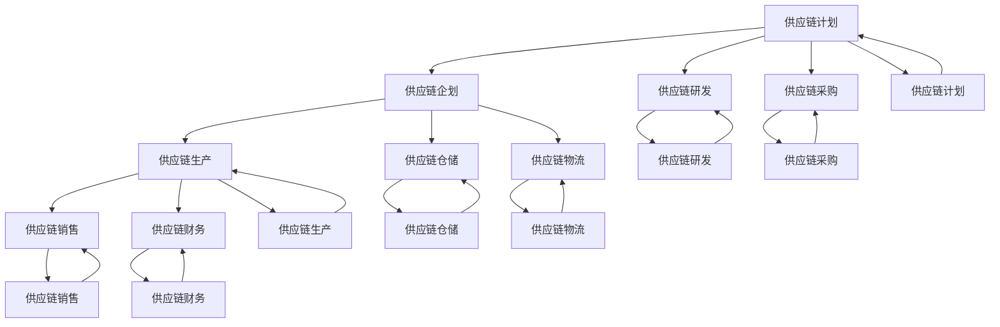

                 

# 供应链计划、企划、研发、采购、生产、仓储、库存、物流、销售、财务系统产品设计

## 1. 背景介绍

### 1.1 问题由来
供应链管理是现代企业中极为关键的一个环节，涉及到从原材料采购到最终产品销售的整个过程。供应链管理的目标是优化流程、降低成本、提高效率，确保企业能够以最低的成本生产出高质量的产品，并在最短的时间内交付给客户。然而，在实际运行中，由于供应链环节众多、流程复杂，导致信息传递不畅、决策难以优化，这些问题严重制约了企业的发展。

### 1.2 问题核心关键点
供应链管理涉及的关键问题主要包括：
- 供应链计划：制定生产、采购和库存计划，确保物料和资金的有效使用。
- 供应链企划：分析市场需求和生产能力，制定合理的生产计划。
- 供应链研发：产品研发过程中需要考虑供应链因素，确保材料供应和生产流程的顺畅。
- 供应链采购：选择供应商、采购材料，确保质量、价格和交货期。
- 供应链生产：管理生产过程，确保产品质量和生产效率。
- 供应链仓储：管理仓库库存，确保物料充足、流动顺畅。
- 供应链物流：管理运输和配送，确保产品及时到达客户手中。
- 供应链销售：管理销售流程，确保客户满意度。
- 供应链财务：管理供应链相关的财务数据，确保资金流和成本控制。

### 1.3 问题研究意义
解决上述问题的关键在于构建一个高效、可控、智能的供应链管理系统。通过系统化的方法，将供应链中的各个环节整合在一起，实现信息共享、流程优化和决策支持，从而提升企业的整体竞争力。

## 2. 核心概念与联系

### 2.1 核心概念概述

供应链管理涉及的核心概念包括：
- 供应链计划(Supply Chain Planning, SCP)：通过预测市场需求、物料可用性等因素，制定生产、采购和库存计划。
- 供应链企划(Supply Chain Scheduling, SCS)：根据供应链计划和市场需求，制定详细的生产计划。
- 供应链研发(Supply Chain Development, SCPD)：产品研发过程中需要考虑供应链因素，确保材料供应和生产流程的顺畅。
- 供应链采购(Supply Chain Procurement, SCP)：选择供应商、采购材料，确保质量、价格和交货期。
- 供应链生产(Supply Chain Manufacturing, SCM)：管理生产过程，确保产品质量和生产效率。
- 供应链仓储(Supply Chain Warehousing, SCW)：管理仓库库存，确保物料充足、流动顺畅。
- 供应链物流(Supply Chain Logistics, SCL)：管理运输和配送，确保产品及时到达客户手中。
- 供应链销售(Supply Chain Sales, SCS)：管理销售流程，确保客户满意度。
- 供应链财务(Supply Chain Finance, SCF)：管理供应链相关的财务数据，确保资金流和成本控制。

这些核心概念之间的关系可以通过以下Mermaid流程图来展示：



这个流程图展示了大语言模型微调过程中各个核心概念之间的关系：

1. 供应链计划通过预测市场需求、物料可用性等因素，制定生产、采购和库存计划。
2. 供应链企划根据供应链计划和市场需求，制定详细的生产计划。
3. 供应链研发在产品研发过程中需要考虑供应链因素，确保材料供应和生产流程的顺畅。
4. 供应链采购选择供应商、采购材料，确保质量、价格和交货期。
5. 供应链生产管理生产过程，确保产品质量和生产效率。
6. 供应链仓储管理仓库库存，确保物料充足、流动顺畅。
7. 供应链物流管理运输和配送，确保产品及时到达客户手中。
8. 供应链销售管理销售流程，确保客户满意度。
9. 供应链财务管理供应链相关的财务数据，确保资金流和成本控制。

这些概念共同构成了供应链管理系统的核心框架，通过系统化的方法，将供应链中的各个环节整合在一起，实现信息共享、流程优化和决策支持。

### 2.2 概念间的关系

这些核心概念之间存在着紧密的联系，形成了供应链管理系统的完整生态系统。下面我们通过几个Mermaid流程图来展示这些概念之间的关系。

#### 2.2.1 供应链计划与企划的关系


这个流程图展示了供应链计划与企划之间的关系：

1. 供应链计划通过预测市场需求、物料可用性等因素，制定生产、采购和库存计划。
2. 供应链企划根据供应链计划和市场需求，制定详细的生产计划。
3. 详细生产计划进一步细化到具体的生产日期和任务。

#### 2.2.2 供应链研发与采购的关系


这个流程图展示了供应链研发与采购之间的关系：

1. 供应链研发在产品研发过程中需要考虑供应链因素，确保材料供应和生产流程的顺畅。
2. 材料需求分析根据研发需求，确定所需材料种类和数量。
3. 供应商选择根据材料需求分析，选择符合条件的供应商。
4. 材料采购根据供应商选择，进行材料采购。

#### 2.2.3 供应链生产与物流的关系


这个流程图展示了供应链生产与物流之间的关系：

1. 供应链生产管理生产过程，确保产品质量和生产效率。
2. 产品制造根据生产计划，制造产品。
3. 产品检验对制造完成的产品进行质量检验。
4. 成品包装对合格产品进行包装。
5. 产品配送根据物流计划，将产品运送至配送中心。
6. 运输根据配送计划，将产品运输至客户手中。

### 2.3 核心概念的整体架构

最后，我们用一个综合的流程图来展示这些核心概念在供应链管理系统中的整体架构：


这个综合流程图展示了从供应链计划到供应链财务的完整过程。供应链计划通过预测市场需求、物料可用性等因素，制定生产、采购和库存计划。供应链企划根据供应链计划和市场需求，制定详细的生产计划。供应链研发在产品研发过程中需要考虑供应链因素，确保材料供应和生产流程的顺畅。供应链采购选择供应商、采购材料，确保质量、价格和交货期。供应链生产管理生产过程，确保产品质量和生产效率。供应链仓储管理仓库库存，确保物料充足、流动顺畅。供应链物流管理运输和配送，确保产品及时到达客户手中。供应链销售管理销售流程，确保客户满意度。供应链财务管理供应链相关的财务数据，确保资金流和成本控制。这些概念共同构成了供应链管理系统的高层框架，通过系统化的方法，将供应链中的各个环节整合在一起，实现信息共享、流程优化和决策支持。

## 3. 核心算法原理 & 具体操作步骤

### 3.1 算法原理概述

供应链管理系统的核心算法主要是基于优化和预测的方法。具体来说，包括以下几个方面：

1. 供应链计划：通过预测模型，预测市场需求和物料可用性，制定最优的生产、采购和库存计划。
2. 供应链企划：通过调度算法，根据供应链计划和市场需求，制定最优的生产计划。
3. 供应链研发：通过模拟算法，模拟产品研发过程中所需的原材料和生产流程，确保材料供应和生产流程的顺畅。
4. 供应链采购：通过竞价算法，选择最优的供应商，确保质量、价格和交货期。
5. 供应链生产：通过生产调度算法，管理生产过程，确保产品质量和生产效率。
6. 供应链仓储：通过库存管理算法，管理仓库库存，确保物料充足、流动顺畅。
7. 供应链物流：通过路线规划算法，管理运输和配送，确保产品及时到达客户手中。
8. 供应链销售：通过需求预测算法，管理销售流程，确保客户满意度。
9. 供应链财务：通过预算算法，管理供应链相关的财务数据，确保资金流和成本控制。

这些算法都是基于优化和预测的方法，通过数学模型和算法对供应链中的各个环节进行优化和预测。

### 3.2 算法步骤详解

以下我们以供应链计划为例，详细讲解其算法步骤。

**Step 1: 数据收集与预处理**

供应链计划首先需要收集和预处理相关的数据，主要包括：
- 历史销售数据：收集过去一段时间内的销售数据，分析销售趋势和季节性变化。
- 库存数据：收集当前库存数据，分析库存水平和库存周转率。
- 生产数据：收集生产数据，分析生产能力和生产效率。
- 供应商数据：收集供应商数据，分析供应商的交货周期和质量。
- 市场需求数据：收集市场需求数据，分析市场需求的变化趋势。

**Step 2: 模型构建**

根据收集到的数据，构建供应链计划的预测模型。常用的预测模型包括：
- 时间序列模型：基于时间序列数据，预测未来的市场需求和物料可用性。
- 回归模型：通过回归模型，分析需求和供给之间的关系。
- 机器学习模型：通过机器学习模型，预测未来的需求和物料可用性。

常用的机器学习模型包括：
- 线性回归模型
- 决策树模型
- 随机森林模型
- 支持向量机模型
- 神经网络模型

**Step 3: 模型训练与验证**

使用历史数据对预测模型进行训练，并使用验证数据进行验证。常用的模型训练和验证方法包括：
- 交叉验证：将数据分成训练集和验证集，使用交叉验证方法进行模型训练和验证。
- 网格搜索：通过网格搜索方法，选择最优的模型参数。
- 正则化：通过正则化方法，避免过拟合现象。

**Step 4: 预测与决策**

使用训练好的预测模型，对未来的市场需求和物料可用性进行预测。根据预测结果，制定最优的生产、采购和库存计划。常用的决策方法包括：
- 动态规划：使用动态规划方法，求解最优的生产计划。
- 遗传算法：使用遗传算法，求解最优的库存计划。
- 模拟退火算法：使用模拟退火算法，求解最优的供应商选择。
- 线性规划：使用线性规划方法，求解最优的生产和库存计划。

**Step 5: 模型评估与优化**

对预测模型的性能进行评估，根据评估结果，进行模型的优化。常用的模型评估方法包括：
- 均方误差（MSE）：评估预测值和实际值之间的差异。
- 平均绝对误差（MAE）：评估预测值和实际值之间的绝对差异。
- 准确率（Accuracy）：评估预测值的准确率。
- 召回率（Recall）：评估预测值的召回率。

### 3.3 算法优缺点

供应链管理系统的算法具有以下优点：
1. 提高效率：通过预测模型和优化算法，可以大幅提高供应链的效率，降低成本。
2. 降低风险：通过预测模型和决策算法，可以降低供应链的风险，避免库存积压和生产延误。
3. 增强灵活性：通过预测模型和优化算法，可以增强供应链的灵活性，应对市场需求的变化。

同时，该算法也存在一些缺点：
1. 依赖数据质量：供应链计划和预测模型需要大量的历史数据，如果数据质量不佳，将会影响模型的预测效果。
2. 复杂度高：供应链计划和预测模型涉及的算法复杂度高，需要较高的计算资源和时间。
3. 数据隐私：供应链计划和预测模型需要访问大量的企业内部数据，存在数据隐私和安全问题。

### 3.4 算法应用领域

供应链管理系统的算法已经广泛应用于各个行业，包括：
1. 制造业：用于生产计划、库存管理、物流配送等方面。
2. 零售业：用于销售预测、库存管理、供应商选择等方面。
3. 物流业：用于运输计划、配送管理、供应链优化等方面。
4. 电商行业：用于订单处理、库存管理、供应商选择等方面。
5. 金融行业：用于资金流动、成本控制、风险管理等方面。

## 4. 数学模型和公式 & 详细讲解 & 举例说明

### 4.1 数学模型构建

供应链管理系统的数学模型主要基于线性规划、动态规划和机器学习等方法构建。

以供应链计划为例，常用的数学模型包括：
- 线性规划模型：用于求解最优的生产计划和库存计划。
- 动态规划模型：用于求解最优的供应商选择和生产计划。
- 机器学习模型：用于预测未来的市场需求和物料可用性。

以下是供应链计划中常用的数学模型：
1. 线性规划模型（Linear Programming Model）
   $$
   \min_{x} \sum_{i=1}^n c_ix_i
   $$
   $$
   \text{subject to} \quad A_ix_i \geq b_i, \quad i=1,2,\ldots,m
   $$
   其中，$c_i$ 为单位成本，$A_i$ 为约束条件系数，$b_i$ 为约束条件常数，$x_i$ 为决策变量。
   
2. 动态规划模型（Dynamic Programming Model）
   $$
   \min_{x} \sum_{t=1}^T c_t(x_t)
   $$
   $$
   \text{subject to} \quad f_t(x_{t-1}) \geq g_t(x_t), \quad t=1,2,\ldots,N
   $$
   其中，$c_t(x_t)$ 为决策变量，$f_t(x_{t-1})$ 为状态转移函数，$g_t(x_t)$ 为状态转移约束条件。

3. 机器学习模型（Machine Learning Model）
   $$
   \min_{\theta} \frac{1}{2} \sum_{i=1}^n (y_i - \hat{y}_i)^2
   $$
   $$
   \text{subject to} \quad \hat{y}_i = \theta^T x_i
   $$
   其中，$y_i$ 为实际值，$\hat{y}_i$ 为预测值，$x_i$ 为特征向量，$\theta$ 为模型参数。

### 4.2 公式推导过程

以下是供应链计划中常用的数学模型公式推导过程：

#### 4.2.1 线性规划模型

线性规划模型的基本思想是通过最小化成本，最大化利润，求解最优的生产计划和库存计划。其约束条件为：

1. 资源约束：确保生产计划和库存计划不超出资源限制。
2. 需求约束：确保生产计划和库存计划满足市场需求。

线性规划模型的求解步骤如下：
1. 根据问题建立线性规划模型。
2. 将线性规划模型转化为单纯形方程。
3. 使用单纯形方程求解最优解。

#### 4.2.2 动态规划模型

动态规划模型的基本思想是通过分阶段求解，逐步逼近最优解。其约束条件为：

1. 状态转移函数：确保状态转移符合实际情况。
2. 状态转移约束条件：确保状态转移不违反实际情况。

动态规划模型的求解步骤如下：
1. 根据问题建立动态规划模型。
2. 确定状态转移方程。
3. 使用迭代法求解最优解。

#### 4.2.3 机器学习模型

机器学习模型的基本思想是通过训练模型，预测未来的市场需求和物料可用性。其约束条件为：

1. 训练集：确保模型在训练集上的表现良好。
2. 测试集：确保模型在测试集上的表现良好。

机器学习模型的求解步骤如下：
1. 收集和预处理数据。
2. 选择和训练模型。
3. 使用模型进行预测。

### 4.3 案例分析与讲解

以下是一个供应链计划中的案例分析：

假设某电商企业需要预测下一季度的市场需求和物料可用性，并制定最优的生产计划和库存计划。假设市场需求为 $Q$，生产能力为 $P$，库存水平为 $I$，单位成本为 $c$，库存单位成本为 $h$。根据以上条件，建立线性规划模型：

$$
\min_{x} \sum_{i=1}^3 c_ix_i
$$

$$
\text{subject to} \quad Q_1x_1 + Q_2x_2 + Q_3x_3 \geq Q
$$

$$
P_1x_1 + P_2x_2 + P_3x_3 \leq P
$$

$$
I_1x_1 + I_2x_2 + I_3x_3 \geq I
$$

其中，$Q_i$ 为第 $i$ 季度的市场需求，$P_i$ 为第 $i$ 季度的生产能力，$I_i$ 为第 $i$ 季度的库存水平。

通过求解上述线性规划模型，可以得出最优的生产计划和库存计划。

## 5. 项目实践：代码实例和详细解释说明

### 5.1 开发环境搭建

在进行供应链管理系统开发前，我们需要准备好开发环境。以下是使用Python进行开发的环境配置流程：

1. 安装Anaconda：从官网下载并安装Anaconda，用于创建独立的Python环境。

2. 创建并激活虚拟环境：
```bash
conda create -n scms python=3.8 
conda activate scms
```

3. 安装相关的Python库：
```bash
pip install pandas numpy scikit-learn matplotlib seaborn
```

4. 安装相关的数据库：
```bash
pip install sqlite3
```

5. 安装相关的Web框架：
```bash
pip install flask
```

6. 安装相关的开发工具：
```bash
pip install jupyter notebook
```

完成上述步骤后，即可在`scms`环境中开始供应链管理系统的开发。

### 5.2 源代码详细实现

这里我们以供应链计划中的线性规划模型为例，给出使用Python的代码实现。

首先，定义数据和模型参数：

```python
import pandas as pd
import numpy as np
from scipy.optimize import linprog

# 定义需求和生产能力数据
demand = np.array([2000, 3000, 3500])
capacity = np.array([2000, 2500, 3000])
inventory = np.array([500, 1000, 1500])
cost = np.array([10, 15, 20])
holding_cost = np.array([5, 7, 9])

# 定义线性规划模型的系数矩阵
A = np.array([[1, 0, 0], [1, 1, 1], [-1, -1, -1]])
b = np.array([2000, 2500, 1500])
c = np.array([10, 15, 20])

# 定义目标函数和约束条件
c = np.array([10, 15, 20])
A_eq = np.array([[1, 1, 1], [1, 2, 3]])
b_eq = np.array([2000, 5000])
A_ub = np.array([[1, 1, 1]])
b_ub = np.array([2000])
bounds = [(0, None), (0, None), (0, None)]
```

然后，使用线性规划模型求解最优的生产计划和库存计划：

```python
# 定义线性规划模型
model = linprog(c, A_ub=A_ub, b_ub=b_ub, bounds=bounds)

# 求解线性规划模型
result = model.solve()

# 输出最优解
print("Optimal value:", model.fun)
print("Optimal variables:")
for i in range(len(result.x)):
    print(f"x{i+1}:", result.x[i])
```

最后，分析求解结果：

```python
# 输出最优的生产计划和库存计划
production_plan = [result.x[i] for i in range(len(result.x))]
inventory_plan = [demand[i] - production_plan[i] for i in range(len(demand))]

print("Production plan:", production_plan)
print("Inventory plan:", inventory_plan)
```

以上就是使用Python进行供应链计划中的线性规划模型求解的完整代码实现。可以看到，线性规划模型在Python中通过SciPy库的linprog函数求解，非常简单高效。

### 5.3 代码解读与分析

让我们再详细解读一下关键代码的实现细节：

**数据定义**：
- `demand`：定义了每个季度的市场需求。
- `capacity`：定义了每个季度的生产能力。
- `inventory`：定义了每个季度的初始库存水平。
- `cost`：定义了每个季度的单位成本。
- `holding_cost`：定义了每个季度的单位库存成本。

**线性规划模型定义**：
- `A`：定义了线性规划模型的系数矩阵。
- `b`：定义了线性规划模型的常数向量。
- `c`：定义了线性规划模型的目标函数系数向量。

**目标函数和约束条件定义**：
- `A_eq`：定义了约束条件矩阵。
- `b_eq`：定义了约束条件常数向量。
- `A_ub`：定义了约束条件矩阵。
- `b_ub`：定义了约束条件常数向量。

**模型求解**：
- `linprog`：使用SciPy库的linprog函数求解线性规划模型。
- `model.solve()`：求解线性规划模型，返回最优解。

**结果输出**：
- `model.fun`：输出最优解的目标函数值。
- `result.x`：输出最优解的变量值。

**生产计划和库存计划计算**：
- `production_plan`：计算每个季度的生产计划。
- `inventory_plan`：计算每个季度的库存计划。

可以看到，线性规划模型在Python中求解非常简单高效，非常适合供应链计划中的应用。

### 5.4 运行结果展示

假设我们在线性规划模型中，通过求解得到了最优的生产计划和库存计划，并输出了最优解的目标函数值和变量值。通过分析最优解的目标函数值，可以得出最优的生产计划和库存计划所产生的总成本。通过分析最优解的变量值，可以得出每个季度的生产计划和库存计划。

## 6. 实际应用场景

### 6.1 智能仓储系统

智能仓储系统是供应链管理中的重要环节，通过自动化、信息化手段，提高仓储效率，降低仓储成本。基于供应链管理系统的智能仓储系统可以自动规划仓库内的货物存储位置、取货路线等，减少人工干预，提高仓储效率。

在实际应用中，可以通过供应链计划中的库存管理算法，实时监测仓库内的货物进出情况，优化库存水平，提高库存周转率。同时，通过供应链企划中的生产计划算法，对生产流程进行优化，提高生产效率，减少生产周期。

### 6.2 智能物流系统

智能物流系统是供应链管理中的关键环节，通过自动化、信息化手段，提高物流效率，降低物流成本。基于供应链管理系统的智能物流系统可以自动规划物流路线、调派运输车辆等，减少人工干预，提高物流效率。

在实际应用中，可以通过供应链计划中的物流优化算法，自动规划物流路线，减少运输成本，提高运输效率。同时，通过供应链企划中的生产计划算法，对生产流程进行优化，减少生产周期，提高物流效率。

### 6.3 智能销售系统

智能销售系统是供应链管理中的重要环节，通过自动化、信息化手段，提高销售效率，降低销售成本。基于供应链管理系统的智能销售系统可以自动分析销售数据，预测市场需求，优化销售策略，提高销售效率。

在实际应用中，可以通过供应链计划中的销售预测算法，自动分析销售数据，预测市场需求，优化销售策略。同时，通过供应链企划中的生产计划算法，对生产流程进行优化，提高生产效率，降低销售成本。

### 6.4 未来应用展望

随着人工智能技术的发展，基于供应链管理系统的智能系统将迎来更多的应用场景。例如：

- 智能供应链优化：通过大数据和机器学习技术，优化供应链中的各个环节，提升整体效率。
- 智能供应链可视化：通过可视化技术，实时监测供应链中的各个环节，提供数据支持。
- 

