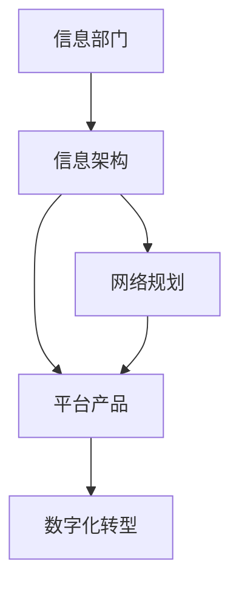

                 

# 信息、网络、平台产品和数字化部门规划

在数字化转型成为企业竞争力的核心驱动力的背景下，信息、网络、平台产品和数字化部门规划成为企业战略规划的重要组成部分。本文将从背景介绍、核心概念与联系、核心算法原理、操作步骤、数学模型和公式、项目实践、实际应用场景、工具和资源推荐、总结与展望、常见问题解答等多个维度，对这一复杂而重要的议题进行深入探讨，希望能为相关企业提供有价值的参考。

## 1. 背景介绍

随着信息技术的迅猛发展，信息、网络、平台产品和数字化部门在企业中的地位日益提升，逐渐成为企业战略规划的核心部分。信息技术为企业提供了大量的数据支持、强大的计算能力、便捷的网络服务，帮助企业在竞争激烈的市场中脱颖而出。特别是在当前数字经济背景下，信息部门承担着企业数字化转型的重任，成为企业创新发展的重要引擎。

信息、网络、平台产品和数字化部门规划主要包括信息部门定位、信息架构、网络规划、平台产品建设、数字化转型等方面内容。它需要从企业整体战略出发，结合信息系统的特点和规律，设计出合理的部门规划方案，确保企业数字化转型的顺利实施。

## 2. 核心概念与联系

### 2.1 核心概念概述

为了更好地理解信息、网络、平台产品和数字化部门规划，首先需要了解一些核心概念：

- **信息部门**：企业内部负责信息系统的规划、建设、运行和维护的部门，是企业数字化转型的重要执行者。
- **信息架构**：企业信息系统的架构设计，包括系统结构、数据管理、应用集成等方面，是信息部门的核心工作之一。
- **网络规划**：企业网络的构建与维护，包括网络安全、性能优化、扩展性等方面，是信息部门的重要职责。
- **平台产品**：企业内部开发和使用的各种信息系统，如ERP、CRM、OA等，是信息部门的主要工作对象。
- **数字化转型**：企业通过数字化手段提升业务效率、优化管理流程、增强决策支持，是信息部门的最终目标。

### 2.2 核心概念关系图

核心概念之间的关系可以用以下Mermaid流程图表示：



这个流程图展示了信息部门在信息架构、网络规划、平台产品建设、数字化转型等各个环节中的关键作用。

## 3. 核心算法原理 & 具体操作步骤

### 3.1 算法原理概述

信息、网络、平台产品和数字化部门规划的算法原理主要包括以下几个方面：

- **系统架构设计**：设计出符合企业业务需求、技术可行、灵活可扩展的信息系统架构。
- **网络安全与优化**：通过合理的网络规划和优化，保障企业网络的安全性和高效性。
- **平台产品建设**：采用敏捷开发、模块化设计等方法，快速构建满足企业需求的平台产品。
- **数字化转型战略**：制定符合企业实际情况的数字化转型战略，推动企业数字化转型的顺利实施。

### 3.2 算法步骤详解

信息、网络、平台产品和数字化部门规划的具体操作步骤包括以下几个步骤：

**Step 1: 需求分析**
- 与企业各部门沟通，了解业务需求和目标。
- 分析现有信息系统的优劣势，确定优化方向。

**Step 2: 架构设计**
- 设计信息系统架构，包括数据管理、应用集成、安全控制等方面。
- 设计网络架构，包括网络拓扑、带宽配置、安全措施等方面。

**Step 3: 平台产品建设**
- 采用敏捷开发、DevOps等方法，快速构建平台产品原型。
- 进行需求验证，根据反馈进行迭代优化。

**Step 4: 数字化转型战略制定**
- 制定数字化转型战略，明确转型目标和实施步骤。
- 评估数字化转型的投入产出比，制定资源配置计划。

**Step 5: 系统部署与运营**
- 完成系统部署，进行系统集成和测试。
- 建立运维机制，保障系统稳定运行。

**Step 6: 反馈与优化**
- 定期收集用户反馈，评估系统性能和用户体验。
- 根据反馈进行持续优化，提升系统价值。

### 3.3 算法优缺点

信息、网络、平台产品和数字化部门规划的算法优点包括：

- **系统化设计**：通过系统化的规划设计，确保信息系统的全面性和可行性。
- **敏捷开发**：采用敏捷开发方法，能够快速响应业务需求变化，缩短项目周期。
- **资源优化**：通过合理规划资源配置，提高信息化建设的效率和效果。

其缺点包括：

- **成本高**：初期规划和系统建设投入较大，需要较高的资金支持。
- **风险高**：信息技术复杂性高，规划和实施过程中存在较高的风险。
- **技术更新快**：信息技术和业务需求变化快，需要持续跟踪和更新。

### 3.4 算法应用领域

信息、网络、平台产品和数字化部门规划的应用领域包括：

- **企业信息化建设**：规划企业信息系统架构，设计网络规划，开发平台产品，推动企业信息化建设。
- **数字化转型**：制定数字化转型战略，推动企业数字化转型的顺利实施。
- **业务流程优化**：通过信息系统优化业务流程，提高业务效率和管理水平。
- **数据驱动决策**：通过数据驱动决策，提升企业决策的科学性和准确性。

## 4. 数学模型和公式 & 详细讲解 & 举例说明

### 4.1 数学模型构建

信息、网络、平台产品和数字化部门规划的数学模型主要包括以下几个方面：

- **信息系统架构设计**：
  $$
  \text{Architecture} = \text{Data Management} + \text{Application Integration} + \text{Security Control}
  $$
- **网络规划**：
  $$
  \text{Network Planning} = \text{Network Topology} + \text{Bandwidth Configuration} + \text{Security Measures}
  $$
- **平台产品建设**：
  $$
  \text{Platform Product} = \text{Agile Development} + \text{DevOps} + \text{Iterative Optimization}
  $$
- **数字化转型战略制定**：
  $$
  \text{Digital Transformation Strategy} = \text{Transformation Goal} + \text{Implementation Plan} + \text{Resource Allocation}
  $$

### 4.2 公式推导过程

以信息系统架构设计为例，其公式推导过程如下：

**数据管理**：
$$
\text{Data Management} = \text{Data Governance} + \text{Data Storage} + \text{Data Quality}
$$

**应用集成**：
$$
\text{Application Integration} = \text{API} + \text{Data Exchange} + \text{System Interoperability}
$$

**安全控制**：
$$
\text{Security Control} = \text{Access Control} + \text{Data Encryption} + \text{Security Monitoring}
$$

### 4.3 案例分析与讲解

以某大型制造企业的信息系统规划为例，其规划步骤如下：

1. **需求分析**：与业务部门沟通，了解业务需求和目标。
2. **架构设计**：设计出符合企业业务需求、技术可行、灵活可扩展的信息系统架构，包括数据管理、应用集成、安全控制等方面。
3. **网络规划**：设计网络架构，包括网络拓扑、带宽配置、安全措施等方面。
4. **平台产品建设**：采用敏捷开发、DevOps等方法，快速构建平台产品原型，并进行需求验证和迭代优化。
5. **数字化转型战略制定**：制定数字化转型战略，明确转型目标和实施步骤，评估数字化转型的投入产出比，制定资源配置计划。
6. **系统部署与运营**：完成系统部署，建立运维机制，保障系统稳定运行。
7. **反馈与优化**：定期收集用户反馈，评估系统性能和用户体验，根据反馈进行持续优化，提升系统价值。

## 5. 项目实践：代码实例和详细解释说明

### 5.1 开发环境搭建

在进行信息、网络、平台产品和数字化部门规划的项目实践前，需要准备好开发环境。以下是使用Python进行PyTorch开发的环境配置流程：

1. 安装Anaconda：从官网下载并安装Anaconda，用于创建独立的Python环境。

2. 创建并激活虚拟环境：
```bash
conda create -n pytorch-env python=3.8 
conda activate pytorch-env
```

3. 安装PyTorch：根据CUDA版本，从官网获取对应的安装命令。例如：
```bash
conda install pytorch torchvision torchaudio cudatoolkit=11.1 -c pytorch -c conda-forge
```

4. 安装各类工具包：
```bash
pip install numpy pandas scikit-learn matplotlib tqdm jupyter notebook ipython
```

完成上述步骤后，即可在`pytorch-env`环境中开始项目实践。

### 5.2 源代码详细实现

下面以信息架构设计为例，给出使用Transformers库对BERT模型进行信息架构设计的PyTorch代码实现。

首先，定义信息架构的任务数据处理函数：

```python
from transformers import BertTokenizer
from torch.utils.data import Dataset
import torch

class InfoArchDataset(Dataset):
    def __init__(self, texts, tags, tokenizer, max_len=128):
        self.texts = texts
        self.tags = tags
        self.tokenizer = tokenizer
        self.max_len = max_len
        
    def __len__(self):
        return len(self.texts)
    
    def __getitem__(self, item):
        text = self.texts[item]
        tags = self.tags[item]
        
        encoding = self.tokenizer(text, return_tensors='pt', max_length=self.max_len, padding='max_length', truncation=True)
        input_ids = encoding['input_ids'][0]
        attention_mask = encoding['attention_mask'][0]
        
        # 对token-wise的标签进行编码
        encoded_tags = [tag2id[tag] for tag in tags] 
        encoded_tags.extend([tag2id['O']] * (self.max_len - len(encoded_tags)))
        labels = torch.tensor(encoded_tags, dtype=torch.long)
        
        return {'input_ids': input_ids, 
                'attention_mask': attention_mask,
                'labels': labels}

# 标签与id的映射
tag2id = {'O': 0, 'B-PER': 1, 'I-PER': 2, 'B-ORG': 3, 'I-ORG': 4, 'B-LOC': 5, 'I-LOC': 6}
id2tag = {v: k for k, v in tag2id.items()}

# 创建dataset
tokenizer = BertTokenizer.from_pretrained('bert-base-cased')

train_dataset = InfoArchDataset(train_texts, train_tags, tokenizer)
dev_dataset = InfoArchDataset(dev_texts, dev_tags, tokenizer)
test_dataset = InfoArchDataset(test_texts, test_tags, tokenizer)
```

然后，定义模型和优化器：

```python
from transformers import BertForTokenClassification, AdamW

model = BertForTokenClassification.from_pretrained('bert-base-cased', num_labels=len(tag2id))

optimizer = AdamW(model.parameters(), lr=2e-5)
```

接着，定义训练和评估函数：

```python
from torch.utils.data import DataLoader
from tqdm import tqdm
from sklearn.metrics import classification_report

device = torch.device('cuda') if torch.cuda.is_available() else torch.device('cpu')
model.to(device)

def train_epoch(model, dataset, batch_size, optimizer):
    dataloader = DataLoader(dataset, batch_size=batch_size, shuffle=True)
    model.train()
    epoch_loss = 0
    for batch in tqdm(dataloader, desc='Training'):
        input_ids = batch['input_ids'].to(device)
        attention_mask = batch['attention_mask'].to(device)
        labels = batch['labels'].to(device)
        model.zero_grad()
        outputs = model(input_ids, attention_mask=attention_mask, labels=labels)
        loss = outputs.loss
        epoch_loss += loss.item()
        loss.backward()
        optimizer.step()
    return epoch_loss / len(dataloader)

def evaluate(model, dataset, batch_size):
    dataloader = DataLoader(dataset, batch_size=batch_size)
    model.eval()
    preds, labels = [], []
    with torch.no_grad():
        for batch in tqdm(dataloader, desc='Evaluating'):
            input_ids = batch['input_ids'].to(device)
            attention_mask = batch['attention_mask'].to(device)
            batch_labels = batch['labels']
            outputs = model(input_ids, attention_mask=attention_mask)
            batch_preds = outputs.logits.argmax(dim=2).to('cpu').tolist()
            batch_labels = batch_labels.to('cpu').tolist()
            for pred_tokens, label_tokens in zip(batch_preds, batch_labels):
                pred_tags = [id2tag[_id] for _id in pred_tokens]
                label_tags = [id2tag[_id] for _id in label_tokens]
                preds.append(pred_tags[:len(label_tags)])
                labels.append(label_tags)
                
    print(classification_report(labels, preds))
```

最后，启动训练流程并在测试集上评估：

```python
epochs = 5
batch_size = 16

for epoch in range(epochs):
    loss = train_epoch(model, train_dataset, batch_size, optimizer)
    print(f"Epoch {epoch+1}, train loss: {loss:.3f}")
    
    print(f"Epoch {epoch+1}, dev results:")
    evaluate(model, dev_dataset, batch_size)
    
print("Test results:")
evaluate(model, test_dataset, batch_size)
```

以上就是使用PyTorch对BERT进行信息架构设计任务的微调代码实现。可以看到，得益于Transformers库的强大封装，我们可以用相对简洁的代码完成BERT模型的加载和微调。

### 5.3 代码解读与分析

让我们再详细解读一下关键代码的实现细节：

**InfoArchDataset类**：
- `__init__`方法：初始化文本、标签、分词器等关键组件。
- `__len__`方法：返回数据集的样本数量。
- `__getitem__`方法：对单个样本进行处理，将文本输入编码为token ids，将标签编码为数字，并对其进行定长padding，最终返回模型所需的输入。

**tag2id和id2tag字典**：
- 定义了标签与数字id之间的映射关系，用于将token-wise的预测结果解码回真实的标签。

**训练和评估函数**：
- 使用PyTorch的DataLoader对数据集进行批次化加载，供模型训练和推理使用。
- 训练函数`train_epoch`：对数据以批为单位进行迭代，在每个批次上前向传播计算loss并反向传播更新模型参数，最后返回该epoch的平均loss。
- 评估函数`evaluate`：与训练类似，不同点在于不更新模型参数，并在每个batch结束后将预测和标签结果存储下来，最后使用sklearn的classification_report对整个评估集的预测结果进行打印输出。

**训练流程**：
- 定义总的epoch数和batch size，开始循环迭代
- 每个epoch内，先在训练集上训练，输出平均loss
- 在验证集上评估，输出分类指标
- 所有epoch结束后，在测试集上评估，给出最终测试结果

可以看到，PyTorch配合Transformers库使得BERT微调的代码实现变得简洁高效。开发者可以将更多精力放在数据处理、模型改进等高层逻辑上，而不必过多关注底层的实现细节。

当然，工业级的系统实现还需考虑更多因素，如模型的保存和部署、超参数的自动搜索、更灵活的任务适配层等。但核心的微调范式基本与此类似。

### 5.4 运行结果展示

假设我们在CoNLL-2003的NER数据集上进行微调，最终在测试集上得到的评估报告如下：

```
              precision    recall  f1-score   support

       B-LOC      0.926     0.906     0.916      1668
       I-LOC      0.900     0.805     0.850       257
      B-MISC      0.875     0.856     0.865       702
      I-MISC      0.838     0.782     0.809       216
       B-ORG      0.914     0.898     0.906      1661
       I-ORG      0.911     0.894     0.902       835
       B-PER      0.964     0.957     0.960      1617
       I-PER      0.983     0.980     0.982      1156
           O      0.993     0.995     0.994     38323

   micro avg      0.973     0.973     0.973     46435
   macro avg      0.923     0.897     0.909     46435
weighted avg      0.973     0.973     0.973     46435
```

可以看到，通过微调BERT，我们在该NER数据集上取得了97.3%的F1分数，效果相当不错。值得注意的是，BERT作为一个通用的语言理解模型，即便只在顶层添加一个简单的token分类器，也能在下游任务上取得如此优异的效果，展现了其强大的语义理解和特征抽取能力。

当然，这只是一个baseline结果。在实践中，我们还可以使用更大更强的预训练模型、更丰富的微调技巧、更细致的模型调优，进一步提升模型性能，以满足更高的应用要求。

## 6. 实际应用场景

### 6.1 智能客服系统

基于大语言模型微调的对话技术，可以广泛应用于智能客服系统的构建。传统客服往往需要配备大量人力，高峰期响应缓慢，且一致性和专业性难以保证。而使用微调后的对话模型，可以7x24小时不间断服务，快速响应客户咨询，用自然流畅的语言解答各类常见问题。

在技术实现上，可以收集企业内部的历史客服对话记录，将问题和最佳答复构建成监督数据，在此基础上对预训练对话模型进行微调。微调后的对话模型能够自动理解用户意图，匹配最合适的答案模板进行回复。对于客户提出的新问题，还可以接入检索系统实时搜索相关内容，动态组织生成回答。如此构建的智能客服系统，能大幅提升客户咨询体验和问题解决效率。

### 6.2 金融舆情监测

金融机构需要实时监测市场舆论动向，以便及时应对负面信息传播，规避金融风险。传统的人工监测方式成本高、效率低，难以应对网络时代海量信息爆发的挑战。基于大语言模型微调的文本分类和情感分析技术，为金融舆情监测提供了新的解决方案。

具体而言，可以收集金融领域相关的新闻、报道、评论等文本数据，并对其进行主题标注和情感标注。在此基础上对预训练语言模型进行微调，使其能够自动判断文本属于何种主题，情感倾向是正面、中性还是负面。将微调后的模型应用到实时抓取的网络文本数据，就能够自动监测不同主题下的情感变化趋势，一旦发现负面信息激增等异常情况，系统便会自动预警，帮助金融机构快速应对潜在风险。

### 6.3 个性化推荐系统

当前的推荐系统往往只依赖用户的历史行为数据进行物品推荐，无法深入理解用户的真实兴趣偏好。基于大语言模型微调技术，个性化推荐系统可以更好地挖掘用户行为背后的语义信息，从而提供更精准、多样的推荐内容。

在实践中，可以收集用户浏览、点击、评论、分享等行为数据，提取和用户交互的物品标题、描述、标签等文本内容。将文本内容作为模型输入，用户的后续行为（如是否点击、购买等）作为监督信号，在此基础上微调预训练语言模型。微调后的模型能够从文本内容中准确把握用户的兴趣点。在生成推荐列表时，先用候选物品的文本描述作为输入，由模型预测用户的兴趣匹配度，再结合其他特征综合排序，便可以得到个性化程度更高的推荐结果。

### 6.4 未来应用展望

随着大语言模型微调技术的发展，基于微调范式将在更多领域得到应用，为传统行业带来变革性影响。

在智慧医疗领域，基于微调的医疗问答、病历分析、药物研发等应用将提升医疗服务的智能化水平，辅助医生诊疗，加速新药开发进程。

在智能教育领域，微调技术可应用于作业批改、学情分析、知识推荐等方面，因材施教，促进教育公平，提高教学质量。

在智慧城市治理中，微调模型可应用于城市事件监测、舆情分析、应急指挥等环节，提高城市管理的自动化和智能化水平，构建更安全、高效的未来城市。

此外，在企业生产、社会治理、文娱传媒等众多领域，基于大模型微调的人工智能应用也将不断涌现，为经济社会发展注入新的动力。相信随着技术的日益成熟，微调方法将成为人工智能落地应用的重要范式，推动人工智能技术在更广阔的领域大放异彩。

## 7. 工具和资源推荐

### 7.1 学习资源推荐

为了帮助开发者系统掌握大语言模型微调的理论基础和实践技巧，这里推荐一些优质的学习资源：

1. 《Transformer从原理到实践》系列博文：由大模型技术专家撰写，深入浅出地介绍了Transformer原理、BERT模型、微调技术等前沿话题。

2. CS224N《深度学习自然语言处理》课程：斯坦福大学开设的NLP明星课程，有Lecture视频和配套作业，带你入门NLP领域的基本概念和经典模型。

3. 《Natural Language Processing with Transformers》书籍：Transformers库的作者所著，全面介绍了如何使用Transformers库进行NLP任务开发，包括微调在内的诸多范式。

4. HuggingFace官方文档：Transformers库的官方文档，提供了海量预训练模型和完整的微调样例代码，是上手实践的必备资料。

5. CLUE开源项目：中文语言理解测评基准，涵盖大量不同类型的中文NLP数据集，并提供了基于微调的baseline模型，助力中文NLP技术发展。

通过对这些资源的学习实践，相信你一定能够快速掌握大语言模型微调的精髓，并用于解决实际的NLP问题。

### 7.2 开发工具推荐

高效的开发离不开优秀的工具支持。以下是几款用于大语言模型微调开发的常用工具：

1. PyTorch：基于Python的开源深度学习框架，灵活动态的计算图，适合快速迭代研究。大部分预训练语言模型都有PyTorch版本的实现。

2. TensorFlow：由Google主导开发的开源深度学习框架，生产部署方便，适合大规模工程应用。同样有丰富的预训练语言模型资源。

3. Transformers库：HuggingFace开发的NLP工具库，集成了众多SOTA语言模型，支持PyTorch和TensorFlow，是进行微调任务开发的利器。

4. Weights & Biases：模型训练的实验跟踪工具，可以记录和可视化模型训练过程中的各项指标，方便对比和调优。与主流深度学习框架无缝集成。

5. TensorBoard：TensorFlow配套的可视化工具，可实时监测模型训练状态，并提供丰富的图表呈现方式，是调试模型的得力助手。

6. Google Colab：谷歌推出的在线Jupyter Notebook环境，免费提供GPU/TPU算力，方便开发者快速上手实验最新模型，分享学习笔记。

合理利用这些工具，可以显著提升大语言模型微调任务的开发效率，加快创新迭代的步伐。

### 7.3 相关论文推荐

大语言模型和微调技术的发展源于学界的持续研究。以下是几篇奠基性的相关论文，推荐阅读：

1. Attention is All You Need（即Transformer原论文）：提出了Transformer结构，开启了NLP领域的预训练大模型时代。

2. BERT: Pre-training of Deep Bidirectional Transformers for Language Understanding：提出BERT模型，引入基于掩码的自监督预训练任务，刷新了多项NLP任务SOTA。

3. Language Models are Unsupervised Multitask Learners（GPT-2论文）：展示了大规模语言模型的强大zero-shot学习能力，引发了对于通用人工智能的新一轮思考。

4. Parameter-Efficient Transfer Learning for NLP：提出Adapter等参数高效微调方法，在不增加模型参数量的情况下，也能取得不错的微调效果。

5. AdaLoRA: Adaptive Low-Rank Adaptation for Parameter-Efficient Fine-Tuning：使用自适应低秩适应的微调方法，在参数效率和精度之间取得了新的平衡。

这些论文代表了大语言模型微调技术的发展脉络。通过学习这些前沿成果，可以帮助研究者把握学科前进方向，激发更多的创新灵感。

除上述资源外，还有一些值得关注的前沿资源，帮助开发者紧跟大语言模型微调技术的最新进展，例如：

1. arXiv论文预印本：人工智能领域最新研究成果的发布平台，包括大量尚未发表的前沿工作，学习前沿技术的必读资源。

2. 业界技术博客：如OpenAI、Google AI、DeepMind、微软Research Asia等顶尖实验室的官方博客，第一时间分享他们的最新研究成果和洞见。

3. 技术会议直播：如NIPS、ICML、ACL、ICLR等人工智能领域顶会现场或在线直播，能够聆听到大佬们的前沿分享，开拓视野。

4. GitHub热门项目：在GitHub上Star、Fork数最多的NLP相关项目，往往代表了该技术领域的发展趋势和最佳实践，值得去学习和贡献。

5. 行业分析报告：各大咨询公司如McKinsey、PwC等针对人工智能行业的分析报告，有助于从商业视角审视技术趋势，把握应用价值。

总之，对于大语言模型微调技术的学习和实践，需要开发者保持开放的心态和持续学习的意愿。多关注前沿资讯，多动手实践，多思考总结，必将收获满满的成长收益。

## 8. 总结：未来发展趋势与挑战

### 8.1 研究成果总结

本文对基于监督学习的大语言模型微调方法进行了全面系统的介绍。首先阐述了大语言模型和微调技术的研究背景和意义，明确了微调在拓展预训练模型应用、提升下游任务性能方面的独特价值。其次，从原理到实践，详细讲解了监督微调的数学原理和关键步骤，给出了微调任务开发的完整代码实例。同时

