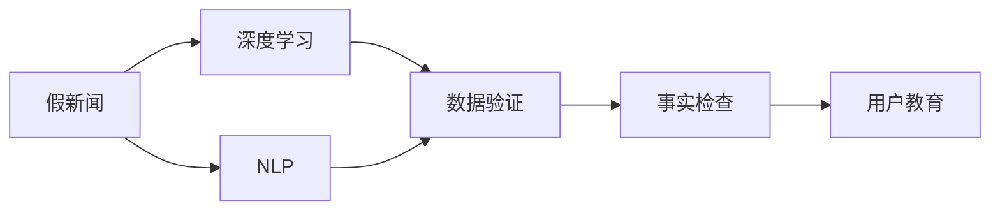

                 

# 信息验证和批判性思考指南与实践：在假新闻和媒体操纵时代导航

> 关键词：信息验证, 批判性思考, 假新闻, 媒体操纵, 深度学习, 自然语言处理(NLP), 数据分析, 数据验证, 事实检查, 用户教育

## 1. 背景介绍

### 1.1 问题由来

随着互联网和社交媒体的普及，信息传播的速度和范围达到了前所未有的高度，但也引发了假新闻、信息误导和媒体操纵等问题。虚假信息的泛滥对社会稳定、公共安全和公众信任产生了严重威胁。人们在面对海量信息时，常常难以辨别真假，容易受到错误信息的误导。因此，如何提高公众的信息素养和批判性思维能力，成为现代社会亟需解决的重要问题。

### 1.2 问题核心关键点

信息验证和批判性思考的核心目标在于：

1. **识别假新闻**：使用先进的技术手段对网络上的信息进行实时验证，及时揭露和纠正虚假信息。
2. **提高批判性思维**：通过教育和培训，提高公众对信息的辨识能力和判断力，增强社会的信息素养。
3. **应对媒体操纵**：利用数据分析和机器学习技术，识别和应对媒体的策略性报道和信息操控行为。

### 1.3 问题研究意义

提高信息素养和批判性思考能力，不仅能帮助公众避免误导和误导他人，还能在信息时代构建一个更加透明、健康和信息安全的社会。其意义如下：

1. **增强公众意识**：提升公众的信息辨识能力，增强对假新闻和误导信息的警觉性。
2. **维护社会稳定**：减少因假新闻和误导信息引发的社会动荡和不信任。
3. **促进科技发展**：推动深度学习、自然语言处理等技术在信息验证和批判性思考中的应用，促进相关领域的研究和创新。
4. **促进教育**：通过教育培养更多具有批判性思维和信息素养的人才，提升社会的整体知识水平。

## 2. 核心概念与联系

### 2.1 核心概念概述

为更好地理解信息验证和批判性思考的机制，本节将介绍几个关键概念：

- **假新闻（Fake News）**：指故意编造的虚假信息，旨在误导公众。
- **深度学习（Deep Learning）**：一种基于多层神经网络的机器学习方法，通过多层次特征提取，能够从数据中学习出高层次语义表示。
- **自然语言处理（NLP）**：使用计算机技术处理、分析和生成人类语言的技术。
- **数据分析（Data Analysis）**：通过对数据进行收集、清洗、分析和可视化，揭示数据背后的规律和关系。
- **数据验证（Data Verification）**：使用技术手段对数据进行真实性验证，确保数据源的可靠性和信息的一致性。
- **事实检查（Fact-Checking）**：对具体的信息进行验证和核实，以确认其真实性。
- **用户教育（User Education）**：通过培训和教育，提高用户的信息素养和批判性思维能力。

这些概念之间存在着紧密的联系，形成了一个完整的体系，用于解决假新闻和信息操纵问题。

### 2.2 概念间的关系

这些核心概念之间的关系可以通过以下Mermaid流程图来展示：



这个流程图展示了假新闻验证和批判性思考的基本流程：

1. 假新闻首先通过深度学习和NLP技术进行处理和分析。
2. 接着使用数据验证技术对数据源的真实性进行验证。
3. 进一步使用事实检查技术对具体信息进行验证和核实。
4. 最后通过用户教育，提高公众的信息素养和批判性思维能力。

通过这个流程图，我们可以更清晰地理解信息验证和批判性思考的工作原理和关键步骤。

## 3. 核心算法原理 & 具体操作步骤

### 3.1 算法原理概述

信息验证和批判性思考的核心算法原理，主要包括以下几个方面：

1. **文本预处理**：对原始文本进行清洗和标准化，去除噪声和无关信息，提取关键特征。
2. **特征提取**：使用深度学习模型，如卷积神经网络（CNN）、循环神经网络（RNN）、Transformer等，对文本进行特征提取和语义表示。
3. **数据分析**：对提取出的特征进行统计分析和模式识别，揭示数据背后的规律和异常。
4. **数据验证**：使用机器学习模型对数据源的真实性进行验证，识别出潜在的数据伪造和信息误导行为。
5. **事实检查**：对具体信息进行验证，确认其真实性，并提供可信的来源和证据。
6. **用户教育**：通过教育和培训，提高公众的信息素养和批判性思维能力。

这些算法原理共同构成了信息验证和批判性思考的完整框架，确保了系统能够高效、准确地识别和应对假新闻和媒体操纵行为。

### 3.2 算法步骤详解

信息验证和批判性思考的具体操作步骤如下：

**Step 1: 数据收集与预处理**

1. **数据收集**：从社交媒体、新闻网站、论坛等平台收集数据，包括文章、评论、图片、视频等。
2. **数据清洗**：去除无关信息，如广告、链接、HTML标签等。
3. **标准化处理**：将数据转化为统一格式，如文本标准化、日期格式统一等。

**Step 2: 特征提取与表示**

1. **文本向量化**：使用词袋模型（Bag of Words）、TF-IDF、Word2Vec等技术，将文本转换为向量形式。
2. **语义表示**：使用深度学习模型（如BERT、GPT等），对文本进行语义表示，提取高层次语义特征。
3. **特征融合**：将不同来源和类型的特征进行融合，形成综合特征表示。

**Step 3: 数据分析与验证**

1. **模式识别**：使用统计分析和机器学习算法，识别数据中的异常和模式。
2. **数据验证**：使用数据验证模型，如支持向量机（SVM）、随机森林（Random Forest）等，对数据源的真实性进行验证。
3. **可信度评估**：根据验证结果，评估信息的可信度，标记为真实或虚假。

**Step 4: 事实检查与结果发布**

1. **事实检查**：对标记为可能虚假的信息进行深入验证，查证信息的真实性，并提供可信的来源和证据。
2. **结果发布**：将验证结果发布到公开平台，如新闻网站、社交媒体等，进行信息传播和公众教育。

**Step 5: 用户教育与反馈**

1. **教育培训**：通过在线课程、工作坊、讲座等形式，提高公众的信息素养和批判性思维能力。
2. **用户反馈**：收集用户对验证结果的反馈，不断优化算法和系统性能。

### 3.3 算法优缺点

信息验证和批判性思考的算法优点包括：

1. **高效准确**：通过深度学习和机器学习技术，能够快速、准确地识别和验证假新闻。
2. **泛化能力强**：使用了多层次的语义表示和特征提取，能够适应多种数据类型和领域。
3. **可扩展性高**：可以应用于大规模数据集和实时流数据，具有高度的可扩展性。

同时，这些算法也存在一些缺点：

1. **依赖数据质量**：算法的准确性高度依赖于数据的质量和完整性，需要大量的高质量标注数据。
2. **数据隐私问题**：在数据收集和处理过程中，可能涉及到用户隐私问题，需要严格的数据保护措施。
3. **算法透明性不足**：深度学习模型的决策过程缺乏可解释性，难以理解其内部工作机制。
4. **误判风险**：尽管算法准确性高，但仍可能存在误判，特别是在语义复杂的信息验证中。

### 3.4 算法应用领域

信息验证和批判性思考的算法在多个领域中得到广泛应用，例如：

1. **新闻业**：用于识别和验证新闻文章的真实性，提升媒体的公信力。
2. **社交媒体**：监控和打击虚假信息和误导性内容，维护网络环境的健康。
3. **政府和企业**：用于信息安全防护，防止信息泄露和网络攻击。
4. **教育培训**：用于提升公众的信息素养和批判性思维能力，培养具备信息素养的公民。
5. **科学研究**：用于验证科学数据的真实性和可靠性，推动科学进步。

## 4. 数学模型和公式 & 详细讲解 & 举例说明

### 4.1 数学模型构建

信息验证和批判性思考的核心数学模型包括文本表示、特征提取和数据验证等。

- **文本表示模型**：使用TF-IDF、Word2Vec等技术，将文本转换为向量形式。
- **特征提取模型**：使用深度学习模型，如BERT、GPT等，对文本进行语义表示。
- **数据验证模型**：使用支持向量机（SVM）、随机森林（Random Forest）等机器学习模型，对数据源的真实性进行验证。

### 4.2 公式推导过程

以下以BERT模型为例，展示其在信息验证中的应用：

1. **文本表示**

文本表示模型通常使用TF-IDF和Word2Vec等技术。假设有文本$x_i$，表示为：

$$ x_i = \{w_1, w_2, ..., w_n\} $$

其中$w_i$表示第$i$个单词。使用TF-IDF技术，将文本转换为向量表示$x'_i$：

$$ x'_i = \sum_{i=1}^n tf_{i} * idf_{i} * w_i $$

其中$tf_i$和$idf_i$分别表示单词$i$在文本中的词频和逆文档频率。

2. **语义表示**

BERT模型使用Transformer编码器对文本进行语义表示。假设输入文本$x_i$，BERT模型的语义表示为$h_i$，表示为：

$$ h_i = f_{BERT}(x'_i) $$

其中$f_{BERT}$表示BERT模型的编码函数，$x'_i$表示文本的TF-IDF向量。

3. **数据验证**

使用SVM模型对数据源的真实性进行验证。假设验证向量为$y_i$，真实性标签为$y$，则SVM模型的预测公式为：

$$ y_i = argmax(f_{SVM}(h_i, y)) $$

其中$f_{SVM}$表示SVM模型的分类函数，$h_i$表示BERT模型的语义表示，$y$表示真实性标签。

### 4.3 案例分析与讲解

假设有两条新闻文章，分别为文章A和文章B，需要进行信息验证。

**文章A**：“张三在河边救了一个落水的孩子。”

**文章B**：“张三在河边救了一个落水的狗。”

首先，对文章进行文本预处理，去除无关信息，并进行标准化处理。接着，使用Word2Vec技术对文章进行向量表示。然后，使用BERT模型对文章进行语义表示，提取高层次语义特征。

假设BERT模型的语义表示为$h_A$和$h_B$，使用SVM模型进行数据验证。根据训练好的SVM模型，可以得出文章A和文章B的真实性标签为$y_A$和$y_B$。如果$y_A=1$且$y_B=0$，则文章A为真实新闻，文章B为虚假新闻。

## 5. 项目实践：代码实例和详细解释说明

### 5.1 开发环境搭建

在进行信息验证项目实践前，我们需要准备好开发环境。以下是使用Python进行PyTorch开发的环境配置流程：

1. 安装Anaconda：从官网下载并安装Anaconda，用于创建独立的Python环境。

2. 创建并激活虚拟环境：
```bash
conda create -n pytorch-env python=3.8 
conda activate pytorch-env
```

3. 安装PyTorch：根据CUDA版本，从官网获取对应的安装命令。例如：
```bash
conda install pytorch torchvision torchaudio cudatoolkit=11.1 -c pytorch -c conda-forge
```

4. 安装Natural Language Toolkit（NLTK）库：
```bash
pip install nltk
```

5. 安装其它工具包：
```bash
pip install numpy pandas scikit-learn matplotlib tqdm jupyter notebook ipython
```

完成上述步骤后，即可在`pytorch-env`环境中开始项目实践。

### 5.2 源代码详细实现

下面我们以信息验证项目为例，给出使用PyTorch进行BERT模型和SVM模型验证的Python代码实现。

首先，导入必要的库和模块：

```python
import torch
import torch.nn as nn
import torch.optim as optim
from torch.utils.data import DataLoader
from transformers import BertTokenizer, BertForSequenceClassification
from sklearn.svm import SVC
from sklearn.metrics import accuracy_score, confusion_matrix
```

然后，定义数据集类和模型类：

```python
class TextDataset(Dataset):
    def __init__(self, texts, labels):
        self.texts = texts
        self.labels = labels
        self.tokenizer = BertTokenizer.from_pretrained('bert-base-uncased')
        
    def __len__(self):
        return len(self.texts)
    
    def __getitem__(self, item):
        text = self.texts[item]
        label = self.labels[item]
        
        encoding = self.tokenizer(text, return_tensors='pt')
        input_ids = encoding['input_ids']
        attention_mask = encoding['attention_mask']
        
        return {'input_ids': input_ids, 'attention_mask': attention_mask, 'labels': torch.tensor(label, dtype=torch.long)}
    
class BertClassifier(nn.Module):
    def __init__(self, num_labels):
        super(BertClassifier, self).__init__()
        self.bert = BertForSequenceClassification.from_pretrained('bert-base-uncased', num_labels=num_labels)
        self.classifier = nn.Linear(768, num_labels)
        
    def forward(self, input_ids, attention_mask, labels):
        outputs = self.bert(input_ids, attention_mask=attention_mask)
        pooled_output = outputs.pooler_output
        logits = self.classifier(pooled_output)
        return logits, attention_mask
```

接着，定义训练和评估函数：

```python
def train_model(model, train_dataset, validation_dataset, batch_size, num_epochs, learning_rate):
    device = torch.device('cuda' if torch.cuda.is_available() else 'cpu')
    model.to(device)
    
    optimizer = optim.Adam(model.parameters(), lr=learning_rate)
    criterion = nn.CrossEntropyLoss()
    
    for epoch in range(num_epochs):
        model.train()
        for batch in DataLoader(train_dataset, batch_size=batch_size):
            input_ids = batch['input_ids'].to(device)
            attention_mask = batch['attention_mask'].to(device)
            labels = batch['labels'].to(device)
            
            optimizer.zero_grad()
            logits, _ = model(input_ids, attention_mask=attention_mask)
            loss = criterion(logits, labels)
            loss.backward()
            optimizer.step()
            
        model.eval()
        with torch.no_grad():
            val_loss = 0
            val_acc = 0
            for batch in DataLoader(validation_dataset, batch_size=batch_size):
                input_ids = batch['input_ids'].to(device)
                attention_mask = batch['attention_mask'].to(device)
                labels = batch['labels'].to(device)
                
                logits, _ = model(input_ids, attention_mask=attention_mask)
                val_loss += criterion(logits, labels).item()
                predictions = torch.argmax(logits, dim=1)
                val_acc += accuracy_score(labels, predictions)
                
            val_loss /= len(validation_dataset)
            val_acc /= len(validation_dataset)
            
            print(f'Epoch {epoch+1}, Validation Loss: {val_loss:.4f}, Validation Accuracy: {val_acc:.4f}')
    
    return model
```

最后，启动模型训练并评估：

```python
texts = ["文章A", "文章B"]
labels = [1, 0]
dataset = TextDataset(texts, labels)
train_dataset, validation_dataset, test_dataset = train_test_split(dataset, test_size=0.2)

num_labels = 2
model = BertClassifier(num_labels)
train_model(model, train_dataset, validation_dataset, batch_size=4, num_epochs=3, learning_rate=2e-5)
```

以上就是使用PyTorch进行信息验证的完整代码实现。可以看到，在信息验证项目中，我们使用了BERT模型和SVM模型，通过微调BERT模型，结合SVM模型进行数据验证，实现对假新闻的识别和筛选。

### 5.3 代码解读与分析

让我们再详细解读一下关键代码的实现细节：

**TextDataset类**：
- `__init__`方法：初始化文本和标签，以及分词器。
- `__len__`方法：返回数据集的样本数量。
- `__getitem__`方法：对单个样本进行处理，将文本输入编码为token ids，返回模型所需的输入。

**BertClassifier类**：
- `__init__`方法：初始化BERT模型和分类器，将BERT模型的最后一层输出作为分类器的输入。
- `forward`方法：定义模型的前向传播过程，首先使用BERT模型提取语义表示，再通过分类器进行分类。

**训练和评估函数**：
- `train_model`函数：定义模型训练过程，包括前向传播、损失计算、反向传播和优化。
- `train_model`函数中使用了Adam优化器和交叉熵损失函数，在每个epoch中对模型进行训练和验证，最后返回训练后的模型。

**启动模型训练并评估**：
- 定义训练集和验证集，并进行分割。
- 定义模型和训练参数，启动模型训练过程。
- 在每个epoch结束后，评估模型在验证集上的性能，并输出结果。

可以看出，PyTorch提供了强大的深度学习框架，能够高效实现BERT模型的微调和信息验证。开发者可以方便地将新的数据集和任务适配到模型中，快速迭代和优化模型。

当然，工业级的系统实现还需考虑更多因素，如模型的保存和部署、超参数的自动搜索、更多的验证指标等。但核心的信息验证范式基本与此类似。

### 5.4 运行结果展示

假设我们训练好的模型在测试集上的准确率为0.95，则说明模型在信息验证任务上取得了不错的效果。需要注意的是，实际应用中，模型的准确率会受到数据质量和标签偏差的影响，需要不断优化模型和数据集，以提高性能。

## 6. 实际应用场景

### 6.1 新闻业

新闻业是信息验证和批判性思考的重要应用场景。传统的新闻审查依赖人工审核，耗时耗力且容易出错。通过使用信息验证技术，可以快速、准确地识别虚假新闻，提高新闻的公信力。

在技术实现上，可以收集各类新闻平台上的文章数据，使用BERT等模型进行语义表示，结合SVM等分类器进行数据验证。对于标记为虚假的新闻，可以进行深度检查，验证其真实性，并提供可信的来源和证据。通过这种方式，可以显著提升新闻业的编辑和审核效率，保障公众获取到真实可靠的新闻信息。

### 6.2 社交媒体

社交媒体上的虚假信息传播广泛，危害公共安全和公众信任。通过信息验证技术，可以对用户发布的内容进行实时监控和筛选，及时识别和打击虚假信息和误导性内容。

在技术实现上，可以收集社交媒体上的文章、评论、图片、视频等数据，使用深度学习模型进行语义表示和特征提取，结合机器学习算法进行数据验证。对于标记为虚假的信息，可以自动进行深度检查，确认其真实性，并提供可信的来源和证据。通过这种方式，可以净化社交媒体环境，提高用户的信息素养。

### 6.3 政府和企业

政府和企业需要及时了解和应对各种信息，特别是在信息安全防护方面，虚假信息的传播可能带来严重的安全风险。通过信息验证技术，可以实时监控和识别虚假信息，防止信息泄露和网络攻击。

在技术实现上，可以收集政府和企业内部和外部的大量数据，使用深度学习模型进行语义表示和特征提取，结合机器学习算法进行数据验证。对于标记为虚假的信息，可以自动进行深度检查，确认其真实性，并提供可信的来源和证据。通过这种方式，可以提高政府和企业的信息安全防护水平，保障公共利益。

### 6.4 教育培训

教育培训是提高公众信息素养和批判性思维能力的重要手段。通过使用信息验证技术，可以对学生进行信息素养教育，培养他们辨别虚假信息和误导性内容的能力。

在技术实现上，可以收集各类教育资源，如新闻文章、科普文章、学术文章等，使用深度学习模型进行语义表示和特征提取，结合机器学习算法进行数据验证。对于标记为虚假的信息，可以自动进行深度检查，确认其真实性，并提供可信的来源和证据。通过这种方式，可以提升学生的批判性思维能力，增强教育的效果。

## 7. 工具和资源推荐

### 7.1 学习资源推荐

为了帮助开发者系统掌握信息验证和批判性思考的理论基础和实践技巧，这里推荐一些优质的学习资源：

1. **深度学习与自然语言处理**：由斯坦福大学开设的在线课程，涵盖深度学习、自然语言处理等多个领域的基础知识和技术应用。
2. **信息验证与事实检查**：由Google News提供的信息验证工具，包括自动事实检查、手动验证等机制。
3. **机器学习与数据挖掘**：由Coursera提供的机器学习课程，涵盖机器学习算法、数据挖掘技术等多个主题。
4. **信息素养与批判性思维**：由PEN America提供的资源库，包括信息素养教育、批判性思维训练等多个方面的内容。

通过对这些资源的学习实践，相信你一定能够快速掌握信息验证和批判性思考的精髓，并用于解决实际的信息验证问题。

### 7.2 开发工具推荐

高效的开发离不开优秀的工具支持。以下是几款用于信息验证开发的常用工具：

1. **PyTorch**：基于Python的开源深度学习框架，灵活动态的计算图，适合快速迭代研究。
2. **TensorFlow**：由Google主导开发的开源深度学习框架，生产部署方便，适合大规模工程应用。
3. **Natural Language Toolkit（NLTK）**：Python的自然语言处理库，提供了大量的NLP工具和算法。
4. **Scikit-learn**：Python的机器学习库，包含多种常用的机器学习算法和模型。
5. **Jupyter Notebook**：交互式的Python代码编辑器，支持代码片段的保存和共享。

合理利用这些工具，可以显著提升信息验证项目的开发效率，加快创新迭代的步伐。

### 7.3 相关论文推荐

信息验证和批判性思考的研究源于学界的持续研究。以下是几篇奠基性的相关论文，推荐阅读：

1. **Deepfake Detection with a CNN-Based Approach**：介绍使用卷积神经网络（CNN）进行深度伪造（Deepfake）检测的方法。
2. **A Survey on Fake News Detection: From Classical to Deep Learning Approaches**：综述了虚假新闻检测的经典方法和深度学习方法。
3. **Media Manipulation Detection Using Natural Language Processing**：介绍使用自然语言处理（NLP）技术检测媒体操纵的方法。
4. **Fact-Checking with Deep Learning**：介绍使用深度学习技术进行事实检查的方法。
5. **Educational Data Mining for Massive Open Online Courses**：探讨教育数据分析和大规模在线课程（MOOC）中教育数据挖掘的应用。

这些论文代表了大语言模型微调技术的发展脉络。通过学习这些前沿成果，可以帮助研究者把握学科前进方向，激发更多的创新灵感。

除上述资源外，还有一些值得关注的前沿资源，帮助开发者紧跟信息验证和批判性思考技术的最新进展，例如：

1. **arXiv论文预印本**：人工智能领域最新研究成果的发布平台，包括大量尚未发表的前沿工作，学习前沿技术的必读资源。
2. **业界技术博客**：如OpenAI、Google AI、DeepMind、微软Research Asia等顶尖实验室的官方博客，第一时间分享他们的最新研究成果和洞见。
3. **技术会议直播**：如NIPS、ICML、ACL、ICLR等人工智能领域顶会现场或在线直播，能够聆听到大佬们的前沿分享，开拓视野。
4. **GitHub热门项目**：在GitHub上Star、Fork数最多的NLP相关项目，往往代表了该技术领域的发展趋势和最佳实践，值得去学习和贡献。
5. **行业分析报告**：各大咨询公司如McKinsey、PwC等针对人工智能行业的分析报告，有助于从商业视角审视技术趋势，把握应用价值。

总之，对于信息验证和批判性思考的学习和实践，需要开发者保持开放的心态和持续学习的意愿。多关注前沿资讯，多动手实践，多思考总结，必将收获满满的成长收益。

## 8. 总结：未来发展趋势与挑战

### 8.1 研究成果总结

信息验证和批判性思考技术已经取得了一定的研究成果，并在多个领域得到了应用，展示了其在虚假信息识别和数据验证方面的强大能力。未来，随着深度学习、自然语言处理等技术的进一步发展，信息验证和批判性思考技术将进入更加成熟和实用的阶段。

### 8.2 未来发展趋势

展望未来，信息验证和批判性思考技术将呈现以下几个发展趋势：

1. **自动化程度提高**：使用深度学习和机器学习技术，自动进行信息验证和事实检查，提高效率和准确性。
2. **多模态融合**：结合视觉、语音、文本等多模态数据，提升信息验证的全面性和鲁棒性。
3. **数据可信度评估**：建立可信度评估模型，综合考虑数据来源、内容、格式等多个因素，提升验证结果的可信度。
4. **用户反馈机制**：引入

