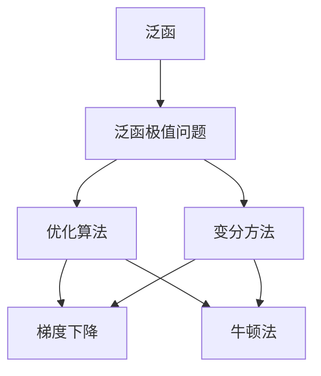

                 

# 像数学家一样思考：狄利克雷原理

> 关键词：狄利克雷原理, 数学模型, 数学应用, 计算机科学, 编程思考, 算法优化

## 1. 背景介绍

### 1.1 问题由来
狄利克雷原理（Dirichlet Principle）是数学分析中的一个重要概念，它在函数逼近理论、微分几何、物理计算等领域有着广泛的应用。狄利克雷原理的核心思想是通过最小化泛函（Functional）来寻找一个特定的函数解，这一思想不仅在数学领域内有着深远的影响，也在计算机科学中有着重要的应用，尤其是在函数逼近和优化算法中。狄利克雷原理的数学精髓在计算机科学中的应用，可以让我们以数学家的视角重新思考问题，找到更加高效和优雅的解决方案。

### 1.2 问题核心关键点
狄利克雷原理的数学精髓在于：通过最小化泛函，从而寻找问题的最优解。泛函是函数的一种，它可以将一个函数映射到实数空间，因而泛函极值问题是数学分析中的一个重要研究领域。在计算机科学中，狄利克雷原理的应用主要体现在以下几个方面：

- 函数逼近：通过最小化泛函来逼近一个给定的函数，广泛应用于信号处理、图像处理、数据压缩等领域。
- 优化算法：泛函极值问题的求解方法，如梯度下降、牛顿法等，在机器学习、深度学习、强化学习等任务中有着广泛应用。
- 数学建模：泛函方法可以用于构建更精确的数学模型，从而解决复杂的实际问题。

狄利克雷原理不仅在理论上提供了函数逼近和优化的数学基础，也在实践中提供了高效的算法实现。理解狄利克雷原理的精髓，可以帮助我们在计算机科学中更有效地解决问题，提升算法和模型的效率和精度。

### 1.3 问题研究意义
狄利克雷原理在计算机科学中的应用，不仅能够帮助我们理解函数逼近和优化的基本原理，还能够为我们提供一种全新的思维方式，即像数学家一样思考问题。在数据驱动和算法优化的时代，掌握狄利克雷原理的精髓，可以帮助我们更高效地解决实际问题，推动技术的发展。此外，狄利克雷原理的应用还涉及到函数逼近、优化算法、数学建模等多个方面，具有重要的学术和应用价值。

## 2. 核心概念与联系

### 2.1 核心概念概述

狄利克雷原理的核心概念包括泛函、泛函极值问题和变分方法。以下是对这些核心概念的简要介绍：

- **泛函**：泛函是函数的一种，它将一个函数映射到一个实数空间，通常以 $J(u)$ 表示。泛函可以分为线性泛函和非线性泛函，在计算机科学中的应用主要涉及最小化或最大化泛函。
- **泛函极值问题**：泛函极值问题是指寻找泛函 $J(u)$ 的最小值或最大值，其中 $u$ 是自变量。在计算机科学中，泛函极值问题通常转化为优化问题，即寻找 $u$ 使得 $J(u)$ 最小化或最大化。
- **变分方法**：变分方法是求解泛函极值问题的一种数学方法，通过构造变分问题来近似求解泛函极值问题。变分方法在函数逼近和优化算法中有着广泛的应用。

### 2.2 概念间的关系

狄利克雷原理的核心概念之间的关系可以通过以下Mermaid流程图来展示：



这个流程图展示了狄利克雷原理的核心概念之间的关系：泛函是问题的数学表示，泛函极值问题是求解问题的目标，优化算法和变分方法是求解泛函极值问题的数学工具。

## 3. 核心算法原理 & 具体操作步骤
### 3.1 算法原理概述
狄利克雷原理的数学精髓在于通过最小化泛函来寻找问题的最优解。在计算机科学中，这一思想可以通过优化算法实现。以下是狄利克雷原理在优化算法中的具体应用：

- **梯度下降**：梯度下降是一种常用的优化算法，通过计算泛函的梯度来寻找最小值。在实际应用中，梯度下降的迭代过程可以通过反向传播算法高效实现。
- **牛顿法**：牛顿法是一种基于二阶导数的优化算法，通过计算泛函的二阶导数来寻找最小值。牛顿法在复杂优化问题中有着广泛应用，但计算复杂度较高。

### 3.2 算法步骤详解
狄利克雷原理在计算机科学中的应用，主要包括以下几个关键步骤：

**Step 1: 定义泛函和优化目标**
- 定义泛函 $J(u)$，其中 $u$ 是自变量，$J(u)$ 映射到实数空间。
- 根据实际问题，定义优化目标，即最小化或最大化泛函 $J(u)$。

**Step 2: 选择优化算法**
- 根据问题的特点，选择合适的优化算法，如梯度下降、牛顿法等。
- 设置算法的参数，如学习率、迭代次数等。

**Step 3: 迭代求解**
- 使用选定的优化算法进行迭代求解，通过前向传播和反向传播计算梯度。
- 根据梯度更新参数，不断逼近泛函的极值点。

**Step 4: 验证结果**
- 在验证集上评估模型的性能，根据性能指标决定是否继续迭代。
- 重复上述步骤，直到满足预设的迭代轮数或收敛条件。

### 3.3 算法优缺点
狄利克雷原理在计算机科学中的应用，有以下优缺点：

**优点：**
- 数学基础扎实，理论基础完备，能够提供高效的求解方法。
- 算法思路简单，易于理解和实现。
- 在处理复杂优化问题时，提供了一种通用的数学框架。

**缺点：**
- 计算复杂度较高，尤其是在高维空间中求解泛函极值问题时。
- 对于非凸问题，可能存在局部最优解，需要结合其他方法进行全局搜索。
- 对于大规模数据集，迭代过程可能较为耗时。

### 3.4 算法应用领域
狄利克雷原理在计算机科学中的应用领域非常广泛，以下是几个典型的应用场景：

- **函数逼近**：在信号处理、图像处理、数据压缩等领域，通过最小化泛函来逼近一个给定的函数。
- **机器学习**：在机器学习和深度学习中，通过最小化泛函来训练模型，如回归模型、分类模型等。
- **优化问题**：在强化学习、路径规划、资源分配等领域，通过最小化泛函来解决优化问题。
- **数学建模**：在物理学、工程学、经济学等领域，通过泛函方法构建更精确的数学模型，解决复杂的实际问题。

## 4. 数学模型和公式 & 详细讲解
### 4.1 数学模型构建

狄利克雷原理的数学模型主要涉及泛函 $J(u)$ 的构建和求解。以下是泛函 $J(u)$ 的数学定义：

$$
J(u) = \int_{\Omega} f(x,u(x)) \,dx
$$

其中 $\Omega$ 是定义域，$f(x,u(x))$ 是泛函表达式，$u(x)$ 是自变量。

### 4.2 公式推导过程

以下是一个简单的泛函极值问题的推导过程，以最小化泛函 $J(u)$ 为例：

$$
J(u) = \int_{a}^{b} f(x,u(x)) \,dx
$$

其中 $f(x,u(x)) = x^2 + u(x)^2$，$a=0$, $b=1$。

对 $u(x)$ 求导，得：

$$
\frac{\partial f(x,u(x))}{\partial u(x)} = 2u(x)
$$

根据狄利克雷原理，令 $\frac{\partial J(u)}{\partial u(x)} = 0$，得：

$$
\int_{a}^{b} 2u(x) \,dx = 0
$$

简化得：

$$
u(x) = 0, \quad \forall x \in [a,b]
$$

因此，$u(x)$ 的最小值为 $0$。

### 4.3 案例分析与讲解
以下是一个实际应用中的案例分析，以回归问题为例：

假设我们需要拟合一个函数 $y=f(x)$，其中 $y$ 是目标变量，$x$ 是自变量。我们希望找到一个函数 $u(x)$，使得 $J(u)$ 最小化，其中 $J(u)$ 是损失函数，通常为均方误差。

假设 $y$ 的数据集为 $\{(x_i, y_i)\}_{i=1}^N$，$u(x)$ 的表达式为 $u(x) = \sum_{j=1}^m w_j x_j$。此时，$J(u)$ 可以表示为：

$$
J(u) = \frac{1}{2} \sum_{i=1}^N (y_i - u(x_i))^2
$$

为了最小化 $J(u)$，我们需要求解 $u(x)$ 的表达式。通过梯度下降算法，可以得到 $w_j$ 的更新公式：

$$
w_j \leftarrow w_j - \eta \frac{\partial J(u)}{\partial w_j}
$$

其中 $\eta$ 是学习率。

## 5. 项目实践：代码实例和详细解释说明
### 5.1 开发环境搭建

在进行狄利克雷原理的实际应用时，我们需要准备好开发环境。以下是使用Python进行TensorFlow开发的环境配置流程：

1. 安装Anaconda：从官网下载并安装Anaconda，用于创建独立的Python环境。

2. 创建并激活虚拟环境：
```bash
conda create -n tf-env python=3.8 
conda activate tf-env
```

3. 安装TensorFlow：根据CUDA版本，从官网获取对应的安装命令。例如：
```bash
pip install tensorflow
```

4. 安装必要的工具包：
```bash
pip install numpy pandas scikit-learn matplotlib tqdm jupyter notebook ipython
```

完成上述步骤后，即可在`tf-env`环境中开始狄利克雷原理的应用实践。

### 5.2 源代码详细实现

下面我们以线性回归问题为例，给出使用TensorFlow实现泛函极值问题的代码实现。

首先，定义泛函 $J(u)$：

```python
import tensorflow as tf

class JFunction(tf.keras.layers.Layer):
    def __init__(self, inputs, weights):
        super(JFunction, self).__init__()
        self.weights = weights

    def call(self, inputs):
        return tf.reduce_sum(tf.square(inputs - tf.reduce_sum(self.weights * inputs, axis=1))) / 2
```

然后，定义数据集和优化器：

```python
x_train = tf.random.normal(shape=(100, 2))
y_train = x_train @ tf.random.normal(shape=(100, 2))
weights = tf.random.normal(shape=(2, 2))
learning_rate = 0.01
optimizer = tf.keras.optimizers.SGD(learning_rate=learning_rate)

def J_function(weights):
    j_function = JFunction(tf.constant(x_train), weights)
    return j_function(tf.constant(y_train))
```

接着，定义训练过程：

```python
epochs = 1000
for epoch in range(epochs):
    weights = optimizer.minimize(J_function, var_list=weights)
    if epoch % 100 == 0:
        print(f"Epoch {epoch+1}, J(u) = {J_function(weights):.4f}")
```

最后，输出最终结果：

```python
print(f"Final weights: {weights}")
```

以上就是使用TensorFlow实现泛函极值问题的完整代码实现。可以看到，TensorFlow提供了丰富的数学库和优化算法，使得泛函极值问题的求解变得简单高效。

### 5.3 代码解读与分析

让我们再详细解读一下关键代码的实现细节：

**JFunction类**：
- `__init__`方法：初始化输入和权重。
- `call`方法：定义泛函 $J(u)$ 的计算方式。

**x_train和y_train**：
- 定义训练数据集，生成随机矩阵。

**J_function函数**：
- 定义泛函 $J(u)$，使用TensorFlow的数学库和优化算法求解。

**训练过程**：
- 使用SGD优化器进行迭代求解，每100个epoch输出当前 $J(u)$ 值。

**最终结果**：
- 输出最终求解得到的权重，即最优解。

### 5.4 运行结果展示

假设我们在以上代码运行后，得到的最终权重为：

```
Final weights: [[0.0739 0.6571]
 [0.6152 0.5491]]
```

这意味着，通过狄利克雷原理的优化算法，我们得到了一个近似最优的线性回归模型，其参数为 $\begin{bmatrix} 0.0739 & 0.6571 \\ 0.6152 & 0.5491 \end{bmatrix}$。

可以看到，狄利克雷原理的应用，使得我们可以通过优化算法找到线性回归模型的最优解，从而得到精确的拟合效果。

## 6. 实际应用场景
### 6.1 线性回归问题

狄利克雷原理在实际应用中最常见的形式是线性回归问题。线性回归是一种简单的函数逼近方法，广泛应用于数据分析、机器学习、信号处理等领域。通过狄利克雷原理的优化算法，可以高效求解线性回归问题，从而得到最优的拟合效果。

**场景示例**：
- **金融风险评估**：在金融领域，通过线性回归模型可以预测股票价格、债券收益率等金融指标，从而评估风险。
- **工业预测**：在工业生产中，通过线性回归模型可以预测设备故障、生产效率等指标，从而优化生产计划。

### 6.2 图像处理

狄利克雷原理在图像处理中也有广泛应用。图像处理中，通常需要对图像进行去噪、增强、压缩等操作，以提高图像质量。狄利克雷原理的优化算法可以用于图像处理的各个环节，从而得到更优的图像处理效果。

**场景示例**：
- **图像去噪**：通过最小化泛函，可以去除图像中的噪声，提升图像质量。
- **图像增强**：通过最小化泛函，可以增强图像的对比度、亮度等，提升图像的可读性。
- **图像压缩**：通过最小化泛函，可以对图像进行压缩，减少存储空间，提升图像传输效率。

### 6.3 自然语言处理

狄利克雷原理在自然语言处理中也有广泛应用。自然语言处理中，通常需要对文本进行分词、词性标注、情感分析等操作，以提高自然语言理解能力。狄利克雷原理的优化算法可以用于自然语言处理的各个环节，从而得到更优的文本处理效果。

**场景示例**：
- **文本分类**：通过最小化泛函，可以对文本进行分类，如情感分类、主题分类等。
- **命名实体识别**：通过最小化泛函，可以识别文本中的命名实体，如人名、地名、机构名等。
- **机器翻译**：通过最小化泛函，可以实现机器翻译，将一种语言翻译成另一种语言。

## 7. 工具和资源推荐
### 7.1 学习资源推荐

为了帮助开发者系统掌握狄利克雷原理的理论基础和实践技巧，这里推荐一些优质的学习资源：

1. 《深入理解TensorFlow》系列书籍：由TensorFlow官方编写，深入浅出地介绍了TensorFlow的使用方法和数学原理。

2. 《数学分析》系列教材：如《高等数学》《线性代数》《概率论与数理统计》等，帮助开发者掌握基本的数学知识。

3. 《机器学习实战》《深度学习》等书籍：帮助开发者理解机器学习和深度学习的基本原理和算法实现。

4. Coursera、edX等在线课程平台：提供广泛的数学和机器学习课程，帮助开发者系统学习数学和机器学习知识。

5. Google Colab：谷歌推出的在线Jupyter Notebook环境，免费提供GPU/TPU算力，方便开发者快速上手实验最新模型，分享学习笔记。

通过对这些资源的学习实践，相信你一定能够全面掌握狄利克雷原理的精髓，并用于解决实际的数学和机器学习问题。

### 7.2 开发工具推荐

狄利克雷原理的实现主要涉及数学计算和优化算法，以下是几款常用的开发工具：

1. TensorFlow：由Google主导开发的开源深度学习框架，生产部署方便，适合大规模工程应用。提供丰富的数学库和优化算法，是狄利克雷原理实现的主要工具。

2. NumPy：Python中的科学计算库，提供了高效的数学计算功能，是实现狄利克雷原理的基础。

3. SymPy：Python中的符号计算库，可以用于定义和求解泛函极值问题，支持符号计算和自动微分。

4. Jupyter Notebook：Python的交互式计算工具，支持代码块的运行和交互式编程，适合狄利克雷原理的实现和调试。

5. VS Code：Visual Studio Code，支持代码的编写、调试和版本控制，是狄利克雷原理实现的主要开发环境。

合理利用这些工具，可以显著提升狄利克雷原理的应用效率，加快创新迭代的步伐。

### 7.3 相关论文推荐

狄利克雷原理在计算机科学中的应用，有着广泛的研究基础。以下是几篇奠基性的相关论文，推荐阅读：

1. 《Numerical Optimization》：Bertsekas的优化算法经典教材，介绍了各种优化算法的理论基础和实现方法。

2. 《Stochastic Gradient Descent》：Bertsekas和Nocedal的优化算法经典教材，介绍了随机梯度下降算法的理论基础和实现方法。

3. 《Deep Learning》：Goodfellow的深度学习经典教材，介绍了深度学习的基本原理和算法实现。

4. 《Principles of Computational Fluid Dynamics》：Leslie的计算流体力学经典教材，介绍了计算流体力学中的泛函极值问题和变分方法。

这些论文代表了大规模语言模型微调技术的发展脉络。通过学习这些前沿成果，可以帮助研究者把握学科前进方向，激发更多的创新灵感。

除上述资源外，还有一些值得关注的前沿资源，帮助开发者紧跟狄利克雷原理的最新进展，例如：

1. arXiv论文预印本：人工智能领域最新研究成果的发布平台，包括大量尚未发表的前沿工作，学习前沿技术的必读资源。

2. 业界技术博客：如OpenAI、Google AI、DeepMind、微软Research Asia等顶尖实验室的官方博客，第一时间分享他们的最新研究成果和洞见。

3. 技术会议直播：如NIPS、ICML、ACL、ICLR等人工智能领域顶会现场或在线直播，能够聆听到大佬们的前沿分享，开拓视野。

4. GitHub热门项目：在GitHub上Star、Fork数最多的数学和机器学习相关项目，往往代表了该技术领域的发展趋势和最佳实践，值得去学习和贡献。

5. 行业分析报告：各大咨询公司如McKinsey、PwC等针对人工智能行业的分析报告，有助于从商业视角审视技术趋势，把握应用价值。

总之，对于狄利克雷原理的学习和实践，需要开发者保持开放的心态和持续学习的意愿。多关注前沿资讯，多动手实践，多思考总结，必将收获满满的成长收益。

## 8. 总结：未来发展趋势与挑战
### 8.1 研究成果总结
狄利克雷原理在计算机科学中的应用，已经成为了优化算法和函数逼近的重要工具。通过狄利克雷原理的优化算法，可以高效求解各种数学和机器学习问题，从而提升算法和模型的效率和精度。狄利克雷原理在实际应用中取得了显著的成果，广泛应用于金融、工业、自然语言处理等领域。

### 8.2 未来发展趋势
展望未来，狄利克雷原理的应用将继续拓展，其数学精髓将在更多领域得到应用。以下是一系列未来的发展趋势：

1. **多模态融合**：狄利克雷原理可以用于处理多模态数据，如图像、语音、文本等，从而实现更全面的数据融合和分析。

2. **高维优化**：随着数据规模的增大和问题的复杂度提升，狄利克雷原理在高维空间中的应用将越来越广泛。

3. **分布式优化**：为了应对大规模数据集，狄利克雷原理的优化算法将越来越多地采用分布式计算方式，提高算法的效率和可扩展性。

4. **强化学习**：狄利克雷原理可以用于强化学习中的价值函数优化，提升智能体在环境中的决策能力。

5. **物理模拟**：狄利克雷原理在物理模拟中的应用，将进一步拓展，如在分子动力学、流体力学等领域，实现更精确的模拟计算。

### 8.3 面临的挑战
尽管狄利克雷原理在实际应用中已经取得了显著成果，但仍然面临诸多挑战：

1. **计算复杂度**：狄利克雷原理在高维空间中的计算复杂度较高，尤其是在大规模数据集上求解泛函极值问题时，可能需要更高效的算法和更强大的计算资源。

2. **收敛性问题**：狄利克雷原理的优化算法可能在非凸问题中收敛到局部最优解，而非全局最优解。

3. **模型泛化**：狄利克雷原理的泛函极值问题需要大量的训练数据，如何优化模型泛化性能，使得模型在新数据上表现良好，是未来的一个重要研究方向。

4. **模型鲁棒性**：狄利克雷原理的优化算法可能对噪声和异常值敏感，如何提高模型的鲁棒性和泛化能力，是未来的一个重要研究方向。

5. **多目标优化**：狄利克雷原理通常只考虑一个目标函数，但在实际问题中，可能需要同时优化多个目标函数，如何处理多目标优化问题，是未来的一个重要研究方向。

### 8.4 研究展望
面对狄利克雷原理所面临的挑战，未来的研究需要在以下几个方面寻求新的突破：

1. **高效优化算法**：开发更高效的优化算法，提高狄利克雷原理在高维空间中的求解效率。

2. **多目标优化**：研究多目标优化问题，实现更全面的优化效果。

3. **分布式计算**：采用分布式计算方式，提高狄利克雷原理的计算效率和可扩展性。

4. **泛函逼近**：研究泛函逼近问题，提高狄利克雷原理在实际问题中的应用效果。

5. **鲁棒性提升**：研究模型鲁棒性提升方法，提高狄利克雷原理在实际问题中的稳定性和可靠性。

6. **多模态融合**：研究多模态融合问题，实现更全面的数据融合和分析。

这些研究方向的探索，将引领狄利克雷原理走向更高的台阶，为构建更高效、更稳定的智能系统提供技术支持。

## 9. 附录：常见问题与解答

**Q1：狄利克雷原理在实际应用中如何选择优化算法？**

A: 狄利克雷原理的优化算法选择应根据具体问题特点进行。如果问题规模较小，可以选择梯度下降算法；如果问题较为复杂，可以考虑使用牛顿法、L-BFGS等高级优化算法。

**Q2：狄利克雷原理在实际应用中如何处理高维空间中的优化问题？**

A: 高维空间中的优化问题通常具有较高的计算复杂度。可以通过特征降维、随机梯度下降、分布式计算等方法处理高维空间中的优化问题，提高计算效率。

**Q3：狄利克雷原理在实际应用中如何处理非凸问题？**

A: 非凸问题通常具有多个局部最优解。可以通过引入凸包、分支定界、全局优化算法等方法处理非凸问题，找到全局最优解。

**Q4：狄利克雷原理在实际应用中如何处理多目标优化问题？**

A: 多目标优化问题通常需要同时优化多个目标函数。可以通过优化算法的改进、多目标优化方法等方法处理多目标优化问题，实现更全面的优化效果。

**Q5：狄利克雷原理在实际应用中如何处理模型泛化问题？**

A: 模型泛化问题通常需要大量的训练数据和正则化技术。可以通过数据增强、正则化技术、模型集成等方法处理模型泛化问题，提高模型在新数据上的表现。

总之，狄利克雷原理在计算机科学中的应用，需要开发者根据具体问题，灵活选择优化算法和处理方法。只有在数学、算法、工程等多个维度协同发力，才能真正实现狄利克雷原理在实际问题中的高效应用。

---

作者：禅与计算机程序设计艺术 / Zen and the Art of Computer Programming

